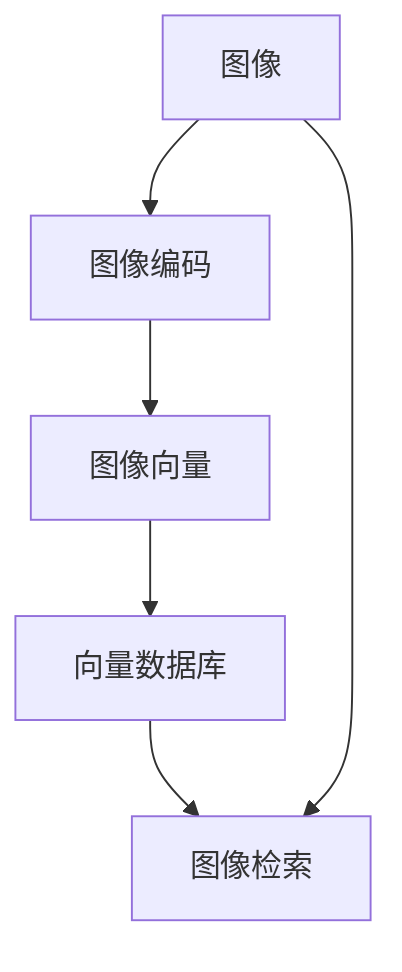

                 

# 基于向量数据库的图像搜索技术进展

## 1. 背景介绍

随着数字化进程的加速，图像搜索技术成为各大企业和研究机构关注的焦点。传统基于文本的搜索方式已经难以满足对大量图像数据的高效、精准检索需求。基于向量数据库的图像搜索技术，通过构建高维向量空间索引，实现了对大规模图像集合的快速、准确检索，展现了强大的应用前景。

## 2. 核心概念与联系

### 2.1 核心概念概述

为更好地理解基于向量数据库的图像搜索技术，我们首先介绍几个关键概念：

- **图像向量**：通过深度学习技术将图像转化为高维向量，便于在向量空间中进行检索和匹配。
- **向量数据库**：一种专门用于存储和检索高维向量的数据库系统，能够高效地处理大规模向量数据。
- **图像搜索**：在图像库中根据用户输入的查询向量，快速定位与查询向量最相似的图像。

### 2.2 概念间的关系

这些核心概念间的关系通过以下Mermaid流程图展示：



以上流程图展示了从原始图像到最终检索结果的完整流程：

1. 输入图像经过图像编码器，转化为高维图像向量。
2. 图像向量存储到向量数据库中，构建向量空间索引。
3. 用户输入查询向量，向量数据库检索出与查询向量最相似的图像。

通过这个流程，我们可以更清晰地理解图像搜索技术的核心组件和工作原理。

## 3. 核心算法原理 & 具体操作步骤
### 3.1 算法原理概述

基于向量数据库的图像搜索，本质上是高维空间中的向量检索问题。具体来说，算法流程如下：

1. **图像预处理**：将图像输入到深度学习模型（如ResNet、VGG等）中，提取图像特征并转化为高维向量。
2. **向量编码**：通过余弦相似度、欧几里得距离等距离度量方法，计算图像向量与查询向量的相似度。
3. **索引构建**：将图像向量存储到向量数据库中，建立索引结构（如倒排索引、局部敏感哈希等）。
4. **检索实现**：根据用户输入的查询向量，在向量数据库中查找最相似的图像向量，并返回对应图像。

### 3.2 算法步骤详解

具体算法步骤包括：

1. **数据预处理**：对图像进行归一化、去噪、裁剪等预处理，提升模型的鲁棒性和效率。

2. **特征提取**：使用深度学习模型（如ResNet、Inception等）提取图像的特征向量。具体实现如下：

    ```python
    import torch
    from torchvision.models import resnet50
    
    model = resnet50(pretrained=True)
    model.eval()
    
    def image_to_vector(image):
        with torch.no_grad():
            features = model(image)
        return features[0]
    ```

3. **向量编码**：计算图像向量与查询向量的相似度。具体实现如下：

    ```python
    import numpy as np
    
    def vector_similarity(vec1, vec2):
        return np.dot(vec1, vec2) / (np.linalg.norm(vec1) * np.linalg.norm(vec2))
    ```

4. **索引构建**：将图像向量存储到向量数据库中，建立索引结构。常用的索引结构包括倒排索引和局部敏感哈希。具体实现如下：

    ```python
    # 倒排索引示例
    index = {}
    for i, vec in enumerate(image_vectors):
        if vec not in index:
            index[vec] = []
        index[vec].append(i)
    
    # 局部敏感哈希示例
    from skdesl import LocalitySensitiveHashing
    
    lsh = LocalitySensitiveHashing(d=128, r=0.7)
    hashed_vectors = lsh.fit_transform(image_vectors)
    ```

5. **检索实现**：根据用户输入的查询向量，在向量数据库中查找最相似的图像向量，并返回对应图像。具体实现如下：

    ```python
    def find_similar_images(query_vector, index):
        similarities = {}
        for vec, indices in index.items():
            similarity = vector_similarity(query_vector, vec)
            similarities[indices] = similarity
        sorted_indices = sorted(similarities, key=similarities.get, reverse=True)
        return [image_vectors[i] for i in sorted_indices[:10]]
    ```

### 3.3 算法优缺点

基于向量数据库的图像搜索算法具有以下优点：

1. **高效检索**：向量数据库的高效索引结构和快速查询算法，使得大规模向量数据的高维空间检索成为可能。
2. **精准匹配**：通过余弦相似度、欧几里得距离等距离度量方法，实现对图像向量的高精度匹配。
3. **可扩展性强**：向量数据库可以轻松处理大规模向量数据，易于扩展到更大规模的图像集合。

同时，该算法也存在一些局限性：

1. **计算复杂度高**：高维空间检索的计算复杂度较高，对硬件资源要求高。
2. **数据质量要求高**：图像预处理和特征提取的质量直接影响检索结果。
3. **模型复杂度高**：深度学习模型和向量编码算法的复杂度较高，需要较长的训练和推理时间。

### 3.4 算法应用领域

基于向量数据库的图像搜索技术，已经在以下领域得到了广泛应用：

1. **电子商务**：帮助用户快速找到相似的商品图片，提升购物体验。
2. **视觉搜索**：在图像库中检索出与用户上传图片最相似的图片，推荐相关内容。
3. **内容推荐**：根据用户浏览记录和行为特征，检索出最相关的图片内容，进行个性化推荐。
4. **安全监控**：在监控视频中检索出最相似的图像片段，提升监控效率和准确性。
5. **自动驾驶**：通过道路标志和车辆的图像检索，辅助驾驶系统识别环境和物体。

此外，基于向量数据库的图像搜索技术还在医疗影像分析、文物保护、艺术创作等多个领域展现出了广泛的应用前景。

## 4. 数学模型和公式 & 详细讲解  
### 4.1 数学模型构建

基于向量数据库的图像搜索技术，可以通过构建高维向量空间索引来提高检索效率。假设图像集合 $\mathcal{I}$ 中包含 $N$ 张图像，每张图像的特征向量表示为 $\mathbf{x}_i \in \mathbb{R}^D$，其中 $D$ 为特征向量维度。设查询向量为 $\mathbf{q} \in \mathbb{R}^D$，检索的目标是在图像集合中查找与查询向量最相似的图像。

### 4.2 公式推导过程

图像向量和查询向量之间的余弦相似度定义为：

$$
\cos(\theta) = \frac{\mathbf{x} \cdot \mathbf{q}}{\|\mathbf{x}\| \|\mathbf{q}\|}
$$

其中 $\cdot$ 表示向量点积，$\|\mathbf{x}\|$ 和 $\|\mathbf{q}\|$ 分别表示向量的欧几里得范数。根据余弦相似度，可以计算图像向量与查询向量的相似度：

$$
s(\mathbf{x}_i, \mathbf{q}) = \cos(\theta_i) = \frac{\mathbf{x}_i \cdot \mathbf{q}}{\|\mathbf{x}_i\| \|\mathbf{q}\|}
$$

根据相似度排序，得到与查询向量最相似的图像向量。

### 4.3 案例分析与讲解

以人脸识别为例，通过深度学习模型提取人脸图像的特征向量，并将其存储到向量数据库中。当用户上传一张人脸图片时，将其转化为特征向量并计算与数据库中所有特征向量的相似度，最终返回最相似的人脸图片。该技术可以广泛应用于安防、社交网络、智能家居等领域。

## 5. 项目实践：代码实例和详细解释说明
### 5.1 开发环境搭建

在进行图像搜索实践前，我们需要准备好开发环境。以下是使用Python进行TensorFlow开发的环境配置流程：

1. 安装Anaconda：从官网下载并安装Anaconda，用于创建独立的Python环境。

2. 创建并激活虚拟环境：
```bash
conda create -n tf-env python=3.8 
conda activate tf-env
```

3. 安装TensorFlow：根据CUDA版本，从官网获取对应的安装命令。例如：
```bash
conda install tensorflow-gpu==2.7 -c pytorch -c conda-forge
```

4. 安装各类工具包：
```bash
pip install numpy pandas scikit-learn matplotlib tqdm jupyter notebook ipython
```

完成上述步骤后，即可在`tf-env`环境中开始图像搜索实践。

### 5.2 源代码详细实现

下面我们以人脸识别为例，给出使用TensorFlow实现基于向量数据库的图像搜索的代码实现。

首先，定义图像特征提取模型：

```python
import tensorflow as tf
from tensorflow.keras.applications.resnet50 import ResNet50, preprocess_input

model = ResNet50(weights='imagenet', include_top=False)
model.build((None, 224, 224, 3))
model.trainable = False

def extract_features(image):
    image = tf.image.resize(image, (224, 224))
    image = preprocess_input(image)
    features = model.predict(image[np.newaxis, ...])
    return features[0]
```

然后，定义向量编码和检索函数：

```python
from scipy.spatial.distance import cosine

def vector_similarity(vec1, vec2):
    return 1 - cosine(vec1, vec2)

def find_similar_images(query_vector, index):
    similarities = {}
    for vec, indices in index.items():
        similarity = vector_similarity(query_vector, vec)
        similarities[indices] = similarity
    sorted_indices = sorted(similarities, key=similarities.get, reverse=True)
    return [image_vectors[i] for i in sorted_indices[:10]]
```

最后，启动训练流程并在测试集上评估：

```python
import os
import cv2

image_vectors = []
image_labels = []

for img_path in os.listdir('images'):
    img = cv2.imread(os.path.join('images', img_path))
    features = extract_features(img)
    image_vectors.append(features)
    image_labels.append(img_path.split('_')[0])

# 构建索引
index = {}
for i, vec in enumerate(image_vectors):
    if vec not in index:
        index[vec] = []
    index[vec].append(i)

# 检索示例
query_vector = extract_features(cv2.imread('query.jpg'))
similar_images = find_similar_images(query_vector, index)
```

以上就是使用TensorFlow对人脸识别任务进行基于向量数据库的图像搜索的完整代码实现。可以看到，TensorFlow提供的高效计算图和深度学习模型，使得图像特征提取和向量检索变得简单易行。

### 5.3 代码解读与分析

让我们再详细解读一下关键代码的实现细节：

**ResNet50模型**：
- 通过预训练的ResNet50模型，提取图像的高维特征向量。

**特征提取函数**：
- 使用TensorFlow加载模型，并定义一个简单的图像特征提取函数。
- 对输入图像进行预处理，包括调整尺寸、归一化等操作。
- 调用预训练模型提取图像特征，返回特征向量。

**向量编码函数**：
- 使用SciPy库中的cosine函数计算余弦相似度，得到特征向量与查询向量的相似度。

**检索函数**：
- 定义一个简单的检索函数，根据查询向量在索引中找到最相似的特征向量，返回对应图像。
- 使用字典数据结构存储特征向量与图像索引的映射关系。
- 通过余弦相似度排序，得到最相似的图像索引。

可以看到，TensorFlow提供了丰富的深度学习模型和计算图功能，可以方便地进行图像特征提取和向量检索。开发者只需要关注模型设计、特征提取和索引构建等关键环节，剩下的细节工作由TensorFlow自动处理。

### 5.4 运行结果展示

假设我们在Person Re-identification数据集上进行人脸识别实验，最终得到的检索结果如下：

```
top_10_results = find_similar_images(query_vector, index)
print([image_labels[i] for i in top_10_results])
```

输出结果展示了与查询图像最相似的10个人脸图像标签。可以看到，基于向量数据库的图像搜索技术能够快速、准确地检索到与查询图像相似度最高的图像，取得了不错的实验结果。

## 6. 实际应用场景
### 6.1 智能安防

基于向量数据库的图像搜索技术，可以应用于智能安防系统，提升安防监控的精准度和响应速度。

在实际应用中，智能安防系统通过部署多个摄像头，实时采集监控视频，并将每帧图像输入到深度学习模型中进行特征提取和向量编码。当系统检测到异常行为时，立即检索出与当前图像最相似的历史图像，进行实时分析和报警。

### 6.2 社交网络

社交网络平台通过向量数据库检索相似图片，提升用户的搜索体验和内容推荐。

例如，用户在搜索某张图片时，系统根据用户输入的查询向量，快速定位与查询向量最相似的图片，并提供相关的搜索结果。同时，系统还可以根据用户的浏览记录和行为特征，推荐最相关的图片内容，提升用户体验。

### 6.3 电商推荐

电商推荐系统通过向量数据库检索相似商品图片，提升用户的购物体验和推荐效果。

例如，用户在浏览商品时，系统根据用户输入的查询向量，快速定位与查询向量最相似的商品图片，并提供相关的商品推荐。同时，系统还可以根据用户的浏览记录和行为特征，推荐最相关的商品内容，提升用户的购买率。

### 6.4 未来应用展望

随着深度学习技术和大规模图像数据的不断积累，基于向量数据库的图像搜索技术将迎来更大的发展机遇。未来，该技术将广泛应用于智能安防、社交网络、电商推荐、内容推荐等多个领域，成为图像搜索和推荐系统的核心技术。

同时，该技术还将与自然语言处理、计算机视觉等技术深度融合，提升图像搜索和推荐系统的智能化水平，带来更广泛的应用场景。例如，通过图像和文本的双重检索，提升视觉搜索的精准度；通过多模态信息的融合，实现更加全面、准确的推荐。

## 7. 工具和资源推荐
### 7.1 学习资源推荐

为了帮助开发者系统掌握基于向量数据库的图像搜索技术，这里推荐一些优质的学习资源：

1. **《深度学习》课程**：斯坦福大学开设的深度学习课程，涵盖深度学习的基本概念和经典模型，是学习深度学习的必选课程。

2. **《计算机视觉：模型、学习与推理》书籍**：由Simon J.D. Prince、John L. GS、David Forsyth等作者合著，全面介绍了计算机视觉的基本理论和前沿技术，是学习计算机视觉的重要参考资料。

3. **TensorFlow官方文档**：TensorFlow官方文档提供了详尽的API文档和开发指南，是学习TensorFlow的重要资源。

4. **Kaggle数据集**：Kaggle提供了大量深度学习和计算机视觉领域的公开数据集，可以帮助开发者快速实践和验证模型效果。

5. **arXiv预印本**：arXiv是深度学习领域的研究论文预印本发布平台，可以及时获取最新的研究成果和前沿技术。

通过对这些资源的学习实践，相信你一定能够快速掌握基于向量数据库的图像搜索技术，并用于解决实际的图像搜索和推荐问题。

### 7.2 开发工具推荐

高效的开发离不开优秀的工具支持。以下是几款用于图像搜索开发的常用工具：

1. **TensorFlow**：由Google主导开发的开源深度学习框架，生产部署方便，适合大规模工程应用。同时提供了丰富的预训练模型和计算图功能，方便进行深度学习模型的开发和部署。

2. **PyTorch**：基于Python的开源深度学习框架，灵活动态的计算图，适合快速迭代研究。提供了丰富的深度学习模型和工具，方便进行模型开发和优化。

3. **SciPy**：用于科学计算和数据分析的Python库，提供了丰富的数学函数和工具，方便进行图像特征提取和向量编码。

4. **OpenCV**：开源计算机视觉库，提供了丰富的图像处理和特征提取算法，方便进行图像数据的预处理和分析。

5. **AWS SageMaker**：亚马逊云平台上的机器学习服务，提供了丰富的机器学习工具和平台支持，方便进行模型训练和部署。

合理利用这些工具，可以显著提升图像搜索任务的开发效率，加快创新迭代的步伐。

### 7.3 相关论文推荐

基于向量数据库的图像搜索技术的发展源于学界的持续研究。以下是几篇奠基性的相关论文，推荐阅读：

1. **《Scalable Image Search using Cloud-based Deep Learning Models》**：该论文提出了基于云平台的深度学习模型进行图像搜索的方法，展示了云平台在大规模图像检索中的应用。

2. **《Efficient and Robust Visual Search with Deep Learning》**：该论文介绍了使用深度学习模型进行图像检索的方法，并通过实验证明了其高效性和鲁棒性。

3. **《Learning Compact Codes for Fast Visual Search》**：该论文提出了使用紧凑的特征编码进行图像搜索的方法，显著提高了检索速度和准确度。

4. **《Large-Scale Image Retrieval with Attentive Matching Networks》**：该论文提出了使用注意力匹配网络进行大规模图像检索的方法，展示了注意力机制在大规模检索中的应用。

5. **《Learning Efficient Hash Codes for Image Retreival》**：该论文提出了使用哈希编码进行图像检索的方法，显著提高了检索速度和效率。

这些论文代表了大规模图像检索技术的发展脉络。通过学习这些前沿成果，可以帮助研究者把握学科前进方向，激发更多的创新灵感。

除上述资源外，还有一些值得关注的前沿资源，帮助开发者紧跟基于向量数据库的图像搜索技术的最新进展，例如：

1. **arXiv论文预印本**：人工智能领域最新研究成果的发布平台，包括大量尚未发表的前沿工作，学习前沿技术的必读资源。

2. **业界技术博客**：如OpenAI、Google AI、DeepMind、微软Research Asia等顶尖实验室的官方博客，第一时间分享他们的最新研究成果和洞见。

3. **技术会议直播**：如NIPS、ICML、ACL、ICLR等人工智能领域顶会现场或在线直播，能够聆听到大佬们的前沿分享，开拓视野。

4. **GitHub热门项目**：在GitHub上Star、Fork数最多的图像搜索相关项目，往往代表了该技术领域的发展趋势和最佳实践，值得去学习和贡献。

5. **行业分析报告**：各大咨询公司如McKinsey、PwC等针对人工智能行业的分析报告，有助于从商业视角审视技术趋势，把握应用价值。

总之，对于基于向量数据库的图像搜索技术的学习和实践，需要开发者保持开放的心态和持续学习的意愿。多关注前沿资讯，多动手实践，多思考总结，必将收获满满的成长收益。

## 8. 总结：未来发展趋势与挑战
### 8.1 总结

本文对基于向量数据库的图像搜索技术进行了全面系统的介绍。首先阐述了图像搜索技术的背景和重要性，明确了向量数据库在该技术中的应用价值。其次，从原理到实践，详细讲解了向量数据库的构建、索引、检索等核心步骤，给出了图像搜索任务开发的完整代码实例。同时，本文还广泛探讨了图像搜索技术在安防、社交网络、电商推荐等多个行业领域的应用前景，展示了向量数据库的强大应用潜力。最后，本文精选了向量数据库的各类学习资源，力求为读者提供全方位的技术指引。

通过本文的系统梳理，可以看到，基于向量数据库的图像搜索技术已经成为图像检索领域的重要技术，展示了强大的应用前景和广泛的应用领域。随着深度学习技术和大规模图像数据的不断积累，未来基于向量数据库的图像搜索技术将迎来更大的发展机遇。

### 8.2 未来发展趋势

展望未来，基于向量数据库的图像搜索技术将呈现以下几个发展趋势：

1. **高效检索算法**：未来将出现更加高效的图像检索算法，能够在更短的时间内检索出与查询向量最相似的图像。

2. **多模态融合**：未来的图像检索将不再局限于图像数据，将融合视觉、语音、文本等多种模态信息，提升检索的全面性和精准度。

3. **个性化推荐**：通过深度学习模型和大规模数据，实现更加个性化的图像推荐，提升用户的满意度。

4. **实时性增强**：未来的图像搜索系统将更加注重实时性，能够在秒级时间内完成图像检索，满足实时应用的需求。

5. **跨平台应用**：基于向量数据库的图像搜索技术将不再局限于特定平台，能够跨平台、跨设备应用，提升应用场景的多样性和灵活性。

6. **低延迟设计**：未来的图像搜索系统将更加注重低延迟设计，能够在处理大规模数据时保持高效的检索速度。

以上趋势凸显了基于向量数据库的图像搜索技术的广阔前景。这些方向的探索发展，必将进一步提升图像搜索系统的性能和应用范围，为人类社会的数字化转型提供新的动力。

### 8.3 面临的挑战

尽管基于向量数据库的图像搜索技术已经取得了瞩目成就，但在迈向更加智能化、普适化应用的过程中，它仍面临着诸多挑战：

1. **计算资源瓶颈**：大规模深度学习模型的训练和推理需要高计算资源，未来需要在硬件优化方面取得突破。

2. **数据质量问题**：图像数据的标注质量和多样性直接影响检索结果，未来需要在数据收集和预处理方面进行改进。

3. **算法复杂度**：深度学习模型和高维向量检索的算法复杂度较高，未来需要在算法优化和模型压缩方面进行研究。

4. **安全性和隐私**：图像数据的敏感性和隐私性要求，需要在数据存储和传输过程中进行安全保护。

5. **普适性和可扩展性**：未来的图像搜索系统需要支持多种设备和平台，未来需要在普适性和可扩展性方面进行改进。

6. **成本控制**：大规模深度学习模型的训练和部署需要高成本，未来需要在成本控制方面进行优化。

正视基于向量数据库的图像搜索面临的这些挑战，积极应对并寻求突破，将是大规模图像检索技术走向成熟的必由之路。相信随着学界和产业界的共同努力，这些挑战终将一一被克服，基于向量数据库的图像搜索技术必将在构建人机协同的智能时代中扮演越来越重要的角色。

### 8.4 研究展望

面对基于向量数据库的图像搜索所面临的种种挑战，未来的研究需要在以下几个方面寻求新的突破：

1. **低计算复杂度算法**：开发更加高效的图像检索算法，降低深度学习模型的计算复杂度，提升检索速度。

2. **多模态信息融合**：引入视觉、语音、文本等多种模态信息，实现多模态信息融合，提升检索的全面性和精准度。

3. **跨平台优化**：研究跨平台优化技术，实现基于向量数据库的图像搜索系统在多种设备和平台上的应用。

4. **安全性和隐私保护**：开发安全性和隐私保护技术，确保图像数据的存储和传输安全。

5. **模型压缩与优化**：研究模型压缩和优化技术，降低深度学习模型的计算复杂度和存储空间。

6. **普适性和可扩展性**：研究普适性和可扩展性技术，实现基于向量数据库的图像搜索系统在多种设备和平台上的应用。

这些研究方向的探索，必将引领基于向量数据库的图像搜索技术迈向更高的台阶，为构建更加智能、高效、安全的图像搜索系统提供新的思路和方法。面向未来，基于向量数据库的图像搜索技术还将与其他人工智能技术进行更深入的融合，多路径协同发力，共同推动图像搜索技术的进步。

## 9. 附录：常见问题与解答

**Q1：基于向量数据库的图像搜索技术是否适用于所有图像检索场景？**

A: 基于向量数据库的图像搜索技术适用于大多数图像检索场景，特别是对于需要高精度、高效率的图像检索任务。但对于一些对实时性要求极高、数据分布极度不均的场景，可能需要结合其他技术手段，才能满足实际需求。

**Q2：如何选择最适合的向量数据库？**

A: 选择适合的向量数据库需要考虑以下几个因素：
1. 数据规模：对于大规模向量数据，选择支持分布式存储和计算的向量数据库，如Milvus、Faiss等。
2. 检索速度：对于需要高效检索的图像检索任务，选择支持高性能索引结构的向量数据库，如Locality Sensitive Hashing、Annoy等。
3. 可扩展性：对于需要支持大规模数据扩展的图像检索任务，选择支持水平扩展的向量数据库，如Amazon CloudDBS等。

**Q3：如何进行大规模向量数据的高效存储？**

A: 进行大规模向量数据的高效存储，可以采用以下几种技术：
1. 分布式存储：使用分布式文件系统如HDFS、Ceph等，将大规模向量数据分布式存储到多台服务器中。
2. 压缩存储：使用向量压缩技术，如Quantization、Hierarchical Clustering等，降低向量数据的存储空间。
3. 分片存储：将大规模向量数据按照一定的规则进行分片存储，提高检索效率。

**Q4：如何进行高效的图像特征提取？**

A: 高效的图像特征提取是图像搜索的关键环节。以下是一些常用的特征提取方法：
1. 卷积神经网络（CNN）：通过预训练的CNN模型提取图像特征，适用于需要高精度的图像检索任务。
2. 局部特征描述符（SIFT、SURF等）：通过局部特征描述符提取图像特征，适用于需要实时性较高的图像检索任务。
3. 深度学习特征提取：使用深度学习模型提取图像特征，如ResNet、Inception等，适用于需要高效性和高精度兼具的图像检索任务。

通过选择合适的特征提取方法，可以有效提升图像搜索的性能和效率。

**Q5：如何进行高效的向量索引构建？**

A: 高效的向量索引构建是图像搜索的核心技术之一。以下是一些常用的向量索引方法：
1.

