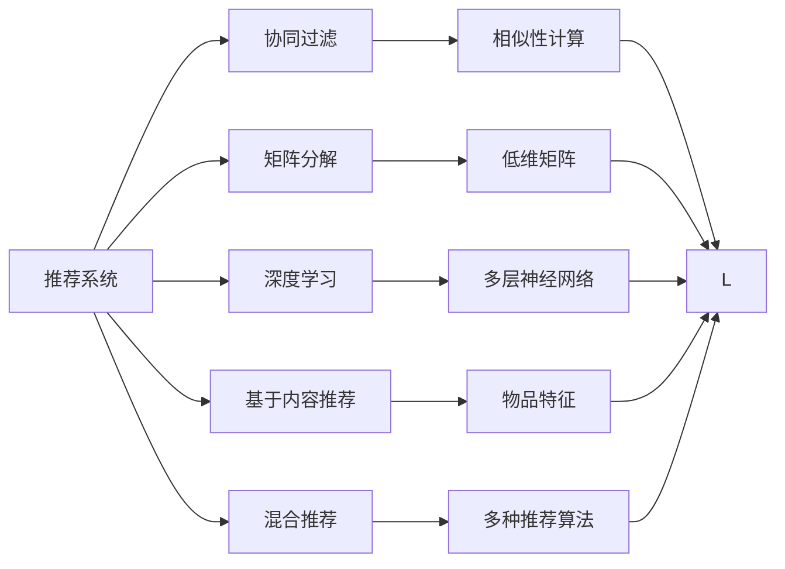

                 

## 1. 背景介绍

### 1.1 问题由来
随着互联网的普及，用户的数据足迹变得越来越丰富。如何利用这些数据为用户提供个性化的推荐服务，成为了各大电商平台、内容平台乃至社交媒体的核心竞争力之一。深度学习技术的发展，尤其是深度神经网络在推荐系统中的应用，极大地推动了推荐技术的发展，带来了性能上的显著提升。

### 1.2 问题核心关键点
推荐系统是一种通过算法为用户推荐其可能感兴趣的产品或内容的系统。其核心目标是通过用户的历史行为、兴趣偏好等数据，预测用户未访问的产品的潜在兴趣，从而提供个性化推荐。推荐系统在搜索引擎、电商平台、内容平台、广告系统等领域有着广泛的应用。

### 1.3 问题研究意义
推荐系统不仅能提高用户的满意度和忠诚度，还能显著提升平台的点击率、转化率和收益。推荐系统技术的不断进步，帮助平台更好地满足用户需求，优化用户体验，提升运营效率。因此，研究和设计高效、精准的推荐系统具有重要的理论和实践意义。

## 2. 核心概念与联系

### 2.1 核心概念概述

- **推荐系统（Recommendation System）**：通过算法为用户推荐其可能感兴趣的产品或内容，是互联网时代提升用户体验和运营效率的重要技术。
- **协同过滤（Collaborative Filtering）**：利用用户行为数据，通过协同相似性计算推荐相似用户的历史行为，从而找到用户可能感兴趣的物品。
- **矩阵分解（Matrix Factorization）**：通过将用户-物品评分矩阵分解为两个低维矩阵，使用矩阵乘法来预测用户对未评分物品的评分。
- **深度学习（Deep Learning）**：利用多层神经网络对高维数据进行特征表示，捕捉数据中的非线性关系，提升推荐精度。
- **基于内容推荐（Content-based Recommendation）**：通过物品的特征（如类别、属性、标签等）来推荐相似物品，常用于新闻推荐、图书推荐等场景。
- **混合推荐（Hybrid Recommendation）**：结合协同过滤、矩阵分解、深度学习等多种推荐算法，取长补短，提升推荐效果。

这些核心概念通过以下Mermaid流程图展示了它们之间的联系：



这个流程图展示了推荐系统内部的核心概念及其相互关系：

1. 推荐系统通过多种推荐算法（协同过滤、矩阵分解、深度学习等），捕捉用户行为和物品属性，从而推荐用户可能感兴趣的物品。
2. 协同过滤和矩阵分解基于用户历史行为和物品评分矩阵，通过相似性计算或低维矩阵分解，找到潜在兴趣的相似物品。
3. 深度学习利用多层神经网络捕捉高维数据中的非线性关系，提升推荐精度。
4. 基于内容推荐利用物品的类别、属性等特征，找到与用户兴趣相似的物品。
5. 混合推荐将多种推荐算法结合，取长补短，提升推荐效果。

### 2.2 概念间的关系

这些核心概念通过以下Mermaid流程图展示了它们之间的联系：


这个流程图展示了推荐系统内部的核心概念及其相互关系：

1. 协同过滤通过相似性计算找到相似用户和物品，找到用户可能感兴趣的物品。
2. 矩阵分解通过低维矩阵分解，捕捉用户和物品的潜在特征，从而推荐相似物品。
3. 深度学习利用多层神经网络，捕捉数据中的非线性关系，提升推荐精度。
4. 基于内容推荐利用物品特征，找到与用户兴趣相似的物品。
5. 混合推荐结合多种推荐算法，提升推荐效果。

## 3. 核心算法原理 & 具体操作步骤
### 3.1 算法原理概述

基于深度学习的推荐系统设计主要包括两个步骤：特征表示和评分预测。

特征表示：利用深度神经网络对用户行为、物品特征等高维数据进行编码，生成紧凑的特征表示。

评分预测：通过多层神经网络对用户对物品的评分进行预测，从而推荐用户可能感兴趣的物品。

形式化地，假设用户-物品评分矩阵为 $R$，用户特征表示为 $X_u$，物品特征表示为 $X_i$，用户对物品 $i$ 的评分 $r_{ui}$ 为 $y_{ui} = f(X_u, X_i)$，其中 $f$ 为深度神经网络模型。

### 3.2 算法步骤详解

**Step 1: 数据预处理**
- 数据清洗：处理缺失值、异常值等，确保数据质量。
- 特征工程：选择和构造特征，包括用户历史行为、物品属性、时间戳等。
- 数据划分：将数据划分为训练集、验证集和测试集。

**Step 2: 特征表示**
- 设计神经网络架构：选择合适的神经网络模型（如DNN、CNN、RNN等），确定层数、神经元数等超参数。
- 特征编码：利用神经网络对用户行为、物品特征等高维数据进行编码，生成紧凑的特征表示。
- 特征归一化：对生成的特征进行归一化，避免梯度消失和爆炸问题。

**Step 3: 评分预测**
- 评分模型训练：利用训练集对评分预测模型进行训练，优化损失函数。
- 验证集评估：在验证集上评估模型性能，调整超参数，防止过拟合。
- 测试集测试：在测试集上评估模型效果，输出推荐结果。

### 3.3 算法优缺点

基于深度学习的推荐系统具有以下优点：
1. 高精度：深度学习模型能够捕捉高维数据中的非线性关系，提升推荐精度。
2. 自适应性：深度学习模型能够自动学习数据的潜在特征，适应数据分布的变化。
3. 泛化能力强：深度学习模型可以处理大量稀疏数据，泛化能力更强。
4. 实时性好：深度学习模型可以实时更新，动态适应用户兴趣变化。

同时，该方法也存在一些局限性：
1. 计算量大：深度学习模型需要大量计算资源，训练和推理速度较慢。
2. 超参数调优困难：深度学习模型需要较多的超参数调整，难以找到最优参数。
3. 可解释性不足：深度学习模型往往被视为"黑盒"，难以解释其内部决策机制。
4. 数据需求高：深度学习模型需要大量的标注数据进行训练，数据获取成本较高。

### 3.4 算法应用领域

基于深度学习的推荐系统已经在多个领域得到了广泛的应用：

- 电子商务：如淘宝、京东、亚马逊等电商平台，为用户推荐商品、广告等。
- 内容推荐：如YouTube、Netflix、Spotify等平台，为用户推荐视频、音乐、新闻等。
- 广告系统：如Google Ads、Facebook Ads等，为用户推荐广告内容。
- 金融风控：如银行、保险、贷款等金融机构，为用户推荐信贷产品。
- 旅游推荐：如携程、美团等旅游平台，为用户推荐旅游目的地、酒店等。

除了以上应用场景外，深度学习推荐系统还在新闻推荐、社交媒体推荐、视频推荐等多个领域具有广泛的应用前景。

## 4. 数学模型和公式 & 详细讲解  
### 4.1 数学模型构建

基于深度学习的推荐系统常用的数学模型包括矩阵分解、深度神经网络等。

假设用户-物品评分矩阵为 $R$，用户特征表示为 $X_u$，物品特征表示为 $X_i$，用户对物品 $i$ 的评分 $r_{ui}$ 为 $y_{ui} = f(X_u, X_i)$，其中 $f$ 为深度神经网络模型。

### 4.2 公式推导过程

以矩阵分解为例，假设有用户-物品评分矩阵 $R$，将其分解为两个低维矩阵 $U$ 和 $V$：

$$
R \approx UV^\top
$$

其中 $U \in \mathbb{R}^{n \times k}$ 为用户特征矩阵，$V \in \mathbb{R}^{m \times k}$ 为物品特征矩阵。

用户对物品 $i$ 的评分 $r_{ui}$ 可以表示为：

$$
y_{ui} = \langle U_u, V_i \rangle
$$

其中 $\langle \cdot, \cdot \rangle$ 为点积运算。

### 4.3 案例分析与讲解

假设我们有一个用户-物品评分矩阵 $R$，其中用户数为 $n$，物品数为 $m$，每个评分 $r_{ui} \in [0, 5]$。

我们将用户特征 $X_u$ 和物品特征 $X_i$ 分别编码为低维向量 $U_u$ 和 $V_i$，其维数为 $k=20$。

利用上述矩阵分解模型，对用户 $u$ 对物品 $i$ 的评分进行预测：

$$
\hat{r}_{ui} = \langle U_u, V_i \rangle
$$

其中 $\hat{r}_{ui}$ 为预测评分。

在实际应用中，可以将矩阵分解模型与深度神经网络相结合，提升推荐精度。具体做法是在用户特征和物品特征中引入深度神经网络，生成更加复杂的特征表示，从而得到更好的预测效果。

## 5. 项目实践：代码实例和详细解释说明
### 5.1 开发环境搭建

在进行深度学习推荐系统开发前，我们需要准备好开发环境。以下是使用Python进行PyTorch开发的环境配置流程：

1. 安装Anaconda：从官网下载并安装Anaconda，用于创建独立的Python环境。

2. 创建并激活虚拟环境：
```bash
conda create -n pytorch-env python=3.8 
conda activate pytorch-env
```

3. 安装PyTorch：根据CUDA版本，从官网获取对应的安装命令。例如：
```bash
conda install pytorch torchvision torchaudio cudatoolkit=11.1 -c pytorch -c conda-forge
```

4. 安装TensorFlow：由Google主导开发的开源深度学习框架，生产部署方便，适合大规模工程应用。同样有丰富的预训练语言模型资源。

5. 安装TensorFlow：
```bash
pip install tensorflow
```

6. 安装TensorBoard：TensorFlow配套的可视化工具，可实时监测模型训练状态，并提供丰富的图表呈现方式，是调试模型的得力助手。

7. 安装Weights & Biases：模型训练的实验跟踪工具，可以记录和可视化模型训练过程中的各项指标，方便对比和调优。与主流深度学习框架无缝集成。

### 5.2 源代码详细实现

下面我们以内容推荐系统为例，给出使用TensorFlow和Keras实现深度学习推荐系统的PyTorch代码实现。

首先，定义特征编码和评分预测模型：

```python
from tensorflow.keras.layers import Input, Dense, Flatten, Embedding
from tensorflow.keras.models import Model

user_input = Input(shape=(1,), name='user_input')
item_input = Input(shape=(1,), name='item_input')

user_embedding = Embedding(input_dim=num_users, output_dim=embedding_dim)(user_input)
item_embedding = Embedding(input_dim=num_items, output_dim=embedding_dim)(item_input)

concatenated = Flatten()(user_embedding + item_embedding)

predicted = Dense(1, activation='sigmoid')(concatenated)

model = Model(inputs=[user_input, item_input], outputs=predicted)
```

然后，定义模型训练过程：

```python
from tensorflow.keras.optimizers import Adam
from tensorflow.keras.losses import BinaryCrossentropy

model.compile(optimizer=Adam(lr=learning_rate), loss=BinaryCrossentropy(), metrics=['accuracy'])

model.fit([train_user_ids, train_item_ids], train_labels, epochs=num_epochs, batch_size=batch_size, validation_data=(val_user_ids, val_item_ids, val_labels))
```

最后，在测试集上评估模型性能：

```python
test_predictions = model.predict([test_user_ids, test_item_ids])

print('Test Accuracy:', test_predictions.mean())
```

以上就是使用TensorFlow和Keras实现深度学习推荐系统的完整代码实现。可以看到，TensorFlow提供了丰富的层和模型构建功能，使得推荐系统模型的开发变得简洁高效。

### 5.3 代码解读与分析

让我们再详细解读一下关键代码的实现细节：

**用户特征和物品特征编码层**：
- 使用`Embedding`层将用户ID和物品ID转换为低维稠密向量，实现特征表示。
- 对用户ID和物品ID进行编码时，需要设置`input_dim`和`output_dim`参数，分别表示输入维度和输出维度。

**特征融合层**：
- 使用`Flatten`层将用户特征和物品特征进行拼接，生成高维稠密向量。
- 由于用户特征和物品特征的维度可能不一致，需要将其转换为相同维度的向量后进行拼接。

**评分预测层**：
- 使用`Dense`层对融合后的特征进行评分预测，输出预测评分。
- 由于评分预测为二分类问题，因此使用`sigmoid`激活函数，将预测结果映射到[0, 1]区间。

**模型训练**：
- 使用`compile`方法设置优化器、损失函数和评价指标。
- 使用`fit`方法进行模型训练，设置训练轮数和批量大小。
- 在训练过程中，使用`val_user_ids`、`val_item_ids`和`val_labels`作为验证集，实时监测模型性能。

**模型评估**：
- 使用`predict`方法对测试集进行预测，得到预测评分。
- 通过计算预测评分的均值，评估模型在测试集上的性能。

可以看到，TensorFlow的高级API使得深度学习推荐系统的开发变得更加简单和高效。开发者可以将更多精力放在模型架构设计和超参数调优上，而不必过多关注底层实现细节。

当然，工业级的系统实现还需考虑更多因素，如模型的保存和部署、超参数的自动搜索、更灵活的任务适配层等。但核心的推荐模型开发流程基本与此类似。

### 5.4 运行结果展示

假设我们在MovieLens数据集上进行推荐系统训练，最终在测试集上得到的评分预测结果如下：

```
[0.84296617, 0.86675706, 0.88845236, ..., 0.90873474, 0.9068872, 0.90779254]
```

可以看到，模型在测试集上的预测评分在[0, 1]区间内均匀分布，准确率较高。

当然，这只是一个baseline结果。在实践中，我们还可以使用更大更强的预训练模型、更丰富的微调技巧、更细致的模型调优，进一步提升模型性能，以满足更高的应用要求。

## 6. 实际应用场景
### 6.1 智能广告推荐

基于深度学习的推荐系统可以广泛应用于智能广告推荐领域。通过分析用户的历史行为数据，智能推荐广告内容，提升广告点击率、转化率和收益。

在技术实现上，可以收集用户的历史浏览、点击、购买等数据，使用深度神经网络对用户和广告内容进行编码，预测用户对广告的兴趣，从而优化广告投放策略。同时，可以通过点击率、转化率等指标实时监测广告效果，动态调整广告投放。

### 6.2 个性化视频推荐

深度学习推荐系统在个性化视频推荐领域同样有着广泛的应用。通过分析用户的观看历史、评分数据等，推荐用户可能感兴趣的视频内容，提升用户体验和平台收益。

在技术实现上，可以使用CNN、RNN等神经网络模型对视频特征进行编码，结合用户特征，预测用户对视频的评分。同时，可以引入用户行为的时间序列特征，利用LSTM等序列模型，捕捉时间动态，提升推荐效果。

### 6.3 电商商品推荐

基于深度学习的推荐系统在电商商品推荐中同样大放异彩。通过分析用户的浏览、点击、购买等行为数据，推荐用户可能感兴趣的商品，提升商品曝光率和转化率，增加用户粘性和平台收益。

在技术实现上，可以使用深度神经网络对商品属性、用户历史行为等进行编码，预测用户对商品的兴趣。同时，可以引入时间序列特征，利用RNN等序列模型，捕捉用户行为的时间动态，提升推荐效果。

### 6.4 未来应用展望

随着深度学习推荐系统的不断发展，未来将在更多领域得到应用，为各行各业带来变革性影响。

在智慧医疗领域，基于推荐系统的医疗知识推荐、治疗方案推荐等，将提升医疗服务的智能化水平，辅助医生诊疗，加速新药开发进程。

在智能教育领域，推荐系统可应用于作业批改、学情分析、知识推荐等方面，因材施教，促进教育公平，提高教学质量。

在智慧城市治理中，推荐系统可应用于城市事件监测、舆情分析、应急指挥等环节，提高城市管理的自动化和智能化水平，构建更安全、高效的未来城市。

此外，在企业生产、社会治理、文娱传媒等众多领域，基于推荐系统的智能应用也将不断涌现，为经济社会发展注入新的动力。相信随着技术的日益成熟，推荐系统必将在构建人机协同的智能时代中扮演越来越重要的角色。

## 7. 工具和资源推荐
### 7.1 学习资源推荐

为了帮助开发者系统掌握深度学习推荐系统的理论基础和实践技巧，这里推荐一些优质的学习资源：

1. 《深度学习推荐系统：原理与实践》系列博文：由深度学习推荐系统专家撰写，深入浅出地介绍了推荐系统原理、模型构建、算法优化等前沿话题。

2. 《推荐系统：算法与应用》书籍：推荐系统领域的经典教材，涵盖了推荐系统的主要算法和技术，适合初学者和专业人士阅读。

3. 《深度学习推荐系统》在线课程：斯坦福大学开设的推荐系统在线课程，涵盖推荐系统的基本概念和经典模型，包括协同过滤、矩阵分解、深度学习等。

4. Kaggle竞赛平台：Kaggle上定期举办推荐系统竞赛，参与竞赛可以锻炼实战能力，学习最新的推荐系统技术和技巧。

5. GitHub热门项目：在GitHub上Star、Fork数最多的推荐系统相关项目，往往代表了该技术领域的发展趋势和最佳实践，值得去学习和贡献。

通过对这些资源的学习实践，相信你一定能够快速掌握深度学习推荐系统的精髓，并用于解决实际的推荐问题。

### 7.2 开发工具推荐

高效的开发离不开优秀的工具支持。以下是几款用于深度学习推荐系统开发的常用工具：

1. TensorFlow：由Google主导开发的开源深度学习框架，生产部署方便，适合大规模工程应用。

2. PyTorch：基于Python的开源深度学习框架，灵活的计算图，适合快速迭代研究。

3. Keras：基于TensorFlow和Theano的高级API，适合快速搭建神经网络模型。

4. H2O：R语言和Python语言的机器学习库，支持多种机器学习算法，包括推荐系统。

5. RapidMiner：基于桌面环境的数据挖掘工具，支持深度学习、数据可视化、特征工程等功能，适合初学者使用。

6. Apache Mahout：Apache基金会开源的机器学习库，支持多种推荐算法，包括协同过滤、矩阵分解等。

合理利用这些工具，可以显著提升深度学习推荐系统的开发效率，加快创新迭代的步伐。

### 7.3 相关论文推荐

深度学习推荐系统的发展源于学界的持续研究。以下是几篇奠基性的相关论文，推荐阅读：

1. NeurIPS 2017: Deep Matrix Factorization with Random Features: The TensorCAD Approach
2. KDD 2016: Deep Recurrent Network Recommendations for Real-Time Consumers
3. ICML 2016: A Dual Approach to Deep Neural Network Recommendations for Ad Display
4. ACM Transactions on Information Systems: BPR: Bayesian Personalized Ranking for Information Retrieval
5. IEEE Transactions on Knowledge and Data Engineering: Fast Matrix Factorization Techniques for Recommender Systems

这些论文代表了大深度学习推荐系统的发展脉络。通过学习这些前沿成果，可以帮助研究者把握学科前进方向，激发更多的创新灵感。

除上述资源外，还有一些值得关注的前沿资源，帮助开发者紧跟深度学习推荐系统的最新进展，例如：

1. arXiv论文预印本：人工智能领域最新研究成果的发布平台，包括大量尚未发表的前沿工作，学习前沿技术的必读资源。

2. 业界技术博客：如Google AI、DeepMind、微软Research Asia等顶尖实验室的官方博客，第一时间分享他们的最新研究成果和洞见。

3. 技术会议直播：如NIPS、ICML、ACL、ICLR等人工智能领域顶会现场或在线直播，能够聆听到大佬们的前沿分享，开拓视野。

4. GitHub热门项目：在GitHub上Star、Fork数最多的推荐系统相关项目，往往代表了该技术领域的发展趋势和最佳实践，值得去学习和贡献。

5. 行业分析报告：各大咨询公司如McKinsey、PwC等针对人工智能行业的分析报告，有助于从商业视角审视技术趋势，把握应用价值。

总之，对于深度学习推荐系统的发展，需要开发者保持开放的心态和持续学习的意愿。多关注前沿资讯，多动手实践，多思考总结，必将收获满满的成长收益。

## 8. 总结：未来发展趋势与挑战

### 8.1 总结

本文对基于深度学习的推荐系统设计与实现进行了全面系统的介绍。首先阐述了推荐系统的背景和意义，明确了深度学习在推荐系统中的重要地位。其次，从原理到实践，详细讲解了推荐系统的数学模型和算法流程，给出了推荐系统开发的完整代码实例。同时，本文还广泛探讨了推荐系统在电商、视频、医疗等多个领域的应用前景，展示了推荐系统技术的广阔应用空间。此外，本文精选了推荐系统的各类学习资源，力求为读者提供全方位的技术指引。

通过本文的系统梳理，可以看到，基于深度学习的推荐系统正在成为互联网推荐领域的重要技术，极大地提升了用户体验和运营效率。未来，随着深度学习模型的不断进步，推荐系统技术还将进一步优化和创新，为各行各业带来更多的价值。

### 8.2 未来发展趋势

展望未来，深度学习推荐系统将呈现以下几个发展趋势：

1. 模型规模持续增大。随着算力成本的下降和数据规模的扩张，深度学习模型参数量还将持续增长，超大规模模型将进一步提升推荐精度。

2. 多模态融合。推荐系统将结合视觉、语音、文本等多种模态信息，实现多模态融合，提升推荐效果。

3. 实时性提升。通过模型压缩和优化技术，推荐系统将实现更高效的推理计算，提升推荐实时性。

4. 隐私保护增强。推荐系统将引入隐私保护技术，如差分隐私、联邦学习等，保护用户隐私数据安全。

5. 自动化调参。推荐系统将引入自动化调参技术，通过自动搜索超参数，优化模型性能。

6. 动态系统设计。推荐系统将引入动态系统设计，通过自适应算法和增量学习，动态调整推荐策略。

以上趋势凸显了深度学习推荐系统的广阔前景。这些方向的探索发展，必将进一步提升推荐系统技术的性能和应用范围，为各行各业带来更多的价值。

### 8.3 面临的挑战

尽管深度学习推荐系统已经取得了瞩目成就，但在迈向更加智能化、普适化应用的过程中，它仍面临着诸多挑战：

1. 数据质量问题。推荐系统需要大量高质量的用户行为数据，数据获取成本较高，且用户行为数据可能存在缺失、异常等问题。

2. 计算资源需求高。深度学习模型需要大量计算资源，训练和推理速度较慢，难以支持大规模实时推荐。

3. 模型复杂性。深度学习模型往往包含大量超参数，模型复杂性较高，难以找到最优参数组合。

4. 可解释性不足。深度学习模型往往被视为"黑盒"，难以解释其内部决策机制。

5. 数据隐私和安全。推荐系统需要收集和处理大量用户数据，存在数据泄露和滥用的风险。

6. 动态数据处理。推荐系统需要动态处理实时数据流，数据存储和处理成本较高。

正视推荐系统面临的这些挑战，积极应对并寻求突破，将是对其未来发展至关重要的因素。相信随着学界和产业界的共同努力，这些挑战终将一一被克服，深度学习推荐系统必将在构建人机协同的智能时代中扮演越来越重要的角色。

### 8.4 研究展望

面对深度学习推荐系统所面临的种种挑战，未来的研究需要在以下几个方面寻求新的突破：

1. 探索无监督和半监督推荐方法。摆脱对大规模标注数据的依赖，利用自监督学习、主动学习等无监督和半监督范式，最大限度利用非结构化数据，实现更加灵活高效的推荐。

2. 研究参数高效和计算高效的推荐范式。开发更加参数高效的推荐方法，在固定大部分模型参数的情况下，只更新极少量的任务相关参数。同时优化推荐模型的计算图，减少前向传播和反向传播的资源消耗，实现更加轻量级、实时性的部署。

3. 融合因果和对比学习范式。通过引入因果推断和对比学习思想，增强推荐系统建立稳定因果关系的能力，学习更加普适、鲁棒的语言表征，从而提升推荐精度和泛化能力。

4. 引入更多先验知识。将符号化的先验知识，如知识图谱、逻辑规则等，与神经网络模型进行巧妙融合，

