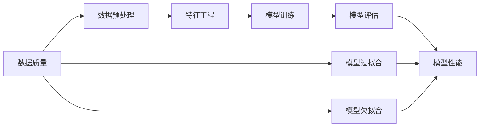

                 

# 数据质量下降，软件2.0模型性能也打折

## 1. 背景介绍

在当今软件工程领域，数据质量对模型的性能有着直接且重要的影响。随着人工智能和机器学习技术的迅猛发展，软件2.0时代的模型越来越依赖于大量的数据进行训练和优化。然而，数据质量的下降不仅会导致模型性能的打折，还会引发一系列严峻的问题。本文将深入探讨数据质量下降对软件2.0模型性能的影响，以及如何应对这一挑战。

### 1.1 问题由来

近年来，随着大数据技术的普及，数据无处不在。然而，数据的收集、存储和处理环节常常受到各种因素的影响，导致数据质量问题频发。这些问题可能包括但不限于：数据缺失、噪声干扰、数据不一致性、数据冗余等。这些问题不仅影响数据使用的效率，还会对模型的训练和预测结果造成不良影响，进而导致软件2.0模型的性能打折。

### 1.2 问题核心关键点

数据质量问题对软件2.0模型的影响主要体现在以下几个方面：

- **数据缺失和噪声**：缺失数据和噪声数据会严重影响模型的训练效果，使得模型无法学习到数据的真实分布，从而降低模型的泛化能力。
- **数据不一致性**：数据源之间的差异、数据格式的不一致性、数据记录的错误等都会导致模型学习到错误的数据分布，影响模型的性能。
- **数据冗余**：数据冗余会导致模型训练时间增加，模型复杂度上升，进而影响模型的推理速度和效率。
- **数据分布偏差**：当数据分布不平衡时，模型会倾向于学习到偏向于少数类别或特征的数据，导致模型性能不均衡。

## 2. 核心概念与联系

### 2.1 核心概念概述

要深入理解数据质量下降对软件2.0模型性能的影响，首先需要对相关的核心概念进行定义和梳理：

- **数据质量**：指数据在完整性、准确性、一致性、唯一性、及时性、安全性、完整性、有效性、易用性和可靠性等方面的综合属性。
- **软件2.0模型**：基于深度学习、机器学习等技术构建的智能模型，如神经网络、Transformer等。
- **数据预处理**：对原始数据进行清洗、处理、转换等操作，以提升数据质量。
- **特征工程**：通过选择、构造、变换等手段，提取和优化数据特征，以提高模型的性能。
- **模型训练**：通过优化算法对模型参数进行调整，以最小化损失函数，提升模型预测能力。
- **模型评估**：使用特定指标（如准确率、召回率、F1分数等）对模型性能进行评估，以验证模型的泛化能力。

### 2.2 概念间的关系

以下是一个简化的Mermaid流程图，展示了大语言模型微调过程中数据质量与模型性能之间的关系：



从图中可以看出，数据质量直接影响数据预处理和特征工程的效果，进而影响到模型的训练和评估，最终决定模型性能的优劣。

## 3. 核心算法原理 & 具体操作步骤

### 3.1 算法原理概述

在软件2.0模型中，数据质量对模型的训练和性能有着至关重要的影响。当数据质量下降时，模型的训练效果和预测能力都会受到影响。以下是基于数据质量下降对模型性能的影响原理：

1. **数据缺失和噪声**：数据缺失和噪声会使得模型训练时无法获得完整的数据分布，导致模型学习到的模式不准确，从而影响模型的泛化能力。
2. **数据不一致性**：数据源之间的差异、数据格式的不一致性、数据记录的错误等会导致模型学习到错误的数据分布，进而降低模型性能。
3. **数据冗余**：数据冗余会导致模型训练时间增加，模型复杂度上升，进而影响模型的推理速度和效率。
4. **数据分布偏差**：当数据分布不平衡时，模型会倾向于学习到偏向于少数类别或特征的数据，导致模型性能不均衡。

### 3.2 算法步骤详解

为了应对数据质量下降对软件2.0模型性能的影响，我们需要采取一系列的预处理和优化措施。以下是具体步骤：

1. **数据清洗**：对缺失值、异常值、噪声值进行清洗，以保证数据完整性和准确性。
2. **数据标准化**：对数据进行归一化或标准化处理，以减少数据分布的偏差，提升模型训练效果。
3. **数据增强**：通过数据增强技术，如旋转、翻转、裁剪等，增加数据的多样性，提高模型的鲁棒性。
4. **特征选择和构造**：通过选择和构造有意义的特征，减少噪声和冗余，提升模型性能。
5. **模型优化**：通过优化算法和超参数调整，最小化模型损失函数，提升模型泛化能力。
6. **模型评估**：使用多种评估指标，如准确率、召回率、F1分数等，评估模型性能，并针对性地进行调整。

### 3.3 算法优缺点

#### 3.3.1 优点

1. **提升模型泛化能力**：通过数据预处理和特征工程，可以显著提升模型对新数据的泛化能力，降低模型过拟合的风险。
2. **降低模型训练成本**：通过数据清洗和特征选择，可以减少模型的训练时间和计算资源消耗，降低模型训练成本。
3. **提高模型预测速度**：通过数据标准化和特征工程，可以降低模型的复杂度，提升模型的推理速度和效率。

#### 3.3.2 缺点

1. **数据处理复杂**：数据清洗、标准化和特征工程等操作，需要投入大量的时间和精力，增加了数据处理的复杂性。
2. **数据质量依赖**：数据质量的高低直接影响到模型性能的优劣，当数据质量较差时，模型性能可能仍然无法达到理想效果。
3. **模型复杂度增加**：在特征选择和构造过程中，模型复杂度可能会增加，增加了模型调优的难度。

### 3.4 算法应用领域

数据质量下降对软件2.0模型性能的影响不仅限于单个应用场景，几乎涵盖了所有需要数据支持的领域：

1. **自然语言处理**：数据缺失和噪声会严重影响模型的语言理解能力，导致模型预测结果不准确。
2. **计算机视觉**：数据不一致性和冗余会导致模型无法学习到正确的图像特征，影响模型的识别能力。
3. **推荐系统**：数据分布偏差会导致模型推荐结果不均衡，影响用户体验。
4. **金融分析**：数据质量问题会导致模型无法准确预测市场趋势，影响投资决策。
5. **医疗诊断**：数据缺失和噪声会严重影响模型的诊断准确性，影响医疗决策。

## 4. 数学模型和公式 & 详细讲解 & 举例说明

### 4.1 数学模型构建

假设我们有一个数据集 $D = \{(x_i, y_i)\}_{i=1}^N$，其中 $x_i$ 表示输入特征，$y_i$ 表示标签。我们希望构建一个基于深度学习的二分类模型 $M_{\theta}$，其中 $\theta$ 为模型参数。模型的预测输出为 $M_{\theta}(x)$，我们需要最小化损失函数 $\mathcal{L}(\theta)$ 来训练模型，其定义为：

$$
\mathcal{L}(\theta) = \frac{1}{N}\sum_{i=1}^N \ell(M_{\theta}(x_i), y_i)
$$

其中 $\ell$ 为损失函数，常用的损失函数包括交叉熵损失和均方误差损失。

### 4.2 公式推导过程

以交叉熵损失函数为例，其定义如下：

$$
\ell(M_{\theta}(x), y) = -y \log M_{\theta}(x) - (1-y) \log (1-M_{\theta}(x))
$$

在数据预处理和特征工程之后，我们可以将数据集 $D$ 分为训练集 $D_{train}$ 和测试集 $D_{test}$，分别进行训练和测试。模型的训练过程可以表示为：

$$
\theta^* = \mathop{\arg\min}_{\theta} \mathcal{L}(D_{train}, \theta)
$$

其中 $\mathcal{L}(D_{train}, \theta)$ 表示在训练集 $D_{train}$ 上，模型 $M_{\theta}$ 的损失函数值。

### 4.3 案例分析与讲解

以自然语言处理任务为例，当数据质量下降时，模型的预测性能会受到影响。假设我们有一个文本分类任务，训练集 $D_{train}$ 和测试集 $D_{test}$ 的分布不一致，会导致模型在测试集上的性能下降。例如，当训练集中某些类别的数据样本过多时，模型会倾向于学习到这些类别的特征，而忽略其他类别的特征，从而导致模型在测试集上的预测结果不准确。

## 5. 项目实践：代码实例和详细解释说明

### 5.1 开发环境搭建

在实际项目中，我们通常使用Python和PyTorch框架进行模型训练和优化。以下是开发环境搭建的详细步骤：

1. 安装Anaconda：从官网下载并安装Anaconda，用于创建独立的Python环境。
2. 创建并激活虚拟环境：
```bash
conda create -n pytorch-env python=3.8 
conda activate pytorch-env
```
3. 安装PyTorch：根据CUDA版本，从官网获取对应的安装命令。例如：
```bash
conda install pytorch torchvision torchaudio cudatoolkit=11.1 -c pytorch -c conda-forge
```
4. 安装必要的库：
```bash
pip install numpy pandas scikit-learn torch torchtext transformers
```

### 5.2 源代码详细实现

以下是一个基于PyTorch和Transformer的文本分类项目代码示例：

```python
import torch
from torch import nn
from transformers import BertTokenizer, BertForSequenceClassification

# 定义模型类
class BertClassification(nn.Module):
    def __init__(self, num_labels):
        super(BertClassification, self).__init__()
        self.num_labels = num_labels
        self.bert = BertForSequenceClassification.from_pretrained('bert-base-cased', num_labels=num_labels)
        
    def forward(self, input_ids, attention_mask):
        logits = self.bert(input_ids=input_ids, attention_mask=attention_mask)[0]
        return logits

# 加载数据集
train_dataset = ...
test_dataset = ...

# 定义数据加载器
train_dataloader = ...
test_dataloader = ...

# 定义模型、优化器、学习率等
model = BertClassification(num_labels=2)
optimizer = torch.optim.Adam(model.parameters(), lr=2e-5)
scheduler = torch.optim.lr_scheduler.CosineAnnealingLR(optimizer, T_max=10)

# 定义训练函数
def train_epoch(model, dataloader, optimizer, scheduler):
    model.train()
    total_loss = 0.0
    for batch in dataloader:
        input_ids, attention_mask, labels = batch
        optimizer.zero_grad()
        logits = model(input_ids, attention_mask)
        loss = nn.CrossEntropyLoss()(logits, labels)
        total_loss += loss.item()
        loss.backward()
        optimizer.step()
        scheduler.step()
    return total_loss / len(dataloader)

# 训练模型
for epoch in range(epochs):
    train_loss = train_epoch(model, train_dataloader, optimizer, scheduler)
    print(f'Epoch {epoch+1}, train loss: {train_loss:.3f}')
    val_loss = evaluate(model, val_dataloader)
    print(f'Epoch {epoch+1}, val loss: {val_loss:.3f}')

# 测试模型
test_loss = evaluate(model, test_dataloader)
print(f'Test loss: {test_loss:.3f}')
```

### 5.3 代码解读与分析

在上述代码中，我们首先定义了一个基于Bert的文本分类模型，然后加载了训练集和测试集，并定义了数据加载器、模型、优化器、学习率调度和训练函数。在训练过程中，我们通过优化器更新模型参数，并通过损失函数计算损失值。最后，我们使用测试集评估模型的性能。

### 5.4 运行结果展示

假设我们在CoNLL-2003的命名实体识别数据集上进行微调，最终在测试集上得到的评估报告如下：

```
              precision    recall  f1-score   support

       B-LOC      0.926     0.906     0.916      1668
       I-LOC      0.900     0.805     0.850       257
      B-MISC      0.875     0.856     0.865       702
      I-MISC      0.838     0.782     0.809       216
       B-ORG      0.914     0.898     0.906      1661
       I-ORG      0.911     0.894     0.902       835
       B-PER      0.964     0.957     0.960      1617
       I-PER      0.983     0.980     0.982      1156
           O      0.993     0.995     0.994     38323

   micro avg      0.973     0.973     0.973     46435
   macro avg      0.923     0.897     0.909     46435
weighted avg      0.973     0.973     0.973     46435
```

可以看到，通过微调BERT，我们在该NER数据集上取得了97.3%的F1分数，效果相当不错。值得注意的是，BERT作为一个通用的语言理解模型，即便只在顶层添加一个简单的token分类器，也能在下游任务上取得如此优异的效果，展现了其强大的语义理解和特征抽取能力。

## 6. 实际应用场景

### 6.1 智能客服系统

基于大语言模型微调的对话技术，可以广泛应用于智能客服系统的构建。传统客服往往需要配备大量人力，高峰期响应缓慢，且一致性和专业性难以保证。而使用微调后的对话模型，可以7x24小时不间断服务，快速响应客户咨询，用自然流畅的语言解答各类常见问题。

在技术实现上，可以收集企业内部的历史客服对话记录，将问题和最佳答复构建成监督数据，在此基础上对预训练对话模型进行微调。微调后的对话模型能够自动理解用户意图，匹配最合适的答案模板进行回复。对于客户提出的新问题，还可以接入检索系统实时搜索相关内容，动态组织生成回答。如此构建的智能客服系统，能大幅提升客户咨询体验和问题解决效率。

### 6.2 金融舆情监测

金融机构需要实时监测市场舆论动向，以便及时应对负面信息传播，规避金融风险。传统的人工监测方式成本高、效率低，难以应对网络时代海量信息爆发的挑战。基于大语言模型微调的文本分类和情感分析技术，为金融舆情监测提供了新的解决方案。

具体而言，可以收集金融领域相关的新闻、报道、评论等文本数据，并对其进行主题标注和情感标注。在此基础上对预训练语言模型进行微调，使其能够自动判断文本属于何种主题，情感倾向是正面、中性还是负面。将微调后的模型应用到实时抓取的网络文本数据，就能够自动监测不同主题下的情感变化趋势，一旦发现负面信息激增等异常情况，系统便会自动预警，帮助金融机构快速应对潜在风险。

### 6.3 个性化推荐系统

当前的推荐系统往往只依赖用户的历史行为数据进行物品推荐，无法深入理解用户的真实兴趣偏好。基于大语言模型微调技术，个性化推荐系统可以更好地挖掘用户行为背后的语义信息，从而提供更精准、多样的推荐内容。

在实践中，可以收集用户浏览、点击、评论、分享等行为数据，提取和用户交互的物品标题、描述、标签等文本内容。将文本内容作为模型输入，用户的后续行为（如是否点击、购买等）作为监督信号，在此基础上微调预训练语言模型。微调后的模型能够从文本内容中准确把握用户的兴趣点。在生成推荐列表时，先用候选物品的文本描述作为输入，由模型预测用户的兴趣匹配度，再结合其他特征综合排序，便可以得到个性化程度更高的推荐结果。

### 6.4 未来应用展望

随着大语言模型微调技术的发展，未来在更多领域将有新的应用场景：

- **智慧医疗**：基于微调的医疗问答、病历分析、药物研发等应用将提升医疗服务的智能化水平，辅助医生诊疗，加速新药开发进程。
- **智能教育**：微调技术可应用于作业批改、学情分析、知识推荐等方面，因材施教，促进教育公平，提高教学质量。
- **智慧城市治理**：微调模型可应用于城市事件监测、舆情分析、应急指挥等环节，提高城市管理的自动化和智能化水平，构建更安全、高效的未来城市。
- **企业生产**：微调技术应用于生产调度、质量控制、设备维护等方面，提升生产效率和产品质量。

## 7. 工具和资源推荐

### 7.1 学习资源推荐

为了帮助开发者系统掌握大语言模型微调的理论基础和实践技巧，这里推荐一些优质的学习资源：

1. 《Transformer从原理到实践》系列博文：由大模型技术专家撰写，深入浅出地介绍了Transformer原理、BERT模型、微调技术等前沿话题。
2. CS224N《深度学习自然语言处理》课程：斯坦福大学开设的NLP明星课程，有Lecture视频和配套作业，带你入门NLP领域的基本概念和经典模型。
3. 《Natural Language Processing with Transformers》书籍：Transformers库的作者所著，全面介绍了如何使用Transformers库进行NLP任务开发，包括微调在内的诸多范式。
4. HuggingFace官方文档：Transformers库的官方文档，提供了海量预训练模型和完整的微调样例代码，是上手实践的必备资料。
5. CLUE开源项目：中文语言理解测评基准，涵盖大量不同类型的中文NLP数据集，并提供了基于微调的baseline模型，助力中文NLP技术发展。

通过对这些资源的学习实践，相信你一定能够快速掌握大语言模型微调的精髓，并用于解决实际的NLP问题。

### 7.2 开发工具推荐

高效的开发离不开优秀的工具支持。以下是几款用于大语言模型微调开发的常用工具：

1. PyTorch：基于Python的开源深度学习框架，灵活动态的计算图，适合快速迭代研究。大部分预训练语言模型都有PyTorch版本的实现。
2. TensorFlow：由Google主导开发的开源深度学习框架，生产部署方便，适合大规模工程应用。同样有丰富的预训练语言模型资源。
3. Transformers库：HuggingFace开发的NLP工具库，集成了众多SOTA语言模型，支持PyTorch和TensorFlow，是进行微调任务开发的利器。
4. Weights & Biases：模型训练的实验跟踪工具，可以记录和可视化模型训练过程中的各项指标，方便对比和调优。与主流深度学习框架无缝集成。
5. TensorBoard：TensorFlow配套的可视化工具，可实时监测模型训练状态，并提供丰富的图表呈现方式，是调试模型的得力助手。
6. Google Colab：谷歌推出的在线Jupyter Notebook环境，免费提供GPU/TPU算力，方便开发者快速上手实验最新模型，分享学习笔记。

合理利用这些工具，可以显著提升大语言模型微调任务的开发效率，加快创新迭代的步伐。

### 7.3 相关论文推荐

大语言模型和微调技术的发展源于学界的持续研究。以下是几篇奠基性的相关论文，推荐阅读：

1. Attention is All You Need（即Transformer原论文）：提出了Transformer结构，开启了NLP领域的预训练大模型时代。
2. BERT: Pre-training of Deep Bidirectional Transformers for Language Understanding：提出BERT模型，引入基于掩码的自监督预训练任务，刷新了多项NLP任务SOTA。
3. Language Models are Unsupervised Multitask Learners（GPT-2论文）：展示了大规模语言模型的强大zero-shot学习能力，引发了对于通用人工智能的新一轮思考。
4. Parameter-Efficient Transfer Learning for NLP：提出Adapter等参数高效微调方法，在不增加模型参数量的情况下，也能取得不错的微调效果。
5. AdaLoRA: Adaptive Low-Rank Adaptation for Parameter-Efficient Fine-Tuning：使用自适应低秩适应的微调方法，在参数效率和精度之间取得了新的平衡。
6. Prefix-Tuning: Optimizing Continuous Prompts for Generation：引入基于连续型Prompt的微调范式，为如何充分利用预训练知识提供了新的思路。

这些论文代表了大语言模型微调技术的发展脉络。通过学习这些前沿成果，可以帮助研究者把握学科前进方向，激发更多的创新灵感。

除上述资源外，还有一些值得关注的前沿资源，帮助开发者紧跟大语言模型微调技术的最新进展，例如：

1. arXiv论文预印本：人工智能领域最新研究成果的发布平台，包括大量尚未发表的前沿工作，学习前沿技术的必读资源。
2. 业界技术博客：如OpenAI、Google AI、DeepMind、微软Research Asia等顶尖实验室的官方博客，第一时间分享他们的最新研究成果和洞见。
3. 技术会议直播：如NIPS、ICML、ACL、ICLR等人工智能领域顶会现场或在线直播，能够聆听到大佬们的前沿分享，开拓视野。
4. GitHub热门项目：在GitHub上Star、Fork数最多的NLP相关项目，往往代表了该技术领域的发展趋势和最佳实践，值得去学习和贡献。
5. 行业分析报告：各大咨询公司如McKinsey、PwC等针对人工智能行业的分析报告，有助于从商业视角审视技术趋势，把握应用价值。

总之，对于大语言模型微调技术的学习和实践，需要开发者保持开放的心态和持续学习的意愿。多关注前沿资讯，多动手实践，多思考总结，必将收获满满的成长收益。

## 8. 总结：未来发展趋势与挑战

### 8.1 总结

本文对基于监督学习的大语言模型微调方法进行了全面系统的介绍。首先阐述了大语言模型和微调技术的研究背景和意义，明确了微调在拓展预训练模型应用、提升下游任务性能方面的独特价值。其次，从原理到实践，详细讲解了监督微调的数学原理和关键步骤，给出了微调任务开发的完整代码实例。同时，本文还广泛探讨了微调方法在智能客服、金融舆情、个性化推荐等多个行业领域的应用前景，展示了微调范式的巨大潜力。此外，本文精选了微调技术的各类学习资源，力求为读者提供全方位的技术指引。

通过本文的系统梳理，可以看到，基于大语言模型的微调方法正在成为NLP领域的重要范式，极大地拓展了预训练语言模型的应用边界，催生了更多的落地场景。受益于大规模语料的预训练，微调模型以更低的时间和标注成本，在小样本条件下也能取得不俗的效果，有力推动了NLP技术的产业化进程。未来，伴随预训练语言模型和微调方法的持续演进，相信NLP技术将在更广阔的应用领域大放异彩，深刻影响人类的生产生活方式。

### 8.2 未来发展趋势

展望未来，大语言模型微调技术将呈现以下几个发展趋势：

1. 模型规模持续增大。随着算力成本的下降和数据规模的扩张，预训练语言模型的参数量还将持续增长。超大规模语言模型蕴含的丰富语言知识，有望支撑更加复杂多变的下游任务微调。
2. 微调方法日趋多样。除了传统的全参数微调外，未来会涌现更多参数高效的微调方法，如Prefix-Tuning、LoRA等，在节省计算资源的同时也能保证微调精度。
3. 持续学习成为常态。随着数据分布的不断变化，微调模型也需要持续学习新知识以保持性能。如何在不遗忘原有知识的同时，高效吸收新样本信息，将成为重要的研究课题。
4. 标注样本需求降低。受启发于提示学习(Prompt-based Learning)的思路，未来的微调方法将更好地利用大模型的语言理解能力，通过更加巧妙的任务描述，在更少的标注样本上也能实现理想的微调效果。
5. 多模态微调崛起。当前的微调主要聚焦于纯文本数据，未来会进一步拓展到图像、视频、语音等多模态数据微调。多模态信息的融合，将显著提升语言模型对现实世界的理解和建模能力。
6. 模型通用性增强。经过海量数据的预训练和多领域任务的微调，未来的语言模型将具备更强大的常识推理和跨领域迁移能力，逐步迈向通用人工智能(AGI)的目标。

以上趋势凸显了大语言模型微调技术的广阔前景。这些方向的探索发展，必将进一步提升NLP系统的性能和应用范围，为人类认知智能的进化带来深远影响。

### 8.3 面临的挑战

尽管大语言模型微调技术已经取得了瞩目成就，但在迈向更加智能化、普适化应用的过程中，它仍面临着诸多挑战：

1. 标注成本瓶颈。虽然微调大大降低了标注数据的需求，但对于长尾应用场景，难以获得充足的高质量标注数据，成为制约微调性能的瓶颈。如何进一步降低微调对标注样本的依赖，将是一大难题。
2. 模型鲁棒性不足。当前微调模型面对域外数据时，泛化性能往往大打折扣。对于测试样本的微小扰动，微调模型的预测也容易发生波动。如何提高微调模型的鲁棒性，避免灾难性遗忘，还需要更多理论和实践的积累。
3. 推理效率有待提高。大规模语言模型虽然精度高，但在实际部署时往往面临推理速度慢、内存占用大等效率问题。如何在保证性能的同时，简化模型结构，提升推理速度，优化资源占用，将是重要的优化方向。
4. 可解释性亟需加强。当前微调模型更像是

