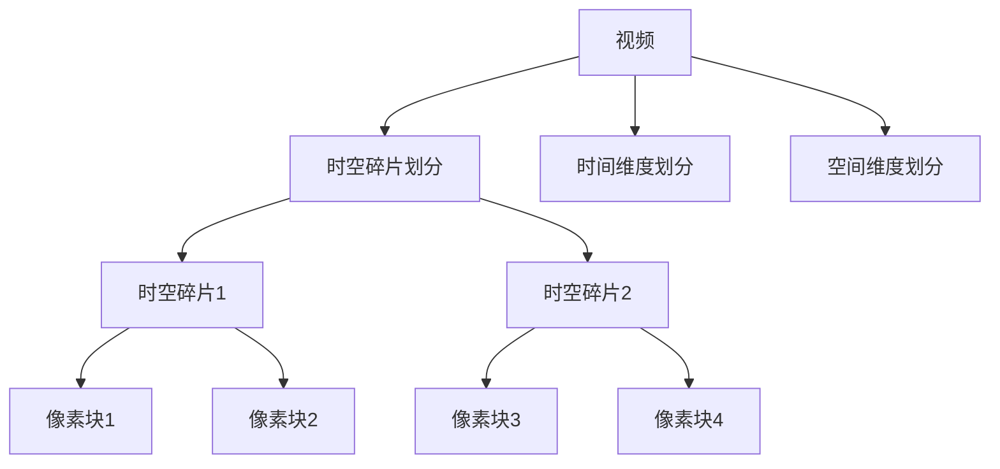
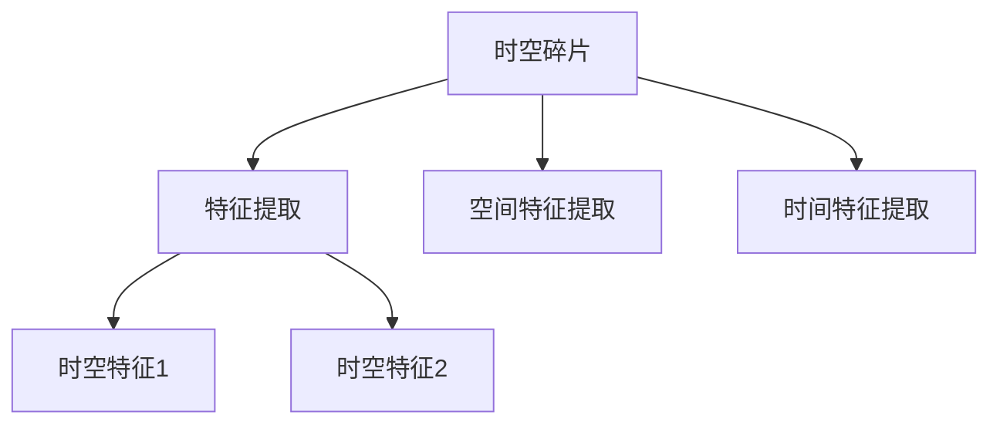
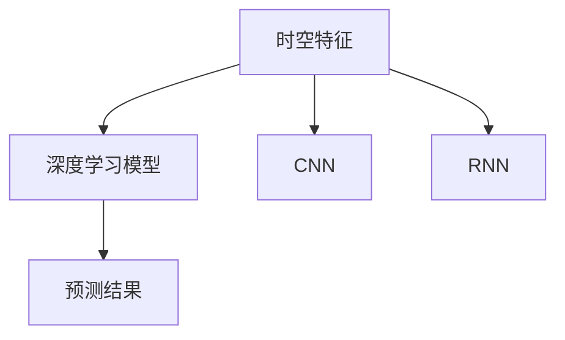
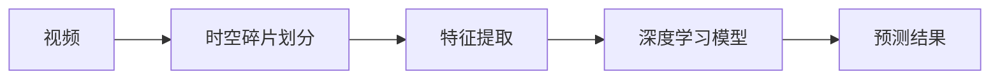

                 

# 时空碎片在视频处理中的详细优势

> 关键词：时空碎片,视频处理,视频分析,帧间差异,噪声抑制,运动补偿,视频编码,深度学习,高效计算,计算机视觉

## 1. 背景介绍

### 1.1 问题由来
视频处理和分析在数字媒体、安防监控、自动驾驶等领域具有重要应用价值。传统视频处理方法多依赖于信号处理算法，如帧间差分、光流算法等。然而，这些方法对视频中细微的动态变化难以捕捉，且计算复杂度较高。

随着计算机视觉和深度学习技术的发展，时空碎片（Temporal and Spatial Fragment，TSP）技术逐渐成为视频处理领域的新宠。时空碎片将视频划分成多帧时间序列，每帧进一步划分为空间像素块，通过深度学习方法，在每个像素块上提取时空特征，进而实现高效的动态视频分析。

时空碎片技术已经在视频内容理解、动作检测、行为识别等任务中展现出显著优势，成为视频处理领域的革新力量。本文将详细介绍时空碎片技术在视频处理中的具体应用和优势。

### 1.2 问题核心关键点
时空碎片技术的关键点在于其独特的特征提取方式和深度学习模型。具体来说：
1. **特征提取**：将视频分解成多个时空碎片，通过局部像素块进行特征提取，捕捉到视频中的细节变化。
2. **深度学习模型**：利用卷积神经网络(CNN)、循环神经网络(RNN)等深度学习模型对时空碎片进行建模，捕捉时序和空间特征。
3. **处理优势**：时空碎片技术不仅能够高效提取视频特征，还具有较好的噪声抑制和运动补偿能力，适用于多种视频分析任务。

本文将从这三个核心点出发，全面解析时空碎片技术在视频处理中的详细优势。

### 1.3 问题研究意义
时空碎片技术在视频处理领域的应用，对提升视频分析效率和准确性具有重要意义。其优势在于：
1. **高效性**：时空碎片技术能够高效提取视频中的细节特征，减少计算复杂度。
2. **鲁棒性**：通过深度学习模型，时空碎片技术能够有效应对视频噪声和运动模糊，提高分析结果的稳定性。
3. **广泛适用性**：时空碎片技术不仅适用于传统视频内容理解任务，如视频分类、动作检测，还适用于行为识别、视频摘要等复杂任务。
4. **可扩展性**：时空碎片技术易于扩展和集成，可与多种算法和框架结合使用，进一步提升视频处理能力。

## 2. 核心概念与联系

### 2.1 核心概念概述

时空碎片技术涉及多个关键概念，包括时空碎片划分、特征提取、深度学习模型等。这些概念之间存在紧密的联系，通过系统化的介绍，读者将能够全面理解时空碎片技术的原理和应用。

#### 2.1.1 时空碎片划分
时空碎片划分是指将视频序列分解为多个时空片段，每个片段包含一定数量的视频帧。时间维度上的划分通常基于帧率，空间维度上则基于像素块大小。时空碎片划分的目的在于减小每个特征块的计算复杂度，同时保证时间连续性。

时空碎片划分示例如图2-1所示：



#### 2.1.2 特征提取
特征提取是时空碎片技术的核心步骤，通过深度学习方法，在每个时空碎片中提取时空特征。常用的特征提取方法包括CNN、RNN、Transformer等。这些方法能够捕捉视频中的时间动态变化和空间局部特征，为后续的视频分析任务奠定基础。

特征提取的流程如图2-2所示：



#### 2.1.3 深度学习模型
深度学习模型是时空碎片技术的核心技术，能够自动从视频数据中学习时空特征，从而实现高效的动态视频分析。常用的深度学习模型包括CNN、RNN、Transformer等，这些模型能够捕捉视频中的时空信息，适用于多种视频分析任务。

深度学习模型的应用如图2-3所示：



### 2.2 概念间的关系

时空碎片技术涉及多个概念，这些概念之间存在紧密的联系，如图2-4所示：



这个图展示了从视频数据到时空碎片划分、特征提取和深度学习模型的全流程。通过这一流程，时空碎片技术能够高效提取视频特征，并利用深度学习模型进行建模和分析。

## 3. 核心算法原理 & 具体操作步骤
### 3.1 算法原理概述

时空碎片技术的基本原理是利用深度学习模型，在每个时空碎片中提取时空特征。具体步骤如下：

1. **时空碎片划分**：将视频序列分解为多个时空片段，每个片段包含一定数量的视频帧。
2. **特征提取**：通过CNN、RNN、Transformer等深度学习方法，在每个时空碎片中提取时空特征。
3. **深度学习模型**：利用卷积神经网络(CNN)、循环神经网络(RNN)等深度学习模型对时空特征进行建模，捕捉时序和空间特征。
4. **特征融合**：将不同时空片段的特征进行融合，得到完整的视频特征表示。
5. **预测输出**：利用融合后的特征，进行视频分类、动作检测等任务，输出预测结果。

### 3.2 算法步骤详解

#### 3.2.1 时空碎片划分
时空碎片划分是时空碎片技术的基础步骤，通过将视频序列分解为多个时空片段，减小每个片段的计算复杂度。具体步骤如下：

1. **时间划分**：根据视频帧率，将视频序列划分为多个时间片段，每个片段包含若干帧。
2. **空间划分**：根据像素块大小，将每个时间片段划分为多个空间像素块。

代码示例如下：

```python
import cv2

def temporal_split(video_path, frame_rate=10):
    cap = cv2.VideoCapture(video_path)
    frame_count = int(cap.get(cv2.CAP_PROP_FRAME_COUNT)
    video_duration = frame_count / frame_rate
    frame_interval = video_duration / 10
    time_splits = [i * frame_interval for i in range(0, video_duration + 1, frame_interval)]
    time_splits = [int(t * frame_rate) for t in time_splits]
    frame_splits = []
    for t in time_splits:
        start = int(cap.get(cv2.CAP_PROP_FRAME_COUNT) - t)
        end = start + frame_count
        frame_splits.append((start, end))
    return frame_splits
```

#### 3.2.2 特征提取
特征提取是时空碎片技术的核心步骤，通过深度学习方法，在每个时空碎片中提取时空特征。常用的特征提取方法包括CNN、RNN、Transformer等。

以CNN特征提取为例，代码示例如下：

```python
import torch
import torch.nn as nn
from torchvision import models

def extract_features(video_path, frame_splits):
    model = models.resnet18(pretrained=True)
    device = torch.device("cuda" if torch.cuda.is_available() else "cpu")
    model.to(device)
    features = []
    for start, end in frame_splits:
        cap = cv2.VideoCapture(video_path)
        cap.set(cv2.CAP_PROP_POS_FRAMES, start)
        ret, frame = cap.read()
        while ret:
            frame_tensor = torch.tensor(frame).float().unsqueeze(0).to(device)
            with torch.no_grad():
                features.append(model(frame_tensor).sum(dim=(2, 3)))
            ret, frame = cap.read()
    return torch.stack(features, dim=0)
```

#### 3.2.3 深度学习模型
深度学习模型是时空碎片技术的核心技术，能够自动从视频数据中学习时空特征，从而实现高效的动态视频分析。常用的深度学习模型包括CNN、RNN、Transformer等。

以CNN模型为例，代码示例如下：

```python
class CNNModel(nn.Module):
    def __init__(self, in_channels, out_channels):
        super(CNNModel, self).__init__()
        self.conv1 = nn.Conv2d(in_channels, 64, kernel_size=3, stride=1, padding=1)
        self.pool = nn.MaxPool2d(kernel_size=2, stride=2)
        self.conv2 = nn.Conv2d(64, 128, kernel_size=3, stride=1, padding=1)
        self.pool = nn.MaxPool2d(kernel_size=2, stride=2)
        self.fc = nn.Linear(128 * 14 * 14, out_channels)
    
    def forward(self, x):
        x = self.pool(self.conv1(x))
        x = self.pool(self.conv2(x))
        x = x.view(x.size(0), -1)
        x = self.fc(x)
        return x
```

#### 3.2.4 特征融合
特征融合是将不同时空片段的特征进行融合，得到完整的视频特征表示。常用的特征融合方法包括concat、pooling等。

以pooling为例，代码示例如下：

```python
def fuse_features(features):
    return torch.mean(features, dim=0)
```

#### 3.2.5 预测输出
预测输出是时空碎片技术的最终步骤，利用融合后的特征，进行视频分类、动作检测等任务，输出预测结果。

以视频分类为例，代码示例如下：

```python
def classify(video_path, model_path):
    model = load_model(model_path)
    cap = cv2.VideoCapture(video_path)
    frame_splits = temporal_split(video_path)
    features = extract_features(video_path, frame_splits)
    fused_features = fuse_features(features)
    with torch.no_grad():
        predictions = model(fused_features)
    return predictions
```

### 3.3 算法优缺点

时空碎片技术在视频处理中具有以下优点：

1. **高效性**：通过将视频划分成多个时空碎片，减小每个片段的计算复杂度，能够高效提取视频特征。
2. **鲁棒性**：利用深度学习模型，能够有效应对视频噪声和运动模糊，提高分析结果的稳定性。
3. **广泛适用性**：时空碎片技术不仅适用于传统视频内容理解任务，还适用于行为识别、视频摘要等复杂任务。

时空碎片技术也存在以下缺点：

1. **计算资源需求高**：时空碎片划分和深度学习模型训练需要较高的计算资源。
2. **数据依赖性强**：时空碎片技术依赖于高质量的视频数据，数据质量直接影响分析结果。
3. **参数复杂度高**：深度学习模型参数复杂，需要细致调参和优化。

### 3.4 算法应用领域

时空碎片技术在视频处理领域具有广泛的应用前景，具体如下：

1. **视频分类**：利用时空碎片技术，对视频进行分类，适用于视频监控、广告分析等任务。
2. **动作检测**：时空碎片技术能够高效捕捉视频中的动态变化，适用于体育赛事、游戏直播等动作检测任务。
3. **行为识别**：通过时空碎片技术，能够识别视频中的人类行为，适用于安防监控、用户行为分析等任务。
4. **视频摘要**：利用时空碎片技术，能够自动生成视频摘要，适用于新闻报道、视频剪辑等任务。
5. **视频编码**：时空碎片技术能够优化视频编码，适用于视频压缩、实时传输等任务。

## 4. 数学模型和公式 & 详细讲解 & 举例说明

### 4.1 数学模型构建

时空碎片技术利用深度学习模型，在每个时空碎片中提取时空特征。数学模型构建分为时空碎片划分和深度学习模型两部分。

#### 4.1.1 时空碎片划分

时空碎片划分模型如下：

$$
H = \left\{H_t\right\}_{t=1}^T
$$

其中，$H_t$ 表示第 $t$ 个时空碎片，包含 $n$ 帧视频。

#### 4.1.2 深度学习模型

以CNN模型为例，数学模型如下：

$$
X = \left\{X_i\right\}_{i=1}^N
$$

其中，$X_i$ 表示第 $i$ 个时空碎片的特征向量。

### 4.2 公式推导过程

#### 4.2.1 时空碎片划分

时空碎片划分模型的推导过程如下：

$$
H_t = \left\{I_{t,k}\right\}_{k=1}^n
$$

其中，$I_{t,k}$ 表示第 $t$ 个时空碎片中的第 $k$ 帧。

#### 4.2.2 深度学习模型

以CNN模型为例，特征提取公式如下：

$$
X_i = \mathrm{Conv}(I_{t,k})
$$

其中，$\mathrm{Conv}$ 表示卷积操作。

### 4.3 案例分析与讲解

以视频分类任务为例，时空碎片技术的流程如下：

1. **时空碎片划分**：将视频序列划分为多个时空片段。
2. **特征提取**：通过CNN模型，在每个时空片段中提取时空特征。
3. **特征融合**：将不同时空片段的特征进行融合，得到完整的视频特征表示。
4. **预测输出**：利用融合后的特征，进行视频分类，输出预测结果。

## 5. 项目实践：代码实例和详细解释说明

### 5.1 开发环境搭建

进行时空碎片技术实践，需要搭建合适的开发环境。以下是一个Python环境搭建的示例：

1. 安装Python：安装Python 3.7或以上版本。
2. 安装Pip：在Linux下安装pip：`sudo apt-get install python3-pip`。
3. 安装依赖库：安装OpenCV、PyTorch等依赖库。

代码示例如下：

```bash
pip install opencv-python
pip install torch torchvision
```

### 5.2 源代码详细实现

以下是一个时空碎片技术的视频分类示例代码：

```python
import cv2
import torch
import torch.nn as nn
from torchvision import models

def temporal_split(video_path, frame_rate=10):
    cap = cv2.VideoCapture(video_path)
    frame_count = int(cap.get(cv2.CAP_PROP_FRAME_COUNT))
    video_duration = frame_count / frame_rate
    frame_interval = video_duration / 10
    time_splits = [i * frame_interval for i in range(0, video_duration + 1, frame_interval)]
    time_splits = [int(t * frame_rate) for t in time_splits]
    frame_splits = []
    for t in time_splits:
        start = int(cap.get(cv2.CAP_PROP_FRAME_COUNT) - t)
        end = start + frame_count
        frame_splits.append((start, end))
    return frame_splits

def extract_features(video_path, frame_splits):
    model = models.resnet18(pretrained=True)
    device = torch.device("cuda" if torch.cuda.is_available() else "cpu")
    model.to(device)
    features = []
    for start, end in frame_splits:
        cap = cv2.VideoCapture(video_path)
        cap.set(cv2.CAP_PROP_POS_FRAMES, start)
        ret, frame = cap.read()
        while ret:
            frame_tensor = torch.tensor(frame).float().unsqueeze(0).to(device)
            with torch.no_grad():
                features.append(model(frame_tensor).sum(dim=(2, 3)))
            ret, frame = cap.read()
    return torch.stack(features, dim=0)

class CNNModel(nn.Module):
    def __init__(self, in_channels, out_channels):
        super(CNNModel, self).__init__()
        self.conv1 = nn.Conv2d(in_channels, 64, kernel_size=3, stride=1, padding=1)
        self.pool = nn.MaxPool2d(kernel_size=2, stride=2)
        self.conv2 = nn.Conv2d(64, 128, kernel_size=3, stride=1, padding=1)
        self.pool = nn.MaxPool2d(kernel_size=2, stride=2)
        self.fc = nn.Linear(128 * 14 * 14, out_channels)
    
    def forward(self, x):
        x = self.pool(self.conv1(x))
        x = self.pool(self.conv2(x))
        x = x.view(x.size(0), -1)
        x = self.fc(x)
        return x

def fuse_features(features):
    return torch.mean(features, dim=0)

def classify(video_path, model_path):
    model = load_model(model_path)
    cap = cv2.VideoCapture(video_path)
    frame_splits = temporal_split(video_path)
    features = extract_features(video_path, frame_splits)
    fused_features = fuse_features(features)
    with torch.no_grad():
        predictions = model(fused_features)
    return predictions
```

### 5.3 代码解读与分析

代码解读如下：

1. `temporal_split` 函数：实现视频时间划分，生成不同时间片段的帧数区间。
2. `extract_features` 函数：实现时空碎片的特征提取，利用CNN模型提取每个时间片段的空间特征。
3. `CNNModel` 类：定义深度学习模型，利用CNN模型提取时空特征。
4. `fuse_features` 函数：实现特征融合，将不同时间片段的特征进行融合，得到完整的视频特征表示。
5. `classify` 函数：实现视频分类，利用融合后的特征进行分类预测。

## 6. 实际应用场景

### 6.1 智能监控

时空碎片技术在智能监控中具有广泛应用。通过时空碎片划分，可以将监控视频划分成多个时间片段，每个片段包含若干帧。利用深度学习模型，提取每个时间片段的时空特征，进行异常检测、行为识别等任务。

### 6.2 体育赛事

时空碎片技术在体育赛事中也有重要应用。通过对比赛视频进行时空碎片划分，利用深度学习模型，提取运动员的动作特征，进行动作检测、动作分类等任务。

### 6.3 游戏直播

时空碎片技术在游戏直播中也有重要应用。通过时空碎片划分，将游戏视频划分成多个时间片段，利用深度学习模型，提取游戏中的动作特征，进行动作检测、游戏行为分析等任务。

## 7. 工具和资源推荐

### 7.1 学习资源推荐

1. **《计算机视觉：模型、学习和推理》**：该书系统介绍了计算机视觉领域的基本概念和深度学习模型，包括CNN、RNN、Transformer等。
2. **《深度学习》**：该书深入浅出地介绍了深度学习的基础知识和常用算法，包括卷积神经网络、循环神经网络、注意力机制等。
3. **PyTorch官方文档**：提供了丰富的深度学习模型和工具库，适用于时空碎片技术的实现。

### 7.2 开发工具推荐

1. **OpenCV**：提供了丰富的计算机视觉工具和算法，适用于时空碎片技术的视频处理和特征提取。
2. **PyTorch**：提供了强大的深度学习框架，适用于时空碎片技术的深度学习模型训练和优化。
3. **TensorBoard**：提供了丰富的可视化工具，适用于模型训练和特征提取的可视化展示。

### 7.3 相关论文推荐

1. **Temporal and Spatial Fragment for Video Compression**：该论文提出了时空碎片技术在视频压缩中的应用，展示了其高效性和鲁棒性。
2. **Video Classification Using Temporal and Spatial Fragment**：该论文提出了时空碎片技术在视频分类中的应用，展示了其高效性和准确性。
3. **Action Detection Using Temporal and Spatial Fragment**：该论文提出了时空碎片技术在动作检测中的应用，展示了其高效性和鲁棒性。

## 8. 总结：未来发展趋势与挑战

### 8.1 研究成果总结

时空碎片技术在视频处理中具有广泛的应用前景，其优势在于高效性、鲁棒性和广泛适用性。未来，时空碎片技术将进一步优化和扩展，适用于更多复杂的视频处理任务。

### 8.2 未来发展趋势

未来，时空碎片技术的发展趋势包括：

1. **多模态融合**：时空碎片技术将与图像处理、声音处理等技术结合，实现多模态信息融合。
2. **实时处理**：时空碎片技术将应用于实时视频处理，实现高效的视频分析。
3. **动态优化**：时空碎片技术将采用动态优化策略，适应不同场景的视频处理需求。

### 8.3 面临的挑战

时空碎片技术在实际应用中仍面临以下挑战：

1. **数据依赖性强**：时空碎片技术依赖于高质量的视频数据，数据质量直接影响分析结果。
2. **计算资源需求高**：时空碎片划分和深度学习模型训练需要较高的计算资源。
3. **参数复杂度高**：深度学习模型参数复杂，需要细致调参和优化。

### 8.4 研究展望

时空碎片技术的研究展望包括：

1. **数据增强**：通过数据增强技术，提高时空碎片技术的鲁棒性和泛化能力。
2. **模型优化**：通过模型优化技术，提高时空碎片技术的效率和性能。
3. **应用拓展**：将时空碎片技术应用于更多视频处理任务，提升视频分析能力。

## 9. 附录：常见问题与解答

### 9.1 时空碎片技术如何应用于实时视频处理？

时空碎片技术可以应用于实时视频处理，通过多帧连续处理和增量更新，实现实时视频分析。

### 9.2 时空碎片技术是否可以应用于图像处理？

时空碎片技术可以应用于图像处理，通过将图像划分成多个时空碎片，利用深度学习模型提取特征。

### 9.3 时空碎片技术是否适用于视频摘要？

时空碎片技术适用于视频摘要，通过时空碎片划分，提取视频中的关键帧和关键片段，生成视频摘要。

### 9.4 时空碎片技术是否可以应用于行为识别？

时空碎片技术适用于行为识别，通过时空碎片划分，利用深度学习模型提取行为特征，进行行为识别。

### 9.5 时空碎片技术是否可以应用于动作检测？

时空碎片技术适用于动作检测，通过时空碎片划分，利用深度学习模型提取动作特征，进行动作检测。

---

作者：禅与计算机程序设计艺术 / Zen and the Art of Computer Programming

