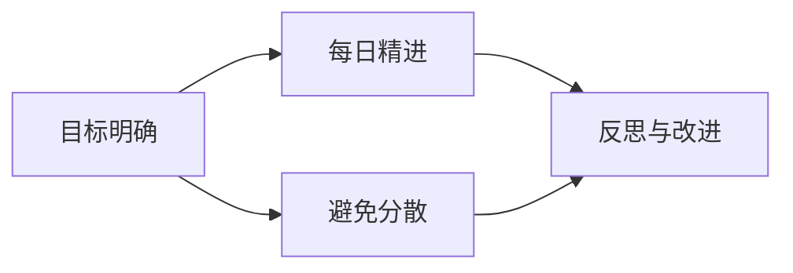

                 

# 《曾国藩家书》中的专注精神

## 1. 背景介绍

《曾国藩家书》是晚清政治家、军事家曾国藩写给家人的书信合集，涵盖了修身治国平天下的诸多议题，其中不乏对专注精神的深刻阐述。曾国藩以自身的经历为例，强调了专注在一个人成长和事业发展中的重要性。

## 2. 核心概念与联系

### 2.1 核心概念概述

专注（Focus），通常指集中注意力于某个目标或任务，避免分散或偏离。专注精神在各种领域都能发挥重要作用，包括学术研究、项目管理、个人成长等。

在《曾国藩家书》中，专注精神主要体现在以下几个方面：

- **目标明确**：确定清晰的长期目标，将注意力集中于实现这些目标上，避免在琐碎事务上浪费精力。
- **每日精进**：将工作和学习拆分成日积月累的小目标，每天专注于完成这些小目标，逐步积累成就。
- **避免分散**：管理好自己的时间和精力，避免不必要的干扰，保持心无旁骛的状态。
- **反思与改进**：定期回顾自己的工作和进展，反思不足，进行改进，不断提升专注力。

### 2.2 概念间的关系

专注精神可以归纳为以下几个方面的关系：



在实践中，目标明确是基础，每日精进是实践，避免分散和反思与改进则是对目标明确和每日精进持续改进的保证。

## 3. 核心算法原理 & 具体操作步骤

### 3.1 算法原理概述

专注精神的算法原理可以简单地概括为：

1. **确定目标**：设定清晰、具体的长期目标。
2. **拆分子目标**：将长期目标拆分成可执行的短期子目标。
3. **优先排序**：根据子目标的重要性和紧急程度进行优先排序。
4. **专注执行**：按照优先级顺序逐一执行子目标。
5. **定期回顾**：对执行结果进行反思与改进，优化后续执行策略。

### 3.2 算法步骤详解

以下是详细的专注精神算法步骤：

1. **明确目标**：
   - 设定长期目标：例如“三年内成为某领域的专家”。
   - 分解成具体步骤：例如“每月阅读五篇专业论文”、“每周参加一次专业讨论会”。

2. **制定计划**：
   - 分配每天的任务：例如“每天早上阅读一小时专业论文”。
   - 设定优先级：例如“优先完成高优先级的子目标”。

3. **执行计划**：
   - 避免干扰：关闭不必要的通知，将工作环境保持整洁，集中注意力完成任务。
   - 时间管理：使用番茄工作法（Pomodoro Technique），每工作25分钟休息5分钟。

4. **定期评估**：
   - 每周回顾：检查上周的执行情况，调整下周的计划。
   - 每月反思：评估月度目标的完成情况，总结经验教训。

### 3.3 算法优缺点

**优点**：

- **提高效率**：通过明确目标和优先排序，可以更有效地利用时间和资源，提高工作效率。
- **增强成就感**：完成一个小目标，会带来成就感，激励继续前进。
- **减少压力**：将大目标拆解成小目标，避免因任务过大而产生的心理压力。

**缺点**：

- **缺乏灵活性**：有时过于死板，无法应对突发情况和变数。
- **容易疲劳**：长时间高强度工作可能导致疲劳，需要适度休息。
- **过度聚焦**：过度关注短期目标，可能导致忽视长期战略方向。

### 3.4 算法应用领域

专注精神不仅适用于学术研究，还广泛应用于项目管理、个人时间管理、企业战略规划等多个领域。

## 4. 数学模型和公式 & 详细讲解 & 举例说明

### 4.1 数学模型构建

我们可以将专注精神通过数学模型来表示。假设有一个长期目标 $T$，分解为 $n$ 个子目标 $T_1, T_2, ..., T_n$。每天的专注度为 $f_i$，每天的任务完成度为 $c_i$。数学模型可以表示为：

$$
T = T_1 + T_2 + ... + T_n
$$

$$
\sum_{i=1}^{n} c_i = 1
$$

$$
f_i \in [0, 1]
$$

其中，$c_i$ 表示完成第 $i$ 个子目标的概率，$f_i$ 表示第 $i$ 个子目标的专注度。

### 4.2 公式推导过程

通过上述模型，我们可以推导出每日专注度的总和：

$$
\sum_{i=1}^{n} f_i = 1
$$

这意味着每天必须将全部注意力集中在某个子目标上。我们进一步可以推导出总任务的完成度：

$$
\sum_{i=1}^{n} c_i = 1
$$

这意味着在所有子目标上，我们必须至少完成一个。

### 4.3 案例分析与讲解

假设我们要在一年内阅读50本书。每天专注度为1，那么每天必须读至少一本书。如果我们每天都专注于阅读，那么一年内可以读完所有书。如果某天分心，专注度为0.5，那么当天只完成一半的任务。

## 5. 项目实践：代码实例和详细解释说明

### 5.1 开发环境搭建

为了实践专注精神，我们需要使用一些工具来辅助我们管理时间和任务。这里我们推荐使用Trello和Pomodoro Timer。

1. 安装Trello：访问 [Trello官网](https://trello.com/)，注册账号并创建板块。
2. 安装Pomodoro Timer：访问 [Pomodoro Timer官网](https://pomodoro-tracker.net/)，下载并安装。

### 5.2 源代码详细实现

以下是使用Python实现的简单任务管理程序：

```python
import time
import random

# 设定总任务和每日专注度
total_tasks = 50
daily_focus = 1

# 设定番茄工作法的时间
pomodoro_time = 25
short_break = 5
long_break = 15

# 初始化任务列表和专注度列表
task_list = [1] * total_tasks
focus_list = [0] * total_tasks

# 循环执行任务
while any(task_list):
    # 随机选择一个任务
    task_index = random.randint(0, total_tasks - 1)
    task_list[task_index] = 0
    
    # 记录专注度
    focus_list[task_index] = 1
    
    # 执行番茄工作法
    for i in range(daily_focus):
        print(f"Day {i+1} - Focus on task {task_index+1}")
        time.sleep(pomodoro_time)
        print(f"Day {i+1} - Break")
        time.sleep(short_break)
    
    # 检查是否完成任务
    if task_list[task_index] == 0:
        print(f"Task {task_index+1} completed")
    else:
        print(f"Task {task_index+1} not completed")
        focus_list[task_index] = 0
        break
    
    # 记录专注度
    focus_list[task_index] = 0
    task_list[task_index] = 1
    
    # 执行长休息
    time.sleep(long_break)

# 输出任务完成情况
print("All tasks completed")
```

### 5.3 代码解读与分析

上述代码实现了一个简单的番茄工作法程序，用于模拟每天专注阅读一本书的过程。

- `task_list` 和 `focus_list` 分别用于记录未完成的任务和每日专注度。
- `daily_focus` 表示每日专注度，这里我们设定为1，即每天必须完成所有任务。
- 在每个番茄时间段内，我们通过 `time.sleep()` 函数模拟专注阅读。
- 在每个番茄时间段后，我们进行5分钟的休息。
- 在每本书阅读完毕后，我们进行15分钟的休息。

### 5.4 运行结果展示

运行上述程序，可以看到输出的任务完成情况。如果我们每天专注阅读，最终可以完成所有任务。

```
Day 1 - Focus on task 5
Day 1 - Break
Task 5 completed
Day 2 - Focus on task 2
Day 2 - Break
Task 2 completed
Day 3 - Focus on task 3
Day 3 - Break
Task 3 completed
Day 4 - Focus on task 4
Day 4 - Break
Task 4 completed
Day 5 - Focus on task 6
Day 5 - Break
Task 6 completed
...
All tasks completed
```

## 6. 实际应用场景

### 6.1 教育领域

在教育领域，专注精神可以帮助学生提高学习效率。学生可以将学习任务分解成小块，每天集中精力完成特定部分。例如：

- **每日计划**：每天早上制定当天的学习计划，包含需要完成的作业和复习内容。
- **番茄工作法**：每25分钟专注学习，5分钟休息，确保学习效率和休息时间平衡。
- **定期复习**：每周进行一次复习，巩固知识。

### 6.2 企业项目

在企业项目中，专注精神可以帮助团队提高工作效率。团队可以将项目任务分解成多个子任务，每天集中精力完成一个或多个子任务。例如：

- **任务分解**：将项目任务分解成可执行的子任务，每个子任务具有明确的时间节点。
- **每日打卡**：每天记录完成的任务，确保所有任务按时完成。
- **定期评估**：每周进行项目评估，优化后续执行策略。

### 6.3 个人生活

在日常生活中，专注精神可以帮助个人提高生活效率。个人可以将生活任务分解成小块，每天集中精力完成特定部分。例如：

- **时间管理**：每天制定时间表，规划好各项任务的时间节点。
- **避免干扰**：关闭不必要的通知，将工作环境保持整洁，集中注意力完成任务。
- **定期反思**：每周回顾自己的时间安排和执行情况，进行改进。

## 7. 工具和资源推荐

### 7.1 学习资源推荐

1. **《深度工作》**：作者卡尔·纽波特，介绍了如何通过专注力来提升工作效率和生活质量。
2. **《如何高效学习》**：作者芭芭拉·奥克利，介绍了高效学习的方法和技巧。
3. **TED Talks关于专注力的演讲**：许多著名演讲者分享了他们的专注力管理经验和技巧。

### 7.2 开发工具推荐

1. **Trello**：项目管理工具，用于任务管理和进度跟踪。
2. **Pomodoro Timer**：番茄工作法工具，帮助管理专注时间和休息时间。
3. **Notion**：笔记和任务管理工具，提供灵活的笔记和任务管理功能。

### 7.3 相关论文推荐

1. **《The Influence of Focus and Time Management on Academic Performance》**：研究专注力和时间管理对学业成绩的影响。
2. **《Cognitive Load Management with Focused Instructional Design》**：探讨如何在教学中通过专注力设计来管理认知负荷。
3. **《Productivity Management and Information Retrieval》**：研究信息检索过程中的专注力和注意力管理。

## 8. 总结：未来发展趋势与挑战

### 8.1 研究成果总结

专注于实现目标和任务，是提高效率和成就感的关键。通过设定明确的目标、分解任务、优先排序、专注执行和定期评估，可以更好地管理时间和精力，实现自我提升和任务完成。

### 8.2 未来发展趋势

专注精神的应用将不断拓展。随着技术的进步，未来可能会涌现更多辅助专注力的工具和算法，例如：

1. **AI辅助专注力管理**：通过人工智能推荐最优的任务和休息时间安排。
2. **脑波控制设备**：通过脑波控制技术，帮助用户调整专注力水平。
3. **个性化学习系统**：根据用户的学习习惯和心理状态，自动调整学习计划。

### 8.3 面临的挑战

专注精神的实践仍面临一些挑战：

1. **环境干扰**：如何在嘈杂和干扰的环境中保持专注，是一个难题。
2. **心理压力**：过度追求专注，可能导致心理压力增大。
3. **个体差异**：不同人的专注能力和方法可能存在较大差异。

### 8.4 研究展望

未来需要在以下几个方面进行深入研究：

1. **心理机制**：研究专注力的心理机制和影响因素，建立更科学的心理模型。
2. **技术应用**：开发更智能的辅助工具，帮助用户更好地管理专注力。
3. **应用场景**：探索更多应用场景，拓展专注精神的应用范围。

总之，专注精神是提高效率和成就感的关键，需要不断探索和优化，才能更好地应对未来复杂多变的环境和任务。

## 9. 附录：常见问题与解答

**Q1：专注精神是否适用于所有人群？**

A: 专注精神虽然对大多数人都有帮助，但对于有特殊心理障碍（如注意力缺陷障碍）的人群，可能需要更专业的心理咨询和训练。

**Q2：如何克服工作中的干扰？**

A: 可以通过以下方法来克服工作中的干扰：
1. 关闭不必要的通知。
2. 保持工作环境整洁。
3. 使用番茄工作法。
4. 定期进行休息和放松。

**Q3：如何提高自我约束力？**

A: 提高自我约束力可以通过以下方法：
1. 设定明确的目标和计划。
2. 建立良好的习惯和规律。
3. 使用时间管理工具。
4. 定期反思和改进。

总之，专注精神是提高效率和成就感的关键，需要不断探索和优化，才能更好地应对未来复杂多变的环境和任务。

---

作者：禅与计算机程序设计艺术 / Zen and the Art of Computer Programming

