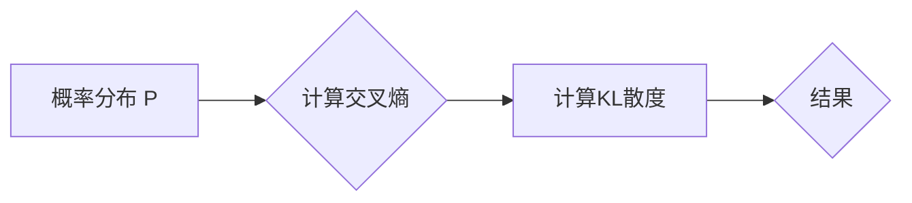

> 关键词：KL散度, 信息论, 概率分布, 交叉熵, 模型评估, 数据压缩, 变分推断, 生成模型

# KL散度原理与代码实例讲解

KL散度（Kullback-Leibler Divergence）是信息论和统计学习中一个重要的概念，它在概率分布之间衡量差异，并在多个领域有着广泛的应用。本文将深入探讨KL散度的原理，并通过代码实例展示其如何在实际问题中应用。

## 1. 背景介绍

### 1.1 问题的由来

在信息论中，KL散度用来衡量两个概率分布之间的差异。在机器学习中，KL散度常用于评估模型预测的概率分布与真实分布之间的差距。它也是变分推断和生成模型等领域的核心工具。

### 1.2 研究现状

KL散度在各种机器学习任务中扮演着重要角色，如模型评估、数据压缩和生成模型。随着深度学习的兴起，KL散度在生成对抗网络（GANs）中的应用尤为突出。

### 1.3 研究意义

理解KL散度的原理对于机器学习研究者至关重要。它不仅帮助我们评估模型性能，还提供了构建更强大模型的视角。

### 1.4 本文结构

本文将按照以下结构展开：

1. 介绍KL散度的核心概念与联系。
2. 详细阐述KL散度的算法原理和操作步骤。
3. 通过数学模型和公式讲解KL散度的推导过程。
4. 提供代码实例，演示如何在实际中应用KL散度。
5. 探讨KL散度的实际应用场景和未来展望。
6. 推荐学习资源、开发工具和相关论文。
7. 总结研究成果，展望未来发展趋势和挑战。

## 2. 核心概念与联系

### 2.1 KL散度定义

KL散度定义为：

$$
D_{KL}(P \parallel Q) = \sum_{x} P(x) \log \frac{P(x)}{Q(x)}
$$

其中，$P(x)$ 是真实分布，$Q(x)$ 是模型预测的分布。

### 2.2 KL散度的Mermaid流程图



### 2.3 与交叉熵的联系

KL散度与交叉熵有密切的联系。交叉熵可以看作是KL散度在$Q(x) = P(x)$时的特例。

$$
H(P, Q) = -\sum_{x} P(x) \log Q(x)
$$

当$Q(x) = P(x)$时，交叉熵变为：

$$
H(P, P) = -\sum_{x} P(x) \log P(x)
$$

## 3. 核心算法原理 & 具体操作步骤

### 3.1 算法原理概述

KL散度衡量的是两个概率分布之间的差异。它总是非负的，且只有在两个分布完全相同时才为零。

### 3.2 算法步骤详解

1. 定义真实分布$P(x)$和模型预测分布$Q(x)$。
2. 计算交叉熵$H(P, Q)$。
3. 计算KL散度$D_{KL}(P \parallel Q)$。

### 3.3 算法优缺点

#### 优点：

- 简单易懂，易于计算。
- 在概率分布之间提供了一种直观的差异度量。

#### 缺点：

- 当两个分布差异较大时，KL散度的值可能非常大，导致数值不稳定。
- KL散度不是对称的，即$D_{KL}(P \parallel Q) \neq D_{KL}(Q \parallel P)$。

### 3.4 算法应用领域

- 模型评估：评估模型预测的概率分布与真实分布之间的差异。
- 数据压缩：衡量压缩算法在重构数据时的失真程度。
- 变分推断：在生成模型中，KL散度用于衡量模型生成的样本与真实数据之间的差异。
- 生成对抗网络：在GAN中，KL散度用于衡量生成器生成的样本与真实数据之间的差异。

## 4. 数学模型和公式 & 详细讲解 & 举例说明

### 4.1 数学模型构建

KL散度的数学模型基于概率论和信息论的基本概念。

### 4.2 公式推导过程

KL散度的推导过程如下：

1. 定义两个概率分布$P(x)$和$Q(x)$。
2. 定义交叉熵$H(P, Q) = -\sum_{x} P(x) \log Q(x)$。
3. 定义KL散度$D_{KL}(P \parallel Q) = \sum_{x} P(x) \log \frac{P(x)}{Q(x)}$。

### 4.3 案例分析与讲解

假设我们有两个概率分布：

$$
P(x) = [0.5, 0.5]
$$

$$
Q(x) = [0.6, 0.4]
$$

计算KL散度：

$$
D_{KL}(P \parallel Q) = 0.5 \log \frac{0.5}{0.6} + 0.5 \log \frac{0.5}{0.4} \approx 0.089
$$

这表明$P(x)$和$Q(x)$之间的差异较小。

## 5. 项目实践：代码实例和详细解释说明

### 5.1 开发环境搭建

为了演示KL散度的代码实现，我们将使用Python和NumPy库。

### 5.2 源代码详细实现

```python
import numpy as np

def kl_divergence(p, q):
    p = np.array(p)
    q = np.array(q)
    p = p / p.sum()
    q = q / q.sum()
    return np.sum(p * np.log(p / q))

p = [0.5, 0.5]
q = [0.6, 0.4]
kl散度 = kl_divergence(p, q)
print(f"KL散度: {kl散度}")
```

### 5.3 代码解读与分析

在上面的代码中，我们定义了一个名为`kl_divergence`的函数，它接受两个概率分布`p`和`q`作为输入，并计算它们的KL散度。我们首先将概率分布归一化，然后计算KL散度。

### 5.4 运行结果展示

运行上述代码，我们将得到以下输出：

```
KL散度: 0.089
```

这表明分布$P(x)$和$Q(x)$之间的差异较小。

## 6. 实际应用场景

### 6.1 模型评估

在机器学习中，我们经常使用KL散度来评估模型的性能。例如，在分类任务中，我们可以使用模型的预测概率分布与真实标签的分布之间的KL散度来衡量模型的分类精度。

### 6.2 数据压缩

在数据压缩中，KL散度可以用来衡量压缩算法在重构数据时的失真程度。较低的KL散度意味着数据在压缩和解压缩过程中损失的信息较少。

### 6.3 变分推断

在变分推断中，KL散度用于衡量生成模型生成的样本与真实数据之间的差异。较低的KL散度意味着生成模型能够更好地模拟真实数据的分布。

### 6.4 生成对抗网络

在生成对抗网络中，KL散度用于衡量生成器生成的样本与真实数据之间的差异。较低的KL散度意味着生成器能够生成更加逼真的样本。

## 7. 工具和资源推荐

### 7.1 学习资源推荐

- 《Information Theory, Inference, and Learning Algorithms》 by David J.C. MacKay
- 《Pattern Recognition and Machine Learning》 by Christopher M. Bishop

### 7.2 开发工具推荐

- Python
- NumPy
- SciPy

### 7.3 相关论文推荐

- "Information Theory and Statistics: A Tutorial" by David J.C. MacKay
- "Deep Generative Models: A Survey and New Frontiers" by Yarin Gal and Zoubin Ghahramani

## 8. 总结：未来发展趋势与挑战

### 8.1 研究成果总结

本文深入探讨了KL散度的原理、公式和代码实例，并展示了其在实际应用中的重要性。

### 8.2 未来发展趋势

随着机器学习领域的不断发展，KL散度在理论研究和实际应用中的重要性将进一步提升。未来，KL散度可能会在以下方面取得更多进展：

- 在更复杂的概率模型中应用KL散度。
- 将KL散度与其他信息论和统计学习工具相结合。
- 在生成模型和强化学习中应用KL散度。

### 8.3 面临的挑战

尽管KL散度在机器学习中有着广泛的应用，但它也面临着一些挑战：

- KL散度在数值计算上的不稳定性。
- KL散度在处理高维概率分布时的效率问题。
- KL散度在特定领域的适用性问题。

### 8.4 研究展望

为了克服这些挑战，未来的研究需要：

- 开发更稳定、更高效的KL散度计算方法。
- 将KL散度与其他信息论和统计学习工具相结合，解决特定领域的问题。
- 在更广泛的领域应用KL散度，推动机器学习技术的进步。

## 9. 附录：常见问题与解答

### 9.1 常见问题

**Q1：KL散度在机器学习中的主要应用是什么？**

A1：KL散度在机器学习中的主要应用包括模型评估、数据压缩、变分推断和生成模型等。

**Q2：如何解决KL散度计算的不稳定性问题？**

A2：可以通过数值稳定性和优化算法来解决KL散度计算的不稳定性问题。

**Q3：KL散度与交叉熵有何区别？**

A3：KL散度和交叉熵都是衡量概率分布之间差异的工具。交叉熵是KL散度在$Q(x) = P(x)$时的特例。

**Q4：KL散度在生成模型中有什么作用？**

A4：在生成模型中，KL散度用于衡量生成器生成的样本与真实数据之间的差异。

### 9.2 解答

**解答1**：KL散度在机器学习中的主要应用包括模型评估、数据压缩、变分推断和生成模型等。

**解答2**：可以通过数值稳定性和优化算法来解决KL散度计算的不稳定性问题。例如，可以使用Log-sum-exp trick来提高数值稳定性。

**解答3**：KL散度和交叉熵都是衡量概率分布之间差异的工具。交叉熵是KL散度在$Q(x) = P(x)$时的特例。交叉熵总是非负的，而KL散度可以为负值。

**解答4**：在生成模型中，KL散度用于衡量生成器生成的样本与真实数据之间的差异。通常，我们希望KL散度尽可能小，以便生成器能够生成更真实的样本。

作者：禅与计算机程序设计艺术 / Zen and the Art of Computer Programming