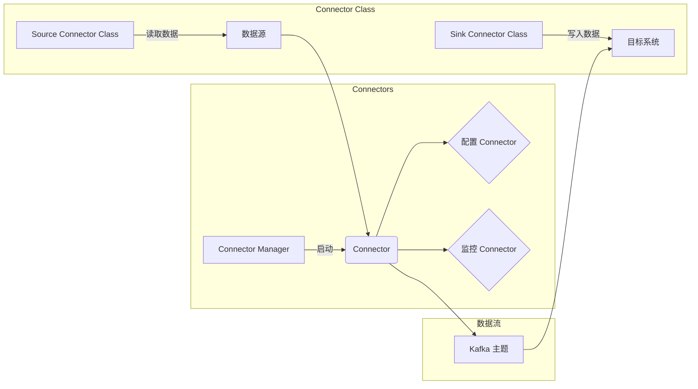

# Kafka Connect原理与代码实例讲解

> 关键词：Apache Kafka, 数据集成, Connect API, 管道连接器, 数据源和目标，微服务架构，事件驱动，大数据平台

## 1. 背景介绍

Apache Kafka 是一个开源的高吞吐量消息队列系统，广泛应用于构建实时数据管道和流处理应用。随着大数据和微服务架构的流行，数据集成变得越来越复杂，需要能够灵活连接不同数据源和目标系统的工具。Kafka Connect 是 Kafka 生态系统的一部分，它提供了一种简单而强大的方式来集成各种数据源和目标系统。

### 1.1 问题的由来

随着企业数据量的爆炸性增长，如何高效、可靠地将数据从各种来源（如数据库、日志文件、外部系统等）导入和导出到Kafka主题中，成为了一个重要的挑战。Kafka Connect 应运而生，旨在简化这一过程。

### 1.2 研究现状

Kafka Connect 提供了两种主要的集成方式：Source Connectors 和 Sink Connectors。Source Connectors 用于从外部系统读取数据并写入Kafka主题，而 Sink Connectors 用于从Kafka主题读取数据并将其写入外部系统。

### 1.3 研究意义

Kafka Connect 的出现极大地简化了数据集成的工作，使得开发者可以轻松地将各种数据源和目标系统与Kafka集成，从而构建复杂的实时数据处理管道。

### 1.4 本文结构

本文将分为以下几个部分：
- 介绍 Kafka Connect 的核心概念和架构。
- 解释 Kafka Connect 的工作原理和操作步骤。
- 通过代码实例展示如何使用 Kafka Connect 进行数据集成。
- 探讨 Kafka Connect 的实际应用场景和未来展望。
- 推荐相关学习资源和开发工具。

## 2. 核心概念与联系

### 2.1 核心概念原理

Kafka Connect 的核心概念包括：

- **Connector**：负责数据集成的组件，可以是 Source Connector 或 Sink Connector。
- **Connector Class**：定义 Connector 行为的接口。
- **Connector Configurations**：Connector 的配置参数，用于定义 Connector 的行为。
- **Connector Manager**：管理 Connectors 的组件，负责启动、停止、配置和监控 Connectors。

### 2.2 架构的 Mermaid 流程图



## 3. 核心算法原理 & 具体操作步骤

### 3.1 算法原理概述

Kafka Connect 使用 pull 模型进行数据集成。Connector 从数据源读取数据，并将其推送到 Kafka 主题。同样，Connector 也可以从 Kafka 主题读取数据，并将其写入目标系统。

### 3.2 算法步骤详解

1. **定义 Connector 配置**：配置 Connector 的行为，包括数据源和目标系统的连接信息、数据格式、数据转换等。
2. **启动 Connector Manager**：Connector Manager 负责启动和监控 Connectors。
3. **启动 Connectors**：Connector Manager 根据配置启动 Connectors。
4. **数据读取和写入**：Connectors 根据配置从数据源读取数据，并将其写入 Kafka 主题，或从 Kafka 主题读取数据，并将其写入目标系统。
5. **监控和日志记录**：Connector Manager 监控 Connectors 的状态，记录日志信息。

### 3.3 算法优缺点

**优点**：
- **灵活**：支持各种数据源和目标系统的集成。
- **可扩展**：可以水平扩展以处理更多数据。
- **容错**：在 Connector 故障时，可以自动重启。

**缺点**：
- **配置复杂**：Connector 的配置可能比较复杂。
- **性能限制**：在处理大量数据时，可能存在性能瓶颈。

### 3.4 算法应用领域

Kafka Connect 在以下领域有广泛的应用：

- **数据集成**：将数据从各种数据源导入到 Kafka 主题中。
- **数据导出**：将 Kafka 主题中的数据导出到各种目标系统中。
- **实时数据处理**：构建实时数据管道和流处理应用。

## 4. 数学模型和公式 & 详细讲解 & 举例说明

### 4.1 数学模型构建

在数据集成场景中，我们可以将数据集成过程建模为一个数据流图。数据流图由节点和边组成，节点表示数据处理的步骤，边表示数据的流动。

### 4.2 公式推导过程

数据流图可以表示为：

$$
G = (V, E)
$$

其中，$V$ 是节点集合，$E$ 是边集合。

### 4.3 案例分析与讲解

假设我们要将用户行为数据从数据库导入到 Kafka 主题中。数据流图可以表示为：


## 5. 项目实践：代码实例和详细解释说明

### 5.1 开发环境搭建

为了演示 Kafka Connect，我们需要以下环境：

- Apache Kafka
- Kafka Connect
- 数据源和目标系统

### 5.2 源代码详细实现

以下是一个简单的 Source Connector 的示例代码：

```java
public class SimpleSourceConnector extends SourceConnector {
    // ... 初始化代码 ...

    @Override
    public void start(Map<String, String> settings) {
        // ... 启动代码 ...
    }

    @Override
    public void stop() {
        // ... 停止代码 ...
    }

    @Override
    public List<SourceRecord> poll() throws InterruptedException {
        // ... 读取数据并创建 SourceRecord ...
        return records;
    }

    // ... 其他方法 ...
}
```

### 5.3 代码解读与分析

这个简单的 Source Connector 从一个数据源读取数据，并将其写入 Kafka 主题。在实际应用中，Connector 的代码会更加复杂，需要处理各种异常情况。

### 5.4 运行结果展示

假设我们运行了上面的 Source Connector，它将从数据源读取数据，并将其写入 Kafka 主题。我们可以使用 Kafka Console Producer 工具验证结果。

## 6. 实际应用场景

### 6.1 数据集成

Kafka Connect 可以用于将数据从各种数据源导入到 Kafka 主题中，例如：

- 将数据库数据导入到 Kafka 主题，用于实时数据分析。
- 将日志文件导入到 Kafka 主题，用于日志聚合和监控。
- 将社交媒体数据导入到 Kafka 主题，用于实时分析和推荐。

### 6.2 数据导出

Kafka Connect 也可以用于将 Kafka 主题中的数据导出到各种目标系统中，例如：

- 将 Kafka 主题中的数据导出到数据库，用于历史数据分析。
- 将 Kafka 主题中的数据导出到文件系统，用于离线分析。
- 将 Kafka 主题中的数据导出到外部系统，用于与其他系统集成。

### 6.4 未来应用展望

Kafka Connect 的未来将更加注重以下几个方面：

- 支持更多的数据源和目标系统。
- 提供更丰富的配置选项和高级功能。
- 提高性能和可扩展性。
- 加强安全性。

## 7. 工具和资源推荐

### 7.1 学习资源推荐

- [Kafka Connect GitHub 仓库](https://github.com/apache/kafka-connect)
- [Kafka Connect 官方文档](https://kafka.apache.org/connect/intro.html)

### 7.2 开发工具推荐

- [Apache Kafka](https://kafka.apache.org/downloads.html)
- [Kafka Connect](https://kafka.apache.org/connect/intro.html#install)

### 7.3 相关论文推荐

- [Apache Kafka Connect: Stream Data Integration](https://www.apache.org/sites/default/files办好 files/files/lcngt-kafka-connect-whitepaper.pdf)

## 8. 总结：未来发展趋势与挑战

### 8.1 研究成果总结

Kafka Connect 作为 Kafka 生态系统的一部分，为数据集成提供了简单而强大的解决方案。它支持各种数据源和目标系统的集成，并且易于使用和扩展。

### 8.2 未来发展趋势

Kafka Connect 的未来将更加注重以下几个方面：

- 支持更多的数据源和目标系统。
- 提供更丰富的配置选项和高级功能。
- 提高性能和可扩展性。
- 加强安全性。

### 8.3 面临的挑战

Kafka Connect 面临的主要挑战包括：

- **配置复杂**：Connector 的配置可能比较复杂。
- **性能限制**：在处理大量数据时，可能存在性能瓶颈。

### 8.4 研究展望

随着大数据和微服务架构的不断发展，Kafka Connect 将在数据集成领域发挥越来越重要的作用。未来，Kafka Connect 将继续演进，以满足不断变化的需求。

## 9. 附录：常见问题与解答

**Q1：Kafka Connect 与 Apache Kafka 的关系是什么？**

A：Kafka Connect 是 Kafka 生态系统的一部分，用于简化数据集成过程。它使用 Apache Kafka 作为数据传输的通道。

**Q2：Kafka Connect 可以支持哪些数据源和目标系统？**

A：Kafka Connect 支持多种数据源和目标系统，包括数据库、文件系统、外部系统等。

**Q3：如何配置 Kafka Connect？**

A：Kafka Connect 的配置可以通过 JSON 文件或命令行参数进行。配置文件通常位于 `/etc/kafka/connect-worker.properties` 或 `/etc/kafka/connect-distributed.properties`。

**Q4：如何监控 Kafka Connect？**

A：Kafka Connect 提供了 JMX 接口，可以通过 JMX 工具进行监控。

**Q5：Kafka Connect 的性能如何？**

A：Kafka Connect 的性能取决于数据源、目标系统和 Kafka 集群的大小和配置。

作者：禅与计算机程序设计艺术 / Zen and the Art of Computer Programming