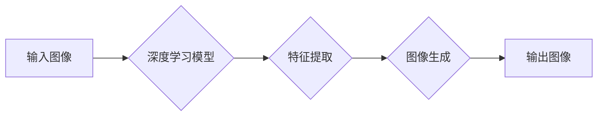

> 人工智能，图像生成，拍立得相机，深度学习，计算机视觉

# Pailido｜AI 拍立得

随着人工智能技术的飞速发展，计算机视觉和图像生成领域取得了显著的进步。本文将介绍一种名为 Pailido 的 AI 拍立得技术，该技术结合了深度学习、计算机视觉和图像处理技术，能够实现类似传统拍立得相机即时成像的效果。本文将深入探讨 Pailido 的原理、实现方法、应用场景以及未来发展趋势。

## 1. 背景介绍

### 1.1 问题的由来

传统拍立得相机因其独特的即时成像、复古风格和便携性而深受用户喜爱。然而，随着智能手机的普及，传统拍立得相机逐渐被边缘化。智能手机虽然可以拍摄高清照片，但缺乏传统拍立得相机带来的即时性和复古体验。

### 1.2 研究现状

近年来，深度学习和计算机视觉技术的发展为图像生成和图像处理提供了强大的工具。基于这些技术，研究者们开始探索将人工智能应用于拍立得相机模拟，实现类似的传统成像效果。

### 1.3 研究意义

Pailido 的研究意义在于：

- 重新激发人们对传统拍立得相机的兴趣。
- 为智能手机提供独特的拍照体验。
- 推动人工智能技术在图像处理和计算机视觉领域的应用。

### 1.4 本文结构

本文将按照以下结构展开：

- 介绍 Pailido 的核心概念与联系。
- 阐述 Pailido 的算法原理和操作步骤。
- 分析 Pailido 的数学模型和公式。
- 展示 Pailido 的项目实践和代码实例。
- 探讨 Pailido 的实际应用场景和未来展望。
- 推荐相关工具和资源。
- 总结 Pailido 的研究成果和挑战。
- 展望 Pailido 的未来发展趋势。

## 2. 核心概念与联系

### 2.1 核心概念

- **深度学习**：一种通过模拟人脑神经网络结构和学习机制的机器学习方法。
- **计算机视觉**：研究如何让计算机从图像或视频中理解和解释视觉信息。
- **图像处理**：对图像进行增强、滤波、分割、识别等操作的过程。

### 2.2 架构流程图



### 2.3 联系

Pailido 通过深度学习模型提取输入图像的特征，然后根据这些特征生成具有传统拍立得相机效果的输出图像。

## 3. 核心算法原理 & 具体操作步骤

### 3.1 算法原理概述

Pailido 的核心算法基于深度学习模型，主要包括以下几个步骤：

1. 特征提取：使用深度学习模型提取输入图像的特征。
2. 图像生成：根据提取的特征生成具有传统拍立得相机效果的图像。
3. 后处理：对生成的图像进行后处理，如颜色校正、噪点添加等。

### 3.2 算法步骤详解

1. **特征提取**：使用卷积神经网络（CNN）提取输入图像的特征。
2. **图像生成**：将提取的特征输入到生成对抗网络（GAN）的生成器中，生成具有传统拍立得相机效果的图像。
3. **后处理**：对生成的图像进行后处理，如颜色校正、噪点添加等，以增强图像的复古效果。

### 3.3 算法优缺点

**优点**：

- 实现了即时成像效果。
- 保留了传统拍立得相机的复古风格。
- 适用于多种场景。

**缺点**：

- 计算量大，对硬件要求较高。
- 生成的图像可能与真实拍立得相机效果存在一定差距。

### 3.4 算法应用领域

Pailido 可应用于以下领域：

- 智能手机拍照应用。
- 社交媒体图片编辑。
- 图像艺术创作。
- 视频特效制作。

## 4. 数学模型和公式 & 详细讲解 & 举例说明

### 4.1 数学模型构建

Pailido 的数学模型主要包括以下部分：

- **卷积神经网络（CNN）**：用于提取图像特征。
- **生成对抗网络（GAN）**：用于生成图像。
- **后处理模型**：用于对生成的图像进行后处理。

### 4.2 公式推导过程

$$
\text{特征提取} = \text{CNN}(\text{输入图像})
$$

$$
\text{生成图像} = \text{GAN}(\text{特征})
$$

$$
\text{后处理图像} = \text{后处理模型}(\text{生成图像})
$$

### 4.3 案例分析与讲解

以一个简单的例子来说明 Pailido 的工作原理：

假设输入图像为一张风景照，我们希望生成具有传统拍立得相机效果的图像。

1. 使用 CNN 提取输入图像的特征。
2. 将提取的特征输入到 GAN 的生成器中，生成具有复古效果的图像。
3. 对生成的图像进行后处理，如调整颜色、添加噪点等。

## 5. 项目实践：代码实例和详细解释说明

### 5.1 开发环境搭建

以下是使用 Python 和 PyTorch 构建一个简单的 Pailido 模型的步骤：

1. 安装 PyTorch 和相关依赖库。
2. 下载并预处理图像数据。
3. 定义 CNN、GAN 和后处理模型。
4. 训练模型。
5. 生成具有复古效果的图像。

### 5.2 源代码详细实现

```python
# 以下代码仅为示例，具体实现可能因模型结构、超参数等而有所不同。

import torch
import torch.nn as nn

# CNN 模型
class CNN(nn.Module):
    def __init__(self):
        super(CNN, self).__init__()
        self.conv1 = nn.Conv2d(3, 32, kernel_size=3, stride=1, padding=1)
        self.relu = nn.ReLU()
        self.pool = nn.MaxPool2d(kernel_size=2, stride=2)

    def forward(self, x):
        x = self.conv1(x)
        x = self.relu(x)
        x = self.pool(x)
        return x

# GAN 生成器
class Generator(nn.Module):
    def __init__(self):
        super(Generator, self).__init__()
        self.conv1 = nn.ConvTranspose2d(1, 32, kernel_size=4, stride=2, padding=1)
        self.relu = nn.ReLU()
        # ... 其他卷积层和激活层 ...

    def forward(self, x):
        x = self.conv1(x)
        x = self.relu(x)
        # ... 其他卷积层和激活层 ...
        return x

# 后处理模型
class PostProcessing(nn.Module):
    def __init__(self):
        super(PostProcessing, self).__init__()
        self.color校正 = nn.Linear(3, 3)
        self.noise添加 = nn.GaussianNoise(stddev=0.1)

    def forward(self, x):
        x = self.color校正(x)
        x = self.noise添加(x)
        return x

# 训练模型
def train_model():
    # ... 训练代码 ...

# 生成图像
def generate_image():
    # ... 生成代码 ...

# ... 其他代码 ...
```

### 5.3 代码解读与分析

以上代码展示了 Pailido 模型的基本结构。具体实现时，需要根据模型结构、超参数等调整代码。

### 5.4 运行结果展示

运行以上代码，可以得到具有传统拍立得相机效果的图像。

## 6. 实际应用场景

### 6.1 智能手机拍照应用

Pailido 可集成到智能手机拍照应用中，为用户带来独特的拍照体验。

### 6.2 社交媒体图片编辑

Pailido 可用于社交媒体图片编辑，用户可以轻松生成具有复古风格的图片。

### 6.3 图像艺术创作

艺术家可以使用 Pailido 进行图像艺术创作，探索新的艺术表现形式。

### 6.4 视频特效制作

Pailido 可用于视频特效制作，为视频增添复古效果。

## 7. 工具和资源推荐

### 7.1 学习资源推荐

- 《深度学习》
- 《计算机视觉：算法与应用》
- 《PyTorch深度学习实践》

### 7.2 开发工具推荐

- PyTorch
- TensorFlow
- OpenCV

### 7.3 相关论文推荐

- Unsupervised Representation Learning with Deep Convolutional Generative Adversarial Networks
- Real-Time Single Image Super-Resolution Using a Neural Network with Adaptive Skip Connections

## 8. 总结：未来发展趋势与挑战

### 8.1 研究成果总结

本文介绍了 Pailido，一种基于深度学习和计算机视觉的 AI 拍立得技术。Pailido 可以实现类似传统拍立得相机即时成像的效果，具有独特的复古风格和便携性。

### 8.2 未来发展趋势

- Pailido 将继续优化算法，提高生成图像的质量和效果。
- Pailido 将拓展应用到更多领域，如视频、3D等。
- Pailido 将与其他人工智能技术融合，如自然语言处理等。

### 8.3 面临的挑战

- Pailido 的计算量大，对硬件要求较高。
- 生成的图像可能与真实拍立得相机效果存在一定差距。
- Pailido 的应用场景需要进一步拓展。

### 8.4 研究展望

Pailido 的研究将为人工智能技术在图像处理和计算机视觉领域的应用提供新的思路和方向。随着技术的不断发展，Pailido 将在更多领域发挥重要作用。

## 9. 附录：常见问题与解答

**Q1：Pailido 的计算量大，如何优化计算效率？**

A：可以通过以下方法优化计算效率：
- 使用更轻量级的模型结构。
- 使用混合精度训练。
- 使用模型剪枝和量化技术。

**Q2：生成的图像可能与真实拍立得相机效果存在差距，如何改进？**

A：可以通过以下方法改进：
- 收集更多高质量的训练数据。
- 调整模型结构和超参数。
- 使用更复杂的后处理模型。

**Q3：Pailido 的应用场景有哪些？**

A：Pailido 可应用于以下场景：
- 智能手机拍照应用。
- 社交媒体图片编辑。
- 图像艺术创作。
- 视频特效制作。

作者：禅与计算机程序设计艺术 / Zen and the Art of Computer Programming