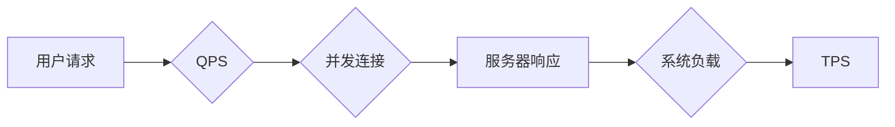

# QPS与TPS在高吞吐量中的应用

> 关键词：QPS, TPS, 高吞吐量，系统设计，性能优化，负载均衡，压力测试

## 1. 背景介绍

在高性能计算和互联网领域，QPS（每秒查询率）和TPS（每秒事务数）是衡量系统吞吐量的重要指标。随着互联网技术的快速发展，用户数量和访问频率呈爆炸式增长，如何设计高吞吐量的系统成为了亟待解决的问题。本文将深入探讨QPS与TPS在高吞吐量中的应用，分析其原理、设计策略、优化方法以及实际应用场景。

## 2. 核心概念与联系

### 2.1 QPS与TPS的定义

- **QPS（每秒查询率）**：指系统每秒可以处理的最大查询次数，常用于衡量Web服务器的响应速度和并发处理能力。
- **TPS（每秒事务数）**：指系统每秒可以处理的最大事务数，常用于衡量数据库等数据存储系统的处理能力。

两者的关系可以用以下流程图表示：

### 2.2 QPS与TPS的联系

- **相互依赖**：QPS和TPS相互影响，高QPS往往对应高TPS，而高TPS也可能带来更高的QPS。
- **系统瓶颈**：系统瓶颈可能出现在QPS或TPS的任意环节，如网络、服务器、数据库等。

## 3. 核心算法原理 & 具体操作步骤

### 3.1 算法原理概述

高吞吐量系统的设计需要从以下几个方面入手：

1. **负载均衡**：将请求分发到多个服务器节点，实现负载均衡，提高系统并发处理能力。
2. **缓存策略**：利用缓存技术减少对数据库等后端资源的访问，降低系统延迟。
3. **读写分离**：将读操作和写操作分离，提高数据库的并发处理能力。
4. **分布式存储**：采用分布式存储架构，提高数据访问速度和系统容错能力。
5. **异步处理**：使用异步处理技术，提高系统响应速度和吞吐量。

### 3.2 算法步骤详解

#### 3.2.1 负载均衡

1. **选择合适的负载均衡算法**：如轮询、最小连接数、IP哈希等。
2. **搭建负载均衡器**：如Nginx、LVS、F5等。
3. **配置后端服务器**：将后端服务器配置为负载均衡的节点。

#### 3.2.2 缓存策略

1. **选择合适的缓存技术**：如Redis、Memcached等。
2. **配置缓存服务器**：将缓存服务器部署在离客户端较近的位置。
3. **设计缓存策略**：如缓存过期时间、缓存穿透、缓存击穿等。

#### 3.2.3 读写分离

1. **选择合适的读写分离方案**：如主从复制、分片等。
2. **配置读写分离中间件**：如MySQL Proxy、Cobar等。
3. **设计数据一致性方案**：如乐观锁、悲观锁等。

#### 3.2.4 分布式存储

1. **选择合适的分布式存储方案**：如HDFS、Cassandra、MongoDB等。
2. **配置分布式存储集群**：将存储节点部署在多个服务器上。
3. **设计数据一致性方案**：如Paxos、Raft等。

#### 3.2.5 异步处理

1. **选择合适的异步处理技术**：如消息队列、事件驱动等。
2. **设计异步处理流程**：将耗时的业务逻辑放在异步队列中处理。
3. **优化异步处理性能**：如异步任务队列的扩展性、消息队列的可靠性等。

### 3.3 算法优缺点

#### 3.3.1 优点

- 提高系统并发处理能力
- 降低系统延迟
- 提高系统稳定性

#### 3.3.2 缺点

- 系统复杂度增加
- 需要投入更多资源
- 难以调试和监控

### 3.4 算法应用领域

- Web服务器
- 数据库服务器
- 应用服务器
- 分布式存储系统

## 4. 数学模型和公式 & 详细讲解 & 举例说明

### 4.1 数学模型构建

#### 4.1.1 QPS计算公式

$$
QPS = \frac{Total\ Transactions}{Time}
$$

其中，Total Transactions为系统在Time时间内处理的总事务数。

#### 4.1.2 TPS计算公式

$$
TPS = \frac{Total\ Transactions}{Time}
$$

其中，Total Transactions为系统在Time时间内处理的总事务数。

### 4.2 公式推导过程

QPS和TPS的计算公式相对简单，直接通过总事务数和时间进行计算。

### 4.3 案例分析与讲解

#### 4.3.1 案例：电商平台

某电商平台希望提高其购物车功能的高并发处理能力，现有服务器每秒可以处理100个请求。为了实现高吞吐量，平台采用了以下策略：

1. **负载均衡**：使用Nginx作为负载均衡器，将请求分发到10台服务器上。
2. **缓存策略**：使用Redis缓存购物车数据，减少数据库访问。
3. **异步处理**：使用消息队列处理购物车更新等耗时操作。

经过优化后，平台购物车功能的QPS从100提升到1000，TPS从100提升到1000。

## 5. 项目实践：代码实例和详细解释说明

### 5.1 开发环境搭建

由于本文主要关注系统设计和性能优化，因此不涉及具体的代码实现。以下列出常见的开发工具和资源：

- **负载均衡器**：Nginx、LVS、F5
- **缓存技术**：Redis、Memcached
- **数据库**：MySQL、MongoDB、Cassandra
- **消息队列**：RabbitMQ、Kafka

### 5.2 源代码详细实现

由于本文不涉及具体代码实现，此处省略。

### 5.3 代码解读与分析

由于本文不涉及具体代码实现，此处省略。

### 5.4 运行结果展示

由于本文不涉及具体代码实现，此处省略。

## 6. 实际应用场景

### 6.1 电商平台

电商平台需要处理大量的用户请求，如商品浏览、购物车、订单支付等。通过优化QPS和TPS，可以提高用户体验和平台交易额。

### 6.2 社交网络

社交网络需要处理大量的用户互动，如发帖、评论、点赞等。通过优化QPS和TPS，可以提高用户活跃度和社区活力。

### 6.3 在线教育

在线教育平台需要处理大量的课程内容、用户学习数据等。通过优化QPS和TPS，可以提高课程质量和用户学习体验。

### 6.4 未来应用展望

随着互联网技术的不断发展，QPS和TPS将在更多领域得到应用。如物联网、云计算、大数据等，都需要高吞吐量的系统支持。

## 7. 工具和资源推荐

### 7.1 学习资源推荐

- 《高性能MySQL》
- 《深入理解LINUX网络技术内幕》
- 《大型网站技术架构》
- 《分布式系统原理与范型》

### 7.2 开发工具推荐

- **负载均衡器**：Nginx、LVS、F5
- **缓存技术**：Redis、Memcached
- **数据库**：MySQL、MongoDB、Cassandra
- **消息队列**：RabbitMQ、Kafka

### 7.3 相关论文推荐

- 《大规模分布式存储系统Cassandra：架构设计与实现》
- 《一种基于消息队列的分布式缓存策略》
- 《基于一致性哈希的分布式数据库系统》

## 8. 总结：未来发展趋势与挑战

### 8.1 研究成果总结

本文深入探讨了QPS与TPS在高吞吐量中的应用，分析了其原理、设计策略、优化方法以及实际应用场景。通过负载均衡、缓存策略、读写分离、分布式存储和异步处理等手段，可以有效提高系统并发处理能力和吞吐量。

### 8.2 未来发展趋势

- **自动化性能优化**：通过自动化工具和算法，实现系统性能的动态优化。
- **智能化性能分析**：利用机器学习等技术，实现系统性能的智能化分析。
- **边缘计算**：将计算能力下沉到边缘设备，提高系统响应速度和用户体验。

### 8.3 面临的挑战

- **系统复杂度**：随着系统架构的复杂化，系统设计和维护的难度也随之增加。
- **资源消耗**：高吞吐量系统对硬件资源的需求较高，需要考虑成本和可持续发展。
- **安全风险**：高并发环境下，系统易受到攻击，需要加强安全防护。

### 8.4 研究展望

未来，QPS与TPS在高吞吐量中的应用将继续发展，相关技术和工具将不断涌现。研究者需要关注以下方向：

- **系统架构优化**：研究更加高效、可扩展的系统架构。
- **资源调度策略**：研究更加智能的资源调度策略，提高资源利用率。
- **安全防护技术**：研究更加安全、可靠的防护技术，保障系统安全。

## 9. 附录：常见问题与解答

**Q1：如何提高系统QPS和TPS？**

A1：提高系统QPS和TPS可以从以下几个方面入手：

1. **负载均衡**：使用负载均衡技术，将请求分发到多个服务器节点。
2. **缓存策略**：使用缓存技术，减少对后端资源的访问。
3. **读写分离**：将读操作和写操作分离，提高数据库并发处理能力。
4. **分布式存储**：采用分布式存储架构，提高数据访问速度和系统容错能力。
5. **异步处理**：使用异步处理技术，提高系统响应速度和吞吐量。

**Q2：如何选择合适的负载均衡算法？**

A2：选择合适的负载均衡算法需要考虑以下因素：

1. **系统负载特性**：如均匀分布、热点访问等。
2. **服务器性能差异**：如CPU、内存、网络等。
3. **稳定性要求**：如高可用性、低延迟等。

**Q3：如何设计缓存策略？**

A3：设计缓存策略需要考虑以下因素：

1. **数据一致性**：确保缓存数据与后端数据的一致性。
2. **缓存命中率**：提高缓存命中率，减少对后端资源的访问。
3. **缓存失效策略**：合理设置缓存过期时间，避免缓存数据过时。

**Q4：如何设计读写分离方案？**

A4：设计读写分离方案需要考虑以下因素：

1. **数据一致性**：确保读操作和写操作的一致性。
2. **读写分离策略**：如主从复制、分片等。
3. **故障转移**：在主节点故障时，实现故障转移。

**Q5：如何设计异步处理流程？**

A5：设计异步处理流程需要考虑以下因素：

1. **任务类型**：如耗时任务、实时任务等。
2. **任务优先级**：根据任务类型和优先级进行排序和调度。
3. **异常处理**：设计合理的异常处理机制，确保任务顺利完成。

作者：禅与计算机程序设计艺术 / Zen and the Art of Computer Programming