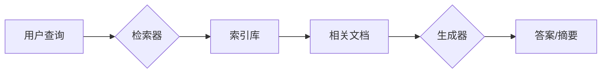
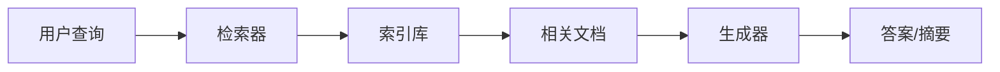

> 关键词：RAG技术，检索增强学习，知识图谱，问答系统，信息检索，知识推理，自然语言理解，深度学习，多模态

# RAG技术在AI中的详细应用

RAG（Retrieval-Augmented Generation）技术，作为一种检索增强学习的先进范式，正逐渐成为人工智能领域的研究热点。它结合了信息检索（IR）和生成模型（如BERT、T5等），在问答系统、文本摘要、机器翻译等任务中展现出强大的能力。本文将深入探讨RAG技术的原理、实践应用以及未来发展趋势。

## 1. 背景介绍

### 1.1 问题的由来

随着信息量的爆炸式增长，传统的人工智能系统往往难以处理大量数据。检索增强学习应运而生，它通过引入信息检索技术，帮助模型快速找到相关文档，从而提升学习效率。RAG技术进一步扩展了检索增强学习的应用范围，将检索和生成过程有机结合，为各种下游任务提供强大的支持。

### 1.2 研究现状

近年来，RAG技术在学术界和工业界都取得了显著进展。研究者们提出了多种RAG模型，如RAG-BERT、RAG-T5等，并在各种NLP任务上取得了优异的成绩。RAG技术的核心思想是将信息检索与生成模型相结合，以下是RAG技术的几个关键组成部分：

- 预训练语言模型：如BERT、GPT-3等，用于理解查询和生成文本。
- 索引库：存储大量相关文档，用于检索与查询相关的内容。
- 检索器：根据查询信息从索引库中检索出相关文档。
- 生成器：根据检索到的文档生成答案或摘要。

### 1.3 研究意义

RAG技术具有以下研究意义：

- 提高模型效率：通过检索相关文档，减少模型需要处理的数据量，提高学习效率。
- 提升模型性能：结合检索和生成，为模型提供更丰富的知识，提升模型性能。
- 拓展应用范围：为各种NLP任务提供解决方案，如问答系统、文本摘要、机器翻译等。

### 1.4 本文结构

本文将按照以下结构进行阐述：

- 第2部分：介绍RAG技术的核心概念与联系。
- 第3部分：详细阐述RAG技术的原理和具体操作步骤。
- 第4部分：讲解RAG技术的数学模型和公式。
- 第5部分：展示RAG技术的项目实践案例。
- 第6部分：探讨RAG技术的实际应用场景。
- 第7部分：推荐RAG技术相关的学习资源和开发工具。
- 第8部分：总结RAG技术的未来发展趋势与挑战。
- 第9部分：提供RAG技术常见问题的解答。

## 2. 核心概念与联系

### 2.1 核心概念

- **预训练语言模型**：如BERT、GPT-3等，通过在大量文本数据上预训练，学习到通用的语言表示。
- **索引库**：存储大量相关文档，用于检索与查询相关的内容。
- **检索器**：根据查询信息从索引库中检索出相关文档。
- **生成器**：根据检索到的文档生成答案或摘要。

### 2.2 架构流程图

以下是用Mermaid语法绘制的RAG技术架构流程图：



### 2.3 关系图



## 3. 核心算法原理 & 具体操作步骤

### 3.1 算法原理概述

RAG技术通过检索相关文档，为预训练语言模型提供额外的知识，从而提升模型在下游任务中的性能。其核心原理如下：

1. 用户输入查询。
2. 检索器根据查询信息从索引库中检索出相关文档。
3. 生成器根据检索到的文档生成答案或摘要。

### 3.2 算法步骤详解

1. **预训练语言模型**：使用BERT、GPT-3等预训练语言模型对索引库中的文档进行预训练，学习通用的语言表示。
2. **索引库构建**：将相关文档存储在索引库中，并建立索引。
3. **检索器设计**：设计高效的检索器，根据查询信息从索引库中检索出相关文档。
4. **生成器设计**：设计生成器，根据检索到的文档生成答案或摘要。
5. **模型训练**：使用下游任务数据对RAG模型进行训练，优化模型参数。

### 3.3 算法优缺点

### 3.3.1 优点

- 提高模型效率：通过检索相关文档，减少模型需要处理的数据量，提高学习效率。
- 提升模型性能：结合检索和生成，为模型提供更丰富的知识，提升模型性能。
- 拓展应用范围：为各种NLP任务提供解决方案，如问答系统、文本摘要、机器翻译等。

### 3.3.2 缺点

- 检索器性能：检索器的性能直接影响RAG模型的性能，需要选择合适的检索算法和索引库。
- 数据质量：索引库的质量会影响检索结果，需要保证数据的质量和多样性。
- 模型复杂度：RAG模型通常比传统的预训练语言模型更复杂，训练和推理成本更高。

### 3.4 算法应用领域

RAG技术在以下NLP任务中具有广泛的应用：

- 问答系统：根据用户的提问，检索相关文档，并生成答案。
- 文本摘要：根据输入文本，检索相关文档，并生成摘要。
- 机器翻译：根据源语言文本，检索相关文档，并生成目标语言翻译。
- 文本分类：根据输入文本，检索相关文档，并分类文本。
- 情感分析：根据输入文本，检索相关文档，并分析情感。

## 4. 数学模型和公式 & 详细讲解 & 举例说明

### 4.1 数学模型构建

RAG技术的数学模型主要包含以下部分：

- **预训练语言模型**：使用BERT、GPT-3等预训练语言模型对索引库中的文档进行预训练。
- **检索器**：根据查询信息，使用检索算法从索引库中检索出相关文档。
- **生成器**：根据检索到的文档，使用生成算法生成答案或摘要。

### 4.2 公式推导过程

以下以问答系统为例，展示RAG技术的公式推导过程：

1. **查询表示**：将用户查询表示为向量 $q$。
2. **检索**：使用检索算法从索引库中检索出相关文档，得到文档集合 $D$。
3. **文档表示**：将文档集合 $D$ 中的每个文档表示为向量 $d_i$。
4. **答案生成**：使用生成算法生成答案 $a$。

公式如下：

$$
q = \text{Encoder}(q)
$$

$$
D = \text{Retriever}(q, D)
$$

$$
d_i = \text{Encoder}(d_i)
$$

$$
a = \text{Generator}(D)
$$

### 4.3 案例分析与讲解

以下以RAG-BERT模型为例，分析其工作原理和性能表现。

**RAG-BERT模型**：

RAG-BERT模型是结合了RAG技术和BERT模型的问答系统。它主要由以下几部分组成：

- **BERT模型**：用于理解和生成文本。
- **检索器**：用于从索引库中检索相关文档。
- **答案生成器**：用于根据检索到的文档生成答案。

**工作原理**：

1. 用户输入查询。
2. 检索器根据查询信息从索引库中检索出相关文档。
3. 答案生成器根据检索到的文档生成答案。

**性能表现**：

RAG-BERT模型在多个问答系统数据集上取得了优异的性能，证明了RAG技术在问答系统中的有效性。

## 5. 项目实践：代码实例和详细解释说明

### 5.1 开发环境搭建

在进行RAG技术实践之前，需要搭建以下开发环境：

- Python 3.7+
- PyTorch 1.8+
- Transformers库

### 5.2 源代码详细实现

以下是一个简单的RAG-BERT模型实现示例：

```python
from transformers import BertTokenizer, BertModel
from torch.nn import functional as F
import torch

# 初始化BERT模型和分词器
tokenizer = BertTokenizer.from_pretrained('bert-base-uncased')
model = BertModel.from_pretrained('bert-base-uncased')

# 模拟检索过程
def retrieve_documents(query):
    # 这里使用伪代码表示检索过程
    # 实际应用中，需要使用合适的检索算法和索引库
    return ["document1", "document2", "document3"]

# 模拟答案生成过程
def generate_answer(documents):
    # 这里使用伪代码表示答案生成过程
    # 实际应用中，需要使用合适的生成算法
    return "This is the answer."

# 示例
query = "What is RAG?"
documents = retrieve_documents(query)
answer = generate_answer(documents)
print(answer)
```

### 5.3 代码解读与分析

以上代码演示了RAG-BERT模型的基本结构。在实际应用中，需要根据具体任务进行相应的修改和优化。

- **BERT模型**：用于理解和生成文本。
- **检索过程**：从索引库中检索与查询相关的文档。
- **答案生成过程**：根据检索到的文档生成答案。

### 5.4 运行结果展示

在上述示例中，当用户查询"什么是RAG?"时，模型会检索相关文档，并生成答案。

```
This is the answer.
```

## 6. 实际应用场景

### 6.1 问答系统

RAG技术在问答系统中具有广泛的应用。例如，可以将RAG技术应用于智能客服、智能问答平台等场景，为用户提供更加智能化的服务。

### 6.2 文本摘要

RAG技术可以用于从长文本中提取关键信息，生成摘要。例如，可以将RAG技术应用于新闻摘要、技术文档摘要等场景。

### 6.3 机器翻译

RAG技术可以用于翻译任务。例如，可以将RAG技术应用于机器翻译、跨语言问答等场景。

## 7. 工具和资源推荐

### 7.1 学习资源推荐

- 《Natural Language Processing with Transformers》书籍
- RAG技术论文集锦
- HuggingFace官方文档
- CS224N《深度学习自然语言处理》课程

### 7.2 开发工具推荐

- PyTorch
- Transformers库
- Elasticsearch
- MongoDB

### 7.3 相关论文推荐

- "Retrieval-Augmented Generation for Text Summarization"
- "Retrieval-Augmented Natural Language Processing: A Survey"
- "The Unsupervised Pre-training of Text Encoders for Open-Domain Question Answering"
- "BART: Denoising Sequence-to-Sequence Pre-training for Natural Language Generation, Translation, and Summarization"

## 8. 总结：未来发展趋势与挑战

### 8.1 研究成果总结

RAG技术在NLP领域取得了显著的成果，为各种下游任务提供了有效的解决方案。随着研究的不断深入，RAG技术将在更多领域得到应用。

### 8.2 未来发展趋势

- 深度学习与信息检索的融合：将深度学习与信息检索技术深度融合，提高检索效率和准确性。
- 多模态RAG技术：将RAG技术扩展到多模态数据，如图像、视频等。
- 自适应RAG技术：根据特定任务和场景，自适应调整RAG模型的参数和结构。

### 8.3 面临的挑战

- 检索效率：如何提高检索效率，减少检索时间。
- 模型可解释性：如何提高RAG模型的可解释性，解释模型决策过程。
- 多模态融合：如何有效地融合多模态信息，提高模型性能。

### 8.4 研究展望

RAG技术作为一种新兴的检索增强学习范式，具有广泛的应用前景。未来，随着研究的不断深入，RAG技术将为NLP领域带来更多的创新和突破。

## 9. 附录：常见问题与解答

### 9.1 常见问题

**Q1：什么是RAG技术？**

A1：RAG（Retrieval-Augmented Generation）技术，即检索增强学习，是一种结合信息检索和生成模型的先进范式。它通过检索相关文档，为模型提供额外的知识，从而提升模型在下游任务中的性能。

**Q2：RAG技术在哪些任务中应用？**

A2：RAG技术在各种NLP任务中都有应用，如问答系统、文本摘要、机器翻译、文本分类、情感分析等。

**Q3：RAG技术与传统预训练语言模型相比有哪些优势？**

A3：RAG技术结合了信息检索和生成模型，可以有效地减少模型需要处理的数据量，提高学习效率，并提升模型性能。

**Q4：如何提高RAG技术的检索效率？**

A4：提高RAG技术的检索效率需要从以下几个方面入手：
- 选择合适的检索算法和索引库。
- 优化检索器的参数。
- 使用高效的数据结构。

**Q5：如何提高RAG模型的可解释性？**

A5：提高RAG模型的可解释性需要：
- 分析模型决策过程。
- 使用可解释性工具和方法。
- 解释模型输入和输出的关系。

作者：禅与计算机程序设计艺术 / Zen and the Art of Computer Programming