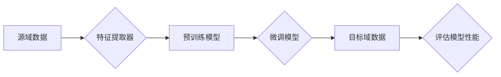

# Transfer Learning 原理与代码实战案例讲解

> 关键词：迁移学习，深度学习，预训练，模型泛化，跨域学习，特征提取，模型优化

## 1. 背景介绍

随着深度学习技术的快速发展，深度神经网络在图像识别、自然语言处理等领域取得了显著的成果。然而，深度学习模型往往需要大量的标注数据进行训练，这在数据稀缺的场景下成为了一个巨大的挑战。为了解决这一问题，迁移学习应运而生。迁移学习通过将源域学习到的知识迁移到目标域，从而在目标域上实现更好的性能。本文将深入探讨迁移学习的原理、算法和代码实战案例。

## 2. 核心概念与联系

### 2.1 核心概念原理

迁移学习（Transfer Learning）是指将一个学习任务（源域）中学习到的知识迁移到另一个相关学习任务（目标域）中，以便在目标域上获得更好的性能。其核心思想是利用源域的数据和模型知识，来提高目标域模型的泛化能力。

**核心概念**：

- **源域（Source Domain）**：含有大量标注数据的领域，用于预训练模型。
- **目标域（Target Domain）**：数据较少或没有标注数据的领域，希望利用源域知识进行学习。
- **特征提取器（Feature Extractor）**：从数据中提取特征并用于模型学习的组件。

迁移学习的基本流程如下：

1. 在源域上预训练一个通用的特征提取器。
2. 将预训练的特征提取器用于目标域，并对其进行微调。
3. 在目标域上评估模型的性能。

### 2.2 核心概念原理和架构的 Mermaid 流程图



## 3. 核心算法原理 & 具体操作步骤

### 3.1 算法原理概述

迁移学习的主要算法包括：

- **直接迁移学习**：将源域的模型直接用于目标域，不需要进行任何修改。
- **特征重用**：将源域的模型中的特征提取器用于目标域，并在其上构建新的分类器。
- **参数共享**：在源域和目标域之间共享部分模型参数，同时调整部分参数以适应目标域。

### 3.2 算法步骤详解

1. **数据准备**：收集源域和目标域的数据。
2. **特征提取**：使用预训练模型对源域数据进行特征提取。
3. **模型构建**：在提取的特征上构建新的分类器。
4. **模型训练**：在目标域上训练新的分类器。
5. **模型评估**：在目标域上评估模型的性能。

### 3.3 算法优缺点

**优点**：

- **降低训练成本**：在目标域上不需要大量的标注数据。
- **提高模型泛化能力**：利用源域的知识，提高模型在目标域上的性能。
- **提高模型效率**：复用预训练模型，提高模型训练和推理的速度。

**缺点**：

- **模型偏差**：源域和目标域之间的分布差异可能导致模型偏差。
- **过拟合**：在目标域上训练模型时，可能出现过拟合现象。
- **性能受限**：迁移学习的效果取决于源域和目标域之间的相似度。

### 3.4 算法应用领域

迁移学习在以下领域有广泛的应用：

- **计算机视觉**：图像分类、目标检测、图像分割等。
- **自然语言处理**：文本分类、情感分析、机器翻译等。
- **语音识别**：语音分类、说话人识别、语音合成等。

## 4. 数学模型和公式 & 详细讲解 & 举例说明

### 4.1 数学模型构建

假设源域和目标域的数据分布分别为 $P_{\text{src}}$ 和 $P_{\text{tgt}}$，模型参数为 $\theta$。则迁移学习的目标是最小化目标域上的损失函数 $L(\theta, P_{\text{tgt}})$。

### 4.2 公式推导过程

目标域上的损失函数可以表示为：

$$
L(\theta, P_{\text{tgt}}) = \int_{P_{\text{tgt}}} L_{\text{tgt}}(\theta) p(x, y) dx dy
$$

其中 $L_{\text{tgt}}(\theta)$ 是目标域上的损失函数，$p(x, y)$ 是目标域上的数据分布。

### 4.3 案例分析与讲解

以下是一个简单的迁移学习案例：使用预训练的卷积神经网络（CNN）进行图像分类。

- 源域：CIFAR-10数据集。
- 目标域：Fashion-MNIST数据集。

1. 使用CIFAR-10数据集预训练CNN模型。
2. 将预训练的CNN模型用于Fashion-MNIST数据集，并添加新的全连接层进行分类。
3. 在Fashion-MNIST数据集上训练新的分类器。

## 5. 项目实践：代码实例和详细解释说明

### 5.1 开发环境搭建

1. 安装TensorFlow和Keras。
2. 下载CIFAR-10和Fashion-MNIST数据集。

### 5.2 源代码详细实现

```python
import tensorflow as tf
from tensorflow.keras.applications import VGG16
from tensorflow.keras.layers import Dense, Flatten
from tensorflow.keras.models import Model
from tensorflow.keras.datasets import cifar10, fashion_mnist

# 加载CIFAR-10数据集
(x_train, _), (x_test, _) = cifar10.load_data()

# 加载Fashion-MNIST数据集
(x_train_f, _), (x_test_f, _) = fashion_mnist.load_data()

# 数据预处理
x_train = x_train / 255.0
x_test = x_test / 255.0
x_train_f = x_train_f / 255.0
x_test_f = x_test_f / 255.0

# 加载VGG16模型
vgg16 = VGG16(weights='imagenet', include_top=False, input_shape=(32, 32, 3))

# 构建迁移学习模型
inputs = vgg16.input
outputs = vgg16.get_layer('fc2').output
outputs = Flatten()(outputs)
outputs = Dense(10, activation='softmax')(outputs)

model = Model(inputs=inputs, outputs=outputs)

# 编译模型
model.compile(optimizer='adam', loss='categorical_crossentropy')

# 训练模型
model.fit(x_train_f, y_train_f, batch_size=32, epochs=10)

# 评估模型
model.evaluate(x_test_f, y_test_f)
```

### 5.3 代码解读与分析

- 加载CIFAR-10和Fashion-MNIST数据集，并进行数据预处理。
- 加载VGG16模型，该模型在ImageNet上预训练。
- 在VGG16的fc2层后添加全连接层，用于Fashion-MNIST数据集的分类。
- 编译模型，并使用Fashion-MNIST数据集进行训练和评估。

## 6. 实际应用场景

迁移学习在以下场景中有广泛的应用：

- **医学影像分析**：使用在医学影像数据集上预训练的模型进行疾病诊断。
- **无人驾驶**：使用在无人驾驶数据集上预训练的模型进行场景识别、障碍物检测等任务。
- **智能语音识别**：使用在语音数据集上预训练的模型进行语音识别和说话人识别。

## 7. 工具和资源推荐

### 7.1 学习资源推荐

- **书籍**：
  - 《Deep Learning》（Goodfellow et al.）
  - 《Pattern Recognition and Machine Learning》（Bishop）
- **在线课程**：
  - Coursera上的《深度学习专项课程》
  - fast.ai的《Practical Deep Learning for Coders》
- **开源项目**：
  - TensorFlow
  - PyTorch
  - Keras

### 7.2 开发工具推荐

- **深度学习框架**：
  - TensorFlow
  - PyTorch
  - Keras
- **数据集**：
  - TensorFlow Datasets
  - KEG Lab公开数据集

### 7.3 相关论文推荐

- **迁移学习**：
  - “Transfer Learning with Deep Architectures”（Pan et al., 2010）
  - “A Survey of Transfer Learning”（Pan & Yang, 2010）
- **多任务学习**：
  - “Multi-Task Learning”（Caruana, 1997）
- **元学习**：
  - “Meta-Learning”（Thrun & Pratt, 1998）

## 8. 总结：未来发展趋势与挑战

### 8.1 研究成果总结

迁移学习作为一种重要的机器学习技术，在多个领域取得了显著的成果。通过复用预训练模型的知识，迁移学习大大降低了训练成本，提高了模型的泛化能力。

### 8.2 未来发展趋势

- **多模态迁移学习**：将图像、文本、语音等多模态信息融合到迁移学习中。
- **自监督迁移学习**：无需标注数据，利用无监督学习技术进行迁移学习。
- **元学习**：研究能够快速适应新任务的迁移学习模型。

### 8.3 面临的挑战

- **源域和目标域之间的分布差异**：如何处理源域和目标域之间的分布差异是一个重要挑战。
- **模型解释性**：迁移学习模型的解释性较差，如何提高模型的解释性是一个需要解决的问题。
- **计算效率**：迁移学习模型的计算效率需要进一步提高。

### 8.4 研究展望

迁移学习在未来将会有更广泛的应用，并取得更多的突破。随着研究的深入，迁移学习将在机器学习领域发挥越来越重要的作用。

## 9. 附录：常见问题与解答

**Q1：迁移学习适用于所有机器学习任务吗**？

A：迁移学习适用于许多机器学习任务，特别是数据量较小的任务。但对于一些需要特定领域知识的任务，可能需要使用领域特定的模型。

**Q2：如何选择合适的预训练模型**？

A：选择预训练模型时需要考虑以下因素：
- 源域和目标域的相似度
- 预训练模型的性能
- 模型的大小和计算效率

**Q3：如何解决源域和目标域之间的分布差异**？

A：可以采用以下方法解决源域和目标域之间的分布差异：
- 数据重采样
- 特征对齐
- 自适应学习方法

**Q4：迁移学习模型的解释性如何提高**？

A：可以采用以下方法提高迁移学习模型的解释性：
- 可解释的机器学习技术
- 模型可视化
- 解释性模型

作者：禅与计算机程序设计艺术 / Zen and the Art of Computer Programming