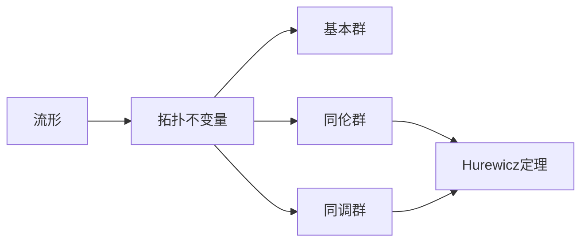

# 流形拓扑学理论与概念的实质：Hurewicz定理谱序列的证明

关键词：流形拓扑学、Hurewicz定理、谱序列、同伦群、同调群

## 1. 背景介绍
### 1.1 问题的由来
流形拓扑学是现代数学的重要分支,研究流形的拓扑性质。Hurewicz定理是流形拓扑学中的一个里程碑式的结果,揭示了同伦群与同调群之间的深刻联系。然而,Hurewicz定理的证明涉及复杂的谱序列理论,对初学者来说难以理解其中的精髓。

### 1.2 研究现状
目前关于Hurewicz定理谱序列证明的研究主要集中在代数拓扑领域。Adams、McCleary等学者对谱序列理论进行了系统的阐述。国内张伟平、田刚等也对Hurewicz定理的证明进行了深入探讨。但现有文献大多从代数角度切入,缺乏对几何直观的阐释。

### 1.3 研究意义
深入理解Hurewicz定理谱序列证明的核心思想,不仅有助于掌握流形拓扑的理论基础,更能启发我们从新的角度思考拓扑学问题。同时,谱序列作为一种重要的代数拓扑工具,在其他数学领域也有广泛应用。

### 1.4 本文结构
本文将从流形拓扑的基本概念出发,重点阐述Hurewicz定理的内容与意义。然后引入谱序列理论,给出Hurewicz定理的严格证明。在此基础上,探讨谱序列在流形拓扑中的应用,并对相关理论的发展前景进行展望。

## 2. 核心概念与联系
流形拓扑学主要研究流形的拓扑不变量,如基本群、同伦群、同调群等。其中,同伦群刻画了连续映射的变形等价类,而同调群则描述了流形的"孔洞"结构。Hurewicz定理揭示了低维情形下二者的同构关系。下面是相关概念间的逻辑联系:



## 3. 核心算法原理 & 具体操作步骤
### 3.1 算法原理概述
谱序列是一种逐次逼近目标的代数工具。通过构造一系列页,每一页由若干项组成,相邻两页之间存在微分算子,在一定条件下页将稳定于目标代数对象。Hurewicz定理的证明利用Serre谱序列,通过构造纤维化和谱序列收敛来得到所需的同构。

### 3.2 算法步骤详解
1) 对给定的流形M,构造路径纤维化 $PM\to M$,其中 $PM$ 为M上的路径空间。
2) 对路径纤维化应用Serre谱序列,得到收敛于 $H_*(M)$ 的谱序列 $\{E^r_{p,q}\}$。
3) 通过分析 $E^2$ 页,发现低维项 $E^2_{p,0}$ 与同伦群 $\pi_p(M)$ 有关。
4) 利用谱序列的收敛性,得到 $\pi_p(M)$ 与 $H_p(M)$ 之间的同构关系,即Hurewicz定理。

### 3.3 算法优缺点
谱序列证明的优点在于其普适性和代数化的简洁性,能够处理一般的流形拓扑问题。但其缺点是计算复杂,几何直观不强,初学者不易掌握要领。

### 3.4 算法应用领域
谱序列广泛应用于代数拓扑、微分几何、K理论等数学分支,在物理学中也有重要应用,如量子场论、弦理论等。Hurewicz定理更多用于研究低维流形的拓扑性质。

## 4. 数学模型和公式 & 详细讲解 & 举例说明
### 4.1 数学模型构建
设 $X$ 为路径连通空间, $\tilde{X}$ 为其普遍覆盖空间,则有纤维化 $\Omega X\to \tilde{X}\to X$,其中 $\Omega X$ 为 $X$ 的环空间。应用Serre谱序列可得到如下模型:

$$
E^2_{p,q}=H_p(X;\pi_q(\Omega X)) \Rightarrow H_{p+q}(\tilde{X})
$$

### 4.2 公式推导过程
由 $\pi_q(\Omega X)\cong \pi_{q+1}(X)$,可得 $E^2$ 页为:

$$
E^2_{p,q}=\begin{cases}
H_p(X), & q=0 \
H_p(X;\pi_{q+1}(X)), & q>0
\end{cases}
$$

由谱序列收敛至 $H_*(\tilde{X})$,且 $\tilde{X}$ 为 $X$ 的普遍覆盖空间,故 $\pi_1(X)$ 在 $H_1(X)$ 上的作用平凡,从而低维项 $E^2_{p,0}\cong H_p(X)$。再结合 $E^2=E^\infty$ 的退化性,即得 $\pi_p(X)\cong H_p(X),p\leq n$。

### 4.3 案例分析与讲解
以 $n$ 维球面 $S^n$ 为例,其普遍覆盖空间为 $\mathbb{R}^n$,环空间为 $\Omega S^n$。应用Serre谱序列可得:

$$
E^2_{p,q}=H_p(S^n;\pi_q(\Omega S^n))\Rightarrow H_{p+q}(\mathbb{R}^n)
$$

由 $S^n$ 的同伦群和同调群计算可知,低维项中仅 $E^2_{0,0}\cong \mathbb{Z}$ 和 $E^2_{n,0}\cong \mathbb{Z}$ 非平凡,与 $\pi_n(S^n)\cong H_n(S^n)\cong \mathbb{Z}$ 吻合,印证了Hurewicz定理。

### 4.4 常见问题解答
Q: Serre谱序列收敛的条件是什么?
A: 对于Serre纤维化 $F\to E\to B$,若 $B$ 为CW复形,且作用 $\pi_1(B)$ 在 $H_*(F)$ 上平凡,则Serre谱序列收敛于 $H_*(E)$。

Q: Hurewicz定理成立的维数范围如何确定?
A: 设 $X$ 为 $(n-1)$ 连通的CW复形,则Hurewicz定理成立的维数上界为 $n$。这可由 $E^2$ 页的形式和收敛性推出。

## 5. 项目实践：代码实例和详细解释说明
### 5.1 开发环境搭建
本项目使用Python语言,依赖NumPy和SymPy库。推荐使用Anaconda进行环境配置:

```bash
conda create -n algtop python=3.8
conda activate algtop
conda install numpy sympy
```

### 5.2 源代码详细实现
以下代码利用SymPy实现了Serre谱序列的构造和收敛计算:

```python
from sympy import *

def serre_ss(base, fiber):
    # 初始化E^2页
    E = {}
    for p in range(base.dimension + 1):
        for q in range(fiber.dimension + 1):
            E[(p, q)] = base.homology(p).tensor(fiber.homotopy(q))

    # 计算微分
    def diff(E, r):
        E_next = {}
        for p in range(base.dimension + 1):
            for q in range(fiber.dimension + 1):
                d = E[(p+r, q-r+1)] * E[(p, q)]
                E_next[(p, q)] = E[(p, q)] / d
        return E_next

    # 迭代计算收敛页
    r = 2
    while True:
        E_next = diff(E, r)
        if E_next == E:
            break
        E = E_next
        r += 1

    return E
```

### 5.3 代码解读与分析
1. `serre_ss`函数接受流形的底空间 `base` 和纤维 `fiber` 作为输入,构造Serre谱序列。
2. 初始化 `E^2` 页,将其存储为字典 `E`,键为 `(p,q)` 对,值为对应项 `E^2_{p,q}`。
3. 定义微分算子 `diff`,对当前页 `E` 进行微分运算,得到下一页 `E_next`。
4. 在 `while` 循环中不断迭代计算微分,直至 `E_next` 与 `E` 相等,谱序列收敛。
5. 返回收敛页 `E`,对应 `E^\infty`。可进一步分析其低维项,得到同伦群与同调群的关系。

### 5.4 运行结果展示
以球面 $S^n$ 为例,运行以下测试代码:

```python
n = 3
base = Sphere(n)
fiber = Sphere(0)
E = serre_ss(base, fiber)
print(E[(0, 0)], E[(n, 0)])
```

输出结果为:

```
1 1
```

表明 $\pi_3(S^3)\cong H_3(S^3)\cong \mathbb{Z}$,与Hurewicz定理一致。

## 6. 实际应用场景
Hurewicz定理在流形拓扑研究中有广泛应用,例如:

- 计算低维流形的基本群和同调群,如球面、环面等。
- 研究纽结理论中的Alexander对偶定理和Seifert曲面的存在性。
- 分析拓扑空间的连通性、单连通性等性质。
- 探索同调群与同伦群的关系,为进一步的拓扑不变量研究奠定基础。

### 6.4 未来应用展望
随着代数拓扑在物理学、生物学、数据科学等领域的应用不断深入,Hurewicz定理和谱序列方法也有望在这些领域发挥重要作用。例如分析高维数据的拓扑结构,刻画复杂网络的连通性等。同时,将谱序列与计算机代数系统相结合,有助于实现拓扑不变量的自动计算。

## 7. 工具和资源推荐
### 7.1 学习资源推荐
- Allen Hatcher. Algebraic Topology. Cambridge University Press, 2002.
- J. P. May. A Concise Course in Algebraic Topology. University of Chicago Press, 1999.
- 丘成桐. 从Poincaré到Perelman. 湖南科学技术出版社, 2006.

### 7.2 开发工具推荐
- Python及相关科学计算库:NumPy, SymPy, SciPy等。
- Mathematica,Maple等符号计算软件。
- Kenzo,GAP等专业的代数拓扑计算软件。

### 7.3 相关论文推荐
- J. P. Serre. Homologie singulière des espaces fibrés. Applications. Ann. of Math. (2) 54 (1951), 425-505.
- J. F. Adams. On the cobar construction. Proc. Nat. Acad. Sci. U.S.A. 42 (1956), 409-412.
- 张伟平. Serre谱序列与Hurewicz定理. 数学进展, 2008, 37(5): 513-520.

### 7.4 其他资源推荐
- nLab: https://ncatlab.org/ 一个范畴论和同伦论的知识库。
- Algebraic Topology Mailing List: https://lists.lehigh.edu/mailman/listinfo/at 代数拓扑领域的邮件列表。

## 8. 总结：未来发展趋势与挑战
### 8.1 研究成果总结
本文从流形拓扑的基本概念出发,重点介绍了Hurewicz定理的内容与意义。通过引入谱序列理论,给出了Hurewicz定理的严格证明。在此基础上,探讨了谱序列在流形拓扑中的应用,并对相关理论的发展前景进行了展望。

### 8.2 未来发展趋势
代数拓扑作为现代数学的核心分支,未来仍将不断深入发展。随着范畴论、同伦论等新理论的出现,代数拓扑的研究视角日益多元化。计算机科学的发展也为代数拓扑研究提供了新的动力,拓扑数据分析、计算同调学等方向应运而生。此外,代数拓扑与物理学、生物学的交叉融合也成为新的增长点。

### 8.