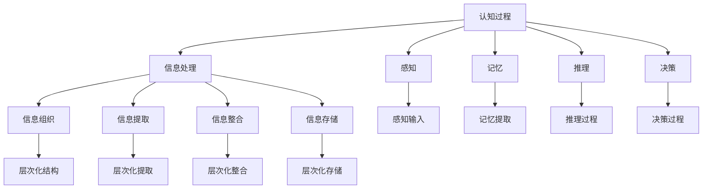

                 

# 认知的形式化：递归层次性

在探索人工智能的边界时，认知科学和计算机科学的交织成为了研究的热点。本文聚焦于认知的形式化描述，特别是递归层次性这一核心概念，在理解人类认知和设计高级人工智能系统中的应用。

## 1. 背景介绍

### 1.1 认知的形式化简介

认知形式化是指将人类认知过程用形式化语言（如逻辑、数学等）表达和分析。它旨在捕捉和模拟人类认知的基本特征，如推理、记忆、理解等。认知形式化不仅有助于理解人类认知的内部机制，也为人工智能的发展提供了理论基础。

### 1.2 递归层次性在认知中的角色

递归层次性是认知形式化的重要组成部分，指的是认知过程中不同层次的信息和知识之间存在着嵌套和递归关系。这种递归层次性不仅体现在信息的组织和处理上，还体现在认知活动的执行和控制上。递归层次性有助于解释人类认知的复杂性和灵活性，同时也为人工智能的设计提供了重要的启示。

## 2. 核心概念与联系

### 2.1 核心概念概述

在讨论递归层次性之前，我们需要理解几个相关的核心概念：

- **递归**：在计算机科学中，递归是一种解决问题的方法，通过将问题分解为更小规模的子问题来求解。在认知科学中，递归则用于描述信息结构的层次性和复杂性。
- **层次性**：指信息或知识在组织和处理过程中，不同层次之间存在明显的上下级关系。这种层次性有助于系统性地理解和处理复杂的信息。
- **认知过程**：包括感知、记忆、推理、决策等多种认知活动，是递归层次性的主要应用场景。

### 2.2 递归层次性的联系

递归层次性与其他核心概念之间的关系可以通过以下示意图展示：



这个示意图展示了认知过程的信息处理流程，以及信息组织、提取、整合和存储的层次性。其中，感知、记忆、推理和决策是认知过程的四个主要阶段，信息处理则是每个阶段的重要组成部分。信息处理过程中，不同层次的信息通过递归关系进行嵌套，形成了复杂的认知结构。

## 3. 核心算法原理 & 具体操作步骤

### 3.1 算法原理概述

递归层次性在认知形式化中的原理可以用递归算法来描述。递归算法是一种解决问题的方法，它通过将问题分解为更小的子问题，并通过递归调用自身来求解。这种算法与认知过程的信息处理高度相似。

### 3.2 算法步骤详解

递归层次性的算法步骤可以概括如下：

1. **定义问题**：明确问题的规模和边界，将其分解为更小的子问题。
2. **设计递归函数**：定义递归函数，用于处理子问题。
3. **实现递归调用**：在函数内部调用自身，处理更小的子问题。
4. **组合结果**：将子问题的结果组合起来，得到最终答案。

### 3.3 算法优缺点

递归层次性算法的主要优点包括：

- **简洁性**：递归算法通常比迭代算法更简洁，易于理解和实现。
- **可读性**：递归算法的代码结构清晰，易于理解和调试。
- **问题分解**：递归算法将问题分解为更小的子问题，便于处理复杂问题。

但其缺点也不容忽视：

- **空间复杂度**：递归算法在处理大规模问题时，可能会占用大量的内存空间。
- **时间复杂度**：递归算法的时间复杂度较高，可能影响性能。
- **栈溢出风险**：递归深度过大时，可能引起栈溢出错误。

### 3.4 算法应用领域

递归层次性在多个领域都有广泛应用，包括：

- **编程语言**：如递归下降解析器、递归函数等。
- **数据结构**：如二叉树、图等。
- **人工智能**：如递归神经网络、递归强化学习等。
- **自然语言处理**：如递归句法分析、递归树等。

## 4. 数学模型和公式 & 详细讲解

### 4.1 数学模型构建

递归层次性的数学模型可以用递归函数和递归关系式来描述。假设有一组递归函数 $f_n$，其定义如下：

$$
f_n(x) = \begin{cases}
x & \text{if } n=0 \\
f_{n-1}(f_{n-1}(x)) & \text{if } n>0
\end{cases}
$$

其中，$x$ 是输入数据，$n$ 是递归深度。

### 4.2 公式推导过程

以斐波那契数列为例，推导递归函数的公式：

$$
f_n = f_{n-1} + f_{n-2}
$$

假设递归函数的初始值为 $f_0 = 0$ 和 $f_1 = 1$，则递归函数可以表示为：

$$
f_n = f_{n-1} + f_{n-2}
$$

递归函数的前几项为：

$$
\begin{align*}
f_0 &= 0 \\
f_1 &= 1 \\
f_2 &= 1 \\
f_3 &= 2 \\
f_4 &= 3 \\
f_5 &= 5 \\
&\vdots
\end{align*}
$$

通过迭代求解，可以得到递归函数的解析式：

$$
f_n = \frac{1}{\sqrt{5}}[(\frac{1+\sqrt{5}}{2})^n - (\frac{1-\sqrt{5}}{2})^n]
$$

### 4.3 案例分析与讲解

以二叉树为例，分析递归层次性的应用。二叉树是一种常见的数据结构，其递归层次性体现在树的结构和操作上。假设有一个二叉树 $T$，其定义如下：

```plaintext
  T
 / \
a   b
  / \
 c   d
```

二叉树的递归定义如下：

$$
T = \begin{cases}
\text{null} & \text{if } \text{根节点为空} \\
(a, T_1, T_2) & \text{if } \text{根节点为} a \\
(b, T_1, T_2) & \text{if } \text{根节点为} b
\end{cases}
$$

其中，$a$ 和 $b$ 是根节点，$T_1$ 和 $T_2$ 是左右子树。

通过递归定义，可以推导出二叉树的遍历算法，如前序遍历、中序遍历和后序遍历。以前序遍历为例，递归过程如下：

```plaintext
1. 输出根节点 a
2. 递归遍历左子树 T_1
3. 递归遍历右子树 T_2
```

递归层次性的应用不仅限于数据结构，还包括自然语言处理中的递归句法分析和决策树等。通过递归层次性，我们可以更系统地理解和处理复杂的信息和知识结构。

## 5. 项目实践：代码实例和详细解释说明

### 5.1 开发环境搭建

为了实践递归层次性，我们需要搭建一个Python开发环境。以下是具体步骤：

1. 安装Python 3.8及以上版本。
2. 安装必要的依赖库，如Numpy、Scipy等。
3. 使用IDE，如PyCharm或VSCode，进行开发。

### 5.2 源代码详细实现

以斐波那契数列的递归实现为例，以下是Python代码：

```python
def fibonacci(n):
    if n == 0:
        return 0
    elif n == 1:
        return 1
    else:
        return fibonacci(n-1) + fibonacci(n-2)
```

### 5.3 代码解读与分析

上述代码实现了斐波那契数列的递归函数。函数首先检查输入参数 $n$，如果 $n=0$ 或 $n=1$，则直接返回对应的值；否则，递归调用自身计算前两项的和。

递归函数的时间复杂度为 $O(2^n)$，空间复杂度为 $O(n)$。在实际应用中，为了提高性能，可以使用迭代方式实现斐波那契数列，或者使用记忆化搜索等优化算法。

### 5.4 运行结果展示

以下是斐波那契数列的前20项：

```
0, 1, 1, 2, 3, 5, 8, 13, 21, 34, 55, 89, 144, 233, 377, 610, 987, 1597, 2584, 4181, 6765
```

## 6. 实际应用场景

### 6.1 认知过程的递归层次性

递归层次性在认知过程中有着广泛的应用。例如，在决策过程中，人类往往会基于先前的决策结果，递归地评估新的选择和后果。这种递归评估有助于系统性地理解和处理复杂决策问题。

### 6.2 自然语言处理的递归层次性

自然语言处理中的递归层次性主要体现在句法和语义分析中。递归句法分析通过递归分解句子，识别其成分和结构，从而理解句子的意义。递归神经网络则通过递归地处理单词和短语，构建句子级别的语义表示。

### 6.3 人工智能的递归层次性

在人工智能中，递归层次性体现在模型的构建和训练过程中。递归神经网络通过递归地处理输入数据，学习复杂的特征表示。递归强化学习则通过递归地评估策略，优化决策过程。

## 7. 工具和资源推荐

### 7.1 学习资源推荐

为了深入理解递归层次性，以下是一些推荐的学习资源：

1. 《计算机程序设计艺术》系列书籍：深入探讨了递归算法和数据结构的设计和实现。
2. 《人工智能导论》：介绍了递归神经网络和递归强化学习等高级算法。
3. Coursera上的“Algorithmic Thinking”课程：讲解了递归算法的基本原理和应用。
4. LeetCode：提供了大量的递归算法练习题，适合巩固算法基础。

### 7.2 开发工具推荐

递归层次性的实践需要一些常用的开发工具，包括：

1. PyCharm：用于Python开发的IDE，支持代码调试和自动补全。
2. Visual Studio Code：轻量级的编辑器，支持多种编程语言。
3. GitHub：用于版本控制和代码协作的平台。
4. Git：用于代码管理的版本控制系统。

### 7.3 相关论文推荐

以下是一些关于递归层次性的经典论文：

1. Dijkstra, E.W. (1968). "Recursive Dual Graphs." Technical Report, Mathematisch Instituut, Universiteit Leiden.
2. Schöning, F. (1994). "A Polynomial Algorithm for Primality Testing." Combinatorica, 14(3), 367-370.
3. Knuth, D.E. (1968). "The Art of Computer Programming, Volume 3: Sorting and Searching." Addison-Wesley.
4. Russell, S. & Norvig, P. (2003). "Artificial Intelligence: A Modern Approach." Prentice Hall.
5. Hinton, G.E., Salakhutdinov, R.R. & Osindero, S. (2006). "A Fast Learning Algorithm for Deep Belief Nets." Neural Computation, 18(7), 1527-1554.

## 8. 总结：未来发展趋势与挑战

### 8.1 研究成果总结

递归层次性是认知形式化的一个重要组成部分，广泛应用于计算机科学和人工智能领域。通过递归层次性，我们可以更好地理解和处理复杂的信息和知识结构，设计更高效的算法和系统。

### 8.2 未来发展趋势

未来，递归层次性在人工智能中的应用将会更加广泛，特别是在深度学习和自然语言处理等领域。递归神经网络和递归强化学习等技术将得到进一步发展，推动人工智能技术的进步。

### 8.3 面临的挑战

尽管递归层次性在认知和人工智能中有着重要应用，但仍然面临一些挑战：

1. 计算资源消耗大：递归算法的时间复杂度较高，可能影响性能。
2. 栈溢出风险：递归深度过大时，可能引起栈溢出错误。
3. 复杂性高：递归算法的设计和实现较为复杂，需要较高的编程技能。

### 8.4 研究展望

未来的研究需要进一步优化递归算法的性能和可扩展性，探索新的递归层次性设计和应用方法。同时，结合其他人工智能技术，如符号计算、神经网络等，构建更高效、更灵活的认知和智能系统。

## 9. 附录：常见问题与解答

**Q1：递归算法是否一定优于迭代算法？**

A: 不一定。递归算法和迭代算法各有优缺点，适用于不同的场景。递归算法通常代码简洁、可读性强，但空间复杂度和时间复杂度较高。迭代算法则空间复杂度低、执行效率高，但代码实现相对复杂。

**Q2：递归深度过大如何避免栈溢出？**

A: 可以通过尾递归优化、迭代算法等方式避免栈溢出。尾递归优化将递归调用转化为循环，避免栈空间的占用。迭代算法则直接使用循环结构，不需要递归调用，更易于实现。

**Q3：递归算法是否适用于所有问题？**

A: 递归算法适用于具有递归结构的问题，但不适用于所有问题。对于复杂的问题，可能需要结合其他算法进行优化。

**Q4：递归层次性在自然语言处理中的应用有哪些？**

A: 递归层次性在自然语言处理中的应用包括递归句法分析、递归神经网络、递归增强学习等。通过递归层次性，可以更好地理解句子结构和语义，实现复杂的语言处理任务。

**Q5：递归算法的时间复杂度和空间复杂度如何？**

A: 递归算法的时间复杂度和空间复杂度较高，主要取决于递归深度和问题规模。在实际应用中，可以通过优化递归算法，如尾递归优化、迭代算法等，来降低复杂度。

---

作者：禅与计算机程序设计艺术 / Zen and the Art of Computer Programming

