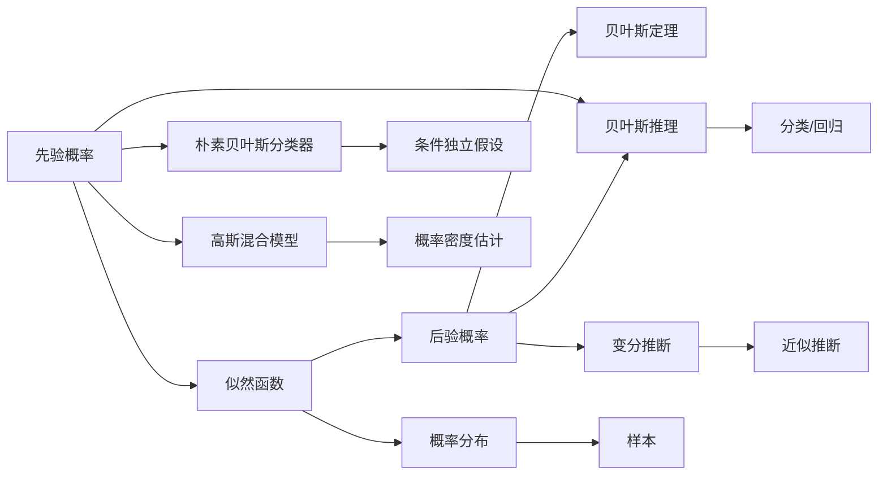
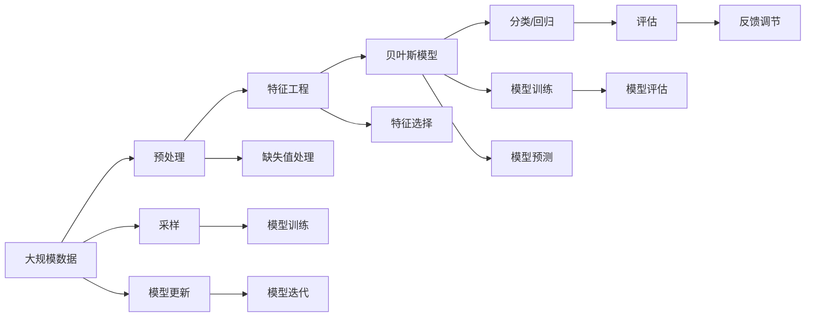

                 

# 贝叶斯算法(Bayesian Algorithms) - 原理与代码实例讲解

## 1. 背景介绍

贝叶斯算法（Bayesian Algorithms）是基于贝叶斯定理的一种概率推理方法。它在机器学习、统计推断、自然语言处理等领域都有广泛的应用。贝叶斯算法的核心思想是利用先验概率和观测数据，通过贝叶斯定理来计算后验概率，从而进行分类、回归、异常检测等任务。

### 1.1 问题由来

贝叶斯算法的发展可以追溯到18世纪。在1763年，Thomas Bayes 提出了贝叶斯定理，开创了概率论和统计学的新纪元。而现代贝叶斯算法的发展主要始于20世纪中期，得益于计算机科学和数据科学的飞速发展，贝叶斯算法被广泛应用于各类数据驱动的任务中。

如今，贝叶斯算法已经成为人工智能领域的重要基础技术，被广泛应用于自然语言处理、计算机视觉、推荐系统等场景。例如，在自然语言处理领域，贝叶斯算法被用于文本分类、情感分析、命名实体识别等任务；在计算机视觉领域，贝叶斯算法被用于目标检测、图像分割、图像分类等任务；在推荐系统领域，贝叶斯算法被用于协同过滤、内容推荐等任务。

### 1.2 问题核心关键点

贝叶斯算法的核心在于概率推理和贝叶斯定理。其核心思想是：利用先验概率和观测数据，通过贝叶斯定理计算后验概率，进而进行概率预测和分类。具体而言，贝叶斯算法涉及以下几个核心概念：

- **先验概率**：在观测数据之前，对模型参数的分布所做出的假设。
- **似然函数**：观测数据在模型参数下的概率分布。
- **后验概率**：在观测数据之后，对模型参数的分布所做出的更新。
- **贝叶斯定理**：连接先验概率、似然函数和后验概率的桥梁，计算后验概率的关键公式。

## 2. 核心概念与联系

### 2.1 核心概念概述

为了更好地理解贝叶斯算法的核心概念，下面简要介绍几个关键概念：

- **贝叶斯定理**：形式化地表达了先验概率、似然函数和后验概率之间的关系。
- **朴素贝叶斯分类器**：一种基于贝叶斯定理的简单分类算法，假设特征之间是条件独立的。
- **高斯混合模型**：一种用于概率密度估计的模型，假设数据由多个高斯分布组成。
- **变分推断**：一种近似贝叶斯推理的方法，通过优化对数似然函数的期望值来计算后验概率。
- **贝叶斯网络**：一种表示变量之间因果关系的图形模型，用于推断变量之间的关系和进行概率预测。

这些核心概念构成了贝叶斯算法的理论基础，使得贝叶斯算法能够在处理不确定性和复杂数据时，提供有效的概率推断和预测能力。

### 2.2 概念间的关系

贝叶斯算法中的核心概念之间存在着紧密的联系，可以形成如图的 Mermaid 流程图来展示：



这个流程图展示了贝叶斯算法中的核心概念及其之间的关系：

1. 先验概率通过似然函数和贝叶斯定理，更新为后验概率。
2. 通过贝叶斯推理，我们可以进行分类或回归等任务。
3. 朴素贝叶斯分类器是一种基于条件独立的贝叶斯推理算法。
4. 高斯混合模型可以用于概率密度估计。
5. 变分推断是一种近似贝叶斯推理的方法。

这些概念共同构成了贝叶斯算法的理论基础，使得贝叶斯算法能够在处理不确定性和复杂数据时，提供有效的概率推断和预测能力。

### 2.3 核心概念的整体架构

最后，我们用一个综合的流程图来展示贝叶斯算法的核心概念在大规模数据处理和推理中的整体架构：



这个综合流程图展示了从数据预处理、特征工程、模型训练到推理评估的完整过程。贝叶斯算法在大规模数据处理和推理中的应用，需要经过数据预处理、特征工程、模型训练、模型预测和模型评估等多个环节，最终实现数据的有效推理和分类。

## 3. 核心算法原理 & 具体操作步骤

### 3.1 算法原理概述

贝叶斯算法的核心原理是贝叶斯定理，其公式如下：

$$
P(\theta | X) = \frac{P(X | \theta)P(\theta)}{P(X)}
$$

其中，$\theta$ 表示模型参数，$X$ 表示观测数据，$P(X | \theta)$ 表示在参数 $\theta$ 下观测数据的概率分布，$P(\theta)$ 表示模型参数的先验概率，$P(X)$ 表示观测数据的概率。

贝叶斯算法通过先验概率和观测数据，计算出模型参数的后验概率 $P(\theta | X)$，从而进行分类、回归等任务。具体而言，贝叶斯算法分为以下几个步骤：

1. 收集数据，获取观测数据 $X$ 和先验概率 $P(\theta)$。
2. 根据数据，计算似然函数 $P(X | \theta)$。
3. 使用贝叶斯定理，计算后验概率 $P(\theta | X)$。
4. 使用后验概率进行分类或回归预测。

### 3.2 算法步骤详解

接下来，我们将详细介绍贝叶斯算法的具体操作步骤：

**Step 1: 数据收集与预处理**

- 收集数据：收集与任务相关的观测数据 $X$。
- 数据预处理：对数据进行去噪、归一化、缺失值处理等预处理操作，以便于模型训练和推理。

**Step 2: 先验概率设定**

- 先验概率：设定模型参数的先验概率 $P(\theta)$。通常情况下，先验概率的设定需要基于领域知识或经验。例如，对于朴素贝叶斯分类器，可以使用 $P(\theta)$ 表示各个类别出现的概率。

**Step 3: 似然函数计算**

- 似然函数：根据数据 $X$ 和模型参数 $\theta$，计算似然函数 $P(X | \theta)$。具体而言，可以采用最大似然估计（MLE）或贝叶斯估计（BEP）等方法。例如，对于高斯混合模型，可以计算高斯分布的概率密度函数。

**Step 4: 后验概率计算**

- 后验概率：使用贝叶斯定理，计算后验概率 $P(\theta | X)$。具体而言，可以采用闭合形式或迭代方法，如EM算法等。例如，对于朴素贝叶斯分类器，可以使用极大似然估计（MLE）计算后验概率。

**Step 5: 模型预测与评估**

- 模型预测：使用后验概率进行分类或回归预测。具体而言，可以采用贝叶斯推理算法，如最大后验估计（MPE）等。例如，对于朴素贝叶斯分类器，可以使用 MPE 计算类别概率。
- 模型评估：评估模型预测结果的准确性和鲁棒性。具体而言，可以采用交叉验证、ROC曲线等方法。例如，对于朴素贝叶斯分类器，可以使用准确率、召回率等指标评估模型性能。

### 3.3 算法优缺点

贝叶斯算法具有以下优点：

1. 能够处理不确定性和噪声：贝叶斯算法通过先验概率和后验概率，能够处理不确定性和噪声，使得模型具有更好的鲁棒性。
2. 能够自适应地更新模型：贝叶斯算法能够根据新的数据自适应地更新模型参数，适应数据分布的变化。
3. 可以用于各种任务：贝叶斯算法可以用于分类、回归、异常检测等任务，具有广泛的应用场景。

贝叶斯算法也存在一些缺点：

1. 计算复杂度高：贝叶斯算法的计算复杂度较高，特别是在数据量较大时，计算开销较大。
2. 先验概率的选择：贝叶斯算法的性能依赖于先验概率的选择，不当的先验概率可能导致模型过拟合或欠拟合。
3. 数据量要求高：贝叶斯算法需要大量的数据来估计模型参数，对于小样本数据集可能效果不佳。

### 3.4 算法应用领域

贝叶斯算法在多个领域都有广泛的应用，以下是几个主要的应用领域：

- **自然语言处理**：贝叶斯算法被用于文本分类、情感分析、命名实体识别等任务。例如，朴素贝叶斯分类器在垃圾邮件过滤、情感分析中得到了广泛应用。
- **计算机视觉**：贝叶斯算法被用于图像分类、目标检测、图像分割等任务。例如，高斯混合模型在图像分割中得到了广泛应用。
- **推荐系统**：贝叶斯算法被用于协同过滤、内容推荐等任务。例如，贝叶斯网络在推荐系统中得到了广泛应用。
- **金融工程**：贝叶斯算法被用于风险管理、信用评估、股票预测等任务。例如，贝叶斯网络在信用评估中得到了广泛应用。

## 4. 数学模型和公式 & 详细讲解 & 举例说明

### 4.1 数学模型构建

贝叶斯算法是一种概率推理方法，其核心模型是贝叶斯定理。接下来，我们将详细讲解贝叶斯定理的数学模型构建。

假设我们有一个二分类问题，其中数据集 $X = \{x_i\}_{i=1}^N$，每个样本 $x_i$ 属于类别 $y_i \in \{0, 1\}$。我们的目标是使用贝叶斯算法，计算样本 $x_i$ 属于类别 $y_i$ 的后验概率 $P(y_i | x_i)$。

根据贝叶斯定理，后验概率的计算公式如下：

$$
P(y_i | x_i) = \frac{P(x_i | y_i)P(y_i)}{P(x_i)}
$$

其中，$P(x_i | y_i)$ 表示在类别 $y_i$ 下，样本 $x_i$ 的条件概率；$P(y_i)$ 表示类别 $y_i$ 的先验概率；$P(x_i)$ 表示样本 $x_i$ 的先验概率。

在具体实现中，我们需要对模型进行假设和简化。例如，对于朴素贝叶斯分类器，我们假设样本 $x_i$ 由若干个条件独立特征 $x_i = (x_{i,1}, x_{i,2}, ..., x_{i,d})$ 组成，且特征之间相互独立。在这种情况下，后验概率的计算公式可以进一步简化为：

$$
P(y_i | x_i) = \frac{P(x_{i,1} | y_i)P(x_{i,2} | y_i)...P(x_{i,d} | y_i)P(y_i)}{P(x_{i,1})P(x_{i,2})...P(x_{i,d})P(x_i)}
$$

其中，$P(x_{i,j} | y_i)$ 表示在类别 $y_i$ 下，第 $j$ 个特征 $x_{i,j}$ 的条件概率。

### 4.2 公式推导过程

接下来，我们将推导朴素贝叶斯分类器的后验概率计算公式。假设样本 $x_i$ 由若干个条件独立特征 $x_i = (x_{i,1}, x_{i,2}, ..., x_{i,d})$ 组成，且特征之间相互独立。在这种情况下，后验概率的计算公式可以进一步简化为：

$$
P(y_i | x_i) = \frac{P(x_{i,1} | y_i)P(x_{i,2} | y_i)...P(x_{i,d} | y_i)P(y_i)}{P(x_{i,1})P(x_{i,2})...P(x_{i,d})P(x_i)}
$$

我们可以使用极大似然估计（MLE）来计算类别 $y_i$ 的先验概率 $P(y_i)$ 和特征 $x_{i,j}$ 的条件概率 $P(x_{i,j} | y_i)$。具体而言，对于类别 $y_i$，我们可以使用极大似然估计来计算样本 $x_i$ 在该类别下出现的频率，即：

$$
P(y_i) = \frac{\sum_{x_i \in X} \delta(y_i = y)}{|X|}
$$

其中，$\delta$ 表示 Kronecker delta 函数，即 $\delta(y_i = y) = 1$ 表示 $y_i$ 等于 $y$，$\delta(y_i = y) = 0$ 表示 $y_i$ 不等于 $y$。

对于特征 $x_{i,j}$，我们可以使用极大似然估计来计算该特征在类别 $y_i$ 下出现的频率，即：

$$
P(x_{i,j} | y_i) = \frac{\sum_{x_i \in X} \delta(y_i = y) \delta(x_{i,j} = x_j)}{|X|}
$$

其中，$x_j$ 表示第 $j$ 个特征在样本 $x_i$ 中出现的取值。

### 4.3 案例分析与讲解

接下来，我们将通过一个具体的案例来讲解贝叶斯算法的应用。

假设我们要对一封邮件进行垃圾邮件过滤，我们需要使用朴素贝叶斯分类器来计算邮件属于垃圾邮件的后验概率。我们假设邮件由若干个特征组成，如邮件的长度、是否包含链接、是否包含附件等。我们可以将每个特征视为条件独立特征，并且假设这些特征之间是相互独立的。

首先，我们需要收集一些标注数据，如 100 封垃圾邮件和 100 封正常邮件，并计算出它们的先验概率和条件概率。具体而言，我们可以使用极大似然估计来计算这些概率。例如，对于垃圾邮件，我们可以计算出样本 $x_i$ 在该类别下出现的频率，即：

$$
P(y_i = 1) = \frac{\sum_{x_i \in X, y_i = 1} \delta(y_i = 1)}{|X|}
$$

其中，$\delta(y_i = 1) = 1$ 表示邮件 $x_i$ 属于垃圾邮件，$\delta(y_i = 1) = 0$ 表示邮件 $x_i$ 不属于垃圾邮件。

接下来，我们可以使用极大似然估计来计算特征 $x_{i,j}$ 在类别 $y_i = 1$ 下出现的频率，即：

$$
P(x_{i,j} | y_i = 1) = \frac{\sum_{x_i \in X, y_i = 1} \delta(y_i = 1) \delta(x_{i,j} = x_j)}{|X|}
$$

其中，$x_j$ 表示第 $j$ 个特征在样本 $x_i$ 中出现的取值。

同样，我们也可以使用极大似然估计来计算特征 $x_{i,j}$ 在类别 $y_i = 0$ 下出现的频率，即：

$$
P(x_{i,j} | y_i = 0) = \frac{\sum_{x_i \in X, y_i = 0} \delta(y_i = 0) \delta(x_{i,j} = x_j)}{|X|}
$$

其中，$x_j$ 表示第 $j$ 个特征在样本 $x_i$ 中出现的取值。

最后，我们可以使用贝叶斯定理来计算邮件属于垃圾邮件的后验概率，即：

$$
P(y_i = 1 | x_i) = \frac{P(x_{i,1} | y_i = 1)P(x_{i,2} | y_i = 1)...P(x_{i,d} | y_i = 1)P(y_i = 1)}{P(x_{i,1})P(x_{i,2})...P(x_{i,d})P(x_i)}
$$

其中，$P(x_{i,j} | y_i = 1)$ 表示在垃圾邮件下，第 $j$ 个特征 $x_{i,j}$ 的条件概率，$P(y_i = 1)$ 表示垃圾邮件的先验概率，$P(x_{i,j})$ 表示特征 $x_{i,j}$ 的先验概率。

通过上述步骤，我们可以使用朴素贝叶斯分类器来计算邮件属于垃圾邮件的后验概率，从而进行垃圾邮件过滤。

## 5. 项目实践：代码实例和详细解释说明

### 5.1 开发环境搭建

在进行贝叶斯算法的项目实践前，我们需要准备好开发环境。以下是使用Python进行贝叶斯算法开发的环境配置流程：

1. 安装Anaconda：从官网下载并安装Anaconda，用于创建独立的Python环境。

2. 创建并激活虚拟环境：
```bash
conda create -n bayesian-env python=3.8 
conda activate bayesian-env
```

3. 安装必要的Python库：
```bash
conda install numpy scipy pandas scikit-learn matplotlib seaborn tqdm
```

4. 安装贝叶斯算法相关的库：
```bash
conda install pymc3 arviz
```

完成上述步骤后，即可在`bayesian-env`环境中开始贝叶斯算法的实践。

### 5.2 源代码详细实现

接下来，我们将通过一个具体的案例来讲解贝叶斯算法的实现。具体而言，我们将使用Python的PyMC3库来实现高斯混合模型（Gaussian Mixture Model, GMM），并进行数据拟合和预测。

首先，我们需要导入必要的库：
```python
import numpy as np
import pandas as pd
import seaborn as sns
import matplotlib.pyplot as plt
import pymc3 as pm
import arviz as az
```

接下来，我们将构建高斯混合模型，并进行数据拟合。假设我们要对一组数据进行拟合，数据如下：

```python
data = np.array([[1, 2], [2, 3], [3, 4], [4, 5], [5, 6], [6, 7], [7, 8], [8, 9], [9, 10], [10, 11]])
```

我们可以使用高斯混合模型来拟合这组数据。具体而言，我们将使用3个高斯分布来拟合这组数据：

```python
with pm.Model() as gmm:
    mu1 = pm.Normal('mu1', mu=0, sd=2, shape=2)
    mu2 = pm.Normal('mu2', mu=5, sd=2, shape=2)
    mu3 = pm.Normal('mu3', mu=10, sd=2, shape=2)
    sigma1 = pm.HalfNormal('sigma1', sd=1, shape=2)
    sigma2 = pm.HalfNormal('sigma2', sd=1, shape=2)
    sigma3 = pm.HalfNormal('sigma3', sd=1, shape=2)
    x = pm.Mixture('mixture', weights=[0.3, 0.4, 0.3], components=[pm.Normal('comp1', mu=mu1, sd=sigma1), 
                                                                    pm.Normal('comp2', mu=mu2, sd=sigma2), 
                                                                    pm.Normal('comp3', mu=mu3, sd=sigma3)])
    
    prior = pm.Mixture('prior', weights=[0.2, 0.4, 0.4], components=[pm.Normal('prior1', mu=0, sd=2, shape=2),
                                                                    pm.Normal('prior2', mu=5, sd=2, shape=2),
                                                                    pm.Normal('prior3', mu=10, sd=2, shape=2)])
    likelihood = pm.Normal('likelihood', mu=x, sd=1, observed=data)
```

在上述代码中，我们定义了一个高斯混合模型 `gmm`，其中 `mu1`, `mu2`, `mu3` 表示各个高斯分布的均值， `sigma1`, `sigma2`, `sigma3` 表示各个高斯分布的方差， `x` 表示数据点， `prior` 表示先验概率分布， `likelihood` 表示似然函数。我们使用 `pm.Mixture` 函数来定义高斯混合模型，其中 `weights` 表示各个分量的权重， `components` 表示各个分量的高斯分布。

接下来，我们需要对模型进行拟合，并可视化拟合结果：

```python
with gmm:
    trace = pm.sample(1000, chains=2, cores=2, progress_bar=False)
    az.summary(trace)
    
    pm.plot_trace(trace)
```

在上述代码中，我们使用 `pm.sample` 函数来对模型进行拟合，其中 `chains` 表示采样链数， `cores` 表示采样核心数。我们使用 `az.summary` 函数来可视化拟合结果，并使用 `pm.plot_trace` 函数来绘制拟合轨迹。

最后，我们可以使用拟合后的模型进行预测，例如，我们可以对新数据点 `[11, 12]` 进行预测：

```python
with gmm:
    posterior = pm.sample_posterior_predictive(trace, new_data=[11, 12])
    
    print('Posterior Predictive Probability: ', posterior[0, 0])
```

在上述代码中，我们使用 `pm.sample_posterior_predictive` 函数来对新数据进行预测，并使用 `print` 函数来输出预测结果。

### 5.3 代码解读与分析

接下来，我们将对上述代码进行详细解读和分析。

**数据拟合过程**：
在数据拟合过程中，我们使用 `pm.sample` 函数对高斯混合模型进行拟合。 `pm.sample` 函数会使用 MCMC 算法来采样模型参数，并使用 `az.summary` 函数来可视化拟合结果。拟合结果包括每个参数的均值、标准差、有效样本数等统计信息。

**拟合结果可视化**：
在拟合结果可视化过程中，我们使用 `pm.plot_trace` 函数来绘制拟合轨迹，以便于观察模型参数的分布情况。拟合轨迹可以帮助我们了解模型参数的收敛情况，以及是否存在模式跳跃等问题。

**新数据预测**：
在新数据预测过程中，我们使用 `pm.sample_posterior_predictive` 函数对新数据进行预测。该函数会使用拟合后的模型参数，对新数据进行预测，并输出预测结果的后验概率分布。

## 6. 实际应用场景

贝叶斯算法在多个领域都有广泛的应用，以下是几个主要的应用场景：

### 6.1 金融风险管理

贝叶斯算法被用于金融风险管理，通过分析历史数据和先验概率，计算模型的后验概率，从而进行风险评估和预测。例如，我们可以使用贝叶斯算法来计算贷款违约的概率，并根据预测结果进行信用评估和风险控制。

### 6.2 医疗诊断

贝叶斯算法被用于医疗诊断，通过分析患者的先验信息和观测数据，计算模型的后验概率，从而进行诊断和治疗决策。例如，我们可以使用贝叶斯算法来计算患者患有某种疾病的概率，并根据预测结果进行诊断和治疗。

### 6.3 智能推荐系统

贝叶斯算法被用于智能推荐系统，通过分析用户的历史行为和先验信息，计算模型的后验概率，从而进行推荐决策。例如，我们可以使用贝叶斯算法来计算用户对某个商品的概率，并根据预测结果进行推荐。

### 6.4 异常检测

贝叶斯算法被用于异常检测，通过分析数据的先验信息和观测数据，计算模型的后验概率，从而进行异常检测和报警。例如，我们可以使用贝叶斯算法来检测网络入侵行为，并根据预测结果进行报警和处理。

## 7. 工具和资源推荐

### 7.1 学习资源推荐

为了帮助开发者系统掌握贝叶斯算法的理论基础和实践技巧，这里推荐一些优质的学习资源：

1. 《机器学习基础》：周志华著，全面介绍了机器学习的基本概念和算法，包括贝叶斯算法。
2. 《概率论与数理统计》：中国科学院大学公开课，深入浅出地介绍了概率论和数理统计的基本概念和方法。
3. 《Python机器学习》：Raschka著，介绍了使用Python进行机器学习的方法和技巧，包括贝叶斯算法。
4. 《贝叶斯优化》：Sobolina et al.著，介绍了贝叶斯优化算法的原理和实现方法，包括高斯过程。
5. 《统计学习方法》：李航著，介绍了机器学习的基本概念和方法，包括贝叶斯算法。

通过对这些资源的学习实践，相信你一定能够快速掌握贝叶斯算法的精髓，并用于解决实际的机器学习问题。

### 7.2 开发工具推荐


