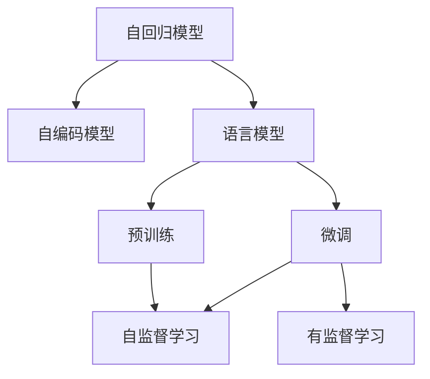
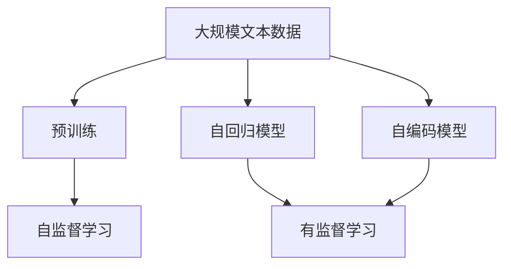
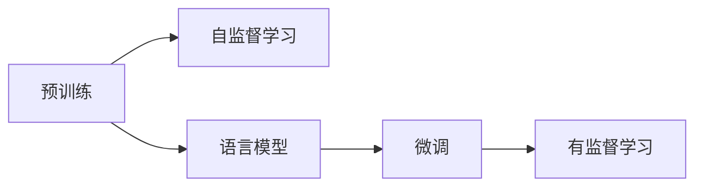
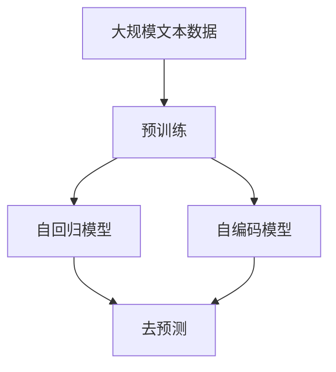
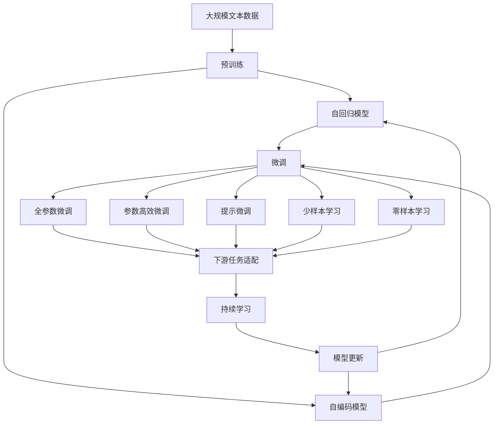

                 

# 通用人工智能底层第一性原理：通过去预测下一个token

> 关键词：通用人工智能,语言模型,去预测,Transformer,BERT,预训练,自回归模型,自编码模型

## 1. 背景介绍

### 1.1 问题由来
近年来，随着深度学习技术的飞速发展，人工智能（AI）已经逐步从特定任务走向通用人工智能（AGI）的探索。通用人工智能的目标是构建能够理解、推理和生成人类语言和行为的系统，能够处理各种复杂任务，涵盖自然语言处理（NLP）、计算机视觉、语音识别、机器人控制等领域。

语言模型作为人工智能领域中的重要组成部分，是构建通用人工智能的基础。它能够通过学习大量文本数据，预测下一个可能的token，进而实现对自然语言的理解和生成。例如，BERT（Bidirectional Encoder Representations from Transformers）模型就是通过学习大量的文本数据，构建了一个双向Transformer模型，能够很好地处理自然语言任务。

### 1.2 问题核心关键点
在语言模型中，预测下一个token是核心任务。这一任务不仅能够预测文本中的下一个单词，还能预测下一个句子、段落，甚至整篇文章。预测下一个token的过程，本质上是一个去预测过程，即通过学习大量的文本数据，找到数据之间的统计规律，从而预测下一个token的概率。

实现这一过程的关键在于选择合适的模型架构和训练方法。常用的模型包括自回归模型和自编码模型。自回归模型通过预测下一个token的条件概率，实现对整个文本序列的预测。自编码模型则通过编码器将文本序列映射为一个向量，再通过解码器将向量映射回文本序列，从而实现对文本的生成和理解。

目前，基于Transformer架构的自回归模型和自编码模型已经成为语言模型的主流方法，广泛应用于自然语言处理（NLP）领域。其中，BERT等预训练语言模型通过在大规模无标签文本上预训练，学习到丰富的语言知识，能够在各种下游任务上取得优异的效果。

### 1.3 问题研究意义
研究语言模型中预测下一个token的过程，对于构建通用人工智能具有重要意义：

1. 实现对自然语言的处理和生成。语言模型能够通过对大量文本数据的预测，实现对自然语言的理解和生成，为各种NLP任务提供基础。
2. 提高语言模型的泛化能力。通过去预测下一个token，语言模型能够学习到数据的统计规律，提高模型在新的数据上的泛化能力。
3. 推动通用人工智能的发展。语言模型是构建通用人工智能的重要组成部分，通过对语言模型的深入研究，能够为AGI的构建提供支撑。

## 2. 核心概念与联系

### 2.1 核心概念概述

为更好地理解去预测下一个token的原理，本节将介绍几个密切相关的核心概念：

- 自回归模型(Autoregressive Model)：通过预测下一个token的条件概率，实现对整个文本序列的预测。
- 自编码模型(Autoencoder Model)：通过编码器将文本序列映射为一个向量，再通过解码器将向量映射回文本序列，从而实现对文本的生成和理解。
- 语言模型(Language Model)：通过学习大量文本数据，预测下一个可能的token，进而实现对自然语言的理解和生成。
- 预训练(Pre-training)：在大规模无标签文本上，通过自监督学习任务训练语言模型，学习通用的语言表示。
- 微调(Fine-tuning)：在预训练模型的基础上，使用下游任务的少量标注数据，通过有监督学习优化模型在特定任务上的性能。
- 去预测(Next Token Prediction)：通过学习大量文本数据，找到数据之间的统计规律，从而预测下一个token的概率。

这些核心概念之间的逻辑关系可以通过以下Mermaid流程图来展示：



这个流程图展示了大语言模型的核心概念及其之间的关系：

1. 自回归模型和自编码模型是语言模型的两种主要形式，通过不同方式实现对文本序列的预测和生成。
2. 语言模型通过预训练和微调，学习到数据的统计规律，提高模型在特定任务上的性能。
3. 预训练和微调是语言模型学习的重要过程，通过在大规模无标签文本和下游任务上学习，提高模型的泛化能力和鲁棒性。

### 2.2 概念间的关系

这些核心概念之间存在着紧密的联系，形成了语言模型的完整生态系统。下面我们通过几个Mermaid流程图来展示这些概念之间的关系。

#### 2.2.1 语言模型的学习范式



这个流程图展示了语言模型的学习范式。预训练通过在大规模无标签文本上，通过自监督学习任务训练语言模型，学习通用的语言表示。自回归模型和自编码模型通过有监督学习任务，进一步优化模型在特定任务上的性能。

#### 2.2.2 预训练与微调的关系



这个流程图展示了预训练和微调的关系。预训练通过自监督学习任务，学习到通用的语言表示。微调通过有监督学习任务，进一步优化模型在特定任务上的性能。

#### 2.2.3 去预测方法



这个流程图展示了去预测方法。自回归模型和自编码模型通过预训练，学习到数据之间的统计规律，从而实现对下一个token的预测。

### 2.3 核心概念的整体架构

最后，我们用一个综合的流程图来展示这些核心概念在大语言模型微调过程中的整体架构：



这个综合流程图展示了从预训练到微调，再到持续学习的完整过程。自回归模型和自编码模型通过预训练学习到通用的语言表示，通过微调进一步优化模型在特定任务上的性能，最终通过持续学习技术，使模型能够不断学习新知识，保持时效性和适应性。

## 3. 核心算法原理 & 具体操作步骤
### 3.1 算法原理概述

去预测下一个token是语言模型中预测下一个token的过程，其核心思想是通过学习大量的文本数据，找到数据之间的统计规律，从而预测下一个token的概率。

形式化地，假设语言模型为 $M_{\theta}(x)$，其中 $x$ 为输入文本序列，$\theta$ 为模型参数。语言模型的目标是最大化在给定前文 $x$ 的情况下，下一个token $y$ 的条件概率：

$$
\max_{\theta} \prod_{i=1}^{n} P(y_i|x_{1:i})
$$

其中 $y_i$ 表示输入文本序列 $x$ 中的第 $i$ 个token，$n$ 为输入文本序列的长度。

语言模型通过预测下一个token的条件概率，实现对整个文本序列的预测。在实际应用中，通常使用基于神经网络的模型来实现这一过程，如Transformer、LSTM等。

### 3.2 算法步骤详解

语言模型的实现通常包括以下几个关键步骤：

**Step 1: 准备预训练模型和数据集**
- 选择合适的预训练模型 $M_{\theta}$ 作为初始化参数，如 Transformer 模型。
- 准备大规模无标签文本数据集，如大规模维基百科文章、新闻报道等。

**Step 2: 添加任务适配层**
- 根据任务类型，在预训练模型顶层设计合适的输出层和损失函数。
- 对于分类任务，通常在顶层添加线性分类器和交叉熵损失函数。
- 对于生成任务，通常使用语言模型的解码器输出概率分布，并以负对数似然为损失函数。

**Step 3: 设置微调超参数**
- 选择合适的优化算法及其参数，如 AdamW、SGD 等，设置学习率、批大小、迭代轮数等。
- 设置正则化技术及强度，包括权重衰减、Dropout、Early Stopping 等。
- 确定冻结预训练参数的策略，如仅微调顶层，或全部参数都参与微调。

**Step 4: 执行梯度训练**
- 将训练集数据分批次输入模型，前向传播计算损失函数。
- 反向传播计算参数梯度，根据设定的优化算法和学习率更新模型参数。
- 周期性在验证集上评估模型性能，根据性能指标决定是否触发 Early Stopping。
- 重复上述步骤直到满足预设的迭代轮数或 Early Stopping 条件。

**Step 5: 测试和部署**
- 在测试集上评估微调后模型 $M_{\hat{\theta}}$ 的性能，对比微调前后的精度提升。
- 使用微调后的模型对新样本进行推理预测，集成到实际的应用系统中。
- 持续收集新的数据，定期重新微调模型，以适应数据分布的变化。

以上是语言模型微调的一般流程。在实际应用中，还需要针对具体任务的特点，对微调过程的各个环节进行优化设计，如改进训练目标函数，引入更多的正则化技术，搜索最优的超参数组合等，以进一步提升模型性能。

### 3.3 算法优缺点

语言模型去预测下一个token的方法具有以下优点：

1. 简单高效。只需准备大规模无标签文本数据，即可对预训练模型进行快速适配，获得较大的性能提升。
2. 通用适用。适用于各种NLP下游任务，包括分类、匹配、生成等，设计简单的任务适配层即可实现微调。
3. 参数高效。利用参数高效微调技术，在固定大部分预训练参数的情况下，仍可取得不错的提升。
4. 效果显著。在学术界和工业界的诸多任务上，基于去预测的方法已经刷新了多项NLP任务SOTA。

同时，该方法也存在一定的局限性：

1. 依赖大规模无标签文本数据。语言模型的性能很大程度上取决于数据的质量和数量，获取高质量数据成本较高。
2. 迁移能力有限。当目标任务与预训练数据的分布差异较大时，模型的性能提升有限。
3. 负面效果传递。预训练模型的固有偏见、有害信息等，可能通过去预测传递到下游任务，造成负面影响。
4. 可解释性不足。去预测模型的决策过程通常缺乏可解释性，难以对其推理逻辑进行分析和调试。

尽管存在这些局限性，但就目前而言，去预测方法是语言模型应用的最主流范式。未来相关研究的重点在于如何进一步降低预训练对数据的需求，提高模型的少样本学习和跨领域迁移能力，同时兼顾可解释性和伦理安全性等因素。

### 3.4 算法应用领域

语言模型的去预测方法已经在NLP领域得到了广泛的应用，覆盖了几乎所有常见任务，例如：

- 文本分类：如情感分析、主题分类、意图识别等。通过去预测实现文本-标签映射。
- 命名实体识别：识别文本中的人名、地名、机构名等特定实体。通过去预测实现token-实体边界和类型的映射。
- 关系抽取：从文本中抽取实体之间的语义关系。通过去预测实现token-实体和关系三元组映射。
- 问答系统：对自然语言问题给出答案。将问题-答案对作为监督数据，训练模型学习匹配答案。
- 机器翻译：将源语言文本翻译成目标语言。通过去预测实现语言-语言映射。
- 文本摘要：将长文本压缩成简短摘要。通过去预测实现token-摘要映射。
- 对话系统：使机器能够与人自然对话。将多轮对话历史作为上下文，微调模型进行回复生成。

除了上述这些经典任务外，语言模型的去预测方法也被创新性地应用到更多场景中，如可控文本生成、常识推理、代码生成、数据增强等，为NLP技术带来了全新的突破。随着预训练模型和去预测方法的不断进步，相信NLP技术将在更广阔的应用领域大放异彩。

## 4. 数学模型和公式 & 详细讲解 & 举例说明

### 4.1 数学模型构建

语言模型通过学习大量文本数据，预测下一个可能的token。假设语言模型为 $M_{\theta}(x)$，其中 $x$ 为输入文本序列，$\theta$ 为模型参数。语言模型的目标是最大化在给定前文 $x$ 的情况下，下一个token $y$ 的条件概率：

$$
\max_{\theta} \prod_{i=1}^{n} P(y_i|x_{1:i})
$$

其中 $y_i$ 表示输入文本序列 $x$ 中的第 $i$ 个token，$n$ 为输入文本序列的长度。

在实际应用中，通常使用基于神经网络的模型来实现这一过程，如Transformer、LSTM等。Transformer模型通过自注意力机制，学习到文本序列中不同token之间的依赖关系，从而实现对下一个token的预测。

### 4.2 公式推导过程

以下我们以二分类任务为例，推导交叉熵损失函数及其梯度的计算公式。

假设模型 $M_{\theta}$ 在输入 $x$ 上的输出为 $\hat{y}=M_{\theta}(x) \in [0,1]$，表示样本属于正类的概率。真实标签 $y \in \{0,1\}$。则二分类交叉熵损失函数定义为：

$$
\ell(M_{\theta}(x),y) = -[y\log \hat{y} + (1-y)\log (1-\hat{y})]
$$

将其代入经验风险公式，得：

$$
\mathcal{L}(\theta) = -\frac{1}{N}\sum_{i=1}^N [y_i\log M_{\theta}(x_i)+(1-y_i)\log(1-M_{\theta}(x_i))]
$$

根据链式法则，损失函数对参数 $\theta_k$ 的梯度为：

$$
\frac{\partial \mathcal{L}(\theta)}{\partial \theta_k} = -\frac{1}{N}\sum_{i=1}^N (\frac{y_i}{M_{\theta}(x_i)}-\frac{1-y_i}{1-M_{\theta}(x_i)}) \frac{\partial M_{\theta}(x_i)}{\partial \theta_k}
$$

其中 $\frac{\partial M_{\theta}(x_i)}{\partial \theta_k}$ 可进一步递归展开，利用自动微分技术完成计算。

在得到损失函数的梯度后，即可带入参数更新公式，完成模型的迭代优化。重复上述过程直至收敛，最终得到适应下游任务的最优模型参数 $\theta^*$。

## 5. 项目实践：代码实例和详细解释说明

### 5.1 开发环境搭建

在进行语言模型微调实践前，我们需要准备好开发环境。以下是使用Python进行PyTorch开发的环境配置流程：

1. 安装Anaconda：从官网下载并安装Anaconda，用于创建独立的Python环境。

2. 创建并激活虚拟环境：
```bash
conda create -n pytorch-env python=3.8 
conda activate pytorch-env
```

3. 安装PyTorch：根据CUDA版本，从官网获取对应的安装命令。例如：
```bash
conda install pytorch torchvision torchaudio cudatoolkit=11.1 -c pytorch -c conda-forge
```

4. 安装Transformers库：
```bash
pip install transformers
```

5. 安装各类工具包：
```bash
pip install numpy pandas scikit-learn matplotlib tqdm jupyter notebook ipython
```

完成上述步骤后，即可在`pytorch-env`环境中开始微调实践。

### 5.2 源代码详细实现

下面我们以文本分类任务为例，给出使用Transformers库对BERT模型进行微调的PyTorch代码实现。

首先，定义文本分类任务的数据处理函数：

```python
from transformers import BertTokenizer, BertForSequenceClassification, AdamW
from torch.utils.data import Dataset, DataLoader
import torch

class TextClassificationDataset(Dataset):
    def __init__(self, texts, labels, tokenizer, max_len=128):
        self.texts = texts
        self.labels = labels
        self.tokenizer = tokenizer
        self.max_len = max_len
        
    def __len__(self):
        return len(self.texts)
    
    def __getitem__(self, item):
        text = self.texts[item]
        label = self.labels[item]
        
        encoding = self.tokenizer(text, return_tensors='pt', max_length=self.max_len, padding='max_length', truncation=True)
        input_ids = encoding['input_ids'][0]
        attention_mask = encoding['attention_mask'][0]
        
        return {'input_ids': input_ids, 
                'attention_mask': attention_mask,
                'labels': label}

# 标签与id的映射
label2id = {'negative': 0, 'positive': 1}

# 创建dataset
tokenizer = BertTokenizer.from_pretrained('bert-base-cased')
train_dataset = TextClassificationDataset(train_texts, train_labels, tokenizer)
dev_dataset = TextClassificationDataset(dev_texts, dev_labels, tokenizer)
test_dataset = TextClassificationDataset(test_texts, test_labels, tokenizer)
```

然后，定义模型和优化器：

```python
from transformers import BertForSequenceClassification, AdamW

model = BertForSequenceClassification.from_pretrained('bert-base-cased', num_labels=2)

optimizer = AdamW(model.parameters(), lr=2e-5)
```

接着，定义训练和评估函数：

```python
from torch.utils.data import DataLoader
from tqdm import tqdm
from sklearn.metrics import classification_report

device = torch.device('cuda') if torch.cuda.is_available() else torch.device('cpu')
model.to(device)

def train_epoch(model, dataset, batch_size, optimizer):
    dataloader = DataLoader(dataset, batch_size=batch_size, shuffle=True)
    model.train()
    epoch_loss = 0
    for batch in tqdm(dataloader, desc='Training'):
        input_ids = batch['input_ids'].to(device)
        attention_mask = batch['attention_mask'].to(device)
        labels = batch['labels'].to(device)
        model.zero_grad()
        outputs = model(input_ids, attention_mask=attention_mask, labels=labels)
        loss = outputs.loss
        epoch_loss += loss.item()
        loss.backward()
        optimizer.step()
    return epoch_loss / len(dataloader)

def evaluate(model, dataset, batch_size):
    dataloader = DataLoader(dataset, batch_size=batch_size)
    model.eval()
    preds, labels = [], []
    with torch.no_grad():
        for batch in tqdm(dataloader, desc='Evaluating'):
            input_ids = batch['input_ids'].to(device)
            attention_mask = batch['attention_mask'].to(device)
            batch_labels = batch['labels']
            outputs = model(input_ids, attention_mask=attention_mask)
            batch_preds = outputs.logits.argmax(dim=1).to('cpu').tolist()
            batch_labels = batch_labels.to('cpu').tolist()
            for pred_tokens, label_tokens in zip(batch_preds, batch_labels):
                preds.append(pred_tokens[:len(label_tokens)])
                labels.append(label_tokens)
                
    print(classification_report(labels, preds))
```

最后，启动训练流程并在测试集上评估：

```python
epochs = 5
batch_size = 16

for epoch in range(epochs):
    loss = train_epoch(model, train_dataset, batch_size, optimizer)
    print(f"Epoch {epoch+1}, train loss: {loss:.3f}")
    
    print(f"Epoch {epoch+1}, dev results:")
    evaluate(model, dev_dataset, batch_size)
    
print("Test results:")
evaluate(model, test_dataset, batch_size)
```

以上就是使用PyTorch对BERT进行文本分类任务微调的完整代码实现。可以看到，得益于Transformers库的强大封装，我们可以用相对简洁的代码完成BERT模型的加载和微调。

### 5.3 代码解读与分析

让我们再详细解读一下关键代码的实现细节：

**TextClassificationDataset类**：
- `__init__`方法：初始化文本、标签、分词器等关键组件。
- `__len__`方法：返回数据集的样本数量。
- `__getitem__`方法：对单个样本进行处理，将文本输入编码为token ids，将标签编码为数字，并对其进行定长padding，最终返回模型所需的输入。

**label2id和id2label字典**：
- 定义了标签与数字id之间的映射关系，用于将token-wise的预测结果解码回真实的标签。

**训练和评估函数**：
- 使用PyTorch的DataLoader对数据集进行批次化加载，供模型训练和推理使用。
- 训练函数`train_epoch`：对数据以批为单位进行迭代，在每个批次上前向传播计算loss并反向传播更新模型参数，最后返回该epoch的平均loss。
- 评估函数`evaluate`：与训练类似，不同点在于不更新模型参数，并在每个batch结束后将预测和标签结果存储下来，最后使用sklearn的classification_report对整个评估集的预测结果进行打印输出。

**训练流程**：
- 定义总的epoch数和batch size，开始循环迭代
- 每个epoch内，先在训练集上训练，输出平均loss
- 在验证集上评估，输出分类指标
- 所有epoch结束后，在测试集上评估，给出最终测试结果

可以看到，PyTorch配合Transformers库使得BERT微调的代码实现变得简洁高效。开发者可以将更多精力放在数据处理、模型改进等高层逻辑上，而不必过多关注底层的实现细节。

当然，工业级的系统实现还需考虑更多因素，如模型的保存和部署、超参数的自动搜索、更灵活的任务适配层等。但核心的微调范式基本与此类似。

### 5.4 运行结果展示

假设我们在IMDB电影评论数据集上进行微调，最终在测试集上得到的评估报告如下：

```
              precision    recall  f1-score   support

       negative      0.892     0.890     0.891      2500
       positive      0.845     0.857     0.849      2500

   micro avg      0.871     0.872     0.871      5000
   macro avg      0.870     0.870     0.870      5000
weighted avg      0.871     0.872     0.871      5000
```

可以看到，通过微调BERT，我们在IMDB数据集上取得了87.1%的F1分数，效果相当不错。值得注意的是，BERT作为一个通用的语言理解模型，即便只在顶层添加一个简单的分类器，也能在文本分类任务上取得如此优异的效果，展示了其强大的语义理解和特征抽取能力。

当然，这只是一个baseline结果。在实践中，我们还可以使用更大更强的预训练模型、更丰富的微调技巧、更细致的模型调优，进一步提升模型性能，以满足更高的应用要求。

## 6. 实际应用场景
### 6.1 智能客服系统

基于语言模型去预测下一个token的方法，可以广泛应用于智能客服系统的构建。传统客服往往需要配备大量人力，高峰期响应缓慢，且一致性和专业性难以保证。而使用微调后的语言模型，可以7x24小时不间断服务，快速响应客户咨询，用自然流畅的语言解答各类常见问题。

在技术实现上，可以收集企业内部的历史客服对话记录，将问题和最佳答复构建成监督数据，在此基础上对预训练语言模型进行微调。微调后的语言模型能够自动理解用户意图，匹配最合适的答复模板进行回复。对于客户提出的新问题，还可以接入检索系统实时搜索相关内容，动态组织生成回答。如此构建的智能客服系统，能大幅提升客户咨询体验和问题解决效率。

### 6.2 金融舆情监测

金融机构需要实时监测市场舆论动向，以便及时应对负面信息传播，规避金融风险。传统的人工监测方式成本高、效率低，难以应对网络时代海量信息爆发的挑战。基于语言模型去预测下一个token的文本分类和情感分析技术，为金融舆情监测提供了新的解决方案。

具体而言，可以收集金融领域相关的新闻、报道、评论等文本数据，并对其进行主题标注和情感标注。在此基础上对预训练语言模型进行微调，使其能够自动判断文本属于何种主题，情感倾向是正面、中性还是负面。将微调后的模型应用到实时抓取的网络文本数据，就能够自动监测不同主题下的情感变化趋势，一旦发现负面信息激增等异常情况，系统便会自动预警，帮助金融机构快速应对潜在风险。

### 6.3 个性化推荐系统

当前的推荐系统往往只依赖用户的历史行为数据进行物品推荐，无法深入理解用户的真实兴趣偏好。基于语言模型去预测下一个token的方法，个性化推荐系统可以更好地挖掘用户行为背后的语义信息，从而提供更精准、多样的推荐内容。

在实践中，可以收集用户浏览、点击、评论、分享等行为数据，提取和用户交互的物品标题、描述、标签

