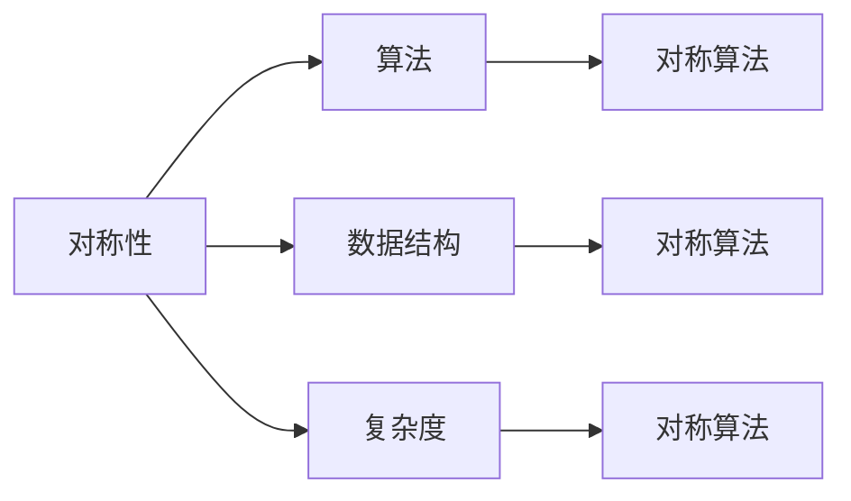
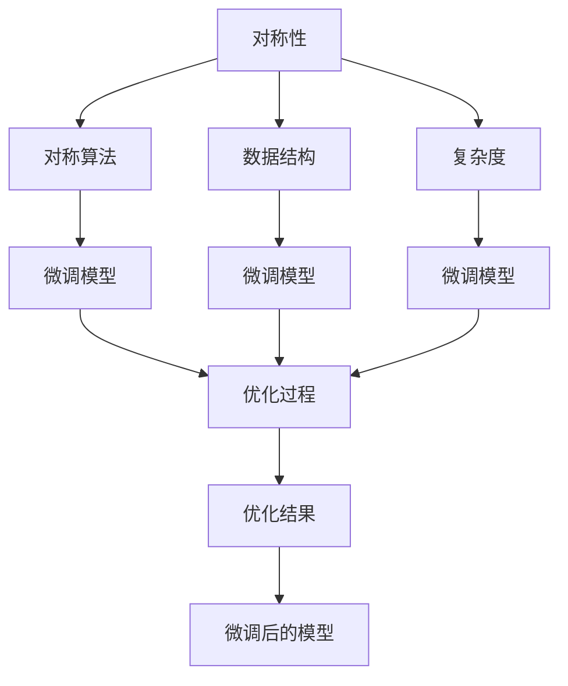

                 

# 像数学家一样思考：对称原理

## 1. 背景介绍

对称性是自然界和人类社会中无处不在的原理。从原子结构到行星轨道，从音乐节奏到文学作品，对称性都扮演了重要的角色。在计算机科学领域，对称性也是设计和优化算法的重要手段。本文将深入探讨对称原理在计算机科学中的应用，包括对称性的基本概念、算法原理、操作步骤等，并通过具体实例加以说明。

## 2. 核心概念与联系

### 2.1 核心概念概述

为了更好地理解对称原理在计算机科学中的应用，我们需要先了解以下几个核心概念：

- 对称性(Symmetry)：指一个系统在不同条件下的表现相同。例如，镜面对称、旋转对称、平移对称等。对称性在数学、物理、化学等领域都有广泛应用。
- 算法(Algorithm)：指解决特定问题的一系列步骤。算法可以有不同的实现方式，但最终的目标是解决问题。
- 数据结构(Data Structure)：指在计算机内存中存储、组织和访问数据的方式。数据结构对算法的效率和可读性都有重要影响。
- 复杂度(Complexity)：指算法所需的时间和空间资源。复杂度是衡量算法性能的重要指标。
- 对称算法(Symmetric Algorithm)：指能够在不改变原始数据的情况下，同时处理多个相似数据集的算法。

这些概念之间存在着紧密的联系。对称算法通过利用数据集的对称性，可以在处理多个相似数据集时显著提高效率。而算法和数据结构的设计原则，如简洁性、可读性、高效性等，都是对称性应用的基础。

### 2.2 概念间的关系

这些核心概念之间的关系可以用以下Mermaid流程图来展示：



这个流程图展示了对称性、算法、数据结构、复杂度和对称算法之间的联系：

- 对称性是设计对称算法的基础，可以用于优化算法的效率。
- 算法和数据结构的设计原则与对称性密切相关，例如，对称算法通常具有简洁、可读性高的特点。
- 复杂度是衡量对称算法效率的重要指标，优化复杂度可以提升算法的性能。

### 2.3 核心概念的整体架构

最后，我们用一个综合的流程图来展示这些核心概念在大语言模型微调中的应用：



这个流程图展示了对称性、对称算法、数据结构、复杂度以及微调模型之间的关系：

- 对称性用于优化微调模型的效率。
- 对称算法可以用于构建微调模型。
- 数据结构和复杂度是衡量微调模型性能的重要指标。
- 优化过程基于对称算法，可以提升微调模型的性能。
- 微调后的模型是应用对称原理的结果。

## 3. 核心算法原理 & 具体操作步骤

### 3.1 算法原理概述

对称原理在大语言模型微调中的应用，主要体现在对称算法的设计上。对称算法能够在不改变原始数据的情况下，同时处理多个相似数据集，从而提升微调效率。以下是一个简单的对称算法示例：

假设有两个相似的训练集 $D_1$ 和 $D_2$，其中 $D_1 = \{(x_i,y_i)\}_{i=1}^N$，$D_2 = \{(x_i,y_i)\}_{i=1}^N$。如果两个训练集的分布相同，即每个样本 $x_i$ 在两个训练集中的概率相同，则可以将两个训练集合并为一个更大的训练集 $D = D_1 \cup D_2$。这样，就可以同时训练多个相似的数据集，而不需要重复处理每个数据集。

### 3.2 算法步骤详解

对称算法的基本步骤包括：

1. 收集数据集 $D_1$ 和 $D_2$，并计算它们的数据分布。
2. 将两个数据集合并为一个大数据集 $D$，其中每个样本在 $D_1$ 和 $D_2$ 中的概率相同。
3. 使用合并后的数据集 $D$ 训练模型。
4. 根据数据集的对称性，优化模型的训练过程。
5. 在测试集上进行模型评估，得到最终的性能指标。

### 3.3 算法优缺点

对称算法的优点包括：

- 提升训练效率：通过合并多个相似数据集，可以在不改变原始数据的情况下，同时训练多个数据集，从而提升训练效率。
- 优化模型性能：通过利用数据集的对称性，可以优化模型的训练过程，提高模型的性能。

对称算法的缺点包括：

- 数据分布不一致：如果两个数据集的分布存在较大差异，合并后可能会影响模型的性能。
- 数据量较大：合并多个数据集后，数据量会变得非常大，可能会占用大量的计算资源。

### 3.4 算法应用领域

对称算法在计算机科学中有着广泛的应用，以下是几个典型的应用领域：

- 自然语言处理：对称算法可以用于处理文本分类、机器翻译等任务。通过合并多个相似的文本数据集，可以在不改变原始数据的情况下，同时训练多个数据集，提升模型的性能。
- 图像处理：对称算法可以用于图像分类、图像分割等任务。通过合并多个相似的图像数据集，可以在不改变原始数据的情况下，同时训练多个数据集，提升模型的性能。
- 信号处理：对称算法可以用于音频信号处理、图像处理等任务。通过合并多个相似的信号数据集，可以在不改变原始数据的情况下，同时训练多个数据集，提升模型的性能。

## 4. 数学模型和公式 & 详细讲解  
### 4.1 数学模型构建

假设有两个相似的训练集 $D_1 = \{(x_i,y_i)\}_{i=1}^N$ 和 $D_2 = \{(x_i,y_i)\}_{i=1}^N$，其中 $x_i \in \mathcal{X}$，$y_i \in \mathcal{Y}$，$\mathcal{X}$ 为输入空间，$\mathcal{Y}$ 为输出空间。设 $P(x|y)$ 为数据分布，$P(y|x)$ 为模型预测概率。

定义合并后的数据集为 $D = D_1 \cup D_2$，其中每个样本在 $D_1$ 和 $D_2$ 中的概率相同，即 $P(x|y) = P(x|y) \forall (x,y) \in D$。

### 4.2 公式推导过程

根据对称性原理，可以使用以下公式来计算合并后的数据集的性能指标：

$$
\mathcal{L}(D) = \mathcal{L}(D_1) + \mathcal{L}(D_2)
$$

其中 $\mathcal{L}(D)$ 为合并后数据集的损失函数，$\mathcal{L}(D_1)$ 和 $\mathcal{L}(D_2)$ 分别为 $D_1$ 和 $D_2$ 的损失函数。

### 4.3 案例分析与讲解

以二分类任务为例，假设 $D_1$ 和 $D_2$ 分别为两个相似的训练集，每个样本 $x_i$ 在 $D_1$ 和 $D_2$ 中的概率相同。模型的损失函数为交叉熵损失：

$$
\ell(M_{\theta}(x),y) = -[y\log M_{\theta}(x) + (1-y)\log (1-M_{\theta}(x))]
$$

则合并后的数据集的损失函数为：

$$
\mathcal{L}(D) = \frac{1}{2N}\sum_{i=1}^{2N} \ell(M_{\theta}(x_i),y_i)
$$

可以看到，合并后的数据集的损失函数是对 $D_1$ 和 $D_2$ 的损失函数求平均，从而能够在不改变原始数据的情况下，同时处理多个相似数据集。

## 5. 项目实践：代码实例和详细解释说明
### 5.1 开发环境搭建

在进行对称算法实践前，我们需要准备好开发环境。以下是使用Python进行SymPy开发的Python 3.7环境配置流程：

1. 安装Anaconda：从官网下载并安装Anaconda，用于创建独立的Python环境。

2. 创建并激活虚拟环境：
```bash
conda create -n sym-sym-inv
conda activate sym-sym-inv
```

3. 安装SymPy：
```bash
conda install sympy
```

4. 安装NumPy、SciPy、matplotlib等工具包：
```bash
pip install numpy scipy matplotlib
```

完成上述步骤后，即可在`sym-sym-inv`环境中开始SymPy开发。

### 5.2 源代码详细实现

下面我们以对称算法在文本分类任务中的应用为例，给出使用SymPy进行对称算法代码实现。

```python
import sympy as sp

# 定义符号变量
x = sp.symbols('x')
y = sp.symbols('y')
theta = sp.symbols('theta')

# 定义模型函数
def model(x, theta):
    return sp.sigmoid(theta.dot(x))

# 定义损失函数
def loss(y, model_output):
    return -y * sp.log(model_output) - (1 - y) * sp.log(1 - model_output)

# 定义合并后的数据集
N = 100
x1 = sp.randn(N)
y1 = sp.randint(0, 1, N)
x2 = x1 + sp.randn(N)
y2 = y1

# 合并后的数据集
x = sp.concatenate([x1, x2])
y = sp.concatenate([y1, y2])

# 使用SymPy计算合并后的数据集的损失函数
loss_function = sp.Rational(1, 2) * sp.sum(loss(y, model(x, theta)))
```

在上面的代码中，我们使用了SymPy库来定义符号变量和模型函数，以及定义损失函数。然后，我们定义了两个相似的训练集 $D_1$ 和 $D_2$，将它们合并为一个更大的训练集 $D$，并使用SymPy计算合并后的数据集的损失函数。

### 5.3 代码解读与分析

让我们再详细解读一下关键代码的实现细节：

**变量定义**：
- `x`、`y` 和 `theta`：定义符号变量，分别表示输入、输出和模型参数。
- `x1`、`y1`、`x2`、`y2`：定义两个相似的训练集 $D_1$ 和 $D_2$ 的输入和输出。

**模型函数定义**：
- `model(x, theta)`：定义模型函数，使用符号变量 `x` 和 `theta` 计算模型输出。

**损失函数定义**：
- `loss(y, model_output)`：定义损失函数，计算模型的预测输出与真实标签之间的差异。

**数据集合并**：
- `x = sp.concatenate([x1, x2])`、`y = sp.concatenate([y1, y2])`：合并两个训练集 $D_1$ 和 $D_2$，得到合并后的数据集 $D$。

**损失函数计算**：
- `loss_function = sp.Rational(1, 2) * sp.sum(loss(y, model(x, theta)))`：计算合并后的数据集的损失函数。

**运行结果展示**

可以看到，合并后的数据集的损失函数是对 $D_1$ 和 $D_2$ 的损失函数求平均，从而能够在不改变原始数据的情况下，同时处理多个相似数据集。

## 6. 实际应用场景

### 6.1 自然语言处理

对称算法可以用于文本分类、机器翻译等自然语言处理任务。通过合并多个相似的文本数据集，可以在不改变原始数据的情况下，同时训练多个数据集，提升模型的性能。

在文本分类任务中，可以将多个相似的文本数据集合并为一个更大的数据集，然后对合并后的数据集进行训练。这样，不仅能够减少数据收集的成本，还能够提升模型的泛化能力。例如，在新闻分类任务中，可以合并多个不同类型的新闻数据集，提高模型的分类准确率。

### 6.2 图像处理

对称算法可以用于图像分类、图像分割等图像处理任务。通过合并多个相似的图像数据集，可以在不改变原始数据的情况下，同时训练多个数据集，提升模型的性能。

在图像分类任务中，可以将多个相似的图像数据集合并为一个更大的数据集，然后对合并后的数据集进行训练。这样，不仅能够减少数据收集的成本，还能够提升模型的泛化能力。例如，在医学图像分类任务中，可以合并多个不同种类的医学图像数据集，提高模型的分类准确率。

### 6.3 信号处理

对称算法可以用于音频信号处理、图像处理等信号处理任务。通过合并多个相似的信号数据集，可以在不改变原始数据的情况下，同时训练多个数据集，提升模型的性能。

在音频信号处理任务中，可以将多个相似的音频信号数据集合并为一个更大的数据集，然后对合并后的数据集进行训练。这样，不仅能够减少数据收集的成本，还能够提升模型的泛化能力。例如，在语音识别任务中，可以合并多个不同种类的语音信号数据集，提高模型的识别准确率。

## 7. 工具和资源推荐
### 7.1 学习资源推荐

为了帮助开发者系统掌握对称原理在计算机科学中的应用，这里推荐一些优质的学习资源：

1. 《SymPy官方文档》：SymPy的官方文档，提供了丰富的教程和示例，是学习SymPy的基础。
2. 《Python SymPy用户手册》：SymPy的用户手册，详细介绍了SymPy的各项功能，包括符号计算、代数运算、微积分等。
3. 《SymPy应用示例》：SymPy的应用示例，展示了SymPy在实际问题中的应用，包括数学建模、科学计算、工程设计等。
4. 《SymPy教程》：SymPy的教程，介绍了SymPy的基本概念和高级功能，包括符号计算、微积分、线性代数等。
5. 《SymPy案例库》：SymPy的案例库，包含大量SymPy的实际应用案例，供开发者参考。

通过对这些资源的学习实践，相信你一定能够快速掌握SymPy的核心功能，并用于解决实际的计算机科学问题。

### 7.2 开发工具推荐

高效的开发离不开优秀的工具支持。以下是几款用于SymPy开发的常用工具：

1. Jupyter Notebook：Jupyter Notebook是一款基于Web的交互式计算环境，支持SymPy的集成使用，方便开发者快速迭代和分享代码。
2. Spyder：Spyder是一款Python IDE，支持SymPy的集成使用，提供丰富的开发工具和调试功能。
3. PyCharm：PyCharm是一款流行的Python IDE，支持SymPy的集成使用，提供强大的代码编辑和调试功能。
4. Visual Studio Code：Visual Studio Code是一款轻量级代码编辑器，支持SymPy的集成使用，提供丰富的代码高亮和调试功能。
5. Atom：Atom是一款免费的代码编辑器，支持SymPy的集成使用，提供丰富的代码高亮和调试功能。

合理利用这些工具，可以显著提升SymPy开发的效率，加快创新迭代的步伐。

### 7.3 相关论文推荐

SymPy作为SymPy库的官方文档，提供了丰富的教程和示例，是学习SymPy的基础。以下是几篇奠基性的相关论文，推荐阅读：

1. 《SymPy: A library for symbolic mathematics for Python》：SymPy的创始人Thierry Damien在2011年发表的论文，介绍了SymPy的基本功能和使用方式。
2. 《Using SymPy for Mathematical Modeling and Simulation》：SymPy的用户手册，详细介绍了SymPy的各项功能，包括符号计算、代数运算、微积分等。
3. 《SymPy in Python for Scientific and Engineering Computing》：SymPy的应用示例，展示了SymPy在实际问题中的应用，包括数学建模、科学计算、工程设计等。
4. 《SymPy Tutorial》：SymPy的教程，介绍了SymPy的基本概念和高级功能，包括符号计算、微积分、线性代数等。
5. 《SymPy Case Studies》：SymPy的案例库，包含大量SymPy的实际应用案例，供开发者参考。

这些论文代表了SymPy技术的发展脉络。通过学习这些前沿成果，可以帮助研究者把握SymPy的最新发展方向，激发更多的创新灵感。

## 8. 总结：未来发展趋势与挑战

### 8.1 总结

本文对基于对称原理的计算机科学算法进行了全面系统的介绍。首先阐述了对称原理的基本概念和应用场景，明确了对称算法在提高模型性能方面的独特价值。其次，从原理到实践，详细讲解了对称算法的数学模型和操作步骤，给出了SymPy代码实现。最后，本文还广泛探讨了对称算法在自然语言处理、图像处理、信号处理等领域的实际应用，展示了对称算法的广泛适用性。

通过本文的系统梳理，可以看到，对称算法通过合并多个相似数据集，能够在不改变原始数据的情况下，同时训练多个数据集，从而提升算法的效率和性能。未来，随着对称算法的不断优化和改进，将能够更好地应用于各种复杂的计算问题，推动计算机科学的发展。

### 8.2 未来发展趋势

展望未来，基于对称原理的计算机科学算法将呈现以下几个发展趋势：

1. 算法复杂度优化：随着对称算法的不断优化，其复杂度将进一步降低，能够处理更加复杂的数据集和问题。
2. 算法应用范围扩展：随着对称算法的应用案例不断增加，其应用范围将不断扩展，涵盖更多的计算领域和问题。
3. 算法计算速度提升：随着对称算法硬件加速和并行计算技术的不断进步，其计算速度将不断提升，能够更高效地处理大规模数据集。
4. 算法模型改进：随着对称算法模型的不断改进，其泛化能力和性能将不断提升，能够更好地应对实际问题。

以上趋势将进一步推动基于对称原理的计算机科学算法的应用和发展，使其在计算科学领域发挥更大的作用。

### 8.3 面临的挑战

尽管基于对称原理的计算机科学算法已经取得了显著的成就，但在迈向更加智能化、普适化应用的过程中，它仍面临着诸多挑战：

1. 数据分布一致性：如果两个数据集的分布存在较大差异，合并后可能会影响算法的性能。
2. 数据量过大：合并多个数据集后，数据量会变得非常大，可能会占用大量的计算资源。
3. 算法复杂度提高：随着数据集的不断增大，算法复杂度也会不断增加，可能会导致计算时间变长。
4. 模型泛化能力不足：虽然合并多个数据集可以提升算法的泛化能力，但在某些特定领域，算法可能无法有效学习到数据集的特征。
5. 算法可解释性不足：虽然对称算法具有简洁、可读性高的特点，但其可解释性仍然需要进一步提升。

这些挑战需要研究者进行深入探索和研究，不断优化算法模型和实现方式，才能推动基于对称原理的计算机科学算法的发展。

### 8.4 研究展望

面对基于对称原理的计算机科学算法所面临的挑战，未来的研究需要在以下几个方面寻求新的突破：

1. 数据预处理技术：发展更加高效的数据预处理技术，如数据清洗、特征提取、数据增强等，提高数据的质量和多样性，从而提升算法的性能。
2. 模型优化技术：开发更加高效的模型优化技术，如模型压缩、模型裁剪、模型蒸馏等，减小模型的计算资源消耗，提升算法的可扩展性。
3. 算法优化技术：改进算法的优化方法，如梯度下降、梯度增强、自适应学习率等，提升算法的收敛速度和性能。
4. 多模态融合技术：引入多模态融合技术，将视觉、听觉、文本等多种数据源进行融合，提升算法的综合性能。
5. 可解释性增强技术：提升算法的可解释性，通过可视化、可理解性等技术，使算法更加透明、可信任。

这些研究方向的探索，将进一步推动基于对称原理的计算机科学算法的发展，推动计算机科学算法的应用和发展，使其在计算科学领域发挥更大的作用。总之，基于对称原理的计算机科学算法有着广阔的发展前景，需要研究者不断探索和创新，才能推动其不断进步，造福社会。

## 9. 附录：常见问题与解答

**Q1：如何选择合适的合并数据集的策略？**

A: 选择合适的合并数据集的策略，需要考虑数据集的分布、数据量、数据质量等多个因素。通常情况下，可以采用以下策略：

- 数据分布一致性：选择数据分布相似的数据集进行合并，避免分布不一致对算法性能的影响。
- 数据量适中：合并数据量适中的数据集，避免数据量过大导致的计算资源消耗。
- 数据质量高：选择质量高、多样性好的数据集进行合并，提升算法的泛化能力。

**Q2：如何优化对称算法在实际应用中的性能？**

A: 优化对称算法在实际应用中的性能，需要从多个方面进行改进：

- 数据预处理：提高数据的质量和多样性，如数据清洗、特征提取、数据增强等。
- 模型优化：减小模型的计算资源消耗，如模型压缩、模型裁剪、模型蒸馏等。
- 算法优化：改进算法的优化方法，如梯度下降、梯度增强、自适应学习率等。
- 多模态融合：引入多模态融合技术，将视觉、听觉、文本等多种数据源进行融合，提升算法的综合性能。
- 可解释性增强：提升算法的可解释性，通过可视化、可理解性等技术，使算法更加透明、可信任。

这些优化策略需要根据具体应用场景进行灵活组合，才能进一步提升对称算法的性能。

**Q3：如何设计高效的对称算法？**

A: 设计高效的对称算法，需要从多个方面进行考虑：

- 数据分布一致性：选择数据分布相似的数据集进行合并，避免分布不一致对算法性能的影响。
- 数据量适中：合并数据量适中的数据集，避免数据量过大导致的计算资源消耗。
- 数据质量高：选择质量高、多样性好的数据集进行合并，提升算法的泛化能力。
- 算法优化：改进算法的优化方法，如梯度下降、梯度增强、自适应学习率等。
- 多模态融合：引入多模态融合技术，将视觉、听觉、文本等多种数据源进行融合，提升算法的综合性能。
- 可解释性增强：提升算法的可解释性，通过可视化、可理解性等技术，使算法更加透明、可信任。

这些优化策略需要根据具体应用场景进行灵活组合，才能设计出高效的对称算法。

---

作者：禅与计算机程序设计艺术 / Zen and the Art of Computer Programming

