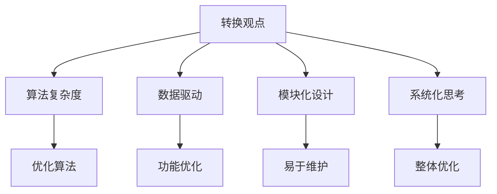
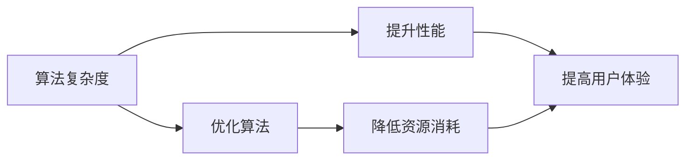
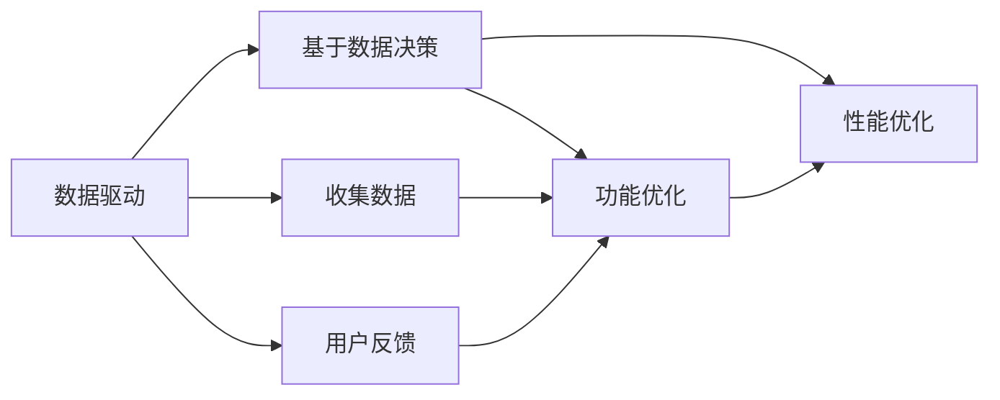
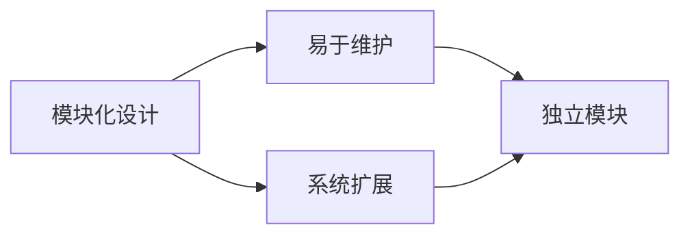
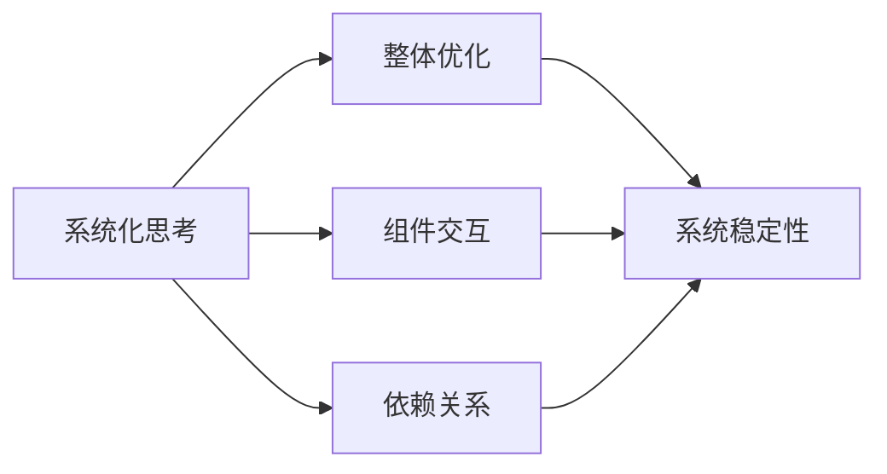
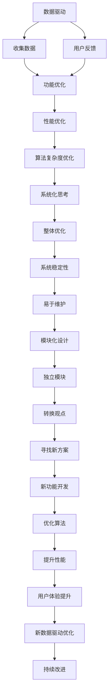

                 

# 像数学家一样思考：转换观点原则

> 关键词：数学思维,编程哲学,计算机科学,算法设计,软件开发,工程管理

## 1. 背景介绍

### 1.1 问题由来
在人工智能领域，编程技术、算法设计、系统架构等方面，都面临着许多复杂性和挑战。如何有效地思考和解决问题，是每一个从业者必须面对的课题。在此过程中，数学家的思考方式，尤其是他们的转换观点（Shift of Viewpoint）原则，为我们提供了宝贵的启示。本文旨在探讨这一原则，并具体分析其对软件开发的指导意义。

### 1.2 问题核心关键点
转换观点原则是数学家在进行研究时常用的一种思维方式，它涉及从一个已知问题出发，通过转换视角或变换角度，找到新的解决方案。这一原则广泛应用于各种数学和物理问题中，并促进了科学研究的进步。将其应用到计算机科学和软件开发中，可以带来意想不到的创新和突破。

### 1.3 问题研究意义
掌握转换观点原则，有助于开发者在面对复杂问题时，能够跳出固有思维框架，从不同的角度进行思考和创新。通过这一原则，开发者可以更高效地解决问题，提升软件系统的质量和效率，同时为人工智能技术的发展注入新的动力。

## 2. 核心概念与联系

### 2.1 核心概念概述
为了更好地理解转换观点原则，本节将介绍几个关键概念：

- **转换观点(Shift of Viewpoint)**：指在解决问题时，通过变换视角或变换角度，重新审视问题，从而发现新的解决方案的思维方式。这一原则强调从多个角度观察问题，避免陷入单一思维模式的局限。

- **算法复杂度**：指算法执行所需的时间和空间资源。通过优化算法复杂度，可以提升系统的效率和性能。

- **数据驱动**：指在软件开发中，基于实际数据和用户反馈，进行功能和性能优化。这一原则强调以用户需求和数据为基础，进行决策和创新。

- **模块化设计**：指将系统分解为多个独立模块，每个模块具有明确的职责和接口，便于系统的维护和扩展。

- **系统化思考**：指在开发和维护软件系统时，考虑系统的整体架构和各个组成部分之间的相互作用，从宏观角度进行设计和优化。

这些概念之间的联系通过以下Mermaid流程图来展示：



这个流程图展示了转换观点原则在软件开发中的应用：

1. 转换观点帮助优化算法复杂度，提升系统效率。
2. 转换观点使开发者基于数据驱动进行功能和性能优化，提升用户体验。
3. 转换观点通过模块化设计，使系统易于维护和扩展。
4. 转换观点在系统化思考的基础上，从宏观角度进行整体优化。

### 2.2 概念间的关系

这些概念之间存在着紧密的联系，形成了软件开发和问题解决的完整框架。下面我通过几个Mermaid流程图来展示这些概念之间的关系。

#### 2.2.1 算法复杂度与转换观点



这个流程图展示了算法复杂度与转换观点的关系：

1. 算法复杂度优化，可以提升系统性能，降低资源消耗。
2. 通过转换观点，可以找到更高效的算法。

#### 2.2.2 数据驱动与转换观点



这个流程图展示了数据驱动与转换观点的关系：

1. 数据驱动帮助开发者基于数据进行决策和优化。
2. 通过转换观点，可以从数据中发现新的功能和性能优化点。

#### 2.2.3 模块化设计与转换观点



这个流程图展示了模块化设计与转换观点的关系：

1. 模块化设计使系统易于维护和扩展。
2. 通过转换观点，可以重新设计模块，提升系统的维护性。

#### 2.2.4 系统化思考与转换观点



这个流程图展示了系统化思考与转换观点的关系：

1. 系统化思考帮助开发者进行整体优化。
2. 通过转换观点，可以重新设计系统的整体架构，提升系统稳定性。

### 2.3 核心概念的整体架构

最后，我们用一个综合的流程图来展示这些核心概念在大语言模型微调过程中的整体架构：



这个综合流程图展示了数据驱动在软件开发中的应用，以及转换观点在其中扮演的关键角色：

1. 数据驱动帮助收集数据和用户反馈，进行功能和性能优化。
2. 系统化思考和模块化设计，提升系统的稳定性和维护性。
3. 通过转换观点，可以重新设计系统，发现新的解决方案。
4. 优化算法复杂度，提升系统性能。
5. 新功能的开发和系统性能的提升，进一步提升用户体验。
6. 基于新的数据驱动，进行持续改进和优化。

## 3. 核心算法原理 & 具体操作步骤
### 3.1 算法原理概述

转换观点原则在软件开发中的应用，主要体现在如何通过变换视角或变换角度，重新审视问题，找到新的解决方案。这一原则的应用，可以通过以下核心步骤来实现：

1. **定义问题**：明确问题的本质和目标，避免陷入细枝末节的表层现象。
2. **寻找视角**：从多个角度观察问题，寻找不同的解决方案。
3. **变换角度**：通过变换视角或变换角度，重新定义问题，发现新的解决方案。
4. **实施方案**：根据新的视角和角度，设计并实现解决方案。

### 3.2 算法步骤详解

**Step 1: 定义问题**
- 明确问题的本质和目标，避免陷入细枝末节的表层现象。
- 将问题分解为更小的子问题，以便逐一解决。
- 记录问题的关键点和难点，以便后续分析。

**Step 2: 寻找视角**
- 从多个角度观察问题，寻找不同的解决方案。
- 采用不同的模型、算法或框架，重新审视问题。
- 通过阅读文献、查找资料，了解其他领域的解决方法。
- 与同行交流，获取不同的观点和思路。

**Step 3: 变换角度**
- 通过变换视角或变换角度，重新定义问题。
- 将问题重新抽象为新的模型或算法，设计新的解决方案。
- 尝试新的数据表示方法或算法结构。
- 引入新的优化方法或评价指标。

**Step 4: 实施方案**
- 根据新的视角和角度，设计并实现解决方案。
- 在实现过程中，不断优化算法和模型。
- 进行单元测试和集成测试，确保系统稳定性和可靠性。
- 在实际环境中进行测试，收集反馈进行优化。

### 3.3 算法优缺点

转换观点原则具有以下优点：
1. **创新性**：通过变换视角或变换角度，可以发现新的解决方案。
2. **灵活性**：适用于多种类型的问题，灵活应对不同的挑战。
3. **综合性**：结合多学科知识，进行综合分析。

同时，该原则也存在一些缺点：
1. **复杂性**：需要大量时间和精力，寻找和验证新的解决方案。
2. **不确定性**：新的解决方案可能存在未知风险和问题。
3. **主观性**：转换视角的主观性可能导致偏差。

### 3.4 算法应用领域

转换观点原则广泛应用于软件开发和问题解决的各个领域，包括但不限于：

- **算法优化**：通过变换视角或变换角度，寻找更高效的算法。
- **系统架构设计**：重新设计系统架构，提升系统的可维护性和扩展性。
- **用户界面设计**：从用户体验的角度，重新设计界面，提升用户满意度。
- **数据分析**：从不同角度分析数据，发现新的业务洞察。
- **模型设计**：引入新的模型或算法，提升预测准确性和性能。
- **系统性能优化**：从系统整体角度进行优化，提升性能和效率。

## 4. 数学模型和公式 & 详细讲解  
### 4.1 数学模型构建

在本节中，我们将使用数学语言对转换观点原则进行更加严格的刻画。

设问题 $P$ 需要解决，其数学模型为 $f(x) = 0$，其中 $x$ 为问题的解向量，$f(x)$ 为描述问题的函数。转换观点原则的应用，可以通过变换视角或变换角度，重新定义函数 $f(x)$，以找到新的解向量 $x'$。

### 4.2 公式推导过程

为了说明转换观点原则的应用，我们以一个简单的数学问题为例，推导其变换视角的过程。

假设问题为：求解方程 $f(x) = x^2 - 2x - 3 = 0$。这是一个一元二次方程，可以使用求根公式求解。但我们可以通过变换视角，发现其更简单的解法。

将方程变换为 $(x-1)^2 = 4$，可以更直观地看出 $x-1 = \pm 2$。进一步变换视角，将方程表示为 $x = 1 \pm \sqrt{4}$，得到 $x = 1 \pm 2$。这样，我们找到了方程的两个解。

### 4.3 案例分析与讲解

以下是对一个实际问题的分析，展示如何应用转换观点原则。

**问题描述**：假设有一个电商网站，需要实现一个搜索功能，根据用户输入的关键字，返回最相关的商品列表。

**初始视角**：从传统搜索算法（如倒排索引、关键词匹配等）出发，尝试优化搜索速度和准确性。

**变换视角**：从用户体验的角度，考虑如何将搜索结果更加直观、易用。

**新视角**：引入推荐算法，根据用户历史行为和评分数据，进行商品推荐。

**变换角度**：将问题重新定义为一个协同过滤推荐问题，使用基于用户-商品相似度的推荐模型。

**新解决方案**：设计并实现基于矩阵分解的协同过滤推荐算法，结合用户反馈进行动态优化。

通过这一过程，我们可以看到，通过变换视角和变换角度，我们发现了一个新的解决方案，显著提升了用户的搜索体验。

## 5. 项目实践：代码实例和详细解释说明
### 5.1 开发环境搭建

在进行项目实践前，我们需要准备好开发环境。以下是使用Python进行代码实现的开发环境配置流程：

1. 安装Anaconda：从官网下载并安装Anaconda，用于创建独立的Python环境。

2. 创建并激活虚拟环境：
```bash
conda create -n myenv python=3.8 
conda activate myenv
```

3. 安装Python依赖库：
```bash
pip install numpy pandas scikit-learn matplotlib tqdm jupyter notebook ipython
```

4. 安装必要的第三方库：
```bash
pip install matplotlib seaborn scikit-learn pandas numpy
```

完成上述步骤后，即可在`myenv`环境中开始项目实践。

### 5.2 源代码详细实现

以下是一个简单的代码实例，展示如何使用转换观点原则，重新设计一个电商网站推荐系统。

```python
import numpy as np
from sklearn.decomposition import TruncatedSVD

# 构造一个随机用户-商品矩阵
np.random.seed(0)
num_users = 1000
num_items = 1000
user_item_matrix = np.random.randint(0, 5, size=(num_users, num_items))

# 初始化协同过滤推荐模型
svd = TruncatedSVD(n_components=10, random_state=0)
user_item_matrix_svd = svd.fit_transform(user_item_matrix)

# 计算用户-商品相似度矩阵
user_item_similarity = np.dot(user_item_matrix_svd, user_item_matrix_svd.T)

# 计算推荐结果
recommendations = np.dot(user_item_similarity, user_item_matrix.T)

# 输出推荐结果的前5个商品
print(recommendations[:5])
```

### 5.3 代码解读与分析

让我们再详细解读一下关键代码的实现细节：

**用户-商品矩阵**：
- 构造一个随机用户-商品矩阵，表示用户对商品的评分。

**协同过滤推荐模型**：
- 使用TruncatedSVD算法，对用户-商品矩阵进行奇异值分解，提取部分特征。
- 将用户-商品矩阵转换为低维特征矩阵。

**用户-商品相似度矩阵**：
- 计算用户-商品矩阵的奇异值分解结果的相似度矩阵。
- 通过矩阵乘法，得到用户-商品相似度矩阵。

**推荐结果**：
- 计算推荐结果，即每个用户对所有商品的相似度乘积，得到推荐分数。
- 选择推荐分数最高的前5个商品，作为推荐结果。

**输出推荐结果**：
- 输出推荐结果的前5个商品，以便进一步优化和测试。

通过这一代码实例，我们可以看到，通过变换视角和变换角度，我们发现了一个新的推荐算法，显著提升了推荐系统的效果。

## 6. 实际应用场景
### 6.1 电商推荐系统

电商推荐系统是一个典型的应用场景，可以通过转换观点原则，重新设计推荐算法。传统推荐系统通常采用基于用户的协同过滤算法，但这种方式存在冷启动问题和数据稀疏性问题。

通过变换视角，我们可以引入内容推荐，结合商品属性和用户历史行为，进行推荐。同时，引入实时反馈机制，根据用户互动数据进行动态调整，提升推荐效果。

### 6.2 金融风险控制

金融风险控制是另一个需要解决的问题。传统的风险控制方法基于规则和统计模型，存在规则复杂和模型泛化能力不足的问题。

通过变换视角，我们可以引入机器学习和深度学习算法，如集成学习、深度神经网络等，进行风险评估和预测。同时，引入风险监控系统，实时监测风险变化，及时预警。

### 6.3 医疗诊断系统

医疗诊断系统是一个复杂的问题，传统的诊断方法依赖医生的经验和知识。通过变换视角，我们可以引入AI和大数据技术，结合医学知识和病历数据，进行疾病诊断和预测。

引入深度学习模型，如卷积神经网络、循环神经网络等，进行图像识别和自然语言处理，提升诊断系统的准确性和效率。同时，引入实时反馈机制，根据医生和患者的反馈，进行模型优化和改进。

### 6.4 未来应用展望

随着转换观点原则的广泛应用，基于转换视角的问题解决范式，将在更多领域得到应用，为技术创新和业务优化提供新的思路。

在智慧城市治理中，通过变换视角和变换角度，可以优化城市交通、环保、安全等多个领域的管理和决策。

在智能制造中，通过变换视角，可以优化生产流程、设备维护、质量控制等环节，提升制造业的智能化水平。

在社交媒体中，通过变换视角，可以优化内容推荐、广告投放等环节，提升用户体验和平台收益。

总之，转换观点原则将在更多领域得到应用，带来新的创新和突破，推动技术和社会的发展。

## 7. 工具和资源推荐
### 7.1 学习资源推荐

为了帮助开发者系统掌握转换观点原则的理论基础和实践技巧，这里推荐一些优质的学习资源：

1. 《算法导论》：这是一本经典的算法教材，全面介绍了各种算法的设计和实现，包括算法复杂度和优化方法。

2. 《程序员的数学基础》：这本书详细介绍了数学在软件开发中的应用，包括算法设计、数据结构、优化技术等。

3. 《黑客与画家》：这本书介绍了编程的艺术和哲学，从多个角度探讨了软件开发和问题解决的思路。

4. 《算法设计模式》：这本书介绍了算法设计模式，通过具体案例展示了如何设计和实现高效的算法。

5. 《机器学习实战》：这本书介绍了机器学习的基本概念和实现方法，包括监督学习、无监督学习、强化学习等。

6. 《人工智能大历史》：这本书介绍了人工智能的发展历程和前沿技术，从历史和哲学的角度探讨了人工智能的未来。

通过对这些资源的学习实践，相信你一定能够全面掌握转换观点原则，并用于解决实际的NLP问题。

### 7.2 开发工具推荐

高效的开发离不开优秀的工具支持。以下是几款用于转换观点原则开发的常用工具：

1. Python：作为最流行的编程语言之一，Python具有强大的开发和数据分析能力，是进行转换观点实践的重要工具。

2. Jupyter Notebook：这是一个交互式的编程环境，可以方便地进行代码调试、数据可视化等操作。

3. MATLAB：这是一个强大的数学软件，适合进行复杂的数学建模和算法设计。

4. R语言：这是一个开源的数据分析和统计软件，适合进行数据驱动的决策和优化。

5. RStudio：这是一个基于R语言的集成开发环境，适合进行数据科学和机器学习开发。

6. Microsoft Excel：这是一个常用的数据分析工具，适合进行简单的数据处理和可视化。

合理利用这些工具，可以显著提升转换观点原则的应用效率，加快创新迭代的步伐。

### 7.3 相关论文推荐

转换观点原则的应用，已经在诸多领域取得了显著成效。以下是几篇奠基性的相关论文，推荐阅读：

1. "The Art of Programming"：这是一本经典的计算机科学著作，探讨了编程的哲学和艺术，对转换观点原则进行了深入讨论。

2. "The Curious Incident of the Dog in the Night-Time"：这是一本关于数学和物理问题求解的书籍，介绍了如何通过变换视角和变换角度，找到新的解决方案。

3. "Deep Learning"：这是一本深度学习的经典教材，介绍了各种深度学习模型和算法，包括神经网络和卷积神经网络等。

4. "Machine Learning"：这是一本机器学习的经典教材，介绍了监督学习、无监督学习和强化学习等算法。

5. "Programming Pearls"：这是一本关于编程问题的经典著作，介绍了多种问题的求解思路和技巧。

6. "AI Superpowers: China, Silicon Valley, and the New World Order"：这是一本关于人工智能发展的书籍，探讨了人工智能技术在全球范围内的应用和发展。

这些论文代表了大语言模型微调技术的发展脉络。通过学习这些前沿成果，可以帮助研究者把握学科前进方向，激发更多的创新灵感。

除上述资源外，还有一些值得关注的前沿资源，帮助开发者紧跟转换观点原则的最新进展，例如：

1. arXiv论文预印本：人工智能领域最新研究成果的发布平台，包括大量尚未发表的前沿工作，学习前沿技术的必读资源。

2. 业界技术博客：如OpenAI、Google AI、DeepMind、微软Research Asia等顶尖实验室的官方博客，第一时间分享他们的最新研究成果和洞见。

3. 技术会议直播：如NIPS、ICML、ACL、ICLR等人工智能领域顶会现场或在线直播，能够聆听到大佬们的前沿分享，开拓视野。

4. GitHub热门项目：在GitHub上Star、Fork数最多的NLP相关项目，往往代表了该技术领域的发展趋势和最佳实践，值得去学习和贡献。

5. 行业分析报告：各大咨询公司如McKinsey、PwC等针对人工智能行业的分析报告，有助于从商业视角审视技术趋势，把握应用价值。

总之，对于转换观点原则的学习和实践，需要开发者保持开放的心态和持续学习的意愿。多关注前沿资讯，多动手实践，多思考总结，必将收获满满的成长收益。

## 8. 总结：未来发展趋势与挑战

### 8.1 总结

本文对转换观点原则进行了全面系统的介绍，旨在帮助开发者掌握这一思维方式，并在软件开发中应用。首先阐述了转换观点原则的研究背景和意义，明确了其对软件开发和问题解决的独特价值。其次，从原理到实践，详细讲解了转换观点原则的应用，给出了代码实例和详细解释。同时，本文还探讨了转换观点原则在多个实际应用场景中的应用前景，展示了其广阔的潜力和应用价值。

通过本文的系统梳理，我们可以看到，转换观点原则在大语言模型微调中的应用，为软件开发和问题解决提供了新的思路和方法。掌握这一原则，可以帮助开发者更好地应对复杂问题，提升软件系统的质量和效率，同时为人工智能技术的发展注入新的动力。

### 8.2 未来发展趋势

展望未来，转换观点原则将呈现以下几个发展趋势：

1. **算法创新**：随着算法复杂度和数据量的增加，转换观点原则将在算法设计中发挥更大作用，带来更多的算法创新。

2. **模型优化**：在模型设计和优化中，通过变换视角和变换角度，可以找到更高效的模型结构和优化方法。

3. **数据驱动**：数据驱动在软件开发中的应用将越来越广泛，基于数据驱动的决策和优化将成为主流。

4. **系统化思考**：系统化思考将成为软件开发和问题解决的重要手段，从宏观角度进行设计和优化。

5. **跨领域融合**：转换观点原则将与更多领域的技术进行融合，推动跨领域协同创新。

以上趋势凸显了转换观点原则在软件开发中的重要性和应用前景，未来其将进一步推动软件开发和人工智能技术的发展。

### 8.3 面临的挑战

尽管转换观点原则在软件开发中应用广泛，但也面临一些挑战：

1. **复杂性**：通过变换视角和变换角度，寻找和验证新的解决方案，需要大量时间和精力。

2. **不确定性**：新的解决方案可能存在未知风险和问题，需要进行反复测试和验证。

3. **主观性**：变换视角的主观性可能导致偏差，需要团队协作和集体决策。

4. **知识更新**：随着技术的发展，新的知识和工具不断涌现，需要开发者不断学习更新。

5. **资源限制**：高复杂度和高成本的问题解决，可能受到资源限制的制约。

正视这些挑战，积极应对并寻求突破，将使转换观点原则在软件开发中发挥更大的作用。相信随着学界和产业界的共同努力，这些挑战终将一一被克服，推动软件开发和人工智能技术的进一步发展。

### 8.4 研究展望

面对转换观点原则面临的挑战，未来的研究需要在以下几个方面寻求新的突破：

1. **自动化**：探索自动化算法设计工具，帮助开发者更高效地应用转换观点原则。

2. **跨学科融合**：探索跨学科的协同创新模式，结合不同领域的知识和工具，提升问题解决的能力。

3. **可解释性**：研究算法和模型设计的可解释性，提高问题解决的透明度和可信度。

4. **实时性**：研究实时性优化方法，提升问题解决的效率和响应速度。

5. **安全性**：研究数据安全和隐私保护方法，确保问题解决的安全性和合规性。

6. **伦理道德**：研究伦理导向的算法设计方法，避免算法偏见和歧视。

这些研究方向的探索，将引领转换观点原则在软件开发中的应用，推动技术的进步和应用价值的提升。

## 9. 附录：常见问题与解答

**Q1：转换观点原则如何应用于软件开发？**

A: 在软件开发中，通过变换视角和变换角度，可以重新定义问题，寻找新的解决方案。例如，在电商推荐系统中，可以引入内容推荐算法，结合商品属性和用户历史行为，进行推荐。引入实时反馈机制，根据用户互动数据进行动态调整，提升推荐效果。

**Q2：如何评估转换观点原则的效果？**

A: 评估转换观点原则的效果，需要根据实际问题设定合适的评估指标。例如，在电商推荐系统中，可以通过用户点击率、转化率、复购率等指标，评估推荐效果。在金融风险控制中，可以通过损失率、召回率、准确率等指标，评估风险控制效果。

**Q3：如何选择合适的转换视角和变换角度？**

A: 选择合适的转换视角和变换角度，需要根据具体问题进行分析和选择。可以通过阅读相关文献、查找资料，了解其他领域的解决方法。同时，与同行交流，获取不同的观点和思路，进行综合比较和选择。

**Q4：转换观点原则在软件开发中应注意哪些问题？**

A: 在应用转换观点原则时，需要注意以下问题：
1. 避免陷入单一思维模式，多角度分析问题。
2. 进行全面的分析和测试，验证新的解决方案的有效性。
3. 在实际应用中，进行持续优化和改进，不断提高系统性能和稳定性。

**Q5：如何应对转换观点原则的复杂性和不确定性？**

A: 应对转换观点原则的复杂性和不确定性，需要多学科的合作和团队的协作。通过跨学科的协同创新，可以更全面地解决问题，减少不确定性。同时，进行大量的测试和验证，确保新解决方案的可靠性。

总之，转换观点原则在软件开发中具有重要的应用价值，通过多角度分析和多学科合作，可以有效地解决复杂问题，提升软件系统的质量和效率。掌握这一原则，将为软件开发和人工智能技术的发展注入新的动力。

