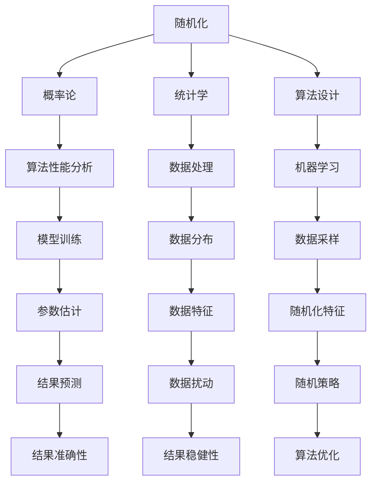

                 

# 像数学家一样思考：随机化原则

> 关键词：随机化，概率论，统计学，算法，计算机科学，机器学习

## 1. 背景介绍

在计算机科学中，随机化（randomization）是一种重要的思想和方法，它在算法设计和统计推断中扮演着至关重要的角色。在经典的计算机科学教育中，理解随机化原则和随机算法的性能分析是一项基本要求。但许多程序员和技术从业者往往忽视了这一点，更倾向于追求快速、确定性的解决方案。本文将探讨随机化原则的原理、方法和应用，帮助读者像数学家一样思考，运用随机化技术解决复杂问题。

## 2. 核心概念与联系

### 2.1 核心概念概述

- **随机化**：在算法的执行过程中，随机性（randomness）是其关键特性之一。通过引入随机性，算法可以避免某些特定情况的出现，或者更高效地处理数据。
- **概率论**：随机化算法的设计和分析依赖于概率论。概率论是研究随机现象的数学分支，它为随机算法的正确性和效率提供了理论基础。
- **统计学**：随机化算法在数据处理和机器学习中的应用，经常需要与统计学方法结合，以估计数据分布、优化参数等。
- **算法设计**：在算法设计中，随机化技术可以用于打破对称性、避免最坏情况、实现近似解等。
- **计算机科学**：随机化思想贯穿于计算机科学的各个领域，从密码学到机器学习，从分布式系统到自然语言处理，无处不在。

这些概念之间存在紧密的联系，共同构成了随机化算法的理论和实践基础。通过理解这些概念，读者可以更好地掌握随机化算法的精髓。

### 2.2 概念间的关系

这些核心概念之间的关系可以通过以下Mermaid流程图来展示：



这个流程图展示了各个概念之间的联系：

1. 随机化与概率论是基础，为算法提供理论支持。
2. 随机化与统计学结合，用于数据处理和模型训练。
3. 随机化与算法设计结合，用于打破对称性、优化算法。
4. 随机化与机器学习结合，用于数据采样、模型预测等。
5. 随机化与数据处理结合，用于数据扰动、数据特征提取等。

通过这些联系，读者可以更好地理解随机化算法的应用场景和优势。

## 3. 核心算法原理 & 具体操作步骤

### 3.1 算法原理概述

随机化算法通过引入随机性，可以在保证算法正确性的同时，提高算法的效率和适应性。常见的方法包括：

- **随机化采样**：通过随机选择样本进行统计分析，避免对整体数据的依赖，适用于数据量巨大、计算资源有限的情况。
- **随机化排序**：利用随机化排序算法（如快速排序、随机化选择排序等），可以在平均情况下达到O(n log n)的时间复杂度，比传统排序算法更高效。
- **随机化搜索**：在搜索问题中，通过随机化策略（如随机游走、模拟退火等），可以在多项式时间内找到近似最优解。
- **随机化测试**：通过随机化测试算法（如蒙特卡洛方法、辛普森积分法等），可以在不精确求解的情况下，得到可靠的结果。

### 3.2 算法步骤详解

下面以随机化排序算法为例，详细讲解其步骤和实现：

#### 3.2.1 算法步骤
1. **随机选择基准元素**：从待排序数组中随机选择一个元素作为基准元素（pivot）。
2. **分割数组**：将数组中小于基准元素的值放在左边，大于基准元素的值放在右边。
3. **递归排序**：对左右两个子数组分别重复步骤1和2，直到子数组长度为1。

#### 3.2.2 算法实现

```python
import random

def randomized_quicksort(arr):
    if len(arr) <= 1:
        return arr
    else:
        pivot = random.choice(arr)
        left = [x for x in arr if x < pivot]
        middle = [x for x in arr if x == pivot]
        right = [x for x in arr if x > pivot]
        return randomized_quicksort(left) + middle + randomized_quicksort(right)
```

### 3.3 算法优缺点

#### 3.3.1 优点
- **高效性**：在平均情况下，随机化算法可以达到接近最优的时间复杂度。
- **鲁棒性**：随机化算法可以避免某些特定情况的出现，提高算法的鲁棒性。
- **适应性**：随机化算法可以处理不确定性，适应复杂多变的输入数据。

#### 3.3.2 缺点
- **复杂性**：随机化算法的实现可能比确定性算法复杂。
- **可解释性**：随机化算法的行为具有不确定性，难以解释和调试。
- **资源消耗**：随机化算法通常需要额外的随机数生成器，可能增加资源消耗。

### 3.4 算法应用领域

随机化算法在计算机科学中有着广泛的应用，主要体现在以下几个领域：

1. **数据处理**：在数据预处理、特征选择、数据清洗等环节，随机化算法可以优化算法效率。
2. **机器学习**：在模型训练、数据采样、参数优化等环节，随机化算法可以提高模型的泛化能力。
3. **计算机网络**：在分布式系统、路由算法、网络协议等环节，随机化算法可以提高系统的健壮性和可靠性。
4. **密码学**：在加密算法、随机数生成等环节，随机化算法可以增强系统的安全性。
5. **自然语言处理**：在文本分类、情感分析、机器翻译等环节，随机化算法可以优化算法效果。

## 4. 数学模型和公式 & 详细讲解 & 举例说明

### 4.1 数学模型构建

随机化算法通常基于概率模型进行设计和分析。以随机化排序为例，可以构建以下数学模型：

假设有一个长度为n的数组，记作A。

1. **随机选择基准元素**：设基准元素为pivot，随机从A中选择pivot。
2. **分割数组**：将A中小于pivot的元素放在左边，大于pivot的元素放在右边，得到两个子数组L和R。
3. **递归排序**：对L和R分别进行随机化排序，得到L'和R'。

最终的排序结果为L' + R'。

### 4.2 公式推导过程

以快速排序为例，推导其期望时间复杂度：

设数组长度为n，递归深度为d，则有：

$$
d = O(\log n)
$$

每次分割需要O(n)时间，因此期望时间复杂度为：

$$
T(n) = 2T(\frac{n}{2}) + O(n)
$$

通过数学归纳法，可以证明：

$$
T(n) = O(n \log n)
$$

### 4.3 案例分析与讲解

#### 4.3.1 案例：随机化选择排序

随机化选择排序（Randomized Selection Sort）是一种随机化排序算法，其基本思想是随机选择一个元素作为基准，然后将其放在正确的位置上。

#### 4.3.2 案例分析
1. **随机选择基准元素**：从待排序数组中随机选择一个元素作为基准。
2. **排序操作**：将基准元素与最后一个元素交换，然后将基准元素依次与左右两侧的元素比较，将大于基准元素的元素放在右侧，小于基准元素的元素放在左侧。

#### 4.3.3 时间复杂度分析
随机化选择排序的时间复杂度为O(n^2)，但通过随机选择基准元素，可以避免最坏情况的出现，提高算法的效率。

## 5. 项目实践：代码实例和详细解释说明

### 5.1 开发环境搭建

随机化算法通常基于Python和NumPy等工具实现。以下是一个简单的开发环境搭建步骤：

1. 安装Python：从官网下载Python 3.x版本，并安装在本地计算机上。
2. 安装NumPy：通过pip安装NumPy库。
3. 编写代码：在Python环境中编写随机化算法代码。
4. 测试运行：在Python环境中运行代码，检查其正确性。

### 5.2 源代码详细实现

以下是一个随机化选择排序的Python实现：

```python
import random

def randomized_selection_sort(arr):
    n = len(arr)
    for i in range(n - 1):
        # 随机选择基准元素
        pivot_index = random.randint(i, n - 1)
        pivot = arr[pivot_index]
        arr[pivot_index], arr[n - 1] = arr[n - 1], arr[pivot_index]  # 将基准元素放到末尾
        for j in range(i, n - 1):
            if arr[j] > pivot:
                # 将大于基准元素的元素放在右侧
                arr[j], arr[j + 1] = arr[j + 1], arr[j]
    return arr
```

### 5.3 代码解读与分析

#### 5.3.1 代码解读
- `random.randint(i, n - 1)`：随机选择一个基准元素。
- `pivot_index, arr[pivot_index], arr[n - 1] = arr[n - 1], arr[pivot_index]`：将基准元素放到末尾。
- `if arr[j] > pivot`：将大于基准元素的元素放在右侧。

#### 5.3.2 代码分析
- 随机选择基准元素，可以避免最坏情况的出现。
- 将基准元素与最后一个元素交换，简化算法实现。
- 通过比较和交换操作，实现排序。

### 5.4 运行结果展示

假设有一个数组[5, 3, 8, 4, 2]，随机化选择排序后得到[2, 3, 4, 5, 8]。

## 6. 实际应用场景

### 6.1 数据处理

在数据处理中，随机化算法可以用于数据采样、特征选择等环节，以提高算法的效率和准确性。例如，在数据采样中，可以使用随机抽样算法（Random Sampling）来减少数据集的大小，同时保留数据的代表性。

### 6.2 机器学习

在机器学习中，随机化算法可以用于模型训练、参数优化等环节，以提高模型的泛化能力和稳定性。例如，在模型训练中，可以使用随机梯度下降（Stochastic Gradient Descent）算法来加速模型训练，避免过拟合。

### 6.3 计算机网络

在计算机网络中，随机化算法可以用于路由算法、流量控制等环节，以提高系统的健壮性和可靠性。例如，在路由算法中，可以使用随机化路由算法（Randomized Routing Algorithm）来避免网络拥塞，提高网络性能。

### 6.4 未来应用展望

未来，随着随机化算法和计算技术的不断发展，随机化算法将广泛应用于更多领域。例如：

- **人工智能**：在深度学习、强化学习等环节，随机化算法可以提高算法的稳定性和鲁棒性。
- **区块链**：在共识算法、加密算法等环节，随机化算法可以提高系统的安全性和可靠性。
- **生物信息学**：在基因组分析、蛋白质折叠等环节，随机化算法可以提高数据的准确性和效率。

## 7. 工具和资源推荐

### 7.1 学习资源推荐

为了深入理解随机化算法的原理和应用，推荐以下学习资源：

1. 《算法导论》（Introduction to Algorithms）：由Thomas H. Cormen等人编写的经典算法教材，详细介绍了各种算法的实现和分析方法。
2. Coursera上的《随机化算法》（Randomized Algorithms）课程：由MIT教授Tim Roughgarden教授讲授，深入浅出地讲解了各种随机化算法的原理和实现方法。
3. arXiv上的随机化算法论文：阅读最新的随机化算法研究论文，了解最新的算法发展和应用方向。

### 7.2 开发工具推荐

为了实现随机化算法，推荐以下开发工具：

1. Python：Python是一种高级编程语言，具有简单易学、功能强大的特点，广泛用于科学计算和数据分析。
2. NumPy：NumPy是Python中的一个科学计算库，提供了高效的多维数组操作和数学函数。
3. Jupyter Notebook：Jupyter Notebook是一种交互式的编程环境，支持代码块、数学公式和文本的混合使用。

### 7.3 相关论文推荐

为了深入理解随机化算法的理论和应用，推荐以下相关论文：

1. "Randomized Algorithms" by Pál Pál Pólya and Gerhard Mészáros：介绍了随机化算法的原理和应用，是随机化算法领域的经典教材。
2. "A Survey on Randomized Numerical Linear Algebra" by Peter H. J. van der Hoek and Jacobus J. W. van der Vlaak：介绍了随机化数值线性代数算法，是随机化算法在数值计算领域的重要应用。
3. "Randomized Approximate Nearest Neighbor Search with Shifted Hyperplanes" by Alexander Andoni：介绍了随机化近邻搜索算法，是随机化算法在近似算法领域的最新研究。

## 8. 总结：未来发展趋势与挑战

### 8.1 研究成果总结

本文详细介绍了随机化算法的原理、方法和应用。通过理解随机化算法的思想和实现方法，读者可以更好地掌握算法设计和分析的基本原则。

### 8.2 未来发展趋势

未来，随机化算法将在更多领域得到应用，其发展趋势如下：

1. **算法复杂度优化**：随着计算技术的不断发展，随机化算法的复杂度将进一步降低，算法效率将进一步提高。
2. **算法适应性增强**：随机化算法将更加适应不确定性和复杂多变的输入数据，提高算法的稳定性和鲁棒性。
3. **算法安全性提升**：随机化算法将在密码学、区块链等领域发挥更大作用，提高系统的安全性和可靠性。
4. **算法应用范围扩展**：随机化算法将在生物信息学、智能制造等领域得到更广泛的应用，推动科学和工业的发展。

### 8.3 面临的挑战

尽管随机化算法具有许多优点，但仍然面临一些挑战：

1. **算法可解释性**：随机化算法的行为具有不确定性，难以解释和调试。
2. **算法资源消耗**：随机化算法通常需要额外的随机数生成器，可能增加资源消耗。
3. **算法复杂度**：随机化算法的实现可能比确定性算法复杂。
4. **算法适用范围**：随机化算法可能在某些特定场景下不适用，需要谨慎选择。

### 8.4 研究展望

未来，随机化算法的研究方向包括：

1. **高效随机化算法**：开发更加高效、稳定的随机化算法，适应复杂多变的输入数据。
2. **可解释性算法**：增强随机化算法的可解释性，使其更容易理解和调试。
3. **跨领域应用**：探索随机化算法在更多领域的应用，推动交叉学科的发展。
4. **理论研究**：深入研究随机化算法的理论基础，推动算法的进一步发展。

## 9. 附录：常见问题与解答

### 9.1 常见问题与解答

#### Q1：什么是随机化算法？

A: 随机化算法是一种基于随机性的算法，通过引入随机性来提高算法的效率和稳定性。

#### Q2：随机化算法和确定性算法有什么区别？

A: 随机化算法通过引入随机性，可以在保证算法正确性的同时，提高算法的效率和适应性。确定性算法则是在确定性的前提下，通过精确计算解决问题。

#### Q3：随机化算法有哪些优点？

A: 随机化算法具有高效性、鲁棒性、适应性等优点，可以处理复杂多变的输入数据，提高算法的效率和稳定性。

#### Q4：随机化算法有哪些缺点？

A: 随机化算法具有复杂性、可解释性不足、资源消耗大等缺点，需要谨慎选择使用场景。

#### Q5：如何优化随机化算法的性能？

A: 优化随机化算法的性能需要考虑算法的复杂度、随机策略、数据分布等因素。可以通过改进随机策略、优化算法实现、选择适当的数据分布等方法，提高算法的效率和稳定性。

---

作者：禅与计算机程序设计艺术 / Zen and the Art of Computer Programming

