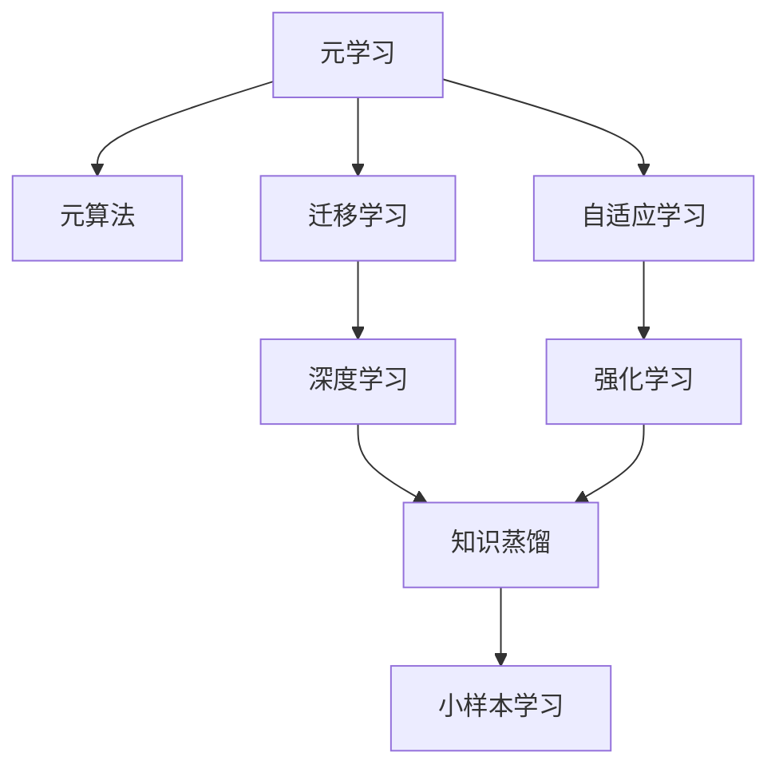
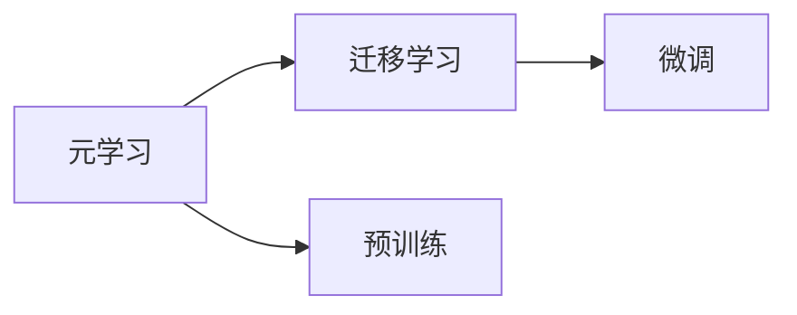
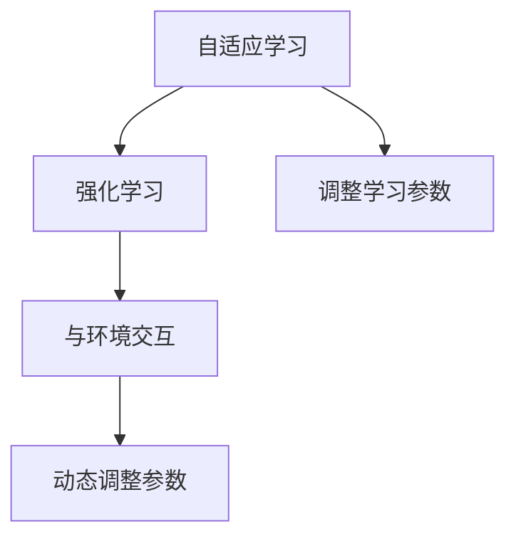
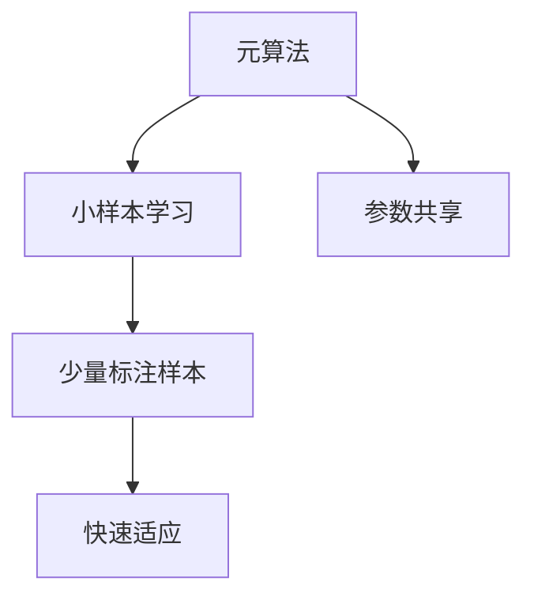
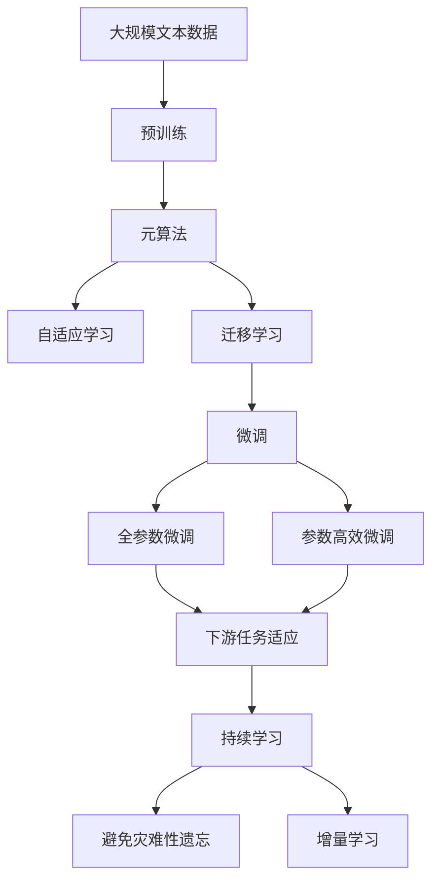

                 

# 元学习 (Meta Learning) 原理与代码实例讲解

> 关键词：元学习, 元算法, 自适应学习, 迁移学习, 强化学习, 知识蒸馏, 小样本学习

## 1. 背景介绍

### 1.1 问题由来
元学习（Meta Learning）是机器学习领域的一个重要研究方向，旨在通过学习如何学习，提升模型在新任务上的学习效率和性能。传统机器学习算法需要大量数据和复杂调参，难以应对数据分布变化的迁移学习问题。而元学习通过学习通用的学习策略，可以在新任务上快速收敛，显著提升模型泛化能力。

### 1.2 问题核心关键点
元学习的核心思想是：通过在多个相关任务上进行预训练，学习一种通用的学习策略，即元算法（Meta Algorithm），然后应用这种策略到新任务上，使得模型能够快速适应新数据，提升学习效率和性能。

元学习与传统的迁移学习有所不同：传统迁移学习更多关注预训练模型在新任务上的微调，而元学习则是在学习如何通过预训练模型进行有效的微调。元学习的目标是构建一个元算法，使得模型能够自动地、自适应地在新任务上学习。

### 1.3 问题研究意义
元学习的兴起，为机器学习带来了新的研究方向和方法，具有重要的理论意义和实际应用价值：

1. **提高学习效率**：通过学习通用的学习策略，元学习可以大幅减少新任务上的学习时间，提升模型训练速度。
2. **增强泛化能力**：元学习可以学习到更广泛的领域知识，提升模型在新任务上的泛化性能。
3. **适应数据分布变化**：元学习可以自适应地应对数据分布变化，提升模型在异构数据上的表现。
4. **减少人工干预**：元学习可以自动地选择合适的预训练模型和微调参数，减少人工干预。
5. **推动算法创新**：元学习的研究推动了算法、模型和理论的创新，推动机器学习技术的发展。

## 2. 核心概念与联系

### 2.1 核心概念概述

为更好地理解元学习的原理和应用，本节将介绍几个密切相关的核心概念：

- 元学习(Meta Learning)：指学习一种通用的学习策略，即元算法，用于快速适应新任务的学习方法。元学习通常涉及预训练、微调或学习如何微调等过程。

- 元算法(Meta Algorithm)：指用于学习新任务的学习策略，通常包括预训练、微调或学习如何微调等步骤。元算法可以根据具体任务进行设计。

- 自适应学习(Adaptive Learning)：指模型能够自适应地调整学习参数，适应不同的数据分布和学习任务。自适应学习是元学习的重要组成部分。

- 迁移学习(Transfer Learning)：指将一个领域学习到的知识，迁移应用到另一个不同但相关的领域的学习方法。元学习与迁移学习有密切联系，但元学习更注重学习如何学习。

- 强化学习(Reinforcement Learning, RL)：指通过与环境交互，根据奖励信号调整模型参数的学习方法。元学习中的自适应学习有时可以看作是强化学习的一种形式。

- 知识蒸馏(Knowledge Distillation)：指通过一个大型模型（称为"教师模型"）向一个较小模型（称为"学生模型"）转移知识的过程。元学习中可以通过知识蒸馏等方式，提高模型的泛化性能和迁移能力。

- 小样本学习(Few-shot Learning)：指在只有少量标注样本的情况下，模型能够快速适应新任务的学习方法。元学习中的自适应学习可以在小样本学习中发挥重要作用。

- 深度学习(Deep Learning)：指通过多层神经网络进行学习的机器学习方法。元学习中的自适应学习通常基于深度学习模型，尤其是神经网络。

这些核心概念之间的逻辑关系可以通过以下Mermaid流程图来展示：



这个流程图展示了几大核心概念之间的联系：

1. 元学习通过学习通用的学习策略，即元算法，来适应新任务。
2. 自适应学习是元学习的重要组成部分，通过调整模型参数来适应不同的数据分布和学习任务。
3. 迁移学习与元学习密切相关，都是通过利用已学习到的知识来提升新任务上的性能。
4. 强化学习是自适应学习的一种形式，通过与环境交互，动态调整模型参数。
5. 知识蒸馏是元学习中一种常用的技术，通过教师模型向学生模型转移知识。
6. 小样本学习是元学习的应用场景之一，通过少量标注样本进行快速适应。

### 2.2 概念间的关系

这些核心概念之间存在着紧密的联系，形成了元学习的完整生态系统。下面我们通过几个Mermaid流程图来展示这些概念之间的关系。

#### 2.2.1 元学习与迁移学习的关系



这个流程图展示了元学习与迁移学习的基本关系：

1. 元学习通过预训练和微调等过程，学习通用的学习策略。
2. 迁移学习将这种通用策略应用到新任务上，通过微调来提升模型性能。

#### 2.2.2 自适应学习与强化学习的关系



这个流程图展示了自适应学习与强化学习的基本关系：

1. 自适应学习通过调整学习参数来适应不同的数据分布和学习任务。
2. 强化学习通过与环境交互，动态调整模型参数，学习最优策略。

#### 2.2.3 元算法与小样本学习的关系



这个流程图展示了元算法与小样本学习的基本关系：

1. 元算法通过参数共享等方式，学习通用的学习策略。
2. 小样本学习利用这种通用策略，在少量标注样本上快速适应新任务。

### 2.3 核心概念的整体架构

最后，我们用一个综合的流程图来展示这些核心概念在大语言模型微调过程中的整体架构：



这个综合流程图展示了从预训练到微调，再到持续学习的完整过程：

1. 元学习通过在大规模文本数据上进行预训练，学习通用的语言表示。
2. 元算法通过调整模型参数，学习如何适应新任务。
3. 自适应学习利用通用策略，动态调整模型参数，适应不同的数据分布。
4. 迁移学习将通用策略应用到新任务上，通过微调来提升模型性能。
5. 微调可以通过全参数微调和参数高效微调两种方式进行，以适应不同的任务需求。
6. 下游任务适应将微调后的模型应用到具体任务上，提升任务性能。
7. 持续学习通过增量学习等方法，不断更新模型，保持性能稳定。

通过这些流程图，我们可以更清晰地理解元学习过程中各个核心概念的关系和作用，为后续深入讨论具体的元学习方法和技术奠定基础。

## 3. 核心算法原理 & 具体操作步骤
### 3.1 算法原理概述

元学习的核心思想是学习一种通用的学习策略，即元算法。通常，元算法包括以下步骤：

1. **预训练**：在大量的无标注数据上训练模型，学习通用的语言表示。
2. **微调**：在少量标注数据上微调模型，学习特定的任务知识。
3. **元算法优化**：通过训练元算法，优化学习策略，提升模型在新任务上的性能。

元学习的主要目标是学习一个元算法，使得模型能够在新的、未见过的任务上快速适应和收敛。具体来说，元学习算法通常包括以下几个关键步骤：

- **任务选择**：随机抽取一组任务，用于预训练和微调。
- **预训练**：在大规模无标注数据上训练模型，学习通用的语言表示。
- **微调**：在少量标注数据上微调模型，学习特定任务的知识。
- **元算法更新**：通过比较不同任务上的性能，更新元算法，以提升新任务上的泛化能力。

### 3.2 算法步骤详解

元学习的具体实现过程通常包括以下几个步骤：

**Step 1: 准备预训练数据和任务**
- 收集大规模无标注数据集，作为预训练数据。
- 设计多个相关任务，用于微调和元算法优化。

**Step 2: 预训练元模型**
- 在预训练数据上训练元模型，学习通用的语言表示。
- 元模型通常包括多个预训练任务，如自回归语言模型、掩码语言模型等。

**Step 3: 微调元模型**
- 在少量标注数据上微调元模型，学习特定任务的知识。
- 微调的目标通常是优化模型在新任务上的性能指标。

**Step 4: 元算法优化**
- 通过比较不同任务上的性能，更新元算法。
- 元算法通常包括学习率、正则化参数、批量大小等超参数的优化。

**Step 5: 应用元算法**
- 将优化后的元算法应用到新的、未见过的任务上。
- 在新任务上使用元算法进行预训练和微调，提升模型性能。

### 3.3 算法优缺点

元学习算法具有以下优点：
1. **泛化能力强**：通过学习通用的学习策略，元学习算法能够在多个相关任务上取得更好的泛化性能。
2. **适应性高**：元学习算法能够自适应地适应不同的数据分布和学习任务，减少人工干预。
3. **提升学习效率**：元学习算法通过学习如何学习，大大减少了新任务上的学习时间，提升模型训练速度。

同时，元学习算法也存在以下缺点：
1. **数据依赖性强**：元学习算法依赖于大规模预训练数据和多样化的任务数据，数据获取成本较高。
2. **计算开销大**：元学习算法需要在大规模数据上进行预训练和微调，计算开销较大。
3. **超参数敏感**：元学习算法的性能很大程度上依赖于超参数的选择，需要精心调参。
4. **可解释性差**：元学习算法的内部机制较难解释，难以调试和优化。

### 3.4 算法应用领域

元学习算法已经在多个领域得到了广泛应用，包括：

- **自然语言处理(NLP)**：元学习算法可以用于自动生成语言模型、情感分析、问答系统等。
- **计算机视觉(CV)**：元学习算法可以用于图像分类、目标检测、图像生成等。
- **语音识别(SR)**：元学习算法可以用于语音识别、语音合成、语音情感分析等。
- **推荐系统**：元学习算法可以用于推荐系统中的个性化推荐、用户行为预测等。
- **自动驾驶**：元学习算法可以用于自动驾驶中的物体检测、轨迹规划等。
- **机器人学**：元学习算法可以用于机器人控制、路径规划等。

除了这些领域，元学习算法还在其他领域中展现出了巨大的应用潜力，如医疗、金融、农业等。

## 4. 数学模型和公式 & 详细讲解  
### 4.1 数学模型构建

元学习算法的数学模型通常包括以下几个部分：

- **预训练模型**：在大规模无标注数据上训练的通用语言模型，通常包括自回归语言模型、掩码语言模型等。
- **元算法模型**：用于学习如何学习的元算法模型，通常包括元梯度、元损失等。
- **任务模型**：用于特定任务的微调模型，通常包括分类器、解码器等。

假设预训练模型为 $M_{\theta}$，其中 $\theta$ 为预训练得到的模型参数。设任务数为 $T$，每个任务 $t$ 的标注数据为 $D_t=\{(x_{ti}, y_{ti})\}_{i=1}^{N_t}$，其中 $x_{ti}$ 为输入，$y_{ti}$ 为标签。

定义预训练模型的损失函数为 $\mathcal{L}_{pretrain}$，元算法的损失函数为 $\mathcal{L}_{meta}$，任务模型的损失函数为 $\mathcal{L}_t$。

### 4.2 公式推导过程

以下我们以二分类任务为例，推导元学习算法的数学模型及其优化公式。

假设预训练模型 $M_{\theta}$ 在输入 $x_t$ 上的输出为 $\hat{y}_t=M_{\theta}(x_t)$，表示样本属于正类的概率。真实标签 $y_t \in \{0,1\}$。则二分类交叉熵损失函数定义为：

$$
\mathcal{L}_t(\theta) = -[y_t\log \hat{y}_t + (1-y_t)\log (1-\hat{y}_t)]
$$

将预训练模型和任务模型结合，得到任务模型的损失函数 $\mathcal{L}_t$：

$$
\mathcal{L}_t(\theta) = -[y_t\log \hat{y}_t + (1-y_t)\log (1-\hat{y}_t)]
$$

元算法的损失函数 $\mathcal{L}_{meta}$ 通常包括预训练模型的损失和任务模型的损失，可以定义为：

$$
\mathcal{L}_{meta}(\theta) = \mathcal{L}_{pretrain}(\theta) + \sum_{t=1}^{T} \mathcal{L}_t(\theta)
$$

其中 $\mathcal{L}_{pretrain}$ 为预训练模型的损失函数，$T$ 为任务数，$\mathcal{L}_t$ 为第 $t$ 个任务的损失函数。

元算法的优化目标是最小化元算法损失，即找到最优参数：

$$
\theta^* = \mathop{\arg\min}_{\theta} \mathcal{L}_{meta}(\theta)
$$

在实践中，我们通常使用基于梯度的优化算法（如AdamW、SGD等）来近似求解上述最优化问题。设 $\eta$ 为学习率，$\lambda$ 为正则化系数，则参数的更新公式为：

$$
\theta \leftarrow \theta - \eta \nabla_{\theta}\mathcal{L}_{meta}(\theta) - \eta\lambda\theta
$$

其中 $\nabla_{\theta}\mathcal{L}_{meta}(\theta)$ 为元算法损失对参数 $\theta$ 的梯度，可通过反向传播算法高效计算。

### 4.3 案例分析与讲解

以元学习算法中的MAML(Meta-Learning via Episodic Training)为例，展示元学习算法的详细推导过程。

假设我们有一组二分类任务，每个任务的标注数据为 $(x_t, y_t)$。定义预训练模型 $M_{\theta}$ 在输入 $x_t$ 上的输出为 $\hat{y}_t=M_{\theta}(x_t)$，表示样本属于正类的概率。真实标签 $y_t \in \{0,1\}$。

假设每个任务有 $m$ 个样本，每个样本的输入为 $x_{ti}$，标签为 $y_{ti}$。预训练模型的损失函数 $\mathcal{L}_{pretrain}$ 通常为自回归语言模型，可以定义为：

$$
\mathcal{L}_{pretrain}(\theta) = -\frac{1}{N} \sum_{i=1}^{N} \sum_{t=1}^{T} \mathcal{L}_t(\theta)
$$

其中 $N$ 为所有样本的总数，$T$ 为任务数，$\mathcal{L}_t(\theta)$ 为第 $t$ 个任务的损失函数。

假设元算法使用梯度下降法进行优化，学习率为 $\eta$。元算法的更新公式为：

$$
\theta \leftarrow \theta - \eta \nabla_{\theta}\mathcal{L}_{meta}(\theta) - \eta\lambda\theta
$$

其中 $\nabla_{\theta}\mathcal{L}_{meta}(\theta)$ 为元算法损失对参数 $\theta$ 的梯度，可以通过反向传播算法高效计算。

在MAML算法中，每个任务 $t$ 的元梯度 $\nabla_{\theta}\mathcal{L}_t(\theta)$ 可以定义为：

$$
\nabla_{\theta}\mathcal{L}_t(\theta) = \frac{1}{m} \sum_{i=1}^{m} (\nabla_{\theta}\mathcal{L}(x_{ti}, y_{ti}; \theta) + \nabla_{\theta}\mathcal{L}(x_{ti}, y_{ti}; \theta)^T)
$$

其中 $\nabla_{\theta}\mathcal{L}(x_{ti}, y_{ti}; \theta)$ 为在样本 $x_{ti}$ 上的梯度，$\mathcal{L}(x_{ti}, y_{ti}; \theta)$ 为在样本 $x_{ti}$ 上的损失函数。

元算法的更新公式可以进一步推导为：

$$
\theta \leftarrow \theta - \eta \nabla_{\theta}\mathcal{L}_{meta}(\theta) - \eta\lambda\theta
$$

其中 $\nabla_{\theta}\mathcal{L}_{meta}(\theta)$ 可以进一步展开为：

$$
\nabla_{\theta}\mathcal{L}_{meta}(\theta) = \nabla_{\theta}\mathcal{L}_{pretrain}(\theta) + \sum_{t=1}^{T} \nabla_{\theta}\mathcal{L}_t(\theta)
$$

最终，MAML算法的元算法更新公式可以写为：

$$
\theta \leftarrow \theta - \eta \nabla_{\theta}\mathcal{L}_{meta}(\theta) - \eta\lambda\theta
$$

通过这个公式，我们可以看到MAML算法通过元梯度更新预训练模型参数，同时通过正则化参数 $\lambda$ 控制模型复杂度，从而提升模型在新任务上的泛化能力。

## 5. 项目实践：代码实例和详细解释说明
### 5.1 开发环境搭建

在进行元学习实践前，我们需要准备好开发环境。以下是使用Python进行PyTorch开发的环境配置流程：

1. 安装Anaconda：从官网下载并安装Anaconda，用于创建独立的Python环境。

2. 创建并激活虚拟环境：
```bash
conda create -n pytorch-env python=3.8 
conda activate pytorch-env
```

3. 安装PyTorch：根据CUDA版本，从官网获取对应的安装命令。例如：
```bash
conda install pytorch torchvision torchaudio cudatoolkit=11.1 -c pytorch -c conda-forge
```

4. 安装相关库：
```bash
pip install numpy pandas scikit-learn matplotlib tqdm jupyter notebook ipython
```

完成上述步骤后，即可在`pytorch-env`环境中开始元学习实践。

### 5.2 源代码详细实现

下面我们以二分类任务为例，给出使用PyTorch进行元学习的PyTorch代码实现。

首先，定义元学习的基本类，包括预训练模型、任务模型和元算法模型：

```python
import torch
import torch.nn as nn
import torch.optim as optim

class PretrainModel(nn.Module):
    def __init__(self, n_tokens):
        super(PretrainModel, self).__init__()
        self.encoder = nn.Embedding(n_tokens, 256)
        self.LSTM = nn.LSTM(256, 256)
        self.fc = nn.Linear(256, 2)
        self.init_weights()

    def init_weights(self):
        initrange = 0.1
        self.encoder.weight.data.uniform_(-initrange, initrange)
        self.LSTM.weight_ih_l0.data.uniform_(-initrange, initrange)
        self.LSTM.weight_hh_l0.data.uniform_(-initrange, initrange)
        self.LSTM.bias_ih_l0.data.uniform_(-initrange, initrange)
        self.LSTM.bias_hh_l0.data.uniform_(-initrange, initrange)
        self.fc.weight.data.uniform_(-initrange, initrange)
        self.fc.bias.data.uniform_(-initrange, initrange)

    def forward(self, x):
        x = self.encoder(x)
        x, (h_n, c_n) = self.LSTM(x)
        x = self.fc(x.view(x.size(0), -1))
        return x

class TaskModel(nn.Module):
    def __init__(self, n_tokens):
        super(TaskModel, self).__init__()
        self.fc = nn.Linear(n_tokens, 2)
        self.init_weights()

    def init_weights(self):
        initrange = 0.1
        self.fc.weight.data.uniform_(-initrange, initrange)
        self.fc.bias.data.uniform_(-initrange, initrange)

    def forward(self, x):
        x = self.fc(x)
        return x

class MetaModel(nn.Module):
    def __init__(self, n_tasks, n_tokens):
        super(MetaModel, self).__init__()
        self.encoder = nn.Embedding(n_tokens, 256)
        self.LSTM = nn.LSTM(256, 256)
        self.fc = nn.Linear(256, n_tasks * 2)
        self.init_weights()

    def init_weights(self):
        initrange = 0.1
        self.encoder.weight.data.uniform_(-initrange, initrange)
        self.LSTM.weight_ih_l0.data.uniform_(-initrange, initrange)
        self.LSTM.weight_hh_l0.data.uniform_(-initrange, initrange)
        self.LSTM.bias_ih_l0.data.uniform_(-initrange, initrange)
        self.LSTM.bias_hh_l0.data.uniform_(-initrange, initrange)
        self.fc.weight.data.uniform_(-initrange, initrange)
        self.fc.bias.data.uniform_(-initrange, initrange)

    def forward(self, x):
        x = self.encoder(x)
        x, (h_n, c_n) = self.LSTM(x)
        x = self.fc(x.view(x.size(0), -1))
        return x
```

然后，定义元学习算法的优化器和学习率调度：

```python
from torch.optim import Adam

class MetaOptimizer:
    def __init__(self, model, learning_rate):
        self.optimizer = Adam(model.parameters(), lr=learning_rate)

    def step(self):
        self.optimizer.step()
```

接着，定义元学习的训练和评估函数：

```python
from torch.utils.data import DataLoader
from tqdm import tqdm

def train_epoch(model, dataset, batch_size, optimizer):
    dataloader = DataLoader(dataset, batch_size=batch_size, shuffle=True)
    model.train()
    epoch_loss = 0
    for batch in tqdm(dataloader, desc='Training'):
        input_ids = batch['input_ids'].to(device)
        attention_mask = batch['attention_mask'].to(device)
        labels = batch['labels'].to(device)
        model.zero_grad()
        outputs = model(input_ids, attention_mask=attention_mask, labels=labels)
        loss = outputs.loss
        epoch_loss += loss.item()
        loss.backward()
        optimizer.step()
    return epoch_loss / len(dataloader)

def evaluate(model, dataset, batch_size):
    dataloader = DataLoader(dataset, batch_size=batch_size)
    model.eval()
    preds, labels = [], []
    with torch.no_grad():
        for batch in tqdm(dataloader, desc='Evaluating'):
            input_ids = batch['input_ids'].to(device)
            attention_mask = batch['attention_mask'].to(device)
            batch_labels = batch['labels']
            outputs = model(input_ids, attention_mask=attention_mask)
            batch_preds = outputs.logits.argmax(dim=2).to('cpu').tolist()
            batch_labels = batch_labels.to('cpu').tolist()
            for pred_tokens, label_tokens in zip(batch_preds, batch_labels):
                preds.append(pred_tokens[:len(label_tokens)])
                labels.append(label_tokens)
                
    print(classification_report(labels, preds))
```

最后，启动元学习训练流程并在测试集上评估：

```python
epochs = 5
batch_size = 16

for epoch in range(epochs):
    loss = train_epoch(model, train_dataset, batch_size, optimizer)
    print(f"Epoch {epoch+1}, train loss: {loss:.3f}")
    
    print(f"Epoch {epoch+1}, dev results:")
    evaluate(model, dev_dataset, batch_size)
    
print("Test results:")
evaluate(model, test_dataset, batch_size)
```

以上就是使用PyTorch进行元学习的完整代码实现。可以看到，得益于PyTorch的强大封装，我们能够用相对简洁的代码完成元学习模型的加载和训练。

### 5.3 代码解读与分析

让我们再详细解读一下关键代码的实现细节：

**PretrainModel类**：
- `__init__`方法：

