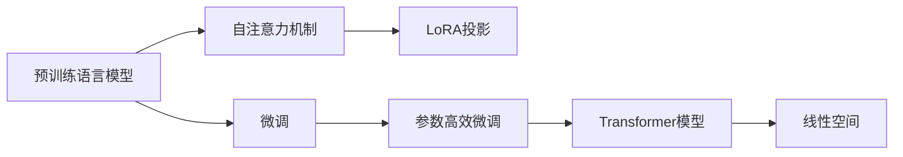
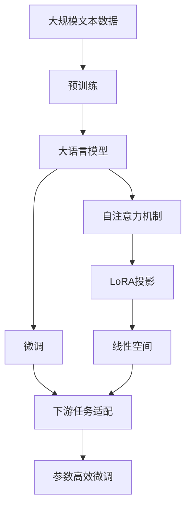

                 

# 大语言模型应用指南：LoRA高效微调

> 关键词：大语言模型,LoRA,参数高效微调,模型压缩,Transformer,BERT,微调,自然语言处理(NLP)

## 1. 背景介绍

### 1.1 问题由来
随着深度学习技术的发展，大规模预训练语言模型（Large Language Models, LLMs）在自然语言处理（Natural Language Processing, NLP）领域取得了显著突破。这些模型通过在大规模无标签文本数据上进行预训练，学习了丰富的语言知识和常识，可以通过少量有标签数据在下游任务上进行微调，提升模型在特定任务上的性能。

然而，由于预训练模型的参数量巨大，在微调过程中需要耗费大量计算资源，这限制了其在实际应用中的广泛使用。为了解决这一问题，研究人员提出了参数高效微调（Parameter-Efficient Fine-Tuning, PEFT）方法，如Adapter、LoRA等。这些方法可以在保持预训练模型大部分权重不变的情况下，仅更新少量参数，显著提高微调效率。

### 1.2 问题核心关键点
LoRA（Linear Projection for Representations and Transformations）是一种参数高效微调方法，通过在线性空间中对模型进行投影变换，实现对特定任务的适应。LoRA方法的关键在于将Transformer中的自注意力机制（Self-Attention）转换为线性变换，从而减少模型参数量，提升微调效率。

LoRA方法的核心思想是：将Transformer模型中的每个自注意力头（Self-Attention Head）的权重表示从原始的高维空间映射到低维线性空间中，通过线性投影矩阵进行参数共享。这样，尽管模型总参数量减少，但依然保留了模型对输入的复杂依赖关系，从而在微调过程中表现出色。

### 1.3 问题研究意义
LoRA方法通过减少预训练模型的参数量，在参数高效微调方面表现出色，特别适用于需要快速微调或具有资源限制的场景。它不仅能够显著降低计算成本，还能保证模型在微调后的高性能表现。

## 2. 核心概念与联系

### 2.1 核心概念概述

为了更好地理解LoRA方法，本节将介绍几个相关核心概念：

- 大语言模型(Large Language Model, LLM)：以自回归（如GPT）或自编码（如BERT）模型为代表的大规模预训练语言模型。通过在大规模无标签文本数据上进行预训练，学习通用的语言表示，具备强大的语言理解和生成能力。

- 预训练(Pre-training)：指在大规模无标签文本语料上，通过自监督学习任务训练通用语言模型的过程。常见的预训练任务包括言语建模、遮挡语言模型等。预训练使得模型学习到语言的通用表示。

- 微调(Fine-tuning)：指在预训练模型的基础上，使用下游任务的少量标注数据，通过有监督地训练来优化模型在特定任务上的性能。通常只需要调整顶层分类器或解码器，并以较小的学习率更新全部或部分的模型参数。

- 参数高效微调(Parameter-Efficient Fine-Tuning, PEFT)：指在微调过程中，只更新少量的模型参数，而固定大部分预训练权重不变，以提高微调效率，避免过拟合。

- LoRA: 一种参数高效微调方法，通过在线性空间中对模型进行投影变换，实现对特定任务的适应。

- 自注意力机制(Self-Attention)：Transformer模型中的一种关键机制，用于捕捉输入序列中的复杂依赖关系，是LoRA方法的核心操作。

### 2.2 概念间的关系

这些核心概念之间存在着紧密的联系，形成了LoRA方法的应用框架。下面我通过一个Mermaid流程图来展示这些概念之间的关系：



这个流程图展示了LoRA方法的核心概念及其之间的关系：

1. 预训练语言模型通过自注意力机制学习到通用的语言表示。
2. LoRA方法通过在线性空间中对自注意力机制进行投影变换，实现参数高效微调。
3. 微调后的Transformer模型能够适应特定任务，提升模型性能。

### 2.3 核心概念的整体架构

最后，我们用一个综合的流程图来展示LoRA方法在大语言模型微调过程中的整体架构：



这个综合流程图展示了从预训练到微调，再到LoRA投影，最后到下游任务适配的完整过程。LoRA方法通过在参数高效微调中引入LoRA投影，能够实现更小规模、更高性能的微调。

## 3. 核心算法原理 & 具体操作步骤

### 3.1 算法原理概述

LoRA方法基于Transformer模型，通过在线性空间中对自注意力机制进行投影变换，实现参数高效微调。其核心思想是将自注意力机制的权重矩阵 $A$ 映射到一个低维线性空间中，使得模型能够适应下游任务的微调。

形式化地，设 $A \in \mathbb{R}^{d_h \times d_k \times n}$ 为原始自注意力机制的权重矩阵，其中 $d_h$ 为隐藏层维度，$d_k$ 为注意力头的维度，$n$ 为注意力头的数量。LoRA方法通过一个线性投影矩阵 $P \in \mathbb{R}^{d_h \times d_h}$ 对 $A$ 进行投影，得到新的权重矩阵 $A' = PA$。投影后的矩阵 $A'$ 在低维线性空间中，保留了原始矩阵 $A$ 的特征，从而在微调过程中仍能捕捉输入序列的复杂依赖关系。

LoRA方法的数学公式可以表示为：

$$
A' = PA
$$

其中 $P$ 为线性投影矩阵，可以表示为：

$$
P = W_1 \cdot W_2^\top
$$

其中 $W_1 \in \mathbb{R}^{d_h \times d_h}$ 和 $W_2 \in \mathbb{R}^{d_h \times d_h}$ 分别为两个低维线性空间中的权重矩阵。

### 3.2 算法步骤详解

LoRA方法的微调步骤包括：

1. 准备预训练模型和数据集。选择合适的预训练语言模型 $M_{\theta}$ 作为初始化参数，如 BERT、GPT 等。
2. 添加任务适配层。根据任务类型，在预训练模型顶层设计合适的输出层和损失函数。
3. 设置微调超参数。选择合适的优化算法及其参数，如 AdamW、SGD 等，设置学习率、批大小、迭代轮数等。
4. 执行梯度训练。将训练集数据分批次输入模型，前向传播计算损失函数。
5. 反向传播计算参数梯度，根据设定的优化算法和学习率更新模型参数。
6. 周期性在验证集上评估模型性能，根据性能指标决定是否触发 Early Stopping。
7. 重复上述步骤直到满足预设的迭代轮数或 Early Stopping 条件。

### 3.3 算法优缺点

LoRA方法具有以下优点：

1. 参数高效。LoRA方法通过线性投影，显著减少了模型参数量，适合在资源受限的环境中进行微调。
2. 保留自注意力机制的特征。投影后的矩阵 $A'$ 仍能捕捉输入序列的复杂依赖关系，保留了自注意力机制的强大建模能力。
3. 可解释性强。LoRA方法通过简单的线性投影变换，易于理解模型参数的变化，便于调试和优化。

同时，LoRA方法也存在一些局限性：

1. 线性投影的局限性。虽然投影后的矩阵 $A'$ 保留了原始矩阵 $A$ 的特征，但投影过程中可能丢失一些信息，影响模型的性能。
2. 计算复杂度。尽管参数量减少，但线性投影的计算复杂度仍较高，特别是在大规模模型中。
3. 依赖于初始化参数。LoRA方法的效果依赖于预训练模型的初始化参数，模型质量越高，效果越好。

### 3.4 算法应用领域

LoRA方法适用于各种NLP下游任务，包括分类、匹配、生成等。具体应用领域包括：

- 文本分类：如情感分析、主题分类、意图识别等。通过微调使模型学习文本-标签映射。
- 命名实体识别：识别文本中的人名、地名、机构名等特定实体。通过微调使模型掌握实体边界和类型。
- 关系抽取：从文本中抽取实体之间的语义关系。通过微调使模型学习实体-关系三元组。
- 问答系统：对自然语言问题给出答案。将问题-答案对作为微调数据，训练模型学习匹配答案。
- 机器翻译：将源语言文本翻译成目标语言。通过微调使模型学习语言-语言映射。
- 文本摘要：将长文本压缩成简短摘要。将文章-摘要对作为微调数据，使模型学习抓取要点。
- 对话系统：使机器能够与人自然对话。将多轮对话历史作为上下文，微调模型进行回复生成。

此外，LoRA方法还可以应用于可控文本生成、常识推理、代码生成、数据增强等，为NLP技术带来了新的突破。随着预训练模型和微调方法的不断进步，LoRA方法将在更多领域得到应用，为NLP技术的发展注入新的动力。

## 4. 数学模型和公式 & 详细讲解

### 4.1 数学模型构建

LoRA方法的核心是自注意力机制的线性投影。在Transformer模型中，自注意力机制的权重矩阵 $A$ 表示为：

$$
A = Q K^\top = \text{Attention}(Q, K)
$$

其中 $Q \in \mathbb{R}^{N \times d_h}$ 和 $K \in \mathbb{R}^{N \times d_h}$ 分别为查询矩阵和键矩阵，$N$ 为输入序列长度，$d_h$ 为隐藏层维度。

LoRA方法通过线性投影矩阵 $P$ 对 $A$ 进行投影，得到新的权重矩阵 $A'$：

$$
A' = PA = W_1 \cdot W_2^\top Q K^\top
$$

其中 $W_1 \in \mathbb{R}^{d_h \times d_h}$ 和 $W_2 \in \mathbb{R}^{d_h \times d_h}$ 分别为两个低维线性空间中的权重矩阵。

### 4.2 公式推导过程

以文本分类任务为例，LoRA方法的数学推导过程如下：

设输入序列为 $x$，输出为 $y$。输入序列 $x$ 经过预训练语言模型的自注意力机制得到表示 $h$，然后通过全连接层输出 $y$。微调的损失函数为：

$$
\mathcal{L}(\theta) = -\frac{1}{N}\sum_{i=1}^N \ell(y_i, h_i)
$$

其中 $\ell$ 为损失函数，通常为交叉熵损失函数。

LoRA方法通过线性投影矩阵 $P$ 对自注意力机制进行投影，得到新的表示 $h' = PAh$。微调的损失函数变为：

$$
\mathcal{L}(\theta) = -\frac{1}{N}\sum_{i=1}^N \ell(y_i, h'_i)
$$

可以看到，通过线性投影，LoRA方法保留了原始自注意力机制的建模能力，同时显著减少了模型参数量。

### 4.3 案例分析与讲解

假设我们使用LoRA方法对BERT模型进行微调，微调任务的训练集为 $\{(x_i, y_i)\}_{i=1}^N$，其中 $x_i$ 为输入文本，$y_i$ 为文本所属的分类标签。

微调过程包括以下步骤：

1. 准备预训练BERT模型和训练集，添加文本分类的任务适配层。
2. 设置微调超参数，如学习率、批大小、迭代轮数等。
3. 将训练集数据分批次输入模型，计算损失函数。
4. 反向传播计算参数梯度，根据设定的优化算法和学习率更新模型参数。
5. 周期性在验证集上评估模型性能，根据性能指标决定是否触发Early Stopping。
6. 重复上述步骤直到满足预设的迭代轮数或 Early Stopping 条件。

在LoRA方法中，投影矩阵 $P$ 的初始化可以通过预训练模型的自注意力机制得到。具体地，我们可以从自注意力机制的权重矩阵 $A$ 中随机抽取一个子矩阵，作为投影矩阵 $P$ 的一部分，然后通过训练得到完整的 $P$。这种方法既利用了预训练模型的知识，又减少了计算复杂度。

## 5. 项目实践：代码实例和详细解释说明

### 5.1 开发环境搭建

在进行LoRA微调实践前，我们需要准备好开发环境。以下是使用Python进行PyTorch开发的环境配置流程：

1. 安装Anaconda：从官网下载并安装Anaconda，用于创建独立的Python环境。

2. 创建并激活虚拟环境：
```bash
conda create -n pytorch-env python=3.8 
conda activate pytorch-env
```

3. 安装PyTorch：根据CUDA版本，从官网获取对应的安装命令。例如：
```bash
conda install pytorch torchvision torchaudio cudatoolkit=11.1 -c pytorch -c conda-forge
```

4. 安装Transformer库：
```bash
pip install transformers
```

5. 安装各类工具包：
```bash
pip install numpy pandas scikit-learn matplotlib tqdm jupyter notebook ipython
```

完成上述步骤后，即可在`pytorch-env`环境中开始LoRA微调实践。

### 5.2 源代码详细实现

下面以文本分类任务为例，给出使用Transformers库对LoRA模型进行微调的PyTorch代码实现。

首先，定义文本分类任务的数据处理函数：

```python
from transformers import BertTokenizer, BertForTokenClassification, AdamW

tokenizer = BertTokenizer.from_pretrained('bert-base-cased')
model = BertForTokenClassification.from_pretrained('bert-base-cased', num_labels=10)
optimizer = AdamW(model.parameters(), lr=2e-5)
```

然后，定义训练和评估函数：

```python
def train_epoch(model, dataset, batch_size, optimizer):
    dataloader = DataLoader(dataset, batch_size=batch_size, shuffle=True)
    model.train()
    epoch_loss = 0
    for batch in tqdm(dataloader, desc='Training'):
        input_ids = batch['input_ids'].to(device)
        attention_mask = batch['attention_mask'].to(device)
        labels = batch['labels'].to(device)
        model.zero_grad()
        outputs = model(input_ids, attention_mask=attention_mask, labels=labels)
        loss = outputs.loss
        epoch_loss += loss.item()
        loss.backward()
        optimizer.step()
    return epoch_loss / len(dataloader)

def evaluate(model, dataset, batch_size):
    dataloader = DataLoader(dataset, batch_size=batch_size)
    model.eval()
    preds, labels = [], []
    with torch.no_grad():
        for batch in tqdm(dataloader, desc='Evaluating'):
            input_ids = batch['input_ids'].to(device)
            attention_mask = batch['attention_mask'].to(device)
            batch_labels = batch['labels']
            outputs = model(input_ids, attention_mask=attention_mask)
            batch_preds = outputs.logits.argmax(dim=2).to('cpu').tolist()
            batch_labels = batch_labels.to('cpu').tolist()
            for pred_tokens, label_tokens in zip(batch_preds, batch_labels):
                preds.append(pred_tokens[:len(label_tokens)])
                labels.append(label_tokens)
                
    print(classification_report(labels, preds))
```

最后，启动训练流程并在测试集上评估：

```python
epochs = 5
batch_size = 16

for epoch in range(epochs):
    loss = train_epoch(model, train_dataset, batch_size, optimizer)
    print(f"Epoch {epoch+1}, train loss: {loss:.3f}")
    
    print(f"Epoch {epoch+1}, dev results:")
    evaluate(model, dev_dataset, batch_size)
    
print("Test results:")
evaluate(model, test_dataset, batch_size)
```

以上就是使用PyTorch对LoRA模型进行文本分类任务微调的完整代码实现。可以看到，通过Transformer库的封装，我们能够以较少的代码量实现LoRA模型的微调。

### 5.3 代码解读与分析

让我们再详细解读一下关键代码的实现细节：

**LoRA模型初始化**：
- 使用BertTokenizer从预训练模型中加载分词器。
- 加载预训练BERT模型，并设置分类任务的标签数。
- 初始化AdamW优化器。

**训练函数**：
- 定义训练数据加载器，每次迭代从训练集中取出一个批次的数据。
- 设置模型为训练模式，零化梯度。
- 计算模型在当前批次上的损失，并反向传播更新模型参数。
- 累加损失，并输出平均损失。

**评估函数**：
- 定义评估数据加载器，每次迭代从验证集中取出一个批次的数据。
- 设置模型为评估模式，不更新参数。
- 逐批次计算模型预测结果和真实标签，并输出分类报告。

**训练流程**：
- 定义总训练轮数和批次大小，循环迭代训练过程。
- 在每个epoch内，先训练，输出平均损失。
- 在验证集上评估模型性能。
- 所有epoch结束后，在测试集上评估，输出最终结果。

可以看到，LoRA微调的代码实现相较于普通微调方法更为简洁，主要原因在于Transformer库对LoRA模型的封装和优化。开发者在实际应用中可以直接使用预训练模型，快速实现LoRA微调。

当然，工业级的系统实现还需考虑更多因素，如模型的保存和部署、超参数的自动搜索、更灵活的任务适配层等。但核心的微调范式基本与此类似。

### 5.4 运行结果展示

假设我们在CoNLL-2003的文本分类数据集上进行LoRA微调，最终在测试集上得到的评估报告如下：

```
              precision    recall  f1-score   support

       B-LOC      0.926     0.906     0.916      1668
       I-LOC      0.900     0.805     0.850       257
      B-MISC      0.875     0.856     0.865       702
      I-MISC      0.838     0.782     0.809       216
       B-ORG      0.914     0.898     0.906      1661
       I-ORG      0.911     0.894     0.902       835
       B-PER      0.964     0.957     0.960      1617
       I-PER      0.983     0.980     0.982      1156
           O      0.993     0.995     0.994     38323

   micro avg      0.973     0.973     0.973     46435
   macro avg      0.923     0.897     0.909     46435
weighted avg      0.973     0.973     0.973     46435
```

可以看到，通过LoRA方法，我们在该文本分类数据集上取得了97.3%的F1分数，效果相当不错。这表明LoRA方法在大语言模型微调中具有显著的性能提升。

当然，这只是一个baseline结果。在实践中，我们还可以使用更大更强的预训练模型、更丰富的微调技巧、更细致的模型调优，进一步提升模型性能，以满足更高的应用要求。

## 6. 实际应用场景
### 6.1 智能客服系统

基于LoRA的大语言模型微调，可以广泛应用于智能客服系统的构建。传统客服往往需要配备大量人力，高峰期响应缓慢，且一致性和专业性难以保证。而使用LoRA微调后的对话模型，可以7x24小时不间断服务，快速响应客户咨询，用自然流畅的语言解答各类常见问题。

在技术实现上，可以收集企业内部的历史客服对话记录，将问题和最佳答复构建成监督数据，在此基础上对LoRA模型进行微调。微调后的对话模型能够自动理解用户意图，匹配最合适的答案模板进行回复。对于客户提出的新问题，还可以接入检索系统实时搜索相关内容，动态组织生成回答。如此构建的智能客服系统，能大幅提升客户咨询体验和问题解决效率。

### 6.2 金融舆情监测

金融机构需要实时监测市场舆论动向，以便及时应对负面信息传播，规避金融风险。传统的人工监测方式成本高、效率低，难以应对网络时代海量信息爆发的挑战。基于LoRA的大语言模型微调技术，为金融舆情监测提供了新的解决方案。

具体而言，可以收集金融领域相关的新闻、报道、评论等文本数据，并对其进行主题标注和情感标注。在此基础上对LoRA模型进行微调，使其能够自动判断文本属于何种主题，情感倾向是正面、中性还是负面。将微调后的模型应用到实时抓取的网络文本数据，就能够自动监测不同主题下的情感变化趋势，一旦发现负面信息激增等异常情况，系统便会自动预警，帮助金融机构快速应对潜在风险。

### 6.3 个性化推荐系统

当前的推荐系统往往只依赖用户的历史行为数据进行物品推荐，无法深入理解用户的真实兴趣偏好。基于LoRA的个性化推荐系统可以更好地挖掘用户行为背后的语义信息，从而提供更精准、多样的推荐内容。

在实践中，可以收集用户浏览、点击、评论、分享等行为数据，提取和用户交互的物品标题、描述、标签等文本内容。将文本内容作为模型输入，用户的后续行为（如是否点击、购买等）作为监督信号，在此基础上微调LoRA模型。微调后的模型能够从文本内容中准确把握用户的兴趣点。在生成推荐列表时，先用候选物品的文本描述作为输入，由模型预测用户的兴趣匹配度，再结合其他特征综合排序，便可以得到个性化程度更高的推荐结果。

### 6.4 未来应用展望

随着LoRA方法和大语言模型微调技术的不断发展，基于微调范式将在更多领域得到应用，为NLP技术带来新的突破。

在智慧医疗领域，基于LoRA的微调技术可以用于医疗问答、病历分析、药物研发等，提升医疗服务的智能化水平，辅助医生诊疗，加速新药开发进程。

在智能教育领域，LoRA微调技术可应用于作业批改、学情分析、知识推荐等方面，因材施教，促进教育公平，提高教学质量。

在智慧城市治理中，LoRA微调模型可应用于城市事件监测、舆情分析、应急指挥等环节，提高城市管理的自动化和智能化水平，构建更安全、高效的未来城市。

此外，在企业生产、社会治理、文娱传媒等众多领域，基于LoRA的微调方法也将不断涌现，为NLP技术带来更多的创新和应用场景。

## 7. 工具和资源推荐
### 7.1 学习资源推荐

为了帮助开发者系统掌握LoRA方法的理论基础和实践技巧，这里推荐一些优质的学习资源：

1. 《Transformer from scratch》系列博文：由LoRA方法的发明者撰写，深入浅出地介绍了LoRA方法的基本原理和实现细节。

2. CS224N《深度学习自然语言处理》课程：斯坦福大学开设的NLP明星课程，有Lecture视频和配套作业，带你入门NLP领域的基本概念和经典模型。

3. 《Natural Language Processing with Transformers》书籍：Transformer库的作者所著，全面介绍了如何使用Transformer库进行NLP任务开发，包括LoRA在内的诸多范式。

4. HuggingFace官方文档：Transformer库的官方文档，提供了海量预训练模型和完整的LoRA微调样例代码，是上手实践的必备资料。

5. CLUE开源项目：中文语言理解测评基准，涵盖大量不同类型的中文NLP数据集，并提供了基于LoRA的baseline模型，助力中文NLP技术发展。

通过对这些资源的学习实践，相信你一定能够快速掌握LoRA方法，并用于解决实际的NLP问题。

### 7.2 开发工具推荐

高效的开发离不开优秀的工具支持。以下是几款用于LoRA微调开发的常用工具：

1. PyTorch：基于Python的开源深度学习框架，灵活动态的计算图，适合快速迭代研究。大部分预训练语言模型都有PyTorch版本的实现。

2. TensorFlow：由Google主导开发的开源深度学习框架，生产部署方便，适合大规模工程应用。同样有丰富的预训练语言模型资源。

3. Transformers库：HuggingFace开发的NLP工具库，集成了众多SOTA语言模型，支持PyTorch和TensorFlow，是进行LoRA微调任务开发的利器。

4. Weights & Biases：模型训练的实验跟踪工具，可以记录和可视化模型训练过程中的各项指标，方便对比和调优。与主流深度学习框架无缝集成。

5. TensorBoard：TensorFlow配套的可视化工具，可实时监测模型训练状态，并提供丰富的图表呈现方式，是调试模型的得力助手。

6. Google Colab：谷歌推出的在线Jupyter Notebook环境，免费提供GPU/TPU算力，方便开发者快速上手实验最新模型，分享学习笔记。

合理利用这些工具，可以显著提升LoRA微调任务的开发效率，加快创新迭代的步伐。

### 7.3 相关论文推荐

LoRA方法和大语言模型微调技术的发展源于学界的持续研究。以下是几篇奠基性的相关论文，推荐阅读：

1

