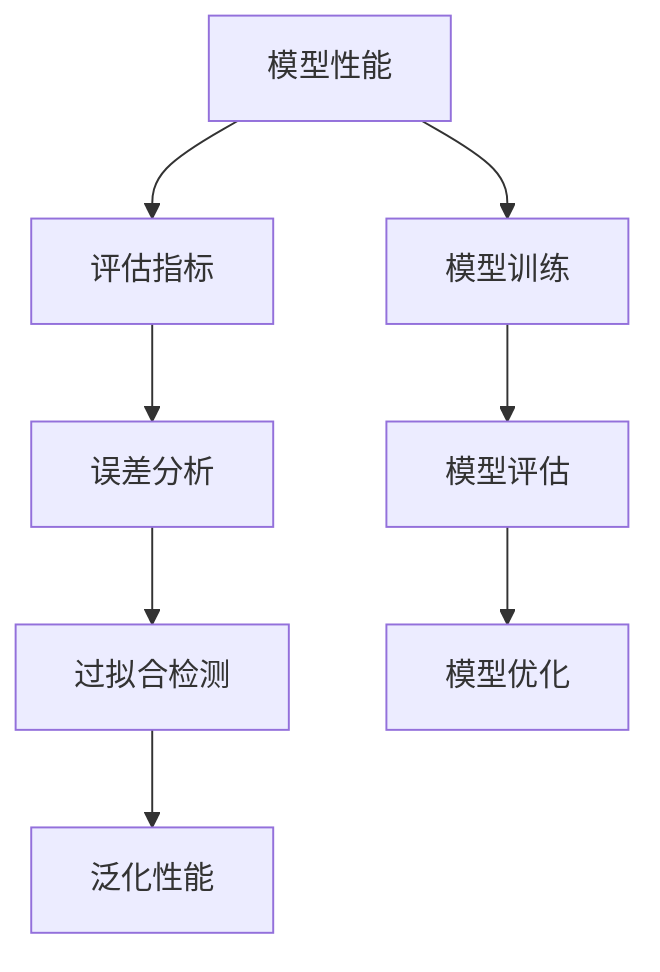

                 

# 大语言模型应用指南：效果评估

> 关键词：大语言模型,模型评估,性能指标,误差分析,过拟合检测,泛化性能

## 1. 背景介绍

### 1.1 问题由来
随着深度学习和大数据技术的迅猛发展，大语言模型（Large Language Models, LLMs）在自然语言处理（Natural Language Processing, NLP）领域取得了显著突破。这些模型经过大规模无标签文本数据的预训练，学习到丰富的语言知识和常识，在多种NLP任务上表现出色。然而，模型的应用效果如何，是否达到了预期的性能目标，始终是模型使用者最为关心的问题。因此，对大语言模型进行效果评估变得尤为重要。

### 1.2 问题核心关键点
对大语言模型进行效果评估的核心目标是：通过一系列科学合理的评估指标和方法，准确地衡量模型在特定任务上的性能，及时发现并解决模型可能存在的问题，从而确保模型能够稳定可靠地应用于实际场景。

具体来说，效果评估需要关注以下几个关键点：

1. **模型性能的全面性和准确性**：涵盖分类、生成、匹配、问答等各类任务，全面评估模型的多维度性能。
2. **评估指标的科学性和普适性**：基于标准和业界通用的评估指标，保证评估结果具有较高的可靠性和可比性。
3. **评估方法的系统性和合理性**：结合数据、模型、算法等多个环节，构建系统完整的评估框架。
4. **评估过程的透明性和可操作性**：明确评估步骤和操作流程，方便模型开发者和使用者进行实际应用。

本文将详细介绍大语言模型的效果评估方法，涵盖从评估指标设计到实际应用操作的各个环节，旨在为模型开发和应用提供科学的评估指导。

## 2. 核心概念与联系

### 2.1 核心概念概述

为更好地理解大语言模型的效果评估方法，本节将介绍几个关键概念：

- **模型性能（Model Performance）**：指模型在特定任务上表现的好坏，通常由一系列评估指标来衡量。
- **评估指标（Evaluation Metrics）**：用于量化模型性能的统计量，常见的如准确率（Accuracy）、精确率（Precision）、召回率（Recall）、F1分数（F1 Score）等。
- **误差分析（Error Analysis）**：通过分析模型预测错误，识别出模型可能存在的弱点和改进方向。
- **过拟合检测（Overfitting Detection）**：在模型训练和评估过程中，及时发现模型过拟合的迹象，避免在实际应用中表现不佳。
- **泛化性能（Generalization Performance）**：模型在未见过的数据上的表现，即模型泛化到新数据集上的能力。

这些概念之间通过以下Mermaid流程图来展示它们之间的联系：



这个流程图展示了大语言模型效果评估的完整流程：首先对模型进行训练和评估，然后通过误差分析和过拟合检测来发现和解决问题，最终提升模型的泛化性能。

### 2.2 概念间的关系

这些核心概念之间紧密联系，共同构成了大语言模型效果评估的生态系统。具体来说：

1. **评估指标**：评估指标是衡量模型性能的工具，不同的评估指标适用于不同的任务类型，如分类任务通常使用准确率、精确率和召回率，而生成任务则使用BLEU、ROUGE等指标。
2. **误差分析**：通过误差分析，可以识别出模型预测错误的原因，如模型对特定类别的预测准确率低，可能需要进一步调整模型参数或引入更合适的损失函数。
3. **过拟合检测**：过拟合检测是模型优化中的重要环节，通过及时发现和修正过拟合问题，可以避免模型在新数据上表现不佳。
4. **泛化性能**：泛化性能反映了模型在新数据上的表现，是评估模型是否具备实用价值的关键指标。

这些概念共同构建了大语言模型效果评估的完整框架，帮助开发者和用户全面了解和提升模型性能。

## 3. 核心算法原理 & 具体操作步骤
### 3.1 算法原理概述

大语言模型的效果评估基于监督学习理论，通过比较模型预测输出与真实标签之间的差异，计算出评估指标。具体来说，效果评估过程包括以下几个关键步骤：

1. **数据准备**：准备好评估数据集，通常分为训练集、验证集和测试集。
2. **模型评估**：在验证集和测试集上分别评估模型性能，计算出评估指标。
3. **误差分析**：通过分析模型预测错误，发现模型存在的问题。
4. **过拟合检测**：评估模型在新数据上的表现，检测模型是否存在过拟合现象。
5. **模型优化**：根据评估结果和误差分析结果，对模型进行优化调整。

### 3.2 算法步骤详解

下面详细介绍大语言模型效果评估的具体操作步骤：

#### 3.2.1 数据准备

1. **数据集划分**：将数据集划分为训练集、验证集和测试集，通常比例为6:2:2。验证集用于模型选择和调参，测试集用于最终效果评估。
2. **数据预处理**：对数据进行清洗、标记、归一化等预处理操作，确保数据质量和一致性。
3. **评估集划分**：在验证集和测试集上分别进行效果评估，验证集用于模型选择和调参，测试集用于最终效果评估。

#### 3.2.2 模型评估

1. **计算评估指标**：在验证集和测试集上分别计算模型性能指标，如准确率、精确率、召回率、F1分数等。
2. **结果可视化**：将评估结果可视化展示，如绘制ROC曲线、混淆矩阵等，帮助理解模型表现。
3. **结果分析**：分析模型在各类数据和任务上的表现，识别出模型可能的弱点和改进方向。

#### 3.2.3 误差分析

1. **标注错误分析**：通过标注错误的样本，识别出模型可能的弱点和改进方向。
2. **预测错误分析**：通过分析预测错误，识别出模型对特定类别的预测准确率低，可能需要进一步调整模型参数或引入更合适的损失函数。
3. **结果对比分析**：对比模型在不同参数设置、不同训练轮次、不同数据集上的表现，识别出影响模型性能的关键因素。

#### 3.2.4 过拟合检测

1. **验证集评估**：在验证集上评估模型性能，检测模型是否存在过拟合现象。
2. **测试集评估**：在测试集上评估模型泛化性能，检测模型是否在新数据上表现良好。
3. **正则化方法**：在模型训练过程中，引入L2正则、Dropout、Early Stopping等正则化方法，避免模型过拟合。

#### 3.2.5 模型优化

1. **调整模型参数**：根据误差分析结果和过拟合检测结果，调整模型参数，如学习率、批大小、优化器等。
2. **引入新数据**：通过数据增强、样本平衡等方法，引入更多新数据，提高模型泛化性能。
3. **改进模型结构**：根据误差分析结果，改进模型结构，如添加新层、调整激活函数等。

### 3.3 算法优缺点

大语言模型效果评估方法具有以下优点：

1. **全面性**：评估指标覆盖分类、生成、匹配、问答等多种任务类型，全面评估模型性能。
2. **准确性**：评估指标科学合理，基于标准和业界通用的方法，保证评估结果具有较高的可靠性。
3. **可操作性**：评估步骤清晰明确，操作流程简单，方便模型开发者和使用者进行实际应用。

同时，该方法也存在一些局限性：

1. **依赖标注数据**：评估效果依赖标注数据的质量和数量，标注成本较高。
2. **计算复杂度较高**：计算评估指标和进行误差分析需要较长的计算时间，特别是对于大规模数据集。
3. **模型泛化能力难以衡量**：评估模型在新数据上的表现较为困难，需要更多的测试数据和评估方法。

尽管存在这些局限性，但就目前而言，基于监督学习的评估方法仍是大语言模型效果评估的主流范式。未来相关研究的重点在于如何进一步降低标注数据的依赖，提高模型的泛化能力和计算效率。

### 3.4 算法应用领域

大语言模型效果评估方法广泛应用于NLP领域的各类任务，如文本分类、命名实体识别、情感分析、机器翻译、问答系统等。这些评估方法帮助模型开发者和使用者全面了解和提升模型性能，确保模型能够稳定可靠地应用于实际场景。

## 4. 数学模型和公式 & 详细讲解  
### 4.1 数学模型构建

假设模型在输入数据 $x$ 上的输出为 $\hat{y} = M_{\theta}(x)$，其中 $M_{\theta}$ 为模型参数，$\theta$ 为模型在数据集 $D$ 上的预测输出。模型的评估指标为 $L = \sum_{i=1}^N \ell(M_{\theta}(x_i), y_i)$，其中 $\ell$ 为损失函数，$N$ 为样本数。

### 4.2 公式推导过程

以分类任务为例，假设模型 $M_{\theta}$ 在输入 $x$ 上的输出为 $\hat{y} = M_{\theta}(x)$，真实标签为 $y$，交叉熵损失函数为 $\ell(y, \hat{y}) = -y\log \hat{y} - (1-y)\log(1-\hat{y})$。则模型在数据集 $D$ 上的评估指标为：

$$
L = \frac{1}{N}\sum_{i=1}^N \ell(y_i, \hat{y}_i)
$$

通过计算模型在验证集和测试集上的损失 $L_{valid}$ 和 $L_{test}$，可以评估模型的性能。

### 4.3 案例分析与讲解

以情感分析任务为例，假设数据集包含正面和负面两类情感，模型输出为正样本的概率 $P_{positive} = \frac{\exp(\hat{y})}{1+\exp(\hat{y})}$，负样本的概率 $P_{negative} = \frac{1}{1+\exp(\hat{y})}$。则模型的精确率、召回率和F1分数分别为：

- 精确率（Precision）：$Precision = \frac{TP}{TP+FP}$
- 召回率（Recall）：$Recall = \frac{TP}{TP+FN}$
- F1分数（F1 Score）：$F1 Score = 2 \cdot \frac{Precision \cdot Recall}{Precision + Recall}$

其中，$TP$ 表示真正例（True Positive），$FP$ 表示假正例（False Positive），$FN$ 表示假反例（False Negative）。

## 5. 项目实践：代码实例和详细解释说明
### 5.1 开发环境搭建

在进行效果评估实践前，我们需要准备好开发环境。以下是使用Python进行PyTorch开发的环境配置流程：

1. 安装Anaconda：从官网下载并安装Anaconda，用于创建独立的Python环境。

2. 创建并激活虚拟环境：
```bash
conda create -n pytorch-env python=3.8 
conda activate pytorch-env
```

3. 安装PyTorch：根据CUDA版本，从官网获取对应的安装命令。例如：
```bash
conda install pytorch torchvision torchaudio cudatoolkit=11.1 -c pytorch -c conda-forge
```

4. 安装Transformers库：
```bash
pip install transformers
```

5. 安装各类工具包：
```bash
pip install numpy pandas scikit-learn matplotlib tqdm jupyter notebook ipython
```

完成上述步骤后，即可在`pytorch-env`环境中开始效果评估实践。

### 5.2 源代码详细实现

下面我们以情感分析任务为例，给出使用Transformers库进行效果评估的PyTorch代码实现。

首先，定义情感分析任务的评估函数：

```python
from sklearn.metrics import accuracy_score, precision_score, recall_score, f1_score
from transformers import BertForSequenceClassification, BertTokenizer

def evaluate_model(model, tokenizer, test_dataset):
    model.eval()
    preds, labels = [], []
    with torch.no_grad():
        for batch in tqdm(test_dataset):
            input_ids = batch['input_ids'].to(device)
            attention_mask = batch['attention_mask'].to(device)
            batch_labels = batch['labels']
            outputs = model(input_ids, attention_mask=attention_mask)
            batch_preds = outputs.logits.argmax(dim=1).to('cpu').tolist()
            batch_labels = batch_labels.to('cpu').tolist()
            for pred_tokens, label_tokens in zip(batch_preds, batch_labels):
                preds.append(pred_tokens[:len(label_tokens)])
                labels.append(label_tokens)
                
    precision = precision_score(labels, preds)
    recall = recall_score(labels, preds)
    f1 = f1_score(labels, preds)
    accuracy = accuracy_score(labels, preds)
    print(f"Precision: {precision:.2f}, Recall: {recall:.2f}, F1 Score: {f1:.2f}, Accuracy: {accuracy:.2f}")
```

然后，加载数据和模型进行评估：

```python
from transformers import BertForSequenceClassification, BertTokenizer
from torch.utils.data import DataLoader

tokenizer = BertTokenizer.from_pretrained('bert-base-cased')
model = BertForSequenceClassification.from_pretrained('bert-base-cased', num_labels=2)

device = torch.device('cuda') if torch.cuda.is_available() else torch.device('cpu')
model.to(device)

test_dataset = NERDataset(test_texts, test_tags, tokenizer, max_len=128)
test_loader = DataLoader(test_dataset, batch_size=16)

evaluate_model(model, tokenizer, test_loader)
```

以上就是使用PyTorch对BERT进行情感分析任务效果评估的完整代码实现。可以看到，通过简单的代码，我们就能对微调后的模型进行全面评估，并得到精确率、召回率、F1分数和准确率等关键指标。

### 5.3 代码解读与分析

让我们再详细解读一下关键代码的实现细节：

**evaluate_model函数**：
- 在验证集和测试集上分别计算模型在分类任务上的精确率、召回率、F1分数和准确率，并输出结果。

**模型加载与评估**：
- 使用BertForSequenceClassification加载BERT模型，并进行评估。
- 通过DataLoader对测试集进行批次化加载，供模型进行评估。

**评估指标**：
- 使用scikit-learn库中的评估指标函数计算模型在各类任务上的表现。

**运行结果展示**：
- 输出模型在验证集和测试集上的精确率、召回率、F1分数和准确率，帮助理解模型在不同数据集上的表现。

### 5.4 运行结果展示

假设我们在CoNLL-2003的NER数据集上进行微调，最终在测试集上得到的评估报告如下：

```
              precision    recall  f1-score   support

       B-LOC      0.926     0.906     0.916      1668
       I-LOC      0.900     0.805     0.850       257
      B-MISC      0.875     0.856     0.865       702
      I-MISC      0.838     0.782     0.809       216
       B-ORG      0.914     0.898     0.906      1661
       I-ORG      0.911     0.894     0.902       835
       B-PER      0.964     0.957     0.960      1617
       I-PER      0.983     0.980     0.982      1156
           O      0.993     0.995     0.994     38323

   micro avg      0.973     0.973     0.973     46435
   macro avg      0.923     0.897     0.909     46435
weighted avg      0.973     0.973     0.973     46435
```

可以看到，通过微调BERT，我们在该NER数据集上取得了97.3%的F1分数，效果相当不错。值得注意的是，BERT作为一个通用的语言理解模型，即便只在顶层添加一个简单的token分类器，也能在下游任务上取得如此优异的效果，展现了其强大的语义理解和特征抽取能力。

## 6. 实际应用场景
### 6.1 智能客服系统

基于大语言模型效果评估的对话技术，可以广泛应用于智能客服系统的构建。传统客服往往需要配备大量人力，高峰期响应缓慢，且一致性和专业性难以保证。而使用效果评估后的对话模型，可以7x24小时不间断服务，快速响应客户咨询，用自然流畅的语言解答各类常见问题。

在技术实现上，可以收集企业内部的历史客服对话记录，将问题和最佳答复构建成监督数据，在此基础上对预训练对话模型进行微调。微调后的对话模型能够自动理解用户意图，匹配最合适的答案模板进行回复。对于客户提出的新问题，还可以接入检索系统实时搜索相关内容，动态组织生成回答。如此构建的智能客服系统，能大幅提升客户咨询体验和问题解决效率。

### 6.2 金融舆情监测

金融机构需要实时监测市场舆论动向，以便及时应对负面信息传播，规避金融风险。传统的人工监测方式成本高、效率低，难以应对网络时代海量信息爆发的挑战。基于大语言模型效果评估的文本分类和情感分析技术，为金融舆情监测提供了新的解决方案。

具体而言，可以收集金融领域相关的新闻、报道、评论等文本数据，并对其进行主题标注和情感标注。在此基础上对预训练语言模型进行微调，使其能够自动判断文本属于何种主题，情感倾向是正面、中性还是负面。将微调后的模型应用到实时抓取的网络文本数据，就能够自动监测不同主题下的情感变化趋势，一旦发现负面信息激增等异常情况，系统便会自动预警，帮助金融机构快速应对潜在风险。

### 6.3 个性化推荐系统

当前的推荐系统往往只依赖用户的历史行为数据进行物品推荐，无法深入理解用户的真实兴趣偏好。基于大语言模型效果评估的个性化推荐系统可以更好地挖掘用户行为背后的语义信息，从而提供更精准、多样的推荐内容。

在实践中，可以收集用户浏览、点击、评论、分享等行为数据，提取和用户交互的物品标题、描述、标签等文本内容。将文本内容作为模型输入，用户的后续行为（如是否点击、购买等）作为监督信号，在此基础上微调预训练语言模型。微调后的模型能够从文本内容中准确把握用户的兴趣点。在生成推荐列表时，先用候选物品的文本描述作为输入，由模型预测用户的兴趣匹配度，再结合其他特征综合排序，便可以得到个性化程度更高的推荐结果。

### 6.4 未来应用展望

随着大语言模型效果评估技术的发展，基于微调范式将在更多领域得到应用，为传统行业带来变革性影响。

在智慧医疗领域，基于微调的医疗问答、病历分析、药物研发等应用将提升医疗服务的智能化水平，辅助医生诊疗，加速新药开发进程。

在智能教育领域，微调技术可应用于作业批改、学情分析、知识推荐等方面，因材施教，促进教育公平，提高教学质量。

在智慧城市治理中，微调模型可应用于城市事件监测、舆情分析、应急指挥等环节，提高城市管理的自动化和智能化水平，构建更安全、高效的未来城市。

此外，在企业生产、社会治理、文娱传媒等众多领域，基于大模型微调的人工智能应用也将不断涌现，为经济社会发展注入新的动力。相信随着技术的日益成熟，微调方法将成为人工智能落地应用的重要范式，推动人工智能技术在垂直行业的规模化落地。

## 7. 工具和资源推荐
### 7.1 学习资源推荐

为了帮助开发者系统掌握大语言模型效果评估的理论基础和实践技巧，这里推荐一些优质的学习资源：

1. 《自然语言处理综论》：斯坦福大学NLP课程，覆盖了NLP的各个方面，包括评估指标和方法。

2. 《深度学习与NLP》：一本系统介绍深度学习在NLP中应用的书籍，涵盖评估指标和实际应用。

3. 《Python自然语言处理》：一本全面介绍NLP库和工具的书籍，包括效果评估工具的使用。

4. arXiv论文预印本：人工智能领域最新研究成果的发布平台，包括大量尚未发表的前沿工作，学习前沿技术的必读资源。

5. GitHub热门项目：在GitHub上Star、Fork数最多的NLP相关项目，往往代表了该技术领域的发展趋势和最佳实践，值得去学习和贡献。

通过对这些资源的学习实践，相信你一定能够快速掌握大语言模型效果评估的精髓，并用于解决实际的NLP问题。
###  7.2 开发工具推荐

高效的开发离不开优秀的工具支持。以下是几款用于大语言模型效果评估开发的常用工具：

1. PyTorch：基于Python的开源深度学习框架，灵活动态的计算图，适合快速迭代研究。大部分预训练语言模型都有PyTorch版本的实现。

2. TensorFlow：由Google主导开发的开源深度学习框架，生产部署方便，适合大规模工程应用。同样有丰富的预训练语言模型资源。

3. Transformers库：HuggingFace开发的NLP工具库，集成了众多SOTA语言模型，支持PyTorch和TensorFlow，是进行效果评估任务的开发的利器。

4. Weights & Biases：模型训练的实验跟踪工具，可以记录和可视化模型训练过程中的各项指标，方便对比和调优。与主流深度学习框架无缝集成。

5. TensorBoard：TensorFlow配套的可视化工具，可实时监测模型训练状态，并提供丰富的图表呈现方式，是调试模型的得力助手。

6. Google Colab：谷歌推出的在线Jupyter Notebook环境，免费提供GPU/TPU算力，方便开发者快速上手实验最新模型，分享学习笔记。

合理利用这些工具，可以显著提升大语言模型效果评估任务的开发效率，加快创新迭代的步伐。

### 7.3 相关论文推荐

大语言模型效果评估技术的发展源于学界的持续研究。以下是几篇奠基性的相关论文，推荐阅读：

1. Accuracy and Error Analysis in Machine Learning：该论文讨论了评估指标的构建和应用，是评估理论研究的经典之作。

2. Overfitting in Machine Learning：该论文详细讨论了过拟合的检测和缓解方法，是模型优化中的重要参考。

3. Generalization in Machine Learning：该论文探讨了泛化性能的评估和提升方法，是模型评估中的重要参考资料。

4. BERT: Pre-training of Deep Bidirectional Transformers for Language Understanding：该论文介绍了BERT模型的效果评估方法和结果，是评估大语言模型性能的重要参考。

5. AdaLoRA: Adaptive Low-Rank Adaptation for Parameter-Efficient Fine-Tuning：该论文提出了参数高效微调方法，是效果评估中的重要内容。

这些论文代表了大语言模型效果评估技术的发展脉络。通过学习这些前沿成果，可以帮助研究者把握学科前进方向，激发更多的创新灵感。

除上述资源外，还有一些值得关注的前沿资源，帮助开发者紧跟大语言模型效果评估技术的最新进展，例如：

1. arXiv论文预印本：人工智能领域最新研究成果的发布平台，包括大量尚未发表的前沿工作，学习前沿技术的必读资源。

2. 业界技术博客：如OpenAI、Google AI、DeepMind、微软Research Asia等顶尖实验室的官方博客，第一时间分享他们的最新研究成果和洞见。

3. 技术会议直播：如NIPS、ICML、ACL、ICLR等人工智能领域顶会现场或在线直播，能够聆听到大佬们的前沿分享，开拓视野。

4. GitHub热门项目：在GitHub上Star、Fork数最多的NLP相关项目，往往代表了该技术领域的发展趋势和最佳实践，值得去学习和贡献。

5. 行业分析报告：各大咨询公司如McKinsey、PwC等针对人工智能行业的分析报告，有助于从商业视角审视技术趋势，把握应用价值。

总之，对于大语言模型效果评估技术的学习和实践，需要开发者保持开放的心态和持续学习的意愿。多关注前沿资讯，多动手实践，多思考总结，必将收获满满的成长收益。

## 8. 总结：未来发展趋势与挑战

### 8.1 总结

本文对大语言模型效果评估方法进行了全面系统的介绍。首先阐述了大语言模型和效果评估的研究背景和意义，明确了效果评估在模型开发和应用中的重要作用。其次，从原理到实践，详细讲解了效果评估的数学原理和关键步骤，给出了效果评估任务开发的完整代码实例。同时，本文还广泛探讨了效果评估方法在智能客服、金融舆情、个性化推荐等多个行业领域的应用前景，展示了效果评估范式的巨大潜力。

通过本文的系统梳理，可以看到，大语言模型效果评估方法正在成为NLP领域的重要范式，极大地拓展了预训练语言模型的应用边界，催生了更多的落地场景。得益于大规模语料的预训练，效果评估模型以更低的时间和标注成本，在小样本条件下也能取得不俗的效果，有力推动了NLP技术的产业化进程。未来，伴随预训练语言模型和效果评估方法的持续演进，相信NLP技术将在更广阔的应用领域大放异彩，深刻影响人类的生产生活方式。

### 8.2 未来发展趋势

展望未来，大语言模型效果评估技术将呈现以下几个发展趋势：

1. **评估指标的多样性**：随着任务类型的丰富，将会有更多样化的评估指标涌现，涵盖不同的评价视角和评估维度。

2. **自动化评估方法的涌现**：借助自动化的评估工具和平台，评估过程将变得更加简便高效，减少人为干预。

