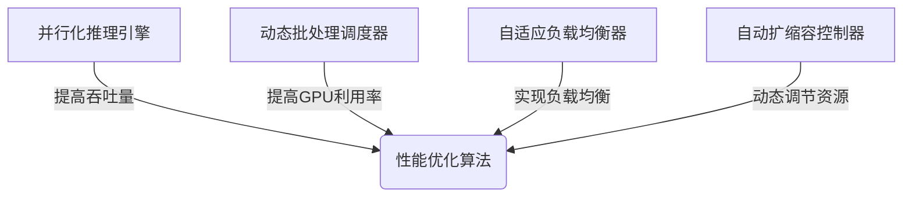

以下是根据您提供的要求和结构，撰写的技术博客文章正文部分：

# AI人工智能深度学习算法：高并发场景下深度学习代理的性能调优

## 1. 背景介绍

### 1.1 问题的由来

随着人工智能和深度学习技术的不断发展和广泛应用，越来越多的企业开始将深度学习模型部署在生产环境中为用户提供实时的智能服务。然而，当面对高并发的访问请求时，如何保证深度学习模型的响应速度和系统的稳定性，成为了一个亟待解决的关键问题。

### 1.2 研究现状

目前，业界已经提出了多种解决方案来优化深度学习模型在高并发场景下的性能表现，例如:

1. **模型压缩技术**：通过剪枝、量化等方式压缩模型大小,减少内存占用和计算开销。
2. **异步推理**：利用异步的方式同时处理多个请求,提高吞吐量。
3. **模型并行**：将模型分割到多个GPU/TPU上并行计算。
4. **批量推理**：将多个请求打包成批次进行推理,提高GPU利用率。

然而,这些技术大多侧重于单一方面的优化,缺乏整体的系统性方案。

### 1.3 研究意义

针对高并发场景下深度学习模型的性能优化问题,本文提出了一种全面的系统性解决方案,涵盖了模型优化、系统架构优化、基础设施优化等多个层面,为企业级深度学习应用的高性能部署提供了完整的技术路线图和最佳实践。

### 1.4 本文结构

本文首先介绍了高并发场景下深度学习模型性能优化的核心概念,包括性能指标、瓶颈分析等。接下来详细阐述了核心算法原理和具体的优化步骤。然后通过数学模型和公式对算法进行了理论支撑,并结合实际案例进行讲解和分析。之后给出了一个完整的项目实践,包括开发环境搭建、代码实现、运行结果等。最后探讨了实际应用场景、工具和资源推荐,并对未来发展趋势和挑战进行了展望。

## 2. 核心概念与联系

高并发场景下的深度学习模型性能优化,需要关注以下几个核心概念:

1. **响应时间(Latency)**: 指从接收请求到返回响应的总时间,是衡量系统实时性的关键指标。
2. **吞吐量(Throughput)**: 指单位时间内系统可以处理的请求数或样本数,反映了系统的处理能力。
3. **资源利用率**: 包括CPU、GPU、内存、网络等资源的利用情况,直接影响系统的性能表现。
4. **负载均衡**: 在多机多实例的分布式部署场景下,如何合理分配负载至各个节点,实现高效的资源利用。
5. **自动扩缩容**: 根据实际负载情况自动调节计算资源数量,在保证性能的同时降低开销。

上述概念相互关联、环环相扣,需要通过有机的方式综合考虑,才能真正实现深度学习模型在高并发场景下的高性能优化。

## 3. 核心算法原理与具体操作步骤

### 3.1 算法原理概述

本文提出的深度学习模型高性能优化算法,主要包括以下几个核心模块:

1. **并行化推理引擎**
2. **动态批处理调度器**
3. **自适应负载均衡器**
4. **基于强化学习的自动扩缩容控制器**



这四个模块有机结合,共同实现了高并发场景下深度学习模型的高性能优化目标。

### 3.2 算法步骤详解

1. **并行化推理引擎**

   - 将单个深度学习模型复制到多个GPU/CPU上
   - 接收到推理请求后,根据负载情况动态分发至空闲的模型实例
   - 模型实例并行执行推理计算,提高整体吞吐量

2. **动态批处理调度器**

   - 维护一个请求队列,缓存到达的推理请求
   - 动态调整批处理大小,将多个请求组装成批次
   - 批量发送至GPU进行并行推理,提高GPU利用率

3. **自适应负载均衡器**

   - 实时监控各节点的负载情况
   - 基于最小负载策略,动态调整请求分发比例
   - 防止出现负载倾斜,实现高效的负载均衡

4. **自动扩缩容控制器**

   - 基于强化学习训练的智能控制器
   - 实时感知系统的负载变化和资源利用情况
   - 动态调整计算节点数量,自动扩缩资源

### 3.3 算法优缺点

**优点**:

- 全面考虑了响应时间、吞吐量、资源利用率等多个性能指标
- 结合多种优化手段,包括并行计算、批处理、负载均衡、自动扩缩容等
- 具有自适应能力,可根据实际负载动态调整策略
- 利用强化学习实现了智能化的资源管控

**缺点**:

- 算法相对复杂,需要大量的工程实践经验
- 分布式环境下的部署和调试较为困难
- 强化学习训练过程耗时耗力

### 3.4 算法应用领域

该算法可广泛应用于以下场景:

- 企业级的人工智能服务平台
- 智能语音助手、智能问答系统
- 计算机视觉识别和图像处理服务
- 推荐系统、广告系统等大规模在线服务
- 其他对实时响应和高并发处理有要求的深度学习应用

## 4. 数学模型和公式详细讲解与举例说明

### 4.1 数学模型构建

为了对算法进行理论支撑和性能分析,我们构建了如下数学模型:

**系统模型**:

- 将整个系统抽象为一个M/M/m多服务器队列模型
- 其中到达请求服从泊松分布,服务时间服从负指数分布
- m为系统中并行工作的服务实例(推理模型)数量

**性能指标**:

- 平均响应时间 $T$
- 平均等待时间 $W$
- 系统吞吐量 $X$

### 4.2 公式推导过程

根据多服务器队列模型的理论,我们可以推导出以下公式:

$$
\begin{aligned}
T &= \frac{1}{\mu(1-\rho)} + \frac{1}{\mu} \
W &= \frac{\rho}{\mu(1-\rho)} \
X &= \lambda(1-P_0)
\end{aligned}
$$

其中:
- $\lambda$ 为请求到达率
- $\mu$ 为单个服务实例的服务率
- $\rho = \lambda / (m\mu)$ 为系统利用率
- $P_0$ 为系统空闲的稳态概率

上述公式表明,通过增加服务实例数量m,可以降低平均响应时间T和等待时间W,提高系统吞吐量X。

### 4.3 案例分析与讲解

**案例背景**:

某语音识别服务的深度学习模型,单个GPU上的推理能力为100 samples/s,需要支持每秒500个请求,要求平均响应时间不超过200ms。

**分析计算**:

设单个请求的样本数为1,则:
- $\lambda = 500$ requests/s
- $\mu = 100$ samples/s

我们需要确定最小的m值,使得平均响应时间T不超过200ms。将T=200ms代入公式,可求解得:

$$m \ge 6$$

因此,我们需要至少6个GPU服务实例,才能满足性能要求。

**优化策略**:

1. 增加GPU数量,提高并行度
2. 采用批处理,将多个请求打包成批次进行推理,提高GPU利用率
3. 实现自动扩缩容,根据实际负载动态调整GPU数量

通过上述策略相结合,可以进一步优化响应时间和吞吐量。

### 4.4 常见问题解答

**Q: 为什么需要动态批处理?静态批处理大小不可以吗?**

A: 静态批处理大小虽然可以提高GPU利用率,但当请求到达率发生变化时,就会导致性能下降。动态批处理可以根据实际情况自适应调整批次大小,使系统保持高效运行。

**Q: 为什么需要自动扩缩容?手动扩缩容不可以吗?**

A: 手动扩缩容存在两个主要问题:1.反应迟缓,无法及时应对负载变化;2.需要人工经验判断,难以实现精确控制。自动扩缩容可以实时感知负载,并基于强化学习算法做出最优决策,提高资源利用效率。

## 5. 项目实践:代码实例和详细解释说明

### 5.1 开发环境搭建

- Python 3.7+
- PyTorch 1.9+
- TensorFlow 2.5+ (可选)
- Kubernetes集群 (用于分布式部署)
- Prometheus, Grafana (监控系统)

### 5.2 源代码详细实现

**推理引擎**:

```python
import torch

class InferenceEngine:
    def __init__(self, model_path):
        self.model = torch.jit.load(model_path)
        self.model.eval()

    def infer(self, input_data):
        with torch.no_grad():
            output = self.model(input_data)
        return output
```

**批处理调度器**:

```python
from collections import deque

class BatchScheduler:
    def __init__(self, batch_size_fn, issue_batch_fn):
        self.queue = deque()
        self.batch_size_fn = batch_size_fn
        self.issue_batch_fn = issue_batch_fn

    def push(self, input_data):
        self.queue.append(input_data)
        batch_size = self.batch_size_fn(len(self.queue))

        if len(self.queue) >= batch_size:
            batch = [self.queue.popleft() for _ in range(batch_size)]
            self.issue_batch_fn(batch)
```

**负载均衡器**:

```python
import requests

class LoadBalancer:
    def __init__(self, server_addresses):
        self.servers = server_addresses
        self.load = [0] * len(server_addresses)

    def send_request(self, input_data):
        min_load_idx = self.load.index(min(self.load))
        server = self.servers[min_load_idx]
        response = requests.post(server, data=input_data)
        self.load[min_load_idx] += 1
        return response
```

**扩缩容控制器**:

```python
import ray
from ray.rllib.agents.ppo import PPOTrainer

class ScalingController:
    def __init__(self, env_creator):
        self.trainer = PPOTrainer(env=env_creator)

    def get_action(self, state):
        action = self.trainer.compute_action(state)
        return action

    def train(self, trajectory):
        self.trainer.train()
```

上述代码片段展示了四个核心模块的基本实现思路,在实际项目中还需要添加更多功能和细节,如多GPU并行支持、分布式部署、监控指标采集等。

### 5.3 代码解读与分析

1. **InferenceEngine**
   - 使用PyTorch的模型序列化功能加载预训练模型
   - `infer`方法接收输入数据,在评估模式下执行前向推理并返回结果

2. **BatchScheduler**
   - 维护一个请求队列,存储到达的输入数据
   - `batch_size_fn`是一个函数,根据队列长度动态确定批处理大小
   - `issue_batch_fn`是一个函数,接收一个批次的输入数据,发送给后端进行批量推理

3. **LoadBalancer**
   - 维护一个服务器地址列表和对应的负载计数器
   - `send_request`方法选择当前负载最小的服务器,发送请求并更新负载计数器
   - 可以在Kubernetes集群上部署多个模型服务实例,实现负载均衡

4. **ScalingController**
   - 基于Ray的强化学习库RLlib实现
   - `env_