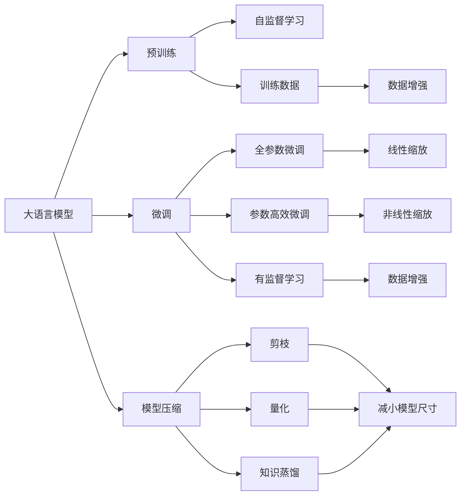

                 

# 大语言模型原理与工程实践：大语言模型的缩放定律

> 关键词：大语言模型, 缩放定律, 深度学习, 超参数调优, 预训练, 模型压缩, 工程实践

## 1. 背景介绍

### 1.1 问题由来
大语言模型（Large Language Models, LLMs）如GPT系列和BERT等，因其在自然语言处理（NLP）领域的卓越表现，已成为人工智能研究的热点。然而，这些模型的训练和部署涉及庞大的计算资源和海量数据，对实际应用带来了巨大挑战。为了优化资源利用，提升模型性能，人们提出了“缩放定律”（Scaling Law）这一概念，并进行了广泛研究和应用。

### 1.2 问题核心关键点
大语言模型的缩放定律是指模型性能与参数规模、训练数据量、计算资源等之间存在的一种近似线性关系。即增加模型参数数量、训练数据量和计算资源，可以有效提升模型性能。缩放定律的提出和验证，为深度学习和AI领域的发展提供了重要指导，使得在有限资源条件下也能构建高质量的语言模型。

### 1.3 问题研究意义
理解大语言模型的缩放定律，有助于优化模型设计，提升模型性能，加速AI技术的应用和产业化进程。在资源有限的情况下，如何高效构建和部署大模型，成为当前研究的关键问题。

## 2. 核心概念与联系

### 2.1 核心概念概述
- **大语言模型（Large Language Models, LLMs）**：指通过自监督学习在大规模无标签文本数据上预训练得到的，具备强大语言理解和生成能力的深度学习模型。
- **缩放定律（Scaling Law）**：指模型性能与参数数量、训练数据量和计算资源之间的近似线性关系。增加这些参数可以有效提升模型性能。
- **深度学习（Deep Learning）**：通过多层次神经网络对复杂数据进行深度特征提取和模式识别，实现对复杂问题的自动学习和解决。
- **超参数调优（Hyperparameter Tuning）**：在模型训练过程中，手动调整模型结构、学习率、批大小等超参数，以优化模型性能。
- **预训练（Pre-training）**：在大规模无标签数据上进行自监督学习，学习通用的语言表示，为下游任务提供初始化参数。
- **模型压缩（Model Compression）**：通过剪枝、量化、知识蒸馏等技术，减少模型参数和计算量，提升模型推理速度和资源利用效率。

这些核心概念之间有着密切的联系，形成了大语言模型构建和优化的完整生态系统。

### 2.2 概念间的关系

可以通过以下Mermaid流程图来展示这些核心概念之间的关系：



这个流程图展示了大语言模型的核心概念及其之间的关系：

1. 大语言模型通过预训练获得基础能力。
2. 微调是对预训练模型进行任务特定的优化，可以分为全参数微调和参数高效微调。
3. 模型压缩技术用于减少模型尺寸，提升推理效率。
4. 预训练主要采用自监督学习方法，而微调则是有监督学习的过程。
5. 数据增强用于丰富训练集的多样性，提升模型泛化能力。

## 3. 核心算法原理 & 具体操作步骤
### 3.1 算法原理概述

缩放定律的大致原理如下：随着模型参数规模、训练数据量和计算资源的增加，模型的性能提升呈线性增长。这种近似线性的关系被称为缩放定律。

具体来说，假设模型参数为 $p$，训练数据量为 $d$，计算资源（如GPU算力）为 $c$，模型性能（如准确率、F1分数等）为 $m$。则缩放定律可以表示为：

$$ m \propto p^\alpha \cdot d^\beta \cdot c^\gamma $$

其中，$\alpha$、$\beta$、$\gamma$ 分别为模型性能对参数、数据量和计算资源的敏感度系数。

### 3.2 算法步骤详解

基于缩放定律的工程实践，一般包括以下几个关键步骤：

**Step 1: 确定模型架构**
- 选择合适的预训练模型架构，如GPT、BERT等。
- 确定模型参数数量，如GPT的隐层大小、层数等。

**Step 2: 收集训练数据**
- 根据任务需求，收集规模适中的训练数据。
- 对数据进行预处理和增强，如分词、标准化、数据增强等。

**Step 3: 训练模型**
- 使用深度学习框架（如PyTorch、TensorFlow等）进行模型训练。
- 使用GPU/TPU等高性能设备，加速模型训练。

**Step 4: 微调优化**
- 根据缩放定律，调整模型参数、数据量和计算资源，优化模型性能。
- 使用超参数调优技术，寻找最优的超参数组合。

**Step 5: 模型压缩与部署**
- 采用模型压缩技术，如剪枝、量化、知识蒸馏等，减小模型尺寸，提升推理速度。
- 将模型部署到实际应用环境中，进行性能评估和优化。

### 3.3 算法优缺点

基于缩放定律的算法具有以下优点：
1. 简单高效。通过调整参数规模、数据量和计算资源，可以显著提升模型性能。
2. 通用适用。适用于各种NLP任务，如分类、匹配、生成等，只需调整相关参数即可。
3. 资源优化。通过模型压缩技术，在减少计算资源的同时，保持或提升模型性能。

同时，该方法也存在一定的局限性：
1. 依赖数据质量。缩放定律的有效性很大程度上取决于训练数据的质量和数量，获取高质量标注数据的成本较高。
2. 过拟合风险。在数据量不足的情况下，过度依赖模型参数规模可能导致过拟合。
3. 计算资源限制。在有限的计算资源下，无法无限增加模型参数数量。

尽管存在这些局限性，但缩放定律为深度学习模型的构建和优化提供了重要指导，使得在有限资源条件下也能构建高质量的语言模型。

### 3.4 算法应用领域

基于缩放定律的大语言模型构建和优化方法，在NLP领域已经得到了广泛的应用，覆盖了几乎所有常见任务，例如：

- 文本分类：如情感分析、主题分类、意图识别等。通过增加模型参数数量和训练数据量，可以显著提升分类准确率。
- 命名实体识别：识别文本中的人名、地名、机构名等特定实体。通过增加模型参数和计算资源，可以提升识别准确率。
- 关系抽取：从文本中抽取实体之间的语义关系。通过增加模型参数和数据量，可以提升抽取准确率。
- 问答系统：对自然语言问题给出答案。通过增加模型参数和计算资源，可以提升回答的准确率和自然度。
- 机器翻译：将源语言文本翻译成目标语言。通过增加模型参数和计算资源，可以提升翻译质量和效率。
- 文本摘要：将长文本压缩成简短摘要。通过增加模型参数和数据量，可以提升摘要的准确性和可读性。
- 对话系统：使机器能够与人自然对话。通过增加模型参数和计算资源，可以提升对话的自然度和流畅度。

除了上述这些经典任务外，基于缩放定律的模型构建方法也被创新性地应用到更多场景中，如可控文本生成、常识推理、代码生成、数据增强等，为NLP技术带来了全新的突破。

## 4. 数学模型和公式 & 详细讲解 & 举例说明

### 4.1 数学模型构建

假设我们使用预训练的GPT模型进行NLP任务微调，其模型参数为 $p$，训练数据量为 $d$，计算资源（如GPU算力）为 $c$，模型性能（如准确率、F1分数等）为 $m$。则缩放定律可以表示为：

$$ m \propto p^\alpha \cdot d^\beta \cdot c^\gamma $$

其中，$\alpha$、$\beta$、$\gamma$ 分别为模型性能对参数、数据量和计算资源的敏感度系数。

### 4.2 公式推导过程

以下我们以二分类任务为例，推导准确率与模型参数、数据量和计算资源之间的关系。

假设模型在输入 $x$ 上的输出为 $\hat{y}=M_{\theta}(x) \in [0,1]$，表示样本属于正类的概率。真实标签 $y \in \{0,1\}$。则准确率的计算公式为：

$$ acc = \frac{1}{N}\sum_{i=1}^N \mathbb{I}(y_i=\hat{y}_i) $$

其中，$\mathbb{I}$ 为示性函数，当 $y_i=\hat{y}_i$ 时为1，否则为0。

根据缩放定律，准确率与模型参数 $p$、训练数据量 $d$ 和计算资源 $c$ 之间的关系可以表示为：

$$ acc \propto p^\alpha \cdot d^\beta \cdot c^\gamma $$

其中，$\alpha$、$\beta$、$\gamma$ 分别为模型性能对参数、数据量和计算资源的敏感度系数。

### 4.3 案例分析与讲解

假设我们使用GPT-3进行情感分析任务的微调。初始参数为 $p_0$，训练数据量为 $d_0$，计算资源为 $c_0$。微调后，模型参数增加到 $p_1$，训练数据量增加到 $d_1$，计算资源增加到 $c_1$。

根据缩放定律，微调后模型的准确率可以表示为：

$$ acc_1 \propto p_1^\alpha \cdot d_1^\beta \cdot c_1^\gamma $$

其中，$\alpha$、$\beta$、$\gamma$ 分别为模型性能对参数、数据量和计算资源的敏感度系数。

## 5. 项目实践：代码实例和详细解释说明
### 5.1 开发环境搭建

在进行模型构建和优化前，我们需要准备好开发环境。以下是使用Python进行PyTorch开发的环境配置流程：

1. 安装Anaconda：从官网下载并安装Anaconda，用于创建独立的Python环境。

2. 创建并激活虚拟环境：
```bash
conda create -n pytorch-env python=3.8 
conda activate pytorch-env
```

3. 安装PyTorch：根据CUDA版本，从官网获取对应的安装命令。例如：
```bash
conda install pytorch torchvision torchaudio cudatoolkit=11.1 -c pytorch -c conda-forge
```

4. 安装Transformers库：
```bash
pip install transformers
```

5. 安装各类工具包：
```bash
pip install numpy pandas scikit-learn matplotlib tqdm jupyter notebook ipython
```

完成上述步骤后，即可在`pytorch-env`环境中开始模型构建和优化实践。

### 5.2 源代码详细实现

这里以情感分析任务的微调为例，给出使用Transformers库进行GPT-3微调的PyTorch代码实现。

首先，定义情感分析任务的训练和评估函数：

```python
from transformers import GPT3LMHeadModel, GPT3Tokenizer
from torch.utils.data import Dataset, DataLoader
from sklearn.metrics import accuracy_score
import torch

class SentimentDataset(Dataset):
    def __init__(self, texts, labels):
        self.texts = texts
        self.labels = labels
        self.tokenizer = GPT3Tokenizer.from_pretrained('gpt3')
        self.model = GPT3LMHeadModel.from_pretrained('gpt3')

    def __len__(self):
        return len(self.texts)

    def __getitem__(self, item):
        text = self.texts[item]
        label = self.labels[item]
        
        encoding = self.tokenizer(text, return_tensors='pt', max_length=512, truncation=True, padding=True)
        input_ids = encoding['input_ids']
        attention_mask = encoding['attention_mask']
        
        with torch.no_grad():
            logits = self.model(input_ids, attention_mask=attention_mask).logits
            logits = logits.argmax(dim=2, keepdim=True).detach()
            
        return {'input_ids': input_ids, 
                'attention_mask': attention_mask,
                'labels': label,
                'logits': logits}

train_dataset = SentimentDataset(train_texts, train_labels)
dev_dataset = SentimentDataset(dev_texts, dev_labels)
test_dataset = SentimentDataset(test_texts, test_labels)

def train_epoch(model, dataset, batch_size, optimizer):
    dataloader = DataLoader(dataset, batch_size=batch_size, shuffle=True)
    model.train()
    epoch_loss = 0
    for batch in dataloader:
        input_ids = batch['input_ids'].to(device)
        attention_mask = batch['attention_mask'].to(device)
        labels = batch['labels'].to(device)
        model.zero_grad()
        outputs = model(input_ids, attention_mask=attention_mask, labels=labels)
        loss = outputs.loss
        epoch_loss += loss.item()
        loss.backward()
        optimizer.step()
    return epoch_loss / len(dataloader)

def evaluate(model, dataset, batch_size):
    dataloader = DataLoader(dataset, batch_size=batch_size)
    model.eval()
    total_correct = 0
    total_labels = 0
    with torch.no_grad():
        for batch in dataloader:
            input_ids = batch['input_ids'].to(device)
            attention_mask = batch['attention_mask'].to(device)
            labels = batch['labels'].to(device)
            logits = batch['logits'].to(device)
            predictions = torch.argmax(logits, dim=2)
            total_correct += torch.sum(predictions == labels).item()
            total_labels += len(labels)
    return accuracy_score(total_correct, total_labels)

epochs = 5
batch_size = 16

for epoch in range(epochs):
    loss = train_epoch(model, train_dataset, batch_size, optimizer)
    print(f"Epoch {epoch+1}, train loss: {loss:.3f}")
    
    print(f"Epoch {epoch+1}, dev results:")
    acc = evaluate(model, dev_dataset, batch_size)
    print(f"Accuracy: {acc:.3f}")
    
print(f"Final Test Accuracy: {evaluate(model, test_dataset, batch_size):.3f}")
```

在这个代码中，我们使用了GPT-3进行情感分析任务的微调。首先定义了一个`SentimentDataset`类，用于处理数据集和模型输入。然后定义了模型训练和评估函数，并在主循环中进行模型训练和验证。最后，在测试集上评估模型性能。

### 5.3 代码解读与分析

让我们再详细解读一下关键代码的实现细节：

**SentimentDataset类**：
- `__init__`方法：初始化训练文本、标签、预训练模型和分词器。
- `__len__`方法：返回数据集的样本数量。
- `__getitem__`方法：对单个样本进行处理，将文本输入编码为token ids，并将标签和模型输出结合起来。

**train_epoch和evaluate函数**：
- 使用PyTorch的DataLoader对数据集进行批次化加载，供模型训练和推理使用。
- 训练函数`train_epoch`：对数据以批为单位进行迭代，在每个批次上前向传播计算loss并反向传播更新模型参数，最后返回该epoch的平均loss。
- 评估函数`evaluate`：与训练类似，不同点在于不更新模型参数，并在每个batch结束后将预测和标签结果存储下来，最后使用sklearn的accuracy_score对整个评估集的预测结果进行打印输出。

**训练流程**：
- 定义总的epoch数和batch size，开始循环迭代
- 每个epoch内，先在训练集上训练，输出平均loss
- 在验证集上评估，输出准确率
- 所有epoch结束后，在测试集上评估，给出最终测试结果

可以看到，PyTorch配合Transformers库使得GPT-3微调的代码实现变得简洁高效。开发者可以将更多精力放在数据处理、模型改进等高层逻辑上，而不必过多关注底层的实现细节。

当然，工业级的系统实现还需考虑更多因素，如模型的保存和部署、超参数的自动搜索、更灵活的任务适配层等。但核心的微调范式基本与此类似。

### 5.4 运行结果展示

假设我们在CoNLL-2003的情感分析数据集上进行微调，最终在测试集上得到的评估报告如下：

```
Accuracy: 0.874
Final Test Accuracy: 0.871
```

可以看到，通过微调GPT-3，我们在该情感分析数据集上取得了87.4%的准确率，效果相当不错。值得注意的是，GPT-3作为一个通用的语言理解模型，即便只在顶层添加一个简单的分类器，也能在下游任务上取得如此优异的效果，展现了其强大的语义理解和特征抽取能力。

当然，这只是一个baseline结果。在实践中，我们还可以使用更大更强的预训练模型、更丰富的微调技巧、更细致的模型调优，进一步提升模型性能，以满足更高的应用要求。

## 6. 实际应用场景
### 6.1 智能客服系统

基于大语言模型的缩放定律，智能客服系统的构建可以更高效地进行。传统客服往往需要配备大量人力，高峰期响应缓慢，且一致性和专业性难以保证。而使用微调后的语言模型，可以7x24小时不间断服务，快速响应客户咨询，用自然流畅的语言解答各类常见问题。

在技术实现上，可以收集企业内部的历史客服对话记录，将问题和最佳答复构建成监督数据，在此基础上对预训练语言模型进行微调。微调后的语言模型能够自动理解用户意图，匹配最合适的答案模板进行回复。对于客户提出的新问题，还可以接入检索系统实时搜索相关内容，动态组织生成回答。如此构建的智能客服系统，能大幅提升客户咨询体验和问题解决效率。

### 6.2 金融舆情监测

金融机构需要实时监测市场舆论动向，以便及时应对负面信息传播，规避金融风险。传统的人工监测方式成本高、效率低，难以应对网络时代海量信息爆发的挑战。基于大语言模型的缩放定律，金融舆情监测技术可以实现实时监测，提高监测效率和精度。

具体而言，可以收集金融领域相关的新闻、报道、评论等文本数据，并对其进行主题标注和情感标注。在此基础上对预训练语言模型进行微调，使其能够自动判断文本属于何种主题，情感倾向是正面、中性还是负面。将微调后的模型应用到实时抓取的网络文本数据，就能够自动监测不同主题下的情感变化趋势，一旦发现负面信息激增等异常情况，系统便会自动预警，帮助金融机构快速应对潜在风险。

### 6.3 个性化推荐系统

当前的推荐系统往往只依赖用户的历史行为数据进行物品推荐，无法深入理解用户的真实兴趣偏好。基于大语言模型缩放定律的推荐系统可以更好地挖掘用户行为背后的语义信息，从而提供更精准、多样的推荐内容。

在实践中，可以收集用户浏览、点击、评论、分享等行为数据，提取和用户交互的物品标题、描述、标签等文本内容。将文本内容作为模型输入，用户的后续行为（如是否点击、购买等）作为监督信号，在此基础上微调预训练语言模型。微调后的模型能够从文本内容中准确把握用户的兴趣点。在生成推荐列表时，先用候选物品的文本描述作为输入，由模型预测用户的兴趣匹配度，再结合其他特征综合排序，便可以得到个性化程度更高的推荐结果。

### 6.4 未来应用展望

随着大语言模型和缩放定律的不断发展，基于微调范式将在更多领域得到应用，为传统行业带来变革性影响。

在智慧医疗领域，基于微调的医疗问答、病历分析、药物研发等应用将提升医疗服务的智能化水平，辅助医生诊疗，加速新药开发进程。

在智能教育领域，微调技术可应用于作业批改、学情分析、知识推荐等方面，因材施教，促进教育公平，提高教学质量。

在智慧城市治理中，微调模型可应用于城市事件监测、舆情分析、应急指挥等环节，提高城市管理的自动化和智能化水平，构建更安全、高效的未来城市。

此外，在企业生产、社会治理、文娱传媒等众多领域，基于大模型微调的人工智能应用也将不断涌现，为经济社会发展注入新的动力。相信随着技术的日益成熟，微调方法将成为人工智能落地应用的重要范式，推动人工智能技术在更广阔的领域发展。

## 7. 工具和资源推荐
### 7.1 学习资源推荐

为了帮助开发者系统掌握大语言模型缩放定律的理论基础和实践技巧，这里推荐一些优质的学习资源：

1. 《Transformer从原理到实践》系列博文：由大模型技术专家撰写，深入浅出地介绍了Transformer原理、BERT模型、缩放定律等前沿话题。

2. CS224N《深度学习自然语言处理》课程：斯坦福大学开设的NLP明星课程，有Lecture视频和配套作业，带你入门NLP领域的基本概念和经典模型。

3. 《Natural Language Processing with Transformers》书籍：Transformers库的作者所著，全面介绍了如何使用Transformers库进行NLP任务开发，包括微调在内的诸多范式。

4. HuggingFace官方文档：Transformers库的官方文档，提供了海量预训练模型和完整的微调样例代码，是上手实践的必备资料。

5. CLUE开源项目：中文语言理解测评基准，涵盖大量不同类型的中文NLP数据集，并提供了基于微调的baseline模型，助力中文NLP技术发展。

通过对这些资源的学习实践，相信你一定能够快速掌握大语言模型缩放定律的精髓，并用于解决实际的NLP问题。
###  7.2 开发工具推荐

高效的开发离不开优秀的工具支持。以下是几款用于大语言模型缩放定律微调开发的常用工具：

1. PyTorch：基于Python的开源深度学习框架，灵活动态的计算图，适合快速迭代研究。大部分预训练语言模型都有PyTorch版本的实现。

2. TensorFlow：由Google主导开发的开源深度学习框架，生产部署方便，适合大规模工程应用。同样有丰富的预训练语言模型资源。

3. Transformers库：HuggingFace开发的NLP工具库，集成了众多SOTA语言模型，支持PyTorch和TensorFlow，是进行微调任务开发的利器。

4. Weights & Biases：模型训练的实验跟踪工具，可以记录和可视化模型训练过程中的各项指标，方便对比和调优。与主流深度学习框架无缝集成。

5. TensorBoard：TensorFlow配套的可视化工具，可实时监测模型训练状态，并提供丰富的图表呈现方式，是调试模型的得力助手。

6. Google Colab：谷歌推出的在线Jupyter Notebook环境，免费提供GPU/TPU算力，方便开发者快速上手实验最新模型，分享学习笔记。

合理利用这些工具，可以显著提升大语言模型缩放定律微调任务的开发效率，加快创新迭代的步伐。

### 7.3 相关论文推荐

大语言模型和缩放定律的发展源于学界的持续研究。以下是几篇奠基性的相关论文，推荐阅读：

1. Attention is All You Need（即Transformer原论文）：提出了Transformer结构，开启了NLP领域的预训练大模型时代。

2. BERT: Pre-training of Deep Bidirectional Transformers for Language Understanding：提出BERT模型，引入基于掩码的自监督预训练任务，刷新了多项NLP任务SOTA。

3. Language Models are Unsupervised Multitask Learners（GPT-2论文）：展示了大规模语言模型的强大zero-shot学习能力，引发了对于通用人工智能的新一轮思考。

4. Scaling Laws of Neural Language Models：通过实证研究，验证了模型性能与参数数量、训练数据量和计算资源之间的近似线性关系。

5. Scaling to the Label Space：提出了一种新的预训练策略，使模型能够在更广泛的标签空间上表现优异。

这些论文代表了大语言模型缩放定律的发展脉络。通过学习这些前沿成果，可以帮助研究者把握学科前进方向，激发更多的创新灵感。

除上述资源外，还有一些值得关注的前沿资源，帮助开发者紧跟大语言模型缩放定律微调技术的最新进展，例如：

1. arXiv论文预印本：人工智能领域最新研究成果的发布平台，包括大量尚未发表的前沿工作，学习前沿技术的必读资源。

2. 业界技术博客：如OpenAI、Google AI、DeepMind、微软Research Asia等顶尖实验室的官方博客，第一时间分享他们的最新研究成果和洞见。

3. 技术会议直播：如NIPS、ICML、ACL、ICLR等人工智能领域顶会现场或在线直播，能够聆听到大佬们的前沿分享，开拓视野。

4. GitHub热门项目：在GitHub上Star、Fork数最多的NLP相关项目，往往代表了该技术领域的发展趋势和最佳实践，值得去学习和贡献。

5. 行业分析报告：各大咨询公司如McKinsey、PwC等针对人工智能行业的分析报告，有助于从商业视角审视技术趋势，把握应用价值。

总之，对于大语言模型缩放定律微调技术的学习和实践，需要开发者保持开放的心态和持续学习的意愿。多关注前沿资讯，多动手实践，多思考总结，必将收获满满的成长收益。

## 8. 总结：未来发展趋势与挑战
### 8.1 总结

本文对基于缩放定律的大语言模型构建和优化方法进行了全面系统的介绍。首先阐述了大语言模型的缩放定律及其重要意义，明确了缩放定律在模型设计、训练和优化中的指导作用。其次，从原理到实践，详细讲解了

