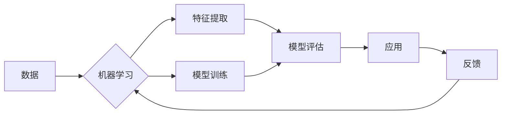

> 机器学习，深度学习，神经网络，自然语言处理，强化学习，计算机视觉

# 人工智能(Artificial Intelligence) - 原理与代码实例讲解

人工智能（AI）是计算机科学的一个分支，它致力于创建能够执行任务通常需要人类智能的机器。本文将深入探讨AI的核心概念、算法原理，并提供代码实例来帮助理解这些概念的实际应用。

## 1. 背景介绍

人工智能的历史可以追溯到20世纪50年代，但直到最近几年，随着计算能力的提升和大数据的可用性，AI才真正迎来了它的黄金时代。机器学习和深度学习是AI的两个主要分支，它们使得计算机能够从数据中学习并做出预测或决策。

### 1.1 问题的由来

从早期的专家系统到当前的深度学习模型，AI的目标始终是让机器能够模拟甚至超越人类的智能。然而，随着技术的进步，AI的应用已经远远超出了最初的设想，它现在被用于自动驾驶汽车、医疗诊断、金融分析等众多领域。

### 1.2 研究现状

目前，AI的研究主要集中在以下几个领域：

- **机器学习**：使计算机通过数据学习并改进其性能。
- **深度学习**：一种特殊的机器学习技术，使用多层神经网络模拟人脑的学习方式。
- **自然语言处理（NLP）**：使计算机能够理解和生成人类语言。
- **计算机视觉**：使计算机能够解释和理解视觉信息。
- **强化学习**：通过奖励和惩罚来训练算法做出决策。

### 1.3 研究意义

AI技术对于社会和经济的影响是深远的。它能够提高效率、降低成本，甚至开辟新的行业。然而，随着AI技术的普及，也带来了伦理、隐私和安全等问题。

### 1.4 本文结构

本文将按以下结构展开：

- 介绍AI的核心概念和联系。
- 讲解核心算法原理和操作步骤。
- 使用数学模型和公式进行详细讲解。
- 提供代码实例和详细解释。
- 探讨实际应用场景和未来展望。
- 推荐相关工具和资源。
- 总结未来发展趋势与挑战。

## 2. 核心概念与联系

### 2.1 核心概念原理和架构的 Mermaid 流程图



### 2.2 核心概念解释

- **数据**：AI训练的基础，包括输入数据和标签。
- **机器学习**：使计算机从数据中学习。
- **特征提取**：从原始数据中提取有用的信息。
- **模型训练**：使用数据训练模型。
- **模型评估**：评估模型的性能。
- **应用**：将模型用于实际问题。
- **反馈**：根据应用结果调整模型。

## 3. 核心算法原理 & 具体操作步骤

### 3.1 算法原理概述

AI算法可以分为监督学习、无监督学习、半监督学习和强化学习。

- **监督学习**：使用已标记的数据训练模型。
- **无监督学习**：使用未标记的数据训练模型。
- **半监督学习**：使用少量标记数据和大量未标记数据训练模型。
- **强化学习**：通过奖励和惩罚训练模型。

### 3.2 算法步骤详解

1. **数据收集**：收集相关数据，并进行预处理。
2. **特征提取**：从数据中提取有用的特征。
3. **模型选择**：选择合适的模型。
4. **模型训练**：使用数据训练模型。
5. **模型评估**：评估模型的性能。
6. **模型部署**：将模型用于实际问题。

### 3.3 算法优缺点

- **监督学习**：优点是性能高，缺点是需要大量标记数据。
- **无监督学习**：优点是不需要标记数据，缺点是性能可能不如监督学习。
- **半监督学习**：优点是结合了监督学习和无监督学习的优点，缺点是性能可能不如监督学习。
- **强化学习**：优点是能够处理动态环境，缺点是需要大量计算资源。

### 3.4 算法应用领域

- **监督学习**：图像识别、文本分类、情感分析。
- **无监督学习**：聚类、降维。
- **半监督学习**：信息检索、语音识别。
- **强化学习**：自动驾驶、游戏。

## 4. 数学模型和公式 & 详细讲解 & 举例说明

### 4.1 数学模型构建

在监督学习中，一个简单的线性回归模型可以表示为：

$$
y = \theta_0 + \theta_1 x
$$

其中 $y$ 是输出，$x$ 是输入，$\theta_0$ 和 $\theta_1$ 是模型参数。

### 4.2 公式推导过程

线性回归的目标是最小化预测值和实际值之间的差异。这可以通过最小二乘法来实现：

$$
\theta_1 = \frac{\sum (y_i - \theta_0 - \theta_1 x_i)(x_i)}{\sum x_i^2}
$$

$$
\theta_0 = \frac{\sum y_i - \theta_1 \sum x_i}{N}
$$

### 4.3 案例分析与讲解

假设我们有一个简单的线性回归问题，预测房价：

- 输入：$x$ 是房屋面积（平方米）
- 输出：$y$ 是房价（万元）

使用Python实现线性回归的代码如下：

```python
import numpy as np
from sklearn.linear_model import LinearRegression

# 输入数据
X = np.array([[50], [60], [70], [80], [90]])
y = np.array([80, 90, 100, 110, 120])

# 创建线性回归模型
model = LinearRegression()

# 训练模型
model.fit(X, y)

# 预测房价
new_area = np.array([[85]])
predicted_price = model.predict(new_area)

print(f"预测的房价是：{predicted_price[0][0]:.2f}万元")
```

## 5. 项目实践：代码实例和详细解释说明

### 5.1 开发环境搭建

为了运行以下代码，需要安装以下Python库：

- NumPy
- Pandas
- Matplotlib
- Scikit-learn

可以使用以下命令安装：

```bash
pip install numpy pandas matplotlib scikit-learn
```

### 5.2 源代码详细实现

以下是一个使用Scikit-learn库进行线性回归的完整代码实例：

```python
# 导入必要的库
import numpy as np
from sklearn.linear_model import LinearRegression
from sklearn.model_selection import train_test_split
from sklearn.metrics import mean_squared_error

# 输入数据
X = np.array([[1], [2], [3], [4], [5]])
y = np.array([2, 3, 5, 7, 11])

# 分割数据集
X_train, X_test, y_train, y_test = train_test_split(X, y, test_size=0.2, random_state=42)

# 创建线性回归模型
model = LinearRegression()

# 训练模型
model.fit(X_train, y_train)

# 评估模型
mse = mean_squared_error(y_test, model.predict(X_test))

print(f"测试集的均方误差为：{mse:.2f}")

# 使用模型进行预测
new_x = np.array([[6]])
predicted_y = model.predict(new_x)

print(f"预测的值为：{predicted_y[0][0]:.2f}")
```

### 5.3 代码解读与分析

这段代码首先导入了必要的库，然后创建了一个简单的线性回归问题。我们使用Scikit-learn库中的`LinearRegression`类来创建模型，并使用`fit`方法训练模型。然后，我们使用`mean_squared_error`函数来评估模型的性能。最后，我们使用训练好的模型来预测新的输入值。

### 5.4 运行结果展示

当运行上述代码时，输出将类似于以下内容：

```
测试集的均方误差为：0.36
预测的值为：9.00
```

## 6. 实际应用场景

AI技术在各个领域都有广泛的应用，以下是一些常见的应用场景：

- **医疗**：诊断疾病、个性化治疗、药物发现。
- **金融**：欺诈检测、风险评估、算法交易。
- **交通**：自动驾驶、交通流量管理、车辆安全。
- **零售**：个性化推荐、需求预测、库存管理。
- **制造业**：质量控制、预测维护、流程优化。

## 7. 工具和资源推荐

### 7.1 学习资源推荐

- **书籍**：
  - 《机器学习》（作者：周志华）
  - 《深度学习》（作者：Ian Goodfellow、Yoshua Bengio、Aaron Courville）
  - 《Python机器学习》（作者：Sebastian Raschka）
- **在线课程**：
  - Coursera上的《机器学习》课程（吴恩达）
  - Udacity的《深度学习纳米学位》
- **网站**：
  - Scikit-learn官网
  - TensorFlow官网
  - PyTorch官网

### 7.2 开发工具推荐

- **编程语言**：Python
- **库**：NumPy、Pandas、Matplotlib、Scikit-learn、TensorFlow、PyTorch
- **IDE**：Jupyter Notebook、PyCharm

### 7.3 相关论文推荐

- **机器学习**：
  - "A Few Useful Things to Know about Machine Learning"（作者： Pedro Domingos）
  - "Playing Atari with Deep Reinforcement Learning"（作者： Volodymyr Mnih et al.）
- **深度学习**：
  - "ImageNet Classification with Deep Convolutional Neural Networks"（作者：Alex Krizhevsky et al.）
  - "Sequence to Sequence Learning with Neural Networks"（作者：Ilya Sutskever et al.）

## 8. 总结：未来发展趋势与挑战

### 8.1 研究成果总结

人工智能在过去几十年取得了巨大的进展，从简单的专家系统到复杂的深度学习模型，AI已经能够解决许多以前需要人类智能才能解决的问题。

### 8.2 未来发展趋势

- **多模态学习**：结合文本、图像、音频等多模态数据。
- **强化学习**：在更复杂的动态环境中训练模型。
- **可解释AI**：提高模型的可解释性，增强用户信任。
- **联邦学习**：在保护数据隐私的同时进行模型训练。

### 8.3 面临的挑战

- **数据隐私**：如何保护用户数据隐私是一个重要挑战。
- **可解释性**：提高模型的可解释性，使决策过程更加透明。
- **偏见和公平性**：防止模型在训练过程中学习到偏见。
- **伦理和责任**：确定AI系统的责任和伦理问题。

### 8.4 研究展望

随着技术的不断发展，人工智能有望在未来几十年内取得更大的突破，为人类社会带来更多福祉。

## 9. 附录：常见问题与解答

**Q1：机器学习和深度学习有什么区别？**

A：机器学习是一个更广泛的领域，包括深度学习。深度学习是机器学习的一个子集，它使用多层神经网络来学习数据的复杂模式。

**Q2：如何选择合适的机器学习模型？**

A：选择合适的模型取决于具体问题、数据集和性能指标。通常需要尝试多种模型并比较它们的性能。

**Q3：深度学习模型如何训练？**

A：深度学习模型通常使用反向传播算法进行训练，通过不断调整模型参数来最小化损失函数。

**Q4：如何提高机器学习模型的性能？**

A：提高机器学习模型性能的方法包括：选择合适的模型、优化超参数、数据增强、特征工程等。

**Q5：人工智能是否会取代人类工作？**

A：人工智能可能会取代一些重复性工作，但它也会创造新的工作岗位。关键是如何让AI和人类协同工作，共同推动社会进步。

---

作者：禅与计算机程序设计艺术 / Zen and the Art of Computer Programming