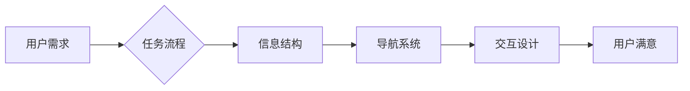

# 任务导向设计对信息架构的深远影响

> 关键词：任务导向设计，信息架构，用户体验，界面设计，信息可视化，交互设计

## 1. 背景介绍

在信息技术飞速发展的时代，信息架构（Information Architecture，IA）作为一门融合了信息科学、人类学、设计学等领域的交叉学科，日益成为构建高质量数字产品和服务的关键。信息架构的核心目标是确保信息内容的组织、结构和导航方式能够满足用户的需求，从而提升用户体验。随着用户行为和需求的不断变化，任务导向设计（Task-Oriented Design，TOD）逐渐成为信息架构设计的重要理念。本文将深入探讨任务导向设计对信息架构的深远影响。

### 1.1 任务的本质

在信息架构的语境中，任务是指用户在特定情境下为了达到某个目标而执行的一系列操作。任务可以是简单的，如查找某个商品的价格；也可以是复杂的，如完成一个复杂的报告或完成一次在线购物流程。

### 1.2 信息架构的定义

信息架构是指对信息内容的组织、结构和导航的规划，旨在帮助用户高效地找到所需的信息，完成既定任务。

### 1.3 任务导向设计的兴起

随着互联网的普及和移动设备的普及，用户的需求变得更加多样化，他们不再满足于传统的导航和搜索方式。任务导向设计应运而生，它强调以用户为中心，关注用户在完成特定任务时的需求和体验。

### 1.4 本文结构

本文将分为以下几个部分：
- 核心概念与联系
- 核心算法原理 & 具体操作步骤
- 数学模型和公式 & 详细讲解 & 举例说明
- 项目实践：代码实例和详细解释说明
- 实际应用场景
- 工具和资源推荐
- 总结：未来发展趋势与挑战

## 2. 核心概念与联系

### 2.1 任务导向设计的核心概念

- 用户需求：任务导向设计的出发点是用户的需求。
- 任务流程：用户完成任务的具体步骤。
- 信息结构：信息内容的组织方式和结构。
- 导航系统：帮助用户找到所需信息的路径。
- 交互设计：用户与产品互动的方式。

### 2.2 Mermaid 流程图



### 2.3 核心概念之间的联系

任务导向设计通过分析用户需求，设计合理的任务流程，构建清晰的信息结构，提供高效的导航系统，并优化交互设计，最终达到提升用户满意度的目的。

## 3. 核心算法原理 & 具体操作步骤

### 3.1 算法原理概述

任务导向设计的信息架构构建过程可以看作是一个算法过程，其核心原理是用户需求分析、任务流程设计、信息结构设计、导航系统设计和交互设计。

### 3.2 算法步骤详解

#### 3.2.1 用户需求分析

1. 收集用户数据：通过问卷调查、访谈、用户测试等方式收集用户数据。
2. 分析用户需求：对收集到的用户数据进行分析，识别用户的关键需求。
3. 建立用户画像：根据用户需求，建立用户画像，以便更好地理解用户。

#### 3.2.2 任务流程设计

1. 定义任务目标：明确用户需要通过任务完成的具体目标。
2. 分析任务步骤：将任务分解为一系列步骤，并确定每一步的具体操作。
3. 设计任务流程图：使用流程图工具，如Mermaid，设计任务流程图。

#### 3.2.3 信息结构设计

1. 确定信息分类：根据任务流程，确定信息内容的分类方式。
2. 设计信息层级结构：根据信息分类，设计信息层级结构。
3. 设计信息展示方式：确定信息内容的展示方式，如列表、表格、卡片等。

#### 3.2.4 导航系统设计

1. 设计导航结构：根据信息层级结构，设计导航结构。
2. 设计导航元素：设计导航按钮、链接、搜索框等元素。
3. 设计导航流程：设计用户在导航系统中的操作流程。

#### 3.2.5 交互设计

1. 设计交互元素：设计按钮、表单、弹出框等交互元素。
2. 设计交互流程：设计用户与产品交互的流程。
3. 设计交互反馈：设计用户交互后的反馈机制。

### 3.3 算法优缺点

#### 3.3.1 优点

- 提升用户体验：通过满足用户需求，提升用户体验。
- 增强可访问性：设计清晰的信息结构和导航系统，增强产品的可访问性。
- 提高效率：优化任务流程和交互设计，提高用户完成任务效率。

#### 3.3.2 缺点

- 设计复杂：任务导向设计涉及多个环节，设计过程相对复杂。
- 需要用户参与：需要收集和分析用户数据，设计过程需要用户参与。

### 3.4 算法应用领域

任务导向设计适用于所有需要信息架构的数字产品和服务，如网站、移动应用、桌面软件等。

## 4. 数学模型和公式 & 详细讲解 & 举例说明

### 4.1 数学模型构建

在任务导向设计中，可以使用一些数学模型来分析和评估设计效果，如任务流程模型、信息检索模型等。

#### 4.1.1 任务流程模型

任务流程模型可以使用状态转移图来表示，其中状态代表任务的不同阶段，转移代表任务从一个阶段到另一个阶段的转换。

#### 4.1.2 信息检索模型

信息检索模型可以使用倒排索引来表示，其中每个文档都有一个与它相关的关键词列表。

### 4.2 公式推导过程

#### 4.2.1 任务流程模型公式

状态转移图可以表示为以下公式：

$$
S_{t+1} = f(S_t, A_t)
$$

其中 $S_t$ 代表当前状态，$A_t$ 代表当前操作，$S_{t+1}$ 代表下一个状态。

#### 4.2.2 信息检索模型公式

倒排索引可以表示为以下公式：

$$
I(d) = \{k_1, k_2, ..., k_n\}
$$

其中 $I(d)$ 代表文档 $d$ 的关键词列表，$k_1, k_2, ..., k_n$ 代表关键词。

### 4.3 案例分析与讲解

以在线购物网站为例，分析任务导向设计在信息架构中的应用。

#### 4.3.1 用户需求分析

用户希望在网上购买商品，包括浏览商品、选择商品、下单支付等。

#### 4.3.2 任务流程设计

1. 浏览商品：用户输入关键词或浏览分类，找到感兴趣的商品。
2. 选择商品：用户查看商品详情，选择合适的商品。
3. 下单支付：用户将商品加入购物车，填写收货信息，完成支付。

#### 4.3.3 信息结构设计

1. 商品分类：按商品类型、品牌、价格等进行分类。
2. 商品详情：展示商品的图片、描述、价格、库存等信息。
3. 购物车：展示用户选中的商品，允许用户修改数量、删除商品等。

#### 4.3.4 导航系统设计

1. 主导航：提供商品分类、购物车、用户中心等链接。
2. 搜索框：允许用户输入关键词进行搜索。
3. 页面内导航：提供页面内跳转链接，方便用户快速浏览。

#### 4.3.5 交互设计

1. 商品详情页：提供添加到购物车的按钮。
2. 购物车页：提供修改数量、删除商品的按钮。
3. 支付页面：提供支付方式选择、支付按钮等。

## 5. 项目实践：代码实例和详细解释说明

### 5.1 开发环境搭建

以Python为例，介绍如何搭建开发环境。

1. 安装Python：从Python官网下载并安装Python。
2. 安装开发工具：安装代码编辑器，如Visual Studio Code。
3. 安装必要的库：安装Flask、Jinja2等库，用于搭建Web应用。

### 5.2 源代码详细实现

以下是一个简单的在线购物网站示例代码：

```python
from flask import Flask, render_template, request, redirect, url_for

app = Flask(__name__)

@app.route('/')
def index():
    return render_template('index.html')

@app.route('/search', methods=['GET', 'POST'])
def search():
    if request.method == 'POST':
        query = request.form['query']
        # 搜索商品并返回结果
        return redirect(url_for('search_results', query=query))
    return render_template('search.html')

@app.route('/search_results')
def search_results():
    query = request.args.get('query')
    # 搜索商品并返回结果
    return render_template('search_results.html', query=query)

if __name__ == '__main__':
    app.run(debug=True)
```

### 5.3 代码解读与分析

以上代码展示了如何使用Flask框架搭建一个简单的在线购物网站。代码中包含首页、搜索页和搜索结果页，实现了基本的商品搜索功能。

### 5.4 运行结果展示

运行以上代码后，访问网站首页，可以看到一个简单的搜索框。输入关键词并提交，可以跳转到搜索结果页，展示与关键词相关的商品。

## 6. 实际应用场景

### 6.1 在线教育平台

在线教育平台可以通过任务导向设计，将学习流程分解为多个步骤，如课程选择、学习进度跟踪、作业提交、成绩查询等，为用户提供清晰的学习路径。

### 6.2 企业内部系统

企业内部系统可以通过任务导向设计，将工作流程分解为多个步骤，如任务分配、进度跟踪、审批流程、报告生成等，提高工作效率。

### 6.3 移动应用

移动应用可以通过任务导向设计，将用户可能进行的操作分解为多个步骤，如信息查询、任务执行、进度跟踪、反馈提交等，提升用户体验。

## 7. 工具和资源推荐

### 7.1 学习资源推荐

- 《信息架构：设计信息空间的艺术》
- 《用户体验设计：从概念到实践》
- 《用户画像：构建用户需求的可视化模型》

### 7.2 开发工具推荐

- Axure RP：原型设计工具
- Sketch：界面设计工具
- InVision：交互设计工具

### 7.3 相关论文推荐

- "User-Centered Design vs. Task-Oriented Design: A Comparison of Design Philosophies"
- "Task-Oriented User Interface Design"
- "Information Architecture for the Web and Beyond"

## 8. 总结：未来发展趋势与挑战

### 8.1 研究成果总结

本文从任务导向设计的核心概念、算法原理、具体操作步骤、数学模型、实际应用场景等方面进行了全面探讨，揭示了任务导向设计对信息架构的深远影响。

### 8.2 未来发展趋势

随着人工智能、大数据等技术的发展，任务导向设计将更加智能化、个性化，能够更好地满足用户需求。

### 8.3 面临的挑战

任务导向设计面临着用户需求不断变化、技术发展迅速等挑战。

### 8.4 研究展望

未来，任务导向设计将更加注重用户需求分析、任务流程优化、信息结构优化、导航系统优化和交互设计优化，以提升用户体验。

## 9. 附录：常见问题与解答

### 9.1 常见问题

**Q1：任务导向设计与用户体验设计有何区别？**

A1：任务导向设计关注用户在完成特定任务时的需求和体验，而用户体验设计关注用户在使用产品过程中的整体感受。

**Q2：任务导向设计如何应用于移动应用？**

A2：将用户可能进行的操作分解为多个步骤，如信息查询、任务执行、进度跟踪、反馈提交等，提升用户体验。

**Q3：任务导向设计需要哪些工具和技术？**

A3：任务导向设计需要用户研究、原型设计、界面设计、交互设计等工具和技术。

### 9.2 解答

**A1：**任务导向设计关注的是用户在完成特定任务时的需求和体验，而用户体验设计关注的是用户在使用产品过程中的整体感受。任务导向设计是用户体验设计的一个子集。

**A2：**将用户可能进行的操作分解为多个步骤，如信息查询、任务执行、进度跟踪、反馈提交等，设计清晰的用户界面和交互流程，提升用户体验。

**A3：**任务导向设计需要用户研究、原型设计、界面设计、交互设计等工具和技术。用户研究可以通过问卷调查、访谈、用户测试等方式进行；原型设计可以使用Axure RP、Sketch等工具；界面设计可以使用Sketch、Photoshop等工具；交互设计可以使用InVision、Axure RP等工具。

作者：禅与计算机程序设计艺术 / Zen and the Art of Computer Programming