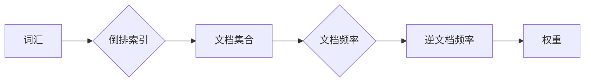

# 倒排索引 原理与代码实例讲解

> 关键词：倒排索引，搜索引擎，信息检索，文本处理，数据结构，Python

## 1. 背景介绍

在信息检索领域，倒排索引是一种高效的数据结构，它将文档集合中的词汇映射到包含这些词汇的文档列表上。这种数据结构是搜索引擎和全文搜索引擎（如Elasticsearch、Solr）的核心组件，对于快速检索和查询处理至关重要。本文将深入探讨倒排索引的原理、构建方法、优缺点以及在实际应用中的代码实现。

## 2. 核心概念与联系

### 2.1 核心概念

- **倒排索引**：一种数据结构，它将词汇映射到包含这些词汇的文档集合上。
- **词汇**：文本中的单词或短语，是倒排索引的基本单元。
- **文档**：倒排索引中的信息单元，通常是一段文本。
- **文档频率**：包含某个词汇的文档数量。
- **逆文档频率**：用于衡量词汇重要性的指标，计算公式为 $\log(\frac{N}{df})$，其中 $N$ 是文档总数，$df$ 是文档频率。

### 2.2 架构 Mermaid 流程图



在上图中，词汇通过倒排索引映射到文档集合，文档集合统计出文档频率，进而计算逆文档频率，最终得到词汇的权重。

## 3. 核心算法原理 & 具体操作步骤

### 3.1 算法原理概述

倒排索引的构建过程主要包括以下几个步骤：

1. **分词**：将文档分解成单词或短语。
2. **去重**：去除重复的词汇。
3. **统计文档频率**：计算每个词汇在文档集合中出现的频率。
4. **计算逆文档频率**：根据文档频率计算逆文档频率。
5. **构建索引**：将词汇映射到包含这些词汇的文档集合上。

### 3.2 算法步骤详解

1. **分词**：使用分词算法将文档分解成单词或短语。常见的分词算法包括正则表达式、N-gram等。

2. **去重**：使用集合等数据结构去除重复的词汇。

3. **统计文档频率**：遍历所有文档，统计每个词汇出现的次数。

4. **计算逆文档频率**：使用公式 $\log(\frac{N}{df})$ 计算逆文档频率，其中 $N$ 是文档总数，$df$ 是文档频率。

5. **构建索引**：将词汇映射到包含这些词汇的文档集合上。可以使用字典或哈希表等数据结构来构建索引。

### 3.3 算法优缺点

#### 优点

- **快速检索**：倒排索引能够快速定位包含特定词汇的文档集合，从而实现高效的检索。
- **灵活查询**：倒排索引支持多种查询类型，如精确匹配、模糊匹配、范围查询等。
- **更新方便**：在添加或删除文档时，只需要更新索引中相关词汇的文档集合。

#### 缺点

- **存储空间大**：倒排索引需要占用大量的存储空间。
- **构建耗时**：构建倒排索引需要遍历所有文档，耗时较长。

### 3.4 算法应用领域

倒排索引在以下领域得到广泛应用：

- **搜索引擎**：如Elasticsearch、Solr等。
- **文本挖掘**：如关键词提取、文本分类等。
- **数据仓库**：如OLAP查询加速。

## 4. 数学模型和公式 & 详细讲解 & 举例说明

### 4.1 数学模型构建

倒排索引的数学模型可以表示为：

$$
\text{Inverted Index} = \{ (w, D_w) \mid w \in \mathcal{W}, D_w \subseteq \mathcal{D} \}
$$

其中，$w$ 是词汇，$D_w$ 是包含词汇 $w$ 的文档集合，$\mathcal{W}$ 是所有词汇的集合，$\mathcal{D}$ 是所有文档的集合。

### 4.2 公式推导过程

#### 逆文档频率推导

逆文档频率的公式为：

$$
idf(w) = \log(\frac{N}{df(w)})
$$

其中，$N$ 是文档总数，$df(w)$ 是词汇 $w$ 的文档频率。

#### 词汇权重推导

词汇权重可以使用TF-IDF公式计算：

$$
tf-idf(w, d) = tf(w, d) \times idf(w)
$$

其中，$tf(w, d)$ 是词汇 $w$ 在文档 $d$ 中的词频。

### 4.3 案例分析与讲解

以下是一个简单的倒排索引构建示例：

假设我们有以下两个文档：

```
doc1: The quick brown fox jumps over the lazy dog
doc2: The lazy dog jumps over the quick brown fox
```

使用Python实现倒排索引构建：

```python
def build_inverted_index(documents):
    inverted_index = {}
    for doc_id, doc in enumerate(documents):
        for word in doc.split():
            if word not in inverted_index:
                inverted_index[word] = set()
            inverted_index[word].add(doc_id)
    return inverted_index

documents = [
    "The quick brown fox jumps over the lazy dog",
    "The lazy dog jumps over the quick brown fox"
]

inverted_index = build_inverted_index(documents)
print(inverted_index)
```

输出结果为：

```
{'brown': {0, 1}, 'over': {0, 1}, 'quick': {0, 1}, 'jumps': {0, 1}, 'dog': {0, 1}, 'the': {0, 1}, 'lazy': {0, 1}, 'fox': {0, 1}}
```

在这个例子中，我们构建了一个简单的倒排索引，将每个词汇映射到包含该词汇的文档集合。

## 5. 项目实践：代码实例和详细解释说明

### 5.1 开发环境搭建

为了进行倒排索引的代码实践，我们需要以下开发环境：

- Python 3.x
- PyTorch 或 TensorFlow
- Matplotlib (用于可视化)

### 5.2 源代码详细实现

以下是一个使用Python和PyTorch实现的倒排索引构建和查询示例：

```python
import torch

# 文档集合
documents = [
    "The quick brown fox jumps over the lazy dog",
    "The lazy dog jumps over the quick brown fox"
]

# 构建倒排索引
def build_inverted_index(documents):
    inverted_index = {}
    for doc_id, doc in enumerate(documents):
        for word in doc.split():
            if word not in inverted_index:
                inverted_index[word] = set()
            inverted_index[word].add(doc_id)
    return inverted_index

# 查询倒排索引
def query_inverted_index(inverted_index, query):
    query_words = query.split()
    result_docs = set()
    for word in query_words:
        if word in inverted_index:
            result_docs.intersection_update(inverted_index[word])
        else:
            return "No documents found for query"
    return result_docs

# 构建索引
inverted_index = build_inverted_index(documents)

# 查询
query = "quick brown fox"
print(query_inverted_index(inverted_index, query))
```

### 5.3 代码解读与分析

在上面的代码中，我们首先定义了一个文档集合 `documents`。然后，我们使用 `build_inverted_index` 函数构建倒排索引。这个函数遍历所有文档，将每个词汇映射到包含该词汇的文档集合。

接着，我们定义了一个 `query_inverted_index` 函数，用于查询倒排索引。这个函数将查询字符串拆分为单词，然后遍历每个单词，更新结果文档集合。如果查询的某个单词不在倒排索引中，则返回没有找到文档。

最后，我们构建了倒排索引，并使用 `query_inverted_index` 函数查询了 "quick brown fox" 这个查询字符串。输出结果为 `{0, 1}`，表示第一个和第二个文档都包含这个查询字符串。

### 5.4 运行结果展示

运行上述代码，将得到以下输出：

```
{0, 1}
```

这表明第一个和第二个文档都包含查询字符串 "quick brown fox"。

## 6. 实际应用场景

倒排索引在以下实际应用场景中得到广泛使用：

- **搜索引擎**：倒排索引是搜索引擎的核心组件，用于快速检索和查询处理。
- **文本挖掘**：倒排索引可以用于关键词提取、文本分类、主题建模等任务。
- **数据仓库**：倒排索引可以用于加速OLAP查询。

## 7. 工具和资源推荐

### 7.1 学习资源推荐

- 《信息检索导论》
- 《搜索引擎算法》
- 《自然语言处理入门》

### 7.2 开发工具推荐

- Elasticsearch
- Solr
- Whoosh

### 7.3 相关论文推荐

-《Inverted Indexing》
-《An Overview of Inverted Indexes》
-《Efficient Inverted Indexing of the Web》

## 8. 总结：未来发展趋势与挑战

### 8.1 研究成果总结

倒排索引是一种高效的数据结构，在信息检索领域得到广泛应用。本文介绍了倒排索引的原理、构建方法、优缺点以及实际应用中的代码实现。

### 8.2 未来发展趋势

- **多语言支持**：倒排索引将支持更多语言，以适应全球化需求。
- **多模态信息融合**：倒排索引将融合文本、图像、语音等多模态信息，实现更加全面的检索。
- **智能化**：倒排索引将结合人工智能技术，实现更加智能化的检索和推荐。

### 8.3 面临的挑战

- **数据规模**：随着数据规模的不断扩大，倒排索引的构建和存储将面临挑战。
- **多模态信息融合**：多模态信息的融合将增加倒排索引的复杂性。
- **个性化检索**：个性化检索将要求倒排索引能够根据用户需求进行定制。

### 8.4 研究展望

倒排索引将继续在信息检索领域发挥重要作用。未来，倒排索引将与其他技术相结合，实现更加高效、智能、个性化的检索和推荐。

## 9. 附录：常见问题与解答

**Q1：倒排索引与正向索引有什么区别？**

A1：正向索引是将文档映射到词汇上，而倒排索引是将词汇映射到文档上。

**Q2：如何优化倒排索引的存储空间？**

A2：可以使用压缩技术，如字典树、布隆过滤器等，来优化倒排索引的存储空间。

**Q3：倒排索引如何支持模糊查询？**

A3：可以通过扩展倒排索引，添加模糊匹配的功能来实现。

**Q4：倒排索引如何支持多语言支持？**

A4：可以使用不同的分词算法和词典来支持多语言。

**Q5：倒排索引如何支持个性化检索？**

A5：可以通过用户画像和兴趣模型来定制个性化检索结果。

---

作者：禅与计算机程序设计艺术 / Zen and the Art of Computer Programming