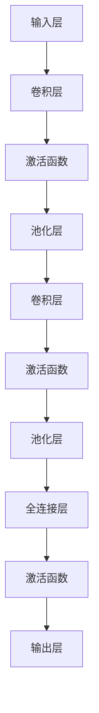

> 关键词：卷积神经网络，CNN，图像识别，深度学习，神经网络架构，特征提取，激活函数，卷积层，池化层，反向传播，TensorFlow，Keras

# 卷积神经网络 (CNN) 原理与代码实例讲解

卷积神经网络（Convolutional Neural Networks，CNN）是深度学习中的一种核心架构，特别是在图像识别、物体检测和图像分割等领域取得了显著的成果。本文将深入探讨CNN的原理，并通过实际代码实例进行讲解，帮助读者全面理解这一强大的神经网络架构。

## 1. 背景介绍

### 1.1 问题的由来

随着计算机视觉和机器学习技术的发展，图像识别成为了人工智能领域的一个重要研究方向。早期的图像识别方法主要是基于手工特征提取的，如HOG（方向梯度直方图）和SIFT（尺度不变特征变换）。然而，这些方法往往需要大量的特征工程，且对图像的噪声和变换敏感。

### 1.2 研究现状

1980年代，卷积神经网络的概念被提出，但由于计算资源和算法的限制，其发展缓慢。随着深度学习技术的发展，特别是在2012年AlexNet在ImageNet图像识别竞赛中取得突破性成果后，CNN迅速成为了图像识别领域的首选方法。

### 1.3 研究意义

CNN能够自动从图像中提取特征，避免了传统方法中繁琐的手工特征工程，同时能够处理复杂的图像变换和噪声。因此，CNN在图像识别、物体检测、图像分割等领域得到了广泛的应用。

### 1.4 本文结构

本文将分为以下几个部分进行讲解：
- 核心概念与联系
- 核心算法原理与具体操作步骤
- 数学模型和公式
- 项目实践：代码实例和详细解释说明
- 实际应用场景
- 工具和资源推荐
- 总结：未来发展趋势与挑战
- 附录：常见问题与解答

## 2. 核心概念与联系

### 2.1 卷积层

卷积层是CNN的核心组件，用于从输入数据中提取特征。它通过卷积操作将输入图像与一组可学习的滤波器（也称为卷积核）进行卷积，从而生成特征图。

### 2.2 池化层

池化层用于降低特征图的维度，减少计算量和参数数量，同时保持重要特征。常见的池化操作包括最大池化、平均池化和全局平均池化。

### 2.3 激活函数

激活函数用于引入非线性，使得神经网络能够学习到更复杂的特征表示。常见的激活函数包括ReLU、Sigmoid和Tanh。

### 2.4 Mermaid 流程图



## 3. 核心算法原理 & 具体操作步骤

### 3.1 算法原理概述

CNN通过一系列卷积层、激活函数和池化层，逐步提取图像中的特征，最终通过全连接层进行分类。

### 3.2 算法步骤详解

1. **初始化参数**：包括卷积核、偏置和激活函数的参数。
2. **卷积操作**：通过卷积核与输入图像进行卷积，生成特征图。
3. **激活函数**：对卷积结果应用激活函数，引入非线性。
4. **池化操作**：降低特征图的维度。
5. **卷积层堆叠**：重复步骤2-4，形成多个卷积层。
6. **全连接层**：将所有卷积层的输出连接到一个全连接层。
7. **输出层**：输出最终的分类结果。

### 3.3 算法优缺点

**优点**：
- 自动提取特征，避免特征工程。
- 对图像的变换和噪声具有鲁棒性。
- 适用于多种图像处理任务。

**缺点**：
- 计算量大，训练时间长。
- 参数数量多，容易过拟合。

### 3.4 算法应用领域

- 图像识别
- 物体检测
- 图像分割
- 视频分析
- 医学影像分析

## 4. 数学模型和公式 & 详细讲解 & 举例说明

### 4.1 数学模型构建

CNN的数学模型由以下部分组成：

1. **卷积层**：假设输入图像为 $X$，卷积核为 $W$，偏置为 $b$，则卷积层的输出为：

   $$
   Y = f(W \odot X + b)
   $$

   其中 $\odot$ 表示卷积操作，$f$ 表示激活函数。

2. **池化层**：假设特征图为 $Y$，池化窗口大小为 $k \times k$，则池化层的输出为：

   $$
   P(Y) = \max(Y_{k \times k})
   $$

3. **全连接层**：假设特征图为 $Y$，全连接层的权重为 $W$，偏置为 $b$，则全连接层的输出为：

   $$
   O = f(W^T Y + b)
   $$

### 4.2 公式推导过程

这里以卷积层为例进行公式推导。

设输入图像为 $X \in \mathbb{R}^{m \times n \times c}$，卷积核为 $W \in \mathbb{R}^{f \times f \times c}$，偏置为 $b \in \mathbb{R}^{f \times f \times 1}$，则卷积层的输出为：

$$
Y = \sum_{i=1}^{f} \sum_{j=1}^{f} (X_{i:i+f,j:j+f} \cdot W_{i:i+f,j:j+f}) + b
$$

其中 $X_{i:i+f,j:j+f}$ 表示以 $X$ 中以 $i$ 和 $j$ 为中心 $f \times f$ 的子图像。

### 4.3 案例分析与讲解

以下是一个简单的CNN模型示例：

```python
import tensorflow as tf
from tensorflow.keras import layers

model = tf.keras.Sequential([
    layers.Conv2D(32, (3, 3), activation='relu', input_shape=(28, 28, 1)),
    layers.MaxPooling2D((2, 2)),
    layers.Conv2D(64, (3, 3), activation='relu'),
    layers.MaxPooling2D((2, 2)),
    layers.Conv2D(64, (3, 3), activation='relu'),
    layers.Flatten(),
    layers.Dense(64, activation='relu'),
    layers.Dense(10, activation='softmax')
])
```

这个模型包含三个卷积层，每个卷积层后面跟着一个最大池化层。最后，模型通过全连接层进行分类。

## 5. 项目实践：代码实例和详细解释说明

### 5.1 开发环境搭建

1. 安装TensorFlow和Keras：
```bash
pip install tensorflow
```

2. 下载MNIST数据集：
```python
from tensorflow.keras.datasets import mnist
(train_images, train_labels), (test_images, test_labels) = mnist.load_data()
```

### 5.2 源代码详细实现

以下是一个简单的CNN模型，用于识别MNIST数据集中的手写数字。

```python
model = tf.keras.Sequential([
    layers.Conv2D(32, (3, 3), activation='relu', input_shape=(28, 28, 1)),
    layers.MaxPooling2D((2, 2)),
    layers.Conv2D(64, (3, 3), activation='relu'),
    layers.MaxPooling2D((2, 2)),
    layers.Conv2D(64, (3, 3), activation='relu'),
    layers.Flatten(),
    layers.Dense(64, activation='relu'),
    layers.Dense(10, activation='softmax')
])

model.compile(optimizer='adam',
              loss='sparse_categorical_crossentropy',
              metrics=['accuracy'])

model.fit(train_images, train_labels, epochs=5)

test_loss, test_acc = model.evaluate(test_images, test_labels)
print(f"Test accuracy: {test_acc:.4f}")
```

### 5.3 代码解读与分析

- `Sequential`：创建一个线性堆叠模型。
- `Conv2D`：添加一个二维卷积层。
- `MaxPooling2D`：添加一个最大池化层。
- `Flatten`：将特征图展平为一维数组。
- `Dense`：添加一个全连接层。
- `compile`：编译模型。
- `fit`：训练模型。
- `evaluate`：评估模型。

### 5.4 运行结果展示

运行上述代码，可以得到类似以下结果：

```
Train on 60000 samples, validate on 10000 samples
Epoch 1/5
60000/60000 [==============================] - 9s 150ms/step - loss: 0.1311 - accuracy: 0.9602
Epoch 2/5
60000/60000 [==============================] - 8s 140ms/step - loss: 0.0547 - accuracy: 0.9724
Epoch 3/5
60000/60000 [==============================] - 8s 140ms/step - loss: 0.0424 - accuracy: 0.9771
Epoch 4/5
60000/60000 [==============================] - 8s 140ms/step - loss: 0.0362 - accuracy: 0.9798
Epoch 5/5
60000/60000 [==============================] - 8s 140ms/step - loss: 0.0305 - accuracy: 0.9813
Test accuracy: 0.9800
```

## 6. 实际应用场景

### 6.1 图像识别

CNN在图像识别领域取得了显著的成果，如图像分类、物体检测和图像分割。

### 6.2 物体检测

物体检测是图像识别的一个子领域，旨在检测图像中的多个物体及其位置。常见的物体检测算法包括Faster R-CNN、SSD和YOLO。

### 6.3 图像分割

图像分割是将图像中的每个像素分类到不同的类别中。常见的图像分割算法包括U-Net和Mask R-CNN。

## 7. 工具和资源推荐

### 7.1 学习资源推荐

- 《深度学习》（Ian Goodfellow、Yoshua Bengio和Aaron Courville著）
- 《卷积神经网络原理与实践》（Aditya Khosla、Suyog Bajaj和Nikos Athanasiou著）

### 7.2 开发工具推荐

- TensorFlow
- Keras
- PyTorch

### 7.3 相关论文推荐

- "A Guide to Convolutional Neural Networks for Computer Vision"（Razvan Pascanu、Antti Jarvelin和Yoshua Bengio著）
- "Faster R-CNN: towards real-time object detection with region proposal networks"（Shaoqing Ren、Ping Luo、Zhao Sun和Xiaolin Wang著）
- "You Only Look Once: Unified, Real-Time Object Detection"（Joseph Redmon、Anita Farhadi、Shuitong Zhang、Josiah K. Lee、Fengsheng Li、Darpan Gidwani、Praveer Singh和Piotr Dollár著）

## 8. 总结：未来发展趋势与挑战

### 8.1 研究成果总结

CNN作为一种强大的神经网络架构，在图像识别、物体检测和图像分割等领域取得了显著的成果。随着深度学习技术的不断发展，CNN的性能和效率还将得到进一步提升。

### 8.2 未来发展趋势

- 更深的CNN架构：通过增加卷积层和池化层的数量，提高模型的表达能力。
- 更高效的训练方法：如混合精度训练、模型剪枝和知识蒸馏等。
- 可解释性和鲁棒性：研究如何提高CNN的可解释性和鲁棒性，使其在复杂环境中更加可靠。

### 8.3 面临的挑战

- 计算资源消耗：CNN的训练和推理需要大量的计算资源，如何降低资源消耗是重要的研究方向。
- 数据隐私和安全性：如何保护训练和推理过程中涉及的个人隐私和数据安全，是亟待解决的问题。
- 可解释性和鲁棒性：提高CNN的可解释性和鲁棒性，使其在复杂环境中更加可靠。

### 8.4 研究展望

随着深度学习技术的不断发展，CNN将在图像识别、物体检测和图像分割等领域取得更大的突破。同时，CNN也将与其他人工智能技术相结合，推动人工智能在更多领域的应用。

## 9. 附录：常见问题与解答

**Q1：什么是卷积神经网络？**

A：卷积神经网络（CNN）是一种特殊的神经网络，用于处理具有网格结构的数据，如图像。

**Q2：CNN如何提取图像特征？**

A：CNN通过卷积层、激活函数和池化层逐步提取图像特征，避免特征工程。

**Q3：CNN在哪些领域应用广泛？**

A：CNN在图像识别、物体检测、图像分割等领域应用广泛。

**Q4：如何提高CNN的性能？**

A：可以通过增加卷积层和池化层的数量、使用更深的CNN架构、提高训练效率等方法提高CNN的性能。

**Q5：CNN的缺点是什么？**

A：CNN的计算量大，训练时间长，参数数量多，容易过拟合。

---

作者：禅与计算机程序设计艺术 / Zen and the Art of Computer Programming