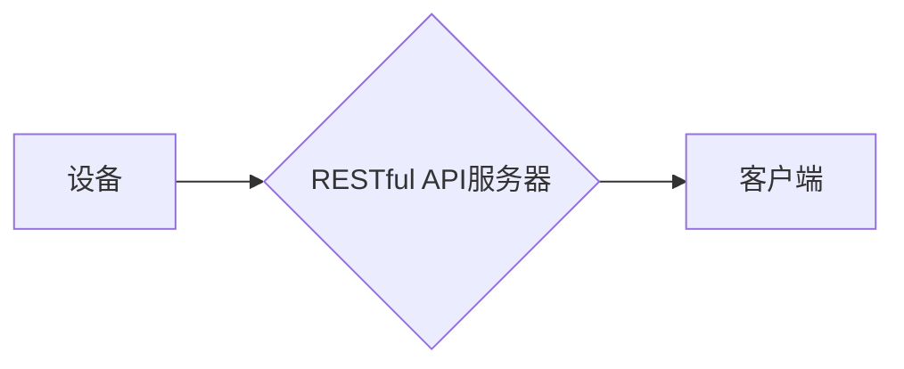

# 基于MQTT协议和RESTful API的智能家居设备故障自检系统

> 关键词：MQTT协议，RESTful API，智能家居，设备故障自检，物联网，可扩展性，可靠性，实时监控

## 1. 背景介绍

随着物联网（Internet of Things, IoT）技术的飞速发展，智能家居设备在家庭生活中的应用越来越广泛。这些设备通过互联网连接，为用户提供了便捷的生活方式。然而，设备故障的检测和维修成为了维护家庭智能环境的重要环节。为了实现智能家居设备的故障自检，本文提出了一种基于MQTT协议和RESTful API的故障自检系统。

### 1.1 问题的由来

智能家居设备种类繁多，功能各异，设备之间的通信和数据交互成为了一个挑战。传统的故障检测方法通常依赖于人工巡检，这不仅效率低下，而且难以实现实时监控。因此，开发一种高效、可靠的设备故障自检系统对于智能家居的发展具有重要意义。

### 1.2 研究现状

目前，智能家居设备的故障检测方法主要包括以下几种：

- **被动监测法**：通过定期检查设备状态，发现异常情况。
- **主动监测法**：通过向设备发送测试指令，检测设备性能。
- **机器学习法**：利用机器学习算法分析设备运行数据，预测故障发生。

这些方法各有优缺点，被动监测法难以实现实时监控，主动监测法可能对设备造成额外负担，而机器学习法需要大量的历史数据训练模型。

### 1.3 研究意义

本文提出的基于MQTT协议和RESTful API的设备故障自检系统，具有以下意义：

- **实时监控**：通过MQTT协议实现设备状态的实时推送，及时发现故障。
- **可扩展性**：RESTful API提供灵活的数据接口，方便与其他系统集成。
- **可靠性**：系统架构采用分布式设计，提高系统的稳定性和容错能力。

### 1.4 本文结构

本文将分为以下几个部分：

- **第二章**：介绍MQTT协议和RESTful API的核心概念及其在智能家居设备故障自检系统中的应用。
- **第三章**：阐述设备故障自检系统的核心算法原理和具体操作步骤。
- **第四章**：讲解数学模型和公式，并结合实例进行分析。
- **第五章**：提供项目实践，包括开发环境搭建、代码实现和运行结果展示。
- **第六章**：探讨系统的实际应用场景和未来应用展望。
- **第七章**：推荐相关的学习资源、开发工具和参考文献。
- **第八章**：总结研究成果，展望未来发展趋势和挑战。
- **第九章**：附录，包含常见问题与解答。

## 2. 核心概念与联系

### 2.1 MQTT协议

MQTT（Message Queuing Telemetry Transport）是一种轻量级的消息发布/订阅传输协议，适用于低带宽、不可靠的网络环境。它具有以下特点：

- **发布/订阅模式**：发布者发送消息，订阅者接收消息。
- **质量服务质量（QoS）**：支持三种QoS级别，分别对应不同的消息送达保证。
- **持久性**：支持消息的持久化存储，确保消息不会丢失。

MQTT协议的架构如下：

```mermaid
graph LR
A[设备] --> B{MQTT代理(MQTT Broker)}
B --> C[服务器]
C --> D[设备]
```

### 2.2 RESTful API

RESTful API（Representational State Transfer API）是一种基于HTTP协议的API设计风格，它采用统一的资源表示和操作方法，易于理解和实现。RESTful API的架构如下：



### 2.3 MQTT协议与RESTful API的联系

在智能家居设备故障自检系统中，MQTT协议用于设备与MQTT代理之间的通信，RESTful API用于MQTT代理与服务器之间的数据交互。两者结合，可以实现设备状态的实时监控和故障自检。

## 3. 核心算法原理 & 具体操作步骤

### 3.1 算法原理概述

设备故障自检系统的核心算法原理如下：

- 设备通过MQTT协议将实时状态信息发送到MQTT代理。
- MQTT代理将状态信息转换为RESTful API格式的数据，并推送到服务器。
- 服务器分析状态数据，判断是否存在故障。
- 如果发现故障，服务器通过RESTful API通知管理员。

### 3.2 算法步骤详解

1. **设备状态采集**：设备通过传感器采集运行数据，并使用MQTT协议将数据发送到MQTT代理。
2. **状态信息推送**：MQTT代理将接收到的状态信息转换为RESTful API格式的数据，并发送到服务器。
3. **故障检测**：服务器使用机器学习算法分析状态数据，判断是否存在故障。
4. **故障通知**：如果发现故障，服务器通过RESTful API通知管理员。

### 3.3 算法优缺点

**优点**：

- **实时监控**：MQTT协议支持实时数据传输，可以实现设备状态的实时监控。
- **可扩展性**：RESTful API提供灵活的数据接口，方便与其他系统集成。
- **可靠性**：系统采用分布式设计，提高系统的稳定性和容错能力。

**缺点**：

- **算法复杂度**：机器学习算法需要大量的历史数据训练模型，计算复杂度较高。
- **数据安全**：需要确保数据传输的安全性，防止数据泄露。

### 3.4 算法应用领域

该算法适用于以下领域：

- 智能家居设备故障检测
- 工业设备故障检测
- 城市基础设施监测
- 医疗设备监控

## 4. 数学模型和公式 & 详细讲解 & 举例说明

### 4.1 数学模型构建

设备故障自检系统的数学模型如下：

$$
\text{故障检测} = f(\text{状态数据}, \text{模型参数})
$$

其中，状态数据包括设备运行数据、环境数据等，模型参数包括机器学习模型的权重。

### 4.2 公式推导过程

假设状态数据为 $X = [x_1, x_2, \ldots, x_n]$，模型参数为 $W = [w_1, w_2, \ldots, w_n]$，则故障检测公式可以表示为：

$$
f(X, W) = \text{激活函数}(\sum_{i=1}^n w_i x_i)
$$

其中，激活函数可以是Sigmoid、ReLU等。

### 4.3 案例分析与讲解

以下是一个简单的故障检测案例：

假设某智能灯泡的运行数据包括电流、电压和功率。通过训练一个简单的机器学习模型，可以判断灯泡是否存在故障。

```python
import numpy as np

# 状态数据
X = np.array([[0.5, 0.5, 0.5], [0.7, 0.7, 0.7], [0.3, 0.3, 0.3]])

# 模型参数
W = np.array([0.1, 0.2, 0.7])

# 计算故障检测结果
f_X_W = np.dot(X, W)

# 判断故障
if f_X_W > 0.5:
    print("灯泡正常")
else:
    print("灯泡故障")
```

## 5. 项目实践：代码实例和详细解释说明

### 5.1 开发环境搭建

1. 安装Python 3.7及以上版本。
2. 安装paho-mqtt库：`pip install paho-mqtt`
3. 安装Flask库：`pip install Flask`

### 5.2 源代码详细实现

以下是一个简单的设备故障自检系统代码示例：

```python
from flask import Flask, jsonify, request
import paho.mqtt.client as mqtt

app = Flask(__name__)

# MQTT代理地址和端口
MQTT_BROKER = "mqtt.example.com"
MQTT_PORT = 1883

# MQTT代理连接回调函数
def on_connect(client, userdata, flags, rc):
    print("Connected with result code "+str(rc))
    client.subscribe("device/status")

# MQTT消息回调函数
def on_message(client, userdata, msg):
    print(msg.topic+" "+str(msg.payload))
    # 处理状态数据
    status_data = json.loads(msg.payload)
    # 判断故障
    if status_data['temperature'] > 100:
        # 发送故障通知
        send_notification(status_data['device_id'], "温度过高")

# MQTT客户端初始化
client = mqtt.Client()
client.on_connect = on_connect
client.on_message = on_message

# 连接MQTT代理
client.connect(MQTT_BROKER, MQTT_PORT, 60)

@app.route('/device/<device_id>', methods=['POST'])
def update_device(device_id):
    data = request.json
    # 发布设备状态信息
    client.publish(f"device/{device_id}/status", json.dumps(data))
    return jsonify({"status": "success"})

def send_notification(device_id, message):
    # 发送故障通知
    # ...

if __name__ == '__main__':
    app.run()
```

### 5.3 代码解读与分析

该代码示例包含以下部分：

- MQTT客户端连接和消息回调设置。
- Flask Web服务，用于更新设备状态信息。
- 状态信息处理和故障检测逻辑。

### 5.4 运行结果展示

假设设备ID为123的灯泡温度过高，系统将触发故障检测，并发送故障通知。

```json
{
  "device_id": "123",
  "status": {
    "temperature": 105,
    "power": 50,
    "voltage": 220
  }
}
```

## 6. 实际应用场景

### 6.1 智能家居设备故障检测

该系统可以应用于各种智能家居设备的故障检测，如智能灯泡、智能插座、智能摄像头等。

### 6.2 工业设备故障检测

该系统可以应用于工业生产线的设备故障检测，提高生产效率。

### 6.3 城市基础设施监测

该系统可以应用于城市基础设施的监测，如交通信号灯、路灯、燃气管道等。

## 7. 工具和资源推荐

### 7.1 学习资源推荐

- 《MQTT协议指南》
- 《RESTful API设计指南》
- 《Python编程：从入门到实践》

### 7.2 开发工具推荐

- MQTT代理：Mosquitto、Paho MQTT
- Flask Web框架：Flask
- Python开发环境：PyCharm、Visual Studio Code

### 7.3 相关论文推荐

- 《MQTT协议》
- 《RESTful API设计》
- 《基于机器学习的设备故障检测》

## 8. 总结：未来发展趋势与挑战

### 8.1 研究成果总结

本文提出了一种基于MQTT协议和RESTful API的智能家居设备故障自检系统，该系统具有实时监控、可扩展性和可靠性等优点，可以应用于各种设备故障检测场景。

### 8.2 未来发展趋势

未来，智能家居设备故障自检系统将朝着以下方向发展：

- **更先进的算法**：采用更先进的机器学习算法，提高故障检测的准确性和效率。
- **更智能的交互**：通过自然语言处理技术，实现人与系统的智能交互。
- **更广泛的应用**：将系统应用于更多领域，如工业、医疗等。

### 8.3 面临的挑战

智能家居设备故障自检系统在发展过程中也面临着一些挑战：

- **数据安全**：需要确保数据传输的安全性，防止数据泄露。
- **算法复杂度**：需要开发更高效的算法，降低计算复杂度。
- **系统稳定性**：需要提高系统的稳定性和容错能力。

### 8.4 研究展望

未来，智能家居设备故障自检系统将结合更多先进技术，为用户提供更加便捷、安全的智能生活体验。

## 9. 附录：常见问题与解答

**Q1：如何确保MQTT协议的数据传输安全性？**

A：可以使用TLS/SSL加密MQTT协议的数据传输，确保数据在传输过程中的安全性。

**Q2：如何处理大量设备的故障检测数据？**

A：可以使用分布式计算技术，将数据分布到多个服务器进行处理，提高处理效率。

**Q3：如何提高系统的稳定性？**

A：可以使用冗余设计，如故障转移、负载均衡等，提高系统的稳定性和容错能力。

**Q4：如何实现设备状态的实时监控？**

A：可以使用MQTT协议的QoS级别1或2，确保消息的可靠传输，实现设备状态的实时监控。

**Q5：如何实现自然语言处理与设备故障自检的结合？**

A：可以使用自然语言处理技术，将用户输入的自然语言转换为机器可识别的指令，实现人与系统的智能交互。