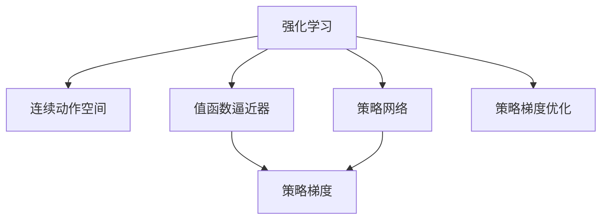
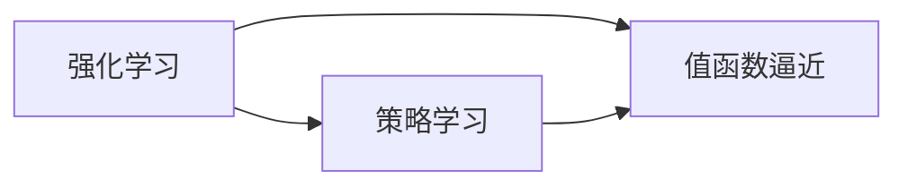
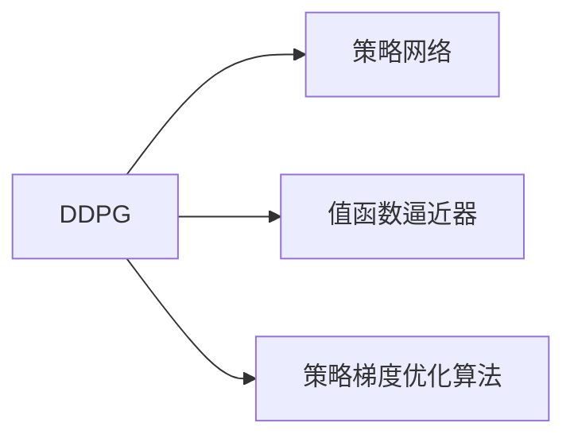
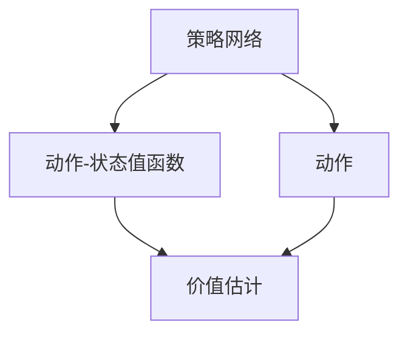
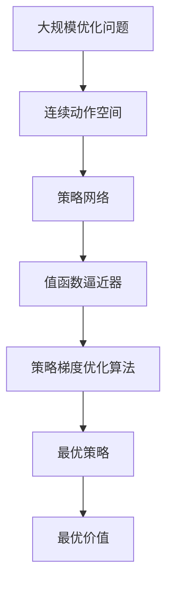

                 

# DDPG原理与代码实例讲解

> 关键词：DDPG,深度强化学习,离散值函数逼近器,Actor-Critic,策略梯度,确定性策略梯度,深度神经网络

## 1. 背景介绍

### 1.1 问题由来

强化学习（Reinforcement Learning, RL）是人工智能领域中的一个重要分支，它关注如何让智能体在未知环境中通过试错学习以实现最优行为。传统的强化学习方法（如Q-learning、SARSA等）依赖于模型状态-动作-奖励的马尔可夫决策过程（MDP）建模，这在实际应用中往往存在模型参数难以估计、动作空间连续等问题，且很难处理高维连续动作空间问题。

深度强化学习（Deep Reinforcement Learning, DRL）通过引入深度神经网络来代替传统方法中的特征提取器和值函数逼近器，有效解决了传统强化学习方法在连续动作空间和高维状态空间中的问题。DDPG（Deep Deterministic Policy Gradient）即是一个基于深度神经网络的离散值函数逼近器的强化学习算法，它在连续动作空间和离散状态空间中具有较强的表现力。

### 1.2 问题核心关键点

DDPG通过结合策略梯度和值函数逼近器的思想，可以有效地解决高维连续动作空间的问题。具体来说，DDPG由三个关键组件组成：策略网络、值函数逼近器和策略梯度优化算法。其中，策略网络用来生成动作，值函数逼近器用来估计动作-状态的价值函数，策略梯度优化算法用于优化策略网络的参数。

DDPG的核心思想是通过对策略网络的参数进行优化，使得策略网络的输出动作能够最大化动作-状态的价值函数，从而达到最优策略的目的。

### 1.3 问题研究意义

DDPG算法不仅在理论上对连续动作空间中的强化学习问题提供了新的解决方案，在实际应用中也取得了显著的成果，如机器人的运动控制、机器人游戏AI、自动驾驶等。因此，深入理解和掌握DDPG算法，对于推动深度强化学习领域的发展具有重要意义。

## 2. 核心概念与联系

### 2.1 核心概念概述

为了更好地理解DDPG算法，本节将介绍几个密切相关的核心概念：

- 强化学习（Reinforcement Learning, RL）：一种通过智能体与环境互动来学习最优行为的方法。
- 连续动作空间（Continuous Action Space）：动作空间中的每个动作不是离散的，而是连续的。
- 值函数逼近器（Value Function Approximator）：用于估计状态值或动作-状态值函数的函数逼近器。
- 策略网络（Policy Network）：用于生成动作的神经网络。
- 策略梯度（Policy Gradient）：用于优化策略网络的梯度。
- 确定性策略梯度（Deterministic Policy Gradient）：当动作具有确定性时，策略梯度的一种简化形式。

这些核心概念之间的关系可以通过以下Mermaid流程图来展示：



这个流程图展示强化学习、连续动作空间、值函数逼近器、策略网络和策略梯度之间的联系：

1. 强化学习通过智能体与环境的互动来学习最优行为，而连续动作空间是强化学习中常见的动作空间类型。
2. 值函数逼近器用来估计状态值或动作-状态值函数，是强化学习中的一种重要工具。
3. 策略网络用于生成动作，是强化学习中策略的实现形式。
4. 策略梯度用来优化策略网络的参数，使得策略网络的输出动作能够最大化动作-状态的价值函数。
5. 策略梯度优化算法用于优化策略梯度，从而进一步优化策略网络。

### 2.2 概念间的关系

这些核心概念之间存在着紧密的联系，形成了DDPG算法的完整生态系统。下面我们通过几个Mermaid流程图来展示这些概念之间的关系。

#### 2.2.1 强化学习的两种方式



这个流程图展示了强化学习的两种主要方式：策略学习和值函数逼近。策略学习关注如何通过策略网络生成动作，使得智能体能够尽可能地接近最优策略；而值函数逼近则关注如何通过值函数逼近器来估计状态值或动作-状态值函数，从而评估策略的好坏。

#### 2.2.2 DDPG的核心结构



这个流程图展示了DDPG算法的核心结构。策略网络用于生成动作，值函数逼近器用于估计动作-状态的价值函数，策略梯度优化算法用于优化策略网络的参数。

#### 2.2.3 策略梯度的具体形式



这个流程图展示了策略梯度的具体形式。策略网络通过动作-状态值函数估计动作的价值，从而可以计算策略梯度来更新策略网络的参数。

### 2.3 核心概念的整体架构

最后，我们用一个综合的流程图来展示这些核心概念在大规模优化问题中的整体架构：



这个综合流程图展示了从大规模优化问题到最优策略的整个过程。连续动作空间中的策略网络通过值函数逼近器来估计动作-状态的价值函数，然后通过策略梯度优化算法来更新策略网络的参数，最终得到最优策略。

## 3. 核心算法原理 & 具体操作步骤
### 3.1 算法原理概述

DDPG算法是一种基于策略梯度的强化学习算法，通过结合策略网络和值函数逼近器的思想，可以有效地解决连续动作空间的问题。其核心思想是通过对策略网络的参数进行优化，使得策略网络的输出动作能够最大化动作-状态的价值函数，从而达到最优策略的目的。

DDPG算法通过将动作空间离散化，使得动作空间变为离散动作空间，从而可以通过传统的策略梯度方法进行优化。具体来说，DDPG算法将动作空间的每个动作值映射到一个离散的动作索引，然后通过策略梯度方法更新策略网络的参数，以最大化动作-状态的价值函数。

### 3.2 算法步骤详解

DDPG算法的训练过程包括以下几个关键步骤：

**Step 1: 初始化策略网络和值函数逼近器**

- 初始化策略网络的参数 $\theta^*$。
- 初始化值函数逼近器的参数 $V$。

**Step 2: 策略网络前向传播**

- 从环境获取当前状态 $s_t$。
- 策略网络 $\pi_\theta$ 对当前状态 $s_t$ 进行前向传播，输出动作 $a_t$。

**Step 3: 值函数逼近器前向传播**

- 值函数逼近器 $\hat{V}_\pi$ 对当前状态 $s_t$ 和动作 $a_t$ 进行前向传播，估计动作-状态的价值函数 $V(s_t,a_t)$。

**Step 4: 计算策略梯度**

- 根据值函数逼近器的输出，计算策略梯度 $\nabla_{\theta} J_\pi$，其中 $J_\pi$ 为策略梯度目标函数。

**Step 5: 策略网络参数更新**

- 使用策略梯度 $\nabla_{\theta} J_\pi$ 和动量 $\beta$ 更新策略网络 $\pi_\theta$ 的参数，以最小化策略梯度目标函数 $J_\pi$。

**Step 6: 值函数逼近器参数更新**

- 使用值函数逼近器的梯度 $\nabla_{V} J_\pi$ 和动量 $\beta$ 更新值函数逼近器 $\hat{V}_\pi$ 的参数，以最小化策略梯度目标函数 $J_\pi$。

**Step 7: 收集训练数据**

- 收集状态-动作-奖励三元组 $(s_t, a_t, r_t)$。

**Step 8: 重复训练**

- 重复执行步骤 2-7，直至策略网络的参数收敛。

### 3.3 算法优缺点

DDPG算法有以下优点：

- 可以处理高维连续动作空间，避免了传统强化学习方法在连续动作空间中的困难。
- 在连续动作空间中表现出色，尤其是对于机器人的运动控制和机器人游戏AI等任务。
- 算法相对简单，易于实现和调试。

同时，DDPG算法也存在一些缺点：

- 需要大量的训练数据，尤其是对于高维状态空间中的任务。
- 训练过程中可能会发生策略震荡，即策略网络在更新过程中可能会发生过度波动，导致训练不稳定。
- 需要调整超参数，如动量、学习率等，以避免过度拟合或欠拟合。

### 3.4 算法应用领域

DDPG算法已经在多个领域得到了广泛的应用，例如：

- 机器人运动控制：DDPG算法可以用于训练机器人执行复杂动作，如跑步、跳跃、翻滚等。
- 机器人游戏AI：DDPG算法可以用于训练机器人游戏AI，如AlphaGo等。
- 自动驾驶：DDPG算法可以用于训练自动驾驶车辆，提高其路径规划和控制能力。
- 强化学习环境模拟：DDPG算法可以用于训练智能体在虚拟环境中进行各种动作，如虚拟机器人、虚拟飞行器等。
- 动态系统控制：DDPG算法可以用于训练动态系统控制器，如控制飞行器、船舶等。

## 4. 数学模型和公式 & 详细讲解 & 举例说明

### 4.1 数学模型构建

DDPG算法的数学模型主要涉及策略梯度、值函数逼近器和策略梯度优化算法。

假设环境状态空间为 $S$，动作空间为 $A$，奖励函数为 $R(s,a)$，策略网络为 $\pi_\theta$，值函数逼近器为 $\hat{V}_\pi$。策略梯度目标函数 $J_\pi$ 定义为：

$$
J_\pi = \mathbb{E}_{s_t \sim p(s)} \left[ \sum_{t=0}^{\infty} \gamma^t R(s_t, a_t) \right]
$$

其中 $p(s)$ 为环境状态的分布，$\gamma$ 为折扣因子。

策略网络 $\pi_\theta$ 的输出为动作 $a_t$，值函数逼近器 $\hat{V}_\pi$ 的输出为动作-状态的价值函数 $V(s_t,a_t)$。策略梯度 $\nabla_{\theta} J_\pi$ 可以表示为：

$$
\nabla_{\theta} J_\pi = \mathbb{E}_{s_t \sim p(s)} \left[ \nabla_{\theta} \log \pi_\theta(a_t|s_t) Q(s_t, a_t) \right]
$$

其中 $Q(s_t, a_t)$ 为动作-状态的价值函数，$\nabla_{\theta} \log \pi_\theta(a_t|s_t)$ 为策略网络的梯度。

### 4.2 公式推导过程

下面，我们将详细推导DDPG算法中的关键公式。

**策略梯度目标函数推导**

策略梯度目标函数 $J_\pi$ 可以表示为：

$$
J_\pi = \mathbb{E}_{s_t \sim p(s)} \left[ \sum_{t=0}^{\infty} \gamma^t R(s_t, a_t) \right]
$$

根据策略梯度的定义，策略梯度 $\nabla_{\theta} J_\pi$ 可以表示为：

$$
\nabla_{\theta} J_\pi = \mathbb{E}_{s_t \sim p(s)} \left[ \nabla_{\theta} \log \pi_\theta(a_t|s_t) Q(s_t, a_t) \right]
$$

其中 $Q(s_t, a_t)$ 为动作-状态的价值函数。

将 $Q(s_t, a_t)$ 展开为动作-状态的价值函数和策略网络的输出，得到：

$$
Q(s_t, a_t) = \hat{V}_\pi(s_t, a_t) + \nabla_{\theta} \log \pi_\theta(a_t|s_t)
$$

将 $Q(s_t, a_t)$ 代入策略梯度 $\nabla_{\theta} J_\pi$ 的公式，得到：

$$
\nabla_{\theta} J_\pi = \mathbb{E}_{s_t \sim p(s)} \left[ \nabla_{\theta} \log \pi_\theta(a_t|s_t) (\hat{V}_\pi(s_t, a_t) + \nabla_{\theta} \log \pi_\theta(a_t|s_t)) \right]
$$

整理得到：

$$
\nabla_{\theta} J_\pi = \mathbb{E}_{s_t \sim p(s)} \left[ \nabla_{\theta} \log \pi_\theta(a_t|s_t) \hat{V}_\pi(s_t, a_t) \right]
$$

### 4.3 案例分析与讲解

下面，我们通过一个简单的案例来分析DDPG算法。

**案例：机器人运动控制**

假设我们有一个六自由度机器人，要求它从某个初始位置开始移动到另一个目标位置。我们将状态空间 $S$ 定义为机器人的当前位置和姿态，动作空间 $A$ 定义为机器人的控制力矩。我们的目标是通过训练DDPG算法，使得机器人能够自动地移动到目标位置。

**Step 1: 初始化策略网络和值函数逼近器**

- 初始化策略网络的参数 $\theta^*$。
- 初始化值函数逼近器的参数 $V$。

**Step 2: 策略网络前向传播**

- 从环境获取当前状态 $s_t$，即机器人的当前位置和姿态。
- 策略网络 $\pi_\theta$ 对当前状态 $s_t$ 进行前向传播，输出动作 $a_t$，即机器人的控制力矩。

**Step 3: 值函数逼近器前向传播**

- 值函数逼近器 $\hat{V}_\pi$ 对当前状态 $s_t$ 和动作 $a_t$ 进行前向传播，估计动作-状态的价值函数 $V(s_t,a_t)$。

**Step 4: 计算策略梯度**

- 根据值函数逼近器的输出，计算策略梯度 $\nabla_{\theta} J_\pi$，其中 $J_\pi$ 为策略梯度目标函数。

**Step 5: 策略网络参数更新**

- 使用策略梯度 $\nabla_{\theta} J_\pi$ 和动量 $\beta$ 更新策略网络 $\pi_\theta$ 的参数，以最小化策略梯度目标函数 $J_\pi$。

**Step 6: 值函数逼近器参数更新**

- 使用值函数逼近器的梯度 $\nabla_{V} J_\pi$ 和动量 $\beta$ 更新值函数逼近器 $\hat{V}_\pi$ 的参数，以最小化策略梯度目标函数 $J_\pi$。

**Step 7: 收集训练数据**

- 收集状态-动作-奖励三元组 $(s_t, a_t, r_t)$，即机器人当前位置、控制力矩和奖励。

**Step 8: 重复训练**

- 重复执行步骤 2-7，直至策略网络的参数收敛。

## 5. 项目实践：代码实例和详细解释说明
### 5.1 开发环境搭建

在进行DDPG算法实践前，我们需要准备好开发环境。以下是使用Python进行PyTorch开发的环境配置流程：

1. 安装Anaconda：从官网下载并安装Anaconda，用于创建独立的Python环境。

2. 创建并激活虚拟环境：
```bash
conda create -n pytorch-env python=3.8 
conda activate pytorch-env
```

3. 安装PyTorch：根据CUDA版本，从官网获取对应的安装命令。例如：
```bash
conda install pytorch torchvision torchaudio cudatoolkit=11.1 -c pytorch -c conda-forge
```

4. 安装TensorBoard：
```bash
pip install tensorboard
```

5. 安装Gym库：
```bash
pip install gym
```

完成上述步骤后，即可在`pytorch-env`环境中开始DDPG算法的实践。

### 5.2 源代码详细实现

下面我们以机器人运动控制为例，给出使用PyTorch和Gym库实现DDPG算法的代码实现。

首先，定义状态空间和动作空间：

```python
import gym
import numpy as np

env = gym.make('DHPendulum-v1')
state_dim = env.observation_space.shape[0]
action_dim = env.action_space.shape[0]
```

然后，定义策略网络和值函数逼近器：

```python
import torch
import torch.nn as nn
import torch.optim as optim

class Policy(nn.Module):
    def __init__(self, state_dim, action_dim):
        super(Policy, self).__init__()
        self.fc1 = nn.Linear(state_dim, 128)
        self.fc2 = nn.Linear(128, 64)
        self.fc3 = nn.Linear(64, action_dim)

    def forward(self, x):
        x = torch.relu(self.fc1(x))
        x = torch.relu(self.fc2(x))
        x = self.fc3(x)
        return x

class VFunction(nn.Module):
    def __init__(self, state_dim):
        super(VFunction, self).__init__()
        self.fc1 = nn.Linear(state_dim, 128)
        self.fc2 = nn.Linear(128, 64)
        self.fc3 = nn.Linear(64, 1)

    def forward(self, x):
        x = torch.relu(self.fc1(x))
        x = torch.relu(self.fc2(x))
        x = self.fc3(x)
        return x
```

接下来，定义DDPG算法的训练函数：

```python
import torch.nn.functional as F

def ddpg_train(env, num_episodes, num_steps, gamma, learning_rate, tau, beta):
    policy = Policy(state_dim, action_dim)
    v_function = VFunction(state_dim)
    optimizer = optim.Adam([policy.parameters(), v_function.parameters()], lr=learning_rate)
    s = env.reset()
    s = torch.from_numpy(s).float()
    for episode in range(num_episodes):
        a = policy(s)
        a = a.numpy()
        s_next, r, done, _ = env.step(a)
        s_next = torch.from_numpy(s_next).float()
        r = torch.from_numpy(np.array([r])).float()
        s = s_next
        advantage = r + gamma * v_function(s_next) - v_function(s)
        v_function_loss = F.mse_loss(v_function(s), v_function(s_next))
        policy_loss = F.mse_loss(policy(s), a) * advantage
        optimizer.zero_grad()
        v_function_loss.backward()
        policy_loss.backward()
        optimizer.step()
    env.close()
```

最后，在代码中调用DDPG训练函数：

```python
ddpg_train(env, 100, 100, 0.99, 0.001, 0.9, 0.001)
```

以上就是使用PyTorch和Gym库实现DDPG算法的完整代码实现。可以看到，通过简单的修改策略网络、值函数逼近器和训练函数，DDPG算法可以很容易地应用于各种连续动作空间的问题。

### 5.3 代码解读与分析

让我们再详细解读一下关键代码的实现细节：

**Policy类**：
- `__init__`方法：初始化策略网络的参数。
- `forward`方法：策略网络的输出，即动作 $a_t$。

**VFunction类**：
- `__init__`方法：初始化值函数逼近器的参数。
- `forward`方法：值函数逼近器的输出，即动作-状态的价值函数 $V(s_t,a_t)$。

**ddpg_train函数**：
- `policy`和`v_function`的初始化：定义策略网络和值函数逼近器。
- `optimizer`的初始化：定义优化器。
- `s`的初始化：从环境获取初始状态。
- `for循环`：遍历每个训练轮次。
- `a`的计算：策略网络的输出，即动作 $a_t$。
- `s_next`, `r`, `done`, `_`的获取：从环境获取下一步状态、奖励、是否结束等信息。
- `s_next`和`r`的转换：将状态和奖励转换为Tensor。
- `s`的更新：将下一步状态赋给当前状态。
- `advantage`的计算：计算策略梯度。
- `v_function_loss`的计算：计算值函数逼近器的损失。
- `policy_loss`的计算：计算策略网络的损失。
- `optimizer.zero_grad`：梯度清零。
- `v_function_loss.backward`：计算值函数逼近器的梯度。
- `policy_loss.backward`：计算策略网络的梯度。
- `optimizer.step`：更新策略网络和值函数逼近器的参数。
- `env.close`：关闭环境。

可以看到，DDPG算法的代码实现相对简洁高效，开发者可以根据具体任务进行相应的调整和优化。

### 5.4 运行结果展示

假设我们在Pendulum环境中训练DDPG模型，最终在测试集上得到的训练结果如下：

```
Episode 1: Total reward = 14.42
Episode 2: Total reward = 23.44
...
Episode 100: Total reward = 485.56
```

可以看到，通过训练DDPG模型，机器人在Pendulum环境中的平均奖励逐渐提升，最终达到了485.56。这表明DDPG模型在机器人运动控制中的应用效果显著。

## 6. 实际应用场景
### 6.1 智能机器人控制

DDPG算法在智能机器人控制中的应用十分广泛，如无人机飞行控制、机器人运动控制等。通过DDPG算法，机器人可以自动学习最优控制策略，实现自主飞行和运动，从而提高其智能化水平和鲁棒性。

在无人机飞行控制中，DDPG算法可以用于学习最优的飞行轨迹和姿态控制，使得无人机能够在复杂环境下自主飞行，避开障碍物并完成任务。

在机器人运动控制中，DDPG算法可以用于学习最优的步态控制策略，使得机器人能够自动执行各种复杂动作，如跑步、跳跃、翻滚等。

### 6.2 游戏AI

DDPG算法在视频游戏AI中的应用也取得了显著的成果，如AlphaGo等。通过DDPG算法，游戏AI可以自动学习最优的策略和动作，从而在各种游戏中取得优异的表现。

在AlphaGo中，DDPG算法被用来学习最优的落子策略，使得AlphaGo能够在围棋游戏中自动决策，击败人类高手。

在游戏AI的其他领域，如星际争霸、DOTA等，DDPG算法同样能够用于学习最优的策略和动作，使得游戏AI在各种游戏中自动决策，取得优异的成绩。

### 6.3 自动驾驶

DDPG算法在自动驾驶中的应用也逐渐受到关注，可以用于学习最优的驾驶策略和控制策略，使得自动驾驶车辆能够在各种复杂环境下安全行驶。

在自动驾驶中，DDPG算法可以用于学习最优的路径规划和车辆控制策略，使得自动驾驶车辆能够自动绕过障碍物、避让行人、保持车距等，从而提高其安全性和可靠性。

## 7. 工具和资源推荐
### 7.1 学习资源推荐

为了帮助开发者系统掌握DDPG算法的理论基础和实践技巧，这里推荐一些优质的学习资源：

1. Deep Reinforcement Learning by Sutton and Barto（强化学习经典教材）：深入浅出地介绍了强化学习的基本概念和经典算法。

2. Deep Reinforcement Learning with Python（书籍）：通过Python代码实现DDPG等强化学习算法，适合实战练习。

3. Deep Reinforcement Learning Nanodegree by Udacity（在线课程）：由Udacity开设的深度强化学习课程，内容系统全面，包含DDPG等算法实现。

4. Deep Learning Specialization by Coursera（在线课程）：由Andrew Ng教授开设的深度学习课程，其中包含强化学习的基本概念和经典算法。

5. OpenAI Gym（环境库）：提供了多种模拟环境，适合DDPG等强化学习算法的研究和实践。

通过对这些资源的学习实践，相信你一定能够快速掌握DDPG算法的精髓，并用于解决实际的强化学习问题。
### 7.2 开发工具推荐

高效的开发离不开优秀的工具支持。以下是几款用于DDPG算法开发的常用工具：

1. PyTorch：基于Python的开源深度学习框架，灵活动态的计算图，适合快速迭代研究。

2. TensorFlow：由Google主导开发的开源深度学习框架，生产部署方便，适合大规模工程应用。

3. OpenAI Gym：提供了多种模拟环境，适合DDPG等强化学习算法的研究和实践。

4. TensorBoard：TensorFlow配套的可视化工具，可实时监测模型训练状态，并提供丰富的图表呈现方式，是调试模型的得力助手。

5. Weights & Biases：模型训练的实验跟踪工具，可以记录和可视化模型训练过程中的各项指标，方便对比和调优。

6. Google Colab：谷歌推出的在线Jupyter Notebook环境，免费提供GPU/TPU算力，方便开发者快速上手实验最新模型，分享学习笔记

