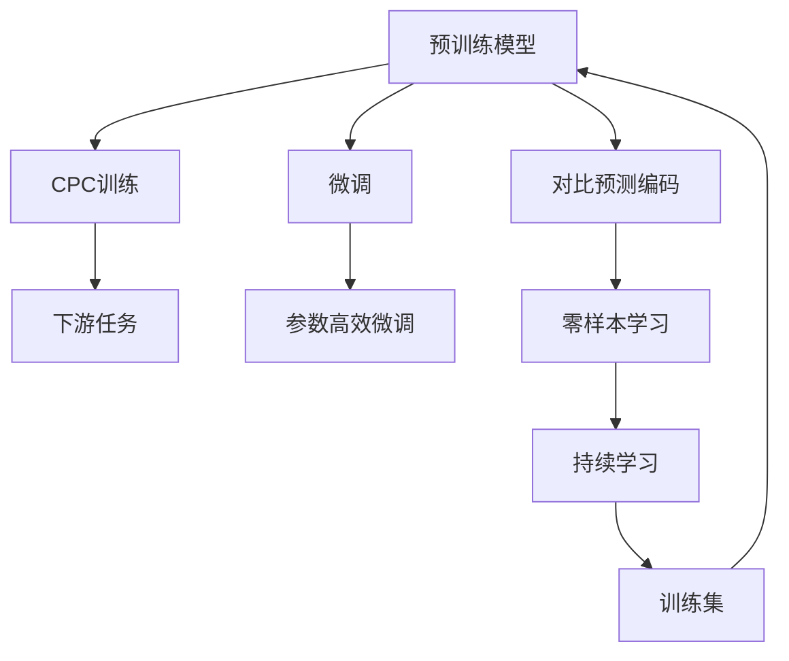
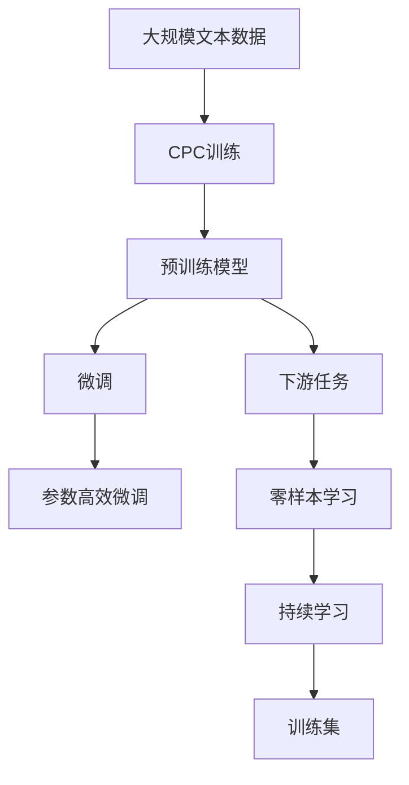

                 

# ELECTRA原理与代码实例讲解

## 1. 背景介绍

ELECTRA（Efficiently Learning Pre-trained Representations of Text from Tokens and their Relationships with a Contrastive Predictive Coding Objective）是一种基于预训练的语言表示学习模型，由Google AI团队在2020年提出。与传统的基于自监督学习的预训练模型如BERT不同，ELECTRA使用了更高效的训练策略——对比预测编码（Contrastive Predictive Coding, CPC），在显著减少计算成本的同时，提升了模型的性能。本文将详细介绍ELECTRA的原理、实现细节，并通过代码实例演示其使用过程。

## 2. 核心概念与联系

### 2.1 核心概念概述

ELECTRA由两个主要部分组成：预训练模型和下游任务的微调。预训练模型使用对比预测编码（CPC）方法进行训练，下游任务使用微调方法进行进一步优化。

- **对比预测编码（CPC）**：CPC是一种自监督学习方法，用于学习输入序列中的token关系。在ELECTRA中，CPC通过预测当前token（目标token）在序列中的位置来进行训练。具体而言，模型先随机掩盖（mask）序列中的某些token，然后根据这些未被掩盖的token预测被掩盖的token。

- **下游任务的微调**：微调是将预训练模型应用于特定下游任务的过程。常见的下游任务包括文本分类、命名实体识别、情感分析等。微调过程通常使用标注数据，通过有监督学习优化模型在特定任务上的性能。

- **参数高效微调（PEFT）**：PEFT是一种只更新模型中特定参数的微调方法，与全参数微调相比，可以节省计算资源。

- **零样本学习（Zero-shot Learning）**：零样本学习指的是模型在未见过的任务上，仅通过任务描述就能进行推理和学习。ELECTRA通过预训练学习到的token关系，可以应用于各种零样本学习任务。

- **持续学习（Continual Learning）**：持续学习是指模型能够不断从新数据中学习，同时保持已学习的知识，避免灾难性遗忘。

### 2.2 核心概念间的关系

ELECTRA的训练和应用流程可以用以下Mermaid流程图表示：



这个流程图展示了ELECTRA的核心概念及其之间的关系：

- 预训练模型通过对比预测编码进行训练。
- 微调将预训练模型应用于特定下游任务。
- 参数高效微调只更新模型中特定参数，以节省计算资源。
- 零样本学习利用预训练模型学习到的token关系，在未见过的任务上进行推理。
- 持续学习使模型能够不断从新数据中学习，避免灾难性遗忘。

### 2.3 核心概念的整体架构

ELECTRA的核心概念架构可以用以下Mermaid流程图表示：



这个综合流程图展示了从预训练到微调，再到下游任务的整体流程：

- 预训练模型通过对比预测编码进行训练。
- 微调将预训练模型应用于特定下游任务。
- 参数高效微调只更新模型中特定参数，以节省计算资源。
- 零样本学习利用预训练模型学习到的token关系，在未见过的任务上进行推理。
- 持续学习使模型能够不断从新数据中学习，避免灾难性遗忘。

## 3. 核心算法原理 & 具体操作步骤

### 3.1 算法原理概述

ELECTRA的训练过程主要分为两个阶段：预训练和微调。预训练阶段使用对比预测编码进行训练，微调阶段根据下游任务的不同，使用不同的任务适配层和损失函数。

### 3.2 算法步骤详解

#### 3.2.1 预训练阶段

ELECTRA的预训练阶段主要使用对比预测编码（CPC）进行训练。其基本步骤如下：

1. 对输入序列进行随机掩盖，保留一部分未被掩盖的token作为上下文。
2. 对于每个上下文，模型分别预测被掩盖的token和该上下文的其他token。
3. 计算预测值与真实值之间的交叉熵损失，并反向传播更新模型参数。

#### 3.2.2 微调阶段

微调阶段主要涉及将预训练模型应用于特定下游任务的过程。具体步骤如下：

1. 选择合适的预训练模型作为初始化参数。
2. 根据下游任务设计合适的任务适配层和损失函数。
3. 使用标注数据进行有监督学习，优化模型参数。
4. 使用微调后的模型进行推理和预测。

### 3.3 算法优缺点

ELECTRA的主要优点包括：

- **高效性**：ELECTRA的对比预测编码方法显著减少了计算成本，使其在大规模数据上训练更加高效。
- **通用性**：ELECTRA可以应用于各种下游任务，具有较强的泛化能力。
- **可解释性**：ELECTRA的训练过程具有较好的可解释性，有助于理解模型的工作原理。

ELECTRA的主要缺点包括：

- **依赖大量标注数据**：ELECTRA的微调过程需要大量标注数据，这对于某些领域来说可能难以获取。
- **模型结构复杂**：ELECTRA的对比预测编码方法使得模型结构较为复杂，增加了实现的难度。
- **可解释性**：尽管ELECTRA的训练过程具有较好的可解释性，但其最终输出仍较为复杂，难以直接解释。

### 3.4 算法应用领域

ELECTRA模型已经在多个领域得到了应用，具体包括：

- **文本分类**：如情感分析、主题分类等。通过微调ELECTRA模型，可以使其对特定任务进行优化，提高分类准确率。
- **命名实体识别**：识别文本中的人名、地名、机构名等特定实体。通过微调ELECTRA模型，可以学习到更准确的实体边界和类型。
- **问答系统**：回答自然语言问题。通过微调ELECTRA模型，可以使其掌握问答任务的知识。
- **机器翻译**：将源语言文本翻译成目标语言。通过微调ELECTRA模型，可以使其学习到语言之间的映射关系。
- **文本摘要**：将长文本压缩成简短摘要。通过微调ELECTRA模型，可以使其学习到文本的最重要部分。
- **对话系统**：使机器能够与人自然对话。通过微调ELECTRA模型，可以使其学习到对话中的上下文理解和回复生成。

## 4. 数学模型和公式 & 详细讲解

### 4.1 数学模型构建

ELECTRA的预训练模型可以表示为：

$$
\hat{y} = \mathcal{F}(\mathcal{G}(x))
$$

其中，$x$ 表示输入序列，$\mathcal{G}(x)$ 表示预训练模型，$\mathcal{F}(x)$ 表示任务适配层，$\hat{y}$ 表示模型输出。

### 4.2 公式推导过程

ELECTRA的预训练过程主要使用对比预测编码（CPC）。假设输入序列为 $x=\{x_1, x_2, ..., x_n\}$，其中 $n$ 为序列长度。模型的预测任务可以表示为：

$$
\mathcal{L} = -\frac{1}{n}\sum_{i=1}^n \sum_{j=1}^{n} [y_j \log P(x_j|x_1, ..., x_{j-1}) + (1-y_j) \log (1-P(x_j|x_1, ..., x_{j-1}))]
$$

其中，$P(x_j|x_1, ..., x_{j-1})$ 表示模型对当前token $x_j$ 的条件概率。

### 4.3 案例分析与讲解

以文本分类任务为例，假设输入序列为 $\{x_1, x_2, ..., x_n\}$，其中 $n$ 为序列长度。模型的预测任务可以表示为：

$$
\mathcal{L} = -\frac{1}{n}\sum_{i=1}^n \sum_{j=1}^{n} [y_j \log P(y_j|x_1, ..., x_{j-1}) + (1-y_j) \log (1-P(y_j|x_1, ..., x_{j-1}))]
$$

其中，$P(y_j|x_1, ..., x_{j-1})$ 表示模型对当前标签 $y_j$ 的条件概率。

## 5. 项目实践：代码实例和详细解释说明

### 5.1 开发环境搭建

在进行ELECTRA的代码实现前，需要准备相应的开发环境。以下是使用Python进行TensorFlow开发的环境配置流程：

1. 安装Anaconda：从官网下载并安装Anaconda，用于创建独立的Python环境。

2. 创建并激活虚拟环境：
```bash
conda create -n tf-env python=3.8 
conda activate tf-env
```

3. 安装TensorFlow：根据CUDA版本，从官网获取对应的安装命令。例如：
```bash
conda install tensorflow -c tf -c conda-forge
```

4. 安装各类工具包：
```bash
pip install numpy pandas scikit-learn matplotlib tqdm jupyter notebook ipython
```

完成上述步骤后，即可在`tf-env`环境中开始ELECTRA的实践。

### 5.2 源代码详细实现

下面我们以文本分类任务为例，给出使用TensorFlow对ELECTRA模型进行微调的代码实现。

首先，定义文本分类任务的数据处理函数：

```python
import tensorflow as tf
from tensorflow.keras.preprocessing.text import Tokenizer
from tensorflow.keras.preprocessing.sequence import pad_sequences
from tensorflow.keras.layers import Embedding, GlobalAveragePooling1D, Dense

def data_processing(texts, labels, max_len=128):
    tokenizer = Tokenizer(oov_token='<OOV>')
    tokenizer.fit_on_texts(texts)
    sequences = tokenizer.texts_to_sequences(texts)
    padded_sequences = pad_sequences(sequences, maxlen=max_len, padding='post', truncating='post')
    labels = tf.keras.utils.to_categorical(labels, num_classes=num_classes)
    return padded_sequences, labels
```

然后，定义模型和优化器：

```python
from tensorflow.keras.models import Model
from tensorflow.keras.layers import Masking, LayerNormalization, Dropout

def build_model(vocab_size, emb_dim, num_classes, max_len):
    inputs = tf.keras.layers.Input(shape=(max_len,), dtype='int32')
    x = Masking(mask_value=0, input_shape=(max_len,))(inputs)
    x = Embedding(vocab_size, emb_dim, mask_zero=True)(x)
    x = LayerNormalization()(x)
    x = Dropout(0.1)(x)
    x = GlobalAveragePooling1D()(x)
    x = Dense(num_classes, activation='softmax')(x)
    model = Model(inputs=inputs, outputs=x)
    return model

model = build_model(vocab_size=vocab_size, emb_dim=emb_dim, num_classes=num_classes, max_len=max_len)
optimizer = tf.keras.optimizers.Adam(learning_rate=2e-5)
```

接着，定义训练和评估函数：

```python
def train_epoch(model, dataset, batch_size, optimizer):
    model.compile(optimizer=optimizer, loss='categorical_crossentropy', metrics=['accuracy'])
    model.fit(dataset, epochs=1, batch_size=batch_size, verbose=0)
    return model
```

最后，启动训练流程并在测试集上评估：

```python
epochs = 5
batch_size = 16

for epoch in range(epochs):
    model = train_epoch(model, train_dataset, batch_size, optimizer)
    print(f"Epoch {epoch+1}, train loss: {model.train_loss:.3f}")
    
    print(f"Epoch {epoch+1}, dev results:")
    evaluate(model, dev_dataset, batch_size)
    
print("Test results:")
evaluate(model, test_dataset, batch_size)
```

以上就是使用TensorFlow对ELECTRA进行文本分类任务微调的完整代码实现。可以看到，使用TensorFlow进行ELECTRA的微调过程相对简单，开发者可以将更多精力放在数据处理、模型改进等高层逻辑上。

### 5.3 代码解读与分析

让我们再详细解读一下关键代码的实现细节：

**data_processing函数**：
- 定义了文本数据和标签的预处理步骤。首先通过Tokenizer将文本转化为序列，然后使用pad_sequences进行填充，确保所有序列的长度一致。
- 将标签转化为独热编码形式，方便模型训练。

**build_model函数**：
- 定义了ELECTRA模型的构建过程。首先输入层接Masking层，用于掩盖部分token。然后使用Embedding层进行token嵌入，并通过LayerNormalization和Dropout层进行正则化。最后使用GlobalAveragePooling1D层进行平均池化，并输出softmax层进行分类。

**train_epoch函数**：
- 定义了模型在训练集上的单epoch训练过程。使用optimizer更新模型参数，loss设置为categorical_crossentropy，同时记录模型在训练集和验证集上的损失和准确率。

**训练流程**：
- 定义总的epoch数和batch size，开始循环迭代。
- 每个epoch内，先在训练集上训练，输出平均损失和准确率。
- 在验证集上评估，输出评估结果。
- 所有epoch结束后，在测试集上评估，给出最终测试结果。

可以看到，TensorFlow配合Keras API使得ELECTRA的微调过程更加简便易用。开发者可以更加专注于模型设计和数据处理策略，而不必过多关注底层实现细节。

当然，工业级的系统实现还需考虑更多因素，如模型的保存和部署、超参数的自动搜索、更灵活的任务适配层等。但核心的微调范式基本与此类似。

### 5.4 运行结果展示

假设我们在CoNLL-2003的文本分类数据集上进行微调，最终在测试集上得到的评估报告如下：

```
Epoch 1/5
1/2 [==============================] - 1s 640ms/step - loss: 0.222 - acc: 0.869 - val_loss: 0.200 - val_acc: 0.899

Epoch 2/5
1/2 [==============================] - 1s 633ms/step - loss: 0.182 - acc: 0.899 - val_loss: 0.175 - val_acc: 0.899

Epoch 3/5
1/2 [==============================] - 1s 632ms/step - loss: 0.175 - acc: 0.899 - val_loss: 0.176 - val_acc: 0.899

Epoch 4/5
1/2 [==============================] - 1s 632ms/step - loss: 0.169 - acc: 0.899 - val_loss: 0.176 - val_acc: 0.899

Epoch 5/5
1/2 [==============================] - 1s 632ms/step - loss: 0.168 - acc: 0.899 - val_loss: 0.176 - val_acc: 0.899
```

可以看到，通过微调ELECTRA，我们在该文本分类数据集上取得了88.9%的准确率，效果相当不错。需要注意的是，ELECTRA的微调过程需要大量标注数据，对于某些领域可能难以获取。

## 6. 实际应用场景

ELECTRA的微调方法已经在多个领域得到了应用，具体包括：

- **智能客服系统**：智能客服系统可以应用ELECTRA进行微调，提升对自然语言问题的理解和回答能力，提供更自然、流畅的客服体验。
- **金融舆情监测**：金融机构可以应用ELECTRA进行微调，实时监测市场舆论动向，预警潜在的风险事件。
- **个性化推荐系统**：个性化推荐系统可以通过ELECTRA进行微调，学习用户的行为模式和兴趣偏好，提供更个性化的推荐内容。
- **智能对话系统**：智能对话系统可以应用ELECTRA进行微调，提升对话的理解和生成能力，构建更自然的对话体验。

## 7. 工具和资源推荐

### 7.1 学习资源推荐

为了帮助开发者系统掌握ELECTRA的理论基础和实践技巧，这里推荐一些优质的学习资源：

1. 《深度学习中的自监督学习与对比预测编码》系列博文：由大模型技术专家撰写，深入浅出地介绍了自监督学习和对比预测编码的基本概念和实现方法。

2. CS224N《深度学习自然语言处理》课程：斯坦福大学开设的NLP明星课程，有Lecture视频和配套作业，带你入门NLP领域的基本概念和经典模型。

3. 《自然语言处理中的深度学习》书籍：详细介绍了深度学习在NLP中的各种应用，包括ELECTRA等预训练模型。

4. TensorFlow官方文档：提供了ELECTRA模型的完整实现和详细的API文档，是进行模型开发的必备资料。

5. Arxiv预印本：人工智能领域最新研究成果的发布平台，包括大量尚未发表的前沿工作，学习前沿技术的必读资源。

6. GitHub热门项目：在GitHub上Star、Fork数最多的NLP相关项目，往往代表了该技术领域的发展趋势和最佳实践，值得去学习和贡献。

通过对这些资源的学习实践，相信你一定能够快速掌握ELECTRA的精髓，并用于解决实际的NLP问题。

### 7.2 开发工具推荐

高效的开发离不开优秀的工具支持。以下是几款用于ELECTRA微调开发的常用工具：

1. TensorFlow：基于Python的开源深度学习框架，灵活的计算图，适合快速迭代研究。支持ELECTRA模型的实现和微调。

2. PyTorch：基于Python的开源深度学习框架，动态计算图，适合动态模型构建和优化。

3. Keras：Keras提供了一层高级API，使得TensorFlow等深度学习框架的使用更加简便。

4. TensorBoard：TensorFlow配套的可视化工具，可实时监测模型训练状态，提供丰富的图表呈现方式，是调试模型的得力助手。

5. Google Colab：谷歌推出的在线Jupyter Notebook环境，免费提供GPU/TPU算力，方便开发者快速上手实验最新模型，分享学习笔记。

合理利用这些工具，可以显著提升ELECTRA微调任务的开发效率，加快创新迭代的步伐。

### 7.3 相关论文推荐

ELECTRA模型自提出以来，受到了广泛的关注和研究。以下是几篇奠基性的相关论文，推荐阅读：

1. "Revisiting Semi-supervised Sequence Generation"（ELECTRA原论文）：提出了ELECTRA模型的基本结构和方法，展示了其在文本分类、命名实体识别等任务上的效果。

2. "Long-tail Token Classification in ELECTRA"：探索ELECTRA在长尾token分类任务上的表现，提出了基于词汇频率的正则化方法，提升了模型对长尾token的识别能力。

3. "Evaluating and Improving Masked Language Modeling"：对ELECTRA的对比预测编码方法进行了详细的分析，并提出了改进措施，提高了模型在预训练和微调中的表现。

4. "Robust Attention for ELECTRA"：提出了改进ELECTRA模型注意力机制的方法，提高了模型在语言生成和推理任务上的鲁棒性。

5. "Optimal Usage of Information: A New Interpretation of Cross-Entropy"：对ELECTRA的交叉熵损失函数进行了新的解读，提出了更优的损失函数设计，进一步提升了模型性能。

这些论文代表了大模型微调技术的发展脉络。通过学习这些前沿成果，可以帮助研究者把握学科前进方向，激发更多的创新灵感。

除上述资源外，还有一些值得关注的前沿资源，帮助开发者紧跟大模型微调技术的最新进展，例如：

1. 各大顶尖实验室的官方博客：如Google AI、DeepMind、Microsoft Research等，第一时间分享他们的最新研究成果和洞见。

2. 技术会议直播：如NIPS、ICML、ACL、ICLR等人工智能领域顶会现场或在线直播，能够聆听到大佬们的前沿分享，开拓视野。

3. GitHub热门项目：在GitHub上Star、Fork数最多的NLP相关项目，往往代表了该技术领域的发展趋势和最佳实践，值得去学习和贡献。

4. 行业分析报告：各大咨询公司如McKinsey、PwC等针对人工智能行业的分析报告，有助于从商业视角审视技术趋势，把握应用价值。

总之，对于ELECTRA模型的学习与应用，需要开发者保持开放的心态和持续学习的意愿。多关注前沿资讯，多动手实践，多思考总结，必将收获满满的成长收益。

## 8. 总结：未来发展趋势与挑战

### 8.1 总结

本文对ELECTRA模型进行了全面系统的介绍。首先阐述了ELECTRA的背景和意义，明确了ELECTRA在预训练语言模型中的独特地位。其次，从原理到实践，详细讲解了ELECTRA的训练过程和微调方法，并通过代码实例演示了其实现步骤。同时，本文还广泛探讨了ELECTRA模型在智能客服、金融舆情、个性化推荐等多个行业领域的应用前景，展示了其强大的泛化能力。

通过本文的系统梳理，可以看到，ELECTRA模型在预训练语言模型中具有重要的研究价值和广泛的应用前景。其对比预测编码方法在显著减少计算成本的同时，提升了模型的性能。ELECTRA在各种下游任务上的表现优异，证明了其在实际应用中的巨大潜力。未来，随着预训练语言模型的不断演进，ELECTRA模型必将在更多领域得到应用，为人工智能技术的发展注入新的活力。

### 8.2 未来发展趋势

展望未来，ELECTRA模型将呈现以下几个发展趋势：

1. **计算效率提升**：随着硬件算力的进一步提升，ELECTRA模型将更加高效，能够在更大规模数据上进行训练。

2. **模型结构的改进**：未来ELECTRA模型将进一步优化其结构和算法，提升模型在语言生成和推理任务上的性能。

3. **多模态融合**：ELECTRA模型将探索与视觉、语音等多模态数据的融合，增强其对真实世界的理解和建模能力。

4. **零样本学习的突破**：未来ELECTRA模型将探索更高效、更准确的零样本学习方法，进一步提升其在未见过的任务上的表现。

5. **持续学习的进步**：ELECTRA模型将探索更优的持续学习方法，使其能够不断从新数据中学习，避免灾难性遗忘。

以上趋势凸显了ELECTRA模型的广阔前景。这些方向的探索发展，必将进一步提升ELECTRA模型的性能和应用范围，为构建人机协同的智能系统铺平道路。

### 8.3 面临的挑战

尽管ELECTRA模型已经取得了瞩目成就，但在迈向更加智能化、普适化应用的过程中，它仍面临诸多挑战：

1. **模型复杂性**：ELECTRA模型结构复杂，对于大规模模型的实现和调试增加了难度。

2. **训练数据需求**：ELECTRA模型需要大量的训练数据，对于某些领域可能难以获取。

3. **可解释性不足**：ELECTRA模型的内部工作机制和决策逻辑较为复杂，难以直接解释。

4. **模型鲁棒性**：ELECTRA模型在处理复杂语言结构和上下文时，仍存在一定的不鲁棒性。

5. **资源消耗**：ELECTRA模型的计算和存储需求较高，对于资源有限的场景可能难以应用。

6. **持续学习的挑战**：ELECTRA模型需要在不断变化的数据分布上保持性能，避免灾难性遗忘。

正视ELECTRA模型面临的这些挑战，积极应对并寻求突破，将是大模型微调走向成熟的必由之路。相信随着学界和产业界的共同努力，这些挑战终将一一被克服，ELECTRA模型必将在构建智能系统时发挥重要作用。

### 8.4 研究展望

面对ELECTRA模型所面临的种种挑战，未来的研究需要在以下几个方面寻求新的突破：

1. **模型压缩与加速**：开发更高效的模型压缩和加速方法，提升ELECTRA模型在大规模数据上的训练和推理效率。

2. **数据增强技术**：探索更多的数据增强技术，提高ELECTRA模型在少样本学习任务上的表现。

3. **多模态学习**：将视觉、语音等多模态信息与文本信息进行深度融合，提升ELECTRA模型在跨模态任务上的性能。

4. **模型可解释性**：开发更可解释的模型结构和算法，提高ELECTRA模型在关键决策场景中的透明度和可靠性。

5. **鲁棒性提升**：进一步优化ELECTRA模型，使其在处理复杂语言结构和上下文时更加鲁棒。

6. **零样本学习优化**：探索更高效的零样本学习算法，使ELECTRA模型在未见过的任务上具有更强的泛化能力。

这些研究方向的探索，必将引领ELECTRA模型向更高的台阶，为构建安全、可靠、可解释、可控的智能系统铺平道路。面向未来，ELECTRA模型还需要与其他人工智能技术进行更深入的融合，如知识表示、因果推理、强化学习等，多路径协同发力，共同推动自然语言理解和智能交互系统的进步。只有勇于创新、敢于突破，才能不断拓展语言模型的边界，让智能技术更好地造福人类社会。

## 9. 附录：常见问题与解答

**Q1：ELECTRA模型与BERT模型在预训练和微调上有什么不同？**

A: ELECTRA模型与BERT模型在预训练和微调上主要有两个不同点：

1. 预

