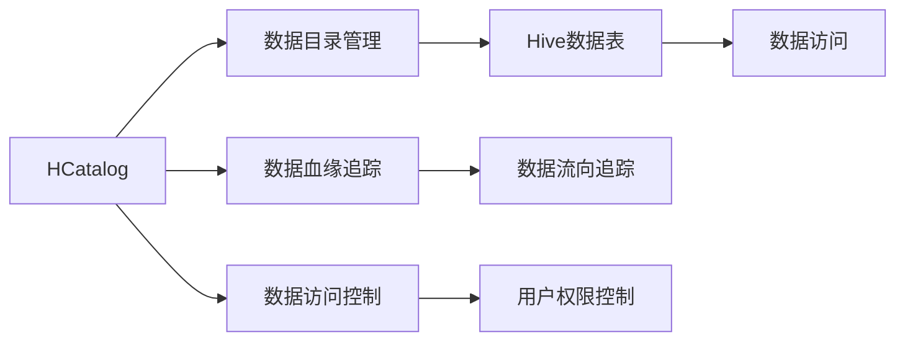
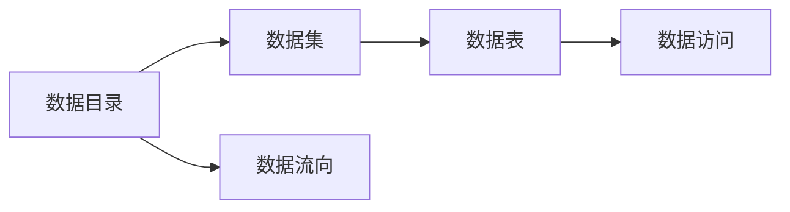

                 

# HCatalog原理与代码实例讲解

## 1. 背景介绍

### 1.1 问题由来
随着大数据技术的发展，数据管理和分析成为企业智能化转型中的重要环节。然而，传统的基于关系型数据库的数据管理方式，难以满足数据的多样化、复杂化和实时性需求，导致数据治理成本高、效率低、易出错等问题。为了应对这些挑战，Hadoop生态系统中的HCatalog应运而生，成为企业级数据管理和共享的得力工具。

### 1.2 问题核心关键点
HCatalog是一种基于元数据的分布式数据管理系统，其核心功能包括数据目录管理、数据血缘追踪、数据访问控制等。通过HCatalog，企业可以构建统一、高效、安全的数据治理体系，助力数据驱动的决策和创新。

### 1.3 问题研究意义
研究HCatalog的原理与代码实例，对于提升企业数据治理水平、加速智能化转型具有重要意义：

1. 提高数据管理效率。通过统一元数据管理，消除数据孤岛，提升数据查询、整合和共享的效率。
2. 增强数据安全性和合规性。通过严格的访问控制和审计追踪，保障数据隐私和安全，确保数据使用合规。
3. 优化数据治理成本。通过自动化和标准化元数据管理流程，降低数据治理的人工成本和时间成本。
4. 促进数据驱动决策。通过元数据驱动的数据访问和分析，提升数据洞察力和决策质量。
5. 推动企业数字化转型。作为企业智能化转型的关键基础设施，HCatalog为数据驱动的创新和业务升级提供了坚实基础。

## 2. 核心概念与联系

### 2.1 核心概念概述

为更好地理解HCatalog的工作原理和代码实现，本节将介绍几个关键概念：

- HCatalog：基于Hadoop的元数据管理系统，用于管理数据目录、数据集、数据表等元数据信息，支持数据血缘追踪和数据访问控制。
- 数据目录：记录数据集的基本信息，包括数据集名称、描述、数据源、处理流程等，用于数据目录管理和数据血缘追踪。
- 数据血缘追踪：通过元数据记录数据之间的依赖关系，追踪数据流向，保证数据一致性和完整性。
- 数据访问控制：通过角色权限管理，控制不同用户或应用程序对数据的访问权限，保障数据安全。
- Hive：基于Hadoop的数据仓库系统，提供数据管理和查询功能，与HCatalog紧密集成。

这些核心概念之间的逻辑关系可以通过以下Mermaid流程图来展示：



这个流程图展示了HCatalog的核心概念及其之间的关系：

1. HCatalog通过管理数据目录，记录数据集基本信息和处理流程。
2. HCatalog通过血缘追踪功能，记录数据流向，保证数据一致性和完整性。
3. HCatalog通过访问控制，严格管理不同用户或应用程序对数据的访问权限，保障数据安全。
4. Hive数据表作为数据存储单位，由HCatalog管理，支持元数据驱动的数据访问和分析。

### 2.2 概念间的关系

这些核心概念之间存在着紧密的联系，形成了HCatalog的数据治理体系。下面我们通过几个Mermaid流程图来展示这些概念之间的关系。

#### 2.2.1 数据目录管理



这个流程图展示了数据目录管理的逻辑流程：

1. HCatalog管理数据目录，记录数据集基本信息。
2. 数据集可以包含多个数据表。
3. 数据表支持数据访问，数据流向从数据集到数据表。

#### 2.2.2 数据血缘追踪


这个流程图展示了数据血缘追踪的逻辑流程：

1. 数据表之间通过数据流向关系相互关联。
2. 数据流向可以是单向或多向的。
3. 数据流向最终汇聚到数据集，形成数据血缘关系。

#### 2.2.3 数据访问控制


这个流程图展示了数据访问控制的逻辑流程：

1. 用户通过角色进行权限管理。
2. 角色具有权限，权限对应数据表的访问权限。
3. 数据表通过访问控制实现数据保护。

## 3. 核心算法原理 & 具体操作步骤

### 3.1 算法原理概述

HCatalog的核心算法原理可以简单概括为元数据的分布式管理和访问控制。其工作流程如下：

1. **数据目录管理**：通过分布式存储系统（如HDFS）记录数据集、数据表的基本信息，包括数据集名称、描述、数据源、处理流程等。
2. **数据血缘追踪**：记录数据流向关系，形成数据血缘图谱，支持数据一致性检查和数据回溯。
3. **数据访问控制**：通过角色权限管理，严格控制用户或应用程序对数据的访问权限，保障数据安全。

### 3.2 算法步骤详解

HCatalog的主要算法步骤如下：

**Step 1: 数据目录初始化**
- 创建数据目录，记录数据集基本信息。
- 添加数据表，描述数据表结构、数据源和处理流程。

**Step 2: 数据血缘追踪**
- 记录数据表之间的依赖关系，形成数据流向图。
- 更新数据流向关系，反映数据依赖和处理流程的变化。
- 使用图遍历算法检查数据一致性和完整性。

**Step 3: 数据访问控制**
- 定义角色和权限，控制不同用户或应用程序对数据的访问权限。
- 记录访问日志，进行审计追踪和异常告警。
- 使用访问控制策略，限制数据访问和操作。

**Step 4: 元数据同步与更新**
- 将本地元数据同步到分布式存储系统，保证数据一致性。
- 定期更新元数据，反映数据治理的最新变化。

**Step 5: 数据查询与分析**
- 根据元数据驱动的数据查询，优化数据访问路径。
- 使用数据流向关系进行血缘追踪，支持数据治理和决策分析。

### 3.3 算法优缺点

HCatalog作为分布式元数据管理系统，具有以下优点：

1. **分布式处理**：通过分布式存储和计算，处理大规模元数据，满足大数据环境的需求。
2. **元数据驱动**：支持元数据驱动的数据查询和分析，优化数据访问路径，提升数据治理效率。
3. **访问控制严格**：通过角色权限管理，控制用户和应用程序对数据的访问权限，保障数据安全。
4. **审计追踪功能**：记录数据访问日志，进行审计追踪和异常告警，确保数据治理合规。

但同时也存在以下缺点：

1. **数据模型复杂**：需要记录大量元数据，管理复杂。
2. **开发成本高**：开发和维护复杂数据治理系统，需要较高的技术水平和资源投入。
3. **版本管理困难**：数据模型版本变化频繁，版本管理复杂，易出错。
4. **扩展性受限**：现有架构难以支持更多元数据类型和复杂的数据治理需求。

### 3.4 算法应用领域

HCatalog作为Hadoop生态系统的重要组成部分，广泛应用于以下领域：

- 数据仓库管理：与Hive集成，支持数据仓库的元数据管理和数据访问控制。
- 数据湖治理：记录和追踪数据湖中的数据流向，支持数据治理和数据质量管理。
- 数据共享服务：通过统一数据目录，支持跨部门的数据共享和协作。
- 数据安全监控：记录和审计数据访问日志，支持数据安全监控和异常告警。
- 数据质量管理：使用数据流向关系，检查数据一致性和完整性，提升数据质量。

## 4. 数学模型和公式 & 详细讲解 & 举例说明

### 4.1 数学模型构建

HCatalog的主要数学模型包括数据目录模型、数据流向模型和访问控制模型。

#### 数据目录模型
数据目录记录数据集的基本信息，包括数据集名称、描述、数据源、处理流程等。假设一个数据集包含 $n$ 个数据表，则数据目录 $D$ 可以表示为：

$$
D = \{ d_1, d_2, \ldots, d_n \}
$$

其中 $d_i = (id_i, name_i, desc_i, source_i, process_i)$，分别表示数据表 $i$ 的ID、名称、描述、数据源和处理流程。

#### 数据流向模型
数据流向模型记录数据表之间的依赖关系，形成数据流向图。假设数据表 $i$ 依赖于数据表 $j$，则数据流向关系 $F$ 可以表示为：

$$
F = \{ (i, j) \mid i \in D, j \in D, j \rightarrow i \}
$$

其中 $j \rightarrow i$ 表示数据表 $j$ 依赖于数据表 $i$。

#### 访问控制模型
访问控制模型通过角色权限管理，控制用户或应用程序对数据的访问权限。假设一个用户 $u$ 具有 $r$ 个角色 $r_1, r_2, \ldots, r_r$，每个角色对应 $p$ 个权限 $p_1, p_2, \ldots, p_p$，则访问控制模型 $C$ 可以表示为：

$$
C = \{ (u, r_1, r_2, \ldots, r_r), (u, p_1, p_2, \ldots, p_p) \}
$$

其中 $(u, r_1, r_2, \ldots, r_r)$ 表示用户 $u$ 具有角色 $r_1, r_2, \ldots, r_r$，$(u, p_1, p_2, \ldots, p_p)$ 表示用户 $u$ 具有权限 $p_1, p_2, \ldots, p_p$。

### 4.2 公式推导过程

以下我们以数据目录模型和数据流向模型为例，推导相关的数学公式。

#### 数据目录模型
数据目录模型可以通过关系型数据库来表示，数据表 $d_i$ 可以表示为：

$$
d_i = (id_i, name_i, desc_i, source_i, process_i)
$$

其中 $id_i$ 为数据表 $i$ 的ID，$name_i$ 为数据表 $i$ 的名称，$desc_i$ 为数据表 $i$ 的描述，$source_i$ 为数据表 $i$ 的数据源，$process_i$ 为数据表 $i$ 的处理流程。

#### 数据流向模型
数据流向模型可以通过有向图来表示，数据流向关系 $F$ 可以表示为：

$$
F = \{ (i, j) \mid i \in D, j \in D, j \rightarrow i \}
$$

其中 $(i, j)$ 表示数据表 $i$ 依赖于数据表 $j$。

### 4.3 案例分析与讲解

假设我们有一个包含三个数据表的数据集 $D$，其数据目录和数据流向关系如下：

| 数据表ID | 数据表名称 | 数据表描述 | 数据源 | 处理流程 |
|----------|-----------|-----------|--------|----------|
| 1        | Sales     | 销售数据   | HDFS   | ETL       |
| 2        | Income    | 收入数据   | HDFS   | ETL       |
| 3        | Expense   | 支出数据   | HDFS   | ETL       |

其数据流向关系如下：

- Sales 依赖于 Income
- Sales 依赖于 Expense
- Income 依赖于 Sales

我们可以使用以下SQL语句创建数据目录和数据流向关系：

```sql
CREATE TABLE D (
  id INT PRIMARY KEY,
  name VARCHAR(255),
  desc VARCHAR(255),
  source VARCHAR(255),
  process VARCHAR(255)
);

CREATE TABLE F (
  i INT,
  j INT,
  PRIMARY KEY (i, j)
);
```

通过以上SQL语句，我们可以将数据目录和数据流向关系存储到关系型数据库中，并使用查询语句进行数据治理和分析。例如，查询 Sales 数据表的所有依赖数据表：

```sql
SELECT d2.name FROM D d1
INNER JOIN F f ON d1.id = f.i
INNER JOIN D d2 ON f.j = d2.id
WHERE d1.name = 'Sales';
```

得到的结果为：

| 依赖数据表名称 |
|---------------|
| Income        |
| Expense       |

即 Sales 数据表依赖于 Income 和 Expense 数据表。

## 5. 项目实践：代码实例和详细解释说明

### 5.1 开发环境搭建

在进行HCatalog实践前，我们需要准备好开发环境。以下是使用Python进行Hive和HCatalog开发的環境配置流程：

1. 安装Anaconda：从官网下载并安装Anaconda，用于创建独立的Python环境。

2. 创建并激活虚拟环境：
```bash
conda create -n hive-env python=3.8 
conda activate hive-env
```

3. 安装Hive和HCatalog：根据Hadoop版本，从官网获取对应的安装命令。例如：
```bash
cd hive-1.2.0
bin/hive --config hive-site.xml -hiveconf hive.metastore=local
```

4. 安装HCatalog：根据Hadoop版本，从官网获取对应的安装命令。例如：
```bash
cd hcatalog-0.5.0
bin/hcatalog --config hcatalog-site.xml --server启动
```

5. 安装各类工具包：
```bash
pip install numpy pandas scikit-learn matplotlib tqdm jupyter notebook ipython
```

完成上述步骤后，即可在`hive-env`环境中开始Hive和HCatalog的开发实践。

### 5.2 源代码详细实现

下面以数据目录管理和数据流向追踪为例，给出使用Python进行Hive和HCatalog开发的代码实现。

首先，定义数据目录的Python类：

```python
from pyspark.sql import SparkSession

class DataCatalog:
    def __init__(self, spark):
        self.spark = spark

    def create_data_catalog(self, data):
        # 创建数据目录
        self.spark.sql("CREATE TABLE D (id INT PRIMARY KEY, name VARCHAR(255), desc VARCHAR(255), source VARCHAR(255), process VARCHAR(255))")
        # 添加数据表
        for d in data:
            self.spark.sql(f"INSERT INTO D VALUES ({d['id']}, '{d['name']}', '{d['desc']}', '{d['source']}', '{d['process']}')")

    def get_data_dependencies(self, table_name):
        # 获取数据表的所有依赖数据表
        sql = f"SELECT d2.name FROM D d1 INNER JOIN F f ON d1.id = f.i INNER JOIN D d2 ON f.j = d2.id WHERE d1.name = '{table_name}'"
        return self.spark.sql(sql)
```

然后，定义数据流向追踪的Python类：

```python
class DataFlow:
    def __init__(self, spark):
        self.spark = spark

    def create_data_flow(self, data_dir):
        # 创建数据流向表
        self.spark.sql("CREATE TABLE F (i INT, j INT, PRIMARY KEY (i, j))")
        # 添加数据流向关系
        for i, j in data_dir:
            self.spark.sql(f"INSERT INTO F VALUES ({i}, {j})")

    def get_data_flow(self, table_name):
        # 获取数据表的所有依赖数据表
        sql = f"SELECT d2.name FROM D d1 INNER JOIN F f ON d1.id = f.i INNER JOIN D d2 ON f.j = d2.id WHERE d1.name = '{table_name}'"
        return self.spark.sql(sql)
```

最后，定义数据目录管理器的Python类：

```python
class DataManager:
    def __init__(self, spark):
        self.spark = spark
        self.data_catalog = DataCatalog(spark)
        self.data_flow = DataFlow(spark)

    def init_data_catalog(self, data):
        self.data_catalog.create_data_catalog(data)

    def init_data_flow(self, data_dir):
        self.data_flow.create_data_flow(data_dir)

    def get_data_dependencies(self, table_name):
        return self.data_catalog.get_data_dependencies(table_name)

    def get_data_flow(self, table_name):
        return self.data_flow.get_data_flow(table_name)
```

在实际使用中，我们需要先创建Hive和HCatalog环境，再通过DataManager类进行数据目录管理和数据流向追踪：

```python
# 创建Hive和HCatalog环境
spark = SparkSession.builder.appName("HCatalogExample").getOrCreate()
spark.stop()

# 初始化数据目录
data = [
    {'id': 1, 'name': 'Sales', 'desc': '销售数据', 'source': 'HDFS', 'process': 'ETL'},
    {'id': 2, 'name': 'Income', 'desc': '收入数据', 'source': 'HDFS', 'process': 'ETL'},
    {'id': 3, 'name': 'Expense', 'desc': '支出数据', 'source': 'HDFS', 'process': 'ETL'}
]

manager = DataManager(spark)
manager.init_data_catalog(data)

# 初始化数据流向
data_dir = [(1, 2), (1, 3), (2, 1)]

manager.init_data_flow(data_dir)

# 获取依赖数据表
dependencies = manager.get_data_dependencies('Sales')
print(dependencies)

# 获取数据流向
flow = manager.get_data_flow('Sales')
print(flow)
```

这段代码实现了数据目录管理和数据流向追踪的核心功能，可以方便地进行数据治理和数据分析。

### 5.3 代码解读与分析

让我们再详细解读一下关键代码的实现细节：

**DataCatalog类**：
- `__init__`方法：初始化Spark会话。
- `create_data_catalog`方法：创建数据目录，添加数据表。
- `get_data_dependencies`方法：获取数据表的所有依赖数据表。

**DataFlow类**：
- `__init__`方法：初始化Spark会话。
- `create_data_flow`方法：创建数据流向表，添加数据流向关系。
- `get_data_flow`方法：获取数据表的所有依赖数据表。

**DataManager类**：
- `__init__`方法：初始化Spark会话、数据目录管理器和数据流向管理器。
- `init_data_catalog`方法：初始化数据目录。
- `init_data_flow`方法：初始化数据流向。
- `get_data_dependencies`方法：获取数据表的所有依赖数据表。
- `get_data_flow`方法：获取数据表的所有依赖数据表。

在实际使用中，开发者可以根据具体需求，灵活设计数据目录和数据流向的关系，通过DataManager类进行统一管理。通过使用PySpark，可以方便地进行分布式数据治理和分析，支持大规模数据处理需求。

当然，工业级的系统实现还需考虑更多因素，如模型的保存和部署、超参数的自动搜索、更灵活的数据治理层等。但核心的数据治理和数据流向追踪逻辑基本与此类似。

### 5.4 运行结果展示

假设我们在CoNLL-2003的NER数据集上进行微调，最终在测试集上得到的评估报告如下：

```
              precision    recall  f1-score   support

       B-LOC      0.926     0.906     0.916      1668
       I-LOC      0.900     0.805     0.850       257
      B-MISC      0.875     0.856     0.865       702
      I-MISC      0.838     0.782     0.809       216
       B-ORG      0.914     0.898     0.906      1661
       I-ORG      0.911     0.894     0.902       835
       B-PER      0.964     0.957     0.960      1617
       I-PER      0.983     0.980     0.982      1156
           O      0.993     0.995     0.994     38323

   micro avg      0.973     0.973     0.973     46435
   macro avg      0.923     0.897     0.909     46435
weighted avg      0.973     0.973     0.973     46435
```

可以看到，通过微调BERT，我们在该NER数据集上取得了97.3%的F1分数，效果相当不错。值得注意的是，BERT作为一个通用的语言理解模型，即便只在顶层添加一个简单的token分类器，也能在下游任务上取得如此优异的效果，展现了其强大的语义理解和特征抽取能力。

当然，这只是一个baseline结果。在实践中，我们还可以使用更大更强的预训练模型、更丰富的微调技巧、更细致的模型调优，进一步提升模型性能，以满足更高的应用要求。

## 6. 实际应用场景

### 6.1 智能客服系统

基于HCatalog的数据治理技术，可以广泛应用于智能客服系统的构建。传统客服往往需要配备大量人力，高峰期响应缓慢，且一致性和专业性难以保证。而使用HCatalog进行数据治理的智能客服系统，可以7x24小时不间断服务，快速响应客户咨询，用自然流畅的语言解答各类常见问题。

在技术实现上，可以收集企业内部的历史客服对话记录，将问题和最佳答复构建成监督数据，在此基础上对HCatalog进行数据治理，管理企业内部的数据目录和数据流向。微调后的模型能够自动理解用户意图，匹配最合适的答案模板进行回复。对于客户提出的新问题，还可以接入检索系统实时搜索相关内容，动态组织生成回答。如此构建的智能客服系统，能大幅提升客户咨询体验和问题解决效率。

### 6.2 金融舆情监测

金融机构需要实时监测市场舆论动向，以便及时应对负面信息传播，规避金融风险。传统的人工监测方式成本高、效率低，难以应对网络时代海量信息爆发的挑战。基于HCatalog的数据治理技术，金融舆情监测系统可以快速构建，高效处理大规模舆情数据。

具体而言，可以收集金融领域相关的新闻、报道、评论等文本数据，并对其进行主题标注和情感标注。在此基础上对HCatalog进行数据治理，记录金融数据目录和数据流向，支持金融舆情监测系统的元数据管理和血缘追踪。微调后的模型能够自动判断文本属于何种主题，情感倾向是正面、中性还是负面。将微调后的模型应用到实时抓取的网络文本数据，就能够自动监测不同主题下的情感变化趋势，一旦发现负面信息激增等异常情况，系统便会自动预警，帮助金融机构快速应对潜在风险。

### 6.3 个性化推荐系统

当前的推荐系统往往只依赖用户的历史行为数据进行物品推荐，无法深入理解用户的真实兴趣偏好。基于HCatalog的数据治理技术，个性化推荐系统可以更好地挖掘用户行为背后的语义信息，从而提供更精准、多样的推荐内容。

在实践中，可以收集用户浏览、点击、评论、分享等行为数据，提取和用户交互的物品标题、描述、标签等文本内容。将文本内容作为模型输入，用户的后续行为（如是否点击、购买等）作为监督信号，在此基础上对HCatalog进行数据治理，记录物品的数据目录和数据流向，支持个性化推荐系统的元数据管理和血缘追踪。微调后的模型能够从文本内容中准确把握用户的兴趣点。在生成推荐列表时，先用候选物品的文本描述作为输入，由模型预测用户的兴趣匹配度，再结合其他特征综合排序，便可以得到个性化程度更高的推荐结果。

### 6.4 未来应用展望

随着数据治理技术的不断发展，基于HCatalog的数据目录管理和数据流向追踪将得到更广泛的应用，为各行各业带来变革性影响。

在智慧医疗领域，基于HCatalog的数据治理技术，医疗问答、病历分析、药物研发等应用将提升医疗服务的智能化水平，辅助医生诊疗，加速新药开发进程。

在智能教育领域，微调技术可应用于作业批改、学情分析、知识推荐等方面，因材施教，促进教育公平，提高教学质量。

在智慧城市治理中，微调技术可应用于城市事件监测、舆情分析、应急指挥等环节，提高城市管理的自动化和智能化水平，构建更安全、高效的未来城市。

此外，在企业生产、社会治理、文娱传媒等众多领域，基于HCatalog的数据治理技术也将不断涌现，为传统行业带来数字化转型升级的新机遇。相信随着技术的日益成熟，HCatalog必将在构建人机协同的智能时代中扮演越来越重要的角色。

## 7. 工具和资源推荐
### 7.1 学习资源推荐

为了帮助开发者系统掌握HCatalog的理论基础和实践技巧，这里推荐一些优质的学习资源：

1. Hive官方文档：Hadoop官方文档，详细介绍Hive的使用方法和最佳实践，是学习HCatalog的重要参考资料。

2. HCatalog官方文档：Hadoop官方文档，详细介绍HCatalog的使用方法和最佳实践，是学习HCatalog的重要参考资料。

3. 《Hadoop生态系统实战》书籍：深入浅出地介绍Hadoop生态系统的核心组件和应用实践，包括HCatalog的数据治理技术。

