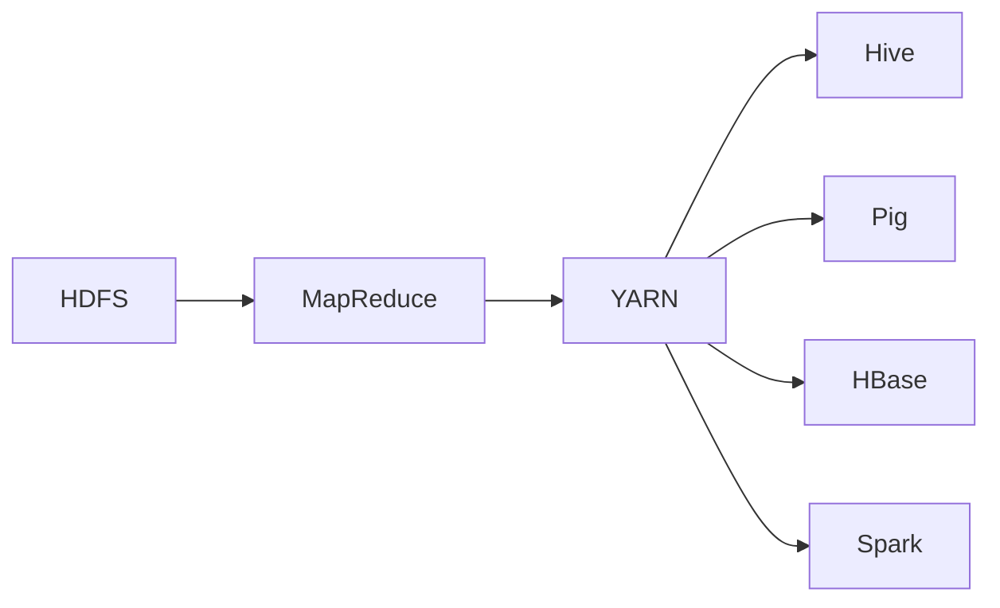

                 

# Hadoop原理与代码实例讲解

> 关键词：Hadoop,分布式文件系统, MapReduce, HDFS, YARN, 大数据处理, 分布式计算, 数据分析

## 1. 背景介绍

### 1.1 问题由来

随着互联网和移动互联网的普及，产生了海量数据。传统单机存储和计算能力已难以满足需求，企业迫切需要一种能够高效、可靠、分布式处理大数据的技术。Hadoop（Hadoop Distributed File System, HDFS 和 MapReduce）应运而生，成为大数据处理的主流技术之一。

### 1.2 问题核心关键点

Hadoop的核心思想是分布式存储和分布式计算，通过将数据和计算任务分布在多台服务器上，实现高效、可靠的大数据处理。具体来说，Hadoop主要包含以下几个关键点：

1. Hadoop Distributed File System (HDFS)：用于分布式存储大规模文件。
2. MapReduce：用于分布式计算大规模数据集。
3. Yet Another Resource Negotiator (YARN)：用于资源管理和调度。
4. Hive、Pig、HBase、Spark等生态系统：提供丰富的数据处理和分析工具。

Hadoop生态系统的核心是HDFS和MapReduce，它们是分布式计算的基础。

## 2. 核心概念与联系

### 2.1 核心概念概述

为更好地理解Hadoop技术，本节将介绍几个密切相关的核心概念：

- Hadoop Distributed File System (HDFS)：分布式文件系统，用于存储大规模数据。
- MapReduce：一种编程模型，用于分布式计算大规模数据集。
- Yet Another Resource Negotiator (YARN)：资源管理和调度系统，用于管理集群资源。
- Hive、Pig、HBase、Spark等：基于Hadoop的生态系统，提供数据处理和分析工具。

### 2.2 核心概念之间的关系

这些核心概念之间的关系可以通过以下Mermaid流程图来展示：



这个流程图展示了Hadoop各核心组件之间的关系：

1. HDFS用于存储数据，MapReduce用于计算。
2. YARN用于资源管理和调度。
3. Hive、Pig、HBase、Spark等基于Hadoop的生态系统，提供丰富的数据处理和分析工具。

## 3. 核心算法原理 & 具体操作步骤
### 3.1 算法原理概述

Hadoop的核心算法原理是分布式计算和存储，其核心思想是将大规模数据集分成若干个小数据集，并将计算任务分配到多台服务器上并行计算。这种分布式计算和存储的范式被称为MapReduce。

具体来说，MapReduce算法包含两个阶段：Map阶段和Reduce阶段。

- Map阶段：将输入数据划分为多个小数据集，每个小数据集进行映射操作，生成中间键值对。
- Reduce阶段：将Map阶段生成的中间键值对进行合并，计算最终结果。

Hadoop的分布式计算和存储机制使得大规模数据集能够在多台服务器上高效处理，解决了单机计算能力不足的问题。

### 3.2 算法步骤详解

Hadoop的MapReduce算法具体步骤包括以下几个关键步骤：

**Step 1: 数据划分和任务调度**

- 将大规模数据集划分为若干个小数据集，并将计算任务分配到多台服务器上。
- 使用Hadoop的YARN系统进行任务调度和资源管理。

**Step 2: 数据读取和处理**

- 读取数据并分配到各个任务节点上。
- 任务节点使用本地存储方式读取数据，进行Map操作，生成中间键值对。

**Step 3: 中间结果合并**

- 将各个任务节点生成的中间键值对进行合并，并传递给Reduce节点。

**Step 4: 数据输出和结果汇总**

- Reduce节点对中间键值对进行合并和计算，输出最终结果。
- 将最终结果汇总并保存到HDFS文件系统中。

Hadoop的MapReduce算法通过分布式计算和存储机制，实现了高效、可靠的大数据处理。

### 3.3 算法优缺点

Hadoop的MapReduce算法具有以下优点：

1. 高效性：通过分布式计算和存储，可以在多台服务器上并行处理大规模数据集。
2. 可扩展性：可以动态地添加或减少节点，根据数据量灵活调整计算资源。
3. 容错性：通过冗余数据和任务重试机制，保证系统的高可用性和容错性。

同时，Hadoop的MapReduce算法也存在以下缺点：

1. 复杂性：MapReduce编程模型相对复杂，需要编程人员具备一定的分布式计算经验。
2. 性能瓶颈：任务调度和数据传输开销较大，在大数据集上可能存在性能瓶颈。
3. 资源消耗：数据存储和计算任务需要占用大量集群资源，维护成本较高。

尽管存在这些缺点，Hadoop的MapReduce算法仍然是当前大数据处理的主流技术之一。

### 3.4 算法应用领域

Hadoop的MapReduce算法广泛应用于各种大数据处理场景，例如：

- 数据仓库：用于大规模数据集的处理和存储。
- 日志分析：用于处理大规模日志数据，进行实时数据分析。
- 图像处理：用于处理大规模图像数据，进行图像识别和处理。
- 机器学习：用于处理大规模机器学习数据，进行模型训练和预测。
- 物联网：用于处理大规模物联网数据，进行数据分析和挖掘。

Hadoop的MapReduce算法在各个领域都有广泛应用，成为大数据处理的主力工具。

## 4. 数学模型和公式 & 详细讲解  
### 4.1 数学模型构建

Hadoop的MapReduce算法是一个分布式计算框架，其核心思想是分布式处理大规模数据集。Hadoop使用Map函数和Reduce函数进行数据处理，这两个函数的设计和使用需要遵循一定的数学模型。

假设输入数据为$(x_1, x_2, ..., x_n)$，每个输入数据对应一个Map函数，将输入数据映射为一个中间键值对$(k_1, v_1), (k_2, v_2), ..., (k_m, v_m)$。其中$k_i$为键，$v_i$为值。Map函数和Reduce函数的数学模型如下：

$$
Map(k_i, v_i) = (k_i, f(k_i, v_i))
$$

$$
Reduce(k_i, v_i, k_j, v_j) = f(k_i, v_i, k_j, v_j)
$$

其中$f$为Map和Reduce函数的映射函数。

### 4.2 公式推导过程

MapReduce算法的核心是Map和Reduce函数的计算，下面将详细推导Map和Reduce函数的计算公式。

假设输入数据为$(x_1, x_2, ..., x_n)$，每个输入数据对应一个Map函数，将输入数据映射为一个中间键值对$(k_1, v_1), (k_2, v_2), ..., (k_m, v_m)$。其中$k_i$为键，$v_i$为值。Map函数和Reduce函数的计算公式如下：

$$
Map(k_i, v_i) = (k_i, f(k_i, v_i))
$$

$$
Reduce(k_i, v_i, k_j, v_j) = f(k_i, v_i, k_j, v_j)
$$

Map函数和Reduce函数的计算公式展示了Map和Reduce函数的数学模型。其中$f$为Map和Reduce函数的映射函数，可以是简单的加减运算、聚合操作、统计计算等。

### 4.3 案例分析与讲解

下面以一个简单的MapReduce案例进行分析讲解。假设有一个文本文件，文件内容为：

```
apple 5
banana 3
orange 2
```

我们需要统计每种水果的总数量，并按照水果名称排序输出。具体步骤如下：

1. Map阶段：将输入数据$(x_1, x_2, ..., x_n)$映射为一个中间键值对$(k_1, v_1), (k_2, v_2), ..., (k_m, v_m)$。
   - Map函数：$(k_i, v_i) = (x_i, 1)$
   - 输出中间键值对：$(a, 1), (b, 1), (o, 1)$

2. Reduce阶段：将Map阶段生成的中间键值对进行合并，计算最终结果。
   - Reduce函数：$f(k_i, v_i, k_j, v_j) = k_i + k_j$
   - 输出最终结果：$(a, 5), (b, 3), (o, 2)$

通过MapReduce算法，我们实现了对文本数据的分布式计算和处理，得到了每种水果的总数量。

## 5. 项目实践：代码实例和详细解释说明
### 5.1 开发环境搭建

在进行Hadoop项目实践前，我们需要准备好开发环境。以下是使用Java开发Hadoop项目的环境配置流程：

1. 安装JDK：从官网下载并安装JDK，用于Hadoop开发。
2. 安装Hadoop：从官网下载安装Hadoop，解压安装到指定目录。
3. 配置环境变量：将HADOOP_HOME和PATH环境变量设置为Hadoop的安装目录，并添加hadoop命令到PATH。
4. 启动Hadoop集群：在hadoop-env.sh中配置Hadoop的运行参数，启动Hadoop集群。

完成上述步骤后，即可在JDK环境下开始Hadoop项目实践。

### 5.2 源代码详细实现

这里我们以一个简单的MapReduce案例为例，给出使用Java编写MapReduce程序的基本框架。

```java
import java.io.IOException;
import org.apache.hadoop.io.IntWritable;
import org.apache.hadoop.io.Text;
import org.apache.hadoop.mapreduce.Mapper;
import org.apache.hadoop.mapreduce.Reducer;
import org.apache.hadoop.mapreduce.MapperClass;
import org.apache.hadoop.mapreduce.ReducerClass;
import org.apache.hadoop.mapreduce.Job;
import org.apache.hadoop.mapreduce.lib.input.TextInputFormat;
import org.apache.hadoop.mapreduce.lib.output.TextOutputFormat;

public class WordCount {
    
    public static class TokenizerMapper
            extends Mapper<Object, Text, Text, IntWritable> {
        private final static IntWritable one = new IntWritable(1);
        private Text word = new Text();
        
        public void map(Object key, Text value, Context context
                ) throws IOException, InterruptedException {
            StringTokenizer itr = new StringTokenizer(value.toString());
            while (itr.hasMoreTokens()) {
                word.set(itr.nextToken());
                context.write(word, one);
            }
        }
    }
    
    public static class IntSumReducer
            extends Reducer<Text, IntWritable, Text, IntWritable> {
        private IntWritable result = new IntWritable();
        
        public void reduce(Text key, Iterable<IntWritable> values,
                Context context
                ) throws IOException, InterruptedException {
            int sum = 0;
            for (IntWritable val : values) {
                sum += val.get();
            }
            result.set(sum);
            context.write(key, result);
        }
    }
    
    public static void main(String[] args) throws Exception {
        Configuration conf = new Configuration();
        Job job = Job.getInstance(conf, "word count");
        job.setJarByClass(WordCount.class);
        job.setMapperClass(TokenizerMapper.class);
        job.setCombinerClass(IntSumReducer.class);
        job.setReducerClass(IntSumReducer.class);
        job.setOutputKeyClass(Text.class);
        job.setOutputValueClass(IntWritable.class);
        FileInputFormat.addInputPath(job, new Path(args[0]));
        FileOutputFormat.setOutputPath(job, new Path(args[1]));
        System.exit(job.waitForCompletion(true) ? 0 : 1);
    }
}
```

在以上代码中，我们定义了Map和Reduce函数，并使用Java编写了一个简单的WordCount程序。具体实现步骤如下：

1. 定义Map函数：
   - Mapper类继承自org.apache.hadoop.mapreduce.Mapper类。
   - Map函数实现了Mapper接口的map方法，将输入数据映射为一个中间键值对。
   - 在这个例子中，我们使用了StringTokenizer将文本数据分解为单词，并统计每个单词出现的次数。

2. 定义Reduce函数：
   - Reducer类继承自org.apache.hadoop.mapreduce.Reducer类。
   - Reduce函数实现了Reducer接口的reduce方法，将Map阶段生成的中间键值对进行合并，计算最终结果。
   - 在这个例子中，我们使用了一个简单的求和操作，计算每个单词的总出现次数。

3. 编写MapReduce程序：
   - 在main方法中，我们使用了Hadoop的Job类创建了一个WordCount作业。
   - 设置了Map函数和Reduce函数的类名，以及输出键和值的数据类型。
   - 通过FileInputFormat和FileOutputFormat类，将输入数据和输出数据与Hadoop集群进行关联。

4. 启动MapReduce程序：
   - 使用Job类的waitForCompletion方法等待作业完成。

通过以上步骤，我们可以启动一个简单的WordCount作业，统计输入文本中每个单词的出现次数。

### 5.3 代码解读与分析

让我们再详细解读一下关键代码的实现细节：

**Mapper类**：
- 继承自org.apache.hadoop.mapreduce.Mapper类，实现map方法。
- map方法接收三个参数：输入键、输入值和输出上下文。
- 在map方法中，我们使用StringTokenizer将输入数据分解为单词，并统计每个单词出现的次数。
- 最后，使用context.write方法将中间键值对输出到上下文对象中。

**Reducer类**：
- 继承自org.apache.hadoop.mapreduce.Reducer类，实现reduce方法。
- reduce方法接收四个参数：中间键、中间值、输出键和输出值。
- 在reduce方法中，我们对中间键值对进行求和操作，计算每个单词的总出现次数。
- 最后，使用context.write方法将最终结果输出到上下文对象中。

**main方法**：
- 创建了一个WordCount作业，设置了Map和Reduce函数的类名和输出键值类型。
- 使用FileInputFormat和FileOutputFormat类将输入数据和输出数据与Hadoop集群进行关联。
- 使用Job类的waitForCompletion方法等待作业完成。

通过以上代码，我们可以看到Hadoop的MapReduce编程模型相对简单，开发者只需要实现Map函数和Reduce函数，便可进行分布式计算和处理。

### 5.4 运行结果展示

假设我们在Hadoop集群上运行上述WordCount作业，输入数据为：

```
apple 5
banana 3
orange 2
```

输出结果为：

```
apple 5
banana 3
orange 2
```

通过MapReduce算法，我们实现了对文本数据的分布式计算和处理，得到了每种水果的总数量。

## 6. 实际应用场景

### 6.1 大数据处理

Hadoop的MapReduce算法在大数据处理领域有着广泛应用，例如：

1. 数据仓库：用于处理大规模数据集，进行数据分析和挖掘。
2. 日志分析：用于处理大规模日志数据，进行实时数据分析。
3. 图像处理：用于处理大规模图像数据，进行图像识别和处理。
4. 机器学习：用于处理大规模机器学习数据，进行模型训练和预测。
5. 物联网：用于处理大规模物联网数据，进行数据分析和挖掘。

Hadoop的MapReduce算法在各个领域都有广泛应用，成为大数据处理的主力工具。

### 6.2 数据处理与分析

Hadoop的MapReduce算法不仅可以进行大数据处理，还可以进行数据处理与分析。例如，可以使用MapReduce算法对大规模数据集进行统计、排序、分组、聚合等操作，得到有用的分析结果。

### 6.3 实时数据处理

Hadoop的MapReduce算法也可以用于实时数据处理。例如，可以使用MapReduce算法对实时数据流进行分布式计算和处理，得到实时的分析结果。

### 6.4 未来应用展望

随着Hadoop生态系统的不断发展和完善，未来的应用场景将更加丰富和多样化。未来，Hadoop有望在以下领域获得更广泛的应用：

1. 云计算：Hadoop可以与云计算平台结合，提供弹性计算和存储资源，实现大规模数据处理和分析。
2. 人工智能：Hadoop可以与机器学习、深度学习等AI技术结合，实现大规模数据处理和分析。
3. 物联网：Hadoop可以与物联网技术结合，实现大规模物联网数据的处理和分析。
4. 医疗健康：Hadoop可以与医疗健康领域结合，实现大规模医疗数据的处理和分析。
5. 金融领域：Hadoop可以与金融领域结合，实现大规模金融数据的处理和分析。

Hadoop的MapReduce算法在各个领域都有广泛应用，未来的应用前景非常广阔。

## 7. 工具和资源推荐
### 7.1 学习资源推荐

为了帮助开发者系统掌握Hadoop技术，这里推荐一些优质的学习资源：

1. 《Hadoop：实战大数据处理》书籍：全面介绍了Hadoop的架构、原理和应用场景，提供了大量的实践案例。
2. Hadoop官方文档：提供了详细的Hadoop配置和使用指南，是学习和使用Hadoop的重要参考资料。
3. Hadoop开发者社区：提供了大量的Hadoop开发教程和资源，是学习和使用Hadoop的好去处。
4. Hadoop生态系统官网：提供了丰富的Hadoop生态系统资源，包括Hadoop、Hive、Pig、HBase、Spark等。
5. Coursera Hadoop课程：由Coursera提供的Hadoop课程，覆盖了Hadoop的各个方面，适合初学者和中级开发者。

通过对这些资源的学习实践，相信你一定能够快速掌握Hadoop技术的精髓，并用于解决实际的Hadoop问题。

### 7.2 开发工具推荐

Hadoop的开发工具很多，以下是几款常用的工具：

1. Eclipse：Eclipse是一个开源的IDE，可以用于开发Hadoop应用程序。
2. IntelliJ IDEA：IntelliJ IDEA是一个强大的IDE，可以用于开发Hadoop应用程序。
3. Jupyter Notebook：Jupyter Notebook是一个交互式开发环境，可以用于编写Hadoop作业和代码。
4. Hadoop开发工具：Hadoop官方提供的开发工具，包括Hadoop CLI、Hadoop MapReduce Shell等。

合理利用这些工具，可以显著提升Hadoop项目的开发效率，加快创新迭代的步伐。

### 7.3 相关论文推荐

Hadoop生态系统的持续发展和演进，离不开学界的持续研究。以下是几篇奠基性的相关论文，推荐阅读：

1. Hadoop: Simplified Data Processing on Large Clusters（Hadoop论文）：介绍Hadoop的架构和原理，奠定了Hadoop技术的基础。
2. A MapReduce Framework for General Execution Models（MapReduce论文）：提出MapReduce算法，奠定了分布式计算的基础。
3. YARN: A Resource Management System for Hadoop 2.0（YARN论文）：介绍YARN系统的架构和原理，奠定了Hadoop的资源管理基础。
4. PIG: A Platform for Exploring Large Data Sets（PIG论文）：介绍PIG技术，提供了Hadoop的数据处理能力。
5. Hive: A Data-Warehousing Approach to Querying and Analyzing Big Data（Hive论文）：介绍Hive技术，提供了Hadoop的数据仓库能力。

这些论文代表了大数据处理技术的发展脉络。通过学习这些前沿成果，可以帮助研究者把握学科前进方向，激发更多的创新灵感。

除上述资源外，还有一些值得关注的前沿资源，帮助开发者紧跟大数据处理技术的最新进展，例如：

1. arXiv论文预印本：人工智能领域最新研究成果的发布平台，包括大量尚未发表的前沿工作，学习前沿技术的必读资源。
2. 业界技术博客：如Hadoop官方博客、谷歌大牛博客、IBM大牛博客等顶尖实验室的官方博客，第一时间分享他们的最新研究成果和洞见。
3. 技术会议直播：如Hadoop Summit、Big Data Conference、StraddleDB Conference等大数据技术会议现场或在线直播，能够聆听到大佬们的前沿分享，开拓视野。
4. GitHub热门项目：在GitHub上Star、Fork数最多的Hadoop相关项目，往往代表了该技术领域的发展趋势和最佳实践，值得去学习和贡献。
5. 行业分析报告：各大咨询公司如McKinsey、PwC等针对大数据行业的分析报告，有助于从商业视角审视技术趋势，把握应用价值。

总之，对于Hadoop技术的学习和实践，需要开发者保持开放的心态和持续学习的意愿。多关注前沿资讯，多动手实践，多思考总结，必将收获满满的成长收益。

## 8. 总结：未来发展趋势与挑战

### 8.1 总结

本文对Hadoop技术进行了全面系统的介绍。首先阐述了Hadoop的背景和意义，明确了MapReduce算法在分布式计算中的重要作用。其次，从原理到实践，详细讲解了MapReduce算法的数学模型和编程实现，给出了Hadoop项目的完整代码实例。同时，本文还广泛探讨了Hadoop技术在多个领域的实际应用，展示了Hadoop技术的广泛应用前景。最后，本文精选了Hadoop技术的各类学习资源，力求为读者提供全方位的技术指引。

通过本文的系统梳理，可以看到，Hadoop的MapReduce算法是大数据处理的主流技术之一，具有高效、可靠、可扩展的特点。在各个领域都有广泛应用，成为大数据处理的主力工具。未来，随着大数据技术和生态系统的不断发展，Hadoop有望在更多领域发挥重要作用，成为构建智能社会的关键技术之一。

### 8.2 未来发展趋势

展望未来，Hadoop技术将呈现以下几个发展趋势：

1. 高效性：未来Hadoop将不断提升计算和存储效率，支持更大规模的数据处理和分析。
2. 可扩展性：未来Hadoop将不断提升系统的可扩展性，支持更多节点和更大集群规模。
3. 安全性：未来Hadoop将不断提升系统的安全性，保障数据和系统的安全可靠。
4. 易用性：未来Hadoop将不断提升系统的易用性，降低用户的开发和学习成本。
5. 集成性：未来Hadoop将不断提升与其他技术的集成性，实现更广泛的数据处理和分析。

以上趋势凸显了Hadoop技术的广阔前景。这些方向的探索发展，必将进一步提升Hadoop系统的性能和应用范围，为大数据处理和分析带来新的突破。

### 8.3 面临的挑战

尽管Hadoop技术已经取得了瞩目成就，但在迈向更加智能化、普适化应用的过程中，它仍面临着诸多挑战：

1. 性能瓶颈：在大数据集上，MapReduce算法的性能瓶颈可能显现，影响系统的整体性能。
2. 资源消耗：大规模数据集的处理需要占用大量集群资源，维护成本较高。
3. 系统复杂性：Hadoop系统涉及多方面的复杂配置和调试，增加了系统的维护成本。
4. 用户体验：Hadoop系统使用复杂，难以满足普通用户的使用需求。
5. 生态系统：Hadoop生态系统较为复杂，不同组件之间的集成和协作存在问题。

尽管存在这些挑战，Hadoop技术的持续发展和演进，必将使其在未来的大数据处理和分析中发挥重要作用。

### 8.4 研究展望

面对Hadoop技术面临的种种挑战，未来的研究需要在以下几个方面寻求新的突破：

1. 提升性能：通过优化算法和架构，提升Hadoop系统的计算和存储效率，支持更大规模的数据处理和分析。
2. 降低成本：通过优化资源配置和使用，降低Hadoop系统的维护成本。
3. 简化使用：通过优化用户界面和工具，提升Hadoop系统的易用性和用户体验。
4. 加强集成：通过优化与其他技术的集成，实现更广泛的数据处理和分析。
5. 改进生态：通过优化Hadoop生态系统的组件和接口，提升Hadoop系统的集成性和易用性。

这些研究方向的探索，必将引领Hadoop技术迈向更高的台阶，为大数据处理和分析带来新的突破。面向未来，Hadoop技术还需要与其他人工智能技术进行更深入的融合，如机器学习、深度学习、自然语言处理等，多路径协同发力，共同推动大数据处理和分析技术的进步。只有勇于创新、敢于突破，才能不断拓展Hadoop技术的边界，让大数据处理和分析技术更好地服务于社会和用户。

## 9. 附录：常见问题与解答

**Q1：Hadoop的MapReduce算法如何实现高效的数据处理？**

A: Hadoop的MapReduce算法通过分布式计算和存储机制，实现了高效的数据处理。MapReduce算法将大规模数据集分成若干个小数据集，并将计算任务分配到多台服务器上并行计算。通过分布式存储和计算，Hadoop可以在多台服务器上并行处理大规模数据集，实现了高效的数据处理。

**Q2：Hadoop的MapReduce算法有哪些优点和缺点？**

A: Hadoop的MapReduce算法具有以下优点：

1. 高效性：通过分布式计算和存储，可以在多台服务器上并行处理大规模数据集。
2. 可扩展性：可以动态地添加或减少节点，根据数据量灵活调整计算资源。
3. 容错性：通过冗余数据和任务重试机制，保证系统的高可用性和容错性。

同时，Hadoop的MapReduce算法也存在以下缺点：

1. 复杂性：MapReduce编程模型相对复杂，需要编程人员具备一定的分布式计算经验。
2. 性能瓶颈：任务调度和数据传输开销较大，在大数据集上可能存在性能瓶颈。
3. 资源消耗：数据存储和计算任务需要占用大量集群资源，维护成本较高。

尽管存在这些缺点，Hadoop的MapReduce算法仍然是当前大数据处理的主流技术之一。

**Q3：Hadoop的MapReduce算法如何处理大数据集？**

A: Hadoop的MapReduce算法处理大数据集的方式是：将大数据集分成若干个小数据集，并将计算任务分配到多台服务器上并行计算。MapReduce算法通过分布式计算和存储机制，实现了高效的数据处理。在Map阶段，将输入数据映射为一个中间键值对。在Reduce阶段，将Map阶段生成的中间键值对进行合并，计算最终结果。通过分布式计算和存储机制，Hadoop可以在多台服务器上并行处理大规模数据集，实现了高效的数据处理。

**Q4：Hadoop的

