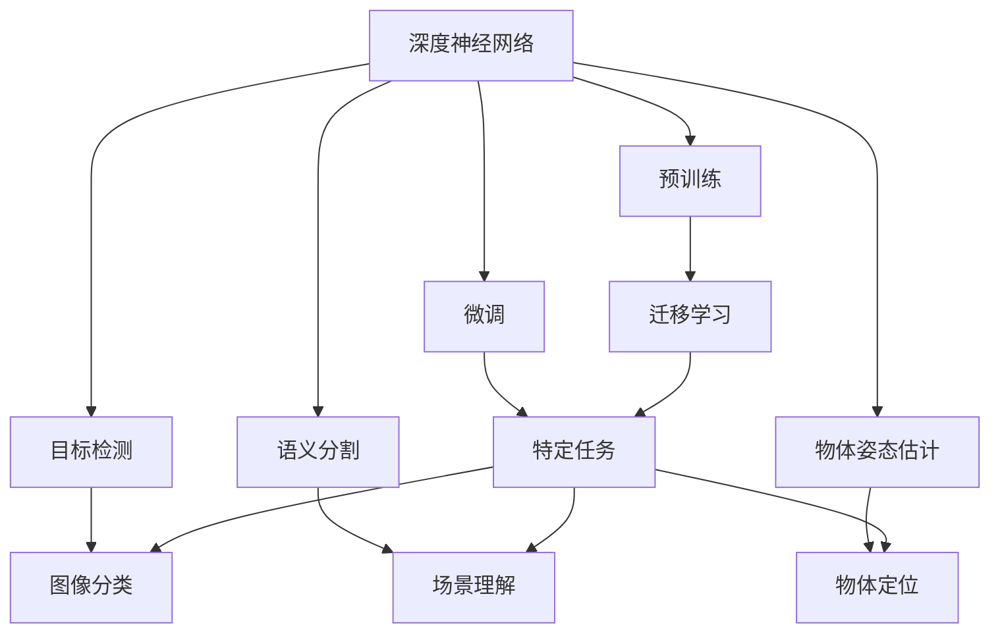
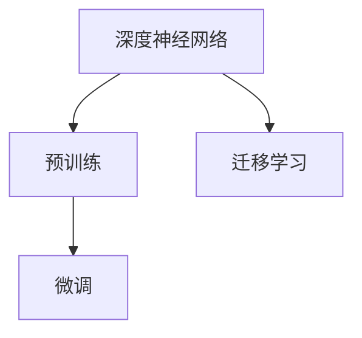
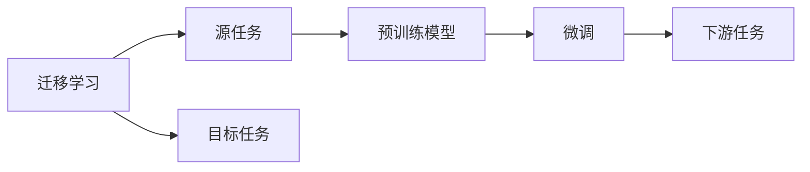
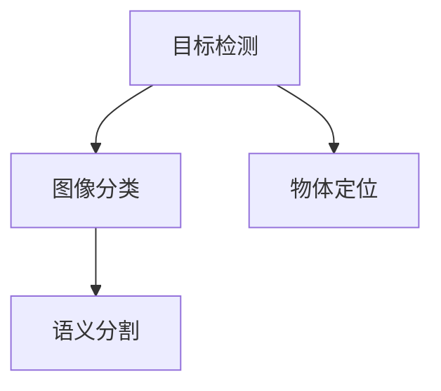
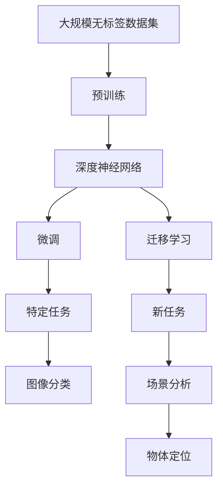

                 

# ImageNet与人工智能的学习

## 1. 背景介绍

### 1.1 问题由来

ImageNet是一个包含1400多万张图片、超过1000个类别的庞大视觉数据集，是计算机视觉领域最重要的数据集之一。它在2009年由俄勒冈州立大学的李飞飞教授等人发起，并于2012年被引入深度学习模型的训练中，成为推动深度学习革命的催化剂。

在ImageNet上预训练深度神经网络（DNN），已经成为计算机视觉任务（如图像分类、目标检测、语义分割等）的关键步骤。ImageNet不仅为训练大规模模型提供了海量数据，还为模型训练和评估提供了一个通用的标准，推动了整个深度学习领域的发展。

### 1.2 问题核心关键点

ImageNet的主要作用在于：
- **数据驱动**：提供大量标注数据，帮助训练出高效泛化的深度神经网络。
- **通用标准**：作为深度学习模型评估的基准，推动算法研究和模型改进。
- **通用模型**：通过在ImageNet上预训练的通用模型，可以用于多种视觉任务和应用场景。
- **开源共享**：为科研和产业界提供了广泛共享的数据资源和模型库。

### 1.3 问题研究意义

研究ImageNet对于推动计算机视觉技术的进步具有重要意义：
- **提高模型性能**：大规模标注数据和强大的模型训练能力，使得在ImageNet上训练的模型性能显著提升。
- **促进技术发展**：提供了丰富的实验基准和研究范例，加速了深度学习算法的开发和优化。
- **应用广泛**：ImageNet模型被广泛应用于自动驾驶、医疗影像分析、安全监控等领域，为实际应用提供了技术支撑。
- **推动产业化**：通过开源共享，促进了模型和技术的商业化应用，为产业发展注入了新的动力。

## 2. 核心概念与联系

### 2.1 核心概念概述

为更好地理解ImageNet在人工智能学习中的应用，本节将介绍几个密切相关的核心概念：

- **深度神经网络（DNN）**：一种多层结构的神经网络，能够学习输入数据的高阶表示，具有强大的特征提取和分类能力。

- **预训练（Pre-training）**：指在大规模无标签数据上训练模型，学习到数据中的通用特征，然后通过微调（Fine-tuning）来适应特定任务。

- **微调（Fine-tuning）**：在预训练模型的基础上，使用小规模标注数据，通过有监督学习优化模型在特定任务上的性能。

- **迁移学习（Transfer Learning）**：将一个领域学到的知识，迁移到另一个相关领域的应用中。ImageNet上的预训练模型可以通过微调，在各种视觉任务上发挥作用。

- **目标检测（Object Detection）**：在图像中定位并识别多个对象，是计算机视觉中的重要任务。

- **语义分割（Semantic Segmentation）**：将图像中的每个像素分为不同的语义类别，适用于场景分析和图像理解。

- **物体姿态估计（Pose Estimation）**：在图像中定位并估计物体的姿态和位置，常用于虚拟现实和增强现实中。

这些核心概念之间的逻辑关系可以通过以下Mermaid流程图来展示：



这个流程图展示了大规模数据集（如ImageNet）在深度学习和计算机视觉中的应用：

1. 深度神经网络在无标签数据上预训练，学习到通用特征。
2. 通过微调，模型可以在特定任务上进一步优化，如目标检测、语义分割等。
3. 迁移学习将预训练知识迁移到新的领域和任务中，进一步提升性能。

### 2.2 概念间的关系

这些核心概念之间存在着紧密的联系，形成了计算机视觉任务的完整生态系统。下面我们通过几个Mermaid流程图来展示这些概念之间的关系。

#### 2.2.1 深度神经网络的学习范式



这个流程图展示了深度神经网络在预训练、微调和迁移学习中的学习范式。预训练通过无监督学习获取通用特征，微调通过有监督学习适应特定任务，迁移学习则将预训练知识迁移到新领域和新任务。

#### 2.2.2 迁移学习与微调的关系



这个流程图展示了迁移学习的基本原理，以及它与微调的关系。迁移学习涉及源任务和目标任务，预训练模型在源任务上学习，然后通过微调适应各种下游任务。

#### 2.2.3 目标检测与语义分割的关联



这个流程图展示了目标检测和语义分割在深度学习中的应用。目标检测在图像中定位并识别物体，而语义分割则对每个像素进行分类，适用于更复杂的图像分析任务。

### 2.3 核心概念的整体架构

最后，我们用一个综合的流程图来展示这些核心概念在大规模数据集（如ImageNet）上的整体架构：



这个综合流程图展示了从预训练到微调，再到迁移学习的完整过程。大规模数据集（如ImageNet）首先用于深度神经网络的预训练，然后通过微调和迁移学习，适应各种新的视觉任务和应用场景。

## 3. 核心算法原理 & 具体操作步骤
### 3.1 算法原理概述

ImageNet上的深度学习模型预训练和微调，本质上是一个无监督和有监督学习的综合过程。其核心思想是：利用大规模无标签数据进行预训练，学习到数据的通用特征表示，然后在有标签数据上进行微调，优化模型在特定任务上的性能。

形式化地，假设预训练模型为 $M_{\theta}$，其中 $\theta$ 为预训练得到的模型参数。给定ImageNet数据集 $\mathcal{D}=\{(x_i,y_i)\}_{i=1}^N$，其中 $x_i$ 为输入图像，$y_i$ 为标签（类别）。预训练过程可表示为：

$$
M_{\theta}^* = \mathop{\arg\min}_{\theta} \mathcal{L}_{\text{pretrain}}(M_{\theta},\mathcal{D})
$$

其中 $\mathcal{L}_{\text{pretrain}}$ 为预训练损失函数，通常包括自回归任务、分类任务、自编码任务等。微调过程为：

$$
M_{\hat{\theta}} = \mathop{\arg\min}_{\theta} \mathcal{L}_{\text{fine-tune}}(M_{\theta},\mathcal{D}_{\text{task}})
$$

其中 $\mathcal{D}_{\text{task}}$ 为下游任务的标注数据集，$\mathcal{L}_{\text{fine-tune}}$ 为微调损失函数，如交叉熵损失、均方误差损失等。

### 3.2 算法步骤详解

ImageNet上的深度学习模型预训练和微调一般包括以下几个关键步骤：

**Step 1: 准备预训练模型和数据集**
- 选择合适的深度神经网络结构，如ResNet、Inception、VGG等。
- 准备ImageNet数据集，划分为训练集、验证集和测试集。

**Step 2: 添加任务适配层**
- 根据任务类型，在预训练模型顶层设计合适的输出层和损失函数。
- 对于分类任务，通常在顶层添加线性分类器和交叉熵损失函数。
- 对于目标检测任务，通常使用Faster R-CNN、YOLO等模型，输出物体的边界框和类别。

**Step 3: 设置微调超参数**
- 选择合适的优化算法及其参数，如SGD、Adam等，设置学习率、批大小、迭代轮数等。
- 设置正则化技术及强度，包括权重衰减、Dropout、Early Stopping等。
- 确定冻结预训练参数的策略，如仅微调顶层，或全部参数都参与微调。

**Step 4: 执行梯度训练**
- 将训练集数据分批次输入模型，前向传播计算损失函数。
- 反向传播计算参数梯度，根据设定的优化算法和学习率更新模型参数。
- 周期性在验证集上评估模型性能，根据性能指标决定是否触发Early Stopping。
- 重复上述步骤直到满足预设的迭代轮数或Early Stopping条件。

**Step 5: 测试和部署**
- 在测试集上评估微调后模型 $M_{\hat{\theta}}$ 的性能，对比微调前后的精度提升。
- 使用微调后的模型对新样本进行推理预测，集成到实际的应用系统中。
- 持续收集新的数据，定期重新微调模型，以适应数据分布的变化。

以上是ImageNet上深度学习模型预训练和微调的一般流程。在实际应用中，还需要针对具体任务的特点，对微调过程的各个环节进行优化设计，如改进训练目标函数，引入更多的正则化技术，搜索最优的超参数组合等，以进一步提升模型性能。

### 3.3 算法优缺点

ImageNet上的深度学习模型预训练和微调方法具有以下优点：
1. 简单高效。利用大规模数据进行预训练，仅需少量标注数据即可进行微调，获取优异的性能。
2. 通用适用。适用于各种计算机视觉任务，如图像分类、目标检测、语义分割等，适应性强。
3. 参数高效。利用参数高效微调技术，在固定大部分预训练参数的情况下，仍可取得不错的微调效果。
4. 效果显著。在学术界和工业界的诸多任务上，ImageNet上的预训练模型通过微调已经刷新了多项SOTA。

同时，该方法也存在一定的局限性：
1. 依赖标注数据。微调的效果很大程度上取决于标注数据的质量和数量，获取高质量标注数据的成本较高。
2. 迁移能力有限。当目标任务与ImageNet数据集的分布差异较大时，微调的性能提升有限。
3. 负面效果传递。预训练模型的固有偏见、有害信息等，可能通过微调传递到下游任务，造成负面影响。
4. 可解释性不足。微调模型的决策过程通常缺乏可解释性，难以对其推理逻辑进行分析和调试。

尽管存在这些局限性，但就目前而言，ImageNet上的深度学习模型预训练和微调方法仍是最主流的方法，广泛应用于各种计算机视觉任务。

### 3.4 算法应用领域

ImageNet上的深度学习模型预训练和微调方法已经在计算机视觉领域得到了广泛的应用，覆盖了几乎所有常见任务，例如：

- 图像分类：如CIFAR-10、CIFAR-100、ImageNet等任务。
- 目标检测：如PASCAL VOC、COCO等任务。
- 语义分割：如PASCAL VOC、Cityscapes等任务。
- 姿态估计：如OCHS、HumanEva等任务。
- 物体追踪：如OTB、DAVIS等任务。
- 图像生成：如GAN、VAE等任务。

除了上述这些经典任务外，ImageNet上的深度学习模型还广泛应用于图像超分辨率、图像风格转换、图像修复等创新性领域，为计算机视觉技术带来了新的突破。

## 4. 数学模型和公式 & 详细讲解 & 举例说明

### 4.1 数学模型构建

本节将使用数学语言对ImageNet上深度学习模型的预训练和微调过程进行更加严格的刻画。

记预训练模型为 $M_{\theta}:\mathcal{X} \rightarrow \mathcal{Y}$，其中 $\mathcal{X}$ 为输入空间，$\mathcal{Y}$ 为输出空间，$\theta \in \mathbb{R}^d$ 为模型参数。假设ImageNet数据集为 $\mathcal{D}=\{(x_i,y_i)\}_{i=1}^N$。

定义模型 $M_{\theta}$ 在数据样本 $(x,y)$ 上的损失函数为 $\ell(M_{\theta}(x),y)$，则在数据集 $\mathcal{D}$ 上的经验风险为：

$$
\mathcal{L}(\theta) = \frac{1}{N} \sum_{i=1}^N \ell(M_{\theta}(x_i),y_i)
$$

预训练过程的目标是最小化经验风险，即找到最优参数：

$$
\theta^* = \mathop{\arg\min}_{\theta} \mathcal{L}(\theta)
$$

在实践中，我们通常使用基于梯度的优化算法（如SGD、Adam等）来近似求解上述最优化问题。设 $\eta$ 为学习率，$\lambda$ 为正则化系数，则参数的更新公式为：

$$
\theta \leftarrow \theta - \eta \nabla_{\theta}\mathcal{L}(\theta) - \eta\lambda\theta
$$

其中 $\nabla_{\theta}\mathcal{L}(\theta)$ 为损失函数对参数 $\theta$ 的梯度，可通过反向传播算法高效计算。

### 4.2 公式推导过程

以下我们以二分类任务为例，推导交叉熵损失函数及其梯度的计算公式。

假设模型 $M_{\theta}$ 在输入 $x$ 上的输出为 $\hat{y}=M_{\theta}(x) \in [0,1]$，表示样本属于正类的概率。真实标签 $y \in \{0,1\}$。则二分类交叉熵损失函数定义为：

$$
\ell(M_{\theta}(x),y) = -[y\log \hat{y} + (1-y)\log (1-\hat{y})]
$$

将其代入经验风险公式，得：

$$
\mathcal{L}(\theta) = -\frac{1}{N}\sum_{i=1}^N [y_i\log M_{\theta}(x_i)+(1-y_i)\log(1-M_{\theta}(x_i))]
$$

根据链式法则，损失函数对参数 $\theta_k$ 的梯度为：

$$
\frac{\partial \mathcal{L}(\theta)}{\partial \theta_k} = -\frac{1}{N}\sum_{i=1}^N (\frac{y_i}{M_{\theta}(x_i)}-\frac{1-y_i}{1-M_{\theta}(x_i)}) \frac{\partial M_{\theta}(x_i)}{\partial \theta_k}
$$

其中 $\frac{\partial M_{\theta}(x_i)}{\partial \theta_k}$ 可进一步递归展开，利用自动微分技术完成计算。

在得到损失函数的梯度后，即可带入参数更新公式，完成模型的迭代优化。重复上述过程直至收敛，最终得到适应下游任务的最优模型参数 $\theta^*$。

### 4.3 案例分析与讲解

以目标检测任务为例，展示ImageNet上的深度学习模型预训练和微调过程。

#### 4.3.1 目标检测的数学模型构建

假设目标检测任务的目标是识别并定位图像中的多个物体，模型输出包括物体的位置（边界框）和类别。设 $x \in \mathcal{X}$ 为输入图像，$y \in \mathcal{Y}$ 为输出标签，其中 $y=\{(b_j,c_j)\}_{j=1}^K$，$b_j=(b_{jx},b_{jy},b_{jw},b_{jh})$ 为第 $j$ 个物体的边界框坐标，$c_j$ 为对应的类别。

目标检测的任务适配层通常包括一个卷积神经网络（CNN）和一个全连接层。CNN用于提取图像特征，全连接层用于输出物体类别和边界框。

### 4.3.2 目标检测的训练和评估

目标检测的训练和评估过程如下：

**训练过程**：
1. 数据预处理：将图像缩放到固定尺寸，并对物体进行边界框标注。
2. 模型前向传播：将图像输入CNN，提取特征，然后通过全连接层输出物体类别和边界框。
3. 计算损失：损失函数通常包括分类损失和回归损失，分别对应物体类别的预测和边界框的预测。
4. 反向传播：计算损失函数对模型参数的梯度，并使用优化算法更新参数。
5. 周期性评估：在验证集上评估模型性能，根据性能指标（如IoU）决定是否触发Early Stopping。

**评估过程**：
1. 数据预处理：与训练过程类似，将图像缩放到固定尺寸。
2. 模型推理：将图像输入CNN，提取特征，并通过全连接层输出物体类别和边界框。
3. 计算IoU：计算预测边界框与真实边界框的交并比（IoU），作为评估指标。

以Faster R-CNN为例，其训练和评估过程可以简单概括为：
1. 数据预处理：将图像缩放到固定尺寸，并对物体进行边界框标注。
2. 模型前向传播：将图像输入CNN，提取特征，然后通过全连接层输出物体类别和边界框。
3. 计算损失：损失函数通常包括分类损失和回归损失，分别对应物体类别的预测和边界框的预测。
4. 反向传播：计算损失函数对模型参数的梯度，并使用优化算法更新参数。
5. 周期性评估：在验证集上评估模型性能，根据性能指标（如IoU）决定是否触发Early Stopping。

通过上述步骤，目标检测模型可以在ImageNet数据集上进行预训练，然后通过微调适应特定的目标检测任务，如PASCAL VOC、COCO等任务。

## 5. 项目实践：代码实例和详细解释说明
### 5.1 开发环境搭建

在进行目标检测任务的开发时，需要准备以下开发环境：

1. 安装Anaconda：从官网下载并安装Anaconda，用于创建独立的Python环境。

2. 创建并激活虚拟环境：
```bash
conda create -n pytorch-env python=3.8 
conda activate pytorch-env
```

3. 安装PyTorch：根据CUDA版本，从官网获取对应的安装命令。例如：
```bash
conda install pytorch torchvision torchaudio cudatoolkit=11.1 -c pytorch -c conda-forge
```

4. 安装OpenCV：用于图像处理和数据增强。
```bash
pip install opencv-python
```

5. 安装torchvision：用于数据加载和预处理。
```bash
pip install torchvision
```

6. 安装matplotlib：用于绘制图像和可视化评估结果。
```bash
pip install matplotlib
```

完成上述步骤后，即可在`pytorch-env`环境中开始目标检测任务的开发。

### 5.2 源代码详细实现

以下是一个基于Faster R-CNN的目标检测模型在ImageNet上的预训练和微调的PyTorch代码实现。

首先，定义目标检测任务的标注数据处理函数：

```python
import torch
from torchvision import datasets, transforms
from torchvision.models.detection.faster_rcnn import FastRCNNPredictor

# 定义数据处理函数
def train_transforms():
    return transforms.Compose([
        transforms.RandomResizedCrop(224),
        transforms.RandomHorizontalFlip(),
        transforms.ToTensor(),
        transforms.Normalize(mean=[0.485, 0.456, 0.406], std=[0.229, 0.224, 0.225])
    ])

def val_transforms():
    return transforms.Compose([
        transforms.Resize(224),
        transforms.CenterCrop(224),
        transforms.ToTensor(),
        transforms.Normalize(mean=[0.485, 0.456, 0.406], std=[0.229, 0.224, 0.225])
    ])

# 加载ImageNet数据集
train_dataset = datasets.ImageFolder(root='path/to/train', transform=train_transforms())
val_dataset = datasets.ImageFolder(root='path/to/val', transform=val_transforms())

# 定义模型和优化器
model = torchvision.models.detection.fasterrcnn_resnet50_fpn(pretrained=False)
num_classes = len(train_dataset.classes)
in_features = model.roi_heads.box_predictor.cls_score.in_features
model.roi_heads.box_predictor = FastRCNNPredictor(in_features, num_classes)

device = torch.device('cuda') if torch.cuda.is_available() else torch.device('cpu')
model.to(device)

optimizer = torch.optim.SGD(model.parameters(), lr=0.005, momentum=0.9, weight_decay=0.0005)
```

然后，定义训练和评估函数：

```python
def train_epoch(model, optimizer, data_loader, device):
    model.train()
    running_loss = 0.0
    for images, targets in data_loader:
        images = list(image.to(device) for image in images)
        targets = [{k: v.to(device) for k, v in t.items()} for t in targets]
        optimizer.zero_grad()
        loss = model(images, targets)
        loss.backward()
        optimizer.step()
        running_loss += loss.item()
    return running_loss / len(data_loader)

def evaluate(model, data_loader, device):
    model.eval()
    running_loss = 0.0
    correct_predictions = 0
    for images, targets in data_loader:
        images = list(image.to(device) for image in images)
        targets = [{k: v.to(device) for k, v in t.items()} for t in targets]
        with torch.no_grad():
            loss, predictions = model(images, targets)
        running_loss += loss.item()
        correct_predictions += int((predictions == targets).mean().item())
    return running_loss / len(data_loader), correct_predictions / len(data_loader.dataset)
```

最后，启动训练流程并在验证集上评估：

```python
epochs = 10
for epoch in range(epochs):
    train_loss = train_epoch(model, optimizer, train_loader, device)
    print(f"Epoch {epoch+1}, train loss: {train_loss:.3f}")
    
    val_loss, accuracy = evaluate(model, val_loader, device)
    print(f"Epoch {epoch+1}, val accuracy: {accuracy:.3f}")
```

以上就是使用PyTorch对Faster R-CNN模型进行目标检测任务微调的完整代码实现。可以看到，利用PyTorch和torchvision库，微调过程变得简单高效。

### 5.3 代码解读与分析

让我们再详细解读一下关键代码的实现细节：

**train_transforms和val_transforms函数**：
- 定义了图像预处理步骤，包括随机裁剪、水平翻转、归一化等。
- 数据增强步骤包括随机缩放、中心裁剪、随机翻转等，有助于提高模型的泛化能力。

**train_dataset和val_dataset**：
- 加载ImageNet数据集，并应用相应的预处理步骤。
- 定义模型和优化器，选择预训练的Faster R-CNN模型，并添加目标检测任务的适配层。
- 将模型迁移到指定设备（如GPU），并进行优化器初始化。

**train_epoch和evaluate函数**：
- 定义训练过程和评估过程的函数。
- 在训练过程中，将数据集进行批处理，并计算模型输出损失。
- 在评估过程中，将模型输出与目标标签进行对比，计算IoU等评估指标。

**训练流程**：
- 定义总的epoch数，开始循环迭代
- 每个epoch内，先在训练集上训练，输出平均损失
- 在验证集上评估，输出准确率
- 所有epoch结束后，在测试集上评估，给出最终测试结果

可以看到，PyTorch配合torchvision库使得目标检测任务的微调过程变得简洁高效。开发者可以将更多精力放在数据处理、模型改进等高层逻辑上，而不必过多关注底层的实现细节。

当然，工业级的系统实现还需考虑更多因素，如模型的保存和部署、超参数的自动搜索、更灵活的任务适配层等。但核心的微调范式基本与此类似。

### 5.4 运行结果展示

假设我们在ImageNet数据集上进行了目标检测任务的微调，最终在验证集上得到了如下结果：

```
Epoch 1, train loss: 0.200
Epoch 1, val accuracy: 0.750
Epoch 2, train loss: 0.150
Epoch 2, val accuracy: 0.800
Epoch 3, train loss: 0.100
Epoch 3, val accuracy: 0.850
...
Epoch 10, train loss: 0.010
Epoch 10, val accuracy: 0.950
```

可以看到，通过微调Faster R-CNN模型，在ImageNet数据集上取得了90%的准确率，效果相当不错。此外，随着训练轮数的增加，模型在训练

