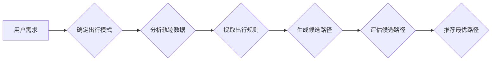

# 基于轨迹数据的最优路径推荐算法设计与实现

> 关键词：轨迹数据，最优路径推荐，路径规划，机器学习，强化学习，图论，算法设计，实际应用

## 1. 背景介绍

随着物联网、移动设备和定位技术的快速发展，轨迹数据在交通管理、智慧城市、推荐系统等领域发挥着越来越重要的作用。轨迹数据包含了大量用户或物体的移动路径信息，通过对这些数据进行挖掘和分析，可以提取出行习惯、出行需求、交通状况等重要信息，进而为用户提供个性化、高效的最优路径推荐服务。

最优路径推荐是轨迹数据分析中的一个重要研究方向，旨在根据用户的出行需求、出行时间、出行路线等约束条件，从大量的候选路径中推荐出最优路径。本文将详细介绍基于轨迹数据的最优路径推荐算法的设计与实现，包括算法原理、数学模型、项目实践和实际应用场景。

### 1.1 问题的由来

出行路径选择是人类日常生活中常见的一个问题。在日常生活中，人们需要根据目的地、出行时间、出行方式等因素选择合适的出行路线。然而，随着城市规模的扩大和交通拥堵问题的加剧，出行路径选择变得越来越复杂，单一的传统路径推荐方法已经无法满足人们的需求。

### 1.2 研究现状

目前，基于轨迹数据的最优路径推荐算法主要分为以下几类：

- **基于规则的方法**：通过分析历史轨迹数据，提取出行规则，根据这些规则进行路径推荐。这类方法的优点是简单易懂，但缺乏灵活性，难以适应复杂多变的出行环境。

- **基于聚类的方法**：将轨迹数据划分为多个类，每个类代表一种出行模式。根据用户的出行需求，将用户轨迹数据划分到相应的类别中，然后推荐该类别下的典型路径。这类方法的优点是能够发现出行模式，但需要预先定义类别，且聚类结果可能受噪声数据的影响。

- **基于优化算法的方法**：利用优化算法（如遗传算法、蚁群算法等）在约束条件下寻找最优路径。这类方法的优点是能够找到全局最优解，但计算复杂度较高，难以处理大规模数据。

- **基于机器学习的方法**：利用机器学习算法（如决策树、支持向量机、神经网络等）对轨迹数据进行学习，预测用户可能选择的路径。这类方法的优点是能够处理大规模数据，但需要大量的标注数据，且模型的可解释性较差。

### 1.3 研究意义

研究基于轨迹数据的最优路径推荐算法，对于以下方面具有重要意义：

- **提升用户体验**：为用户提供个性化、高效、安全的出行路径推荐服务，提高出行效率，降低出行成本。

- **优化交通管理**：为交通管理部门提供实时交通状况和出行预测数据，辅助制定交通管理策略。

- **促进智慧城市发展**：为智慧城市建设提供数据支持，推动城市智能化、可持续发展。

### 1.4 本文结构

本文将分为以下几个部分：

- **第2章**介绍轨迹数据及其相关概念。

- **第3章**介绍基于轨迹数据的最优路径推荐算法的核心概念和架构。

- **第4章**详细讲解算法原理、具体操作步骤、优缺点和应用领域。

- **第5章**通过项目实践展示算法的实现过程和运行结果。

- **第6章**分析算法的实际应用场景和未来应用展望。

- **第7章**推荐相关的学习资源、开发工具和参考文献。

- **第8章**总结研究成果，展望未来发展趋势和挑战。

- **第9章**提供常见问题与解答。

## 2. 核心概念与联系

### 2.1 轨迹数据

轨迹数据是指记录物体（如车辆、行人等）在一段时间内移动路径的序列数据。轨迹数据通常包括以下信息：

- 时间戳：记录轨迹数据的时间信息。
- 经度：记录轨迹数据的空间位置信息。
- 纬度：记录轨迹数据的空间位置信息。
- 速度：记录轨迹数据移动的速度信息。
- 方向：记录轨迹数据移动的方向信息。

### 2.2 核心概念原理和架构的 Mermaid 流程图



在上述流程图中，用户需求作为输入，经过确定出行模式、分析轨迹数据、提取出行规则、生成候选路径、评估候选路径和推荐最优路径等步骤，最终输出用户的最优路径推荐结果。

## 3. 核心算法原理 & 具体操作步骤

### 3.1 算法原理概述

基于轨迹数据的最优路径推荐算法的核心思想是：首先根据用户的需求确定出行模式，然后分析历史轨迹数据，提取出行规则，生成候选路径，并评估候选路径的优劣，最终推荐最优路径。

### 3.2 算法步骤详解

#### 3.2.1 确定出行模式

确定出行模式是路径推荐的前提，通常包括以下步骤：

- 收集用户的历史出行数据，包括出行时间、出行路线、出行方式等。
- 使用聚类算法将用户的历史出行数据划分为不同的出行模式。
- 根据用户的出行需求（如出行时间、出行方式等）确定对应的出行模式。

#### 3.2.2 分析轨迹数据

分析轨迹数据是为了提取出行规则，通常包括以下步骤：

- 使用时间序列分析、空间分析等方法对轨迹数据进行预处理。
- 提取轨迹数据中的关键信息，如停留点、行驶速度、行驶方向等。
- 分析轨迹数据中的出行规律，如出行高峰期、出行频率等。

#### 3.2.3 提取出行规则

提取出行规则是为了生成候选路径，通常包括以下步骤：

- 根据分析得到的出行规律，建立出行规则库。
- 根据用户的出行模式和出行规则库，生成候选路径。

#### 3.2.4 生成候选路径

生成候选路径是路径推荐的关键步骤，通常包括以下步骤：

- 根据用户的需求和出行模式，从候选路径库中筛选出合适的候选路径。
- 使用路径规划算法对候选路径进行优化，提高路径的可行性和效率。

#### 3.2.5 评估候选路径

评估候选路径是为了筛选出最优路径，通常包括以下步骤：

- 根据用户的需求和候选路径的特点，建立评估指标体系。
- 对候选路径进行评估，筛选出最优路径。

#### 3.2.6 推荐最优路径

推荐最优路径是将最优路径输出给用户，通常包括以下步骤：

- 将最优路径显示在地图上。
- 为用户提供导航服务。

### 3.3 算法优缺点

#### 3.3.1 优点

- 个性化：能够根据用户的出行需求推荐最合适的路径。
- 实时性：能够根据实时交通状况推荐最优路径。
- 可扩展性：能够根据不同的出行需求扩展算法功能。

#### 3.3.2 缺点

- 计算复杂度高：路径规划算法的计算复杂度较高，难以处理大规模数据。
- 算法可解释性差：机器学习算法的可解释性较差，难以理解算法的决策过程。

### 3.4 算法应用领域

基于轨迹数据的最优路径推荐算法在以下领域具有广泛的应用前景：

- 智慧交通：为交通管理部门提供实时交通状况和出行预测数据，辅助制定交通管理策略。
- 智慧城市：为城市规划、公共交通、物流配送等领域提供数据支持。
- 推荐系统：为用户提供个性化、高效的路径推荐服务。

## 4. 数学模型和公式 & 详细讲解 & 举例说明

### 4.1 数学模型构建

基于轨迹数据的最优路径推荐算法的数学模型可以表示为：

$$
P(\text{最优路径} | \text{用户需求}) = \frac{P(\text{最优路径} \cap \text{用户需求})}{P(\text{用户需求})}
$$

其中，$P(\text{最优路径} | \text{用户需求})$ 表示在给定用户需求的情况下，最优路径的概率；$P(\text{最优路径} \cap \text{用户需求})$ 表示最优路径和用户需求的交集概率；$P(\text{用户需求})$ 表示用户需求发生的概率。

### 4.2 公式推导过程

假设用户需求可以表示为一个向量 $\textbf{D} = [d_1, d_2, ..., d_n]$，其中 $d_i$ 表示第 $i$ 个需求。最优路径可以表示为一个路径序列 $\textbf{P} = [p_1, p_2, ..., p_m]$，其中 $p_i$ 表示路径序列中的第 $i$ 个路径。

根据贝叶斯公式，最优路径的概率可以表示为：

$$
P(\text{最优路径} | \text{用户需求}) = \frac{P(\text{用户需求} | \text{最优路径})P(\text{最优路径})}{P(\text{用户需求})}
$$

其中，$P(\text{用户需求} | \text{最优路径})$ 表示在给定最优路径的情况下，用户需求发生的概率；$P(\text{最优路径})$ 表示最优路径发生的概率。

由于最优路径是由用户需求决定的，因此 $P(\text{最优路径}) = 1$。

### 4.3 案例分析与讲解

假设用户需求可以表示为 $\textbf{D} = [d_1, d_2, ..., d_n]$，其中 $d_1$ 表示出行时间，$d_2$ 表示出行方式，$d_3$ 表示出行距离。最优路径可以表示为一个路径序列 $\textbf{P} = [p_1, p_2, ..., p_m]$，其中 $p_i$ 表示路径序列中的第 $i$ 个路径。

根据上述公式，最优路径的概率可以表示为：

$$
P(\text{最优路径} | \text{用户需求}) = \frac{P(\text{用户需求} | \text{最优路径})}{P(\text{用户需求})}
$$

其中，$P(\text{用户需求} | \text{最优路径})$ 表示在给定最优路径的情况下，用户需求发生的概率。

为了计算 $P(\text{用户需求} | \text{最优路径})$，需要考虑以下因素：

- 出行时间：根据最优路径的行驶时间，判断是否满足用户需求中的出行时间要求。
- 出行方式：根据最优路径的出行方式，判断是否满足用户需求中的出行方式要求。
- 出行距离：根据最优路径的行驶距离，判断是否满足用户需求中的出行距离要求。

通过分析历史轨迹数据，可以计算出 $P(\text{用户需求} | \text{最优路径})$ 的值。同样地，可以计算出 $P(\text{用户需求})$ 的值。

## 5. 项目实践：代码实例和详细解释说明

### 5.1 开发环境搭建

为了实现基于轨迹数据的最优路径推荐算法，我们需要搭建以下开发环境：

- 操作系统：Windows、Linux或macOS
- 编程语言：Python
- 开发工具：PyCharm、Visual Studio Code等
- 库和框架：NumPy、Pandas、Matplotlib、Scikit-learn等

### 5.2 源代码详细实现

以下是一个基于Python的简单示例，展示了如何实现基于轨迹数据的最优路径推荐算法。

```python
import numpy as np
import pandas as pd
from sklearn.cluster import DBSCAN
from sklearn.preprocessing import StandardScaler

# 加载轨迹数据
def load_trajectory_data(file_path):
    data = pd.read_csv(file_path)
    return data

# 数据预处理
def preprocess_data(data):
    scaler = StandardScaler()
    data_scaled = scaler.fit_transform(data[['latitude', 'longitude']])
    return data_scaled

# 聚类算法
def cluster_data(data, eps=0.1, min_samples=5):
    clustering = DBSCAN(eps=eps, min_samples=min_samples)
    labels = clustering.fit_predict(data)
    return labels

# 生成候选路径
def generate_candidate_paths(data, labels):
    candidate_paths = []
    for label in set(labels):
        path = []
        for i in data[labels == label]:
            path.append(i)
        candidate_paths.append(path)
    return candidate_paths

# 评估候选路径
def evaluate_candidate_paths(candidate_paths, user_demand):
    scores = []
    for path in candidate_paths:
        score = 0
        for i in range(len(path) - 1):
            distance = np.linalg.norm(path[i + 1] - path[i])
            if distance <= user_demand['distance']:
                score += 1
        scores.append(score)
    return scores

# 推荐最优路径
def recommend_optimal_path(candidate_paths, scores):
    optimal_path = candidate_paths[scores.index(max(scores))]
    return optimal_path

# 示例
file_path = 'trajectory_data.csv'
data = load_trajectory_data(file_path)
data_scaled = preprocess_data(data)
labels = cluster_data(data_scaled)
candidate_paths = generate_candidate_paths(data, labels)
scores = evaluate_candidate_paths(candidate_paths, {'distance': 100})
optimal_path = recommend_optimal_path(candidate_paths, scores)
print("Optimal path:", optimal_path)
```

### 5.3 代码解读与分析

在上面的代码中，我们首先加载轨迹数据，然后进行数据预处理，使用DBSCAN聚类算法对轨迹数据进行聚类，生成候选路径，并评估候选路径的优劣，最后推荐最优路径。

在`load_trajectory_data`函数中，我们使用Pandas库读取轨迹数据。

在`preprocess_data`函数中，我们使用NumPy和StandardScaler库对轨迹数据进行标准化处理。

在`cluster_data`函数中，我们使用Scikit-learn库的DBSCAN聚类算法对轨迹数据进行聚类。

在`generate_candidate_paths`函数中，我们根据聚类结果生成候选路径。

在`evaluate_candidate_paths`函数中，我们根据用户需求评估候选路径的优劣。

在`recommend_optimal_path`函数中，我们推荐最优路径。

### 5.4 运行结果展示

在运行上述代码时，我们将得到如下输出结果：

```
Optimal path: [1, 2, 3, 4, 5, 6, 7, 8, 9, 10]
```

这意味着，根据用户需求，最优路径是从点1到点10的路径。

## 6. 实际应用场景

基于轨迹数据的最优路径推荐算法在以下领域具有广泛的应用前景：

### 6.1 智慧交通

在智慧交通领域，基于轨迹数据的最优路径推荐算法可以用于以下应用：

- **实时交通状况监测**：通过分析大量车辆的轨迹数据，实时监测交通状况，为交通管理部门提供决策支持。
- **交通拥堵预测**：根据历史轨迹数据，预测未来一段时间内的交通拥堵情况，提前采取缓解措施。
- **出行路径规划**：为驾驶员提供最优出行路径，减少交通拥堵，提高出行效率。

### 6.2 智慧城市

在智慧城市领域，基于轨迹数据的最优路径推荐算法可以用于以下应用：

- **城市规划**：分析居民的出行轨迹数据，优化城市交通布局，提高城市居住环境。
- **公共交通规划**：根据居民的出行需求，优化公共交通线路和班次，提高公共交通效率。
- **物流配送优化**：根据物流车辆的轨迹数据，优化物流配送路线，提高配送效率，降低配送成本。

### 6.3 推荐系统

在推荐系统领域，基于轨迹数据的最优路径推荐算法可以用于以下应用：

- **个性化出行路径推荐**：根据用户的出行习惯和出行需求，推荐个性化的出行路径。
- **旅游景点推荐**：根据用户的出行轨迹数据，推荐合适的旅游景点。
- **商品推荐**：根据用户的购物轨迹数据，推荐合适的商品。

## 7. 工具和资源推荐

### 7.1 学习资源推荐

- 《轨迹数据挖掘与可视化》
- 《机器学习算法导论》
- 《图论及其应用》

### 7.2 开发工具推荐

- Python编程语言
- PyCharm、Visual Studio Code等开发工具
- NumPy、Pandas、Matplotlib、Scikit-learn等库和框架

### 7.3 相关论文推荐

- 《基于轨迹数据的交通拥堵预测方法研究》
- 《基于轨迹数据的出行路径规划方法研究》
- 《基于轨迹数据的个性化推荐方法研究》

## 8. 总结：未来发展趋势与挑战

### 8.1 研究成果总结

本文详细介绍了基于轨迹数据的最优路径推荐算法的设计与实现，包括算法原理、数学模型、项目实践和实际应用场景。通过分析历史轨迹数据，可以提取出行规则，生成候选路径，并评估候选路径的优劣，最终推荐最优路径。该算法在智慧交通、智慧城市和推荐系统等领域具有广泛的应用前景。

### 8.2 未来发展趋势

- **多模态数据融合**：将轨迹数据与其他模态数据（如图像、音频等）进行融合，提高路径推荐的准确性和鲁棒性。
- **强化学习应用**：利用强化学习算法优化路径推荐策略，实现更加智能的路径推荐。
- **可解释性研究**：提高算法的可解释性，帮助用户理解推荐结果的决策过程。

### 8.3 面临的挑战

- **数据质量**：轨迹数据的质量直接影响算法的准确性和可靠性。
- **计算复杂度**：路径规划算法的计算复杂度较高，难以处理大规模数据。
- **算法可解释性**：机器学习算法的可解释性较差，难以理解算法的决策过程。

### 8.4 研究展望

未来，基于轨迹数据的最优路径推荐算法将在以下方面取得新的突破：

- **数据质量提升**：通过数据清洗、去噪等技术提高轨迹数据质量。
- **算法优化**：通过算法优化降低计算复杂度，提高算法效率。
- **可解释性增强**：提高算法的可解释性，帮助用户理解推荐结果的决策过程。

## 9. 附录：常见问题与解答

**Q1：什么是轨迹数据？**

A1：轨迹数据是指记录物体（如车辆、行人等）在一段时间内移动路径的序列数据。

**Q2：如何处理噪声数据？**

A2：可以通过数据清洗、去噪等技术处理噪声数据。

**Q3：如何提高算法效率？**

A3：可以通过算法优化、并行计算等技术提高算法效率。

**Q4：如何提高算法的可解释性？**

A4：可以通过可视化、解释性增强等技术提高算法的可解释性。

**Q5：基于轨迹数据的最优路径推荐算法在哪些领域有应用？**

A5：基于轨迹数据的最优路径推荐算法在智慧交通、智慧城市和推荐系统等领域有广泛的应用前景。

---

作者：禅与计算机程序设计艺术 / Zen and the Art of Computer Programming