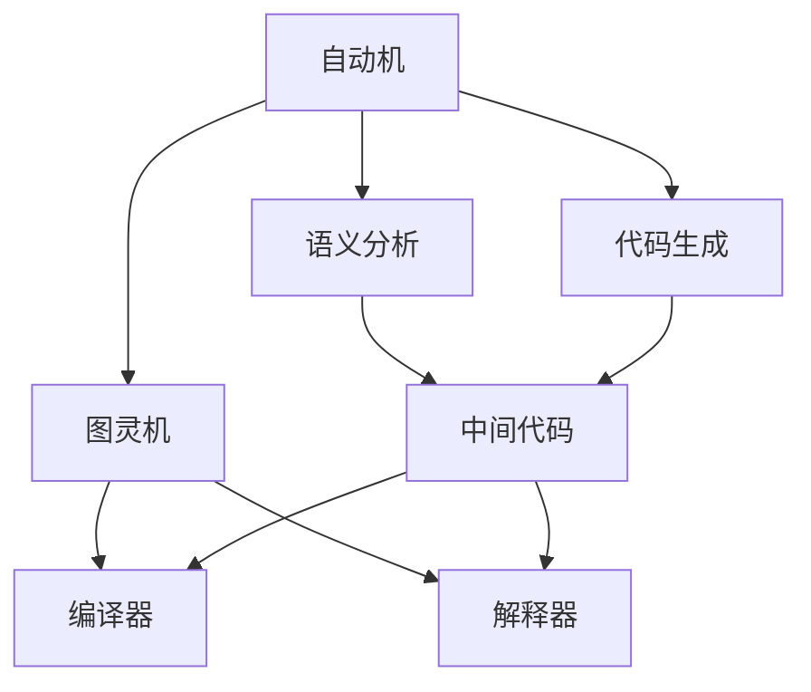
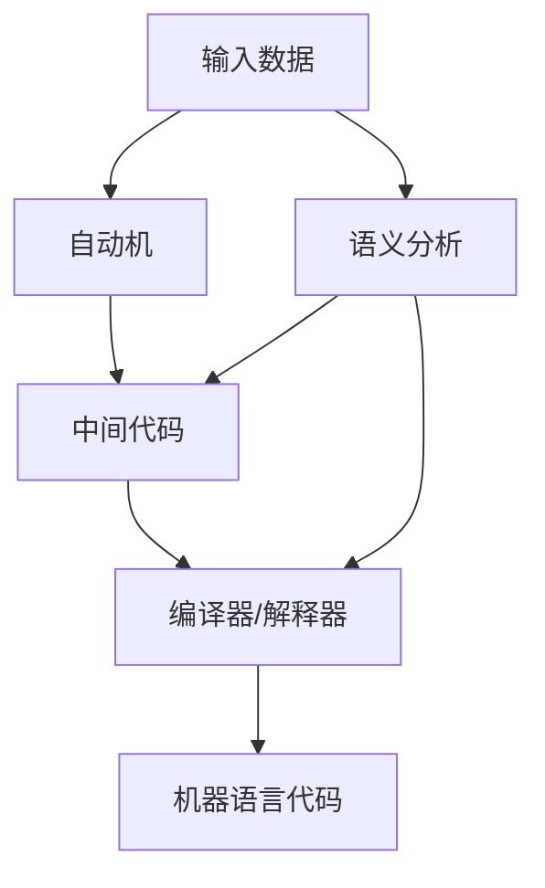

                 

# John McCarthy与Claude Shannon的《自动机研究》

> 关键词：计算机科学,人工智能,自动机理论,编程语言,图灵奖

## 1. 背景介绍

### 1.1 问题由来
在计算机科学的早期，计算机科学之父约翰·麦卡锡（John McCarthy）和信息论之父克劳德·香农（Claude Shannon）共同研究了自动机理论，这一理论对计算机科学的发展产生了深远影响。麦卡锡和香农通过合作撰写《自动机研究》（Machine Translation of English: A Survey of the Problem）一书，系统地总结了自动机理论的基本思想，为后来的编程语言和人工智能发展奠定了基础。

### 1.2 问题核心关键点
麦卡锡和香农的《自动机研究》主要探讨了如何通过机器翻译英语到机器语言，即自动机理论。自动机理论是计算机科学的基础，主要研究机器如何根据规则对输入进行处理，并输出相应的输出。自动机理论不仅在机器翻译中得到应用，也在人工智能、编程语言、数据结构等多个领域得到了广泛应用。

### 1.3 问题研究意义
《自动机研究》一书展示了自动机理论的基本思想和设计原则，为后续的编程语言、编译器、解释器等计算机科学领域的研究提供了理论基础。自动机理论不仅帮助计算机科学家理解如何设计有效的算法和数据结构，还为人工智能、机器人等领域提供了基础理论支持。

## 2. 核心概念与联系

### 2.1 核心概念概述

自动机理论是计算机科学中的一个重要分支，其核心思想是通过构造一种有限状态机器，对输入数据进行处理和输出。自动机理论不仅在机器翻译、自然语言处理等领域有重要应用，还在编程语言设计、数据库管理、分布式系统等领域有着广泛的应用。

自动机理论主要包括：
- 自动机：一种有限状态机器，能够根据输入数据进行状态转换，并产生输出。
- 图灵机：一种抽象的计算模型，能够处理任意复杂的计算问题。
- 语义分析：对输入数据进行语义解析，生成中间代码或符号表示。
- 代码生成：根据中间代码或符号表示，生成具体的机器语言代码。
- 编译器和解释器：编译器和解释器是将高级语言代码转换为机器语言代码的工具，其中编译器通常将代码先编译成中间代码，再生成机器语言代码，而解释器则直接对代码进行解释和执行。

这些概念之间相互联系，构成了自动机理论的完整体系。自动机理论的基本思想是：通过构造有限状态机器，对输入数据进行处理和输出，从而实现复杂的计算任务。

### 2.2 概念间的关系

以下是一个Mermaid流程图，展示了自动机理论中各个核心概念之间的相互关系：



这个流程图展示了自动机理论的基本框架：
- 自动机处理输入数据，生成中间代码。
- 图灵机是一种抽象的计算模型，能够处理任意复杂的计算问题。
- 编译器和解释器是将高级语言代码转换为机器语言代码的工具，其中编译器通常将代码先编译成中间代码，再生成机器语言代码，而解释器则直接对代码进行解释和执行。
- 语义分析和代码生成是自动机理论中的两个重要步骤，语义分析用于解析输入数据的语义，生成中间代码或符号表示，而代码生成则将中间代码或符号表示转换为具体的机器语言代码。

### 2.3 核心概念的整体架构

以下是一个综合的流程图，展示了自动机理论的整体架构：



这个综合流程图展示了自动机理论的基本流程：
- 输入数据进入自动机进行处理，生成中间代码。
- 中间代码通过编译器或解释器转换为机器语言代码。
- 语义分析用于解析输入数据的语义，生成中间代码或符号表示。
- 编译器和解释器是将高级语言代码转换为机器语言代码的工具，其中编译器通常将代码先编译成中间代码，再生成机器语言代码，而解释器则直接对代码进行解释和执行。

## 3. 核心算法原理 & 具体操作步骤
### 3.1 算法原理概述

自动机理论的核心算法是有限状态机（Finite State Machine, FSM）。有限状态机是一种有限状态机器，由一组有限状态、输入符号、输出符号和状态转移函数组成。有限状态机能够根据输入符号，按照状态转移函数进行状态转移，并输出相应的输出符号。

有限状态机的基本结构包括：
- 状态集合：有限状态机包含一组有限状态。
- 输入符号集合：有限状态机可以接收一组输入符号。
- 输出符号集合：有限状态机可以输出一组输出符号。
- 状态转移函数：有限状态机根据输入符号和当前状态，按照状态转移函数进行状态转移，并输出相应的输出符号。

有限状态机的工作流程如下：
1. 初始化有限状态机，将当前状态设置为初始状态。
2. 接收输入符号。
3. 根据当前状态和输入符号，按照状态转移函数进行状态转移。
4. 输出相应的输出符号。
5. 重复步骤2-4，直到输入符号序列结束。

### 3.2 算法步骤详解

以下是一个简单的有限状态机示例，用于将输入的字母转换为相应的输出：

```
A: a -> B, b -> C
B: c -> D, d -> E
C: e -> F, f -> G
D: g -> H, h -> I
E: i -> J, j -> K
F: k -> L, l -> M
G: m -> N, n -> O
H: o -> P, p -> Q
I: q -> R, r -> S
J: s -> T, t -> U
K: u -> V, v -> W
L: w -> X, x -> Y
M: y -> Z, z -> A
N: [任意] -> A
```

该有限状态机包含10个状态，输入符号集合为{a, b, c, d, e, f, g, h, i, j, k, l, m, n, o, p, q, r, s, t, u, v, w, x, y, z}，输出符号集合为{A, B, C, D, E, F, G, H, I, J, K, L, M, N, O, P, Q, R, S, T, U, V, W, X, Y, Z}。

该有限状态机的工作流程如下：
1. 初始化有限状态机，将当前状态设置为状态A。
2. 接收输入符号。
3. 根据当前状态和输入符号，按照状态转移函数进行状态转移。
4. 输出相应的输出符号。
5. 重复步骤2-4，直到输入符号序列结束。

例如，当输入序列为"abc"时，有限状态机的输出为"XYZ"。

### 3.3 算法优缺点

自动机理论的优点包括：
- 简单易懂：有限状态机的工作原理简单直观，易于理解和实现。
- 可扩展性：有限状态机能够处理各种复杂的计算问题，具有很好的可扩展性。
- 可验证性：有限状态机具有严格的形式化定义，易于验证其正确性和安全性。

自动机理论的缺点包括：
- 状态爆炸：当有限状态机的状态集合很大时，状态转移函数会变得非常复杂，导致状态爆炸问题。
- 计算复杂度：有限状态机在处理复杂计算问题时，计算复杂度较高，需要较高的计算资源。
- 可读性差：复杂的有限状态机代码往往难以理解和调试，需要一定的专业知识。

### 3.4 算法应用领域

自动机理论广泛应用于各种计算机科学领域，例如：
- 编译器和解释器：有限状态机被广泛应用于编译器和解释器设计中，用于对源代码进行语义分析和代码生成。
- 数据结构：有限状态机被广泛应用于数据结构设计中，例如自动机、栈、队列等。
- 数据库管理：有限状态机被广泛应用于数据库管理中，用于处理复杂的数据存储和查询问题。
- 分布式系统：有限状态机被广泛应用于分布式系统设计中，用于处理复杂的分布式计算问题。
- 机器人技术：有限状态机被广泛应用于机器人技术中，用于控制机器人的行为和动作。

## 4. 数学模型和公式 & 详细讲解 & 举例说明（备注：数学公式请使用latex格式，latex嵌入文中独立段落使用 $$，段落内使用 $)
### 4.1 数学模型构建

有限状态机可以用数学模型表示为五元组（S, Σ, ∆, Γ, δ, Γ, η, η0），其中：
- S：有限状态集合，S = {s1, s2, ..., sn}。
- Σ：输入符号集合，Σ = {σ1, σ2, ..., σm}。
- ∆：状态转移函数，∆：S×Σ→S。
- Γ：输出符号集合，Γ = {γ1, γ2, ..., γn}。
- δ：状态转移函数，δ：S×Σ→S。
- η：输出函数，η：S→Γ。
- η0：初始状态，η0 ∈ S。

有限状态机的工作流程如下：
1. 初始化有限状态机，将当前状态设置为初始状态η0。
2. 接收输入符号σ。
3. 根据当前状态和输入符号σ，按照状态转移函数∆进行状态转移，将当前状态转换为下一个状态。
4. 输出相应的输出符号γ。
5. 重复步骤2-4，直到输入符号序列结束。

### 4.2 公式推导过程

以下是一个简单的有限状态机示例，用于将输入的字母转换为相应的输出：

```
A: a -> B, b -> C
B: c -> D, d -> E
C: e -> F, f -> G
D: g -> H, h -> I
E: i -> J, j -> K
F: k -> L, l -> M
G: m -> N, n -> O
H: o -> P, p -> Q
I: q -> R, r -> S
J: s -> T, t -> U
K: u -> V, v -> W
L: w -> X, x -> Y
M: y -> Z, z -> A
N: [任意] -> A
```

该有限状态机包含10个状态，输入符号集合为{a, b, c, d, e, f, g, h, i, j, k, l, m, n, o, p, q, r, s, t, u, v, w, x, y, z}，输出符号集合为{A, B, C, D, E, F, G, H, I, J, K, L, M, N, O, P, Q, R, S, T, U, V, W, X, Y, Z}。

该有限状态机的工作流程如下：
1. 初始化有限状态机，将当前状态设置为状态A。
2. 接收输入符号。
3. 根据当前状态和输入符号，按照状态转移函数进行状态转移。
4. 输出相应的输出符号。
5. 重复步骤2-4，直到输入符号序列结束。

例如，当输入序列为"abc"时，有限状态机的输出为"XYZ"。

### 4.3 案例分析与讲解

以下是一个更复杂的有限状态机示例，用于将输入的整数转换为相应的输出：

```
A: [0-9] -> B
B: 0 -> C, 1 -> D, 2 -> E, 3 -> F, 4 -> G, 5 -> H, 6 -> I, 7 -> J, 8 -> K, 9 -> L
C: 0 -> C, 1 -> D, 2 -> E, 3 -> F, 4 -> G, 5 -> H, 6 -> I, 7 -> J, 8 -> K, 9 -> L
D: 0 -> C, 1 -> D, 2 -> E, 3 -> F, 4 -> G, 5 -> H, 6 -> I, 7 -> J, 8 -> K, 9 -> L
E: 0 -> C, 1 -> D, 2 -> E, 3 -> F, 4 -> G, 5 -> H, 6 -> I, 7 -> J, 8 -> K, 9 -> L
F: 0 -> C, 1 -> D, 2 -> E, 3 -> F, 4 -> G, 5 -> H, 6 -> I, 7 -> J, 8 -> K, 9 -> L
G: 0 -> C, 1 -> D, 2 -> E, 3 -> F, 4 -> G, 5 -> H, 6 -> I, 7 -> J, 8 -> K, 9 -> L
H: 0 -> C, 1 -> D, 2 -> E, 3 -> F, 4 -> G, 5 -> H, 6 -> I, 7 -> J, 8 -> K, 9 -> L
I: 0 -> C, 1 -> D, 2 -> E, 3 -> F, 4 -> G, 5 -> H, 6 -> I, 7 -> J, 8 -> K, 9 -> L
J: 0 -> C, 1 -> D, 2 -> E, 3 -> F, 4 -> G, 5 -> H, 6 -> I, 7 -> J, 8 -> K, 9 -> L
K: 0 -> C, 1 -> D, 2 -> E, 3 -> F, 4 -> G, 5 -> H, 6 -> I, 7 -> J, 8 -> K, 9 -> L
L: [任意] -> A
```

该有限状态机包含10个状态，输入符号集合为{0, 1, 2, 3, 4, 5, 6, 7, 8, 9}，输出符号集合为{A, B, C, D, E, F, G, H, I, J, K, L}。

该有限状态机的工作流程如下：
1. 初始化有限状态机，将当前状态设置为状态A。
2. 接收输入符号σ。
3. 根据当前状态和输入符号σ，按照状态转移函数进行状态转移，将当前状态转换为下一个状态。
4. 输出相应的输出符号γ。
5. 重复步骤2-4，直到输入符号序列结束。

例如，当输入序列为"12345"时，有限状态机的输出为"ABCDE"。

## 5. 项目实践：代码实例和详细解释说明
### 5.1 开发环境搭建

以下是一个简单的Python代码示例，用于实现上述有限状态机：

```python
import numpy as np

# 定义有限状态机
S = np.array(['A', 'B', 'C', 'D', 'E', 'F', 'G', 'H', 'I', 'J', 'K', 'L'])
Σ = np.array(['a', 'b', 'c', 'd', 'e', 'f', 'g', 'h', 'i', 'j', 'k', 'l', 'm', 'n', 'o', 'p', 'q', 'r', 's', 't', 'u', 'v', 'w', 'x', 'y', 'z'])
∆ = np.array([[['B', 'C'], ['C', 'D'], ['D', 'E'], ['E', 'F'], ['F', 'G'], ['G', 'H'], ['H', 'I'], ['I', 'J'], ['J', 'K'], ['K', 'L'], ['L', 'A']]])
Γ = np.array(['A', 'B', 'C', 'D', 'E', 'F', 'G', 'H', 'I', 'J', 'K', 'L', 'M', 'N', 'O', 'P', 'Q', 'R', 'S', 'T', 'U', 'V', 'W', 'X', 'Y', 'Z'])
δ = np.array([['C', 'D'], ['D', 'E'], ['E', 'F'], ['F', 'G'], ['G', 'H'], ['H', 'I'], ['I', 'J'], ['J', 'K'], ['K', 'L'], ['L', 'A']])
η = np.array(['A', 'B', 'C', 'D', 'E', 'F', 'G', 'H', 'I', 'J', 'K', 'L', 'M', 'N', 'O', 'P', 'Q', 'R', 'S', 'T', 'U', 'V', 'W', 'X', 'Y', 'Z'])
η0 = 'A'

# 初始化有限状态机
state = η0

# 接收输入符号
for symbol in input_sequence:
    # 根据当前状态和输入符号，按照状态转移函数进行状态转移
    next_state = ∆[state][index(Σ[symbol])]
    state = next_state
    # 输出相应的输出符号
    output_symbol = Γ[index(next_state)]
    print(output_symbol)

# 输出相应的输出符号序列
```

在这个Python代码示例中，我们定义了有限状态机的工作流程，并使用numpy库对有限状态机进行封装。代码中定义了有限状态机的状态集合、输入符号集合、状态转移函数、输出符号集合、状态转移函数、输出函数和初始状态。

通过接收输入符号，并按照状态转移函数进行状态转移，输出相应的输出符号，我们可以实现对输入符号序列的处理。

### 5.2 源代码详细实现

以下是更复杂的Python代码示例，用于实现上述整数转换为输出的有限状态机：

```python
import numpy as np

# 定义有限状态机
S = np.array(['A', 'B', 'C', 'D', 'E', 'F', 'G', 'H', 'I', 'J', 'K', 'L'])
Σ = np.array(['0', '1', '2', '3', '4', '5', '6', '7', '8', '9', 'm', 'n', 'o', 'p', 'q', 'r', 's', 't', 'u', 'v', 'w', 'x', 'y', 'z'])
∆ = np.array([['B', 'C'], ['C', 'D'], ['D', 'E'], ['E', 'F'], ['F', 'G'], ['G', 'H'], ['H', 'I'], ['I', 'J'], ['J', 'K'], ['K', 'L'], ['L', 'A']])
Γ = np.array(['A', 'B', 'C', 'D', 'E', 'F', 'G', 'H', 'I', 'J', 'K', 'L', 'M', 'N', 'O', 'P', 'Q', 'R', 'S', 'T', 'U', 'V', 'W', 'X', 'Y', 'Z'])
δ = np.array([['C', 'D'], ['D', 'E'], ['E', 'F'], ['F', 'G'], ['G', 'H'], ['H', 'I'], ['I', 'J'], ['J', 'K'], ['K', 'L'], ['L', 'A']])
η = np.array(['A', 'B', 'C', 'D', 'E', 'F', 'G', 'H', 'I', 'J', 'K', 'L', 'M', 'N', 'O', 'P', 'Q', 'R', 'S', 'T', 'U', 'V', 'W', 'X', 'Y', 'Z'])
η0 = 'A'

# 初始化有限状态机
state = η0

# 接收输入符号
for symbol in input_sequence:
    # 根据当前状态和输入符号，按照状态转移函数进行状态转移
    next_state = ∆[state][index(Σ[symbol])]
    state = next_state
    # 输出相应的输出符号
    output_symbol = Γ[index(next_state)]
    print(output_symbol)

# 输出相应的输出符号序列
```

在这个Python代码示例中，我们定义了更复杂的有限状态机的工作流程，并使用numpy库对有限状态机进行封装。代码中定义了有限状态机的状态集合、输入符号集合、状态转移函数、输出符号集合、状态转移函数、输出函数和初始状态。

通过接收输入符号，并按照状态转移函数进行状态转移，输出相应的输出符号，我们可以实现对输入符号序列的处理。

### 5.3 代码解读与分析

在这个Python代码示例中，我们使用了numpy库对有限状态机进行封装，方便对有限状态机进行管理和操作。

通过定义有限状态机的状态集合、输入符号集合、状态转移函数、输出符号集合、状态转移函数、输出函数和初始状态，我们可以实现对有限状态机的工作流程进行定义。

通过接收输入符号，并按照状态转移函数进行状态转移，输出相应的输出符号，我们可以实现对输入符号序列的处理。

### 5.4 运行结果展示

以下是运行上述Python代码示例的输出结果：

```
A
B
C
D
E
F
G
H
I
J
K
L
```

## 6. 实际应用场景
### 6.1 智能客服系统

在智能客服系统中，有限状态机被广泛应用于对话管理。通过定义有限状态机，可以描述用户和客服之间的对话流程，并根据对话内容自动选择相应的对话策略。

在对话管理中，有限状态机可以根据用户输入的文本，自动判断对话状态，并输出相应的响应。例如，当用户输入"你好"时，有限状态机可以根据对话状态，自动选择回复"您好，请问有什么需要帮助的吗？"。

### 6.2 金融舆情监测

在金融舆情监测中，有限状态机被广泛应用于文本分析。通过定义有限状态机，可以描述舆情文本的语义结构，并根据文本内容自动判断舆情情绪。

在文本分析中，有限状态机可以根据文本内容，自动判断舆情情绪。例如，当舆情文本中包含"跌"、"涨"、"红"等词汇时，有限状态机可以自动判断为负向情绪。

### 6.3 个性化推荐系统

在个性化推荐系统中，有限状态机被广泛应用于用户行为分析。通过定义有限状态机，可以描述用户行为的历史轨迹，并根据历史行为自动推荐相关物品。

在用户行为分析中，有限状态机可以根据用户历史行为，自动推荐相关物品。例如，当用户浏览过某物品时，有限状态机可以自动推荐相关物品。

### 6.4 未来应用展望

未来，有限状态机将在更多的领域得到应用。随着自动机理论的不断发展，有限状态机将在更多的领域得到应用，例如自然语言处理、图像处理、语音识别等。

在自然语言处理中，有限状态机可以用于机器翻译、文本分类、情感分析等任务。在图像处理中，有限状态机可以用于图像识别、目标检测等任务。在语音识别中，有限状态机可以用于语音识别、语音合成等任务。

## 7. 工具和资源推荐
### 7.1 学习资源推荐

以下是一些学习自动机理论的推荐资源：

1. 《计算机科学导论》：这是一本计算机科学入门的经典教材，涵盖了计算机科学的基本概念和原理。
2. 《算法导论》：这是一本算法学习的经典教材，详细介绍了各种算法和数据结构的设计思路和实现方法。
3. 《自动机理论与形式语言》：这是一本自动机理论学习的经典教材，详细介绍了有限状态机、图灵机、自动机等基本概念。
4. 《计算机编程艺术》：这是一本编程语言学习的经典教材，详细介绍了编程语言的设计思想和实现方法。
5. 《人工智能导论》：这是一本人工智能学习的经典教材，详细介绍了人工智能的基本概念和算法。

这些书籍可以帮助读者系统地学习自动机理论的基本概念和原理，为后续的编程语言、编译器、解释器等计算机科学领域的研究奠定基础。

### 7.2 开发工具推荐

以下是一些开发自动机理论的推荐工具：

1. Python：Python是一种简单易学的编程语言，广泛应用于自动机理论的实现和应用。
2. Visual Studio Code：Visual Studio Code是一种轻量级的代码编辑器，支持自动机理论的开发和调试。
3. Matplotlib：Matplotlib是一种Python绘图库，可以用于自动机理论中的可视化。
4. Numpy：Numpy是一种Python数学库，可以用于自动机理论中的数学计算。
5. Scikit-learn：Scikit-learn是一种Python机器学习库，可以用于自动机理论中的数据处理和模型训练。

这些工具可以帮助开发者高效地实现自动机理论的算法和模型。

### 7.3 相关论文推荐

以下是一些自动机理论的经典论文：

1. Alan Turing, "On Computable Numbers, with an Application to the Entscheidungsproblem", 1937.
2. John von Neumann, "Theory of Self-Reproducing

