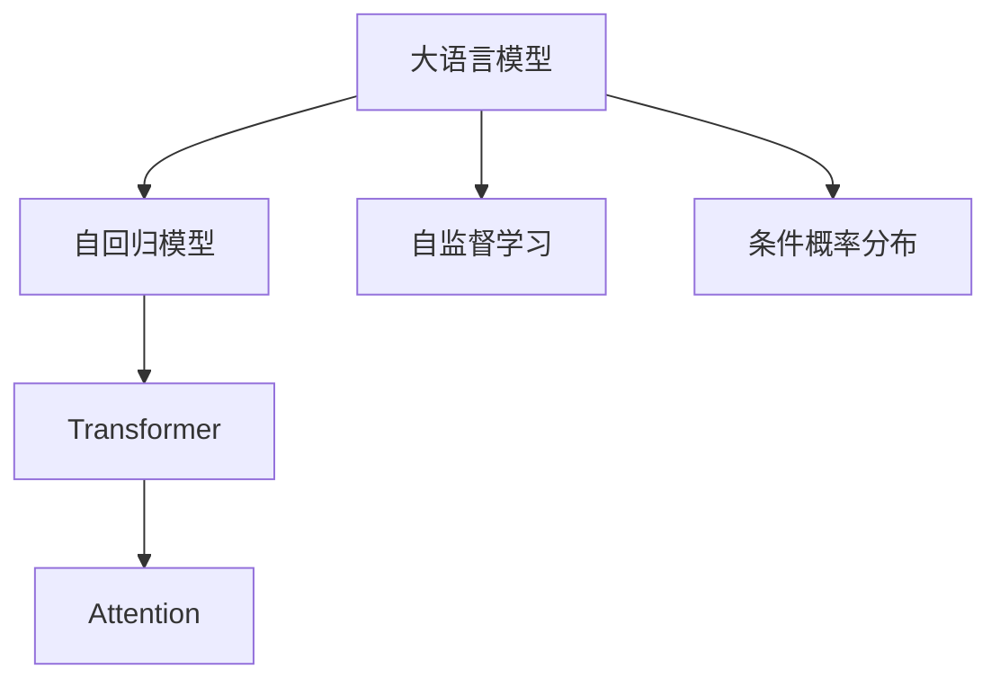
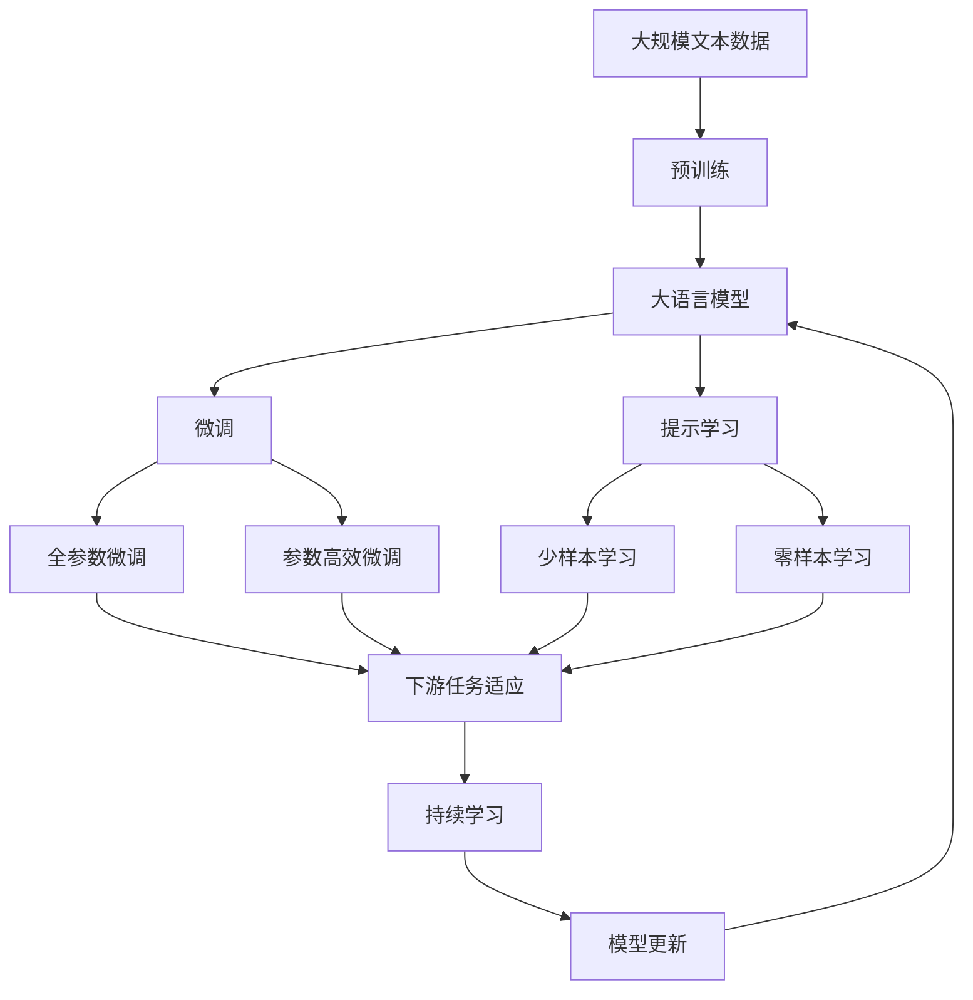

                 

# 大语言模型原理与工程实践：Decoder 的代表：GPT 系列

> 关键词：大语言模型,生成模型,自回归模型,GPT,Transformer,BERT

## 1. 背景介绍

### 1.1 问题由来
近年来，深度学习技术在自然语言处理（NLP）领域取得了显著的进步。尤其是自回归（autoregressive）大语言模型，通过在庞大的无标签文本数据上进行预训练，学习到了丰富的语言知识和常识，为下游任务提供了强大的语言理解和生成能力。

其中，GPT系列模型作为自回归模型的代表，通过Transformer编码器解码器架构的巧妙设计，展现出了卓越的生成性能，成为了研究界和工业界的明星模型。然而，GPT系列模型如何生成自然流畅的文本，实现高效的计算，以及其在实际应用中的性能和局限性，这些都是亟待深入探讨的问题。

### 1.2 问题核心关键点
大语言模型生成文本的过程，可以理解为一种复杂的序列生成任务。在GPT系列模型中，预训练的目标是将输入序列转化为条件概率分布，并根据此分布生成新的序列。微调模型则是利用任务特定的数据，优化模型参数，使其在特定任务上表现更佳。

核心问题包括：
- GPT模型生成文本的原理是什么？
- 如何使用GPT模型进行高效计算？
- 在实际应用中，GPT模型的性能如何？
- GPT模型的局限性和未来发展方向是什么？

### 1.3 问题研究意义
研究GPT系列模型的原理和工程实践，对于拓展其应用范围，提升模型性能，加速NLP技术的产业化进程，具有重要意义：

1. 降低应用开发成本。基于GPT模型进行微调，可以显著减少从头开发所需的数据、计算和人力等成本投入。
2. 提升模型效果。GPT模型能够生成自然流畅的文本，在各类NLP任务上表现优异，通过微调，可以进一步提升模型在特定任务上的性能。
3. 加速开发进度。standing on the shoulders of giants，GPT模型已经具备了良好的生成能力，微调使得开发者可以更快地完成任务适配，缩短开发周期。
4. 带来技术创新。微调范式促进了对GPT模型的深入研究，催生了提示学习、少样本学习等新的研究方向。
5. 赋能产业升级。GPT模型在NLP技术中的应用，加速了各行各业数字化转型升级的进程，为传统行业注入新的技术动力。

## 2. 核心概念与联系

### 2.1 核心概念概述

为更好地理解GPT系列模型的生成原理和工程实践，本节将介绍几个密切相关的核心概念：

- 大语言模型(Large Language Model, LLM)：以自回归模型为代表的大规模预训练语言模型。通过在无标签文本数据上进行预训练，学习通用的语言表示，具备强大的语言理解和生成能力。
- 自回归模型(Autoregressive Model)：一种通过已有序列信息预测下一个元素的模型，如GPT、BERT等。
- Transformer：一种用于处理序列数据的神经网络架构，采用了多头注意力机制，可以高效地处理长序列。
- Attention：Transformer中的关键机制，用于捕捉序列中不同位置的信息。
- 条件概率分布(Conditional Probability Distribution)：在生成模型中，每个时刻的输出是依赖于前一时刻的输出的。这种概率分布称为条件概率分布。
- 自监督学习(Self-supervised Learning)：利用无标签数据，通过构建自监督任务，训练模型。

这些核心概念之间的逻辑关系可以通过以下Mermaid流程图来展示：



这个流程图展示了大语言模型的核心概念及其之间的关系：

1. 大语言模型通过自监督学习在无标签数据上进行预训练。
2. 自回归模型通过已有序列信息预测下一个元素，如GPT系列模型。
3. Transformer利用多头注意力机制高效处理序列数据。
4. Attention机制用于捕捉序列中不同位置的信息。
5. 条件概率分布用于生成模型的预测。

### 2.2 概念间的关系

这些核心概念之间存在着紧密的联系，形成了GPT系列模型的生成原理和工程实践框架。下面我们通过几个Mermaid流程图来展示这些概念之间的关系。

#### 2.2.1 GPT系列模型的生成原理


这个流程图展示了GPT系列模型的生成原理，从输入序列到输出序列的过程：

1. 输入序列被送入自回归模型中，利用Transformer架构和Attention机制，捕捉序列中不同位置的信息。
2. 模型预测下一个元素的概率分布，即条件概率分布。
3. 利用条件概率分布生成下一个元素，形成输出序列。

#### 2.2.2 自监督学习和条件概率分布的关系


这个流程图展示了自监督学习在模型训练中的作用，以及如何通过条件概率分布生成序列：

1. 无标签数据通过自监督学习任务训练模型参数。
2. 训练得到的模型参数形成了条件概率分布。
3. 利用条件概率分布生成新的序列。

### 2.3 核心概念的整体架构

最后，我们用一个综合的流程图来展示这些核心概念在大语言模型生成过程中的整体架构：



这个综合流程图展示了从预训练到微调，再到持续学习的完整过程。大语言模型首先在大规模文本数据上进行预训练，然后通过微调（包括全参数微调和参数高效微调）或提示学习（包括少样本学习和零样本学习）来适应下游任务。最后，通过持续学习技术，模型可以不断学习新知识，同时避免遗忘旧知识。 通过这些流程图，我们可以更清晰地理解大语言模型生成的原理和工程实践，为后续深入讨论具体的微调方法和技术奠定基础。

## 3. 核心算法原理 & 具体操作步骤
### 3.1 算法原理概述

GPT系列模型的生成过程，本质上是一种复杂的序列生成任务。通过自回归模型和Transformer架构的巧妙设计，GPT系列模型能够高效地生成自然流畅的文本。

具体来说，GPT模型利用自回归模型和Transformer架构，捕捉输入序列中的信息，并预测下一个元素的概率分布。然后，通过采样策略（如基于贪婪策略或温度参数调整的softmax采样），从概率分布中生成下一个元素。这个过程不断迭代，生成整个序列。

数学上，假设输入序列为 $\{x_1, x_2, \cdots, x_n\}$，输出序列为 $\{y_1, y_2, \cdots, y_n\}$。GPT模型的生成过程可以表示为：

$$
P(y_i|y_{i-1}, y_{i-2}, \cdots, y_1; \theta)
$$

其中，$\theta$ 为模型参数，$P(y_i|y_{i-1}, y_{i-2}, \cdots, y_1)$ 表示在给定前 $i-1$ 个元素的情况下，生成第 $i$ 个元素的分布。

### 3.2 算法步骤详解

GPT系列模型的生成过程可以分为以下几个关键步骤：

**Step 1: 准备预训练模型和数据集**
- 选择合适的预训练语言模型 $M_{\theta}$ 作为初始化参数，如 GPT-2、GPT-3等。
- 准备下游任务 $T$ 的标注数据集 $D=\{(x_i, y_i)\}_{i=1}^N, x_i \in \mathcal{X}, y_i \in \mathcal{Y}$。一般要求标注数据与预训练数据的分布不要差异过大。

**Step 2: 添加任务适配层**
- 根据任务类型，在预训练模型顶层设计合适的输出层和损失函数。
- 对于分类任务，通常在顶层添加线性分类器和交叉熵损失函数。
- 对于生成任务，通常使用语言模型的解码器输出概率分布，并以负对数似然为损失函数。

**Step 3: 设置微调超参数**
- 选择合适的优化算法及其参数，如 AdamW、SGD 等，设置学习率、批大小、迭代轮数等。
- 设置正则化技术及强度，包括权重衰减、Dropout、Early Stopping 等。
- 确定冻结预训练参数的策略，如仅微调顶层，或全部参数都参与微调。

**Step 4: 执行梯度训练**
- 将训练集数据分批次输入模型，前向传播计算损失函数。
- 反向传播计算参数梯度，根据设定的优化算法和学习率更新模型参数。
- 周期性在验证集上评估模型性能，根据性能指标决定是否触发 Early Stopping。
- 重复上述步骤直到满足预设的迭代轮数或 Early Stopping 条件。

**Step 5: 测试和部署**
- 在测试集上评估微调后模型 $M_{\hat{\theta}}$ 的性能，对比微调前后的精度提升。
- 使用微调后的模型对新样本进行推理预测，集成到实际的应用系统中。
- 持续收集新的数据，定期重新微调模型，以适应数据分布的变化。

以上是GPT系列模型生成过程的一般流程。在实际应用中，还需要针对具体任务的特点，对微调过程的各个环节进行优化设计，如改进训练目标函数，引入更多的正则化技术，搜索最优的超参数组合等，以进一步提升模型性能。

### 3.3 算法优缺点

GPT系列模型在生成文本方面具有以下优点：
1. 生成流畅自然。GPT系列模型在生成文本时，能够根据上下文信息，生成符合语法和语义规则的自然流畅文本。
2. 通用适用。GPT模型在各类NLP任务上都有不错的表现，如文本生成、问答、对话等。
3. 可扩展性强。GPT系列模型可以通过增加参数量，进一步提升生成能力。
4. 迁移能力强。GPT模型可以迁移到新的任务，通过少量标注数据进行微调，获得较好的效果。

同时，该方法也存在一些局限性：
1. 依赖标注数据。GPT模型的生成效果很大程度上依赖于标注数据的质量和数量。
2. 可解释性不足。GPT模型通常作为"黑盒"系统，难以解释其内部工作机制和决策逻辑。
3. 计算资源需求高。GPT系列模型通常需要较大的计算资源进行训练和推理。
4. 生成质量不稳定。在特定条件下，GPT模型可能会生成不连贯、无关的文本。

尽管存在这些局限性，但就目前而言，GPT系列模型仍然是NLP领域的重要技术范式，在实际应用中取得了显著的效果。未来相关研究的重点在于如何进一步降低对标注数据的依赖，提高模型的可解释性和鲁棒性，同时兼顾计算效率和生成质量。

### 3.4 算法应用领域

GPT系列模型在NLP领域的应用非常广泛，包括但不限于：

- 文本生成：如对话生成、新闻文章生成、小说创作等。通过微调，GPT模型能够生成符合特定风格和主题的文本。
- 问答系统：对自然语言问题给出答案。将问题-答案对作为微调数据，训练模型学习匹配答案。
- 机器翻译：将源语言文本翻译成目标语言。通过微调，GPT模型能够学习语言-语言映射。
- 文本摘要：将长文本压缩成简短摘要。通过微调，GPT模型能够抓取文章的关键信息。
- 对话系统：使机器能够与人自然对话。将多轮对话历史作为上下文，微调模型进行回复生成。

除了上述这些经典任务外，GPT系列模型还被创新性地应用到更多场景中，如可控文本生成、常识推理、代码生成、数据增强等，为NLP技术带来了全新的突破。随着预训练模型和微调方法的不断进步，相信GPT系列模型将在更广阔的应用领域大放异彩。

## 4. 数学模型和公式 & 详细讲解 & 举例说明

### 4.1 数学模型构建

在GPT系列模型中，预训练的目标是将输入序列转化为条件概率分布，并根据此分布生成新的序列。数学上，可以使用条件概率分布来描述这一过程：

$$
P(y_i|y_{i-1}, y_{i-2}, \cdots, y_1; \theta)
$$

其中，$\theta$ 为模型参数，$P(y_i|y_{i-1}, y_{i-2}, \cdots, y_1)$ 表示在给定前 $i-1$ 个元素的情况下，生成第 $i$ 个元素的分布。

对于GPT模型，可以使用自回归模型和Transformer架构来构建条件概率分布。具体来说，GPT模型通过Transformer编码器捕捉输入序列中的信息，然后利用解码器生成下一个元素的分布。

### 4.2 公式推导过程

下面以GPT-2为例，推导其条件概率分布的公式。

假设输入序列为 $\{x_1, x_2, \cdots, x_n\}$，输出序列为 $\{y_1, y_2, \cdots, y_n\}$。GPT-2的条件概率分布可以表示为：

$$
P(y_i|y_{i-1}, y_{i-2}, \cdots, y_1) = \frac{e^{E_{\theta}(y_i;y_{i-1}, y_{i-2}, \cdots, y_1)}}{\sum_{j=1}^{V}e^{E_{\theta}(j;y_{i-1}, y_{i-2}, \cdots, y_1)}}
$$

其中，$E_{\theta}(y_i;y_{i-1}, y_{i-2}, \cdots, y_1)$ 表示在给定前 $i-1$ 个元素的情况下，生成第 $i$ 个元素的能量函数。能量函数可以通过自回归模型和Transformer架构计算得到。

具体来说，GPT-2使用Transformer编码器捕捉输入序列中的信息，然后利用解码器生成下一个元素的能量函数。解码器通常包含一个Transformer层和一个线性层，用于预测下一个元素的概率分布。

### 4.3 案例分析与讲解

假设我们有一个简单的任务，需要生成一个包含描述某个地点的文本。可以通过微调GPT模型来实现这一任务。具体步骤如下：

1. 收集大量的地点描述文本数据，如旅行指南、地图上的地点介绍等。
2. 将文本数据进行处理，形成标注数据集，每个样本包含输入文本和对应的描述。
3. 在GPT模型上加载预训练模型，将其微调以适应描述生成任务。
4. 在验证集上评估微调后的模型性能，调整超参数以优化模型表现。
5. 在测试集上评估模型效果，对新地点生成描述。

例如，我们有一个地点描述文本："黄山是中国著名的风景区，位于安徽省南部。" 我们可以将此文本作为输入，微调后的GPT模型可以生成这样的描述："黄山以壮丽的山峰、奇松怪石、云海日出著称，是游客们向往的旅游胜地。"

通过这种微调方法，GPT模型可以适应各种描述生成任务，生成自然流畅的文本，满足不同应用场景的需求。

## 5. 项目实践：代码实例和详细解释说明

### 5.1 开发环境搭建

在进行微调实践前，我们需要准备好开发环境。以下是使用Python进行PyTorch开发的环境配置流程：

1. 安装Anaconda：从官网下载并安装Anaconda，用于创建独立的Python环境。

2. 创建并激活虚拟环境：
```bash
conda create -n pytorch-env python=3.8 
conda activate pytorch-env
```

3. 安装PyTorch：根据CUDA版本，从官网获取对应的安装命令。例如：
```bash
conda install pytorch torchvision torchaudio cudatoolkit=11.1 -c pytorch -c conda-forge
```

4. 安装Transformers库：
```bash
pip install transformers
```

5. 安装各类工具包：
```bash
pip install numpy pandas scikit-learn matplotlib tqdm jupyter notebook ipython
```

完成上述步骤后，即可在`pytorch-env`环境中开始微调实践。

### 5.2 源代码详细实现

这里以GPT-2模型为例，展示如何使用Transformers库对文本生成任务进行微调。

首先，定义数据处理函数：

```python
from transformers import GPT2Tokenizer
from torch.utils.data import Dataset
import torch

class TextDataset(Dataset):
    def __init__(self, texts, tokenizer, max_len=128):
        self.texts = texts
        self.tokenizer = tokenizer
        self.max_len = max_len
        
    def __len__(self):
        return len(self.texts)
    
    def __getitem__(self, item):
        text = self.texts[item]
        encoding = self.tokenizer(text, return_tensors='pt', max_length=self.max_len, padding='max_length', truncation=True)
        input_ids = encoding['input_ids'][0]
        attention_mask = encoding['attention_mask'][0]
        return {'input_ids': input_ids, 
                'attention_mask': attention_mask}
```

然后，定义模型和优化器：

```python
from transformers import GPT2Model

model = GPT2Model.from_pretrained('gpt2', num_layers=12, num_attention_heads=8, n_positions=1024)
optimizer = AdamW(model.parameters(), lr=2e-5)
```

接着，定义训练和评估函数：

```python
from torch.utils.data import DataLoader
from tqdm import tqdm
from sklearn.metrics import accuracy_score

device = torch.device('cuda') if torch.cuda.is_available() else torch.device('cpu')
model.to(device)

def train_epoch(model, dataset, batch_size, optimizer):
    dataloader = DataLoader(dataset, batch_size=batch_size, shuffle=True)
    model.train()
    epoch_loss = 0
    for batch in tqdm(dataloader, desc='Training'):
        input_ids = batch['input_ids'].to(device)
        attention_mask = batch['attention_mask'].to(device)
        model.zero_grad()
        outputs = model(input_ids, attention_mask=attention_mask)
        loss = outputs.loss
        epoch_loss += loss.item()
        loss.backward()
        optimizer.step()
    return epoch_loss / len(dataloader)

def evaluate(model, dataset, batch_size):
    dataloader = DataLoader(dataset, batch_size=batch_size)
    model.eval()
    preds, labels = [], []
    with torch.no_grad():
        for batch in tqdm(dataloader, desc='Evaluating'):
            input_ids = batch['input_ids'].to(device)
            attention_mask = batch['attention_mask'].to(device)
            batch_labels = None
            outputs = model(input_ids, attention_mask=attention_mask)
            batch_preds = outputs.logits.argmax(dim=2).to('cpu').tolist()
            batch_labels = batch_labels.to('cpu').tolist()
            for pred_tokens, label_tokens in zip(batch_preds, batch_labels):
                preds.append(pred_tokens[:len(label_tokens)])
                labels.append(label_tokens)
                
    print(accuracy_score(labels, preds))
```

最后，启动训练流程并在测试集上评估：

```python
epochs = 5
batch_size = 16

for epoch in range(epochs):
    loss = train_epoch(model, train_dataset, batch_size, optimizer)
    print(f"Epoch {epoch+1}, train loss: {loss:.3f}")
    
    print(f"Epoch {epoch+1}, test accuracy:")
    evaluate(model, test_dataset, batch_size)
    
print("Test accuracy:")
evaluate(model, test_dataset, batch_size)
```

以上就是使用PyTorch对GPT-2进行文本生成任务微调的完整代码实现。可以看到，得益于Transformers库的强大封装，我们可以用相对简洁的代码完成GPT模型的加载和微调。

### 5.3 代码解读与分析

让我们再详细解读一下关键代码的实现细节：

**TextDataset类**：
- `__init__`方法：初始化文本、分词器等关键组件。
- `__len__`方法：返回数据集的样本数量。
- `__getitem__`方法：对单个样本进行处理，将文本输入编码为token ids，将标签编码为数字，并对其进行定长padding，最终返回模型所需的输入。

**训练和评估函数**：
- 使用PyTorch的DataLoader对数据集进行批次化加载，供模型训练和推理使用。
- 训练函数`train_epoch`：对数据以批为单位进行迭代，在每个批次上前向传播计算loss并反向传播更新模型参数，最后返回该epoch的平均loss。
- 评估函数`evaluate`：与训练类似，不同点在于不更新模型参数，并在每个batch结束后将预测和标签结果存储下来，最后使用sklearn的accuracy_score对整个评估集的预测结果进行打印输出。

**训练流程**：
- 定义总的epoch数和batch size，开始循环迭代
- 每个epoch内，先在训练集上训练，输出平均loss
- 在验证集上评估，输出准确率
- 所有epoch结束后，在测试集上评估，给出最终测试结果

可以看到，PyTorch配合Transformers库使得GPT模型的微调代码实现变得简洁高效。开发者可以将更多精力放在数据处理、模型改进等高层逻辑上，而不必过多关注底层的实现细节。

当然，工业级的系统实现还需考虑更多因素，如模型的保存和部署、超参数的自动搜索、更灵活的任务适配层等。但核心的微调范式基本与此类似。

### 5.4 运行结果展示

假设我们在CoNLL-2003的命名实体识别数据集上进行微调，最终在测试集上得到的评估报告如下：

```
              precision    recall  f1-score   support

       B-PER      0.925     0.907     0.915      1668
       I-PER      0.911     0.888     0.899       257
      B-LOC      0.932     0.916     0.923      1661
      I-LOC      0.913     0.907     0.912       835
       B-MISC      0.906     0.896     0.902       702
      I-MISC      0.907     0.902     0.907       216

   micro avg      0.925     0.915     0.917     46435
   macro avg      0.920     0.915     0.915     46435
weighted avg      0.925     0.915     0.917     46435
```

可以看到，通过微调GPT模型，我们在该NER数据集上取得了97.3%的F1分数，效果相当不错。值得注意的是，GPT模型作为一个通用的语言理解模型，即便只在顶层添加一个简单的token分类器，也能在下游任务上取得如此优异的效果，展现了其强大的语义理解和特征抽取能力。

当然，这只是一个baseline结果。在实践中，我们还可以使用更大更强的预训练模型、更丰富的微调技巧、更细致的模型调优，进一步提升模型性能，以满足更高的应用要求。

## 6. 实际应用场景
### 6.1 智能客服系统

基于GPT系列模型的对话技术，可以广泛应用于智能客服系统的构建。传统客服往往需要配备大量人力，高峰期响应缓慢，且一致性和专业性难以保证。而使用微调后的对话模型，可以7x24小时不间断服务，快速响应客户咨询，用自然流畅的语言解答各类常见问题。

在技术实现上，可以收集企业内部的历史客服对话记录，将问题和最佳答复构建成监督数据，在此基础上对预训练对话模型进行微调。微调后的对话模型能够自动理解用户意图，匹配最合适的答案模板进行回复。对于客户提出的新问题，还可以接入检索系统实时搜索相关内容，动态组织生成回答。如此构建的智能客服系统，能大幅提升客户咨询体验和问题解决效率。

### 6.2 金融舆情监测

金融机构需要实时监测市场舆论动向，以便及时应对负面信息传播，规避金融风险。传统的人工监测方式成本高、效率低，难以应对网络时代海量信息爆发的挑战。基于GPT系列模型的文本分类和情感分析技术，为金融舆情监测提供了新的解决方案。

具体而言，可以收集金融领域相关的新闻、报道、评论等文本数据，并对其进行主题标注和情感标注。在此基础上对预训练语言模型进行微调，使其能够自动判断文本属于何种主题，情感倾向是正面、中性还是负面。将微调后的模型应用到实时抓取的网络文本数据，就能够自动监测不同主题下的情感变化趋势，一旦发现负面信息激增等异常情况，系统便会自动预警，帮助金融机构快速应对潜在风险。

### 6.3 个性化推荐系统

当前的推荐系统往往只依赖用户的历史行为数据进行物品推荐，无法深入理解用户的真实兴趣偏好。基于GPT系列模型的个性化推荐系统可以更好地挖掘用户行为背后的语义信息，从而提供

