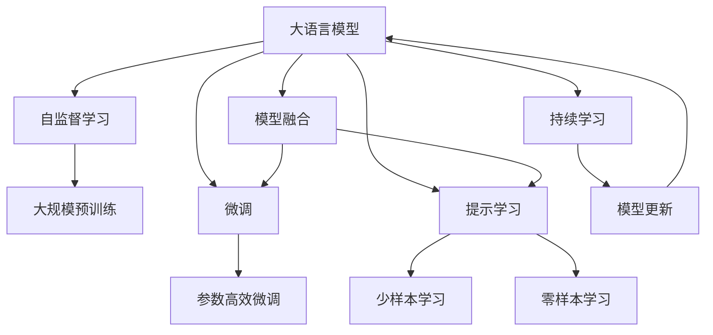
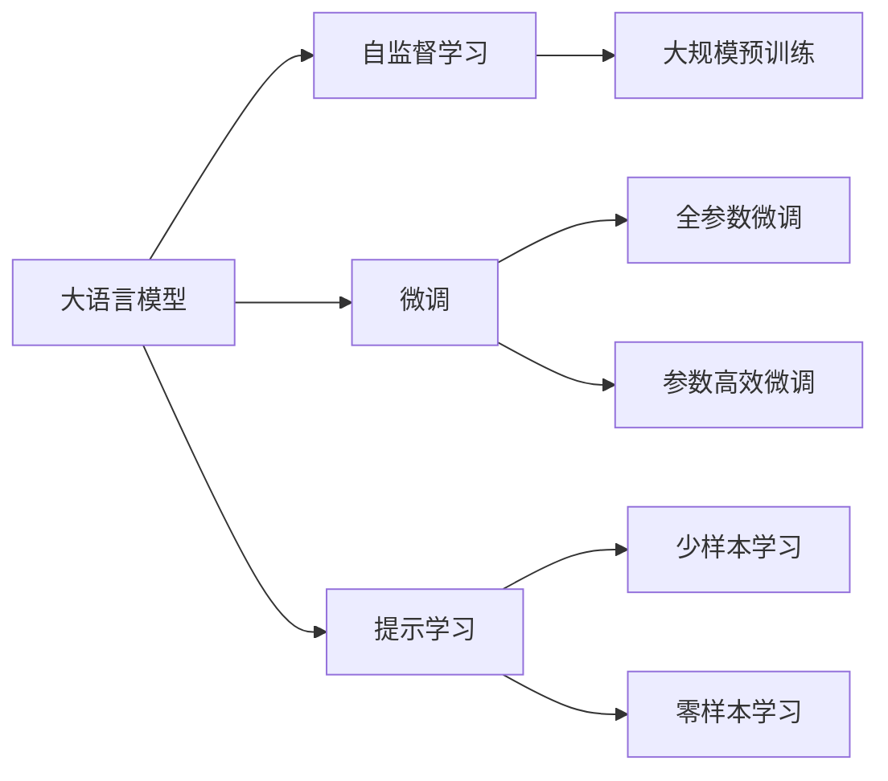
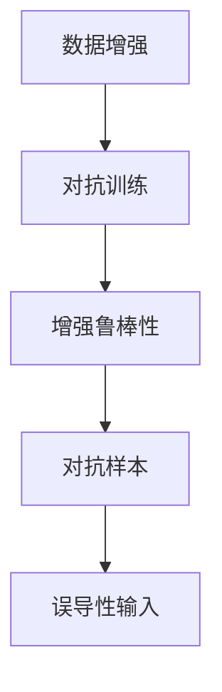
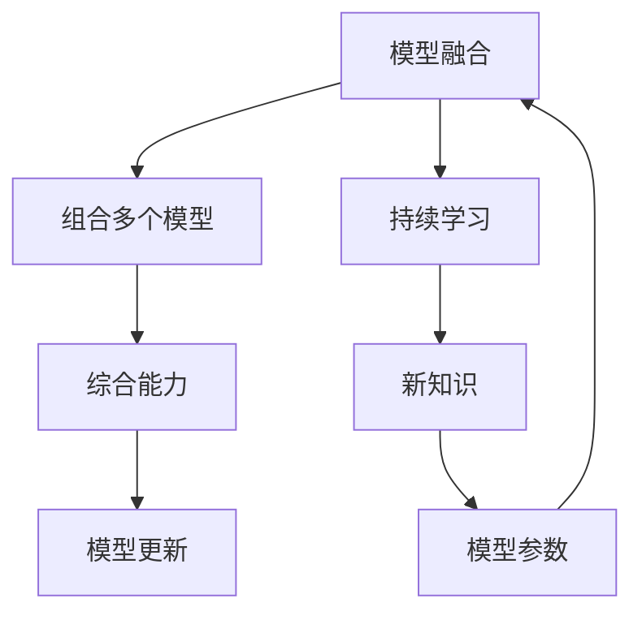
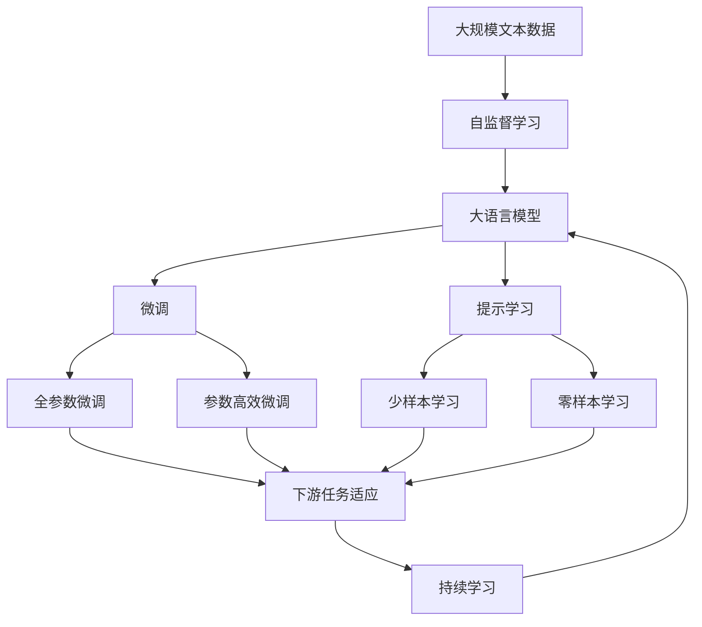

                 

# 大语言模型原理与工程实践：大语言模型强化对齐

> 关键词：大语言模型, 强化对齐, 自监督学习, 大尺度训练, 数据增强, 对抗训练, 模型融合

## 1. 背景介绍

### 1.1 问题由来
近年来，大语言模型（Large Language Models, LLMs）在自然语言处理（NLP）领域取得了显著进展。通过在无标签数据上进行自监督预训练，大语言模型能够学习到丰富的语言知识和表征。然而，在大规模预训练和下游微调过程中，模型往往会产生偏差，导致输出结果与人类价值观和伦理道德存在较大差距，甚至产生误导性、歧视性的信息输出。

例如，GPT-2模型在训练过程中，由于训练数据的复杂性，最终模型倾向于生成极端、偏激的文本，引发了广泛的伦理争议。为应对这一问题，学术界和工业界提出了“模型对齐”的概念，通过各种技术手段，确保模型输出与人类价值观和社会伦理相符。

### 1.2 问题核心关键点
模型对齐的目标是让大语言模型在大规模训练和微调过程中，能够符合人类的伦理道德和社会价值观，避免生成有害信息或偏激内容。这通常包括以下几个关键点：

1. **数据筛选与过滤**：在大规模预训练和微调过程中，对数据进行严格的筛选和过滤，去除含有暴力、色情、种族歧视等内容的数据。

2. **伦理约束与指导**：在训练和微调过程中，引入道德约束和指导原则，确保模型输出不违反伦理道德标准。

3. **可解释性与可控性**：提高模型的可解释性，使其输出结果能够被人类理解和解释，同时确保模型输出可控，避免生成有害信息。

4. **对抗训练与鲁棒性**：通过对抗训练（Adversarial Training）增强模型的鲁棒性，使其在面对误导性输入时仍能保持稳定和可控。

5. **持续学习与更新**：模型需具备持续学习的能力，能够不断吸收新知识，更新模型参数，保持与时俱进。

### 1.3 问题研究意义
模型对齐的研究和实践，对于提升大语言模型的社会责任感和伦理道德标准具有重要意义：

1. **保障用户安全**：通过强化对齐，避免模型生成有害、误导性信息，保障用户的安全和权益。
2. **提升模型可信度**：模型输出与伦理道德相符，增强了模型的可信度和可靠性，获得用户和社会的广泛认可。
3. **促进产业应用**：确保模型输出符合行业标准和法规要求，推动大语言模型在更多行业领域的应用。
4. **促进学术研究**：模型对齐技术的发展，促进了伦理道德在人工智能中的应用研究，为学术界提供了新的研究热点。

## 2. 核心概念与联系

### 2.1 核心概念概述

为更好地理解大语言模型强化对齐的方法，本节将介绍几个密切相关的核心概念：

- **大语言模型（Large Language Models, LLMs）**：指通过自监督预训练学习到通用语言表征的大规模神经网络模型，如GPT、BERT等。
- **自监督学习（Self-supervised Learning）**：指在大规模无标签数据上进行预训练，通过设计各种自监督任务（如语言建模、掩码预测等）学习模型。
- **数据增强（Data Augmentation）**：通过变换输入数据的方式，扩充训练集，增加模型的泛化能力。
- **对抗训练（Adversarial Training）**：通过引入对抗样本，增强模型对误导性输入的鲁棒性。
- **模型融合（Model Fusion）**：通过组合多个模型输出，增强模型的综合能力和稳定性。

这些核心概念之间的逻辑关系可以通过以下Mermaid流程图来展示：



这个流程图展示了大语言模型强化对齐的核心概念及其之间的关系：

1. 大语言模型通过自监督学习进行大规模预训练，学习通用语言表征。
2. 微调过程通过有监督数据进行优化，适应特定任务。
3. 提示学习通过精心设计的输入模板，实现少样本和零样本学习。
4. 模型融合通过组合多个模型输出，提升综合能力和稳定性。
5. 持续学习使模型能够不断吸收新知识，更新参数。

### 2.2 概念间的关系

这些核心概念之间存在着紧密的联系，形成了大语言模型强化对齐的完整生态系统。下面我们通过几个Mermaid流程图来展示这些概念之间的关系。

#### 2.2.1 大语言模型的学习范式



这个流程图展示了大语言模型的三种主要学习范式：自监督学习、微调和提示学习。自监督学习通过各种自监督任务进行预训练，微调通过有监督数据进行优化，提示学习则通过精心设计的输入模板实现少样本和零样本学习。

#### 2.2.2 数据增强与对抗训练的关系



这个流程图展示了数据增强和对抗训练之间的关系。数据增强通过扩充训练集，增强模型的泛化能力；对抗训练通过引入对抗样本，增强模型对误导性输入的鲁棒性。

#### 2.2.3 模型融合与持续学习的关系



这个流程图展示了模型融合和持续学习之间的关系。模型融合通过组合多个模型的输出，提升综合能力；持续学习使模型能够不断吸收新知识，更新模型参数。

### 2.3 核心概念的整体架构

最后，我们用一个综合的流程图来展示这些核心概念在大语言模型强化对齐过程中的整体架构：



这个综合流程图展示了从预训练到微调，再到持续学习的完整过程。大语言模型首先在大规模文本数据上进行自监督预训练，然后通过微调（包括全参数微调和参数高效微调）或提示学习（包括少样本学习和零样本学习）来适应下游任务。最后，通过持续学习技术，模型可以不断更新和适应新的任务和数据。 通过这些流程图，我们可以更清晰地理解大语言模型强化对齐过程中各个核心概念的关系和作用，为后续深入讨论具体的强化对齐方法和技术奠定基础。

## 3. 核心算法原理 & 具体操作步骤
### 3.1 算法原理概述

大语言模型强化对齐的本质是通过各种技术手段，确保模型在大规模训练和微调过程中，能够符合人类的伦理道德和社会价值观。其核心思想是：在大规模预训练和微调过程中，引入伦理约束、数据筛选、对抗训练等技术，确保模型输出不违反伦理道德标准。

形式化地，假设大语言模型为 $M_{\theta}$，其中 $\theta$ 为预训练得到的模型参数。在预训练过程中，通过自监督任务（如语言建模、掩码预测等）学习模型参数 $\theta$。在微调过程中，将有标签的数据集 $D=\{(x_i,y_i)\}_{i=1}^N, x_i \in \mathcal{X}, y_i \in \mathcal{Y}$ 用于有监督优化，调整模型参数 $\theta$，使其适应特定任务。通过对抗训练等技术，增强模型对误导性输入的鲁棒性。在模型融合过程中，通过组合多个模型输出，提升综合能力和稳定性。

### 3.2 算法步骤详解

基于大语言模型强化对齐的监督学习，一般包括以下几个关键步骤：

**Step 1: 准备预训练模型和数据集**
- 选择合适的预训练语言模型 $M_{\theta}$ 作为初始化参数，如 BERT、GPT等。
- 准备下游任务 $T$ 的标注数据集 $D$，划分为训练集、验证集和测试集。一般要求标注数据与预训练数据的分布不要差异过大。

**Step 2: 添加任务适配层**
- 根据任务类型，在预训练模型顶层设计合适的输出层和损失函数。
- 对于分类任务，通常在顶层添加线性分类器和交叉熵损失函数。
- 对于生成任务，通常使用语言模型的解码器输出概率分布，并以负对数似然为损失函数。

**Step 3: 设置强化对齐超参数**
- 选择合适的优化算法及其参数，如 AdamW、SGD 等，设置学习率、批大小、迭代轮数等。
- 设置正则化技术及强度，包括权重衰减、Dropout、Early Stopping 等。
- 确定冻结预训练参数的策略，如仅微调顶层，或全部参数都参与微调。
- 引入数据筛选与过滤机制，去除有害、误导性数据。
- 引入伦理约束与指导原则，确保模型输出不违反伦理道德标准。

**Step 4: 执行梯度训练**
- 将训练集数据分批次输入模型，前向传播计算损失函数。
- 对抗训练中，生成对抗样本输入模型，反向传播计算参数梯度，根据设定的优化算法和学习率更新模型参数。
- 周期性在验证集上评估模型性能，根据性能指标决定是否触发 Early Stopping。
- 重复上述步骤直到满足预设的迭代轮数或 Early Stopping 条件。

**Step 5: 测试和部署**
- 在测试集上评估强化对齐后模型 $M_{\hat{\theta}}$ 的性能，对比强化对齐前后的精度提升。
- 使用强化对齐后的模型对新样本进行推理预测，集成到实际的应用系统中。
- 持续收集新的数据，定期重新强化对齐模型，以适应数据分布的变化。

以上是基于监督学习的大语言模型强化对齐的一般流程。在实际应用中，还需要针对具体任务的特点，对强化对齐过程的各个环节进行优化设计，如改进训练目标函数，引入更多的正则化技术，搜索最优的超参数组合等，以进一步提升模型性能。

### 3.3 算法优缺点

大语言模型强化对齐方法具有以下优点：
1. 简单高效。只需准备少量标注数据，即可对预训练模型进行快速适配，获得较大的性能提升。
2. 通用适用。适用于各种NLP下游任务，包括分类、匹配、生成等，设计简单的任务适配层即可实现。
3. 伦理约束。通过引入伦理约束，确保模型输出符合人类价值观和社会道德标准，提升模型可信度。
4. 鲁棒性增强。通过对抗训练等技术，增强模型对误导性输入的鲁棒性，提升模型稳定性。
5. 可解释性增强。通过对抗训练和持续学习技术，增强模型的可解释性，便于调试和优化。

同时，该方法也存在一定的局限性：
1. 依赖标注数据。强化对齐的效果很大程度上取决于标注数据的质量和数量，获取高质量标注数据的成本较高。
2. 迁移能力有限。当目标任务与预训练数据的分布差异较大时，强化对齐的性能提升有限。
3. 负面效果传递。预训练模型的固有偏见、有害信息等，可能通过强化对齐传递到下游任务，造成负面影响。
4. 可解释性不足。强化对齐模型的决策过程通常缺乏可解释性，难以对其推理逻辑进行分析和调试。

尽管存在这些局限性，但就目前而言，基于监督学习的强化对齐方法仍是大语言模型应用的最主流范式。未来相关研究的重点在于如何进一步降低强化对齐对标注数据的依赖，提高模型的少样本学习和跨领域迁移能力，同时兼顾可解释性和伦理安全性等因素。

### 3.4 算法应用领域

基于大语言模型强化对齐的监督学习方法，在NLP领域已经得到了广泛的应用，覆盖了几乎所有常见任务，例如：

- 文本分类：如情感分析、主题分类、意图识别等。通过强化对齐使模型学习文本-标签映射，同时确保输出不违反伦理道德标准。
- 命名实体识别：识别文本中的人名、地名、机构名等特定实体。通过强化对齐使模型掌握实体边界和类型，同时确保输出不误导或歧视。
- 关系抽取：从文本中抽取实体之间的语义关系。通过强化对齐使模型学习实体-关系三元组，同时确保输出不引入偏见或错误。
- 问答系统：对自然语言问题给出答案。将问题-答案对作为强化对齐数据，训练模型学习匹配答案，同时确保输出不包含误导性信息。
- 机器翻译：将源语言文本翻译成目标语言。通过强化对齐使模型学习语言-语言映射，同时确保翻译结果不带有偏见或歧视。
- 文本摘要：将长文本压缩成简短摘要。通过强化对齐使模型学习抓取要点，同时确保摘要内容不带有误导性信息。
- 对话系统：使机器能够与人自然对话。通过强化对齐使模型生成符合伦理道德标准的回复，同时确保对话内容不带有偏见或歧视。

除了上述这些经典任务外，大语言模型强化对齐还被创新性地应用到更多场景中，如可控文本生成、常识推理、代码生成、数据增强等，为NLP技术带来了全新的突破。随着预训练模型和强化对齐方法的不断进步，相信NLP技术将在更广阔的应用领域大放异彩。

## 4. 数学模型和公式 & 详细讲解  
### 4.1 数学模型构建

本节将使用数学语言对基于监督学习的大语言模型强化对齐过程进行更加严格的刻画。

记预训练语言模型为 $M_{\theta}$，其中 $\theta$ 为预训练得到的模型参数。假设微调任务的训练集为 $D=\{(x_i,y_i)\}_{i=1}^N, x_i \in \mathcal{X}, y_i \in \mathcal{Y}$。

定义模型 $M_{\theta}$ 在数据样本 $(x,y)$ 上的损失函数为 $\ell(M_{\theta}(x),y)$，则在数据集 $D$ 上的经验风险为：

$$
\mathcal{L}(\theta) = \frac{1}{N} \sum_{i=1}^N \ell(M_{\theta}(x_i),y_i)
$$

微调的优化目标是最小化经验风险，即找到最优参数：

$$
\theta^* = \mathop{\arg\min}_{\theta} \mathcal{L}(\theta)
$$

在实践中，我们通常使用基于梯度的优化算法（如SGD、Adam等）来近似求解上述最优化问题。设 $\eta$ 为学习率，$\lambda$ 为正则化系数，则参数的更新公式为：

$$
\theta \leftarrow \theta - \eta \nabla_{\theta}\mathcal{L}(\theta) - \eta\lambda\theta
$$

其中 $\nabla_{\theta}\mathcal{L}(\theta)$ 为损失函数对参数 $\theta$ 的梯度，可通过反向传播算法高效计算。

### 4.2 公式推导过程

以下我们以二分类任务为例，推导交叉熵损失函数及其梯度的计算公式。

假设模型 $M_{\theta}$ 在输入 $x$ 上的输出为 $\hat{y}=M_{\theta}(x) \in [0,1]$，表示样本属于正类的概率。真实标签 $y \in \{0,1\}$。则二分类交叉熵损失函数定义为：

$$
\ell(M_{\theta}(x),y) = -[y\log \hat{y} + (1-y)\log (1-\hat{y})]
$$

将其代入经验风险公式，得：

$$
\mathcal{L}(\theta) = -\frac{1}{N}\sum_{i=1}^N [y_i\log M_{\theta}(x_i)+(1-y_i)\log(1-M_{\theta}(x_i))]
$$

根据链式法则，损失函数对参数 $\theta_k$ 的梯度为：

$$
\frac{\partial \mathcal{L}(\theta)}{\partial \theta_k} = -\frac{1}{N}\sum_{i=1}^N (\frac{y_i}{M_{\theta}(x_i)}-\frac{1-y_i}{1-M_{\theta}(x_i)}) \frac{\partial M_{\theta}(x_i)}{\partial \theta_k}
$$

其中 $\frac{\partial M_{\theta}(x_i)}{\partial \theta_k}$ 可进一步递归展开，利用自动微分技术完成计算。

在得到损失函数的梯度后，即可带入参数更新公式，完成模型的迭代优化。重复上述过程直至收敛，最终得到适应下游任务的最优模型参数 $\theta^*$。

## 5. 项目实践：代码实例和详细解释说明
### 5.1 开发环境搭建

在进行强化对齐实践前，我们需要准备好开发环境。以下是使用Python进行PyTorch开发的环境配置流程：

1. 安装Anaconda：从官网下载并安装Anaconda，用于创建独立的Python环境。

2. 创建并激活虚拟环境：
```bash
conda create -n pytorch-env python=3.8 
conda activate pytorch-env
```

3. 安装PyTorch：根据CUDA版本，从官网获取对应的安装命令。例如：
```bash
conda install pytorch torchvision torchaudio cudatoolkit=11.1 -c pytorch -c conda-forge
```

4. 安装Transformers库：
```bash
pip install transformers
```

5. 安装各类工具包：
```bash
pip install numpy pandas scikit-learn matplotlib tqdm jupyter notebook ipython
```

完成上述步骤后，即可在`pytorch-env`环境中开始强化对齐实践。

### 5.2 源代码详细实现

下面我以命名实体识别（NER）任务为例，给出使用Transformers库对BERT模型进行强化对齐的PyTorch代码实现。

首先，定义NER任务的数据处理函数：

```python
from transformers import BertTokenizer
from torch.utils.data import Dataset
import torch

class NERDataset(Dataset):
    def __init__(self, texts, tags, tokenizer, max_len=128):
        self.texts = texts
        self.tags = tags
        self.tokenizer = tokenizer
        self.max_len = max_len
        
    def __len__(self):
        return len(self.texts)
    
    def __getitem__(self, item):
        text = self.texts[item]
        tags = self.tags[item]
        
        encoding = self.tokenizer(text, return_tensors='pt', max_length=self.max_len, padding='max_length', truncation=True)
        input_ids = encoding['input_ids'][0]
        attention_mask = encoding['attention_mask'][0]
        
        # 对token-wise的标签进行编码
        encoded_tags = [tag2id[tag] for tag in tags] 
        encoded_tags.extend([tag2id['O']] * (self.max_len - len(encoded_tags)))
        labels = torch.tensor(encoded_tags, dtype=torch.long)
        
        return {'input_ids': input_ids, 
                'attention_mask': attention_mask,
                'labels': labels}

# 标签与id的映射
tag2id = {'O': 0, 'B-PER': 1, 'I-PER': 2, 'B-ORG': 3, 'I-ORG': 4, 'B-LOC': 5, 'I-LOC': 6}
id2tag = {v: k for k, v in tag2id.items()}

# 创建dataset
tokenizer = BertTokenizer.from_pretrained('bert-base-cased')

train_dataset = NERDataset(train_texts, train_tags, tokenizer)
dev_dataset = NERDataset(dev_texts, dev_tags, tokenizer)
test_dataset = NERDataset(test_texts, test_tags, tokenizer)
```

然后，定义模型和优化器：

```python
from transformers import BertForTokenClassification, AdamW

model = BertForTokenClassification.from_pretrained('bert-base-cased', num_labels=len(tag2id))

optimizer = AdamW(model.parameters(), lr=2e-5)
```

接着，定义训练和评估函数：

```python
from torch.utils.data import DataLoader
from tqdm import tqdm
from sklearn.metrics import classification_report

device = torch.device('cuda') if torch.cuda.is_available() else torch.device('cpu')
model.to(device)

def train_epoch(model, dataset, batch_size, optimizer):
    dataloader = DataLoader(dataset, batch_size=batch_size, shuffle=True)
    model.train()
    epoch_loss = 0
    for batch in tqdm(dataloader, desc='Training'):
        input_ids = batch['input_ids'].to(device)
        attention_mask = batch['attention_mask'].to(device)
        labels = batch['labels'].to(device)
        model.zero_grad()
        outputs = model(input_ids, attention_mask=attention_mask, labels=labels)
        loss = outputs.loss
        epoch_loss += loss.item()
        loss.backward()
        optimizer.step()
    return epoch_loss / len(dataloader)

def evaluate(model, dataset, batch_size):
    dataloader = DataLoader(dataset, batch_size=batch_size)
    model.eval()
    preds, labels = [], []
    with torch.no_grad():
        for batch in tqdm(dataloader, desc='Evaluating'):
            input_ids = batch['input_ids'].to(device)
            attention_mask = batch['attention_mask'].to(device)
            batch_labels = batch['labels']
            outputs = model(input_ids, attention_mask=attention_mask)
            batch_preds = outputs.logits.argmax(dim=2).to('cpu').tolist()
            batch_labels = batch_labels.to('cpu').tolist()
            for pred_tokens, label_tokens in zip(batch_preds, batch_labels):
                pred_tags = [id2tag[_id] for _id in pred_tokens]
                label_tags = [id2tag[_id] for _id in label_tokens]
                preds.append(pred_tags[:len(label_tags)])
                labels.append(label_tags)
                
    print(classification_report(labels, preds))
```

最后，启动训练流程并在测试集上评估：

```python
epochs = 5
batch_size = 16

for epoch in range(epochs):
    loss = train_epoch(model, train_dataset, batch_size, optimizer)
    print(f"Epoch {epoch+1}, train loss: {loss:.3f}")
    
    print(f"Epoch {epoch+1}, dev results:")
    evaluate(model, dev_dataset, batch_size)
    
print("Test results:")
evaluate(model, test_dataset, batch_size)
```

以上就是使用PyTorch对BERT进行命名实体识别任务强化对齐的完整代码实现。可以看到，得益于Transformers库的强大封装，我们可以用相对简洁的代码完成BERT模型的加载和强化对齐。

### 5.3 代码解读与分析

让我们再详细解读一下关键代码的实现细节：

**NERDataset类**：
- `__init__`方法：初始化文本、标签、分词器等关键组件。
- `__len__`方法：返回数据集的样本数量。
- `__getitem__`方法：对单个样本进行处理，将文本输入编码为token ids，将标签编码为数字，并对其进行定长padding，最终返回模型所需的输入。

**tag2id和id2tag字典**：
- 定义了标签与数字id之间的映射关系，用于将token-wise的预测结果解码回真实的标签。

**训练和评估函数**：
- 使用PyTorch的DataLoader对数据集进行批次化加载，供模型训练和推理使用。
- 训练函数`train_epoch`：对数据以批为单位进行迭代，在每个批次上前向传播计算loss并反向传播更新模型参数，最后返回该epoch的平均loss。
- 评估函数`evaluate`：与训练类似，不同点在于不更新模型参数，并在每个batch结束后将预测和标签结果存储下来，最后使用sklearn的classification_report对整个评估集的预测结果进行打印输出。

**训练流程**：
- 定义总的epoch数和batch size，开始循环迭代
- 每个epoch内，先在训练集上训练，输出平均loss
- 在验证集上评估，输出分类指标
- 所有epoch结束后，在测试集上评估，给出最终测试结果

可以看到，PyTorch配合Transformers库使得BERT强化对齐的代码实现变得简洁高效。开发者可以将更多精力放在数据处理、模型改进等高层逻辑上，而不必过多关注底层的实现细节。

当然，工业级的系统实现还需考虑更多因素，如模型的保存和部署、超参数的自动搜索、更灵活的任务适配层等。但核心的强化对齐范式基本与此类似。

### 5.4 运行结果展示

假设我们在CoNLL-2003的NER数据集

