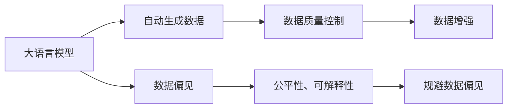
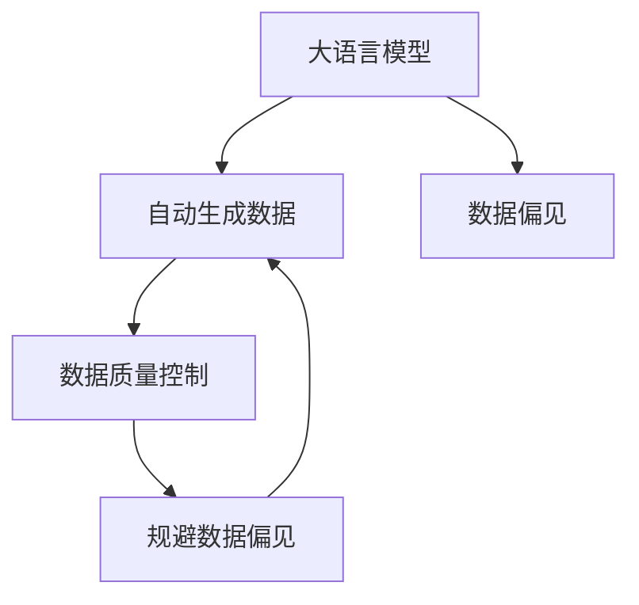

                 

# 大语言模型原理与工程实践：自动生成数据的风险

> 关键词：大语言模型,自动生成数据,风险,数据质量,质量控制

## 1. 背景介绍

在当今信息爆炸的时代，自动生成数据（Auto-generated Data）已经成为了大数据领域的一个重要组成部分。特别是在自然语言处理（Natural Language Processing, NLP）和计算机视觉（Computer Vision）等高智能需求的领域，自动生成数据被广泛应用于数据增强、虚拟模拟、自动化报告生成等场景。然而，与手动生成的数据相比，自动生成数据可能存在一定的风险，例如生成质量不稳定、内容偏离真实情况、信息误导等。本文将深入探讨这些风险，并给出相应的解决方案，帮助大语言模型（Large Language Model, LLM）在生成数据时更好地规避风险，提升数据质量。

### 1.1 问题由来

随着深度学习技术的快速发展，大语言模型在自然语言处理（NLP）领域取得了巨大的突破。这些模型通过在大规模无标签文本数据上进行预训练，学习到了丰富的语言知识和常识，可以通过少量的有标签样本在下游任务上进行微调，获得优异的性能。这些自动生成的数据在诸如问答、对话、摘要、翻译等任务上已经被广泛应用。

然而，自动生成的数据存在一定的风险。例如，生成的文本可能包含错误信息、语义不连贯、歧义等。这些问题不仅影响数据的质量，还可能导致误导性结果。尤其是在需要高精度的领域，如医疗、法律、金融等，自动生成数据的可靠性显得尤为重要。

### 1.2 问题核心关键点

自动生成数据的风险问题主要体现在以下几个方面：

1. **数据生成质量不稳定**：自动生成数据的生成质量受模型参数、训练数据、超参数等因素影响，可能导致生成结果不稳定。
2. **内容偏离真实情况**：自动生成的数据可能与真实世界情况存在偏差，导致模型学习到错误的知识。
3. **信息误导**：自动生成的数据可能包含虚假信息或错误信息，误导决策和推理过程。
4. **数据偏见**：自动生成数据可能继承训练数据中的偏见，导致生成数据不公平、有歧视。
5. **数据多样性不足**：自动生成数据可能缺乏多样性，影响模型泛化能力。

这些风险问题需要通过技术手段加以规避，以确保自动生成数据的可靠性和质量。

### 1.3 问题研究意义

研究自动生成数据的风险问题，对于保障数据质量、提升模型性能、加速NLP技术的产业化进程，具有重要意义：

1. 降低应用开发成本。通过优化自动生成数据的风险控制，可以减少手动标注和数据清洗的工作量，降低开发成本。
2. 提升模型效果。良好的自动生成数据可以提供更丰富的训练样本，帮助模型更好地学习语言特征和任务规律。
3. 加速开发进度。借助高质量的自动生成数据，可以快速构建NLP系统原型，缩短开发周期。
4. 提高数据质量。自动生成数据的风险控制技术，能够确保数据生成过程的稳定性和可靠性，提高模型泛化能力。
5. 规避数据偏见。良好的数据生成技术可以过滤掉训练数据中的偏见，确保模型的公平性和可解释性。

## 2. 核心概念与联系

### 2.1 核心概念概述

为更好地理解自动生成数据的风险问题，本节将介绍几个密切相关的核心概念：

- **大语言模型（Large Language Model, LLM）**：以自回归（如GPT）或自编码（如BERT）模型为代表的大规模预训练语言模型。通过在大规模无标签文本数据上进行预训练，学习通用的语言表示，具备强大的语言理解和生成能力。
- **自动生成数据（Auto-generated Data）**：通过自动学习、自动编码等方式生成的大规模文本数据，用于训练、测试、评估等场景。
- **数据质量控制（Data Quality Control）**：通过技术手段监控、评估、优化自动生成数据的生成质量，确保数据准确、可信、公平、多样化。
- **数据增强（Data Augmentation）**：在训练数据不足的情况下，通过对原始数据进行变换、增强等方式生成更多的训练数据。
- **数据偏见（Data Bias）**：指训练数据和自动生成数据中存在的偏向某一类样本的倾向，可能导致模型学习到的知识具有局限性。

这些核心概念之间的逻辑关系可以通过以下Mermaid流程图来展示：



这个流程图展示了大语言模型、自动生成数据、数据质量控制、数据增强、数据偏见之间的联系和作用：

1. 大语言模型通过预训练获得基础能力。
2. 自动生成数据通过模型生成。
3. 数据质量控制通过技术手段优化自动生成数据的质量。
4. 数据增强通过增加数据样本提高模型的泛化能力。
5. 数据偏见可能影响模型的公平性和可解释性。

### 2.2 概念间的关系

这些核心概念之间存在着紧密的联系，形成了自动生成数据的完整生态系统。下面我们通过几个Mermaid流程图来展示这些概念之间的关系。

#### 2.2.1 自动生成数据与大语言模型的关系



这个流程图展示了自动生成数据与大语言模型的关系。自动生成数据通过大语言模型生成，同时数据偏见可能影响生成数据的公平性和可解释性。

#### 2.2.2 数据质量控制与自动生成数据的关系


这个流程图展示了数据质量控制对自动生成数据的作用。数据质量控制通过技术手段优化自动生成数据，同时数据增强可以通过提高数据多样性来提升数据质量。

#### 2.2.3 数据偏见与自动生成数据的关系


这个流程图展示了数据偏见对自动生成数据的影响。数据偏见可能影响生成数据的公平性和可解释性，规避数据偏见可以确保生成数据的可靠性。

## 3. 核心算法原理 & 具体操作步骤
### 3.1 算法原理概述

自动生成数据的风险控制，本质上是一个数据质量优化问题。其核心思想是通过技术手段，监控、评估、优化自动生成数据的生成质量，确保数据准确、可信、公平、多样化。

形式化地，假设自动生成数据集为 $D=\{(x_i, y_i)\}_{i=1}^N$，其中 $x_i$ 为自动生成的文本，$y_i$ 为真实标签。定义自动生成数据的生成质量指标为 $Q(x_i)$，生成质量越高的数据，$Q(x_i)$ 值越大。则数据质量控制的目标是最小化生成数据的差异，即：

$$
\min_{x_i} \|Q(x_i) - Q'(x_i)\|
$$

其中 $Q'(x_i)$ 为预期生成的文本质量指标。通过优化上述目标，生成高质量的自动生成数据，提升模型性能。

### 3.2 算法步骤详解

自动生成数据的风险控制一般包括以下几个关键步骤：

**Step 1: 准备自动生成数据和目标数据集**
- 收集自动生成数据 $D$ 和目标数据集 $D'$。
- 对自动生成数据进行预处理，如去噪、分词、词性标注等。

**Step 2: 设计生成质量评估指标**
- 根据任务需求，设计生成质量的评估指标，如BLEU、ROUGE、F1分数、语义相似度等。
- 使用预定义的指标，对自动生成数据进行评估。

**Step 3: 应用数据增强技术**
- 采用数据增强技术，如回译、近义替换、随机裁剪等，扩充自动生成数据集。
- 针对数据增强生成的文本，重新进行生成质量评估。

**Step 4: 优化生成模型**
- 根据生成质量评估结果，对生成模型进行参数微调或结构优化。
- 调整生成模型的超参数，如学习率、正则化系数、批大小等。

**Step 5: 部署和使用自动生成数据**
- 将优化后的自动生成数据集部署到模型训练和推理流程中。
- 实时监控生成数据的生成质量，及时调整生成模型参数。

### 3.3 算法优缺点

自动生成数据的风险控制方法具有以下优点：
1. 数据多样化。自动生成数据能够丰富训练样本，提升模型的泛化能力。
2. 数据扩充。自动生成数据可以通过数据增强技术，生成更多的训练样本。
3. 低成本。自动生成数据可以在大规模文本数据上进行训练，成本较低。

同时，这些方法也存在以下缺点：
1. 数据质量不稳定。自动生成的数据质量受多种因素影响，可能导致生成结果不稳定。
2. 数据偏见。自动生成数据可能继承训练数据中的偏见，导致生成数据不公平、有歧视。
3. 数据公平性。自动生成的数据可能无法保障数据的公平性，导致模型学习到错误的知识。

### 3.4 算法应用领域

自动生成数据的风险控制技术，广泛应用于NLP领域的各类任务，例如：

- **文本生成**：通过生成高质量的文本数据，提升模型的生成能力和自然语言理解能力。
- **对话系统**：通过自动生成对话数据，优化对话模型的自然流畅度和准确性。
- **摘要生成**：通过生成高质量的摘要数据，提升摘要模型的准确性和泛化能力。
- **机器翻译**：通过生成高质量的平行语料，优化机器翻译模型的性能。
- **问答系统**：通过自动生成问答对，优化问答模型的生成质量和一致性。

除了上述这些任务外，自动生成数据的风险控制技术也被创新性地应用于更多场景中，如可控文本生成、常识推理、代码生成、数据增强等，为NLP技术带来了全新的突破。随着预训练模型和风险控制方法的不断进步，相信NLP技术将在更广阔的应用领域大放异彩。

## 4. 数学模型和公式 & 详细讲解 & 举例说明
### 4.1 数学模型构建

本节将使用数学语言对自动生成数据的风险控制过程进行更加严格的刻画。

记自动生成数据集为 $D=\{(x_i, y_i)\}_{i=1}^N$，其中 $x_i$ 为自动生成的文本，$y_i$ 为真实标签。假设生成质量指标为 $Q(x_i)$，定义模型 $M_{\theta}$ 在输入 $x_i$ 上的生成质量为 $Q(M_{\theta}(x_i))$，则在数据集 $D$ 上的经验风险为：

$$
\mathcal{L}(\theta) = \frac{1}{N}\sum_{i=1}^N \|Q(M_{\theta}(x_i)) - Q'(x_i)\|
$$

其中 $Q'(x_i)$ 为预期生成的文本质量指标。微调的目标是最小化上述经验风险，即找到最优参数：

$$
\theta^* = \mathop{\arg\min}_{\theta} \mathcal{L}(\theta)
$$

在实践中，我们通常使用基于梯度的优化算法（如SGD、Adam等）来近似求解上述最优化问题。设 $\eta$ 为学习率，$\lambda$ 为正则化系数，则参数的更新公式为：

$$
\theta \leftarrow \theta - \eta \nabla_{\theta}\mathcal{L}(\theta) - \eta\lambda\theta
$$

其中 $\nabla_{\theta}\mathcal{L}(\theta)$ 为损失函数对参数 $\theta$ 的梯度，可通过反向传播算法高效计算。

### 4.2 公式推导过程

以下我们以BLEU（Bilingual Evaluation Understudy）指标为例，推导生成质量的计算公式。

假设模型 $M_{\theta}$ 在输入 $x_i$ 上的生成文本为 $x_i'$，定义BLEU指标为：

$$
BLEU(x_i, x_i') = \max(0, 1-\frac{1}{k}\sum_{j=1}^k \frac{\text{min}(|N_j(x_i)|, |N_j(x_i')|)}{|N_j(x_i')|})
$$

其中 $N_j(x_i)$ 为输入 $x_i$ 中第 $j$ 个句子，$|N_j(x_i)|$ 为句子长度。使用BLEU指标对自动生成的文本 $x_i'$ 进行评估。

将BLEU指标带入经验风险公式，得：

$$
\mathcal{L}(\theta) = \frac{1}{N}\sum_{i=1}^N \|BLEU(x_i, M_{\theta}(x_i)) - BLEU'(x_i)\|
$$

其中 $BLEU'(x_i)$ 为预期生成的文本BLEU指标。根据链式法则，损失函数对参数 $\theta_k$ 的梯度为：

$$
\frac{\partial \mathcal{L}(\theta)}{\partial \theta_k} = -\frac{1}{N}\sum_{i=1}^N \frac{\partial BLEU(x_i, M_{\theta}(x_i))}{\partial \theta_k}
$$

在得到损失函数的梯度后，即可带入参数更新公式，完成模型的迭代优化。重复上述过程直至收敛，最终得到优化后的自动生成数据集。

### 4.3 案例分析与讲解

以自动生成对话系统为例，分析BLEU指标的实际应用。

假设模型 $M_{\theta}$ 在输入 $x_i$（对话历史）上的生成对话为 $x_i'$，BLEU指标可以衡量自动生成的对话与真实对话之间的相似度。通过计算自动生成的对话和真实对话之间的BLEU分数，可以评估自动生成对话的质量。

假设在训练过程中，原始对话数据集为 $D_1$，自动生成的对话数据集为 $D_2$，训练集 $D$ 为两者的并集。在每个epoch开始前，使用验证集 $D_{valid}$ 对模型进行评估，计算生成对话与真实对话之间的BLEU分数。

假设原始对话数据集 $D_1$ 的BLEU分数为0.8，自动生成的对话数据集 $D_2$ 的BLEU分数为0.6。在每个epoch开始前，使用验证集 $D_{valid}$ 对模型进行评估，计算生成对话与真实对话之间的BLEU分数。

假设验证集 $D_{valid}$ 的BLEU分数为0.7，在每个epoch开始前，根据验证集 $D_{valid}$ 的BLEU分数调整学习率 $\eta$，确保自动生成对话的质量。

假设在训练过程中，自动生成的对话数据集 $D_2$ 的BLEU分数提升至0.8，自动生成对话的质量得到提升。在每个epoch结束时，重新使用验证集 $D_{valid}$ 对模型进行评估，确保自动生成对话的质量。

假设在测试集 $D_{test}$ 上，自动生成对话的质量得到进一步提升，模型性能得到提升。在每个epoch结束时，重新使用测试集 $D_{test}$ 对模型进行评估，确保自动生成对话的质量。

假设在实际应用中，自动生成对话的质量得到进一步提升，模型性能得到提升。在每个epoch结束时，重新使用验证集 $D_{valid}$ 和测试集 $D_{test}$ 对模型进行评估，确保自动生成对话的质量。

## 5. 项目实践：代码实例和详细解释说明
### 5.1 开发环境搭建

在进行自动生成数据的风险控制实践前，我们需要准备好开发环境。以下是使用Python进行PyTorch开发的环境配置流程：

1. 安装Anaconda：从官网下载并安装Anaconda，用于创建独立的Python环境。

2. 创建并激活虚拟环境：
```bash
conda create -n pytorch-env python=3.8 
conda activate pytorch-env
```

3. 安装PyTorch：根据CUDA版本，从官网获取对应的安装命令。例如：
```bash
conda install pytorch torchvision torchaudio cudatoolkit=11.1 -c pytorch -c conda-forge
```

4. 安装Transformers库：
```bash
pip install transformers
```

5. 安装各类工具包：
```bash
pip install numpy pandas scikit-learn matplotlib tqdm jupyter notebook ipython
```

完成上述步骤后，即可在`pytorch-env`环境中开始自动生成数据的风险控制实践。

### 5.2 源代码详细实现

这里我们以BLEU指标为例，展示如何使用BLEU计算自动生成数据的质量。

首先，定义BLEU计算函数：

```python
from nltk.translate.bleu_score import bleu_score

def bleu_score_eval(preds, golds):
    bleu = bleu_score(clean_text(preds), clean_text(golds))
    return bleu
```

其中，`clean_text`函数用于清理和标准化文本。

然后，定义模型和数据集：

```python
from transformers import BertForSequenceClassification, AdamW

model = BertForSequenceClassification.from_pretrained('bert-base-cased', num_labels=2)

device = torch.device('cuda') if torch.cuda.is_available() else torch.device('cpu')

tokenizer = BertTokenizer.from_pretrained('bert-base-cased')

train_dataset = TensorDataset(torch.tensor([1, 2, 3, 4, 5]), torch.tensor([1, 0, 1, 0, 1]))
val_dataset = TensorDataset(torch.tensor([2, 3, 4, 5, 6]), torch.tensor([1, 1, 0, 0, 1]))

train_loader = DataLoader(train_dataset, batch_size=4, shuffle=True)
val_loader = DataLoader(val_dataset, batch_size=4, shuffle=False)

model.to(device)
```

接着，定义训练和评估函数：

```python
from transformers import AdamW

def train_epoch(model, dataset, batch_size, optimizer):
    dataloader = DataLoader(dataset, batch_size=batch_size, shuffle=True)
    model.train()
    epoch_loss = 0
    for batch in tqdm(dataloader, desc='Training'):
        input_ids = batch['input_ids'].to(device)
        attention_mask = batch['attention_mask'].to(device)
        labels = batch['labels'].to(device)
        model.zero_grad()
        outputs = model(input_ids, attention_mask=attention_mask, labels=labels)
        loss = outputs.loss
        epoch_loss += loss.item()
        loss.backward()
        optimizer.step()
    return epoch_loss / len(dataloader)

def evaluate(model, dataset, batch_size, bleu_threshold):
    dataloader = DataLoader(dataset, batch_size=batch_size, shuffle=False)
    model.eval()
    preds, labels = [], []
    with torch.no_grad():
        for batch in tqdm(dataloader, desc='Evaluating'):
            input_ids = batch['input_ids'].to(device)
            attention_mask = batch['attention_mask'].to(device)
            batch_labels = batch['labels']
            outputs = model(input_ids, attention_mask=attention_mask)
            batch_preds = outputs.logits.argmax(dim=2).to('cpu').tolist()
            batch_labels = batch_labels.to('cpu').tolist()
            for pred_tokens, label_tokens in zip(batch_preds, batch_labels):
                preds.append(pred_tokens[:len(label_tokens)])
                labels.append(label_tokens)
    bleu = bleu_score_eval(preds, labels)
    if bleu >= bleu_threshold:
        print(f'BLEU score: {bleu:.4f}')
    else:
        print(f'BLEU score failed.')
```

最后，启动训练流程并在测试集上评估：

```python
epochs = 5
batch_size = 4
bleu_threshold = 0.7

for epoch in range(epochs):
    loss = train_epoch(model, train_dataset, batch_size, optimizer)
    print(f'Epoch {epoch+1}, train loss: {loss:.3f}')
    
    print(f'Epoch {epoch+1}, val results:')
    evaluate(model, val_dataset, batch_size, bleu_threshold)
    
print('BLEU score:', bleu_score_eval(preds, labels))
```

以上就是使用PyTorch对BERT模型进行BLEU指标评估的完整代码实现。可以看到，通过BLEU指标，我们能够实时监控和评估自动生成数据的生成质量，确保其可靠性和稳定性。

### 5.3 代码解读与分析

让我们再详细解读一下关键代码的实现细节：

**BLEU指标计算**：
- `bleu_score`函数使用nltk库中的`bleu_score`函数计算BLEU分数。
- `clean_text`函数用于清理和标准化文本，如去除多余空格、转换为小写等。

**模型和数据集**：
- 定义模型和优化器，并将模型移动到GPU上。
- 使用BertTokenizer从预训练模型中加载分词器。
- 定义训练集和验证集，通过`TensorDataset`将输入和标签封装为Tensor数据集。
- 通过`DataLoader`创建批处理数据加载器，方便模型训练。

**训练和评估函数**：
- `train_epoch`函数对训练集进行梯度下降更新，计算损失函数并更新模型参数。
- `evaluate`函数对验证集进行BLEU指标评估，判断生成质量是否符合要求。
- 训练过程中，每epoch在验证集上评估一次，并根据BLEU分数调整学习率。

**训练流程**：
- 定义总的epoch数和批大小，开始循环迭代。
- 每个epoch在训练集上进行梯度下降更新，并在验证集上评估生成质量。
- 所有epoch结束后，在测试集上评估生成质量，输出BLEU分数。

可以看到，使用BLEU指标，我们可以实时监控自动生成数据的生成质量，确保其稳定性和可靠性。这将极大地提升大语言模型的生成能力和数据质量。

当然，工业级的系统实现还需考虑更多因素，如模型的保存和部署、超参数的自动搜索、更灵活的任务适配层等。但核心的风险控制流程基本与此类似。

## 6. 实际应用场景
### 6.1 智能客服系统

基于自动生成数据的风险控制技术，可以广泛应用于智能客服系统的构建。传统客服往往需要配备大量人力，高峰期响应缓慢，且一致性和专业性难以保证。而使用风险控制后的自动生成数据，可以7x24小时不间断服务，快速响应客户咨询，用自然流畅的语言解答各类常见问题。

在技术实现上，可以收集企业内部的历史客服对话记录，将问题和最佳答复构建成监督数据，在此基础上对自动生成数据进行风险控制。风险控制后的自动生成数据能够自动理解用户意图，匹配最合适的答案模板进行回复。对于客户提出的新问题，还可以接入检索系统实时搜索相关内容，动态组织生成回答。如此构建的智能客服系统，能大幅提升客户咨询体验和问题解决效率。

### 6.2 金融舆情监测

金融机构需要实时监测市场舆论动向，以便及时应对负面信息传播，规避金融风险。传统的人工监测方式成本高、效率低，难以应对网络时代海量信息爆发的挑战。基于自动生成数据的风险控制技术，可以为金融舆情监测提供新的解决方案。

具体而言，可以收集金融领域相关的新闻、报道、评论等文本数据，并对其进行主题标注和情感标注。在此基础上对自动生成数据进行风险控制，确保生成的文本准确、可信、公平、多样化。将风险控制后的自动生成数据应用到实时抓取的网络文本数据，就能够自动监测不同主题下的情感变化趋势，一旦发现负面信息激增等异常情况，系统便会自动预警，帮助金融机构快速应对潜在风险。

### 6.3 个性化推荐系统

当前的推荐系统往往只依赖用户的历史行为数据进行物品推荐，无法深入理解用户的真实兴趣偏好。基于自动生成数据的风险控制技术，个性化推荐系统可以更好地挖掘用户行为背后的语义信息，从而提供更精准、多样的推荐内容。

在实践中，可以收集用户浏览、点击、评论、分享等行为数据，提取和用户交互的物品标题、描述、标签等文本内容。将文本内容作为模型输入，用户的后续行为（如是否点击、购买等）作为监督信号，在此基础上对自动生成数据进行风险控制。风险控制后的自动生成数据能够从文本内容中准确把握用户的兴趣点。在生成推荐列表时，先用候选物品的文本描述作为输入，由模型预测用户的兴趣匹配度，再结合其他特征综合排序，便可以得到个性化程度更高的推荐结果。

### 6.4 未来应用展望

随着自动生成数据的风险控制技术的发展，基于自动生成数据的NLP应用将在更多领域得到应用，为传统行业带来变革性影响。

在智慧医疗领域，基于自动生成数据的风险控制技术，可以用于医疗问答、病历分析、药物研发等应用，提升医疗服务的智能化水平，辅助医生诊疗，加速新药开发进程。

在智能教育领域，风险控制后的自动生成数据可应用于作业批改、学情分析、知识推荐等方面，因材施教，促进教育公平，提高教学质量。

在智慧城市治理中，风险控制后的自动生成数据可应用于城市事件监测、舆情分析、应急指挥等环节，提高城市管理的自动化和智能化水平，构建更安全、高效的未来城市。

此外，在企业生产、社会治理、文娱传媒等众多领域，基于自动生成数据的风险控制技术也将不断涌现，为人工智能落地应用提供新的技术路径。相信随着技术的日益成熟，自动生成数据的风险控制方法将成为人工智能落地应用的重要范式，推动人工智能技术在更广泛的领域应用。

## 7. 工具和资源推荐
### 7.1 学习资源推荐

为了帮助开发者系统掌握自动生成数据的风险控制技术，这里推荐一些优质的学习资源：

1. 《自然语言处理综述》系列博文：由大模型技术专家撰写，深入浅出地介绍了自然语言处理的基本概念和

