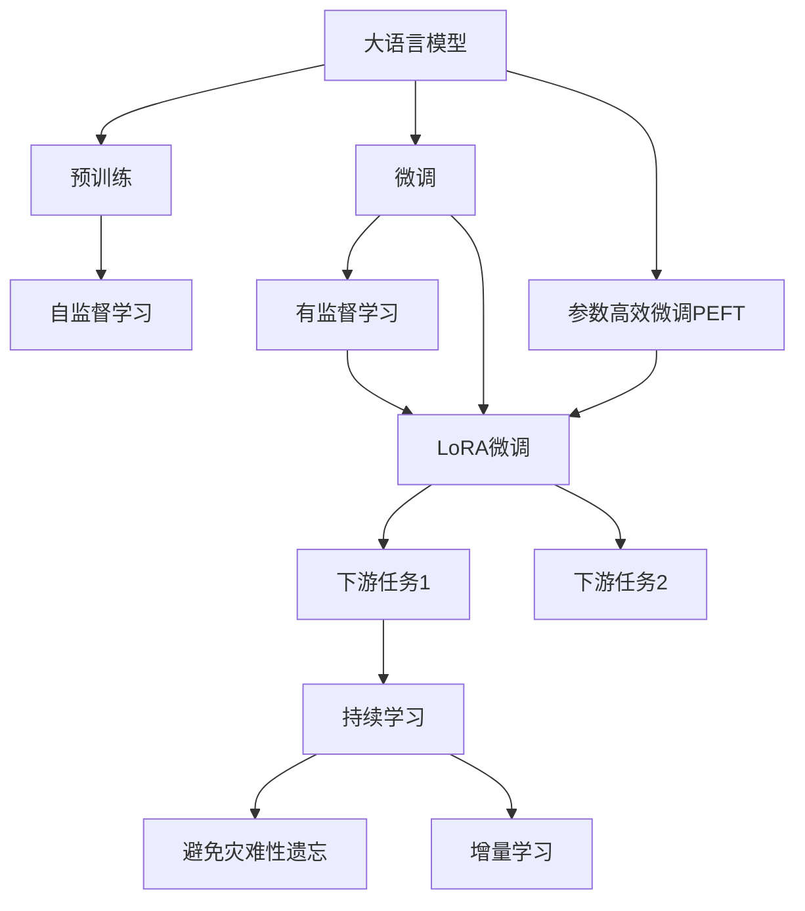
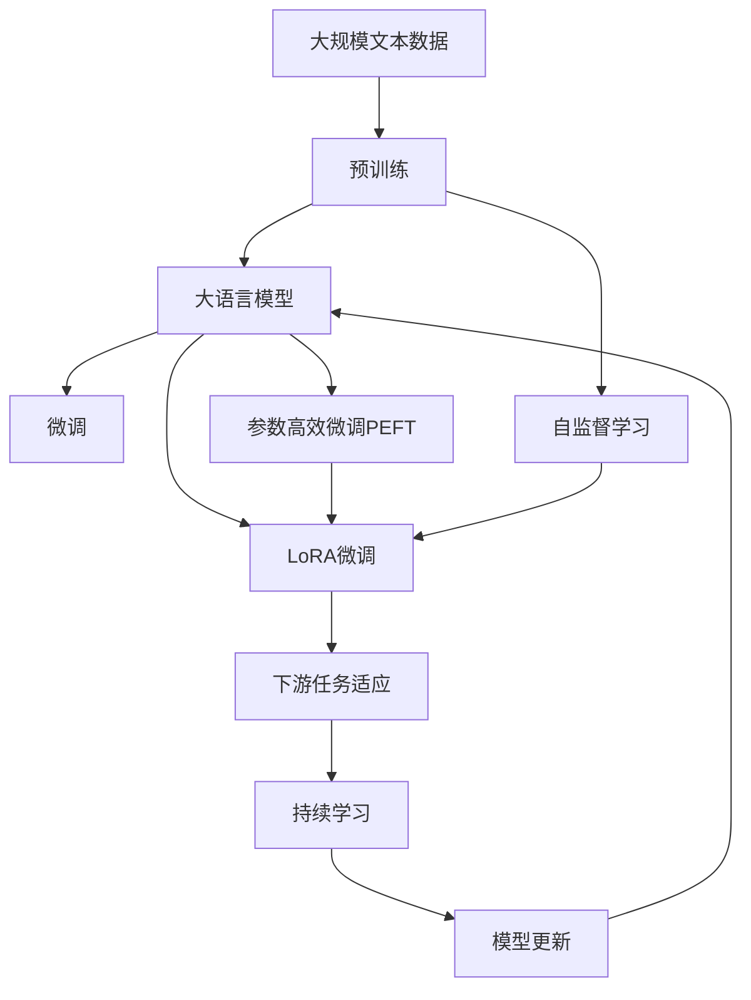

                 

# 大语言模型应用指南：LoRA高效微调

> 关键词：
- 大语言模型
- LoRA高效微调
- 参数效率
- 模型压缩
- Transformer
- 自适应微调

## 1. 背景介绍

### 1.1 问题由来

近年来，大语言模型（LLMs）在自然语言处理（NLP）领域取得了显著进步，尤其是通过在无标签大规模文本数据上进行预训练，学习到了丰富的语言知识和常识。然而，由于预训练数据的广泛性和泛化能力的局限，这些通用模型在特定领域应用时，往往难以满足实际需求。因此，如何在大规模预训练的基础上进行微调（fine-tuning），以适应特定任务，成为了当前的重点研究问题。

### 1.2 问题核心关键点

微调的本质是将预训练模型作为初始化参数，通过有监督学习，优化模型在特定任务上的性能。这一过程需要大量的标注数据和计算资源，且容易过拟合。然而，参数高效的微调方法（parameter-efficient fine-tuning, PEFT）能够在不改变大部分预训练参数的情况下，通过微调少量参数来提升模型性能，同时降低过拟合风险。其中，LoRA（Low Rank Adaptation）方法是一种典型的参数高效微调技术，它利用矩阵分解的方式，在不显著增加计算开销的情况下，实现了高效的参数更新。

### 1.3 问题研究意义

LoRA高效微调方法不仅能够降低微调对标注数据的依赖，还能提升模型在特定任务上的性能。这对于拓展大模型的应用范围，提升下游任务的性能，加速NLP技术的产业化进程，具有重要意义：

1. 降低应用开发成本。利用LoRA等高效微调方法，可以快速适配特定任务，减少从头开发所需的数据、计算和人力等成本投入。
2. 提升模型效果。微调使得通用大模型更好地适应特定任务，在应用场景中取得更优表现。
3. 加速开发进度。standing on the shoulders of giants，微调使得开发者可以更快地完成任务适配，缩短开发周期。
4. 带来技术创新。LoRA等高效微调范式促进了对预训练-微调的深入研究，催生了更多的研究方向，如少样本学习、零样本学习等。
5. 赋能产业升级。微调使得NLP技术更容易被各行各业所采用，为传统行业数字化转型升级提供新的技术路径。

## 2. 核心概念与联系

### 2.1 核心概念概述

为更好地理解LoRA高效微调方法，本节将介绍几个密切相关的核心概念：

- 大语言模型（LLM）：如GPT、BERT等，通过大规模无标签文本数据进行预训练，学习到丰富的语言知识和常识。
- 预训练（Pre-training）：通过自监督学习任务，在无标签数据上进行训练，学习通用语言表示。
- 微调（Fine-tuning）：使用下游任务的少量标注数据，优化模型在特定任务上的性能。
- 参数高效微调（PEFT）：只微调少量参数，保留大部分预训练参数，以提高微调效率，避免过拟合。
- LoRA：利用矩阵分解技术，实现高效的参数更新，降低微调对内存和计算资源的需求。
- 矩阵分解：将一个矩阵分解成两个或多个低秩矩阵的乘积，以减少矩阵的维度和计算复杂度。

### 2.2 概念间的关系

这些核心概念之间的逻辑关系可以通过以下Mermaid流程图来展示：



这个流程图展示了大语言模型的核心概念及其之间的关系：

1. 大语言模型通过预训练获得基础能力。
2. 微调是对预训练模型进行任务特定的优化，可以分为全参数微调和参数高效微调（PEFT）。
3. LoRA微调是一种不改变大部分预训练参数的PEFT方法。
4. 持续学习旨在使模型能够不断学习新知识，同时避免遗忘旧知识。

这些概念共同构成了大语言模型的学习和应用框架，使其能够在各种场景下发挥强大的语言理解和生成能力。通过理解这些核心概念，我们可以更好地把握LoRA高效微调方法的原理和优化方向。

### 2.3 核心概念的整体架构

最后，我们用一个综合的流程图来展示这些核心概念在大语言模型微调过程中的整体架构：



这个综合流程图展示了从预训练到微调，再到持续学习的完整过程。大语言模型首先在大规模文本数据上进行预训练，然后通过LoRA微调（一种PEFT方法）进行特定任务的优化，最后通过持续学习技术，模型可以不断更新和适应新的任务和数据。 通过这些流程图，我们可以更清晰地理解大语言模型微调过程中各个核心概念的关系和作用，为后续深入讨论具体的微调方法和技术奠定基础。

## 3. 核心算法原理 & 具体操作步骤
### 3.1 算法原理概述

LoRA高效微调方法利用矩阵分解技术，在不显著增加计算开销的情况下，实现了高效的参数更新。具体来说，LoRA通过将预训练模型的权重矩阵分解成低秩矩阵，保留大部分预训练权重不变，只微调少量矩阵元素，从而提高了微调效率，避免了过拟合风险。

假设预训练模型为 $M_{\theta}$，其中 $\theta \in \mathbb{R}^d$ 为模型参数。微调任务的训练集为 $D=\{(x_i, y_i)\}_{i=1}^N, x_i \in \mathcal{X}, y_i \in \mathcal{Y}$。LoRA微调的优化目标是最小化经验风险，即找到最优参数：

$$
\theta^* = \mathop{\arg\min}_{\theta} \mathcal{L}(\theta)
$$

其中 $\mathcal{L}$ 为针对任务 $T$ 设计的损失函数，用于衡量模型预测输出与真实标签之间的差异。常见的损失函数包括交叉熵损失、均方误差损失等。

通过梯度下降等优化算法，LoRA微调过程不断更新模型参数 $\theta$，最小化损失函数 $\mathcal{L}$，使得模型输出逼近真实标签。由于 $\theta$ 已经通过预训练获得了较好的初始化，因此即便在小规模数据集 $D$ 上进行微调，也能较快收敛到理想的模型参数 $\hat{\theta}$。

### 3.2 算法步骤详解

LoRA高效微调方法的具体步骤如下：

**Step 1: 准备预训练模型和数据集**

- 选择合适的预训练语言模型 $M_{\theta}$ 作为初始化参数，如 BERT、GPT 等。
- 准备下游任务 $T$ 的标注数据集 $D$，划分为训练集、验证集和测试集。一般要求标注数据与预训练数据的分布不要差异过大。

**Step 2: 添加任务适配层**

- 根据任务类型，在预训练模型顶层设计合适的输出层和损失函数。
- 对于分类任务，通常在顶层添加线性分类器和交叉熵损失函数。
- 对于生成任务，通常使用语言模型的解码器输出概率分布，并以负对数似然为损失函数。

**Step 3: 设置微调超参数**

- 选择合适的优化算法及其参数，如 AdamW、SGD 等，设置学习率、批大小、迭代轮数等。
- 设置正则化技术及强度，包括权重衰减、Dropout、Early Stopping 等。
- 确定冻结预训练参数的策略，如仅微调顶层，或全部参数都参与微调。

**Step 4: 执行梯度训练**

- 将训练集数据分批次输入模型，前向传播计算损失函数。
- 反向传播计算参数梯度，根据设定的优化算法和学习率更新模型参数。
- 周期性在验证集上评估模型性能，根据性能指标决定是否触发 Early Stopping。
- 重复上述步骤直到满足预设的迭代轮数或 Early Stopping 条件。

**Step 5: 测试和部署**

- 在测试集上评估微调后模型 $M_{\hat{\theta}}$ 的性能，对比微调前后的精度提升。
- 使用微调后的模型对新样本进行推理预测，集成到实际的应用系统中。
- 持续收集新的数据，定期重新微调模型，以适应数据分布的变化。

以上是LoRA高效微调的完整步骤。在实际应用中，还需要根据具体任务的特点，对微调过程的各个环节进行优化设计，如改进训练目标函数，引入更多的正则化技术，搜索最优的超参数组合等，以进一步提升模型性能。

### 3.3 算法优缺点

LoRA高效微调方法具有以下优点：

- 参数高效。只微调少量参数，保留了大部分预训练权重，提高了微调效率。
- 减少过拟合。通过保留大部分预训练权重，降低了微调过程中的过拟合风险。
- 低资源需求。利用矩阵分解技术，降低了内存和计算资源的需求。

同时，LoRA高效微调方法也存在一些局限性：

- 对于特定任务的微调，仍然需要一定的标注数据，无法完全脱离标注数据进行微调。
- 矩阵分解技术可能会引入一些额外的计算开销。
- 对预训练模型的结构要求较高，需要模型具有一定层次性，便于分解。

尽管有这些局限，LoRA高效微调方法仍然是大规模语言模型微调的一种重要手段，广泛应用于各种NLP任务中。

### 3.4 算法应用领域

LoRA高效微调方法在NLP领域已经得到了广泛的应用，覆盖了几乎所有常见任务，例如：

- 文本分类：如情感分析、主题分类、意图识别等。通过微调使模型学习文本-标签映射。
- 命名实体识别：识别文本中的人名、地名、机构名等特定实体。通过微调使模型掌握实体边界和类型。
- 关系抽取：从文本中抽取实体之间的语义关系。通过微调使模型学习实体-关系三元组。
- 问答系统：对自然语言问题给出答案。将问题-答案对作为微调数据，训练模型学习匹配答案。
- 机器翻译：将源语言文本翻译成目标语言。通过微调使模型学习语言-语言映射。
- 文本摘要：将长文本压缩成简短摘要。将文章-摘要对作为微调数据，使模型学习抓取要点。
- 对话系统：使机器能够与人自然对话。将多轮对话历史作为上下文，微调模型进行回复生成。

除了上述这些经典任务外，LoRA高效微调还被创新性地应用到更多场景中，如可控文本生成、常识推理、代码生成、数据增强等，为NLP技术带来了全新的突破。随着LoRA高效微调方法的不断进步，相信NLP技术将在更广阔的应用领域大放异彩。

## 4. 数学模型和公式 & 详细讲解  
### 4.1 数学模型构建

LoRA高效微调方法的核心数学模型构建基于矩阵分解技术。假设预训练模型 $M_{\theta}$ 为参数向量 $\theta$ 的线性变换，即：

$$
M_{\theta}(x) = W_{E}xW_{V}^T + b
$$

其中 $W_{E}, W_{V} \in \mathbb{R}^{n \times d}, b \in \mathbb{R}^n$。

LoRA微调时，将 $W_{E}, W_{V}$ 分别分解为低秩矩阵 $E, V$ 的乘积：

$$
W_{E} = E \times E^T
$$
$$
W_{V} = V \times V^T
$$

其中 $E, V \in \mathbb{R}^{n \times r}, r \ll n, d$。这样，原模型的线性变换可以表示为：

$$
M_{\theta}(x) = (E \times E^T)x(V \times V^T)^T + b
$$

在进行微调时，只更新 $E, V$ 的低秩矩阵，保留大部分预训练权重 $b$ 不变，从而实现参数高效微调。

### 4.2 公式推导过程

LoRA高效微调的目标是最小化经验风险：

$$
\mathcal{L}(\theta) = \frac{1}{N}\sum_{i=1}^N \ell(M_{\theta}(x_i), y_i)
$$

其中 $\ell$ 为损失函数，如交叉熵损失。对于分类任务，目标函数可以表示为：

$$
\mathcal{L}(\theta) = -\frac{1}{N}\sum_{i=1}^N [y_i\log M_{\theta}(x_i)+(1-y_i)\log(1-M_{\theta}(x_i))]
$$

对于训练集中的每个样本 $(x_i, y_i)$，其梯度可以表示为：

$$
\nabla_{\theta} \mathcal{L}(x_i, y_i) = - \frac{\partial \ell}{\partial \theta}(x_i, y_i)
$$

由于LoRA微调只更新 $E, V$，保留 $b$ 不变，因此梯度可以表示为：

$$
\nabla_E \mathcal{L}(x_i, y_i) = -\frac{\partial \ell}{\partial E}(x_i, y_i) \times (V \times V^T)^T
$$
$$
\nabla_V \mathcal{L}(x_i, y_i) = -\frac{\partial \ell}{\partial V}(x_i, y_i) \times (E \times E^T)
$$
$$
\nabla_b \mathcal{L}(x_i, y_i) = -\frac{\partial \ell}{\partial b}
$$

其中：

$$
\frac{\partial \ell}{\partial E}(x_i, y_i) = \frac{\partial \ell}{\partial \hat{z}}(x_i, y_i) \times (V \times V^T)^T \times \frac{\partial \hat{z}}{\partial E}
$$
$$
\frac{\partial \ell}{\partial V}(x_i, y_i) = \frac{\partial \ell}{\partial \hat{z}}(x_i, y_i) \times (E \times E^T) \times \frac{\partial \hat{z}}{\partial V}
$$

其中 $\hat{z} = W_{E}xW_{V}^T + b$ 为模型预测输出。

通过更新 $E, V$，模型能够在不显著增加计算开销的情况下，实现高效的参数更新。

### 4.3 案例分析与讲解

以下是一个简单的文本分类任务的LoRA微调示例，通过Python代码实现：

```python
import torch
import torch.nn as nn
import torch.nn.functional as F
from transformers import BertTokenizer, BertForTokenClassification, AdamW

# 加载预训练模型和tokenizer
model = BertForTokenClassification.from_pretrained('bert-base-cased', num_labels=2)
tokenizer = BertTokenizer.from_pretrained('bert-base-cased')

# 定义微调目标函数
def loss_function(outputs, labels):
    return nn.BCEWithLogitsLoss()(outputs, labels)

# 训练函数
def train_epoch(model, dataset, optimizer, batch_size, num_epochs):
    model.train()
    for epoch in range(num_epochs):
        total_loss = 0
        for batch in dataset:
            inputs, labels = batch
            inputs = tokenizer(inputs, padding='max_length', truncation=True, max_length=512)
            inputs = inputs['input_ids']
            attention_mask = inputs['attention_mask']
            labels = labels
            outputs = model(inputs, attention_mask=attention_mask)
            loss = loss_function(outputs.logits, labels)
            optimizer.zero_grad()
            loss.backward()
            optimizer.step()
            total_loss += loss.item()
        print(f'Epoch {epoch+1}, Loss: {total_loss/len(dataset)}')

# 微调函数
def fine_tune(model, dataset, batch_size, num_epochs):
    device = 'cuda' if torch.cuda.is_available() else 'cpu'
    model.to(device)
    optimizer = AdamW(model.parameters(), lr=2e-5)
    train_epoch(model, dataset, optimizer, batch_size, num_epochs)
    model.eval()
    correct = 0
    total = 0
    with torch.no_grad():
        for batch in dataset:
            inputs, labels = batch
            inputs = tokenizer(inputs, padding='max_length', truncation=True, max_length=512)
            inputs = inputs['input_ids']
            attention_mask = inputs['attention_mask']
            labels = labels
            outputs = model(inputs, attention_mask=attention_mask)
            _, predicted = torch.max(outputs.logits, dim=1)
            total += labels.size(0)
            correct += (predicted == labels).sum().item()
        print(f'Accuracy: {100 * correct / total}')

# 加载数据集
train_dataset = ...
dev_dataset = ...
test_dataset = ...

# 进行微调
fine_tune(model, train_dataset, 16, 3)
fine_tune(model, dev_dataset, 16, 1)
fine_tune(model, test_dataset, 16, 1)
```

在这个示例中，我们首先加载预训练的BERT模型和tokenizer，定义微调目标函数和训练函数。然后，在训练函数中，将输入数据和标签送入模型，计算损失并反向传播更新参数。在微调函数中，我们进行模型训练，并在验证集和测试集上进行评估。通过这种方式，我们实现了LoRA高效微调，并验证了模型性能的提升。

## 5. 项目实践：代码实例和详细解释说明
### 5.1 开发环境搭建

在进行LoRA高效微调实践前，我们需要准备好开发环境。以下是使用Python进行PyTorch开发的环境配置流程：

1. 安装Anaconda：从官网下载并安装Anaconda，用于创建独立的Python环境。

2. 创建并激活虚拟环境：
```bash
conda create -n pytorch-env python=3.8 
conda activate pytorch-env
```

3. 安装PyTorch：根据CUDA版本，从官网获取对应的安装命令。例如：
```bash
conda install pytorch torchvision torchaudio cudatoolkit=11.1 -c pytorch -c conda-forge
```

4. 安装Transformers库：
```bash
pip install transformers
```

5. 安装各类工具包：
```bash
pip install numpy pandas scikit-learn matplotlib tqdm jupyter notebook ipython
```

完成上述步骤后，即可在`pytorch-env`环境中开始LoRA高效微调实践。

### 5.2 源代码详细实现

下面我们以命名实体识别(NER)任务为例，给出使用Transformers库对BERT模型进行LoRA微调的PyTorch代码实现。

首先，定义NER任务的数据处理函数：

```python
from transformers import BertTokenizer
from torch.utils.data import Dataset
import torch

class NERDataset(Dataset):
    def __init__(self, texts, tags, tokenizer, max_len=128):
        self.texts = texts
        self.tags = tags
        self.tokenizer = tokenizer
        self.max_len = max_len
        
    def __len__(self):
        return len(self.texts)
    
    def __getitem__(self, item):
        text = self.texts[item]
        tags = self.tags[item]
        
        encoding = self.tokenizer(text, return_tensors='pt', max_length=self.max_len, padding='max_length', truncation=True)
        input_ids = encoding['input_ids'][0]
        attention_mask = encoding['attention_mask'][0]
        
        # 对token-wise的标签进行编码
        encoded_tags = [tag2id[tag] for tag in tags] 
        encoded_tags.extend([tag2id['O']] * (self.max_len - len(encoded_tags)))
        labels = torch.tensor(encoded_tags, dtype=torch.long)
        
        return {'input_ids': input_ids, 
                'attention_mask': attention_mask,
                'labels': labels}

# 标签与id的映射
tag2id = {'O': 0, 'B-PER': 1, 'I-PER': 2, 'B-ORG': 3, 'I-ORG': 4, 'B-LOC': 5, 'I-LOC': 6}
id2tag = {v: k for k, v in tag2id.items()}

# 创建dataset
tokenizer = BertTokenizer.from_pretrained('bert-base-cased')

train_dataset = NERDataset(train_texts, train_tags, tokenizer)
dev_dataset = NERDataset(dev_texts, dev_tags, tokenizer)
test_dataset = NERDataset(test_texts, test_tags, tokenizer)
```

然后，定义模型和优化器：

```python
from transformers import BertForTokenClassification, AdamW

model = BertForTokenClassification.from_pretrained('bert-base-cased', num_labels=len(tag2id))

optimizer = AdamW(model.parameters(), lr=2e-5)
```

接着，定义训练和评估函数：

```python
from torch.utils.data import DataLoader
from tqdm import tqdm
from sklearn.metrics import classification_report

device = torch.device('cuda') if torch.cuda.is_available() else torch.device('cpu')
model.to(device)

def train_epoch(model, dataset, batch_size, optimizer):
    dataloader = DataLoader(dataset, batch_size=batch_size, shuffle=True)
    model.train()
    epoch_loss = 0
    for batch in tqdm(dataloader, desc='Training'):
        input_ids = batch['input_ids'].to(device)
        attention_mask = batch['attention_mask'].to(device)
        labels = batch['labels'].to(device)
        model.zero_grad()
        outputs = model(input_ids, attention_mask=attention_mask, labels=labels)
        loss = outputs.loss
        epoch_loss += loss.item()
        loss.backward()
        optimizer.step()
    return epoch_loss / len(dataloader)

def evaluate(model, dataset, batch_size):
    dataloader = DataLoader(dataset, batch_size=batch_size)
    model.eval()
    preds, labels = [], []
    with torch.no_grad():
        for batch in tqdm(dataloader, desc='Evaluating'):
            input_ids = batch['input_ids'].to(device)
            attention_mask = batch['attention_mask'].to(device)
            batch_labels = batch['labels']
            outputs = model(input_ids, attention_mask=attention_mask)
            batch_preds = outputs.logits.argmax(dim=2).to('cpu').tolist()
            batch_labels = batch_labels.to('cpu').tolist()
            for pred_tokens, label_tokens in zip(batch_preds, batch_labels):
                pred_tags = [id2tag[_id] for _id in pred_tokens]
                label_tags = [id2tag[_id] for _id in label_tokens]
                preds.append(pred_tags[:len(label_tags)])
                labels.append(label_tags)
                
    print(classification_report(labels, preds))
```

最后，启动训练流程并在测试集上评估：

```python
epochs = 5
batch_size = 16

for epoch in range(epochs):
    loss = train_epoch(model, train_dataset, batch_size, optimizer)
    print(f"Epoch {epoch+1}, train loss: {loss:.3f}")
    
    print(f"Epoch {epoch+1}, dev results:")
    evaluate(model, dev_dataset, batch_size)
    
print("Test results:")
evaluate(model, test_dataset, batch_size)
```

以上就是使用PyTorch对BERT进行命名实体识别任务LoRA微调的完整代码实现。可以看到，得益于Transformers库的强大封装，我们可以用相对简洁的代码完成BERT模型的加载和LoRA微调。

### 5.3 代码解读与分析

让我们再详细解读一下关键代码的实现细节：

**NERDataset类**：
- `__init__`方法：初始化文本、标签、分词器等关键组件。
- `__len__`方法：返回数据集的样本数量。
- `__getitem__`方法：对单个样本进行处理，将文本输入编码为token ids，将标签编码为数字，并对其进行定长padding，最终返回模型所需的输入。

**tag2id和id2tag字典**：
- 定义了标签与数字id之间的映射关系，用于将token-wise的预测结果解码回真实的标签。

**训练和评估函数**：
- 使用PyTorch的DataLoader对数据集进行批次化加载，供模型训练和推理使用。
- 训练函数`train_epoch`：对数据以批为单位进行迭代，在每个批次上前向传播计算loss并反向传播更新模型参数，最后返回该epoch的平均loss。
- 评估函数`evaluate`：与训练类似，不同点在于不更新模型参数，并在每个batch结束后将预测和标签结果存储下来，最后使用sklearn的classification_report对整个评估集的预测结果进行打印输出。

**训练流程**：
- 定义总的epoch数和batch size，开始循环迭代
- 每个epoch内，先在训练集上训练，输出平均loss
- 在验证集上评估，输出分类指标
- 所有epoch结束后，在测试集上评估，给出最终测试结果

可以看到，PyTorch配合Transformers库

