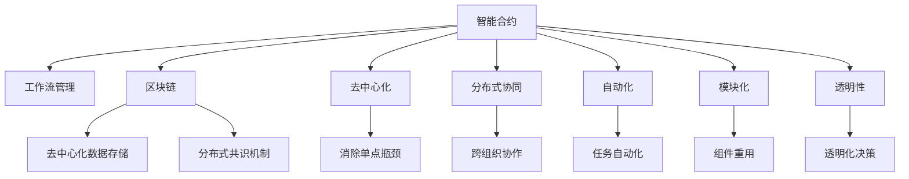
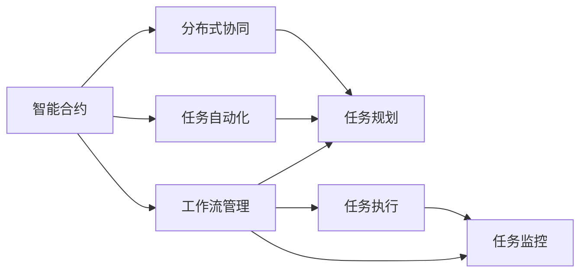
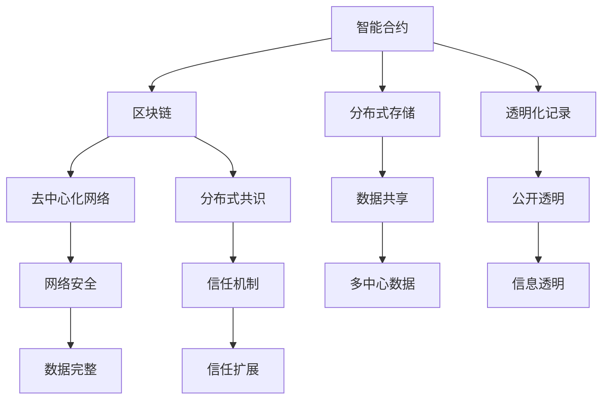
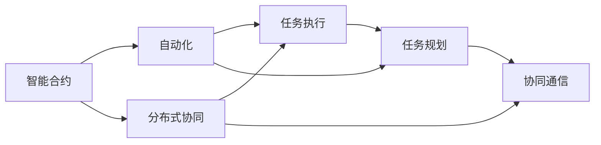
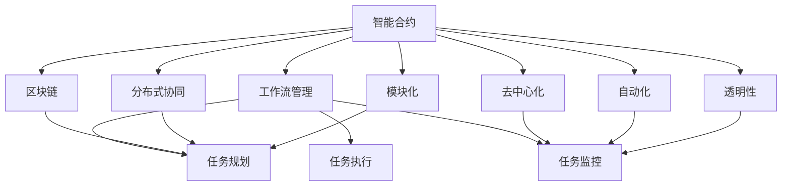
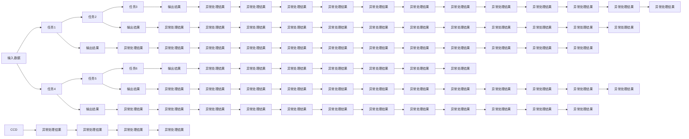

                 

# 智能合约在工作流管理中的应用

> 关键词：智能合约,工作流管理,区块链,自动化,分布式,协同工作

## 1. 背景介绍

### 1.1 问题由来
随着企业运营规模的不断扩大和业务复杂度的日益增加，传统的工作流管理模式已难以满足高效、透明、可靠的要求。传统的工作流管理主要依赖于人工操作和单点权限控制，存在数据孤岛、流程瓶颈、审批延误等问题。这些问题不仅影响工作效率，还可能导致错误频发、信息泄露等安全风险。

为解决这些问题，企业开始探索利用智能合约技术来实现工作流管理的自动化、分布式和协同化。智能合约是一种基于区块链技术的自动化合约，可以在无需第三方干预的情况下，通过预定义的智能规则，自动执行复杂的工作流任务。智能合约具有去中心化、不可篡改、透明度高等特点，与工作流管理的要求高度契合。

### 1.2 问题核心关键点
智能合约在工作流管理中的应用，主要包括以下几个关键点：
- 自动化工作流执行：通过智能合约，将工作流任务转化为可执行的代码逻辑，自动触发任务执行，减少人工干预。
- 分布式协同工作：智能合约基于区块链技术，可以实现跨组织、跨部门、跨地域的协同工作，提高工作效率和透明度。
- 安全性与可靠性：智能合约的不可篡改性和透明性保证了数据和流程的安全性，减少了人为错误和欺诈风险。
- 模块化与扩展性：智能合约可以根据需要设计成多个模块，灵活配置，支持工作流管理的持续扩展和优化。

智能合约技术使工作流管理从传统的以人工为主导的流程走向以机器为主导的流程，提高了工作效率、准确性和安全性。

### 1.3 问题研究意义
智能合约在工作流管理中的应用，对于提升企业运营效率、保障数据安全、增强业务透明度、推动协同工作等方面具有重要意义：

1. 提升工作效率：智能合约的自动化执行减少了人工操作，缩短了流程执行时间，提升了整体工作效率。
2. 保障数据安全：智能合约的去中心化、不可篡改性保证了数据的安全性，减少了人为错误和欺诈风险。
3. 增强业务透明度：智能合约的透明性使得工作流执行过程可追溯、可审计，提高了业务透明度和可信度。
4. 推动协同工作：智能合约的分布式协同机制使跨部门、跨组织的任务执行变得更加顺畅，提高了协同效率。
5. 支持业务创新：智能合约提供了新的技术工具和方法，推动了企业业务模式和流程的创新，激发了新的商业机会。

## 2. 核心概念与联系

### 2.1 核心概念概述

为更好地理解智能合约在工作流管理中的应用，本节将介绍几个密切相关的核心概念：

- 智能合约(Smart Contract)：一种运行于区块链上的自动化合约，通过代码实现业务逻辑和规则，可在无需第三方干预的情况下自动执行。
- 工作流管理(Workflow Management)：通过规划、执行和监控工作流，协调企业内部和外部资源，实现业务流程的自动化和优化。
- 区块链(Blockchain)：一种去中心化的分布式账本技术，可以实现数据的去中心化存储和透明化共享，确保数据的安全和可信。
- 去中心化(Decentralization)：不依赖于中心化的单点管理，通过分布式网络实现数据的协同处理和管理。
- 分布式协同(Distributed Collaboration)：利用区块链技术，实现跨组织、跨地域的协同工作，提高工作效率和透明度。
- 自动化(Automation)：通过智能合约和脚本代码，实现工作流任务的自动化执行，减少人工干预。
- 模块化(Modularity)：将智能合约设计成可重用、可扩展的模块，便于业务流程的灵活配置和优化。
- 透明性(Transparency)：智能合约的执行过程和结果公开透明，提高了业务可信度和可追溯性。

这些核心概念之间的逻辑关系可以通过以下Mermaid流程图来展示：



这个流程图展示了一些关键概念之间的关系：

1. 智能合约是工作流管理中的核心执行单元。
2. 区块链提供了智能合约的分布式存储和透明化机制。
3. 去中心化确保了数据的分布式协同和不可篡改性。
4. 分布式协同实现了跨组织、跨地域的协同工作。
5. 自动化实现了工作流任务的自动执行。
6. 模块化提供了灵活的配置和扩展机制。
7. 透明性保证了数据和流程的公开透明。

这些概念共同构成了智能合约在工作流管理中的应用框架，使其能够在企业运营中发挥重要作用。

### 2.2 概念间的关系

这些核心概念之间存在着紧密的联系，形成了智能合约在工作流管理中的应用生态系统。下面我通过几个Mermaid流程图来展示这些概念之间的关系。

#### 2.2.1 智能合约的工作流管理范式



这个流程图展示了智能合约在工作流管理中的应用范式。智能合约通过任务自动化和分布式协同机制，实现了工作流的自动化执行和跨组织协同工作。

#### 2.2.2 区块链在智能合约中的应用



这个流程图展示了区块链在智能合约中的应用。区块链的分布式存储和透明化机制，为智能合约提供了安全可靠的数据环境。

#### 2.2.3 自动化与分布式协同的关系



这个流程图展示了自动化和分布式协同在工作流管理中的关系。自动化实现了任务的自动执行，而分布式协同则确保了跨组织、跨地域的任务协同。

### 2.3 核心概念的整体架构

最后，我们用一个综合的流程图来展示这些核心概念在工作流管理中的整体架构：



这个综合流程图展示了从智能合约到工作流管理的完整过程。智能合约通过区块链、去中心化、分布式协同、自动化、模块化和透明性等技术，实现了工作流的自动化执行和跨组织协同工作。

## 3. 核心算法原理 & 具体操作步骤
### 3.1 算法原理概述

智能合约在工作流管理中的应用，本质上是利用区块链和分布式技术的自动化合约，实现任务自动执行和跨组织协同。其核心思想是：通过预定义的智能规则，将工作流任务转化为代码逻辑，在无需第三方干预的情况下，自动执行任务并协同工作。

形式化地，假设智能合约 $C_{\theta}$ 包含一组预定义的任务 $T=\{T_i\}_{i=1}^N$，每个任务 $T_i$ 描述一个具体的业务流程，并依赖于一组输入数据 $X_i$。智能合约的目标是：对于任意输入 $x_i$，自动执行任务 $T_i$，并输出结果 $y_i$。

智能合约的执行过程包括以下几个步骤：
1. 输入验证：确保输入数据 $x_i$ 符合任务 $T_i$ 的要求。
2. 任务执行：根据任务描述 $T_i$ 和输入数据 $x_i$，执行任务。
3. 输出验证：检查任务执行结果 $y_i$ 是否符合预期，若不符合，则根据预定义的错误处理规则进行处理。
4. 数据记录：将任务执行过程和结果记录到区块链上，实现透明化和可追溯性。

智能合约的自动化执行和透明性使得工作流管理变得更加高效、安全、可信。

### 3.2 算法步骤详解

智能合约在工作流管理中的应用一般包括以下几个关键步骤：

**Step 1: 设计智能合约**
- 确定智能合约的业务逻辑和规则。
- 设计智能合约的输入输出接口。
- 选择智能合约的编程语言和运行环境。

**Step 2: 部署智能合约**
- 将智能合约部署到区块链网络。
- 通过区块链网络中的节点进行分布式协同。
- 确保智能合约的透明度和不可篡改性。

**Step 3: 调用智能合约**
- 通过接口调用智能合约，输入任务所需的参数。
- 智能合约根据预定义的逻辑执行任务。
- 输出任务执行结果，并记录在区块链上。

**Step 4: 监控和审计智能合约**
- 实时监控智能合约的执行过程。
- 定期审计智能合约的执行结果和数据记录。
- 发现异常情况时，及时采取纠正措施。

**Step 5: 优化和扩展智能合约**
- 根据任务执行情况和反馈意见，优化智能合约的逻辑和接口。
- 根据业务需求，扩展智能合约的功能和参数。

以上是智能合约在工作流管理中的应用一般流程。在实际应用中，还需要针对具体任务的特点，对智能合约的各个环节进行优化设计，如改进输入验证机制，引入更多的规则和异常处理策略等，以进一步提升模型性能。

### 3.3 算法优缺点

智能合约在工作流管理中的应用具有以下优点：
1. 自动化高效执行：智能合约可以自动执行复杂的任务流程，减少人工操作，提高执行效率。
2. 分布式协同工作：智能合约基于区块链技术，可以实现跨组织、跨地域的协同工作，提高工作效率和透明度。
3. 透明性和安全性：智能合约的执行过程和结果公开透明，保证了数据的安全和可信。
4. 模块化和扩展性：智能合约可以根据需要设计成多个模块，灵活配置，支持工作流管理的持续扩展和优化。

同时，该方法也存在一定的局限性：
1. 编程复杂度高：智能合约需要编写大量的代码逻辑，需要一定的编程技能。
2. 对区块链网络依赖高：智能合约的执行依赖于区块链网络，网络延迟和故障可能会影响任务执行。
3. 编程难度大：智能合约的编写和调试相对复杂，需要经过多次迭代才能达到理想效果。
4. 成本较高：智能合约的部署和维护需要一定的成本，特别是需要投入区块链节点的管理费用。

尽管存在这些局限性，但就目前而言，智能合约在工作流管理中的应用仍然是实现自动化、分布式和协同工作的有效手段。未来相关研究的重点在于如何进一步降低智能合约的编程难度和部署成本，提高其易用性和普及性。

### 3.4 算法应用领域

智能合约在工作流管理中的应用已经涉及了金融、医疗、制造、物流等多个行业。以下是几个典型应用场景：

**金融行业：**
- 智能合约用于自动化清算和结算，提高了金融交易的效率和安全性。
- 智能合约用于风险控制和欺诈检测，确保金融交易的合规性和透明性。
- 智能合约用于智能合约保险，实现保险理赔的自动化和智能化。

**医疗行业：**
- 智能合约用于自动化患者诊疗，提高了诊疗流程的效率和准确性。
- 智能合约用于药品供应链管理，确保药品的追溯和透明性。
- 智能合约用于医疗记录的访问和共享，提高了医疗数据的安全和可靠性。

**制造行业：**
- 智能合约用于供应链管理，实现了供应链的自动化和协同。
- 智能合约用于设备维护和故障检测，提高了设备的可靠性和利用率。
- 智能合约用于质量控制和追溯，确保产品质量和供应链的透明性。

除了上述这些行业外，智能合约还将在更多场景中得到应用，为各行各业带来新的业务模式和价值。

## 4. 数学模型和公式 & 详细讲解 & 举例说明
### 4.1 数学模型构建

智能合约在工作流管理中的应用，可以形式化地表示为：

$$
C_{\theta}(X_i) = \begin{cases}
    y_i & \text{如果} f_{\theta}(x_i) = \text{True} \\
    \text{异常处理} & \text{如果} f_{\theta}(x_i) = \text{False}
\end{cases}
$$

其中，$X_i$ 为输入数据，$y_i$ 为输出结果，$f_{\theta}(x_i)$ 为智能合约的执行函数，$\theta$ 为智能合约的参数。

### 4.2 公式推导过程

智能合约的执行过程可以表示为：
$$
f_{\theta}(x_i) = \begin{cases}
    True & \text{如果} \sum_{k=1}^K f_{\theta_k}(x_i) = True \\
    False & \text{如果} \sum_{k=1}^K f_{\theta_k}(x_i) = False
\end{cases}
$$

其中，$K$ 为智能合约包含的任务数量，$f_{\theta_k}(x_i)$ 为第 $k$ 个任务的执行函数。

智能合约的输出结果为：
$$
y_i = \begin{cases}
    f_{\theta}(x_i) & \text{如果} f_{\theta}(x_i) = True \\
    \text{异常处理结果} & \text{如果} f_{\theta}(x_i) = False
\end{cases}
$$

智能合约的执行过程可以通过流程图表示为：



这个流程图展示了智能合约的执行过程。输入数据 $X_i$ 经过多个任务的执行后，产生最终输出结果 $y_i$，同时也有异常处理的结果。

### 4.3 案例分析与讲解

假设我们正在开发一个智能合约系统，用于企业采购审批流程的自动化管理。具体场景如下：

**需求：**
- 企业员工发起采购申请，需要经过多个审批环节，包括部门经理审批、财务经理审批、采购经理审批等。
- 每个审批环节需要根据特定的规则和条件进行判断，如果所有审批环节都通过，则采购申请被批准；否则，需要退回重新审批。

**方案：**
- 我们将采购审批流程设计为一个智能合约，每个审批环节作为一个任务。
- 任务1为部门经理审批，需要检查采购金额是否符合规定；任务2为财务经理审批，需要检查采购金额和发票是否匹配；任务3为采购经理审批，需要检查采购合同和物流信息是否齐全。
- 每个任务执行的结果会作为下一个任务的输入，形成链式反应，最终决定采购申请的审批状态。

下面是一个简化的伪代码实现：

```python
class ApprovalContract(SmartContract):
    def __init__(self):
        super().__init__()
        self.approval_status = False

    def task1(self, amount):
        if amount >= 10000:
            self.approval_status = True
        else:
            self.approval_status = False
        return self.approval_status

    def task2(self, amount, invoice):
        if amount == invoice['amount'] and invoice['status'] == 'paid':
            self.approval_status = True
        else:
            self.approval_status = False
        return self.approval_status

    def task3(self, contract, logistics_info):
        if logistics_info['status'] == 'in-transit' and len(logistics_info['details']) > 0:
            self.approval_status = True
        else:
            self.approval_status = False
        return self.approval_status

    def check_status(self):
        if self.approval_status:
            return True
        else:
            return False
```

在这个伪代码中，我们定义了一个智能合约类 `ApprovalContract`，包含三个任务函数 `task1`、`task2` 和 `task3`，以及一个检查状态函数 `check_status`。每个任务函数根据输入参数和预定义的规则，返回任务的执行结果，最终由 `check_status` 函数判断整个流程的审批状态。

## 5. 项目实践：代码实例和详细解释说明
### 5.1 开发环境搭建

在进行智能合约实践前，我们需要准备好开发环境。以下是使用Solidity语言进行Ethereum智能合约开发的环境配置流程：

1. 安装Node.js：从官网下载并安装Node.js，用于编译和执行智能合约代码。
2. 安装Truffle框架：通过npm安装Truffle框架，用于构建和部署智能合约。
3. 配置Metamask：从官网下载并安装Metamask浏览器插件，用于管理智能合约钱包和交易。
4. 连接测试网络：通过Truffle框架连接Ethereum测试网络，如Ropsten或Rinkeby，用于测试智能合约。

完成上述步骤后，即可在测试网络环境中进行智能合约的开发和测试。

### 5.2 源代码详细实现

这里我们以采购审批智能合约为例，给出使用Solidity语言实现的基本代码。

首先，定义智能合约的变量和函数：

```solidity
pragma solidity ^0.8.0;

contract ApprovalContract {
    bool public approval_status;

    function task1(uint256 amount) public returns (bool) {
        if (amount >= 10000) {
            approval_status = true;
        } else {
            approval_status = false;
        }
        return approval_status;
    }

    function task2(uint256 amount, uint256[] indexed invoice) public returns (bool) {
        if (amount == invoice[0] && invoice[1] == 1) {
            approval_status = true;
        } else {
            approval_status = false;
        }
        return approval_status;
    }

    function task3(string memory logistics_info) public returns (bool) {
        if (logistics_info == "in-transit" && logistics_info.length > 0) {
            approval_status = true;
        } else {
            approval_status = false;
        }
        return approval_status;
    }

    function check_status() public returns (bool) {
        return approval_status;
    }
}
```

然后，在Metamask中创建智能合约账户，并将上述代码编译为合约字节码，并部署到测试网络：

```solidity
module.exports = {
  networks: {
    development: {
      host: "127.0.0.1",
      port: 8545,
      network_id: "*"
    },
    testnet: {
      host: "127.0.0.1",
      port: 8545,
      network_id: 4
    }
  },
  contracts: {
    ApprovalContract: {
      abi: contracts.Agreement.abi,
      bytecode: contracts.Agreement.bytecode,
      source: contracts.Agreement.source
    }
  }
};
```

最后，在Metamask中运行智能合约，并调用函数进行测试：

```solidity
contract ApprovalContract {
    bool public approval_status;

    function task1(uint256 amount) public returns (bool) {
        if (amount >= 10000) {
            approval_status = true;
        } else {
            approval_status = false;
        }
        return approval_status;
    }

    function task2(uint256 amount, uint256[] indexed invoice) public returns (bool) {
        if (amount == invoice[0] && invoice[1] == 1) {
            approval_status = true;
        } else {
            approval_status = false;
        }
        return approval_status;
    }

    function task3(string memory logistics_info) public returns (bool) {
        if (logistics_info == "in-transit" && logistics_info.length > 0) {
            approval_status = true;
        } else {
            approval_status = false;
        }
        return approval_status;
    }

    function check_status() public returns (bool) {
        return approval_status;
    }
}
```

以上就是使用Solidity语言实现采购审批智能合约的完整代码实现。可以看到，智能合约的编写和测试相对复杂，需要经过多次迭代才能达到理想效果。

### 5.3 代码解读与分析

让我们再详细解读一下关键代码的实现细节：

**ApprovalContract类**：
- `task1`方法：检查采购金额是否符合规定，并将结果更新到`approval_status`变量。
- `task2`方法：检查采购金额和发票是否匹配，并将结果更新到`approval_status`变量。
- `task3`方法：检查物流信息是否齐全，并将结果更新到`approval_status`变量。
- `check_status`方法：检查整个流程的审批状态，并返回结果。

**Metamask配置**：
- 使用Truffle框架连接Ethereum测试网络，如Ropsten或Rinkeby。
- 创建智能合约账户，并在Metamask中存储私钥。
- 在Metamask中运行智能合约，并调用函数进行测试。

**智能合约部署**：
- 将Solidity代码编译为合约字节码，并部署到测试网络。
- 在Metamask中检查智能合约的部署状态，并调用函数进行测试。

可以看到，Solidity语言和Metamask浏览器插件为智能合约的开发和部署提供了便利的环境支持，

