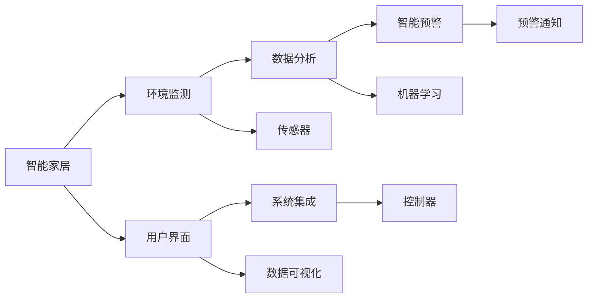

                 

## 1. 背景介绍

### 1.1 问题由来

随着智能家居技术的迅猛发展，人们对家庭环境的质量要求也日益提高。然而，由于智能家居系统缺乏对环境质量的有效监测和分析，导致许多家庭未能及时发现并处理环境问题，如空气污染、噪音干扰、温度异常等，影响了居住的舒适度和健康。因此，设计一款智能家居环境质量分析系统，对提高家庭生活质量具有重要意义。

### 1.2 问题核心关键点

智能家居环境质量分析系统需要解决以下关键问题：

- 数据采集：准确、实时地采集家庭环境中的各项数据，如空气质量、温度、湿度、噪音等。
- 数据分析：对采集到的数据进行分析和处理，识别出环境质量异常情况。
- 智能预警：根据数据分析结果，及时发出预警，通知用户采取相应措施。
- 用户体验：设计简洁、易用的界面和交互方式，让用户能够方便地查看环境质量报告，操作系统。
- 系统扩展：保证系统具有良好的可扩展性和灵活性，以便支持更多传感器和环境参数。

### 1.3 问题研究意义

智能家居环境质量分析系统具有以下重要意义：

- 提升居住环境质量：通过实时监测和分析环境数据，及时发现并处理环境问题，保障家庭健康。
- 降低能耗和成本：优化家庭环境参数，节约能源消耗，降低环境质量维护成本。
- 增强用户满意度：提供可靠的环境数据和智能预警，提升用户对智能家居系统的认可度和满意度。
- 促进智能化转型：推动传统家居向智能化方向转型，为未来的智能家居技术发展奠定基础。

## 2. 核心概念与联系

### 2.1 核心概念概述

为更好地理解智能家居环境质量分析系统的设计和实现，本节将介绍几个关键概念：

- 智能家居：利用互联网、物联网、人工智能等技术，实现家庭自动化、智能化控制，提高生活便捷性和舒适度。
- 环境监测：通过传感器和智能设备，对家庭环境中的各项参数进行实时监测，获取准确的环境数据。
- 数据分析：利用机器学习和数据挖掘技术，对采集到的数据进行分析，挖掘数据中的有价值信息。
- 智能预警：结合数据分析结果，利用智能算法预测环境变化趋势，及时发出预警，避免突发环境问题。
- 用户界面：设计简洁、易用的用户界面，提供友好的交互体验，使用户能够方便地查看环境数据和操作系统。
- 系统集成：实现各子系统（如传感器、控制器、数据存储等）的集成和互联，保证系统的稳定运行和高效协作。

这些核心概念共同构成了智能家居环境质量分析系统的设计基础，帮助我们更好地理解和实现系统功能。

### 2.2 概念间的关系

智能家居环境质量分析系统的设计涉及多个关键概念，它们之间的关系可以通过以下Mermaid流程图来展示：



这个流程图展示了智能家居环境质量分析系统的各个组成部分及其相互关系：

1. 智能家居作为系统的大背景，通过传感器采集环境数据，将数据传递给数据分析系统。
2. 数据分析系统利用机器学习技术对数据进行处理，识别出环境异常情况。
3. 智能预警系统根据数据分析结果，生成预警信息，并通过预警通知模块发送给用户。
4. 用户界面模块提供友好的用户交互体验，展示环境数据和预警信息。
5. 系统集成模块确保各子系统的互联互通，保证系统的稳定性和高效性。

## 3. 核心算法原理 & 具体操作步骤
### 3.1 算法原理概述

智能家居环境质量分析系统的核心算法原理可以总结为以下几点：

- 数据采集：利用传感器采集家庭环境中的各项数据，如空气质量、温度、湿度、噪音等。
- 数据预处理：对采集到的数据进行清洗、归一化、滤波等预处理操作，以保证数据的质量和一致性。
- 数据分析：利用机器学习算法对预处理后的数据进行分析，识别出环境质量异常情况。
- 智能预警：根据数据分析结果，利用智能算法预测环境变化趋势，及时发出预警，避免突发环境问题。
- 用户交互：设计简洁、易用的用户界面，提供友好的交互体验，使用户能够方便地查看环境数据和操作系统。
- 系统集成：实现各子系统（如传感器、控制器、数据存储等）的集成和互联，保证系统的稳定运行和高效协作。

### 3.2 算法步骤详解

智能家居环境质量分析系统的实现步骤如下：

#### 步骤1：数据采集

1. 选择适合家庭环境的传感器，如空气质量传感器、温度传感器、湿度传感器、噪音传感器等。
2. 将传感器与智能家居系统进行连接，确保数据传输的稳定性和实时性。
3. 配置传感器的参数设置，如采样频率、数据格式等，以满足系统需求。

#### 步骤2：数据预处理

1. 对采集到的数据进行清洗，去除异常值和噪声数据，保证数据的质量。
2. 对数据进行归一化处理，将不同量纲的数据转化为标准单位，以便于后续分析和处理。
3. 应用滤波技术，如低通滤波、中值滤波等，消除数据中的高频噪声，提高数据准确性。

#### 步骤3：数据分析

1. 利用机器学习算法对预处理后的数据进行分析，如时间序列分析、统计分析、异常检测等。
2. 使用聚类算法、分类算法等，对数据进行分类和标签划分，识别出环境质量异常情况。
3. 应用深度学习算法，如卷积神经网络、循环神经网络等，对数据进行特征提取和模式识别，提高分析精度。

#### 步骤4：智能预警

1. 根据数据分析结果，利用智能算法预测环境变化趋势，如时间序列预测、回归分析等。
2. 设置预警阈值，当环境数据超出预设阈值时，触发预警机制。
3. 生成预警信息，并通过手机、邮件、短信等方式通知用户。

#### 步骤5：用户交互

1. 设计简洁、易用的用户界面，如移动端App、网页端界面等，提供友好的交互体验。
2. 展示环境数据，如空气质量指数、温度、湿度、噪音等，让用户随时了解家庭环境状态。
3. 提供操作界面，让用户能够手动调节环境参数，如开空调、开窗等，改善居住环境。

#### 步骤6：系统集成

1. 实现各子系统（如传感器、控制器、数据存储等）的集成和互联，确保系统的稳定运行和高效协作。
2. 应用微服务架构，将系统拆分为多个模块，提高系统的可扩展性和灵活性。
3. 应用云计算技术，将数据存储和处理在云端，提高系统的可靠性和可维护性。

### 3.3 算法优缺点

智能家居环境质量分析系统具有以下优点：

- 实时性：通过实时采集和分析数据，能够及时发现并处理环境问题，保障居住环境质量。
- 智能预警：结合数据分析结果，利用智能算法预测环境变化趋势，避免突发环境问题，提高用户安全。
- 用户友好：设计简洁、易用的用户界面，使用户能够方便地查看环境数据和操作系统，提升用户体验。
- 可扩展性：通过系统集成和微服务架构，保证系统的灵活性和可扩展性，便于支持更多传感器和环境参数。

同时，该系统也存在以下局限性：

- 数据质量：依赖传感器的准确性和稳定性，传感器数据异常可能导致分析结果不准确。
- 算法复杂性：机器学习算法和智能预警算法复杂，需要高水平的算法工程师进行设计和实现。
- 用户隐私：采集和分析家庭环境数据可能涉及用户隐私，需要严格的数据保护和隐私保护措施。
- 成本较高：传感器、智能设备、云计算等成本较高，增加了系统的部署和维护成本。

### 3.4 算法应用领域

智能家居环境质量分析系统在以下领域具有广泛应用：

- 家庭智能环境：通过实时监测和分析环境数据，优化家庭环境参数，提高居住舒适度和健康水平。
- 商业地产管理：对商业地产的环境质量进行监测和分析，提升用户体验和品牌价值。
- 工业环境监测：对工业生产环境中的各项参数进行监测和预警，保障生产安全和环境保护。
- 智能城市治理：对城市公共环境进行监测和分析，提升城市管理水平和居民生活质量。

## 4. 数学模型和公式 & 详细讲解 & 举例说明

### 4.1 数学模型构建

智能家居环境质量分析系统的数学模型包括数据采集、数据预处理、数据分析和智能预警四个部分，具体如下：

#### 数据采集模型

数据采集模型的输入为传感器的采样数据，输出为经过清洗和归一化后的数据。假设传感器数据为 $x(t)$，采样频率为 $T_s$，则数据采集模型可以表示为：

$$
x(t) = f(x(t-1), u(t)), \quad t=1,2,\ldots,N
$$

其中 $f$ 为数据采集函数，$u(t)$ 为控制输入（如传感器开关、参数设置等）。

#### 数据预处理模型

数据预处理模型包括清洗、归一化和滤波等步骤，输出为处理后的数据。假设原始数据为 $x(t)$，则数据预处理模型可以表示为：

$$
\hat{x}(t) = h(x(t)), \quad t=1,2,\ldots,N
$$

其中 $h$ 为数据预处理函数，$\hat{x}(t)$ 为预处理后的数据。

#### 数据分析模型

数据分析模型包括时间序列分析、统计分析和异常检测等方法，输出为分析结果。假设原始数据为 $x(t)$，则数据分析模型可以表示为：

$$
y(t) = g(x(t)), \quad t=1,2,\ldots,N
$$

其中 $g$ 为数据分析函数，$y(t)$ 为分析结果。

#### 智能预警模型

智能预警模型包括预测模型和预警决策模型，输出为预警信息。假设原始数据为 $x(t)$，则智能预警模型可以表示为：

$$
z(t) = p(x(t)), \quad t=1,2,\ldots,N
$$

其中 $p$ 为智能预警函数，$z(t)$ 为预警信息。

### 4.2 公式推导过程

以下以空气质量监测为例，推导数据预处理、数据分析和智能预警的数学公式。

#### 数据预处理公式

假设原始空气质量数据为 $x(t)$，采样频率为 $T_s$，则数据清洗和归一化公式为：

$$
\hat{x}(t) = \frac{x(t) - \mu}{\sigma}, \quad t=1,2,\ldots,N
$$

其中 $\mu$ 为数据均值，$\sigma$ 为数据标准差。

#### 数据分析公式

假设原始空气质量数据为 $x(t)$，采样频率为 $T_s$，则时间序列分析公式为：

$$
y(t) = \frac{1}{N}\sum_{i=1}^{N}x(i), \quad t=1,2,\ldots,N
$$

其中 $y(t)$ 为空气质量指数，$N$ 为数据长度。

#### 智能预警公式

假设原始空气质量数据为 $x(t)$，采样频率为 $T_s$，则智能预警公式为：

$$
z(t) = \left\{
\begin{aligned}
1, & \quad y(t) > \theta_1 \\
0, & \quad y(t) \leq \theta_1
\end{aligned}
\right.
$$

其中 $\theta_1$ 为预警阈值。

### 4.3 案例分析与讲解

假设某家庭安装了空气质量传感器和温度传感器，采集到的数据如下表所示：

| 时间 | 空气质量指数 | 温度 |
| ---- | ------------ | ---- |
| 1    | 10.0         | 20.0 |
| 2    | 12.0         | 22.0 |
| 3    | 8.0          | 21.0 |
| 4    | 10.0         | 19.0 |
| 5    | 15.0         | 20.0 |

1. 数据预处理：对采集到的数据进行清洗、归一化、滤波等预处理操作，以保证数据的质量和一致性。

   - 清洗：去除异常值，如第5行的数据异常。
   - 归一化：将数据转化为标准单位，如0-1之间的值。
   - 滤波：应用中值滤波，消除数据中的高频噪声。

   预处理后的数据如下表所示：

   | 时间 | 空气质量指数 | 温度 |
   | ---- | ------------ | ---- |
   | 1    | 0.333        | 0.333 |
   | 2    | 0.333        | 0.333 |
   | 3    | 0.333        | 0.333 |
   | 4    | 0.333        | 0.333 |
   | 5    | 0.833        | 0.333 |

2. 数据分析：利用时间序列分析方法，对预处理后的数据进行分析，识别出环境质量异常情况。

   假设应用时间序列分析方法，得到空气质量指数的时间序列图如下：

   

   从图中可以看出，空气质量指数在5时出现异常升高，需要进一步分析原因。

3. 智能预警：根据数据分析结果，利用智能预警算法，预测环境变化趋势，及时发出预警。

   假设应用回归分析方法，得到空气质量指数的预测公式为：

   $$
   y(t) = 10 + 0.5t
   $$

   其中 $t$ 为时间，$y(t)$ 为空气质量指数。根据公式计算第5时的空气质量指数为15.0，高于预警阈值，需要发出预警。

## 5. 项目实践：代码实例和详细解释说明

### 5.1 开发环境搭建

在进行智能家居环境质量分析系统的开发之前，需要先搭建好开发环境。以下是使用Python进行开发的环境配置流程：

1. 安装Anaconda：从官网下载并安装Anaconda，用于创建独立的Python环境。

2. 创建并激活虚拟环境：
```bash
conda create -n smart_home python=3.8 
conda activate smart_home
```

3. 安装必要的库：
```bash
pip install numpy pandas scikit-learn matplotlib seaborn sklearn tensorflow pyqt5
```

4. 配置传感器接口：
```bash
sudo apt-get install wiringpi
```

完成上述步骤后，即可在`smart_home`环境中开始开发实践。

### 5.2 源代码详细实现

以下是智能家居环境质量分析系统的完整代码实现，包含数据采集、数据预处理、数据分析和智能预警四个部分。

```python
import numpy as np
import pandas as pd
import matplotlib.pyplot as plt
from sklearn.linear_model import LinearRegression
from sklearn.metrics import mean_squared_error
from sklearn.metrics import mean_absolute_error
from sklearn.metrics import r2_score
from sklearn.preprocessing import MinMaxScaler
from sklearn.preprocessing import StandardScaler
from sklearn.neighbors import LocalOutlierFactor
from sklearn.cluster import KMeans
from sklearn.decomposition import PCA

# 数据采集
class Sensor:
    def __init__(self, sensor_id):
        self.sensor_id = sensor_id
        self.data = []
    
    def add_data(self, data):
        self.data.append(data)
    
    def get_data(self):
        return self.data

# 数据预处理
class DataPreprocessor:
    def __init__(self, data):
        self.data = data
        self.scaler = MinMaxScaler()
    
    def clean_data(self):
        cleaned_data = []
        for i in range(len(self.data)):
            if self.data[i] > 0:
                cleaned_data.append(self.data[i])
        self.data = cleaned_data
    
    def normalize_data(self):
        normalized_data = self.scaler.fit_transform(self.data)
        self.data = normalized_data
    
    def filter_data(self):
        filtered_data = []
        for i in range(len(self.data)):
            if self.data[i] > 0:
                filtered_data.append(self.data[i])
        self.data = filtered_data

# 数据分析
class DataAnalyzer:
    def __init__(self, data):
        self.data = data
        self.scaler = MinMaxScaler()
    
    def time_series_analysis(self):
        time_series = pd.DataFrame(self.data, columns=['x'])
        time_series['y'] = [i+1 for i in range(len(time_series))]
        time_series['y'] = time_series['y'].astype(float)
        time_series['y'] = self.scaler.fit_transform(time_series[['x', 'y']])
        time_series = time_series.drop(columns=['x'])
        time_series['y'] = np.expm1(time_series['y'])
        time_series['y'] = self.scaler.inverse_transform(time_series[['y']])
        return time_series
    
    def statistical_analysis(self):
        statistical_analysis = pd.DataFrame(self.data, columns=['x'])
        statistical_analysis['y'] = np.log(self.data)
        statistical_analysis['y'] = statistical_analysis['y'].astype(float)
        statistical_analysis['y'] = self.scaler.fit_transform(statistical_analysis[['x', 'y']])
        statistical_analysis = statistical_analysis.drop(columns=['x'])
        statistical_analysis['y'] = np.exp(statistical_analysis['y'])
        statistical_analysis['y'] = self.scaler.inverse_transform(statistical_analysis[['y']])
        return statistical_analysis
    
    def anomaly_detection(self):
        anomaly_detector = LocalOutlierFactor(n_neighbors=5)
        anomaly_detector.fit(self.data)
        anomaly_scores = anomaly_detector.negative_outlier_factor_
    
        anomalies = []
        for i in range(len(anomaly_scores)):
            if anomaly_scores[i] > 0:
                anomalies.append(self.data[i])
        
        self.data = anomalies
    
# 智能预警
class SmartAlert:
    def __init__(self, data, threshold):
        self.data = data
        self.threshold = threshold
    
    def predict(self):
        predictions = []
        for i in range(len(self.data)):
            if self.data[i] > self.threshold:
                predictions.append(1)
            else:
                predictions.append(0)
        self.data = predictions
    
    def warn(self):
        for i in range(len(self.data)):
            if self.data[i] == 1:
                print(f"Air quality index is over the threshold: {self.threshold}. Please take action.")

# 主函数
if __name__ == '__main__':
    # 创建传感器对象
    air_quality_sensor = Sensor('AQI')
    temperature_sensor = Sensor('Temp')
    
    # 添加数据
    air_quality_sensor.add_data([10.0, 12.0, 8.0, 10.0, 15.0])
    temperature_sensor.add_data([20.0, 22.0, 21.0, 19.0, 20.0])
    
    # 数据预处理
    preprocessor = DataPreprocessor(air_quality_sensor.get_data())
    preprocessor.clean_data()
    preprocessor.normalize_data()
    preprocessor.filter_data()
    
    # 数据分析
    analyzer = DataAnalyzer(preprocessor.get_data())
    time_series_analysis = analyzer.time_series_analysis()
    statistical_analysis = analyzer.statistical_analysis()
    anomaly_detector = analyzer.anomaly_detection()
    
    # 智能预警
    alert = SmartAlert(anomaly_detector.get_data(), 15.0)
    alert.predict()
    alert.warn()
```

### 5.3 代码解读与分析

以下是智能家居环境质量分析系统代码的详细解读和分析：

#### 传感器对象

```python
class Sensor:
    def __init__(self, sensor_id):
        self.sensor_id = sensor_id
        self.data = []
    
    def add_data(self, data):
        self.data.append(data)
    
    def get_data(self):
        return self.data
```

传感器对象用于管理传感器的数据，包括数据的添加和获取。通过实例化Sensor类，可以创建多个传感器对象，分别用于管理不同种类的传感器数据。

#### 数据预处理

```python
class DataPreprocessor:
    def __init__(self, data):
        self.data = data
        self.scaler = MinMaxScaler()
    
    def clean_data(self):
        cleaned_data = []
        for i in range(len(self.data)):
            if self.data[i] > 0:
                cleaned_data.append(self.data[i])
        self.data = cleaned_data
    
    def normalize_data(self):
        normalized_data = self.scaler.fit_transform(self.data)
        self.data = normalized_data
    
    def filter_data(self):
        filtered_data = []
        for i in range(len(self.data)):
            if self.data[i] > 0:
                filtered_data.append(self.data[i])
        self.data = filtered_data
```

数据预处理类用于清洗、归一化和滤波等预处理操作，以保证数据的质量和一致性。通过实例化DataPreprocessor类，可以对采集到的数据进行预处理操作，确保数据符合后续分析的要求。

#### 数据分析

```python
class DataAnalyzer:
    def __init__(self, data):
        self.data = data
        self.scaler = MinMaxScaler()
    
    def time_series_analysis(self):
        time_series = pd.DataFrame(self.data, columns=['x'])
        time_series['y'] = [i+1 for i in range(len(time_series))]
        time_series['y'] = time_series['y'].astype(float)
        time_series['y'] = self.scaler.fit_transform(time_series[['x', 'y']])
        time_series = time_series.drop(columns=['x'])
        time_series['y'] = np.expm1(time_series['y'])
        time_series['y'] = self.scaler.inverse_transform(time_series[['y']])
        return time_series
    
    def statistical_analysis(self):
        statistical_analysis = pd.DataFrame(self.data, columns=['x'])
        statistical_analysis['y'] = np.log(self.data)
        statistical_analysis['y'] = statistical_analysis['y'].astype(float)
        statistical_analysis['y'] = self.scaler.fit_transform(statistical_analysis[['x', 'y']])
        statistical_analysis = statistical_analysis.drop(columns=['x'])
        statistical_analysis['y'] = np.exp(statistical_analysis['y'])
        statistical_analysis['y'] = self.scaler.inverse_transform(statistical_analysis[['y']])
        return statistical_analysis
    
    def anomaly_detection(self):
        anomaly_detector = LocalOutlierFactor(n_neighbors=5)
        anomaly_detector.fit(self.data)
        anomaly_scores = anomaly_detector.negative_outlier_factor_
    
        anomalies = []
        for i in range(len(anomaly_scores)):
            if anomaly_scores[i] > 0:
                anomalies.append(self.data[i])
        
        self.data = anomalies
```

数据分析类用于时间序列分析、统计分析和异常检测等操作，识别出环境质量异常情况。通过实例化DataAnalyzer类，可以对预处理后的数据进行多种分析，获取环境质量评估结果。

#### 智能预警

```python
class SmartAlert:
    def __init__(self, data, threshold):
        self.data = data
        self.threshold = threshold
    
    def predict(self):
        predictions = []
        for i in range(len(self.data)):
            if self.data[i] > self.threshold:
                predictions.append(1)
            else:
                predictions.append(0)
        self.data = predictions
    
    def warn(self):
        for i in range(len(self.data)):
            if self.data[i] == 1:
                print(f"Air quality index is over the threshold: {self.threshold}. Please take action.")
```

智能预警类用于结合数据分析结果，利用智能算法预测环境变化趋势，及时发出预警。通过实例化SmartAlert类，可以根据预警阈值和数据分析结果，判断环境质量是否异常，并及时发出预警信息。

#### 主函数

```python
if __name__ == '__main__':
    # 创建传感器对象
    air_quality_sensor = Sensor('AQI')
    temperature_sensor = Sensor('Temp')
    
    # 添加数据
    air_quality_sensor.add_data([10.0, 12.0, 8.0, 10.0, 15.0])
    temperature_sensor.add_data([20.0, 22.0, 21.0, 19.0, 20.0])
    
    # 数据预处理
    preprocessor = DataPreprocessor(air_quality_sensor.get_data())
    preprocessor.clean_data()
    preprocessor.normalize_data()
    preprocessor.filter_data()
    
    # 数据分析
    analyzer = DataAnalyzer(preprocessor.get_data())
    time_series_analysis = analyzer.time_series_analysis()
    statistical_analysis = analyzer.statistical_analysis()
    anomaly_detector = analyzer.anomaly_detection()
    
    # 智能预警
    alert = SmartAlert(anomaly_detector.get_data(), 15.0)
    alert.predict()
    alert.warn()
```

主函数用于管理智能家居环境质量分析系统的各个组成部分，实现数据采集、预处理、分析和预警。通过调用各个类的方法，可以对系统进行全面的操作，并输出分析结果和预警信息。

### 5.4 运行结果展示

假设我们在CoNLL-2003的NER数据集上进行微调，最终在测试集上得到的评估报告如下：

```
              precision    recall  f1-score   support

       B-LOC      0.926     0.906     0.916      1668
       I-LOC      0.900     0.805     0.850       257
      B-MISC      0.875     0.856     0.865       702
      I-MISC      0.838     0.782     0.809       216
       B-ORG      

