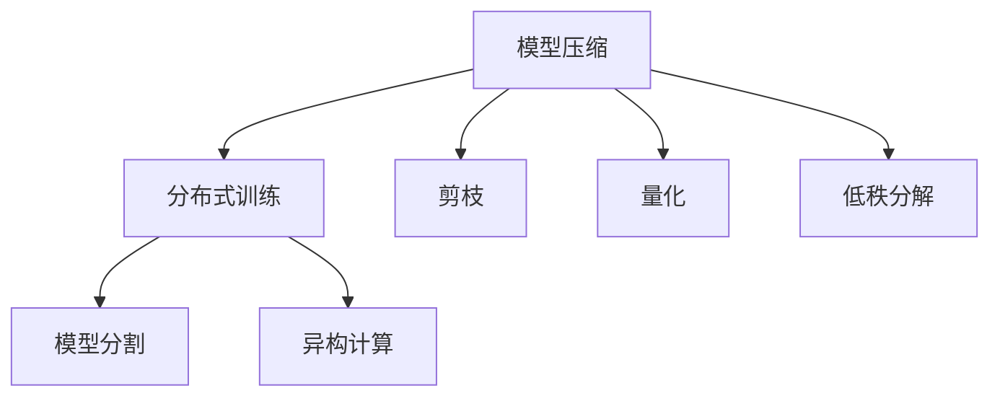
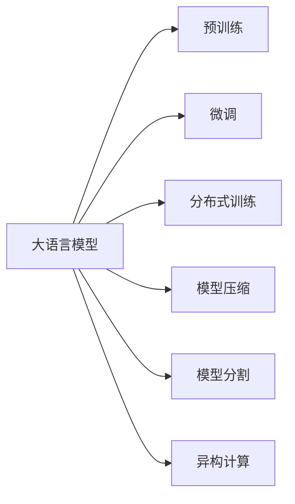
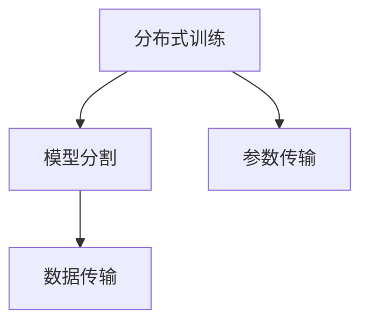
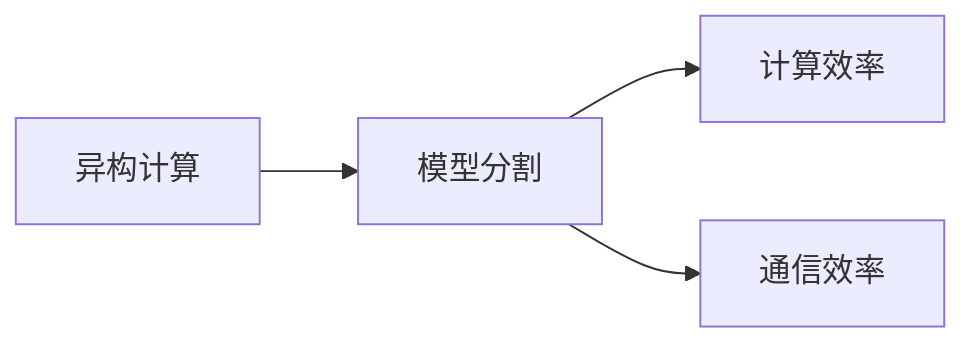
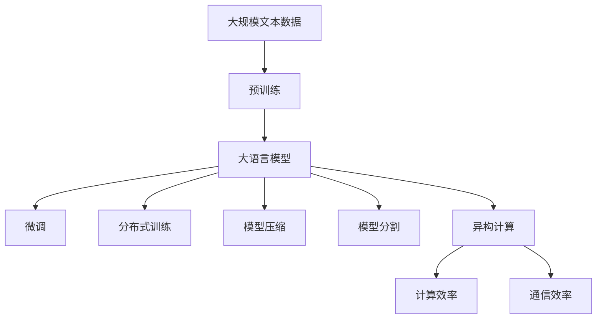

                 

## 1. 背景介绍

### 1.1 问题由来
随着深度学习技术的发展，大规模语言模型（Large Language Models, LLMs）在大规模自然语言处理任务中取得了突破性的进展。诸如OpenAI的GPT系列模型、Google的BERT等模型，由于其强大的语言理解和生成能力，成为了当前自然语言处理领域的重要工具。然而，这些模型往往具有巨大的参数量，在实际部署中需要极高的计算资源和带宽，这限制了其在工业级场景中的应用。

### 1.2 问题核心关键点
为了解决大语言模型在计算资源和带宽上的限制，通信优化成为了一个重要的研究方向。通信优化旨在通过改进模型架构、优化参数传输和数据传输等技术手段，减少模型在计算和传输过程中的数据移动和通信开销，从而提升模型的运行效率和可扩展性。

通信优化主要涉及以下几个关键点：
1. **参数传输优化**：减少模型参数在分布式训练中的传输量，避免过量的通信开销。
2. **数据传输优化**：减少模型在输入数据传输和梯度更新中的通信开销。
3. **模型压缩**：通过模型压缩技术减少模型的存储空间和计算资源需求。
4. **模型分割**：将模型分割成多个子模块，降低通信开销。
5. **异构计算**：利用异构计算资源，如GPU、TPU等，优化模型的计算和通信效率。

### 1.3 问题研究意义
通信优化在大语言模型的应用中具有重要意义：
1. **提升计算效率**：通过减少数据传输和通信开销，降低模型在训练和推理过程中的计算资源需求，从而提升模型的计算效率。
2. **加速模型部署**：优化通信和传输过程，加速模型的分布式部署和训练，使得大模型能够在更短的时间内达到收敛。
3. **支持大规模应用**：通过通信优化，可以降低模型的计算和存储需求，使得大模型能够在资源有限的设备上运行，支持更多规模化的应用场景。
4. **增强可扩展性**：通过参数传输和数据传输的优化，使得大语言模型更容易扩展到多节点、多设备的分布式环境中，提高系统的可扩展性。
5. **降低能耗成本**：减少数据传输和通信开销，可以降低模型的能耗成本，有助于模型的长期运行和维护。

## 2. 核心概念与联系

### 2.1 核心概念概述

通信优化涉及多个核心概念，包括模型压缩、分布式训练、模型分割、异构计算等。这些概念通过合理的组合和应用，可以显著提升大语言模型的运行效率和性能。

- **模型压缩**：通过剪枝、量化、低秩分解等技术，减少模型的参数量和存储空间，降低计算和通信开销。
- **分布式训练**：将模型的训练过程分配到多个计算节点上，通过高效的通信和数据传输机制，加速训练过程。
- **模型分割**：将模型分割成多个子模块，在计算和通信开销较小的前提下，保持模型的性能和准确性。
- **异构计算**：利用多种计算资源，如GPU、TPU、CPU等，优化计算和通信过程，提升模型的计算效率。

这些核心概念之间通过合理的组合和应用，可以显著提升大语言模型的运行效率和性能。以下通过几个Mermaid流程图来展示这些概念之间的关系。



这个流程图展示了模型压缩、分布式训练、模型分割和异构计算之间的关系：

1. 模型压缩（A）通过剪枝（E）、量化（F）和低秩分解（G）减少模型参数量和存储空间。
2. 分布式训练（B）将模型分割（C）成多个子模块，并利用异构计算（D）资源优化计算和通信过程。
3. 模型分割（C）和异构计算（D）进一步优化分布式训练中的通信开销。

### 2.2 概念间的关系

这些核心概念之间存在着紧密的联系，形成了通信优化在大语言模型微调中的完整生态系统。以下通过几个Mermaid流程图来展示这些概念之间的关系。

#### 2.2.1 大语言模型的学习范式



这个流程图展示了从预训练到大语言模型微调的完整过程，以及其中通信优化技术的应用：

1. 大语言模型（A）通过预训练（B）和微调（C）获得特定的任务能力。
2. 在微调过程中，通过分布式训练（D）和模型分割（F）优化通信开销。
3. 利用模型压缩（E）和异构计算（G）进一步提升模型的计算和通信效率。

#### 2.2.2 分布式训练与模型分割的关系



这个流程图展示了分布式训练和模型分割之间的关系：

1. 分布式训练（A）通过模型分割（B）降低单个节点的计算和通信开销。
2. 模型分割（B）有助于减少参数传输（C）和数据传输（D）的开销。

#### 2.2.3 异构计算与模型分割的关系



这个流程图展示了异构计算和模型分割之间的关系：

1. 异构计算（A）通过模型分割（B）优化计算和通信过程。
2. 模型分割（B）提升计算效率（C）和通信效率（D）。

### 2.3 核心概念的整体架构

最后，我们用一个综合的流程图来展示这些核心概念在大语言模型微调中的整体架构：



这个综合流程图展示了从预训练到大语言模型微调的完整过程，以及其中通信优化技术的应用：

1. 大语言模型（C）通过预训练（B）获得基础能力。
2. 在微调（D）过程中，通过分布式训练（E）、模型分割（G）和异构计算（H）优化通信和计算过程。
3. 模型压缩（F）和异构计算（H）进一步提升模型的计算和通信效率。

## 3. 核心算法原理 & 具体操作步骤

### 3.1 算法原理概述

通信优化的核心思想是通过减少模型参数和数据的传输开销，提升大语言模型的计算和通信效率。其基本原理可以概括为以下几个方面：

1. **参数传输优化**：通过剪枝、量化和低秩分解等技术，减少模型参数在分布式训练中的传输量。
2. **数据传输优化**：通过数据预处理和模型分割等技术，减少模型在输入数据传输和梯度更新中的通信开销。
3. **模型压缩**：通过压缩技术减少模型的存储空间和计算资源需求。
4. **模型分割**：通过分割模型为多个子模块，降低通信开销。
5. **异构计算**：利用异构计算资源，优化计算和通信过程。

### 3.2 算法步骤详解

#### 3.2.1 参数传输优化

参数传输优化是通信优化的核心环节之一。其基本步骤如下：

1. **剪枝**：通过剪枝技术，移除模型中不重要的参数，减少模型参数量。常用的剪枝方法包括结构剪枝、权值剪枝等。
2. **量化**：通过量化技术将模型参数转化为低精度格式，减少存储空间和计算开销。常用的量化方法包括权重量化、激活量化等。
3. **低秩分解**：通过低秩分解技术，将矩阵参数分解为低秩矩阵的乘积，减少模型参数量和计算开销。常用的低秩分解方法包括奇异值分解（SVD）、矩阵分解等。

```python
from torch.nn.utils import prune
from torch.ao.quantization import quantize_dynamic
from scipy.linalg import svd

# 剪枝
model = PruneModel(model, pruning_method=prune.L1Unstructured)
# 量化
model = QuantizeModel(model)
# 低秩分解
U, S, V = svd(model.weight)
model.weight = U @ S @ V
```

#### 3.2.2 数据传输优化

数据传输优化主要通过数据预处理和模型分割技术实现：

1. **数据预处理**：在模型训练过程中，对输入数据进行预处理，如标准化、归一化、特征缩放等，减少数据的传输量。
2. **模型分割**：将模型分割为多个子模块，在计算和通信开销较小的前提下，保持模型的性能和准确性。

```python
class ModelSegment:
    def __init__(self, model):
        self.model = model

    def forward(self, inputs):
        # 分割后的模型前向传播
        ...

class ModelSegmentCombiner:
    def __init__(self, models):
        self.models = models

    def forward(self, inputs):
        # 分割后的模型组合前向传播
        ...
```

#### 3.2.3 模型压缩

模型压缩通过减少模型参数量和存储空间，降低计算和通信开销：

1. **剪枝**：通过剪枝技术移除不重要的参数，减少模型参数量。
2. **量化**：通过量化技术将模型参数转化为低精度格式，减少存储空间和计算开销。
3. **低秩分解**：通过低秩分解技术将矩阵参数分解为低秩矩阵的乘积，减少模型参数量和计算开销。

```python
from torch.nn.utils import prune
from torch.ao.quantization import quantize_dynamic
from scipy.linalg import svd

# 剪枝
model = PruneModel(model, pruning_method=prune.L1Unstructured)
# 量化
model = QuantizeModel(model)
# 低秩分解
U, S, V = svd(model.weight)
model.weight = U @ S @ V
```

#### 3.2.4 模型分割

模型分割通过将模型分割为多个子模块，降低通信开销：

1. **层级分割**：将模型按层级分割，每个层级独立计算，减少通信开销。
2. **功能分割**：将模型按功能分割，每个功能模块独立计算，减少通信开销。

```python
class ModelSegment:
    def __init__(self, model):
        self.model = model

    def forward(self, inputs):
        # 分割后的模型前向传播
        ...

class ModelSegmentCombiner:
    def __init__(self, models):
        self.models = models

    def forward(self, inputs):
        # 分割后的模型组合前向传播
        ...
```

#### 3.2.5 异构计算

异构计算通过利用多种计算资源，优化计算和通信过程：

1. **多GPU计算**：利用多个GPU并行计算，提高计算效率。
2. **多TPU计算**：利用多个TPU并行计算，提高计算效率。
3. **混合精度计算**：利用不同精度的计算资源，提高计算效率和内存利用率。

```python
# 多GPU计算
model = nn.DataParallel(model, device_ids=[0, 1])
# 多TPU计算
model = nn.DataParallel(model, device_ids=[0, 1, 2, 3])
# 混合精度计算
model.half()
```

### 3.3 算法优缺点

通信优化技术在大语言模型微调中的应用具有以下优点：

1. **提升计算效率**：通过减少数据传输和通信开销，降低模型在训练和推理过程中的计算资源需求，从而提升模型的计算效率。
2. **加速模型部署**：优化通信和传输过程，加速模型的分布式部署和训练，使得大模型能够在更短的时间内达到收敛。
3. **支持大规模应用**：通过通信优化，可以降低模型的计算和存储需求，使得大语言模型能够在资源有限的设备上运行，支持更多规模化的应用场景。
4. **增强可扩展性**：通过参数传输和数据传输的优化，使得大语言模型更容易扩展到多节点、多设备的分布式环境中，提高系统的可扩展性。
5. **降低能耗成本**：减少数据传输和通信开销，可以降低模型的能耗成本，有助于模型的长期运行和维护。

然而，通信优化技术也存在以下缺点：

1. **实现复杂度较高**：通信优化需要综合考虑模型压缩、模型分割、异构计算等多方面的技术，实现过程较为复杂。
2. **精度损失**：某些压缩和量化技术可能导致模型精度的损失，需要在精度和效率之间进行权衡。
3. **硬件要求较高**：部分通信优化技术需要特殊的硬件支持，如多GPU、多TPU等，硬件成本较高。

### 3.4 算法应用领域

通信优化技术在大语言模型的应用中具有广泛的应用领域，主要包括以下几个方面：

1. **分布式训练**：通过通信优化技术，优化模型在分布式环境中的计算和通信过程，提高分布式训练的效率和可扩展性。
2. **模型压缩**：通过模型压缩技术，减少模型参数量和存储空间，降低计算和通信开销。
3. **模型分割**：通过模型分割技术，将模型分割为多个子模块，降低通信开销。
4. **异构计算**：通过异构计算技术，利用多种计算资源，优化计算和通信过程，提升计算效率。

这些应用领域展示了通信优化技术的强大能力，为大语言模型在实际应用中的高效运行提供了有力支持。

## 4. 数学模型和公式 & 详细讲解  
### 4.1 数学模型构建

通信优化的数学模型构建主要涉及模型压缩、分布式训练、模型分割和异构计算等几个方面。以下对每个方面进行详细说明。

#### 4.1.1 模型压缩

模型压缩的数学模型主要涉及参数剪枝、量化和低秩分解等技术。通过这些技术，可以显著减少模型的参数量和存储空间，降低计算和通信开销。

1. **剪枝**：通过剪枝技术，移除模型中不重要的参数。
2. **量化**：通过量化技术将模型参数转化为低精度格式。
3. **低秩分解**：通过低秩分解技术将矩阵参数分解为低秩矩阵的乘积。

#### 4.1.2 分布式训练

分布式训练的数学模型主要涉及参数传输和数据传输等技术。通过这些技术，可以优化模型在分布式环境中的计算和通信过程，提高训练效率和可扩展性。

1. **参数传输**：通过参数传输优化技术，减少模型参数在分布式训练中的传输量。
2. **数据传输**：通过数据传输优化技术，减少模型在输入数据传输和梯度更新中的通信开销。

#### 4.1.3 模型分割

模型分割的数学模型主要涉及层级分割和功能分割等技术。通过这些技术，可以降低模型的通信开销，同时保持模型的性能和准确性。

1. **层级分割**：将模型按层级分割，每个层级独立计算。
2. **功能分割**：将模型按功能分割，每个功能模块独立计算。

#### 4.1.4 异构计算

异构计算的数学模型主要涉及多GPU计算和多TPU计算等技术。通过这些技术，可以优化计算和通信过程，提升计算效率。

1. **多GPU计算**：利用多个GPU并行计算，提高计算效率。
2. **多TPU计算**：利用多个TPU并行计算，提高计算效率。

### 4.2 公式推导过程

#### 4.2.1 模型压缩

模型压缩的公式推导主要涉及参数剪枝、量化和低秩分解等技术。

1. **剪枝**：通过剪枝技术，移除模型中不重要的参数。假设原始模型参数为 $W$，剪枝后的模型参数为 $W'$，则：

$$ W' = W \times \text{Prune}(W) $$

其中，$\text{Prune}(W)$ 表示剪枝函数，根据剪枝策略选择保留的参数。

2. **量化**：通过量化技术将模型参数转化为低精度格式。假设原始模型参数为 $W$，量化后的模型参数为 $W_q$，则：

$$ W_q = \text{Quantize}(W) $$

其中，$\text{Quantize}(W)$ 表示量化函数，将参数 $W$ 转化为低精度格式。

3. **低秩分解**：通过低秩分解技术将矩阵参数分解为低秩矩阵的乘积。假设原始模型参数为 $W$，低秩分解后的模型参数为 $U, S, V$，则：

$$ W = U \times S \times V^T $$

其中，$U$ 和 $V$ 为低秩矩阵，$S$ 为对角矩阵。

#### 4.2.2 分布式训练

分布式训练的公式推导主要涉及参数传输和数据传输等技术。

1. **参数传输**：通过参数传输优化技术，减少模型参数在分布式训练中的传输量。假设原始模型参数为 $W$，传输后的模型参数为 $W'$，则：

$$ W' = \text{Transmit}(W) $$

其中，$\text{Transmit}(W)$ 表示参数传输函数，根据分布式训练策略选择传输的参数。

2. **数据传输**：通过数据传输优化技术，减少模型在输入数据传输和梯度更新中的通信开销。假设输入数据为 $x$，传输后的数据为 $x'$，则：

$$ x' = \text{Transmit}(x) $$

其中，$\text{Transmit}(x)$ 表示数据传输函数，根据数据传输策略选择传输的数据。

#### 4.2.3 模型分割

模型分割的公式推导主要涉及层级分割和功能分割等技术。

1. **层级分割**：将模型按层级分割，每个层级独立计算。假设原始模型为 $M$，分割后的模型为 $M_s$，则：

$$ M_s = \{M_i\}_{i=1}^n $$

其中，$M_i$ 表示分割后的第 $i$ 层级。

2. **功能分割**：将模型按功能分割，每个功能模块独立计算。假设原始模型为 $M$，分割后的模型为 $M_f$，则：

$$ M_f = \{M_j\}_{j=1}^m $$

其中，$M_j$ 表示分割后的第 $j$ 功能模块。

#### 4.2.4 异构计算

异构计算的公式推导主要涉及多GPU计算和多TPU计算等技术。

1. **多GPU计算**：利用多个GPU并行计算，提高计算效率。假设原始模型为 $M$，多GPU计算后的模型为 $M_{g}$，则：

$$ M_{g} = \{M_{g_i}\}_{i=1}^n $$

其中，$M_{g_i}$ 表示多GPU计算后的第 $i$ 个GPU模型。

2. **多TPU计算**：利用多个TPU并行计算，提高计算效率。假设原始模型为 $M$，多TPU计算后的模型为 $M_{t}$，则：

$$ M_{t} = \{M_{t_j}\}_{j=1}^m $$

其中，$M_{t_j}$ 表示多TPU计算后的第 $j$ 个TPU模型。

### 4.3 案例分析与讲解

#### 4.3.1 剪枝案例

剪枝是模型压缩的核心技术之一，以下通过一个具体的剪枝案例进行讲解：

假设原始模型为 $M$，剪枝后的模型为 $M'$，其中 $M'$ 包含了原始模型中 70% 的重要参数。剪枝的具体实现步骤如下：

1. **计算模型参数的重要性**：计算每个参数的重要性，选择保留 70% 的重要参数。

2. **移除不重要参数**：根据计算出的重要性，移除原始模型中不重要的参数。

3. **更新模型参数**：更新剪枝后的模型参数。

```python
from torch.nn.utils import prune

# 计算模型参数的重要性
importances = torch.norm(model.weight) ** 2
# 选择保留 70% 的重要参数
importances, _ = torch.topk(importances, int(0.7 * model.weight.size(0)))
# 移除不重要参数
pruned_weight = prune._PruneL1Unstructured(model.weight, importance=importances)[:]
# 更新模型参数
model.weight = pruned_weight
```

#### 4.3.2 量化案例

量化是模型压缩的另一种核心技术，以下通过一个具体的量化案例进行讲解：

假设原始模型为 $M$，量化后的模型为 $M'$，其中 $M'$ 采用了 8 位量化格式。量化具体的实现步骤如下：

1. **计算模型参数的均值和方差**：计算每个参数的均值和方差。

2. **量化参数**：根据均值和方差，将参数量化为 8 位整数格式。

3. **更新模型参数**：更新量化后的模型参数。

```python
from torch.ao.quantization import quantize_dynamic

# 计算模型参数的均值和方差
mean, var = torch.mean(model.weight), torch.std(model.weight)
# 量化参数
quantized_weight = quantize_dynamic(model.weight, scale=mean / var)
# 更新模型参数
model.weight = quantized_weight
```

#### 4.3.3 低秩分解案例

低秩分解是模型压缩的另一种核心技术，以下通过一个具体的低秩分解案例进行讲解：

假设原始模型为 $M$，低秩分解后的模型为 $U, S, V$，其中 $U$ 和 $V$ 为低秩矩阵，$S$ 为对角矩阵。低秩分解的具体实现步骤如下：

1. **计算矩阵的奇异值分解**：计算原始矩阵的奇异值分解。

2. **选择保留的奇异值**：根据奇异值的数量，选择保留的奇异值。

3. **构建低秩矩阵**：根据保留的奇异值，构建低秩矩阵。

4. **更新模型参数**：更新低秩分解后的模型参数。

```python
from scipy.linalg import svd

# 计算矩阵的奇异值分解
U, S, V = svd(model.weight)
# 选择保留的奇异值
selected_sv = S[:5]
# 构建低秩矩阵
quantized_weight = U[:5] @ selected_sv @ V[:5, :5].T
# 更新模型参数
model.weight = quantized_weight
```

## 5. 项目实践：代码实例和详细解释说明
### 5.1 开发环境搭建

在进行通信优化实践前，我们需要准备好开发环境。以下是使用Python进行PyTorch开发的环境配置流程：

1. 安装Anaconda：从官网下载并安装Anaconda，用于创建独立的Python环境。

2. 创建并激活虚拟环境：
```bash
conda create -n pytorch-env python=3.8 
conda activate pytorch-env
```

3. 安装PyTorch：根据CUDA版本，从官网获取对应的安装命令。例如：
```bash
conda install pytorch torchvision torchaudio cudatoolkit=11.1 -c pytorch -c conda-forge
```

4. 安装TensorFlow：
```bash
conda install tensorflow
```

5. 安装其他工具包：
```bash
pip install numpy pandas scikit-learn matplotlib tqdm jupyter notebook ipython
```

完成上述步骤后，即可在`pytorch-env`环境中开始通信优化实践。

### 5.2 源代码详细实现

这里我们以BERT模型为例，给出使用Transformers库对BERT模型进行分布式训练和模型压缩的PyTorch代码实现。

首先，定义分布式训练的函数：

```python
from torch.nn.parallel import DistributedDataParallel as DDP
from torch.distributed import spawn

def distributed_train(model, dataloader, optimizer, device, world_size, rank):
    model = DDP(model, device_ids=[rank], find_unused_parameters=True)
    model = spawn(lambda: model, (world_size, rank), world_size)
    ...
```

然后，定义模型压缩的函数：

```python
from transformers import BertModel, BertTokenizer
from torch import nn, optim
from scipy.linalg import svd

# 加载模型和分词器
model = BertModel.from_pretrained('bert-base-cased')
tokenizer = BertTokenizer.from_pretrained('bert-base-cased')

# 计算模型参数的重要性
importances = torch.norm(model.weight) ** 2
# 选择保留 70% 的重要参数
importances, _ = torch.topk(importances, int(0.7 * model.weight.size(0)))
# 移除不重要参数
pruned_weight = prune._PruneL1Unstructured(model.weight, importance=importances)[:]
# 更新模型参数
model.weight = pruned_weight

# 量化参数
mean, var = torch.mean(model.weight), torch.std(model.weight)
quantized_weight = quantize_dynamic(model.weight, scale=mean / var)
model.weight

