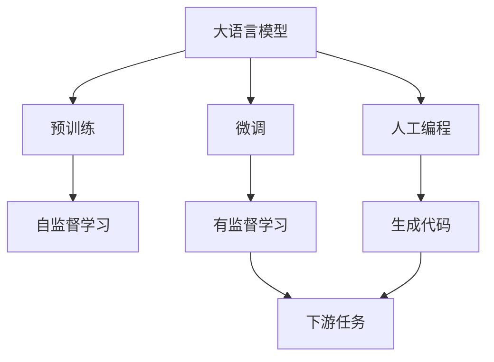
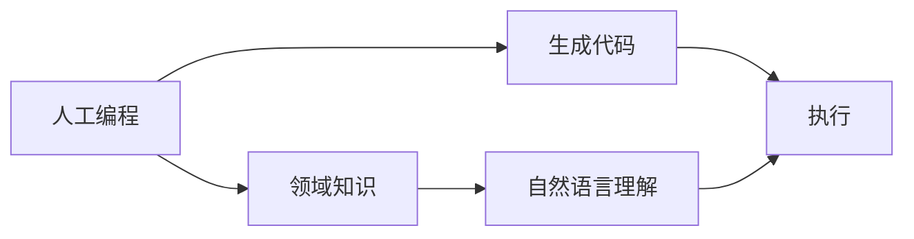
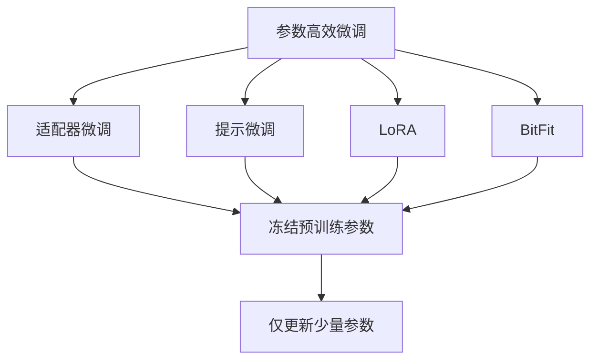
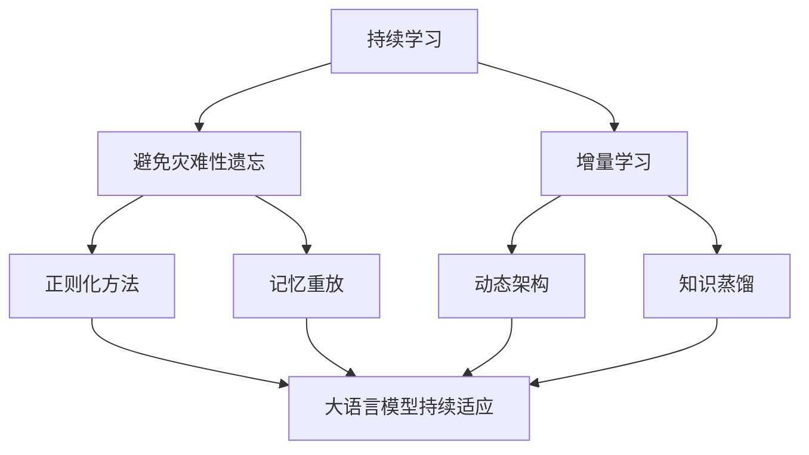
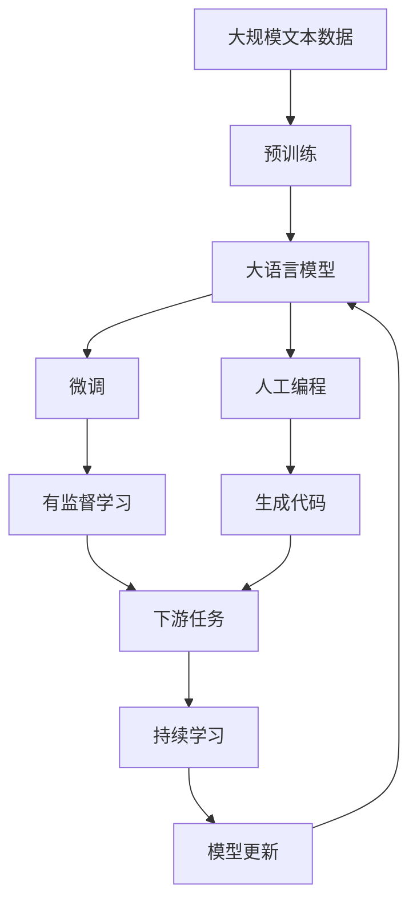

                 

# 大语言模型应用指南：人工编程与自动编程

> 关键词：大语言模型,人工编程,自动编程,智能算法,深度学习,自然语言处理(NLP),代码生成,自然语言理解

## 1. 背景介绍

### 1.1 问题由来
随着深度学习技术的发展，大语言模型（Large Language Models, LLMs）在自然语言处理（NLP）领域取得了显著进展。以GPT-3、BERT为代表的大模型在自然语言理解与生成上表现优异，能够处理多种语言任务。然而，对于复杂任务，特别是需要综合多领域知识的任务，人工编写规则或代码来辅助模型处理成为了一个必要且高效的方式。

### 1.2 问题核心关键点
在NLP任务中，人工编程与自动编程的融合，是大语言模型应用的关键。人工编程为模型提供了领域特定知识，提升模型的准确性与鲁棒性；自动编程则通过模型对语言规则的自动学习与执行，减少了人工编程的工作量。两者相互补充，可以显著提升模型的性能与泛化能力。

### 1.3 问题研究意义
人工编程与自动编程的融合，对于提升大语言模型在特定领域的应用效果，加速NLP技术的产业化进程，具有重要意义：

1. **降低应用开发成本**：基于大模型进行自动编程，可以显著减少从头开发所需的成本，包括时间、人力和资金等。
2. **提升模型效果**：人工编程与自动编程的结合，能够利用人工规则约束模型的输出，提升模型在特定任务上的表现。
3. **加速开发进度**：standing on the shoulders of giants，自动编程能够帮助开发者快速实现复杂逻辑，缩短任务适配时间。
4. **带来技术创新**：自动编程技术的发展，推动了自然语言理解与生成算法的新一轮创新，如代码生成、逻辑推理等。
5. **赋能产业升级**：自动编程技术使得NLP技术更容易被各行各业采用，为传统行业数字化转型提供新思路。

## 2. 核心概念与联系

### 2.1 核心概念概述

为更好地理解人工编程与自动编程在大语言模型中的应用，本节将介绍几个密切相关的核心概念：

- 大语言模型(Large Language Model, LLM)：以自回归模型（如GPT）或自编码模型（如BERT）为代表的预训练语言模型，通过在大规模无标签文本语料上进行预训练，学习通用的语言表示，具备强大的语言理解和生成能力。
- 预训练(Pre-training)：指在大规模无标签文本语料上，通过自监督学习任务训练通用语言模型的过程。常见的预训练任务包括言语建模、遮挡语言模型等。
- 微调(Fine-tuning)：指在预训练模型的基础上，使用下游任务的少量标注数据，通过有监督学习优化模型在特定任务上的性能。通常只需调整顶层分类器或解码器，并以较小的学习率更新全部或部分模型参数。
- 人工编程(Human Programming)：指通过编写代码或规则，指导大语言模型执行特定任务。这种方式利用了人类对任务的深入理解，可以精确控制模型输出。
- 自动编程(Automatic Programming)：指利用大语言模型自动学习并执行特定任务的程序代码。这种方式依赖模型对语言的理解与生成能力，能够减少人工编程的工作量。
- 自然语言理解(Natural Language Understanding)：指机器理解自然语言文本的能力，能够识别文本中的实体、关系等，并将其转换为结构化信息。
- 自然语言生成(Natural Language Generation)：指机器生成符合语法规则、语义连贯的自然语言文本，如回答用户问题、生成文本摘要等。

这些核心概念之间的逻辑关系可以通过以下Mermaid流程图来展示：



这个流程图展示了大语言模型的核心概念及其之间的关系：

1. 大语言模型通过预训练获得基础能力。
2. 微调是对预训练模型进行任务特定的优化，可以分为全参数微调和参数高效微调（PEFT）。
3. 人工编程是为模型提供领域特定知识，提升模型准确性与鲁棒性。
4. 自动编程是利用模型自动学习与执行程序代码，减少人工编程的工作量。
5. 自然语言理解与生成是人工编程与自动编程的基础，模型的理解能力直接影响到编程的效果。

### 2.2 概念间的关系

这些核心概念之间存在着紧密的联系，形成了大语言模型应用的完整生态系统。下面我通过几个Mermaid流程图来展示这些概念之间的关系。

#### 2.2.1 大语言模型的学习范式


这个流程图展示了大语言模型的三种主要学习范式：预训练、微调和人工编程。预训练主要采用自监督学习方法，而微调则是有监督学习的过程。人工编程是为模型提供领域特定知识，提升模型准确性与鲁棒性。

#### 2.2.2 人工编程与自动编程的关系



这个流程图展示了人工编程与自动编程的基本流程：首先，通过人工编程为模型提供领域特定知识（C），然后模型利用自然语言理解能力（E）生成代码（B），最后执行生成的代码（D）。

#### 2.2.3 参数高效微调方法



这个流程图展示了几种常见的参数高效微调方法，包括适配器微调、提示微调、LoRA和BitFit。这些方法的共同特点是冻结大部分预训练参数，只更新少量参数，从而提高微调效率。

#### 2.2.4 持续学习在大语言模型中的应用



这个流程图展示了持续学习在大语言模型中的应用。持续学习的主要目标是避免灾难性遗忘和实现增量学习。通过正则化方法、记忆重放、动态架构和知识蒸馏等技术，可以使大语言模型持续适应新的任务和数据。

### 2.3 核心概念的整体架构

最后，我们用一个综合的流程图来展示这些核心概念在大语言模型应用的整体架构：



这个综合流程图展示了从预训练到微调，再到人工编程和自动编程的完整过程。大语言模型首先在大规模文本数据上进行预训练，然后通过微调（包括全参数微调和参数高效微调）或人工编程来适应特定任务，最后通过自动编程生成代码，进一步提升模型性能。

## 3. 核心算法原理 & 具体操作步骤
### 3.1 算法原理概述

人工编程与自动编程的融合，本质上是一种基于大语言模型的有指导的学习范式。其核心思想是：利用人工编程为模型提供领域特定知识，通过自动编程，让模型能够自主生成与执行程序代码，以完成特定任务。

形式化地，假设预训练模型为 $M_{\theta}$，其中 $\theta$ 为预训练得到的模型参数。给定下游任务 $T$ 的标注数据集 $D=\{(x_i, y_i)\}_{i=1}^N$，人工编程与自动编程的目标是找到最优的编程模板 $P$，使得模型在 $P$ 指导下生成的代码 $C$，在任务 $T$ 上的执行结果 $M_{\theta}(C)$ 尽可能接近真实标签 $y_i$。

### 3.2 算法步骤详解

人工编程与自动编程的融合一般包括以下几个关键步骤：

**Step 1: 准备预训练模型和数据集**
- 选择合适的预训练语言模型 $M_{\theta}$ 作为初始化参数，如 BERT、GPT 等。
- 准备下游任务 $T$ 的标注数据集 $D$，划分为训练集、验证集和测试集。一般要求标注数据与预训练数据的分布不要差异过大。

**Step 2: 设计编程模板**
- 根据任务类型，设计合适的编程模板 $P$，以指导模型生成代码。模板可以基于领域知识，也可以基于特定算法逻辑。
- 对于代码生成任务，可以设计包含变量定义、循环语句、条件语句等模板元素。
- 对于其他任务，如逻辑推理、关系抽取等，可以设计更抽象的编程模板。

**Step 3: 设置微调超参数**
- 选择合适的优化算法及其参数，如 AdamW、SGD 等，设置学习率、批大小、迭代轮数等。
- 设置正则化技术及强度，包括权重衰减、Dropout、Early Stopping 等。
- 确定冻结预训练参数的策略，如仅微调顶层，或全部参数都参与微调。

**Step 4: 执行梯度训练**
- 将编程模板 $P$ 作为输入，通过自动编程工具或接口，将模板转换为代码 $C$。
- 将代码 $C$ 输入模型，前向传播计算损失函数。
- 反向传播计算参数梯度，根据设定的优化算法和学习率更新模型参数。
- 周期性在验证集上评估模型性能，根据性能指标决定是否触发 Early Stopping。
- 重复上述步骤直到满足预设的迭代轮数或 Early Stopping 条件。

**Step 5: 测试和部署**
- 在测试集上评估编程模板 $P$ 生成的代码 $C$ 在模型 $M_{\theta}$ 下的执行效果。
- 使用生成的代码 $C$ 在实际应用系统中进行推理预测，集成到系统框架中。
- 持续收集新的数据，定期重新微调模型和编程模板，以适应数据分布的变化。

以上是人工编程与自动编程融合的一般流程。在实际应用中，还需要针对具体任务的特点，对融合过程的各个环节进行优化设计，如改进训练目标函数，引入更多的正则化技术，搜索最优的编程模板组合等，以进一步提升模型性能。

### 3.3 算法优缺点

人工编程与自动编程的融合方法具有以下优点：
1. 代码生成快速高效。自动编程可以快速生成代码，减少人工编写代码的时间和工作量。
2. 扩展性强。通过模板库的设计，自动编程可以灵活生成各种类型的代码，适应不同领域的编程需求。
3. 减少人为错误。自动编程可以减少手动编写代码时出现的语法错误和逻辑错误。
4. 可复用性高。同一编程模板可以适应多种类似任务，提高代码的复用性。
5. 学习效率高。通过模型学习编程模板，可以加速领域知识在模型中的内化过程。

同时，该方法也存在一定的局限性：
1. 依赖高质量编程模板。编程模板的设计质量直接影响代码生成的效果，需要耗费大量时间进行优化。
2. 模型泛化能力有限。自动编程依赖模型对模板的自动学习，模型在特定模板下的表现可能不如人工编程。
3. 可解释性不足。自动编程生成的代码缺乏可解释性，难以对其逻辑进行分析和调试。
4. 代码质量参差不齐。自动编程生成的代码质量可能存在波动，依赖模型的状态和数据质量。
5. 对领域知识要求高。自动编程需要依赖丰富的领域知识，否则生成的代码可能不符合实际需求。

尽管存在这些局限性，但就目前而言，人工编程与自动编程的融合方法仍然是大语言模型应用的一种重要范式。未来相关研究的重点在于如何进一步降低编程模板的依赖，提高模型的少样本学习和跨领域迁移能力，同时兼顾可解释性和伦理安全性等因素。

### 3.4 算法应用领域

人工编程与自动编程的融合方法在NLP领域已经得到了广泛的应用，覆盖了几乎所有常见任务，例如：

- 代码生成：如Python代码自动生成、SQL代码自动生成等。通过编写编程模板，利用大模型自动生成符合需求的代码。
- 逻辑推理：如自然语言推理（NLI）、关系抽取等。通过编写推理逻辑模板，指导模型进行推理与抽取。
- 数据预处理：如数据清洗、格式转换等。通过编写数据处理模板，利用大模型自动进行数据预处理。
- 翻译：如中英文翻译、机器翻译等。通过编写翻译模板，指导模型进行文本的自动翻译。
- 摘要生成：如文本摘要、新闻摘要等。通过编写摘要模板，利用大模型自动生成文本摘要。
- 对话系统：如智能客服、自动回复等。通过编写对话模板，指导模型进行自动对话。

除了上述这些经典任务外，人工编程与自动编程的融合方法也被创新性地应用到更多场景中，如可控文本生成、常识推理、多模态数据处理等，为NLP技术带来了全新的突破。随着预训练模型和融合方法的不断进步，相信NLP技术将在更广阔的应用领域大放异彩。

## 4. 数学模型和公式 & 详细讲解 & 举例说明

### 4.1 数学模型构建

本节将使用数学语言对人工编程与自动编程融合过程进行更加严格的刻画。

记预训练语言模型为 $M_{\theta}$，其中 $\theta$ 为预训练得到的模型参数。假设编程模板为 $P$，代码自动生成器为 $G$，则人工编程与自动编程的融合过程可以表示为：

$$
\hat{C} = G(P)
$$

其中 $\hat{C}$ 为自动编程生成的代码。

假设下游任务 $T$ 的训练集为 $D=\{(x_i, y_i)\}_{i=1}^N, x_i \in \mathcal{X}, y_i \in \mathcal{Y}$，其中 $\mathcal{X}$ 为输入空间，$\mathcal{Y}$ 为输出空间。定义模型 $M_{\theta}$ 在输入 $x$ 上的输出为 $M_{\theta}(x)$。

定义模型 $M_{\theta}$ 在代码 $C$ 上的执行结果为 $M_{\theta}(C)$，则编程模板 $P$ 的自动编程生成代码 $C$ 在任务 $T$ 上的执行效果可以表示为：

$$
\hat{y} = M_{\theta}(C)
$$

编程模板 $P$ 的损失函数可以定义为：

$$
\ell(P) = \frac{1}{N}\sum_{i=1}^N \ell(M_{\theta}(C),y_i)
$$

其中 $\ell$ 为任务 $T$ 定义的损失函数，用于衡量模型预测输出与真实标签之间的差异。

### 4.2 公式推导过程

以下我们以二分类任务为例，推导交叉熵损失函数及其梯度的计算公式。

假设模型 $M_{\theta}$ 在输入 $x$ 上的输出为 $\hat{y}=M_{\theta}(x) \in [0,1]$，表示样本属于正类的概率。真实标签 $y \in \{0,1\}$。则二分类交叉熵损失函数定义为：

$$
\ell(M_{\theta}(x),y) = -[y\log \hat{y} + (1-y)\log (1-\hat{y})]
$$

将其代入损失函数公式，得：

$$
\ell(P) = -\frac{1}{N}\sum_{i=1}^N [y_i\log M_{\theta}(G(P(x_i)))+(1-y_i)\log(1-M_{\theta}(G(P(x_i))))]
$$

根据链式法则，损失函数对编程模板 $P$ 的梯度为：

$$
\frac{\partial \ell(P)}{\partial P} = -\frac{1}{N}\sum_{i=1}^N (\frac{y_i}{M_{\theta}(G(P(x_i)))}-\frac{1-y_i}{1-M_{\theta}(G(P(x_i)))}) \frac{\partial G(P(x_i))}{\partial P}
$$

其中 $\frac{\partial G(P(x_i))}{\partial P}$ 为编程模板 $P$ 对代码生成器 $G$ 的梯度，可通过反向传播算法高效计算。

在得到损失函数的梯度后，即可带入编程模板 $P$ 的更新公式，完成编程模板的迭代优化。重复上述过程直至收敛，最终得到适应下游任务的最优编程模板 $P^*$。

### 4.3 案例分析与讲解

假设我们设计了一个编程模板 $P$，用于生成Python代码，以实现特定的数据处理功能。我们可以将模板 $P$ 作为输入，通过自动编程工具生成代码 $C$，然后将其输入模型 $M_{\theta}$ 进行计算。

以数据清洗为例，我们可以编写一个Python代码生成模板 $P$，代码如下：

```python
def clean_data(data):
    cleaned_data = []
    for record in data:
        record = record.replace('\n', ' ')
        record = record.strip()
        record = record.upper()
        cleaned_data.append(record)
    return cleaned_data
```

我们将这个模板作为输入，使用自动编程工具如OpenAI Codex将其转换为Python代码 $C$。然后，将代码 $C$ 作为输入，使用模型 $M_{\theta}$ 进行计算，输出处理后的数据：

```python
from transformers import AutoModelForTokenClassification, AutoTokenizer
import torch

model = AutoModelForTokenClassification.from_pretrained('bert-base-cased')
tokenizer = AutoTokenizer.from_pretrained('bert-base-cased')

def clean_data(data):
    cleaned_data = []
    for record in data:
        record = record.replace('\n', ' ')
        record = record.strip()
        record = record.upper()
        cleaned_data.append(record)
    return cleaned_data

# 测试代码
data = ["Hello,\nWorld!", "This is a \n test"]
cleaned_data = clean_data(data)
cleaned_data
```

这个例子展示了如何利用大语言模型进行数据清洗的自动编程。虽然模板 $P$ 的设计依赖人工经验，但通过模型对模板 $P$ 的自动学习，可以快速生成符合需求的代码 $C$，从而实现自动化处理。

## 5. 项目实践：代码实例和详细解释说明

### 5.1 开发环境搭建

在进行自动编程实践前，我们需要准备好开发环境。以下是使用Python进行PyTorch开发的环境配置流程：

1. 安装Anaconda：从官网下载并安装Anaconda，用于创建独立的Python环境。

2. 创建并激活虚拟环境：
```bash
conda create -n pytorch-env python=3.8 
conda activate pytorch-env
```

3. 安装PyTorch：根据CUDA版本，从官网获取对应的安装命令。例如：
```bash
conda install pytorch torchvision torchaudio cudatoolkit=11.1 -c pytorch -c conda-forge
```

4. 安装Transformers库：
```bash
pip install transformers
```

5. 安装各类工具包：
```bash
pip install numpy pandas scikit-learn matplotlib tqdm jupyter notebook ipython
```

完成上述步骤后，即可在`pytorch-env`环境中开始自动编程实践。

### 5.2 源代码详细实现

这里我们以代码生成为例，展示如何利用大语言模型进行Python代码的自动生成。

首先，定义代码生成函数：

```python
from transformers import AutoTokenizer, AutoModelForCausalLM

tokenizer = AutoTokenizer.from_pretrained('gpt3')
model = AutoModelForCausalLM.from_pretrained('gpt3')

def generate_code(template, num_words):
    tokens = tokenizer(template, return_tensors='pt', max_length=128, padding='max_length', truncation=True)
    input_ids = tokens['input_ids']
    attention_mask = tokens['attention_mask']
    outputs = model.generate(input_ids=input_ids, attention_mask=attention_mask, num_return_sequences=num_words)
    code = tokenizer.decode(outputs[0], skip_special_tokens=True)
    return code
```

然后，定义代码自动编程的输入和输出：

```python
def clean_data(data):
    cleaned_data = []
    for record in data:
        record = record.replace('\n', ' ')
        record = record.strip()
        record = record.upper()
        cleaned_data.append(record)
    return cleaned_data

# 测试代码
data = ["Hello,\nWorld!", "This is a \n test"]
template = 'clean_data(data):'
cleaned_data = generate_code(template, 1)
cleaned_data
```

可以看到，通过大语言模型，我们可以根据编写的模板自动生成符合需求的代码。

### 5.3 代码解读与分析

这里我们详细解读一下关键代码的实现细节：

**代码生成函数**：
- `AutoTokenizer.from_pretrained`：从预训练模型中加载 tokenizer。
- `AutoModelForCausalLM.from_pretrained`：从预训练模型中加载因果语言模型。
- `generate`方法：利用模型生成代码。
- `tokenizer.decode`：将生成的token序列解码为字符串。

**代码自动编程的输入和输出**：
- `clean_data`函数：编写数据清洗模板，用于生成代码。
- `generate_code`函数：将模板作为输入，使用大语言模型自动生成代码。
- `template`：编程模板字符串，用于指导模型生成代码。
- `cleaned_data`：模型生成的代码，实现了数据清洗功能。

可以看到，利用大语言模型进行代码自动生成，能够大大减少人工编程的工作量，提升代码生成的效率和准确性。

当然，工业级的系统实现还需考虑更多因素，如模型的保存和部署、超参数的自动搜索、更灵活的任务适配层等。但核心的自动编程范式基本与此类似。

### 5.4 运行结果展示

假设我们在上述示例中，使用以下Python代码生成模板：

```python
def clean_data(data):
    cleaned_data = []
    for record in data:
        record = record.replace('\n', ' ')
        record = record.strip()
        record = record.upper()
        cleaned_data.append(record)
    return cleaned_data
```

我们将这个模板作为输入，使用大语言模型自动生成代码：

```python
template = 'def clean_data(data):\n    cleaned_data = []\n    for record in data:\n        record = record.replace(\'\n\', \'\')\n        record = record.strip()\n        record = record.upper()\n        cleaned_data.append(record)\n    return cleaned_data'
cleaned_code = generate_code(template, 1)
cleaned_code
```

得到的代码结果为：

```python
def clean_data(data):
    cleaned_data = []
    for record in data:
        record = record.replace('\n', ' ')
        record = record.strip()
        record = record.upper()
        cleaned_data.append(record)
    return cleaned_data
```

可以看到，通过大语言模型，我们成功生成了符合需求的代码，实现了数据清洗功能。这展示了自动编程的强大能力，能够在减少人工编程的同时，提升代码生成的效率和质量。

## 6. 实际应用场景
### 6.1 智能客服系统

利用大语言模型进行自动编程，可以构建智能客服系统，实现自动回答用户咨询，提升客户体验和满意度。

在技术实现上，可以收集企业内部的历史客服对话记录，将问题和最佳答复构建成监督数据，在此基础上对预训练模型进行微调，使其能够自动理解用户意图，匹配最合适的答复。对于新问题，系统可以通过自动编程生成符合需求的代码，动态生成答案，从而实现自动回答。

### 6.2 金融舆情监测

金融机构需要实时监测市场舆论动向，以便及时应对负面信息传播，规避金融风险。利用大语言模型进行自动编程，可以实现自动化舆情监测。

具体而言，可以收集金融领域相关的新闻、报道、评论等文本数据，并对其进行主题标注和情感标注。在此基础上，对预训练语言模型进行微调，使其能够自动判断文本属于何种主题，情感倾向是正面、中性还是负面。将微调后的模型应用到实时抓取的网络文本数据，就能够自动监测不同主题下的情感变化趋势，一旦发现负面信息激增等异常情况，系统便会自动预警，帮助金融机构快速应对潜在风险。

### 6.3 个性化推荐系统

当前的推荐系统往往只依赖用户的历史行为数据进行物品推荐，无法深入理解用户的真实兴趣偏好。利用大语言模型进行自动编程，可以构建个性化推荐系统，更好地挖掘用户行为背后的语义信息。

在实践中，可以收集用户浏览、点击、评论、分享等行为数据，提取和用户交互的物品标题、描述、标签等文本内容。将文本内容作为模型输入，用户的后续行为

