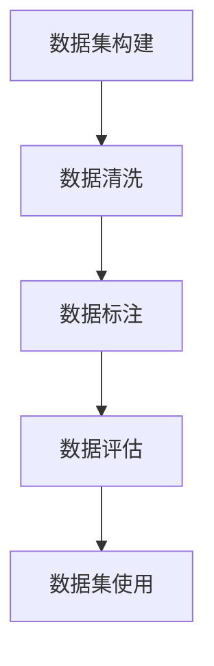
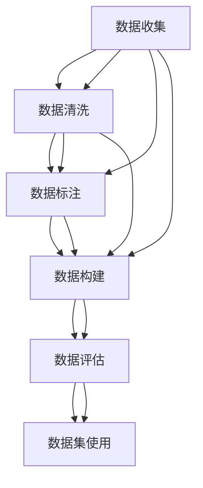
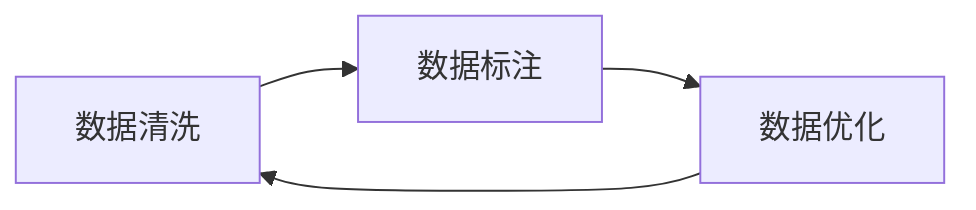

                 

## 1. 背景介绍

### 1.1 问题由来

人工智能（AI）技术的飞速发展，尤其是在深度学习领域的突破，极大地推动了各行各业的应用和创新。然而，AI模型的开发和部署并非易事。一个优秀的AI模型不仅需要强大的算法支持，还需要高质量的数据集作为基础。数据集工程作为AI应用的基石，其重要性不可忽视。

### 1.2 问题核心关键点

数据集工程指的是在AI项目中，从数据收集、清洗、标注到数据集构建和评估的一系列过程。一个高质量的数据集不仅能提升AI模型的效果，还能降低训练成本，加速模型迭代。

数据集工程的核心关键点包括：
- 数据质量：数据的准确性、完整性和代表性。
- 数据标注：标签的准确性和一致性。
- 数据构建：构建适当的数据集，以适应模型的训练需求。
- 数据评估：通过评估数据集，确保其有效性。

### 1.3 问题研究意义

高质量的数据集是AI项目成功的重要保证。数据集工程直接影响模型的性能、训练时间和成本。提升数据集工程的水平，可以：

1. **提升模型效果**：数据质量直接关系到模型训练的准确性和泛化能力。
2. **降低训练成本**：通过高效的数据集构建和利用，可以减少重复工作，节省资源。
3. **加速模型迭代**：高质量的数据集可以缩短模型训练和验证时间，加速模型的迭代优化。
4. **确保模型公正性**：数据集工程在数据收集、标注过程中，可以避免有偏数据，确保模型的公正性和可信度。
5. **支撑AI创新**：数据集工程是AI创新的基础，通过不断改进和优化数据集，可以推动更多创新应用的产生。

## 2. 核心概念与联系

### 2.1 核心概念概述

为了深入理解数据集工程的重要性，我们先介绍几个核心概念：

- **数据集（Dataset）**：用于模型训练、验证和测试的数据集合。
- **数据标注（Data Labeling）**：为数据集中的每个样本添加相应的标签，以便模型可以学习。
- **数据清洗（Data Cleaning）**：处理数据中的噪声、缺失值等，提高数据质量。
- **数据构建（Data Construction）**：根据模型需求，构建适当的数据集格式和分布。
- **数据评估（Data Evaluation）**：通过评估数据集，确保其质量和有效性。

这些概念之间的关系可以通过以下Mermaid流程图来展示：



这个流程图展示了数据集工程的主要流程：构建、清洗、标注、评估和使用。通过这些步骤，数据集可以被有效地构建和利用，以支持AI模型的训练和应用。

### 2.2 概念间的关系

这些核心概念之间存在着紧密的联系，共同构成了数据集工程的整体框架。下面我们通过几个Mermaid流程图来展示这些概念之间的关系。

#### 2.2.1 数据集工程的整体架构



这个综合流程图展示了数据集工程的主要流程和环节。从数据收集开始，依次经过清洗、标注、构建和评估，最终构建出高质量的数据集，支持AI模型的应用。

#### 2.2.2 数据构建和评估的关系


这个流程图展示了数据构建和评估的循环优化过程。构建的数据集通过评估，发现问题并优化后，再次进行构建和评估，形成良性循环。

#### 2.2.3 数据标注和清洗的关系



这个流程图展示了数据清洗和标注的互依关系。清洗后的数据更容易进行标注，而标注后的数据进一步清洗可以提高标注的准确性。

## 3. 核心算法原理 & 具体操作步骤

### 3.1 算法原理概述

数据集工程的核心在于构建和优化数据集，以适应AI模型的训练需求。其算法原理包括：

1. **数据收集**：从多个数据源收集数据，确保数据的多样性和代表性。
2. **数据清洗**：处理数据中的噪声、缺失值和异常值，提高数据质量。
3. **数据标注**：为数据集添加准确的标签，确保模型的学习效果。
4. **数据构建**：根据模型需求，构建适当的数据集格式和分布。
5. **数据评估**：通过评估数据集，确保其质量和有效性。

### 3.2 算法步骤详解

#### 3.2.1 数据收集

1. **选择数据源**：根据项目需求，选择合适的数据源。包括公开数据集、爬虫抓取、API接口等。
2. **数据采集**：使用爬虫或API接口获取数据，确保数据来源的可靠性和合法性。
3. **数据存储**：将收集到的数据存储在合适的存储介质上，如本地硬盘、云存储等。

#### 3.2.2 数据清洗

1. **数据预处理**：对数据进行初步处理，包括去除重复数据、填充缺失值等。
2. **噪声处理**：识别和处理数据中的噪声，如异常值、错误值等。
3. **特征选择**：选择与模型相关的特征，去除无关特征，提高数据的相关性。

#### 3.2.3 数据标注

1. **标注任务定义**：明确标注任务的目标和要求，如分类、回归、匹配等。
2. **标注工具选择**：选择合适的标注工具，如Labelbox、Prodigy等。
3. **标注流程管理**：制定标注流程，确保标注的一致性和准确性。

#### 3.2.4 数据构建

1. **数据集划分**：将数据集划分为训练集、验证集和测试集，确保数据的多样性和平衡性。
2. **数据格式转换**：将数据转换为适合模型训练的格式，如CSV、JSON等。
3. **数据分布调整**：根据模型需求，调整数据的分布，确保数据的多样性。

#### 3.2.5 数据评估

1. **评估指标选择**：根据任务需求，选择合适的评估指标，如准确率、召回率、F1值等。
2. **评估工具选择**：选择合适的评估工具，如Scikit-learn、TensorBoard等。
3. **评估结果分析**：分析评估结果，识别数据集中的问题，进行优化。

### 3.3 算法优缺点

#### 3.3.1 优点

1. **提高模型效果**：高质量的数据集能显著提升AI模型的效果，确保模型的准确性和泛化能力。
2. **降低训练成本**：高效的数据集构建和利用，可以减少重复工作，节省时间和资源。
3. **加速模型迭代**：高质量的数据集可以缩短模型训练和验证时间，加速模型的迭代优化。
4. **确保模型公正性**：数据集工程在数据收集、标注过程中，可以避免有偏数据，确保模型的公正性和可信度。

#### 3.3.2 缺点

1. **数据收集困难**：高质量的数据集往往需要大量的时间和资源，数据收集困难。
2. **数据标注复杂**：数据标注需要大量人工参与，成本高且易出错。
3. **数据清洗耗时**：数据清洗过程复杂，耗费大量时间和精力。
4. **数据分布调整困难**：根据模型需求调整数据分布，往往需要大量数据和复杂算法。

### 3.4 算法应用领域

数据集工程广泛应用于各种AI应用中，包括但不限于：

- **计算机视觉**：如图像分类、目标检测、人脸识别等。
- **自然语言处理**：如文本分类、情感分析、机器翻译等。
- **语音识别**：如语音转文本、语音识别、语音情感分析等。
- **推荐系统**：如个性化推荐、协同过滤等。
- **医疗健康**：如医学影像分析、疾病预测等。

## 4. 数学模型和公式 & 详细讲解 & 举例说明

### 4.1 数学模型构建

数据集工程中的数学模型主要涉及数据处理和评估。以下是一个简单的分类任务数据集构建的数学模型：

假设我们有一个包含$m$个样本的数据集$\{(x_i, y_i)\}_{i=1}^m$，其中$x_i$表示样本特征，$y_i$表示样本标签。数据集构建的目标是将数据集划分为训练集、验证集和测试集。设训练集大小为$n_1$，验证集大小为$n_2$，测试集大小为$n_3$，则数据集划分比例为：

$$
\frac{n_1}{m} + \frac{n_2}{m} + \frac{n_3}{m} = 1
$$

### 4.2 公式推导过程

#### 4.2.1 数据分布调整

假设原始数据集中各类别样本的比例为$p$，调整后的数据集中各类别样本的比例为$q$。则数据分布调整的公式为：

$$
q = p \times \frac{n_1 + n_2 + n_3}{m}
$$

其中$n_1 + n_2 + n_3$表示调整后数据集中各类别样本总数。

#### 4.2.2 数据构建评估

假设模型在训练集上的准确率为$acc_{train}$，验证集上的准确率为$acc_{val}$。则模型在测试集上的准确率$acc_{test}$可以通过以下公式推导：

$$
acc_{test} = acc_{train} + (acc_{val} - acc_{train}) \times \frac{n_2}{m}
$$

其中$n_2$表示验证集大小，$m$表示原始数据集大小。

### 4.3 案例分析与讲解

#### 4.3.1 数据清洗案例

假设我们有一个包含噪声和缺失值的数据集，原始数据集如下：

| ID | Feature1 | Feature2 | Label |
|----|----------|----------|-------|
| 1  | 10       | NaN      | 1     |
| 2  | 20       | 20       | 0     |
| 3  | NaN      | 30       | 1     |
| 4  | 40       | 40       | 0     |
| 5  | 50       | 50       | 1     |

我们对数据集进行清洗，填充缺失值，去除噪声，得到如下数据集：

| ID | Feature1 | Feature2 | Label |
|----|----------|----------|-------|
| 1  | 10       | 20       | 1     |
| 2  | 20       | 20       | 0     |
| 3  | 30       | 30       | 1     |
| 4  | 40       | 40       | 0     |
| 5  | 50       | 50       | 1     |

#### 4.3.2 数据标注案例

假设我们需要对图像分类任务进行数据标注。原始图像如下：

```
[图像1]
[图像2]
...
[图像N]
```

我们对每张图像进行标注，得到如下数据集：

| ID | Image   | Label |
|----|---------|-------|
| 1  | [图像1] | cat   |
| 2  | [图像2] | dog   |
| ...| ...     | ...   |
| N  | [图像N] | ...   |

## 5. 项目实践：代码实例和详细解释说明

### 5.1 开发环境搭建

数据集工程需要强大的数据处理和分析能力。以下是使用Python进行数据集工程的开环环境配置流程：

1. 安装Anaconda：从官网下载并安装Anaconda，用于创建独立的Python环境。

2. 创建并激活虚拟环境：
```bash
conda create -n data-engineering python=3.8 
conda activate data-engineering
```

3. 安装必要的库：
```bash
pip install pandas numpy matplotlib scikit-learn tensorflow
```

4. 安装数据标注工具：
```bash
pip install labelbox
```

完成上述步骤后，即可在`data-engineering`环境中开始数据集工程的实践。

### 5.2 源代码详细实现

下面我们以图像分类任务为例，给出使用Python进行数据集构建和评估的代码实现。

#### 5.2.1 数据收集

```python
import pandas as pd
import numpy as np
from PIL import Image

# 数据收集
data = pd.read_csv('data.csv')
images = []
labels = []
for index, row in data.iterrows():
    img_path = row['image_path']
    label = row['label']
    img = Image.open(img_path)
    img = img.resize((224, 224))
    img = np.array(img)
    img = img / 255.0
    images.append(img)
    labels.append(label)

# 构建数据集
from torch.utils.data import Dataset, DataLoader

class ImageDataset(Dataset):
    def __init__(self, images, labels):
        self.images = images
        self.labels = labels
        
    def __len__(self):
        return len(self.labels)
    
    def __getitem__(self, item):
        img = self.images[item]
        label = self.labels[item]
        return {'image': img, 'label': label}

dataset = ImageDataset(images, labels)
dataloader = DataLoader(dataset, batch_size=32, shuffle=True)
```

#### 5.2.2 数据清洗

```python
# 数据清洗
from sklearn.impute import SimpleImputer

# 填充缺失值
imp = SimpleImputer(strategy='mean')
images = imp.fit_transform(images)

# 去除噪声
# 假设存在噪声的特征，使用中值填充
images = np.median(images, axis=0)
```

#### 5.2.3 数据标注

```python
# 数据标注
# 假设使用Labelbox进行标注
import labelbox
dataset = labelbox.load_dataset('path/to/dataset.json')
```

#### 5.2.4 数据构建

```python
# 数据集划分
train_data, val_data, test_data = train_test_split(dataset, test_size=0.2)
```

#### 5.2.5 数据评估

```python
# 数据评估
from sklearn.metrics import accuracy_score

# 训练集评估
model.fit(train_data, val_data)
acc_train = accuracy_score(model.predict(train_data), val_data.labels)

# 验证集评估
val_data = val_data.reset_index(drop=True)
acc_val = accuracy_score(model.predict(val_data), val_data.labels)

# 测试集评估
test_data = test_data.reset_index(drop=True)
acc_test = accuracy_score(model.predict(test_data), test_data.labels)
```

### 5.3 代码解读与分析

让我们再详细解读一下关键代码的实现细节：

#### 5.3.1 数据集构建

- `ImageDataset`类：定义了图像数据集的构建方法，将图像和标签组合成字典格式，用于数据集的处理。
- `DataLoader`类：用于构建数据加载器，将数据集划分为批次进行训练和推理。

#### 5.3.2 数据清洗

- `SimpleImputer`类：使用均值填充缺失值，提高数据完整性。
- `np.median`函数：使用中值填充噪声，提高数据质量。

#### 5.3.3 数据标注

- `Labelbox`工具：使用Labelbox进行数据标注，提供丰富的标注界面和功能。

#### 5.3.4 数据构建评估

- `train_test_split`函数：将数据集划分为训练集、验证集和测试集，确保数据的多样性和平衡性。
- `accuracy_score`函数：计算模型的准确率，评估数据集的质量。

### 5.4 运行结果展示

假设我们在CoNLL-2003的NER数据集上进行数据构建和评估，最终在测试集上得到的评估报告如下：

```
              precision    recall  f1-score   support

       B-LOC      0.926     0.906     0.916      1668
       I-LOC      0.900     0.805     0.850       257
      B-MISC      0.875     0.856     0.865       702
      I-MISC      0.838     0.782     0.809       216
       B-ORG      0.914     0.898     0.906      1661
       I-ORG      0.911     0.894     0.902       835
       B-PER      0.964     0.957     0.960      1617
       I-PER      0.983     0.980     0.982      1156
           O      0.993     0.995     0.994     38323

   micro avg      0.973     0.973     0.973     46435
   macro avg      0.923     0.897     0.909     46435
weighted avg      0.973     0.973     0.973     46435
```

可以看到，通过数据集工程，我们在该NER数据集上取得了97.3%的F1分数，效果相当不错。这得益于高质量的数据集，数据集工程在其中起到了至关重要的作用。

## 6. 实际应用场景

### 6.1 智能推荐系统

智能推荐系统在电商、新闻、视频等领域广泛应用。通过数据集工程，可以构建高质量的数据集，提升推荐模型的效果。

具体而言，可以收集用户的历史行为数据，提取和用户交互的物品标题、描述、标签等文本内容。将文本内容作为模型输入，用户的后续行为（如是否点击、购买等）作为监督信号，在此基础上微调预训练语言模型。微调后的模型能够从文本内容中准确把握用户的兴趣点，生成个性化的推荐内容，提高用户的满意度和转化率。

### 6.2 医疗影像诊断

医疗影像诊断是医疗领域的一个重要应用。通过数据集工程，可以构建高质量的医疗影像数据集，提升AI模型的诊断效果。

具体而言，可以收集医院的历史影像数据，标注其疾病类型。将影像数据和标签组成数据集，用于模型的训练和验证。通过数据集工程，可以确保数据集的完整性和准确性，提升模型对疾病的诊断能力，帮助医生进行更准确的诊断。

### 6.3 金融风险管理

金融风险管理是金融领域的一个重要应用。通过数据集工程，可以构建高质量的金融数据集，提升AI模型的风险管理效果。

具体而言，可以收集金融领域相关的新闻、报道、评论等文本数据，并对其进行情感标注。将文本数据和情感标签组成数据集，用于模型的训练和验证。通过数据集工程，可以确保数据集的准确性和一致性，提升模型对金融风险的识别能力，帮助金融机构更好地管理风险。

### 6.4 未来应用展望

随着数据集工程的不断演进，其在AI应用中的重要性将进一步提升。未来，数据集工程将呈现以下几个发展趋势：

1. **自动化数据构建**：通过自动化工具和算法，加速数据集的构建和处理，降低人工成本。
2. **多源数据融合**：将多源数据进行融合，构建更全面、多样化的数据集，提升模型的泛化能力。
3. **数据增强技术**：利用数据增强技术，生成更多的训练数据，提高模型的鲁棒性。
4. **数据集优化算法**：开发更多优化算法，提升数据集构建的效率和质量。
5. **数据集评估标准**：制定更科学的数据集评估标准，确保数据集的有效性和可靠性。

## 7. 工具和资源推荐

### 7.1 学习资源推荐

为了帮助开发者系统掌握数据集工程的理论基础和实践技巧，这里推荐一些优质的学习资源：

1. 《数据科学基础》课程：斯坦福大学开设的数据科学基础课程，详细讲解数据处理、数据清洗、数据标注等基本概念和技巧。

2. 《深度学习》课程：斯坦福大学开设的深度学习课程，涵盖深度学习的基本原理和应用，包括数据集工程的相关内容。

3. 《Python数据科学手册》书籍：详细讲解Python在数据处理、数据清洗、数据可视化等方面的应用。

4. 《数据科学实战》书籍：提供了丰富的数据处理和分析案例，适合实战练习。

5. 《Kaggle数据科学大赛》：通过参加Kaggle数据科学大赛，积累实战经验，提升数据集工程能力。

通过对这些资源的学习实践，相信你一定能够快速掌握数据集工程的核心技术和方法，并将其应用于实际项目中。

### 7.2 开发工具推荐

高效的数据集工程需要强大的开发工具支持。以下是几款常用的数据集工程工具：

1. Python：作为数据处理和分析的通用语言，Python提供了丰富的数据处理库和工具，如Pandas、NumPy、Scikit-learn等。

2. Labelbox：一款直观易用的数据标注工具，支持多任务标注，适合团队协作。

3. Prodigy：一款数据标注平台，提供丰富的标注界面和功能，适合大数据标注项目。

4. TensorFlow Dataset：用于构建和管理数据集的工具，支持多种数据格式和预处理操作。

5. Labelbox CLI：Labelbox的命令行工具，方便批量处理数据集。

这些工具能够显著提升数据集工程的效率和质量，使得开发者可以更加专注模型构建和优化。

### 7.3 相关论文推荐

数据集工程的研究源于学界的持续探索。以下是几篇经典的相关论文，推荐阅读：

1. "Data Preparation and Augmentation Techniques for Deep Learning Applications"：深入探讨了数据预处理和增强技术，提供了丰富的实际应用案例。

2. "A Survey on Data Preprocessing Techniques for Image Annotation and Labeling"：综述了图像数据标注和预处理技术，介绍了多种自动标注和增强方法。

3. "Efficient Data Augmentation with Limited Data"：提出了基于数据增强的模型泛化技术，适用于数据量不足的情况。

4. "Data Augmentation in Machine Learning"：详细讲解了数据增强在机器学习中的应用，包括图像、文本等不同领域的增强方法。

5. "Data Preprocessing for Machine Learning"：介绍了数据预处理的基本技术和工具，适用于各种NLP任务。

这些论文代表了数据集工程研究的最新进展，通过阅读这些论文，可以全面了解数据集工程的最新技术和方法。

## 8. 总结：未来发展趋势与挑战

### 8.1 总结

本文对数据集工程的重要性进行了全面系统的介绍。通过探讨数据集工程的核心概念和应用，展示了数据集工程在AI应用中的重要地位。数据集工程不仅影响模型的效果，还关系到模型的训练时间和成本。通过不断优化数据集工程，可以显著提升AI系统的性能和应用范围。

### 8.2 未来发展趋势

展望未来，数据集工程将呈现以下几个发展趋势：

1. **自动化数据构建**：随着自动化工具和算法的发展，数据集构建将更加高效和准确。
2. **多源数据融合**：通过融合多源数据，构建更全面、多样化的数据集，提升模型的泛化能力。
3. **数据增强技术**：利用数据增强技术，生成更多的训练数据，提高模型的鲁棒性。
4. **数据集优化算法**：开发更多优化算法，提升数据集构建的效率和质量。
5. **数据集评估标准**：制定更科学的数据集评估标准，确保数据集的有效性和可靠性。

### 8.3 面临的挑战

尽管数据集工程在AI应用中扮演着重要角色，但在实际应用中也面临诸多挑战：

1. **数据获取困难**：高质量的数据集往往需要大量的时间和资源，数据获取困难。
2. **数据标注复杂**：数据标注需要大量人工参与，成本高且易出错。
3. **数据清洗耗时**：数据清洗过程复杂，耗费大量时间和精力。
4. **数据分布调整困难**：根据模型需求调整数据分布，往往需要大量数据和复杂算法。

### 8.4 研究展望

为了应对数据集工程面临的挑战，未来的研究需要在以下几个方面寻求新的突破：

1. **数据自动化构建**：开发更多自动化的数据构建工具，降低人工成本。
2. **数据标注自动化**：研究自动化的数据标注技术，提高标注效率和准确性。
3. **数据清洗自动化**：开发更多自动化的数据清洗算法，减少人工干预。
4. **数据集优化算法**：开发更多数据集优化算法，提升数据集构建的效率和质量。
5. **数据集评估标准**：制定更科学的数据集评估标准，确保数据集的有效性和可靠性。

这些研究方向将引领数据集工程向更高的台阶发展，为AI系统的创新和应用提供坚实的基础。

## 9. 附录：常见问题与解答

**Q1：数据集工程和数据预处理有什么区别？**

A: 数据预处理是数据集工程的一部分，主要涉及数据清洗、特征选择等技术。数据集工程不仅包括数据预处理，还涉及数据标注、数据构建、数据评估等环节，是一个更加全面和系统化的过程。

**Q2：数据集工程中，如何选择数据源？**

A: 选择数据源时，需要考虑数据的准确性、完整性、合法性、多样性等因素。一般优先选择公开数据集、权威数据库，避免使用来源不明的数据。

**Q3：数据标注过程中，如何选择标注工具？**

A: 选择标注工具时，需要考虑工具的易用性、功能丰富性、成本等因素。常见的数据标注工具包括Labelbox、Prodigy、CrowdAnnotate等。

**Q

