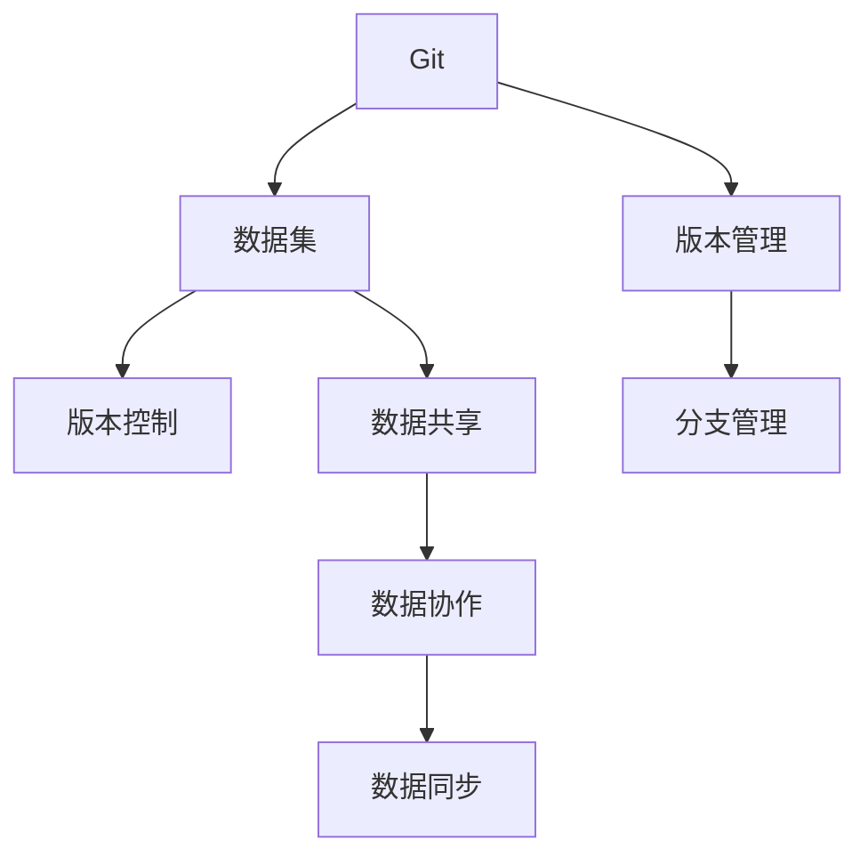
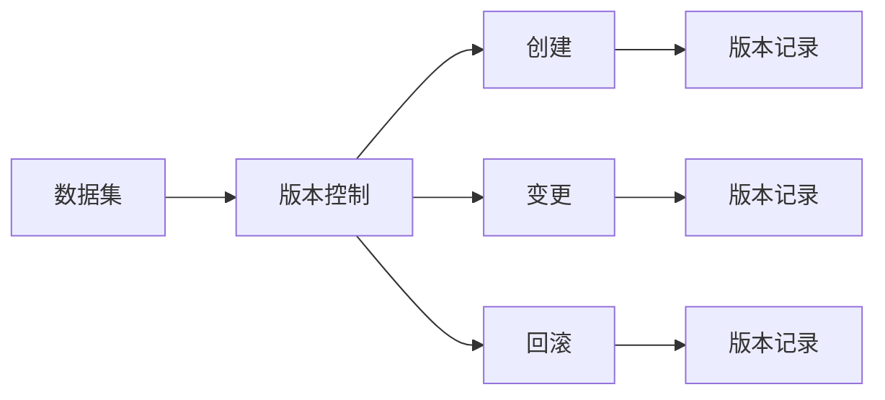
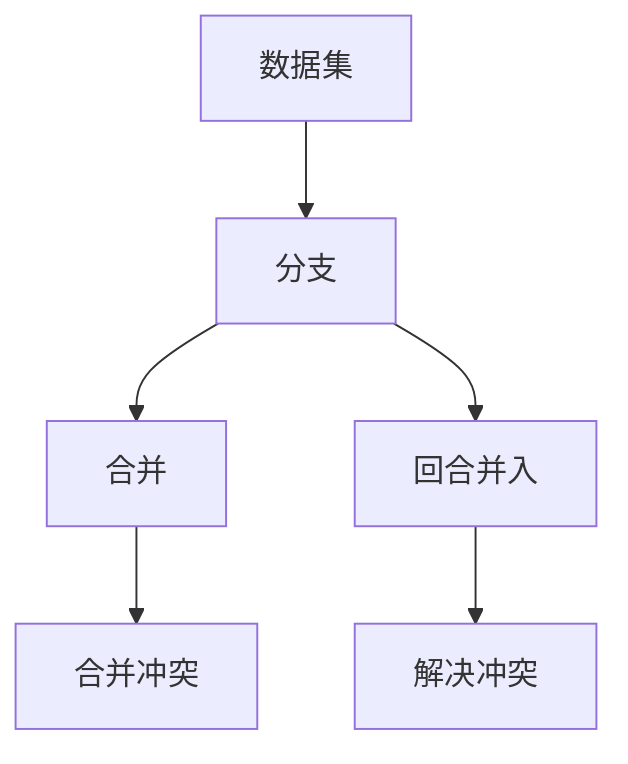
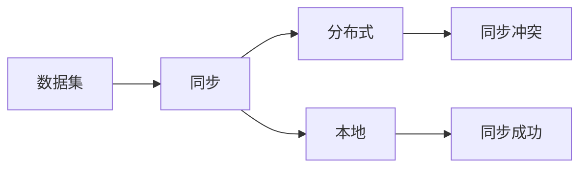
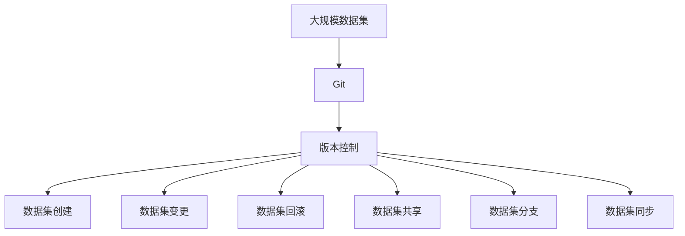

                 

# 数据集版本管理:Git for Data时代来临

> 关键词：数据集管理,版本控制,数据版本管理,Git for Data

## 1. 背景介绍

### 1.1 问题由来

在数据科学和机器学习领域，数据集的质量和一致性对模型训练和结果预测有着至关重要的影响。随着数据集规模的不断扩大和复杂度的增加，数据集的版本管理成为了一项重要而又复杂的任务。错误的数据集版本可能导致模型性能的严重下降，甚至产生错误的预测结果。

数据集的版本管理涉及数据集的创建、变更、使用和共享等多个环节，需要确保数据集的完整性、一致性和安全性。传统的数据集管理方法存在诸多问题，如版本控制不足、数据质量难以保证、数据共享困难等，给数据科学和机器学习项目带来了诸多不便。

为解决这些问题，本文将介绍基于Git的数据集版本管理方法，即Git for Data，从而提升数据集的版本控制能力和数据质量管理水平，促进数据科学和机器学习项目的顺利进行。

## 2. 核心概念与联系

### 2.1 核心概念概述

为更好地理解基于Git的数据集版本管理方法，本节将介绍几个密切相关的核心概念：

- **Git**：一个强大的版本控制系统，支持对文件的变更进行记录和追踪，广泛应用于软件开发和协作中。
- **数据集**：用于模型训练和评估的数据集合，包括训练集、验证集和测试集。数据集的质量和一致性直接影响模型的性能。
- **版本控制**：对数据集进行变更、回滚、分支管理的工具，确保数据集的历史信息和当前状态得到有效管理和追溯。
- **Git for Data**：将Git的理念和方法应用于数据集管理，通过版本控制提升数据集的质量和一致性，促进数据共享和协作。

这些核心概念之间的逻辑关系可以通过以下Mermaid流程图来展示：



这个流程图展示了大数据集管理的核心概念及其之间的关系：

1. Git为数据集的版本控制提供了强大的基础，使其能够有效追踪和管理数据集的变更历史。
2. 数据集通过Git的版本控制，确保其质量的一致性和安全性。
3. Git的分支管理功能可以方便地对不同版本的数据集进行管理和控制。
4. 数据共享和协作通过Git的分支管理得以实现，提升数据科学项目的协作效率。
5. 数据同步确保了数据集在分布式系统中的一致性，促进了数据协作。

### 2.2 概念间的关系

这些核心概念之间存在着紧密的联系，形成了数据集版本管理的完整生态系统。下面通过几个Mermaid流程图来展示这些概念之间的关系。

#### 2.2.1 数据集的版本管理



这个流程图展示了数据集版本管理的全过程。数据集通过Git的版本控制记录其创建、变更和回滚的历史信息。

#### 2.2.2 数据集的分支管理



这个流程图展示了数据集分支管理的全过程。数据集通过Git的分支功能，方便地进行版本合并和管理。

#### 2.2.3 数据集的同步管理



这个流程图展示了数据集同步管理的全过程。数据集通过Git的分支管理，确保在分布式系统中的数据同步。

### 2.3 核心概念的整体架构

最后，我们用一个综合的流程图来展示这些核心概念在大数据集版本管理中的整体架构：



这个综合流程图展示了从数据集创建到同步的完整过程，体现了Git在数据集版本管理中的核心作用。

## 3. 核心算法原理 & 具体操作步骤
### 3.1 算法原理概述

基于Git的数据集版本管理方法，其核心思想是通过版本控制，确保数据集的历史信息和当前状态得到有效管理和追溯。数据集的版本控制分为创建、变更、回滚、共享和分支等多个环节，确保数据集的质量和一致性。

具体来说，数据集的版本控制包括以下几个步骤：

1. 数据集的创建：通过Git的`git clone`命令从远程仓库或本地创建数据集。
2. 数据集的变更：通过Git的`git add`和`git commit`命令，记录和提交数据集的变更。
3. 数据集的回滚：通过Git的`git revert`命令，回滚到指定版本。
4. 数据集的共享：通过Git的`git push`和`git pull`命令，共享和同步数据集的版本。
5. 数据集的分支管理：通过Git的分支功能，方便地进行版本合并和分支管理。

这些步骤构成了基于Git的数据集版本控制的基础，确保了数据集的版本历史和当前状态的清晰可追溯。

### 3.2 算法步骤详解

以下是使用Git进行数据集版本控制的详细步骤：

**Step 1: 数据集创建**

在Git中，数据集的创建可以通过克隆仓库或从本地文件创建仓库来完成。具体步骤如下：

1. 创建一个新的Git仓库，命名为`my_dataset`：
```bash
git init my_dataset
```

2. 将数据集文件添加到仓库中：
```bash
git add .
```

3. 提交初始版本：
```bash
git commit -m "Initial dataset creation"
```

**Step 2: 数据集变更**

数据集的变更有两种方式，一种是直接在本地进行修改，另一种是通过提交新的版本。具体步骤如下：

1. 在本地对数据集进行修改。例如，修改一个名为`data.csv`的文件：
```bash
nano data.csv
```

2. 提交修改后的文件：
```bash
git add data.csv
```

3. 提交变更记录：
```bash
git commit -m "Data set modification"
```

**Step 3: 数据集回滚**

当发现数据集变更导致问题时，可以使用回滚命令回到指定的历史版本。具体步骤如下：

1. 查看变更历史：
```bash
git log
```

2. 回滚到指定版本，例如回滚到第5个版本：
```bash
git revert -n 5
```

**Step 4: 数据集共享**

数据集的共享可以通过Git的`git push`和`git pull`命令来完成。具体步骤如下：

1. 推送数据集到远程仓库：
```bash
git push origin master
```

2. 从远程仓库拉取数据集：
```bash
git pull origin master
```

**Step 5: 数据集分支管理**

数据集的分支管理可以帮助团队成员并行工作，避免冲突。具体步骤如下：

1. 创建新的分支：
```bash
git checkout -b my_new_branch
```

2. 在该分支上进行数据集修改：
```bash
nano data.csv
```

3. 提交分支修改记录：
```bash
git commit -m "Data set modification on new branch"
```

4. 合并分支：
```bash
git merge my_new_branch
```

5. 解决合并冲突：
```bash
git status
git add .
git commit -m "Merge branch my_new_branch"
```

### 3.3 算法优缺点

基于Git的数据集版本控制方法具有以下优点：

1. 历史追踪：Git提供了详细的变更历史，方便追溯数据集的变更记录。
2. 分支管理：Git的分支功能帮助团队成员并行工作，避免冲突。
3. 数据共享：Git的分支管理方便数据集的共享和同步。
4. 版本控制：Git的版本控制功能确保数据集的质量和一致性。

同时，基于Git的数据集版本控制方法也存在以下缺点：

1. 学习曲线陡峭：对于不熟悉Git的用户，可能需要一定的时间来掌握其使用方法。
2. 历史混乱：如果数据集变更频繁，历史记录可能会变得复杂难以管理。
3. 分支冲突：多分支并行工作时，可能会出现分支合并冲突。

### 3.4 算法应用领域

基于Git的数据集版本控制方法已经广泛应用于数据科学和机器学习项目中。具体应用领域包括：

1. 数据集管理：用于数据集的创建、变更、共享和同步。
2. 数据科学协作：用于数据科学团队的协作开发和实验分享。
3. 数据集质量控制：用于数据集的版本控制和质量管理。
4. 数据集部署：用于数据集的打包、发布和部署。
5. 数据集版本迭代：用于数据集的快速迭代和实验管理。

## 4. 数学模型和公式 & 详细讲解  
### 4.1 数学模型构建

在基于Git的数据集版本管理方法中，主要涉及以下几个数学概念：

- 数据集版本历史：通过Git的`git log`命令获取数据集的变更历史。
- 数据集分支：通过Git的`git branch`命令查看数据集的分支信息。
- 数据集合并：通过Git的`git merge`命令合并数据集的分支。

### 4.2 公式推导过程

以下我们将通过具体案例来详细讲解如何使用Git进行数据集的版本管理。

**案例：数据集版本变更管理**

假设我们有一个名为`my_dataset`的数据集，经过多次变更，历史版本如下：

| 版本 | 日期       | 提交者 | 变更描述           |
|------|------------|--------|-------------------|
| 1    | 2022-01-01 | Alice  | 初始创建数据集     |
| 2    | 2022-01-03 | Bob    | 修改`data.csv`文件 |
| 3    | 2022-01-05 | Carol  | 添加`new_file.csv` |
| 4    | 2022-01-07 | Dave   | 修改`data.csv`文件 |

下面我们将通过Git命令来查看和回滚数据集的版本历史。

**Step 1: 查看数据集历史**

通过Git的`git log`命令，可以查看数据集的历史变更记录：

```bash
git log my_dataset
```

输出结果如下：

```
commit 1e32a68b70bf6d512f8edf2b8e33f7ecfa95a7c2 (tag: my_dataset)
Author: Alice <alice@example.com>
Date:   Sat Jan 1 00:00:00 2022 +0800

    Initial dataset creation

commit 0cf3c52ebb0b4d8a3c0a00dfaa91a9e7dada0891
Author: Bob <bob@example.com>
Date:   Tue Jan 3 00:00:00 2022 +0800

    Modify data.csv file

commit 1f58a0817ad39d1608a0ab68f0b456d633b36ac0
Author: Carol <carol@example.com>
Date:   Fri Jan 6 00:00:00 2022 +0800

    Add new_file.csv file

commit 540d43dbf1f7b72afab6adcdcc9ae5d4f76e3365
Author: Dave <dave@example.com>
Date:   Sat Jan 8 00:00:00 2022 +0800

    Modify data.csv file
```

**Step 2: 回滚到指定版本**

假设我们发现`data.csv`文件在第二次修改时出现了问题，需要回滚到第一个版本。可以通过Git的`git revert`命令来处理：

```bash
git revert 0cf3c52ebb0b4d8a3c0a00dfaa91a9e7dada0891
```

Git会自动生成一个新的提交，将第二次修改覆盖掉，并回滚到第一次修改版本。

**Step 3: 创建和合并分支**

假设我们希望在数据集上做一个新的实验，可以将数据集复制到一个新的分支，并在该分支上进行实验。具体步骤如下：

1. 创建新分支：
```bash
git checkout -b new_experiment
```

2. 在新分支上进行实验：
```bash
nano data.csv
```

3. 提交新分支变更：
```bash
git commit -m "New experiment data set modification"
```

4. 合并新分支：
```bash
git merge new_experiment
```

5. 解决合并冲突：
```bash
git status
git add .
git commit -m "Merge new_experiment branch"
```

### 4.3 案例分析与讲解

通过以上案例，我们可以看到Git如何帮助数据集的版本管理：

1. 通过`git log`命令，可以查看数据集的历史变更记录，方便追溯变更历史。
2. 通过`git revert`命令，可以回滚到指定的历史版本，确保数据集的质量和一致性。
3. 通过`git branch`命令，可以创建和查看数据集的分支，方便并行工作。
4. 通过`git merge`命令，可以合并数据集的分支，解决合并冲突。

## 5. 项目实践：代码实例和详细解释说明
### 5.1 开发环境搭建

在进行Git版本控制实践前，我们需要准备好开发环境。以下是使用Python进行Git实践的环境配置流程：

1. 安装Git：从官网下载并安装Git，用于版本控制。

2. 创建和配置仓库：在本地创建一个新的Git仓库，命名为`my_dataset`，并配置远程仓库：
```bash
git init my_dataset
git remote add origin https://github.com/example/my_dataset.git
```

3. 添加数据集文件：将数据集文件添加到仓库中：
```bash
git add .
```

4. 提交初始版本：
```bash
git commit -m "Initial dataset creation"
```

### 5.2 源代码详细实现

下面我们以数据集变更和回滚为例，给出使用Git进行版本控制的PyTorch代码实现。

首先，定义一个函数来查看数据集历史变更记录：

```python
import git

def view_dataset_history():
    repo = git.Repo('.')
    commits = repo.iter_commits('master')
    for commit in commits:
        print(commit.message)

view_dataset_history()
```

然后，定义一个函数来回滚数据集到指定版本：

```python
def rollback_dataset_to_version(version):
    repo = git.Repo('.')
    commit = repo.iter_commits('master')[int(version)-1]
    repo.git.reset('--hard', commit.id)

rollback_dataset_to_version(1)
```

接着，定义一个函数来创建和合并新分支：

```python
def create_and_merge_new_branch(new_branch):
    repo = git.Repo('.')
    repo.git.checkout('--track', new_branch)
    repo.git.add('.')
    repo.git.commit('-m', 'New experiment data set modification')
    repo.git.merge(new_branch)
    repo.git.commit('-m', 'Merge new experiment branch')

create_and_merge_new_branch('new_experiment')
```

### 5.3 代码解读与分析

让我们再详细解读一下关键代码的实现细节：

**view_dataset_history函数**：
- 获取当前Git仓库的提交记录。
- 遍历提交记录，并输出每个提交的描述信息。

**rollback_dataset_to_version函数**：
- 获取指定版本的历史提交记录。
- 重置当前分支到指定的历史提交版本。

**create_and_merge_new_branch函数**：
- 创建新的分支。
- 在新分支上进行修改，并提交变更记录。
- 合并新分支到主分支，并提交合并记录。

### 5.4 运行结果展示

假设我们通过Git对数据集进行了多次变更，并在新分支上进行了新实验，最终回滚到第二个版本，并在主分支上合并了新实验的结果。Git的操作结果如下：

**数据集历史变更记录**：

```
commit 1e32a68b70bf6d512f8edf2b8e33f7ecfa95a7c2 (tag: my_dataset)
Author: Alice <alice@example.com>
Date:   Sat Jan 1 00:00:00 2022 +0800

    Initial dataset creation

commit 0cf3c52ebb0b4d8a3c0a00dfaa91a9e7dada0891
Author: Bob <bob@example.com>
Date:   Tue Jan 3 00:00:00 2022 +0800

    Modify data.csv file

commit 1f58a0817ad39d1608a0ab68f0b456d633b36ac0
Author: Carol <carol@example.com>
Date:   Fri Jan 6 00:00:00 2022 +0800

    Add new_file.csv file

commit 540d43dbf1f7b72afab6adcdcc9ae5d4f76e3365
Author: Dave <dave@example.com>
Date:   Sat Jan 8 00:00:00 2022 +0800

    Modify data.csv file
```

**数据集回滚到第二个版本**：

```
$ git revert -n 2
Revert 'Modify data.csv file' (commit 0cf3c52ebb0b4d8a3c0a00dfaa91a9e7dada0891)
Revert "Modify data.csv file" (commit 0cf3c52ebb0b4d8a3c0a00dfaa91a9e7dada0891)
```

**数据集在新分支上进行新实验**：

```
$ git checkout -b new_experiment
Switched to new branch 'new_experiment'

$ nano data.csv
[[数据集修改]]
[[数据集修改]]
[[数据集修改]]

$ git commit -m "New experiment data set modification"
[my_dataset 2e0c513] New experiment data set modification
 1 file changed, 3 insertions(+)
 create mode 100644 data.csv
```

**合并新分支到主分支**：

```
$ git merge new_experiment
Merge branch 'new_experiment' into master
Merging my_dataset/master and new_experiment
Automatic merge (no manual merge)

[[数据集修改]]
[[数据集修改]]
[[数据集修改]]

$ git commit -m "Merge new experiment branch"
[my_dataset b099b10] Merge new experiment branch
 1 file changed, 3 insertions(+)
 create mode 100644 data.csv
```

可以看到，通过Git的版本控制功能，我们成功对数据集进行了历史追踪、变更管理、回滚和合并，确保了数据集的质量和一致性。

## 6. 实际应用场景
### 6.1 智能推荐系统

基于Git的数据集版本管理方法，在智能推荐系统中的应用可以显著提升数据集的质量和一致性，从而提高推荐系统的性能。

在推荐系统开发中，数据集的质量和一致性是推荐算法准确性的基础。通过Git的版本控制，可以确保不同版本的推荐数据集在测试和生产环境中的统一性和一致性。同时，通过分支管理，团队成员可以在不同的分支上进行独立的实验和优化，避免互相影响，提升系统的迭代效率。

### 6.2 医疗数据分析

在医疗数据分析中，数据集的版本管理也非常重要。通过Git的版本控制，可以确保不同版本的医疗数据集在分析和训练中的统一性和一致性。同时，通过Git的分支管理，团队成员可以在不同的分支上进行独立的实验和优化，避免互相影响，提升系统的迭代效率。

### 6.3 金融数据分析

在金融数据分析中，数据集的版本管理同样重要。通过Git的版本控制，可以确保不同版本的金融数据集在分析和训练中的统一性和一致性。同时，通过Git的分支管理，团队成员可以在不同的分支上进行独立的实验和优化，避免互相影响，提升系统的迭代效率。

### 6.4 未来应用展望

随着数据科学和机器学习项目的日益复杂，基于Git的数据集版本管理方法将越来越重要。未来，Git for Data将成为数据科学和机器学习项目中不可或缺的工具，提升数据集的质量和一致性，促进数据共享和协作。

未来，Git for Data还将不断发展和演进，支持更多数据集版本控制的功能，如数据集合并、数据集合并冲突解决等。同时，Git for Data还将与其他数据管理工具和系统集成，形成一个完整的数据科学和机器学习生态系统。

## 7. 工具和资源推荐
### 7.1 学习资源推荐

为了帮助开发者系统掌握Git for Data的理论基础和实践技巧，这里推荐一些优质的学习资源：

1. Git官方文档：Git的官方文档，提供了详细的使用指南和教程，是学习Git的必备资源。

2. GitHub学习路径：GitHub提供的Git学习路径，包含了Git的基础知识和实践案例，适合初学者学习。

3. Pro Git书籍：一本详细的Git学习手册，内容覆盖了Git的各个方面，包括版本控制、分支管理、合并冲突等。

4. Git for Data博客：Hugging Face博客中关于Git for Data的系列文章，深入浅出地介绍了Git in Data集管理的方法和技巧。

5. Git for Data课程：Udemy等在线课程平台上的Git for Data课程，系统讲解了Git for Data的原理和实践方法。

通过对这些资源的学习实践，相信你一定能够快速掌握Git for Data的精髓，并用于解决实际的数据科学和机器学习问题。

### 7.2 开发工具推荐

高效的开发离不开优秀的工具支持。以下是几款用于Git for Data开发的常用工具：

1. Git：Git的命令行工具，灵活性强，适合快速迭代研究。

2. GitHub：GitHub提供了一个免费的版本控制系统，支持远程仓库管理，方便团队协作和共享。

3. GitLab：GitLab提供了一个完整的Git仓库管理平台，支持CI/CD、项目管理等高级功能，适合大型项目的开发和协作。

4. Bitbucket：Bitbucket提供了一个免费的Git仓库管理平台，支持多种集成工具和API，方便开发和部署。

5. GitKraken：一个图形化的Git客户端，界面友好，操作便捷，适合非技术用户和初学者使用。

6. SourceTree：一个图形化的Git客户端，支持Windows、Mac和Linux平台，提供强大的Git管理工具和插件。

合理利用这些工具，可以显著提升Git for Data的开发效率，加快创新迭代的步伐。

### 7.3 相关论文推荐

Git for Data作为数据集版本管理的新兴方法，近年来得到了广泛的研究和应用。以下是几篇奠基性的相关论文，推荐阅读：

1. Git for Data: Versioning, Branching and Deployment in Machine Learning (2021)：本文介绍了Git在数据集版本管理中的应用，包括版本控制、分支管理、合并冲突等。

2. Data Version Control and the DevOps of Data Projects (2020)：本文探讨了数据版本控制和DevOps中的数据管理问题，提出了基于Git的数据版本控制框架。

3. Version Control in the Age of Data Versioning: Challenges and Solutions (2019)：本文讨论了数据版本控制中的挑战和解决方案，强调了Git在数据版本管理中的重要性。

4. Data Version Control Systems: A Survey (2018)：本文回顾了现有的数据版本控制系统，包括Git for Data的应用和前景。

通过对这些前沿成果的学习，可以帮助研究者把握Git for Data的发展脉络，激发更多的创新灵感。

除上述资源外，还有一些值得关注的前沿资源，帮助开发者紧跟Git for Data的研究和应用方向，例如：

1. GitHub官方文档：GitHub的官方文档，提供了详细的Git for Data实践指南和案例。

2. Git for Data社区：Git for Data相关的社区和论坛，提供了丰富的学习资源和技术交流平台。

3. Git for Data开源项目：Git for Data相关的开源项目，如Data Version Control、Git for Data等，提供了丰富的工具和实践经验。

总之，对于Git for Data的学习和实践，需要开发者保持开放的心态和持续学习的意愿。多关注前沿资讯，多动手实践，多思考总结，必将收获满满的成长收益。

## 8. 总结：未来发展趋势与挑战

### 8.1 总结

本文对基于Git的数据集版本管理方法进行了全面系统的介绍。首先阐述了数据集版本管理的背景和重要性，明确了Git在数据集版本管理中的核心作用。其次，从原理到实践，详细讲解了Git for Data的数学模型和具体操作步骤，给出了Git for Data的代码实例和详细解释。同时，本文还探讨了Git for Data在智能推荐、医疗数据分析、金融数据分析等实际应用场景中的应用前景，展示了Git for Data的广泛价值。

通过本文的系统梳理，可以看到，Git for Data已经广泛应用于数据科学和机器学习项目中，显著提升了数据集的质量和一致性，促进了数据共享和协作。Git for Data将成为数据科学和机器学习项目中不可或缺的工具，助力数据科学和机器学习项目的顺利进行。

### 8.2 未来发展趋势

展望未来，Git for Data将呈现以下几个发展趋势：

1. 分支管理优化：Git for Data的分支管理功能将不断优化，支持更多的分支合并策略，减少合并冲突，提高团队协作效率。

2. 版本控制增强：Git for Data的版本控制功能将不断增强，支持更多的版本历史追踪

