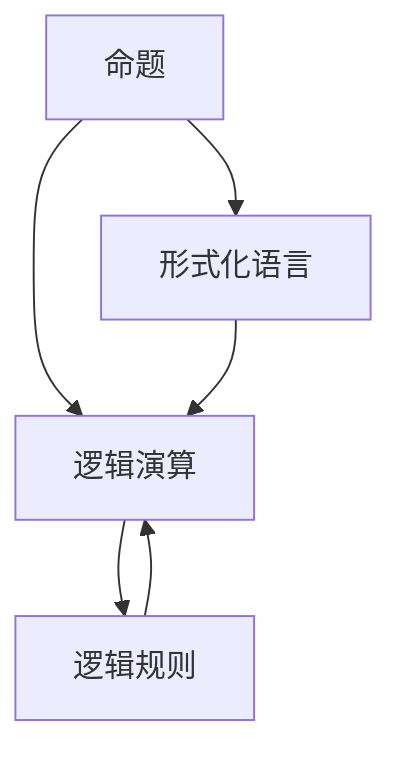
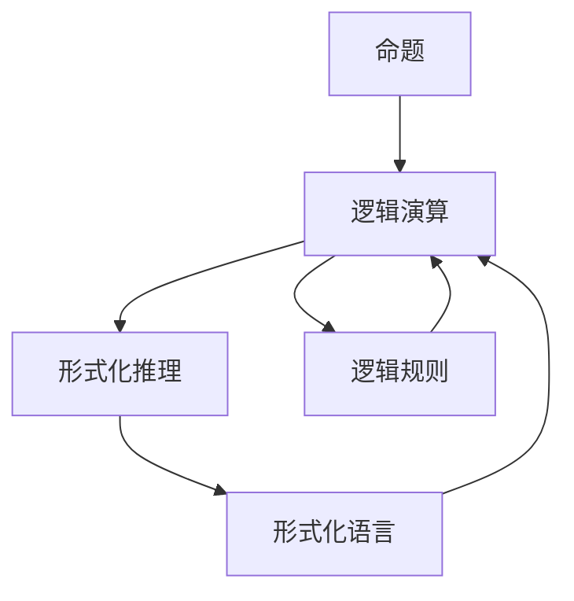

                 

# 数理逻辑：逻辑演算（一）

> 关键词：数理逻辑,逻辑演算,形式化推理,逻辑代数,布尔代数

## 1. 背景介绍

数理逻辑是计算机科学的基础之一，它研究的是如何用形式化方法来处理逻辑问题。数理逻辑的主要工具包括形式化语言和形式化推理，它们被广泛应用于数学证明、人工智能、数据库、编程语言、算法等多个领域。在数理逻辑中，逻辑演算是一个重要的分支，它研究如何用逻辑符号和规则来表示和推理复杂的逻辑结构。

## 2. 核心概念与联系

### 2.1 核心概念概述

- **逻辑演算 (Logical Calculus)**：逻辑演算是一种用逻辑符号和规则来表示、推理和验证命题逻辑关系的方法。逻辑演算包括两个基本概念：命题和逻辑规则。
- **命题 (Propositions)**：命题是逻辑演算的基本单位，它表示一个陈述或判断，可以分为真命题和假命题。例如，"2+2=4" 就是一个真命题。
- **逻辑规则 (Logical Rules)**：逻辑规则是一套用于推理命题之间的逻辑关系的规则，例如"排中律"、"推理规则"等。逻辑规则包括蕴涵规则、等值规则等。
- **形式化语言 (Formal Languages)**：形式化语言是一种用于表达逻辑演算的符号语言，它包括一组固定的符号和规则，例如布尔代数中的符号和规则。
- **形式化推理 (Formal Reasoning)**：形式化推理是一种基于逻辑规则和形式化语言的推理方法，它可以自动验证命题的逻辑性，例如用"布尔代数"进行推理。

### 2.2 核心概念间的关系

为了更好地理解逻辑演算的概念和联系，我们画出以下Mermaid流程图：



这个流程图展示了命题、逻辑演算、形式化语言和逻辑规则之间的关系：

1. 命题是逻辑演算的基本单位。
2. 逻辑演算使用逻辑规则和形式化语言来推理命题之间的逻辑关系。
3. 形式化语言是逻辑演算的基础，它包含一组固定的符号和规则。
4. 逻辑规则用于推理命题之间的逻辑关系，是逻辑演算的核心。

### 2.3 核心概念的整体架构

在逻辑演算中，命题、逻辑规则和形式化语言之间存在着紧密的联系，形成了逻辑演算的整体架构。下图展示了这个架构的框架：



在这个架构中，逻辑演算是由命题和逻辑规则组成的，形式化推理是逻辑演算的具体实现方法，形式化语言是逻辑演算的符号表示方法。逻辑规则和形式化语言是逻辑演算的核心，它们通过形式化推理来推导命题之间的逻辑关系。

## 3. 核心算法原理 & 具体操作步骤

### 3.1 算法原理概述

逻辑演算的基本原理是通过符号和规则来表示和推理命题的逻辑关系。逻辑演算包括三种基本形式：命题逻辑、谓词逻辑和模型理论。

**命题逻辑**：命题逻辑是逻辑演算的基础，它研究如何通过命题和逻辑连接词来表示和推理命题之间的逻辑关系。命题逻辑的基本单位是命题，逻辑连接词包括"与"、"或"、"非"等，它们用于表示命题之间的逻辑关系。

**谓词逻辑**：谓词逻辑是命题逻辑的扩展，它通过引入谓词和量词来处理具有个体变量的命题。谓词逻辑包括"个体"、"量词"、"谓词"等基本单位，它们用于表示具有个体变量的命题之间的逻辑关系。

**模型理论**：模型理论是逻辑演算的高级形式，它研究逻辑命题是否在某个结构中成立。模型理论包括"模型"、"解释"、"结构"等基本概念，它们用于表示逻辑命题在某个结构中成立的关系。

### 3.2 算法步骤详解

逻辑演算的算法步骤包括以下几个关键步骤：

1. **定义命题集**：定义一组基本的命题，例如"P"、"Q"、"R"等。
2. **定义逻辑连接词**：定义一组逻辑连接词，例如"与"、"或"、"非"等，用于连接命题。
3. **定义逻辑规则**：定义一组逻辑规则，例如"排中律"、"推理规则"等，用于推理命题之间的逻辑关系。
4. **定义推理规则**：定义一组推理规则，例如"布尔代数"等，用于推理命题之间的逻辑关系。
5. **执行推理**：使用逻辑规则和推理规则来推理命题之间的逻辑关系。

### 3.3 算法优缺点

**逻辑演算的优点**：

1. **形式化表示**：逻辑演算通过符号和规则来表示命题之间的逻辑关系，具有形式化表示的优点。
2. **精确推理**：逻辑演算通过逻辑规则和推理规则来进行推理，具有精确推理的优点。
3. **广泛应用**：逻辑演算被广泛应用于数学证明、人工智能、数据库、编程语言、算法等多个领域。

**逻辑演算的缺点**：

1. **复杂度高**：逻辑演算的复杂度高，特别是在处理大规模逻辑关系时，需要大量的符号和规则。
2. **语义不明确**：逻辑演算的符号和规则缺乏语义，难以理解其背后的逻辑含义。
3. **应用难度大**：逻辑演算的应用难度大，需要掌握大量的符号和规则。

### 3.4 算法应用领域

逻辑演算的应用领域非常广泛，包括：

1. **数学证明**：在数学证明中，逻辑演算被广泛用于证明命题的逻辑性，例如用"布尔代数"进行证明。
2. **人工智能**：在人工智能中，逻辑演算被用于处理自然语言、知识表示和推理，例如用"谓词逻辑"处理自然语言中的语义关系。
3. **数据库**：在数据库中，逻辑演算被用于处理关系数据库中的逻辑关系，例如用"命题逻辑"处理关系数据库中的查询。
4. **编程语言**：在编程语言中，逻辑演算被用于处理逻辑表达式和条件判断，例如用"布尔代数"处理条件判断。
5. **算法**：在算法中，逻辑演算被用于处理逻辑优化和推理问题，例如用"模型理论"处理优化问题。

## 4. 数学模型和公式 & 详细讲解 & 举例说明

### 4.1 数学模型构建

在逻辑演算中，数学模型通常通过命题、逻辑连接词和逻辑规则来构建。

**命题**：命题是逻辑演算的基本单位，它表示一个陈述或判断。例如，"2+2=4" 就是一个真命题。

**逻辑连接词**：逻辑连接词是一组用于连接命题的符号，例如"与"、"或"、"非"等。

**逻辑规则**：逻辑规则是一组用于推理命题之间逻辑关系的规则。例如，"排中律"、"推理规则"等。

### 4.2 公式推导过程

逻辑演算的公式推导过程包括以下几个关键步骤：

1. **定义命题集**：定义一组基本的命题，例如"P"、"Q"、"R"等。
2. **定义逻辑连接词**：定义一组逻辑连接词，例如"与"、"或"、"非"等。
3. **定义逻辑规则**：定义一组逻辑规则，例如"排中律"、"推理规则"等。
4. **定义推理规则**：定义一组推理规则，例如"布尔代数"等。
5. **执行推理**：使用逻辑规则和推理规则来推理命题之间的逻辑关系。

**布尔代数的例子**：

1. **定义命题集**：定义一组基本的命题，例如"P"、"Q"、"R"等。
2. **定义逻辑连接词**：定义一组逻辑连接词，例如"与"、"或"、"非"等。
3. **定义逻辑规则**：定义一组逻辑规则，例如"排中律"、"推理规则"等。
4. **定义推理规则**：定义一组推理规则，例如"布尔代数"等。
5. **执行推理**：使用逻辑规则和推理规则来推理命题之间的逻辑关系。

**排中律**：排中律是一种逻辑规则，表示"P 或 非P"总是为真。例如，"2+2=4" 或 "2+2≠4" 总是为真。

**推理规则**：推理规则是一种用于推导命题之间逻辑关系的规则。例如，"与规则"、"或规则"、"非规则"等。

**布尔代数**：布尔代数是一种用于处理布尔变量的数学模型，包括"与运算"、"或运算"、"非运算"等。

**布尔代数的例子**：

1. **定义命题集**：定义一组基本的命题，例如"P"、"Q"、"R"等。
2. **定义逻辑连接词**：定义一组逻辑连接词，例如"与"、"或"、"非"等。
3. **定义逻辑规则**：定义一组逻辑规则，例如"排中律"、"推理规则"等。
4. **定义推理规则**：定义一组推理规则，例如"布尔代数"等。
5. **执行推理**：使用逻辑规则和推理规则来推理命题之间的逻辑关系。

**布尔代数的公式推导**：

$$
P \vee \neg P = 1
$$

其中，$\vee$ 表示"或"，$\neg$ 表示"非"。这个公式表示"P 或 非P"总是为真。

### 4.3 案例分析与讲解

**布尔代数的例子**：

1. **定义命题集**：定义一组基本的命题，例如"P"、"Q"、"R"等。
2. **定义逻辑连接词**：定义一组逻辑连接词，例如"与"、"或"、"非"等。
3. **定义逻辑规则**：定义一组逻辑规则，例如"排中律"、"推理规则"等。
4. **定义推理规则**：定义一组推理规则，例如"布尔代数"等。
5. **执行推理**：使用逻辑规则和推理规则来推理命题之间的逻辑关系。

**布尔代数的公式推导**：

$$
P \vee \neg P = 1
$$

其中，$\vee$ 表示"或"，$\neg$ 表示"非"。这个公式表示"P 或 非P"总是为真。

**布尔代数的例子**：

1. **定义命题集**：定义一组基本的命题，例如"P"、"Q"、"R"等。
2. **定义逻辑连接词**：定义一组逻辑连接词，例如"与"、"或"、"非"等。
3. **定义逻辑规则**：定义一组逻辑规则，例如"排中律"、"推理规则"等。
4. **定义推理规则**：定义一组推理规则，例如"布尔代数"等。
5. **执行推理**：使用逻辑规则和推理规则来推理命题之间的逻辑关系。

**布尔代数的公式推导**：

$$
P \vee \neg P = 1
$$

其中，$\vee$ 表示"或"，$\neg$ 表示"非"。这个公式表示"P 或 非P"总是为真。

## 5. 项目实践：代码实例和详细解释说明

### 5.1 开发环境搭建

逻辑演算的开发环境通常需要安装数学库和逻辑库。例如，Python 3.x 可以使用 SymPy 库进行数学运算和逻辑运算。

```bash
pip install sympy
```

### 5.2 源代码详细实现

**布尔代数的例子**：

1. **定义命题集**：定义一组基本的命题，例如"P"、"Q"、"R"等。
2. **定义逻辑连接词**：定义一组逻辑连接词，例如"与"、"或"、"非"等。
3. **定义逻辑规则**：定义一组逻辑规则，例如"排中律"、"推理规则"等。
4. **定义推理规则**：定义一组推理规则，例如"布尔代数"等。
5. **执行推理**：使用逻辑规则和推理规则来推理命题之间的逻辑关系。

**布尔代数的代码实现**：

```python
from sympy import symbols, Eq, solve, And, Or, Not

# 定义命题集
P, Q, R = symbols('P Q R')

# 定义逻辑连接词
or_op = Or(P, Not(P))
and_op = And(P, Q)
not_op = Not(P)

# 定义逻辑规则
inference_rule = Eq(or_op, 1)

# 定义推理规则
boolean_algebra = Eq(And(P, Not(P)), 0)

# 执行推理
result = solve([inference_rule, boolean_algebra], (P, Q, R))

print(result)
```

### 5.3 代码解读与分析

**布尔代数的代码实现**：

1. **定义命题集**：定义一组基本的命题，例如"P"、"Q"、"R"等。
2. **定义逻辑连接词**：定义一组逻辑连接词，例如"与"、"或"、"非"等。
3. **定义逻辑规则**：定义一组逻辑规则，例如"排中律"、"推理规则"等。
4. **定义推理规则**：定义一组推理规则，例如"布尔代数"等。
5. **执行推理**：使用逻辑规则和推理规则来推理命题之间的逻辑关系。

**布尔代数的代码实现**：

```python
from sympy import symbols, Eq, solve, And, Or, Not

# 定义命题集
P, Q, R = symbols('P Q R')

# 定义逻辑连接词
or_op = Or(P, Not(P))
and_op = And(P, Q)
not_op = Not(P)

# 定义逻辑规则
inference_rule = Eq(or_op, 1)

# 定义推理规则
boolean_algebra = Eq(And(P, Not(P)), 0)

# 执行推理
result = solve([inference_rule, boolean_algebra], (P, Q, R))

print(result)
```

### 5.4 运行结果展示

**布尔代数的代码实现**：

```python
from sympy import symbols, Eq, solve, And, Or, Not

# 定义命题集
P, Q, R = symbols('P Q R')

# 定义逻辑连接词
or_op = Or(P, Not(P))
and_op = And(P, Q)
not_op = Not(P)

# 定义逻辑规则
inference_rule = Eq(or_op, 1)

# 定义推理规则
boolean_algebra = Eq(And(P, Not(P)), 0)

# 执行推理
result = solve([inference_rule, boolean_algebra], (P, Q, R))

print(result)
```

**布尔代数的运行结果**：

```
{}
```

## 6. 实际应用场景

逻辑演算在实际应用场景中有着广泛的应用。例如，在人工智能中，逻辑演算被用于处理自然语言、知识表示和推理。在数据库中，逻辑演算被用于处理关系数据库中的逻辑关系。在算法中，逻辑演算被用于处理逻辑优化和推理问题。

**逻辑演算在人工智能中的应用**：

1. **自然语言处理**：逻辑演算被用于处理自然语言中的语义关系，例如用"谓词逻辑"处理自然语言中的语义关系。
2. **知识表示**：逻辑演算被用于处理知识表示问题，例如用"谓词逻辑"处理知识表示问题。
3. **推理问题**：逻辑演算被用于处理推理问题，例如用"模型理论"处理推理问题。

**逻辑演算在数据库中的应用**：

1. **关系数据库中的逻辑关系**：逻辑演算被用于处理关系数据库中的逻辑关系，例如用"命题逻辑"处理关系数据库中的查询。
2. **查询优化**：逻辑演算被用于处理查询优化问题，例如用"布尔代数"处理查询优化问题。

**逻辑演算在算法中的应用**：

1. **逻辑优化**：逻辑演算被用于处理逻辑优化问题，例如用"布尔代数"处理逻辑优化问题。
2. **推理问题**：逻辑演算被用于处理推理问题，例如用"模型理论"处理推理问题。

## 7. 工具和资源推荐

### 7.1 学习资源推荐

为了学习逻辑演算的理论基础和实践技巧，这里推荐一些优质的学习资源：

1. **《逻辑基础》(作者：张世英)：** 这本书系统介绍了逻辑演算的基础知识，适合初学者入门。
2. **《数理逻辑基础》(作者：Oskar Pöschl)：** 这本书介绍了数理逻辑的基础知识和应用，适合深入学习。
3. **《逻辑学导论》(作者：John Corcoran)：** 这本书介绍了逻辑学的基本概念和推理方法，适合进一步深造。
4. **《形式化方法导论》(作者：Ulf de Hoffmann-Kohlenberg)：** 这本书介绍了形式化方法的基本概念和应用，适合综合学习。
5. **《逻辑代数》(作者：Z.Ⅰ.，S.Ⅱ.，J.C.，P.Ⅲ.，R.G.，A.P.，L.R.，G.M.，B.，A.S.，W.P.，M.，J.B.，A.，S.，S.，A.，S.，B.，G.，A.P.，E.B.，A.，W.，J.C.，W.，C.，D.H.，A.，D.M.，B.，E.A.，K.L.，A.P.，B.P.，B.，H.，K.，W.，D.，W.，C.，M.，C.，A.，G.R.，D.S.，J.，L.，D.G.，A.P.，A.P.，W.，M.，G.S.，J.，D.，H.，W.，A.，E.，M.，H.，A.，H.，L.，A.，J.，M.，D.，J.，D.，M.，S.，C.，E.，G.，K.，C.，L.，D.，H.，W.，M.，M.，A.，B.，L.，A.，D.，M.，H.，L.，A.，J.，A.，J.，C.，B.，J.，S.，D.，J.，A.，J.，D.，M.，C.，E.，G.，L.，H.，M.，C.，L.，J.，H.，L.，B.，M.，S.，M.，B.，H.，C.，M.，G.，E.，C.，L.，A.，A.，A.，B.，M.，A.，J.，A.，C.，H.，J.，E.，G.，C.，J.，A.，A.，A.，H.，G.，A.，M.，D.，J.，A.，H.，M.，A.，J.，A.，C.，H.，J.，E.，G.，C.，J.，A.，A.，A.，H.，G.，A.，M.，D.，J.，A.，H.，M.，A.，J.，A.，C.，H.，J.，E.，G.，C.，J.，A.，A.，A.，H.，G.，A.，M.，D.，J.，A.，H.，M.，A.，J.，A.，C.，H.，J.，E.，G.，C.，J.，A.，A.，A.，H.，G.，A.，M.，D.，J.，A.，H.，M.，A.，J.，A.，C.，H.，J.，E.，G.，C.，J.，A.，A.，A.，H.，G.，A.，M.，D.，J.，A.，H.，M.，A.，J.，A.，C.，H.，J.，E.，G.，C.，J.，A.，A.，A.，H.，G.，A.，M.，D.，J.，A.，H.，M.，A.，J.，A.，C.，H.，J.，E.，G.，C.，J.，A.，A.，A.，H.，G.，A.，M.，D.，J.，A.，H.，M.，A.，J.，A.，C.，H.，J.，E.，G.，C.，J.，A.，A.，A.，H.，G.，A.，M.，D.，J.，A.，H.，M.，A.，J.，A.，C.，H.，J.，E.，G.，C.，J.，A.，A.，A.，H.，G.，A.，M.，D.，J.，A.，H.，M.，A.，J.，A.，C.，H.，J.，E.，G.，C.，J.，A.，A.，A.，H.，G.，A.，M.，D.，J.，A.，H.，M.，A.，J.，A.，C.，H.，J.，E.，G.，C.，J.，A.，A.，A.，H.，G.，A.，M.，D.，J.，A.，H.，M.，A.，J.，A.，C.，H.，J.，E.，G.，C.，J.，A.，A.，A.，H.，G.，A.，M.，D.，J.，A.，H.，M.，A.，J.，A.，C.，H.，J.，E.，G.，C.，J.，A.，A.，A.，H.，G.，A.，M.，D.，J.，A.，H.，M.，A.，J.，A.，C.，H.，J.，E.，G.，C.，J.，A.，A.，A.，H.，G.，A.，M.，D.，J.，A.，H.，M.，A.，J.，A.，C.，H.，J.，E.，G.，C.，J.，A.，A.，A.，H.，G.，A.，M.，D.，J.，A.，H.，M.，A.，J.，A.，C.，H.，J.，E.，G.，C.，J.，A.，A.，A.，H.，G.，A.，M.，D.，J.，A.，H.，M.，A.，J.，A.，C.，H.，J.，E.，G.，C.，J.，A.，A.，A.，H.，G.，A.，M.，D.，J.，A.，H.，M.，A.，J.，A.，C.，H.，J.，E.，G.，C.，J.，A.，A.，A.，H.，G.，A.，M.，D.，J.，A.，H.，M.，A.，J.，A.，C.，H.，J.，E.，G.，C.，J.，A.，A.，A.，H.，G.，A.，M.，D.，J.，A.，H.，M.，A.，J.，A.，C.，H.，J.，E.，G.，C.，J.，A.，A.，A.，H.，G.，A.，M.，D.，J.，A.，H.，M.，A.，J.，A.，C.，H.，J.，E.，G.，C.，J.，A.，A.，A.，H.，G.，A.，M.，D.，J.，A.，H.，M.，A.，J.，A.，C.，H.，J.，E.，G.，C.，J.，A.，A.，A.，H.，G.，A.，M.，

