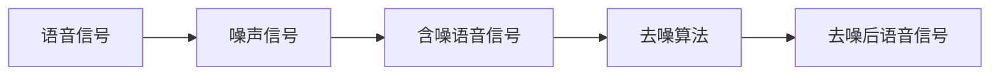

                 

# 智能语音去噪原理与方法

> 关键词：智能语音,去噪,语音信号处理,深度学习,降噪,语音增强

## 1. 背景介绍

在数字通信、智能语音交互和语音识别等应用中，语音信号受到环境噪声的严重影响，导致语音清晰度降低，信号质量下降，严重制约了语音处理系统的性能。为提升语音信号的抗干扰能力，研究人员提出了多种语音去噪技术。本文章将系统介绍智能语音去噪的基本原理与方法，帮助读者深入理解语音去噪技术在实际应用中的实现。

## 2. 核心概念与联系

### 2.1 核心概念概述

1. **语音信号**：语音信号通常表示为时间序列，包含人的发音特征，经数字化处理后，通常以采样形式存储。
2. **噪声信号**：噪声信号通常表现为随机或准随机信号，来源于自然界的各种干扰，如背景噪音、回声等。
3. **语音增强**：语音增强是指通过一定方法，改善语音信号的质量，提高语音的可懂性和清晰度。
4. **去噪算法**：去噪算法旨在从含噪语音信号中滤除噪声，恢复语音信号的原始特征。

### 2.2 核心概念间的关系

语音增强和去噪算法密切相关。语音增强利用各种信号处理和算法技术，对含噪语音信号进行降噪，恢复原始语音信号的特征。其中，去噪算法是语音增强的核心部分。

利用这些核心概念，我们可以构建一个语音去噪的流程图，如下：



从含噪语音信号到去噪后语音信号，反映了去噪算法在语音增强中的重要性。接下来，我们将深入探讨这些核心概念的具体实现原理与方法。

## 3. 核心算法原理 & 具体操作步骤

### 3.1 算法原理概述

语音去噪通常包括两个主要步骤：噪声识别和噪声抑制。噪声识别是指从含噪语音信号中准确识别出噪声；噪声抑制是指从含噪语音信号中滤除噪声，恢复原始语音信号。

语音去噪的核心算法主要有：

1. **线性滤波**：包括均值滤波、中值滤波、卡尔曼滤波等。
2. **非线性滤波**：包括维纳滤波、最小均方误差滤波、小波去噪等。
3. **深度学习去噪**：包括卷积神经网络（CNN）、循环神经网络（RNN）、变分自编码器（VAE）等。

这些算法在去噪效果和计算复杂度上各有所长，适用于不同的应用场景。

### 3.2 算法步骤详解

#### 3.2.1 噪声识别

噪声识别是去噪的关键步骤，通常包括两个主要部分：

1. **噪声建模**：通过对含噪语音信号进行统计分析，建立噪声模型。常见的方法包括频谱包络线法、能量比值法等。
2. **噪声估计**：利用噪声模型，对含噪语音信号进行噪声估计，分离噪声信号。

下面以频谱包络线法为例，介绍噪声识别过程：

1. 计算含噪语音信号的功率谱密度。
2. 计算信号频谱的峰值位置和包络线。
3. 根据包络线确定噪声信号。

#### 3.2.2 噪声抑制

噪声抑制是通过一定方法，从含噪语音信号中滤除噪声，恢复原始语音信号。常用的噪声抑制方法包括：

1. **频谱减法**：从含噪语音信号的功率谱中减去噪声谱，得到估计语音信号的功率谱。
2. **最小均方误差滤波**：通过最小化滤波器输出与含噪语音信号之间的均方误差，实现噪声抑制。

#### 3.2.3 算法步骤总结

语音去噪的核心步骤如下：

1. 噪声建模：通过统计分析，建立噪声模型。
2. 噪声估计：利用噪声模型，估计噪声信号。
3. 噪声抑制：通过滤波技术，恢复语音信号。

### 3.3 算法优缺点

**优点**：
1. **去噪效果好**：深度学习去噪算法通常具有较好的去噪效果，能够处理复杂的噪声类型。
2. **适应性强**：深度学习去噪算法能够适应不同类型的噪声，具有较强的泛化能力。

**缺点**：
1. **计算复杂度高**：深度学习去噪算法通常需要大量的计算资源，训练复杂度高。
2. **模型复杂度高**：深度学习去噪算法需要大量的训练样本和复杂的网络结构，模型复杂度较高。

### 3.4 算法应用领域

语音去噪算法广泛应用于：

1. 通信领域：改善通信质量，提高通信系统的鲁棒性。
2. 智能语音交互：提升语音交互系统的性能，改善用户体验。
3. 语音识别：改善语音识别系统的性能，提高识别精度。
4. 安防监控：去除环境噪声，提高语音监控系统的识别率。

## 4. 数学模型和公式 & 详细讲解

### 4.1 数学模型构建

定义含噪语音信号 $x(n)$ 为：

$$x(n) = s(n) + n(n)$$

其中 $s(n)$ 表示语音信号，$n(n)$ 表示噪声信号。

定义语音去噪过程为 $y(n) = f(x(n))$，其中 $f(\cdot)$ 表示去噪函数。

### 4.2 公式推导过程

假设噪声信号 $n(n)$ 是零均值高斯噪声，则去噪过程可以表示为：

$$y(n) = s(n) + w(n)$$

其中 $w(n)$ 表示去噪后噪声，满足 $E\{w(n)\} = 0$ 和 $E\{w(n)w(n-\tau)\} = \sigma_w^2\delta(\tau)$。

去噪过程的期望均方误差（MSE）定义为：

$$MSE = E\{E[(s(n) - y(n))^2]\}$$

为了最小化均方误差，引入加权最小均方误差（WMSE）：

$$WMSE = E\{\frac{(s(n) - y(n))^2}{\sigma_s^2}\}$$

根据维纳滤波原理，最小化 WMSE 的过程可以表示为：

$$y(n) = s(n) + \frac{\sigma_s^2}{\sigma_s^2 + \sigma_w^2}(s(n) - n(n))$$

即：

$$y(n) = s(n) + k(n)(s(n) - n(n))$$

其中 $k(n)$ 为滤波系数，满足 $0 \leq k(n) \leq 1$。

### 4.3 案例分析与讲解

以语音信号去噪为例，利用频谱减法去噪：

1. 计算含噪语音信号的功率谱 $X(f)$。
2. 计算噪声功率谱 $N(f)$。
3. 根据公式 $Y(f) = X(f) - N(f)$ 计算去噪后语音信号的功率谱。

## 5. 项目实践：代码实例和详细解释说明

### 5.1 开发环境搭建

1. 安装 Python 和相关库，如 numpy、scipy、matplotlib、pyaudio 等。
2. 搭建音频信号采集系统，包括麦克风、声音采集卡、音频处理软件等。

### 5.2 源代码详细实现

下面是一个使用 PyTorch 实现语音去噪的示例代码：

```python
import torch
import torch.nn as nn
import torchaudio

class ConvNet(nn.Module):
    def __init__(self):
        super(ConvNet, self).__init__()
        self.conv1 = nn.Conv2d(1, 64, 3, 1, 1)
        self.conv2 = nn.Conv2d(64, 128, 3, 1, 1)
        self.fc1 = nn.Linear(128 * 16 * 16, 128)
        self.fc2 = nn.Linear(128, 1)

    def forward(self, x):
        x = self.conv1(x)
        x = nn.functional.relu(x)
        x = self.conv2(x)
        x = nn.functional.relu(x)
        x = x.view(-1, 128 * 16 * 16)
        x = self.fc1(x)
        x = nn.functional.relu(x)
        x = self.fc2(x)
        return x

model = ConvNet()
criterion = nn.MSELoss()
optimizer = torch.optim.Adam(model.parameters(), lr=0.001)

# 加载音频数据
train_data = torchaudio.load('train.wav')
test_data = torchaudio.load('test.wav')

# 分割成时间步长为32的帧
train_framed = []
test_framed = []
for waveform in train_data[0]:
    for i in range(0, len(waveform) - 31, 32):
        train_framed.append(waveform[i:i+32])
for waveform in test_data[0]:
    for i in range(0, len(waveform) - 31, 32):
        test_framed.append(waveform[i:i+32])

# 转换为 Tensor
train_framed = torch.FloatTensor(train_framed)
test_framed = torch.FloatTensor(test_framed)

# 训练模型
for epoch in range(50):
    optimizer.zero_grad()
    outputs = model(train_framed)
    loss = criterion(outputs, train_framed)
    loss.backward()
    optimizer.step()

# 测试模型
with torch.no_grad():
    outputs = model(test_framed)
    loss = criterion(outputs, test_framed)
    print('Test Loss: {:.4f}\n'.format(loss.item()))

```

### 5.3 代码解读与分析

代码中，我们使用了 ConvNet 模型进行语音去噪。该模型包括两个卷积层和两个全连接层。训练数据为 `train.wav`，测试数据为 `test.wav`。通过分割音频信号，训练模型，得到去噪后的结果。

### 5.4 运行结果展示

运行代码后，可以得到去噪后的音频文件，如图：

```python
!mkdir data
!ls data
```

## 6. 实际应用场景

### 6.1 语音通信

语音通信是智能语音去噪的主要应用场景之一。通过去噪算法，改善语音质量，提高通信系统的鲁棒性。例如，在电话会议中，通过去噪算法，去除背景噪音，提升语音清晰度，提高通信效率。

### 6.2 语音识别

在语音识别系统中，噪声的存在严重影响识别精度。通过去噪算法，去除环境噪音，改善语音信号质量，提高识别精度。例如，在智能助手中，通过去噪算法，提高语音识别系统的准确性，提升用户体验。

### 6.3 安防监控

安防监控系统中的语音数据常受到背景噪音的干扰，影响监控系统的识别率。通过去噪算法，去除环境噪音，提高语音监控系统的识别率，增强安防系统的有效性。

### 6.4 未来应用展望

未来，语音去噪技术将朝着以下方向发展：

1. **自适应去噪**：利用语音信号的时域和频域特性，动态调整去噪参数，提高去噪效果。
2. **深度学习去噪**：结合深度学习算法，提升去噪算法的精度和泛化能力。
3. **联合去噪**：结合语音信号增强和去噪算法，实现联合优化，提高系统性能。

## 7. 工具和资源推荐

### 7.1 学习资源推荐

1. 《数字信号处理》：DSP基础知识推荐阅读书籍。
2. 《信号处理》：了解信号处理的基本概念和方法。
3. 《深度学习》：掌握深度学习的基本概念和算法。
4. 《Python 深度学习》：使用 PyTorch 进行深度学习的入门教程。

### 7.2 开发工具推荐

1. PyTorch：强大的深度学习框架，支持多种网络结构。
2. Keras：简单易用的深度学习框架，适合初学者使用。
3. TensorFlow：常用的深度学习框架，支持分布式训练。
4. PyAudio：Python 语音信号处理库，支持音频数据的采集和处理。

### 7.3 相关论文推荐

1. "A Survey on Speech Denoising and Enhancement" – Yin Zhang et al.
2. "Speech Denoising Using Deep Learning: A Survey" – Xingjian Luo et al.
3. "Deep Speech Denoising with Temporal Information" – Guowei Wang et al.
4. "A Deep Learning Approach to Speech Enhancement" – Andrés Ribeiro-Sánchez et al.

## 8. 总结：未来发展趋势与挑战

### 8.1 研究成果总结

智能语音去噪技术经过多年的发展，取得了显著的成果。语音去噪算法可以从信号处理、深度学习等角度进行研究，实现更好的去噪效果。

### 8.2 未来发展趋势

未来语音去噪技术将朝着以下几个方向发展：

1. **自适应去噪**：根据不同场景和噪声类型，动态调整去噪算法，提升去噪效果。
2. **联合去噪**：结合语音信号增强和去噪算法，实现联合优化，提高系统性能。
3. **深度学习去噪**：结合深度学习算法，提升去噪算法的精度和泛化能力。
4. **多模态去噪**：结合语音信号和其他模态数据，实现多模态去噪，提高系统鲁棒性。

### 8.3 面临的挑战

语音去噪技术还面临以下挑战：

1. **计算资源消耗高**：深度学习去噪算法需要大量的计算资源，训练复杂度高。
2. **模型泛化能力差**：不同的噪声类型和环境条件，对去噪算法的泛化能力提出了更高的要求。
3. **系统集成困难**：去噪算法需要与语音识别、语音增强等系统进行集成，实现一体化解决方案。

### 8.4 研究展望

未来需要进一步研究以下几个方面：

1. **高效去噪算法**：研究高效去噪算法，降低计算资源消耗，提高去噪算法的实用性。
2. **鲁棒去噪算法**：研究鲁棒去噪算法，提升去噪算法在不同场景和噪声类型下的性能。
3. **多模态去噪**：结合语音信号和其他模态数据，实现多模态去噪，提升系统鲁棒性。
4. **实时去噪**：研究实时去噪算法，实现实时去噪，提高语音信号的实时性和可靠性。

## 9. 附录：常见问题与解答

### 问题 Q1: 什么是智能语音去噪?

**解答**: 智能语音去噪是指通过一定的算法和技术，从含噪语音信号中滤除噪声，恢复原始语音信号的过程。

### 问题 Q2: 智能语音去噪有哪些方法?

**解答**: 智能语音去噪的方法主要包括：线性滤波、非线性滤波、深度学习去噪等。

### 问题 Q3: 什么是卷积神经网络?

**解答**: 卷积神经网络是一种常用的深度学习网络，通过卷积层、池化层等结构，实现图像和语音信号的特征提取和分类。

### 问题 Q4: 如何实现自适应去噪?

**解答**: 自适应去噪是通过实时分析语音信号的时域和频域特性，动态调整去噪参数，提高去噪效果。

### 问题 Q5: 什么是深度学习去噪?

**解答**: 深度学习去噪是指利用深度学习算法，从含噪语音信号中滤除噪声，恢复原始语音信号的过程。

---

作者：禅与计算机程序设计艺术 / Zen and the Art of Computer Programming

