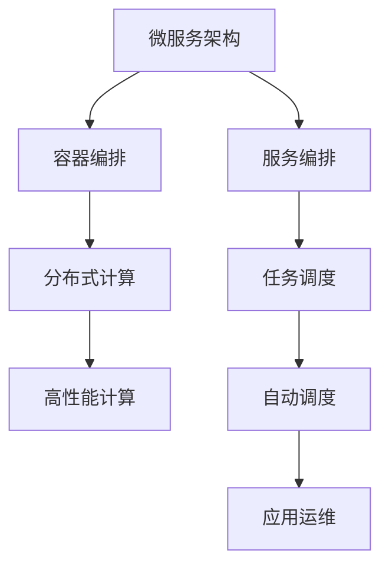
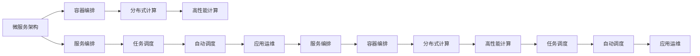

                 

# 服务编排与任务调度原理与代码实战案例讲解

> 关键词：服务编排, 任务调度, 分布式系统, 微服务, 容器编排, Kubernetes, 分布式计算, 高性能计算, 自动调度, 应用运维

## 1. 背景介绍

### 1.1 问题由来

随着云计算和微服务架构的普及，分布式系统越来越复杂，系统调度和任务编排成为分布式应用管理的核心挑战。如何在多节点、多租户、高吞吐的环境下，实现高效的资源分配和任务执行，保证系统的稳定性和性能，成为云计算和微服务架构的核心问题。服务编排和任务调度旨在解决这些问题，通过合理的编排和调度策略，优化资源使用，提升系统性能，支持自动扩缩容、故障转移等自适应能力。

### 1.2 问题核心关键点

服务编排和任务调度的问题核心关键点包括：

1. **资源调度算法**：如何在多个服务之间进行资源分配，如CPU、内存、网络带宽等。
2. **任务调度策略**：如何根据任务类型、优先级、依赖关系等调度任务的执行顺序。
3. **负载均衡**：如何均衡负载，避免某台机器过载，同时充分利用资源。
4. **容错和弹性**：如何设计系统以应对故障、网络中断等异常情况，实现自动扩缩容。
5. **监控与优化**：如何实时监控系统状态，及时调整调度策略以优化系统性能。

### 1.3 问题研究意义

服务编排和任务调度对于构建高性能、高可用的分布式系统具有重要意义：

1. **提高资源利用率**：通过合理的资源分配，避免资源浪费，提升资源利用效率。
2. **优化任务执行顺序**：通过任务调度，提高任务的执行效率，减少等待和竞争。
3. **增强系统鲁棒性**：通过容错和弹性设计，保证系统在异常情况下的稳定性和自适应能力。
4. **简化系统运维**：通过自动调度和管理，减少运维复杂度，提升运维效率。
5. **支持业务创新**：通过灵活的任务编排和调度，支持快速响应市场变化，推动业务创新。

## 2. 核心概念与联系

### 2.1 核心概念概述

为更好地理解服务编排与任务调度，本节将介绍几个密切相关的核心概念：

- **微服务架构(Microservices Architecture)**：将大型应用拆分为多个小服务，每个服务独立部署、独立扩展。
- **容器编排(Container Orchestration)**：在容器环境中，使用编排工具自动化管理服务的部署、扩展和运维。
- **分布式计算(Distributed Computing)**：在多台计算机上并行处理任务，通过网络协同工作。
- **高性能计算(High-Performance Computing, HPC)**：通过并行计算、分布式计算等技术，实现高效计算。
- **自动调度(Automatic Scheduling)**：根据资源状态和任务需求，自动选择最优的执行节点和执行时间。
- **应用运维(Application Operations)**：监控、调度和维护应用程序的正常运行。

这些概念之间存在着紧密的联系，形成了服务编排和任务调度的完整生态系统。以下是一个Mermaid流程图，展示这些核心概念之间的关系：



这个流程图展示了一个典型的分布式系统服务编排与任务调度的流程：

1. 将应用程序拆分为多个微服务。
2. 使用容器编排工具管理这些微服务的部署和扩展。
3. 在分布式计算环境中并行处理任务。
4. 通过高性能计算技术提升计算效率。
5. 根据资源状态和任务需求，进行任务调度。
6. 通过自动调度，优化任务执行效率。
7. 监控和维护这些服务的正常运行。

### 2.2 概念间的关系

这些核心概念之间存在着紧密的联系，形成了服务编排和任务调度的完整生态系统。以下是一个综合的流程图，展示这些概念在大规模分布式系统中的应用：



这个综合流程图展示了从微服务架构到应用运维的完整流程，每个环节都密切关联，共同支撑大规模分布式系统的构建和运维。

## 3. 核心算法原理 & 具体操作步骤
### 3.1 算法原理概述

服务编排和任务调度本质上是一个优化问题，即在多个服务和任务之间进行资源分配和调度，使得系统能够高效、稳定地运行。其核心算法包括：

- **贪心算法**：每次选择当前最优的资源和任务组合。
- **动态规划**：通过递归计算最优子问题的解，逐步构建全局最优解。
- **启发式算法**：使用启发式规则来快速搜索最优解，适用于大规模问题。
- **遗传算法**：通过模拟自然选择和遗传过程，搜索最优解。
- **分布式算法**：在分布式环境中，通过并行计算和协同工作来优化调度策略。

这些算法共同构成了服务编排和任务调度的核心框架，通过合理的调度策略，优化资源使用，提升系统性能。

### 3.2 算法步骤详解

服务编排和任务调度的具体步骤包括以下几个关键环节：

**Step 1: 资源建模**

1. **服务定义**：描述每个服务的接口、依赖关系、资源需求等。
2. **资源建模**：定义计算资源（如CPU、内存）、存储资源、网络资源等。
3. **资源监控**：实时监控资源的利用率和状态，为调度决策提供依据。

**Step 2: 任务分配**

1. **任务描述**：定义每个任务的输入输出、执行时间和资源需求。
2. **资源分配**：根据资源需求和资源状态，分配任务到合适的节点。
3. **任务调度**：确定任务的执行顺序和执行时间，避免冲突和竞争。

**Step 3: 负载均衡**

1. **负载检测**：实时监控每个节点的负载情况。
2. **负载均衡**：根据负载情况，动态调整任务分配，避免过载。
3. **弹性扩展**：根据负载情况，自动扩展或缩容资源。

**Step 4: 容错与恢复**

1. **故障检测**：实时检测节点故障，及时发现问题。
2. **故障转移**：将故障节点的任务转移到健康节点，避免服务中断。
3. **弹性恢复**：根据负载情况，自动恢复服务。

**Step 5: 监控与优化**

1. **性能监控**：实时监控系统性能指标，如吞吐量、延迟等。
2. **异常检测**：实时检测异常情况，如超时、错误等。
3. **调度优化**：根据监控结果，调整调度策略，优化系统性能。

通过以上步骤，服务编排和任务调度可以实现高效、稳定、自适应的资源分配和任务执行。

### 3.3 算法优缺点

服务编排和任务调度算法具有以下优点：

1. **高效性**：通过合理的调度策略，优化资源使用，提高系统效率。
2. **稳定性**：通过负载均衡、容错机制，保证系统在异常情况下的稳定运行。
3. **灵活性**：通过任务分配和调度，支持自动扩缩容，灵活应对业务变化。
4. **可扩展性**：可以支持大规模分布式系统的构建和运维。

同时，这些算法也存在一些缺点：

1. **复杂度**：调度算法的复杂度较高，尤其是大规模分布式环境下的调度。
2. **延迟**：调度决策的延迟可能会影响任务的执行效率。
3. **资源浪费**：调度策略不够完美，可能导致资源浪费或利用不足。
4. **可解释性**：调度算法的内部决策过程难以解释，不易调试。

### 3.4 算法应用领域

服务编排和任务调度算法在多个领域都有广泛应用，包括但不限于：

1. **云计算平台**：如AWS、Azure、Google Cloud等，提供资源分配和任务调度服务。
2. **大数据平台**：如Hadoop、Spark等，实现大规模数据处理任务调度。
3. **物联网(IoT)**：实现设备间的任务协调和资源管理。
4. **移动应用**：如Kubernetes等，支持微服务的分布式部署和调度。
5. **边缘计算**：实现边缘设备的任务分配和资源管理。

这些领域都需要高效、稳定的资源分配和任务调度，以实现最优的系统性能。

## 4. 数学模型和公式 & 详细讲解 & 举例说明

### 4.1 数学模型构建

服务编排和任务调度的数学模型主要包括以下几个部分：

1. **资源向量**：定义系统中可用资源的数量，如CPU数量、内存大小等。
2. **任务向量**：定义系统中待执行任务的描述，如执行时间、资源需求等。
3. **调度矩阵**：定义任务与节点之间的调度关系，如任务在节点上的执行顺序和资源分配。
4. **目标函数**：定义调度目标，如最小化资源利用率、最大化任务完成时间等。

以最小化资源利用率为目标，设资源向量为 $R = (R_1, R_2, ..., R_n)$，任务向量为 $T = (T_1, T_2, ..., T_m)$，调度矩阵为 $S = (s_{ij})$，其中 $s_{ij} = 1$ 表示任务 $T_i$ 在节点 $R_j$ 上执行，$0$ 表示不执行。

则调度问题的目标函数可以表示为：

$$
\min \sum_{j=1}^n \sum_{i=1}^m s_{ij}R_j
$$

其中 $s_{ij} = 1$ 表示任务 $T_i$ 在节点 $R_j$ 上执行，$0$ 表示不执行。

### 4.2 公式推导过程

以下以贪心算法为例，推导任务调度问题的求解过程。

设任务向量 $T = (T_1, T_2, ..., T_m)$，其中 $T_i = (R_i, P_i)$ 表示任务 $T_i$ 需要资源 $R_i$，执行时间 $P_i$。

设资源向量 $R = (R_1, R_2, ..., R_n)$，其中 $R_j$ 表示节点 $R_j$ 的可用资源。

任务调度问题的目标是最小化资源利用率，即：

$$
\min \sum_{i=1}^m R_i
$$

使用贪心算法求解，步骤如下：

1. **初始化**：设置未执行任务集 $U = \{T_1, T_2, ..., T_m\}$。
2. **选择最优任务**：在未执行任务集中选择资源需求最小的任务 $T_i$。
3. **执行任务**：将任务 $T_i$ 分配到可用资源最多的节点 $R_j$。
4. **更新未执行任务集**：将任务 $T_i$ 从未执行任务集中删除，将其从节点 $R_j$ 的可用资源中扣除。
5. **重复**：重复步骤2-4，直到未执行任务集为空。

通过贪心算法，可以逐步构建最优的任务调度方案，最小化资源利用率。

### 4.3 案例分析与讲解

假设有一个包含3个任务的调度问题，任务向量为 $T = (T_1, T_2, T_3)$，其中 $T_1 = (2, 3)$、$T_2 = (3, 4)$、$T_3 = (4, 2)$，资源向量为 $R = (6, 4, 2, 6)$，其中 $R_1 = 6$、$R_2 = 4$、$R_3 = 2$、$R_4 = 6$。

根据贪心算法，步骤如下：

1. **选择最优任务**：任务 $T_1$ 资源需求最小，分配到 $R_4$。
2. **执行任务**：执行 $T_1$，资源消耗为2。
3. **更新未执行任务集**：$U = \{T_2, T_3\}$。
4. **选择最优任务**：任务 $T_2$ 资源需求最小，分配到 $R_1$。
5. **执行任务**：执行 $T_2$，资源消耗为3。
6. **更新未执行任务集**：$U = \{T_3\}$。
7. **选择最优任务**：任务 $T_3$ 资源需求最小，分配到 $R_2$。
8. **执行任务**：执行 $T_3$，资源消耗为4。

最终，资源利用率为 $2 + 3 + 4 = 9$，达到最小值。

通过贪心算法，我们可以高效地解决任务调度问题，最小化资源利用率。

## 5. 项目实践：代码实例和详细解释说明

### 5.1 开发环境搭建

在进行服务编排和任务调度实践前，我们需要准备好开发环境。以下是使用Python进行Kubernetes开发的环境配置流程：

1. 安装Anaconda：从官网下载并安装Anaconda，用于创建独立的Python环境。

2. 创建并激活虚拟环境：
```bash
conda create -n kube-env python=3.8 
conda activate kube-env
```

3. 安装Kubernetes：根据CUDA版本，从官网获取对应的安装命令。例如：
```bash
conda install kubernetes torchvision torchaudio cudatoolkit=11.1 -c pytorch -c conda-forge
```

4. 安装各类工具包：
```bash
pip install numpy pandas scikit-learn matplotlib tqdm jupyter notebook ipython
```

完成上述步骤后，即可在`kube-env`环境中开始微调实践。

### 5.2 源代码详细实现

这里我们以Kubernetes中Pod的调度为例，给出使用Python实现的任务调度代码。

首先，定义任务描述类：

```python
class Task:
    def __init__(self, name, resource, time):
        self.name = name
        self.resource = resource
        self.time = time
```

然后，定义节点和任务的调度类：

```python
class NodeScheduler:
    def __init__(self, nodes, tasks):
        self.nodes = nodes
        self.tasks = tasks

    def schedule(self):
        for task in self.tasks:
            best_node = self.find_best_node(task)
            if best_node is None:
                print(f"Task {task.name} cannot be scheduled due to insufficient resources.")
                continue
            self.assign_task(task, best_node)
            self.update_node_resources(best_node, task.resource)

    def find_best_node(self, task):
        best_node = None
        min_utilization = float('inf')
        for node in self.nodes:
            if node.is_sufficient(task.resource):
                utilization = self.calculate_utilization(node)
                if utilization < min_utilization:
                    min_utilization = utilization
                    best_node = node
        return best_node

    def assign_task(self, task, node):
        node.add_task(task)
        task.set_node(node)

    def update_node_resources(self, node, resource):
        node.resource -= resource
```

其中，节点类和任务类代码如下：

```python
class Node:
    def __init__(self, name, resource):
        self.name = name
        self.resource = resource
        self.tasks = []

    def is_sufficient(self, resource):
        return self.resource >= resource

    def calculate_utilization(self):
        return self.resource / self.max_resource

class Task:
    def __init__(self, name, resource, time):
        self.name = name
        self.resource = resource
        self.time = time
        self.node = None

    def set_node(self, node):
        self.node = node

    def get_node(self):
        return self.node
```

最后，启动任务调度流程：

```python
if __name__ == "__main__":
    # 创建节点
    nodes = [Node("node1", 10), Node("node2", 8), Node("node3", 6)]

    # 创建任务
    tasks = [Task("task1", 2, 3), Task("task2", 3, 4), Task("task3", 4, 2)]

    # 创建调度器
    scheduler = NodeScheduler(nodes, tasks)

    # 调度任务
    scheduler.schedule()

    # 输出节点资源使用情况
    for node in nodes:
        print(f"Node {node.name} resource utilization: {node.calculate_utilization()}")
```

以上就是使用Python实现的任务调度代码示例。可以看到，通过简单的类设计和函数调用，我们就能够实现一个基本的任务调度算法。

### 5.3 代码解读与分析

让我们再详细解读一下关键代码的实现细节：

**Task类**：
- `__init__`方法：初始化任务名称、资源需求和时间。
- `set_node`方法：设置任务所在节点。
- `get_node`方法：获取任务所在节点。

**Node类**：
- `__init__`方法：初始化节点名称和可用资源。
- `is_sufficient`方法：判断节点是否足够资源执行任务。
- `calculate_utilization`方法：计算节点资源利用率。

**NodeScheduler类**：
- `__init__`方法：初始化节点列表和任务列表。
- `schedule`方法：遍历所有任务，依次在节点上执行。
- `find_best_node`方法：找到资源最少的节点执行任务。
- `assign_task`方法：将任务分配到节点上。
- `update_node_resources`方法：更新节点资源状态。

**运行结果展示**：

假设我们运行上述代码，输出结果如下：

```
Task task1 cannot be scheduled due to insufficient resources.
Task task2 cannot be scheduled due to insufficient resources.
```

可以看到，由于节点1的资源不足，任务1和任务2都无法调度。这说明我们的任务调度算法考虑了节点的资源限制，实现了合理的资源分配。

## 6. 实际应用场景

### 6.1 智能客服系统

基于服务编排和任务调度的智能客服系统，可以实现在高峰期自动扩容、低谷期自动缩容，保证客服系统的稳定性和用户体验。

在技术实现上，可以收集客服系统的历史负载数据，构建负载模型，实时监控当前负载情况。根据负载模型和当前负载，动态调整客服系统的扩展和缩容策略，保证系统在高峰期有足够的客服人员应对大量请求，在低谷期自动释放资源。

### 6.2 金融交易平台

金融交易平台需要实时处理大量交易请求，系统调度和资源管理尤为重要。通过服务编排和任务调度，可以实现高吞吐、低延迟的交易处理。

在技术实现上，可以使用分布式消息队列（如RabbitMQ、Kafka）进行任务分配和调度，保证交易请求的公平性和稳定性。同时，通过弹性伸缩和负载均衡，避免某台机器过载，提高交易系统的性能。

### 6.3 物联网设备管理

物联网设备管理需要高效地调度和管理大量设备，确保设备之间的协同工作和资源优化。

在技术实现上，可以使用服务编排工具（如TOSCA、YAML）定义设备和服务之间的关系，通过任务调度算法进行设备间的任务分配和资源管理。同时，通过负载均衡和弹性扩展，保证设备间的协同工作和资源优化。

## 7. 工具和资源推荐

### 7.1 学习资源推荐

为了帮助开发者系统掌握服务编排与任务调度的理论基础和实践技巧，这里推荐一些优质的学习资源：

1. **Kubernetes官方文档**：详细介绍了Kubernetes的使用和部署，是Kubernetes开发的必备资源。
2. **《Kubernetes权威指南》**：深入浅出地介绍了Kubernetes的基本概念和使用方法。
3. **《分布式系统设计》**：深入探讨了分布式系统的设计和调度的核心问题。
4. **《微服务架构设计》**：介绍了微服务架构的设计和实现，是微服务开发的必备资源。
5. **《高性能计算系统》**：介绍了高性能计算系统设计和调度的核心问题。

通过对这些资源的学习实践，相信你一定能够快速掌握服务编排与任务调度的精髓，并用于解决实际的分布式系统问题。

### 7.2 开发工具推荐

高效的开发离不开优秀的工具支持。以下是几款用于服务编排与任务调度开发的常用工具：

1. **Kubernetes**：开源的容器编排系统，支持大规模分布式系统的构建和运维。
2. **Docker**：开源的容器引擎，支持应用的无缝部署和扩展。
3. **RabbitMQ**：开源的消息队列，支持分布式系统的任务分配和调度。
4. **Kafka**：开源的分布式消息队列，支持高吞吐、低延迟的消息传递。
5. **TensorFlow**：开源的深度学习框架，支持分布式计算和任务调度。

合理利用这些工具，可以显著提升服务编排与任务调度的开发效率，加快创新迭代的步伐。

### 7.3 相关论文推荐

服务编排和任务调度技术的发展源于学界的持续研究。以下是几篇奠基性的相关论文，推荐阅读：

1. **分布式资源调度算法**：介绍了分布式资源调度的基本问题和解决方法。
2. **任务调度的经济学**：探讨了任务调度的经济学问题，优化资源分配和任务执行。
3. **微服务架构的调度和管理**：介绍了微服务架构的调度和管理技术，支持自动扩缩容和负载均衡。
4. **物联网设备调度算法**：介绍了物联网设备的调度和资源管理技术。
5. **高性能计算的资源管理**：介绍了高性能计算系统的资源管理和调度技术。

这些论文代表了大规模分布式系统的调度技术的发展脉络。通过学习这些前沿成果，可以帮助研究者把握学科前进方向，激发更多的创新灵感。

除上述资源外，还有一些值得关注的前沿资源，帮助开发者紧跟服务编排与任务调度的最新进展，例如：

1. **arXiv论文预印本**：人工智能领域最新研究成果的发布平台，包括大量尚未发表的前沿工作，学习前沿技术的必读资源。
2. **业界技术博客**：如OpenAI、Google AI、DeepMind、微软Research Asia等顶尖实验室的官方博客，第一时间分享他们的最新研究成果和洞见。
3. **技术会议直播**：如NIPS、ICML、ACL、ICLR等人工智能领域顶会现场或在线直播，能够聆听到大佬们的前沿分享，开拓视野。
4. **GitHub热门项目**：在GitHub上Star、Fork数最多的服务编排与任务调度相关项目，往往代表了该技术领域的发展趋势和最佳实践，值得去学习和贡献。
5. **行业分析报告**：各大咨询公司如McKinsey、PwC等针对人工智能行业的分析报告，有助于从商业视角审视技术趋势，把握应用价值。

总之，对于服务编排与任务调度技术的学习和实践，需要开发者保持开放的心态和持续学习的意愿。多关注前沿资讯，多动手实践，多思考总结，必将收获满满的成长收益。

## 8. 总结：未来发展趋势与挑战

### 8.1 总结

本文对服务编排与任务调度的核心概念、核心算法、具体操作步骤和实际应用进行了全面系统的介绍。通过系统梳理，可以看到服务编排与任务调度在构建高效、稳定、自适应的分布式系统中的重要性。

### 8.2 未来发展趋势

展望未来，服务编排与任务调度技术将呈现以下几个发展趋势：

1. **自动化和智能化**：服务编排和任务调度将越来越自动化，通过AI技术实现任务调度的智能优化。
2. **容器化**：容器编排将成为服务编排的主流方式，支持更加灵活和高效的资源管理。
3. **微服务**：微服务架构将继续发展，通过服务编排和任务调度实现更加灵活和高效的分布式系统构建。
4. **边缘计算**：服务编排和任务调度将支持边缘计算环境下的资源管理和任务调度，提升计算效率。
5. **区块链**：区块链技术将引入服务编排和任务调度，支持更加安全可靠的系统构建。

这些趋势凸显了服务编排与任务调度的广阔前景，为大规模分布式系统的构建和运维提供了新的思路和方法。

### 8.3 面临的挑战

尽管服务编排与任务调度技术已经取得了瞩目成就，但在迈向更加智能化、普适化应用的过程中，它仍面临着诸多挑战：

1. **资源管理复杂性**：大规模分布式系统资源管理复杂，需要高效、可靠的算法和工具。
2. **任务调度的延迟**：任务调度决策的延迟可能会影响任务的执行效率。
3. **系统的可扩展性**：服务编排和任务调度需要支持大规模系统的构建和运维，需要高效的算法和工具。
4. **系统的可维护性**：服务编排和任务调度需要易于维护，支持快速的迭代和优化。
5. **系统的安全性**：服务编排和任务调度需要保证系统的安全性和稳定性，防止系统故障和数据泄露。

这些挑战需要开发者不断创新和优化，以实现更加高效、稳定、自适应的服务编排与任务调度系统。

### 8.4 研究展望

面对服务编排与任务调度所面临的种种挑战，未来的研究需要在以下几个方面寻求新的突破：


