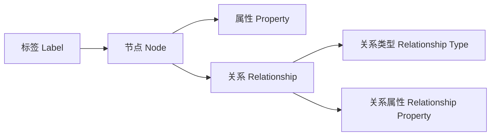

# Neo4j原理与代码实例讲解

## 1. 背景介绍

### 1.1 问题的由来

在当今数据驱动的时代，数据已经成为企业和组织的核心资产之一。随着数据量的快速增长和数据结构的复杂化,传统的关系型数据库在处理高度互连的数据时遇到了一些挑战。这些挑战包括查询效率低下、数据建模复杂以及扩展性差等问题。因此,需要一种新型的数据库系统来更好地管理和利用这些复杂的数据关系。

### 1.2 研究现状

图数据库(Graph Database)作为一种新兴的数据库技术,越来越受到关注和应用。它将数据以节点(Node)和关系(Relationship)的形式存储,非常适合表示和查询高度互连的数据。Neo4j是目前最流行和成熟的开源图数据库之一,它提供了高效的图形查询语言Cypher,以及丰富的数据可视化和分析工具。

### 1.3 研究意义

深入理解Neo4j的原理和实践对于以下几个方面具有重要意义:

1. **数据建模**: 图数据库提供了一种全新的数据建模方式,可以更自然地表示现实世界中的实体及其复杂关系。
2. **查询效率**: 图数据库在处理关系型查询时具有天然的优势,可以大幅提高查询效率。
3. **可扩展性**: Neo4j具有良好的水平扩展能力,可以轻松应对大规模数据场景。
4. **应用场景**: 图数据库在社交网络、推荐系统、知识图谱等领域有着广泛的应用前景。

### 1.4 本文结构

本文将从以下几个方面全面介绍Neo4j:

1. 核心概念与联系
2. 核心算法原理与具体操作步骤
3. 数学模型和公式详细讲解与案例分析
4. 项目实践:代码实例和详细解释说明
5. 实际应用场景
6. 工具和资源推荐
7. 总结:未来发展趋势与挑战
8. 附录:常见问题与解答

## 2. 核心概念与联系

Neo4j作为一种图数据库,其核心概念与传统关系型数据库有着明显的区别。下面我们将介绍Neo4j中的几个关键概念及其相互关系。

1. **节点(Node)**: 节点是图数据库中最基本的单元,用于表示实体对象。每个节点都有一个唯一的ID,以及一组属性(Properties)描述该节点的特征。

2. **关系(Relationship)**: 关系用于连接两个节点,表示它们之间的某种联系。每个关系都有一个关系类型(Relationship Type)描述该关系的语义,以及一组关系属性(Relationship Properties)存储关于该关系的附加信息。

3. **标签(Label)**: 标签是附加在节点上的标记,用于对节点进行分类和过滤。一个节点可以有零个或多个标签。

4. **属性(Property)**: 属性是键值对的形式,用于存储节点或关系的相关信息。属性可以是简单的数据类型(如字符串、数字等),也可以是复杂的数据结构(如列表、对象等)。

通过这些核心概念及其组合,Neo4j可以非常自然地表示现实世界中的各种实体及其复杂关联关系,从而为图形数据建模和查询提供了强大的支持。

## 3. 核心算法原理 & 具体操作步骤

Neo4j的核心算法主要包括图形查询和图形算法两个部分。下面我们将分别介绍它们的原理和具体操作步骤。

### 3.1 算法原理概述

#### 图形查询

Neo4j提供了一种声明式的图形查询语言Cypher,它允许用户使用类似SQL的语法来查询图形数据。Cypher查询的执行过程主要包括以下几个步骤:

1. **查询解析**: 将Cypher查询语句解析为查询计划(Query Plan)。
2. **查询重写**: 对查询计划进行优化,以提高查询效率。
3. **执行引擎**: 执行优化后的查询计划,并返回查询结果。

#### 图形算法

除了图形查询,Neo4j还内置了许多图形算法,用于执行各种图分析任务,如最短路径、中心度计算、社区发现等。这些算法通常基于以下几种核心思想:

1. **遍历算法**: 如深度优先搜索(DFS)、广度优先搜索(BFS)等,用于在图中查找特定的模式或路径。
2. **迭代算法**: 如PageRank、标签传播等,通过迭代更新节点的状态来达到收敛。
3. **近似算法**: 针对NP难题设计的启发式算法,如局部sensitivityheuristic等,用于在合理时间内找到近似最优解。

### 3.2 算法步骤详解

#### Cypher查询执行步骤

1. **查询解析**

   将Cypher查询语句解析为抽象语法树(Abstract Syntax Tree, AST),然后将AST转换为查询计划。查询计划是一个由多个操作符(Operator)组成的树状结构,每个操作符负责执行特定的任务,如扫描节点、过滤、投影等。

2. **查询重写**

   对查询计划进行一系列优化,以提高查询效率。主要包括以下几个步骤:

   - **谓词推导(Predicate Pushdown)**: 将过滤条件尽可能地推导到查询计划的底层,以减少需要处理的数据量。
   - **查询重写规则(Query Rewrite Rules)**: 应用一系列基于规则的重写,如子查询消除、常量折叠等。
   - **索引选择(Index Selection)**: 选择合适的索引来加速查询执行。
   - **连接顺序优化(Join Order Optimization)**: 优化多路连接的执行顺序,以减少中间结果的大小。
   - **并行化(Parallelization)**: 将查询计划的某些部分并行化,以利用多核CPU的计算能力。

3. **执行引擎**

   执行优化后的查询计划,并返回查询结果。Neo4j采用了一种基于管道(Pipeline)的执行模型,每个操作符都是一个独立的线程,通过管道传递数据。这种模型可以充分利用CPU和内存资源,提高查询执行效率。

#### PageRank算法步骤

PageRank是一种常用的图形算法,用于计算节点的重要性得分。它的基本思想是,一个节点的重要性不仅取决于它自身,还取决于指向它的节点的重要性。PageRank算法的执行步骤如下:

1. 初始化每个节点的PageRank值为 $\frac{1}{N}$,其中N是图中节点的总数。
2. 计算每个节点的出度(OutDegree),即指向其他节点的边的数量。
3. 迭代执行以下步骤,直到PageRank值收敛:
   - 对于每个节点 $v_i$,计算它的新PageRank值:
     $$PR(v_i) = (1 - d) + d \sum_{v_j \in In(v_i)} \frac{PR(v_j)}{OutDegree(v_j)}$$
     其中 $In(v_i)$ 表示指向节点 $v_i$ 的所有节点集合, $d$ 是一个阻尼系数(通常取值0.85),用于调节全局重要性和局部重要性的权重。
4. 返回最终的PageRank值作为每个节点的重要性得分。

### 3.3 算法优缺点

#### Cypher查询

**优点**:

- 声明式语法,易于理解和使用。
- 支持图形模式匹配,可以方便地查询复杂的图形结构。
- 内置了多种函数和聚合操作,提高了查询表达能力。

**缺点**:

- 对于复杂的查询,性能可能不如手写代码高效。
- 缺乏对并行执行的直接控制,难以充分利用多核CPU。
- 对于不同的查询模式,需要手动调整查询语句以获得最佳性能。

#### PageRank算法

**优点**:

- 算法思路简单,易于理解和实现。
- 可以有效地计算出节点的重要性得分。
- 具有良好的收敛性,通常只需要少数迭代次数即可收敛。

**缺点**:

- 对于动态变化的图,需要重新计算所有节点的PageRank值,计算开销较大。
- 算法假设图是强连通的,对于非强连通图的处理效果可能不佳。
- 算法无法区分不同类型的链接,对所有链接赋予相同的权重。

### 3.4 算法应用领域

#### Cypher查询

Cypher查询语言广泛应用于各种基于图形数据的查询场景,包括但不限于:

- **社交网络分析**: 查找朋友关系、发现社区结构等。
- **推荐系统**: 基于用户的兴趣和行为进行个性化推荐。
- **知识图谱**: 构建和查询知识图谱,支持语义查询和推理。
- **欺诈检测**: 发现异常行为模式和欺诈网络。
- **网络和IT运维**: 管理和优化复杂的网络拓扑结构。

#### PageRank算法

PageRank算法最初是用于网页排名,但它的应用范围远不止于此。一些典型的应用场景包括:

- **社交网络分析**: 计算用户的影响力和重要性。
- **学术引文分析**: 评估论文和作者的重要性。
- **垃圾邮件检测**: 识别可疑的垃圾邮件发送者。
- **系统故障诊断**: 发现关键的故障节点。
- **生物信息学**: 分析蛋白质互作网络中的关键蛋白质。

## 4. 数学模型和公式 & 详细讲解 & 举例说明

在图形数据库中,数学模型和公式扮演着重要的角色,用于描述和分析图形结构及其性质。在这一部分,我们将介绍一些常见的数学模型和公式,并通过具体案例进行详细讲解。

### 4.1 数学模型构建

#### 图形表示

图 $G$ 可以用一个二元组 $(V, E)$ 来表示,其中 $V$ 是节点集合,而 $E$ 是边集合。对于有向图,边 $e \in E$ 是一个有序对 $(u, v)$,表示从节点 $u$ 到节点 $v$ 的一条有向边。对于无向图,边 $e \in E$ 是一个无序对 $\{u, v\}$,表示节点 $u$ 和 $v$ 之间存在一条无向边。

#### 邻接矩阵

邻接矩阵(Adjacency Matrix)是表示图形结构的一种常用方式。对于一个有 $n$ 个节点的图 $G$,其邻接矩阵 $A$ 是一个 $n \times n$ 的矩阵,其中 $A_{ij}$ 表示从节点 $i$ 到节点 $j$ 的边的权重(如果不存在边,则为0)。对于无权图,如果存在边 $(i, j)$,则 $A_{ij} = 1$,否则为0。

#### 度数

节点的度数(Degree)是一个重要的图形指标,用于衡量节点的重要性。对于有向图,我们定义入度(In-Degree)和出度(Out-Degree):

- 入度 $deg^-(v)$ 表示指向节点 $v$ 的边的数量。
- 出度 $deg^+(v)$ 表示从节点 $v$ 指出的边的数量。

对于无向图,节点的度数 $deg(v)$ 是指与该节点相连的边的数量。

### 4.2 公式推导过程

#### PageRank公式推导

PageRank算法的核心思想是,一个节点的重要性不仅取决于它自身,还取决于指向它的节点的重要性。我们用 $PR(v)$ 表示节点 $v$ 的PageRank值,则有:

$$PR(v) = (1 - d) + d \sum_{u \in In(v)} \frac{PR(u)}{OutDegree(u)}$$

其中:

- $In(v)$ 表示指向节点 $v$ 的所有