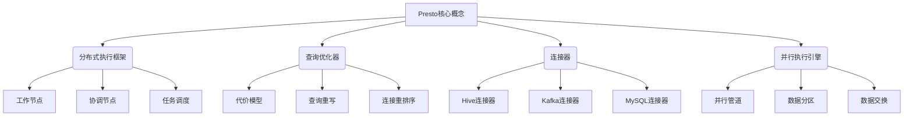

# Presto原理与代码实例讲解

## 1. 背景介绍

### 1.1 问题的由来

在大数据时代,我们面临着海量数据的存储和分析挑战。传统的数据库系统在处理大规模数据集时,往往会遇到性能瓶颈和可扩展性问题。为了解决这一难题,分布式查询引擎应运而生。其中,Presto作为一款开源的大数据分析引擎,凭借其高效、灵活和易于扩展的特性,备受关注。

### 1.2 研究现状

Presto最初由Facebook公司开发,旨在提供快速、高效的大数据分析能力。它采用了分布式架构,可以在多个节点上并行执行查询,从而实现高吞吐量和低延迟。目前,Presto已被多家知名公司(如Netflix、Airbnb和Uber)广泛使用,成为大数据分析领域的重要工具之一。

### 1.3 研究意义

深入理解Presto的原理和实现细节,对于优化大数据分析性能、提高查询效率至关重要。本文将全面剖析Presto的核心概念、算法原理、数学模型,并通过代码实例和应用场景,帮助读者掌握Presto的使用和开发技巧,为大数据分析项目提供有力支持。

### 1.4 本文结构

本文将从以下几个方面全面介绍Presto:

1. 核心概念与联系
2. 核心算法原理与具体操作步骤
3. 数学模型和公式详细讲解与举例说明
4. 项目实践:代码实例和详细解释说明
5. 实际应用场景
6. 工具和资源推荐
7. 总结:未来发展趋势与挑战
8. 附录:常见问题与解答

## 2. 核心概念与联系

Presto的核心概念主要包括以下几个方面:

1. **分布式执行框架**: Presto采用主从架构,由协调节点和工作节点组成。协调节点负责接收查询请求、解析查询计划并将任务分发给工作节点。工作节点执行具体的查询任务,并将结果返回给协调节点。

2. **查询优化器**: 查询优化器负责优化查询执行计划,以提高查询性能。它包括代价模型、查询重写和连接重排序等功能,旨在生成最优的执行计划。

3. **连接器**: Presto支持通过连接器访问各种数据源,如Hive、Kafka、MySQL等。连接器负责将外部数据源的数据映射到Presto内部表示。

4. **并行执行引擎**: Presto的并行执行引擎采用了管道化执行模型,通过并行管道、数据分区和数据交换等技术,实现高效的分布式查询执行。

这些核心概念相互关联、协同工作,共同构建了Presto高效、灵活的分布式查询引擎。

## 3. 核心算法原理 & 具体操作步骤

### 3.1 算法原理概述

Presto的核心算法原理主要包括以下几个方面:

1. **查询解析和优化**: Presto首先将SQL查询语句解析为逻辑执行计划,然后通过查询优化器进行一系列优化,生成物理执行计划。

2. **分布式执行**: Presto将物理执行计划分解为多个阶段(Stage),每个阶段由多个任务(Task)组成。这些任务被分发到不同的工作节点上并行执行。

3. **数据交换**: 在执行过程中,不同阶段之间需要进行数据交换。Presto采用了高效的数据交换算法,通过动态分区和重新分区等技术,实现数据的高效传输。

4. **内存管理**: Presto采用基于组块(Block)的内存管理策略,通过有效利用内存和磁盘,实现高效的数据处理。

5. **代码生成**: Presto使用了代码生成技术,在运行时动态生成高度优化的代码,提高查询执行效率。

### 3.2 算法步骤详解

1. **查询解析**

   Presto首先将SQL查询语句解析为抽象语法树(AST),然后将AST转换为逻辑执行计划。

2. **查询优化**

   查询优化器对逻辑执行计划进行一系列优化,包括:
   - 代价模型:基于统计信息估算每个操作的代价,以确定最优执行计划。
   - 查询重写:应用等价规则重写查询,如谓词下推、投影剪裁等。
   - 连接重排序:确定连接顺序,以最小化数据传输和计算开销。

3. **物理计划生成**

   根据优化后的逻辑执行计划,生成分布式的物理执行计划。

4. **任务调度**

   Presto将物理执行计划分解为多个阶段,每个阶段包含多个任务。协调节点根据工作节点的负载情况,将任务分发到不同的工作节点上执行。

5. **本地执行**

   工作节点接收到任务后,将其分解为多个操作符(Operator),并通过管道化执行模型依次执行这些操作符。

6. **数据交换**

   在执行过程中,不同阶段之间需要进行数据交换。Presto采用动态分区和重新分区等技术,实现高效的数据传输。

7. **结果归并**

   工作节点将执行结果返回给协调节点,协调节点将这些结果进行归并,得到最终查询结果。

### 3.3 算法优缺点

**优点**:

- 高效:采用分布式架构和并行执行,能够高效处理大规模数据。
- 灵活:支持多种数据源,可以轻松集成到现有的大数据生态系统中。
- 可扩展:通过添加更多节点,可以线性扩展计算能力。
- 内存高效:基于组块的内存管理策略,有效利用内存和磁盘资源。

**缺点**:

- 不支持事务和更新操作:Presto主要面向分析查询,不支持事务和更新操作。
- 元数据管理有限:Presto的元数据管理能力相对有限,主要依赖于外部数据源的元数据。
- 调优复杂:由于涉及分布式执行和查询优化等多个方面,调优和故障排查相对复杂。

### 3.4 算法应用领域

Presto主要应用于以下几个领域:

1. **交互式分析**:Presto能够快速响应ad-hoc查询,支持交互式数据探索和分析。
2. **大数据ETL**:Presto可以高效地从各种数据源提取数据,用于构建数据仓库或数据湖。
3. **机器学习和人工智能**:Presto可以快速处理大规模数据集,为机器学习和人工智能应用提供支持。
4. **业务智能(BI)**:Presto可以与BI工具集成,为企业提供实时数据分析和可视化。

## 4. 数学模型和公式 & 详细讲解 & 举例说明

### 4.1 数学模型构建

在Presto中,查询优化器需要估算每个操作的代价,以确定最优执行计划。这涉及到代价模型的构建。Presto采用了基于统计信息的代价模型,主要考虑以下几个因素:

1. **数据统计信息**
   - 表的行数 $N$
   - 列的基数 $V$
   - 数据大小 $D$

2. **操作代价**
   - CPU代价 $C_{cpu}$
   - IO代价 $C_{io}$
   - 网络代价 $C_{net}$

3. **硬件资源**
   - CPU性能 $P_{cpu}$
   - IO性能 $P_{io}$
   - 网络带宽 $P_{net}$

基于上述因素,Presto构建了一个综合代价模型,用于估算每个操作的执行代价:

$$
C = \alpha_1 \frac{C_{cpu}}{P_{cpu}} + \alpha_2 \frac{C_{io}}{P_{io}} + \alpha_3 \frac{C_{net}}{P_{net}}
$$

其中,$ \alpha_1 $、$ \alpha_2 $、$ \alpha_3 $为权重系数,用于调整不同因素的重要性。

### 4.2 公式推导过程

以连接操作为例,我们可以推导出其代价公式。假设有两个表 $R$ 和 $S$,其行数分别为 $N_R$ 和 $N_S$,连接属性的基数分别为 $V_R$ 和 $V_S$。

1. **计算连接操作的CPU代价**

   连接操作的CPU代价主要包括:
   - 构建连接数据结构的代价 $C_{build}$
   - 探查连接数据结构的代价 $C_{probe}$

   $$
   C_{cpu} = C_{build} + C_{probe} = N_R \cdot \log V_R + N_R \cdot N_S / \max(V_R, V_S)
   $$

2. **计算连接操作的IO代价**

   假设表 $R$ 和 $S$ 的数据大小分别为 $D_R$ 和 $D_S$,则IO代价为:

   $$
   C_{io} = D_R + D_S
   $$

3. **计算连接操作的网络代价**

   假设数据需要在 $n$ 个节点之间传输,每个节点需要传输的数据量为 $\frac{N_R + N_S}{n}$,则网络代价为:

   $$
   C_{net} = \frac{N_R + N_S}{n}
   $$

4. **综合代价模型**

   将上述代价合并,我们可以得到连接操作的综合代价模型:

   $$
   C = \alpha_1 \left( \frac{N_R \cdot \log V_R + N_R \cdot N_S / \max(V_R, V_S)}{P_{cpu}} \right) + \alpha_2 \left( \frac{D_R + D_S}{P_{io}} \right) + \alpha_3 \left( \frac{N_R + N_S}{n \cdot P_{net}} \right)
   $$

通过上述公式,查询优化器可以估算不同连接顺序和执行策略的代价,从而选择最优的执行计划。

### 4.3 案例分析与讲解

假设我们有一个查询,需要连接三个表 $A$、$B$ 和 $C$,其中:

- 表 $A$ 有 $10^9$ 行,连接属性基数为 $10^6$,数据大小为 $1TB$
- 表 $B$ 有 $10^8$ 行,连接属性基数为 $10^5$,数据大小为 $100GB$
- 表 $C$ 有 $10^7$ 行,连接属性基数为 $10^4$,数据大小为 $10GB$

我们需要评估两种不同的连接顺序:

1. $(A \Join B) \Join C$
2. $(B \Join C) \Join A$

**连接顺序 1: $(A \Join B) \Join C$**

- 计算 $A \Join B$ 的代价:

  $$
  \begin{aligned}
  C_{cpu} &= 10^9 \cdot \log 10^6 + 10^9 \cdot 10^8 / 10^6 \approx 2.8 \times 10^{10} \
  C_{io} &= 1TB + 100GB \approx 1.1TB \
  C_{net} &= \frac{10^9 + 10^8}{n} \
  C_1 &= \alpha_1 \left( \frac{2.8 \times 10^{10}}{P_{cpu}} \right) + \alpha_2 \left( \frac{1.1TB}{P_{io}} \right) + \alpha_3 \left( \frac{1.1 \times 10^9}{n \cdot P_{net}} \right)
  \end{aligned}
  $$

- 计算 $(A \Join B) \Join C$ 的代价:

  $$
  \begin{aligned}
  C_{cpu} &= 10^7 \cdot \log 10^4 + 1